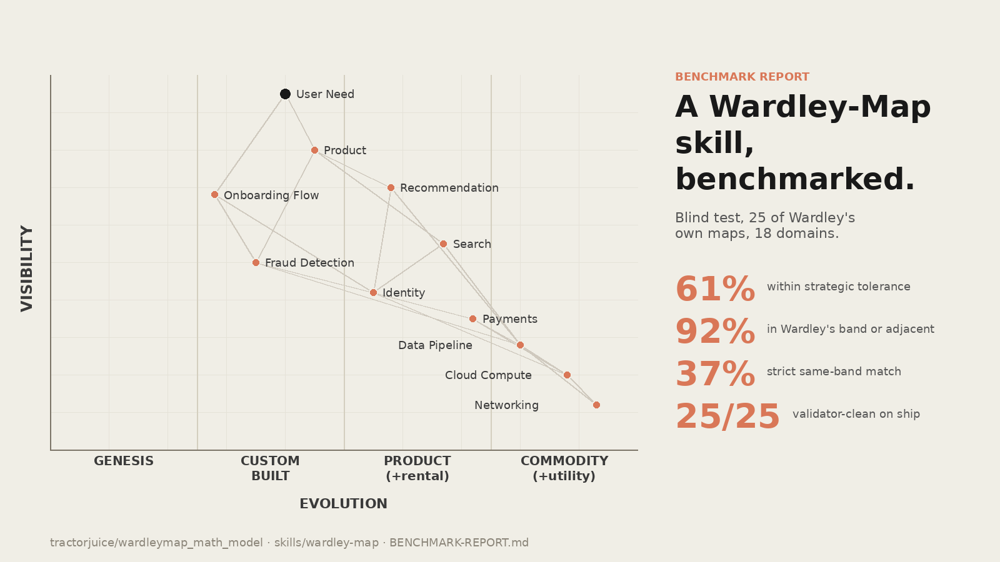

# The Wardley Map Skill: What It Is, How We Tested It, What the Benchmark Found

We built a Claude Code skill that generates a Wardley Map from a plain-English scenario description, and then we benchmarked it blind against 25 of Simon Wardley's own published maps. This article walks through the skill's architecture, the test methodology, and what the benchmark actually shows.

## What the skill is

`wardley-map` is a portable skill package. Install it by copying the directory into `~/.claude/skills/` and invoke it with `/wardley-map <scenario>`.

The package has five parts:

1. **`SKILL.md`**: the seven-step procedure a subagent follows. Identify components and anchors, build dependency edges, seed visibility from graph distance, score evolution against Wardley's cheat sheet, apply targeted deep placement where judgment is shaky, verify with the validator and layout check, then emit a strategic analysis. Each step is prescriptive; the skill is not a free-form generator.

2. **`references/`**: seven bundled reference files loaded on demand. The 19-row cheat sheet (with a 4-row fast path and a new concrete-indicator checklist per stage). 27 climatic patterns across 6 categories. 40 doctrine principles. 61 gameplays. 17 forms of inertia. Three worked examples (tea shop, freelance marketplace, SaaS). Condensed formalism of the underlying tuple.

3. **`scripts/validate_owm.mjs`**: a Node validator that checks three hard rules on every draft before ship. Every coordinate in `[0, 1]`. Every edge endpoint is a declared component or anchor. For every edge `a -> b`, `ν(a) ≥ ν(b)` (the visibility hard rule). Exits non-zero on violation. The skill iterates validator, fix, validator until clean.

4. **`scripts/check_layout.mjs`**: an advisory layout check that catches visual-render problems the structural validator cannot see. Near-duplicate coordinates (two nodes that would render on top of each other). Components landing on stage boundaries (ε on exactly 0.25, 0.50, 0.75). Anchors or nodes at canvas edges that will clip. Stage-distribution imbalance.

5. **`scripts/owm_to_mermaid.mjs`**: a converter that emits a Mermaid `wardley-beta` block from the validated OWM draft, so the map renders inline on GitHub.

The output of a skill invocation is three things in one file: the OWM text (round-trips to [onlinewardleymaps.com](https://onlinewardleymaps.com) and `create.wardleymaps.ai`), a Mermaid `wardley-beta` block (renders on GitHub), and a strategic analysis in eight sections keyed to the map.

## How we tested it

The benchmark question was narrow: when the skill is given a free-form scenario, how close does the resulting map come to a map Simon Wardley himself produced on the same topic?

**Corpus.** 25 maps from [swardley/WARDLEY-MAP-REPOSITORY](https://github.com/swardley/WARDLEY-MAP-REPOSITORY), CC-BY-SA, spanning 18 domains (AI governance, retail, healthcare, finance, manufacturing, cybersecurity, agriculture, education, gaming, sustainability, construction, culture, defence, energy, government, personal, politics, telecoms, transportation).

**Held-out blind design.** For each map, a human wrote a natural-language scenario prompt that stated the topic, named the stakeholders, and hinted at scope. The prompt did not expose Wardley's component names or placements. A subagent was then spawned with the scenario and the skill path, and explicitly instructed not to read the reference file. The subagent ran the full 7-step procedure. Only after it emitted a validator-clean map was the output compared to Wardley's reference.

**Metrics.** Placement agreement has no single number; we report four complementary views.

1. **Strict same-band.** Does the generated map place a matched component in the same evolution quartile (Genesis, Custom, Product, Commodity) as Wardley?
2. **Within one band.** Same, but soft: band indices differ by at most one.
3. **Absolute placement error `|Δε|`.** Continuous distance on the evolution axis, regardless of band, with a cumulative distribution across thresholds.
4. **Directional bias.** Mean signed `Δε` and `Δν` across matched components: does the skill systematically place things right of where Wardley did, or below?

Fuzzy name matching links components between the two maps: exact, substring, Jaccard word-overlap, or difflib ratio above 0.55. This is a lower bound on coverage; some semantically equivalent components do not match, and a handful of false positives inflate disagreement artificially.

**Noise floor.** The 4-row cheat-sheet method has inherent quantisation. Each row flipping one stage shifts mean ε by 0.0625, so a `|Δε|` of roughly 0.10 is within the method's own resolution. Tighter agreement than 0.10 is not what the scoring method can reliably deliver.

## What the benchmark found

Across 25 maps, 358 matched component pairs:

- **61% of matched components land within strategic tolerance** (`|Δε| ≤ 0.20`). The build / buy / utility call doesn't change.
- **92% are in Wardley's band or an adjacent one**.
- **37% are in exactly the same stage band**.
- **28% are within scoring noise** (`|Δε| ≤ 0.10`).
- **ε-bias: +0.009 across 25 domains**. Effectively zero. The skill does not systematically over- or under-industrialise in aggregate.
- **ν-bias: +0.079**. Down from +0.22 before the visibility seed was changed from reciprocal to exponential. Small residual positive bias.
- **Structural validity: 25 of 25**. Every first-draft map had at least one validator violation on first pass; iterative fix-and-rerun produced 25 validator-clean shipped maps.

The short version: the skill is a **coarse-map generator, not a precision-map generator**. Strategic framing agrees with Wardley the majority of the time. Fine-grained coordinate agreement does not, but the cheat-sheet method has inherent 0.10 resolution so expecting tighter is unrealistic.

**The weak spot.** Coverage sits at 37%. The skill names about 1 in 3 of Wardley's components. The missing two-thirds are disproportionately Wardley's distinctive vocabulary: abstract nouns like "Perceived Risk", "Asymmetric Access", "Believed", "Sovereignty", "OUTPUT", "ACCESS". The skill reaches for operational equivalents instead. For archival-grade fidelity to Wardley's style this is the biggest gap; for practitioner use it mostly does not matter.

**The time-drift confound.** Several maps carry 2022 or 2023 dates. The skill is asked to score in 2026, with 2026 priors. Some placements legitimately diverge from the reference because the component has evolved in the intervening years. The benchmark cannot disentangle skill error from legitimate drift; both appear as `Δε`. Bimodal bias per map (forward drift on some, overshoot on others, aggregate near zero) is consistent with drift plus Wardley's own idiosyncratic judgment, not a systematic skill defect.

## What we changed after the first benchmark, and what happened

**v2.** After the initial 25-map run, we ported a set of concrete per-stage indicator checklists from [tractorjuice/arc-kit](https://github.com/tractorjuice/arc-kit)'s own wardley-mapping skill. Four indicators (ubiquity, certainty, market, failure mode) per stage. When all four agree on a single stage for a component, the skill skips the 4-row cheat-sheet aggregate and takes the single pick. When they diverge, the aggregate runs as before. On a 6-map subset, v2 tightened aggregate `|Δε|` by 12%.

**v3.** We re-ran 20 of the 25 maps with v2, now also emitting the Mermaid `wardley-beta` block per invocation. Aggregate `|Δε|` improvement against v1 held at 4% on the larger sample (the 6-map number had overstated it). Same-band agreement rose 4.1 percentage points. Coverage preserved. 20 of 20 maps emitted both OWM and Mermaid blocks; 20 of 20 passed the validator.

**§5.6 layout check.** A static analysis pass that catches issues the validator cannot: near-duplicate coordinates (two nodes rendering on top of each other), stage-boundary straddles, canvas clipping, stage imbalance. Audited across the 20 v3 drafts, it flagged 145 warnings. The most serious category was 42 collision pairs: components the skill had placed at literally identical coordinates. On a follow-up re-run of the 5 worst-offender maps with the layout check built into the procedure, total warnings dropped from 60 to 1 (98% reduction) while structural validity and placement agreement both held.

## What this means

The evidence is narrow. 25 maps by a single author, single-run, the last re-run on 20 of them. Error bars are in the ±3-5 percentage-point range for aggregate metrics and wider per map. The corpus measures faithfulness to Wardley, not to ground truth.

Within those limits, the skill reaches the same strategic call as Wardley about 60% of the time on matched components, stays within one evolution band 92% of the time, and ships validator-clean. That is coarse mapping, which is what Wardley says maps are for: a thinking tool, not a measurement instrument. For practitioner use in build-vs-buy, commoditisation, and doctrine-check reasoning, the skill is useful. For precision-placement audits against Wardley's personal style, it's not.

The skill, the benchmark, the 25 reference maps, every iteration's output, the validator and converter scripts, and the full methodology are in [tractorjuice/wardleymap_math_model](https://github.com/tractorjuice/wardleymap_math_model). `BENCHMARK-REPORT.md` is the primary document; `BENCHMARK-METHODOLOGY.md` describes the test harness in detail.
