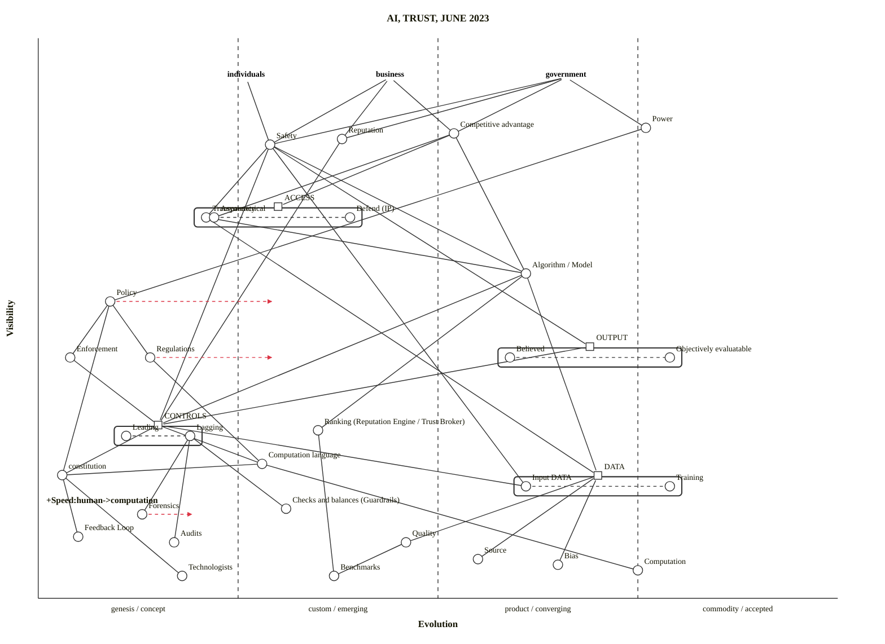

# ai-trust (Wardley reference, Mermaid rendering)

Source: [`/workspaces/wardleymap_math_model/skills/wardley-map-workspace/arc-kit-compare/eval-ai-trust/wardley-reference.owm`](../../../skills/wardley-map-workspace/arc-kit-compare/eval-ai-trust/wardley-reference.owm)

Converted from OWM via `scripts/owm_to_mermaid.py` — a Python port of [tractorjuice/arc-kit's convert.mjs](https://github.com/tractorjuice/arc-kit/blob/main/tests/mermaid-wardley/convert.mjs). Strategy: always double-quote names (STRING terminal in the grammar), which sidesteps keyword-collisions and hyphen/arrow lexer issues. Pipelines detected via `pipeline X [min, max]` + same-visibility component proximity.

