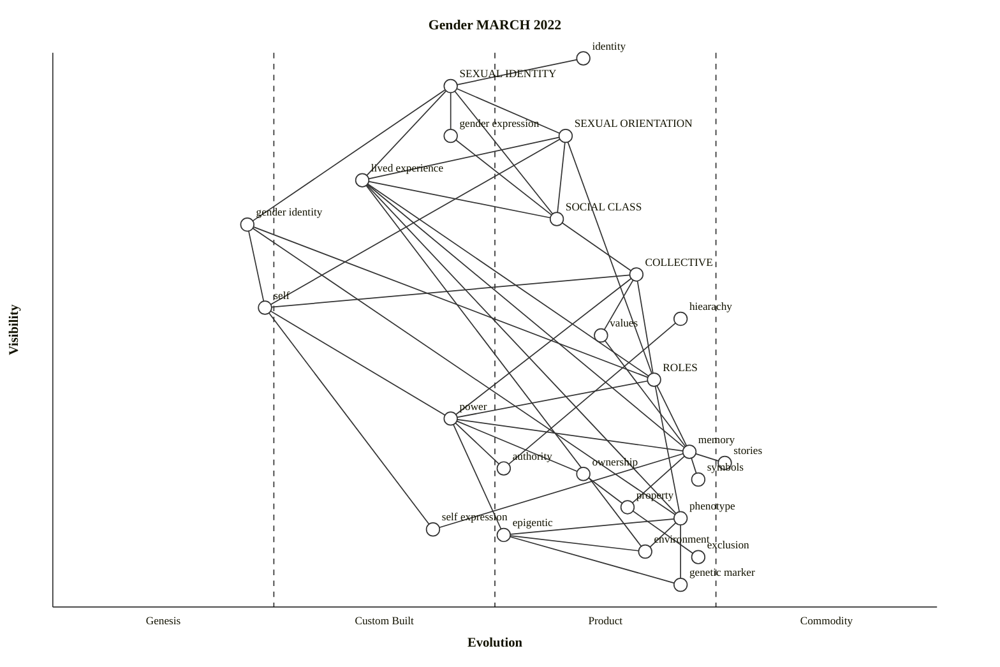

# culture-gender (Wardley reference, Mermaid rendering)

Source: [`/workspaces/wardleymap_math_model/skills/wardley-map-workspace/arc-kit-compare/eval-culture-gender/wardley-reference.owm`](../../../skills/wardley-map-workspace/arc-kit-compare/eval-culture-gender/wardley-reference.owm)

Converted from OWM via `scripts/owm_to_mermaid.py`. Some edges may be dropped if endpoints weren't declared in the source (Wardley sometimes names components in edges that don't appear in the declaration list).

