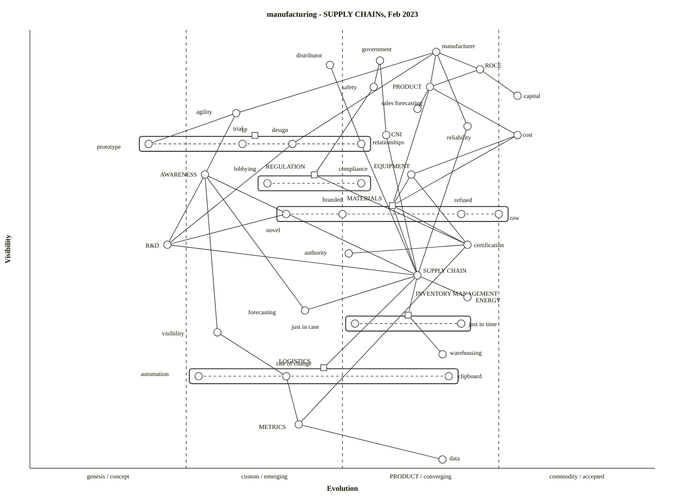

# manufacturing (Wardley reference, Mermaid rendering)

Source: [`/workspaces/wardleymap_math_model/skills/wardley-map-workspace/arc-kit-compare/eval-manufacturing/wardley-reference.owm`](../../../skills/wardley-map-workspace/arc-kit-compare/eval-manufacturing/wardley-reference.owm)

Converted from OWM via `scripts/owm_to_mermaid.mjs` (Node) — port of [arc-kit's convert.mjs](https://github.com/tractorjuice/arc-kit/blob/main/tests/mermaid-wardley/convert.mjs) with added explicit-block pipeline handling, evolution-stage quoting, and `label [dx, dy]` preservation on both top-level and pipeline-child components. All names double-quoted because mermaid's `NAME_WITH_SPACES` terminal excludes hyphens and lexes keywords like `label`/`evolve` eagerly as prefixes; quoting uses the `STRING` alternative and accepts any text verbatim.

