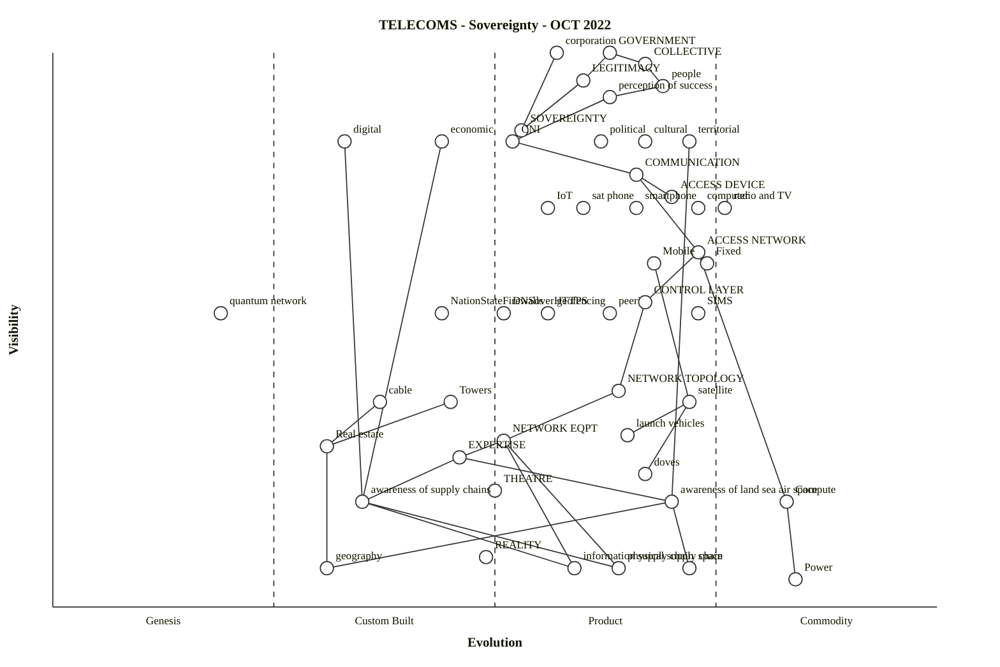

# telecoms-sovereignty (Wardley reference, Mermaid rendering)

Source: [`/workspaces/wardleymap_math_model/skills/wardley-map-workspace/arc-kit-compare/eval-telecoms-sovereignty/wardley-reference.owm`](../../../skills/wardley-map-workspace/arc-kit-compare/eval-telecoms-sovereignty/wardley-reference.owm)

Converted from OWM via `scripts/owm_to_mermaid.py`.

