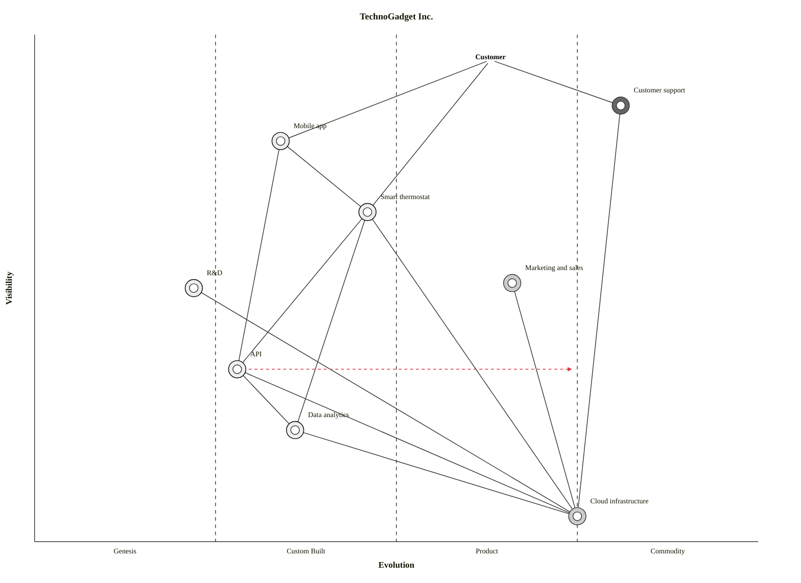

# Wardley Mapping Examples

## Example 1: E-Commerce Platform

### Map

```text
Title: Online Retail Platform
Anchor: Customer needs to purchase products online
Date: YYYY-MM-DD

                    Genesis    Custom     Product    Commodity
                       │          │          │          │
Visible            ┌───┼──────────┼──────────┼──────────┼───┐
                   │   │          │          │          │   │
                   │   │  ● Customer Experience          │   │
                   │   │  │                              │   │
                   │   │  ├──────────────────┐           │   │
                   │   │  │                  │           │   │
                   │   │  ↓                  ↓           │   │
                   │   │  ● Product         ● Shopping  │   │
                   │   │    Recommendations   Cart       │   │
                   │   │    │                 │          │   │
                   │   │    │                 │          │   │
                   │   │    ↓                 ↓          │   │
                   │   │    ●────────────────●──────────→●  │
                   │   │    Personalization  Checkout    │   │
                   │   │    Engine           │           │   │
                   │   │    │                │           │   │
Hidden             │   │    │                ↓           │   │
                   │   │    │                ● Payment──→●  │
                   │   │    │                  Gateway   │   │
                   │   │    │                │           │   │
                   │   │    ↓                ↓           │   │
                   │   │    ●────────────────●──────────→●  │
                   │   │    Customer Data    Cloud       │   │
                   │   │                     Compute     │   │
                   └───┴──────────────────────────────────┘

Legend: ● Current position, → Evolution direction
```

### Analysis

```yaml
e_commerce_analysis:
  anchor:
    user: "Online shopper"
    need: "Purchase products conveniently online"

  components:
    customer_experience:
      evolution: "Custom"
      position: 0.35
      notes: "Differentiating, unique brand experience"

    product_recommendations:
      evolution: "Custom → Product"
      position: 0.40
      movement: "evolving"
      notes: "ML-based, moving toward productized solutions"

    personalization_engine:
      evolution: "Custom"
      position: 0.30
      notes: "Key differentiator, in-house built"
      depends_on: ["customer_data"]

    shopping_cart:
      evolution: "Product"
      position: 0.65
      notes: "Many solutions available, configure don't build"

    checkout:
      evolution: "Product → Commodity"
      position: 0.70
      movement: "evolving"
      notes: "Standard patterns, increasingly commoditized"

    payment_gateway:
      evolution: "Commodity"
      position: 0.85
      notes: "Stripe, Adyen - utility services"

    customer_data:
      evolution: "Custom"
      position: 0.35
      notes: "Proprietary, valuable for personalization"

    cloud_compute:
      evolution: "Commodity"
      position: 0.90
      notes: "AWS, Azure - utility"

  strategic_insights:
    opportunities:
      - "Double down on personalization as differentiator"
      - "Commoditize checkout to reduce cost"
      - "Use customer data to improve recommendations"

    threats:
      - "Amazon's personalization superiority"
      - "Recommendation engines becoming commoditized"

    recommendations:
      - action: "Invest in personalization engine"
        rationale: "Key differentiator, not yet commoditized"

      - action: "Migrate to SaaS checkout"
        rationale: "No competitive advantage in custom checkout"

      - action: "Build customer data platform"
        rationale: "Enables differentiation in personalization"
```

### Quantitative Positioning

Applying evolution scoring and decision metrics (see [Mathematical Models](mathematical-models.md)) to validate the qualitative analysis above.

#### Evolution Scoring

| Component | Ubiquity (U) | Certainty (C) | E(c) = (U+C)/2 | Stage | Qualitative Match? |
|-----------|-------------|---------------|-----------------|-------|--------------------|
| Customer Experience | 0.40 | 0.30 | 0.35 | Custom | Yes (0.35 in analysis) |
| Personalization Engine | 0.25 | 0.35 | 0.30 | Custom | Yes (0.30 in analysis) |
| Shopping Cart | 0.75 | 0.70 | 0.73 | Product | Close (0.65 in analysis — could revise up) |
| Payment Gateway | 0.90 | 0.85 | 0.88 | Commodity | Close (0.85 in analysis) |
| Cloud Compute | 0.95 | 0.90 | 0.93 | Commodity | Close (0.90 in analysis) |

The scoring confirms most qualitative positions. Shopping Cart scores higher (0.73) than the qualitative estimate (0.65) — suggesting it may be further toward commodity than initially assessed.

#### Decision Metrics

| Component | Visibility | Evolution | D(v) Differentiation | K(v) Commodity Leverage | Verdict |
|-----------|-----------|-----------|----------------------|------------------------|---------|
| Customer Experience | 0.90 | 0.35 | **0.59** | 0.07 | Invest to differentiate |
| Personalization Engine | 0.55 | 0.30 | **0.39** | 0.32 | Invest — key differentiator |
| Shopping Cart | 0.70 | 0.73 | 0.19 | 0.22 | Buy/configure — standard |
| Payment Gateway | 0.40 | 0.88 | 0.05 | **0.53** | Outsource |
| Cloud Compute | 0.15 | 0.93 | 0.01 | **0.79** | Consume as utility |

#### Dependency Risk

| Dependency | R(a,b) | Risk Level |
|-----------|--------|------------|
| Customer Experience → Personalization Engine | 0.90 × (1 - 0.30) = **0.63** | High — visible component depends on immature tech |
| Checkout → Payment Gateway | 0.70 × (1 - 0.88) = **0.08** | Low — mature dependency |

The high dependency risk (0.63) between Customer Experience and the Personalization Engine confirms the strategic recommendation to invest in the personalization engine — it's both a differentiator and a risk if left immature.

## Example 2: DevOps Platform

### Map

```text
Title: Internal Developer Platform
Anchor: Developers need to deploy applications reliably
Date: YYYY-MM-DD

                    Genesis    Custom     Product    Commodity
                       │          │          │          │
Visible            ┌───┼──────────┼──────────┼──────────┼───┐
                   │   │          │          │          │   │
                   │   │          │  ● Developer        │   │
                   │   │          │    Portal           │   │
                   │   │          │    │                │   │
                   │   │          │    ├──────────┐     │   │
                   │   │          │    │          │     │   │
                   │   │  ● Golden│    │          │     │   │
                   │   │    Paths │    │          │     │   │
                   │   │    │     │    │          │     │   │
                   │   │    │     ↓    ↓          ↓     │   │
                   │   │    │     ●────●──────────●     │   │
                   │   │    │     CI/CD  Container  IaC │   │
                   │   │    │     │      Orchestration  │   │
Hidden             │   │    │     │      │          │   │   │
                   │   │    │     │      │          │   │   │
                   │   │    ↓     ↓      ↓          ↓   │   │
                   │   │    ●─────●──────●──────────●   │   │
                   │   │    Platform  Kubernetes  Cloud │   │
                   │   │    Config    │          │      │   │
                   │   │              │          │      │   │
                   │   │              ↓          ↓      │   │
                   │   │              ●──────────●      │   │
                   │   │              Compute    Network│   │
                   └───┴──────────────────────────────────┘
```

### Analysis

```yaml
devops_analysis:
  strategic_positioning:
    differentiation_zone:
      components: ["Developer Portal", "Golden Paths"]
      strategy: "Build custom, focus on developer experience"
      rationale: "Competitive advantage in developer productivity"

    leverage_zone:
      components: ["CI/CD", "Container Orchestration", "IaC"]
      strategy: "Buy/configure products"
      rationale: "Mature products exist, don't rebuild"

    utility_zone:
      components: ["Kubernetes", "Cloud", "Compute"]
      strategy: "Consume as utility"
      rationale: "Commodity, optimize for cost"

  inertia_points:
    - component: "Platform Config"
      inertia: "Custom scripts accumulated over years"
      resolution: "Migrate to IaC gradually"

  evolution_watch:
    - component: "CI/CD"
      current: "Product"
      trend: "Moving toward commodity/utility (GitHub Actions, etc.)"
      action: "Prepare to migrate when utility options mature"
```

## Example 3: Machine Learning Product

### Map

```text
Title: ML-Powered Document Processing
Anchor: Business users need to extract data from documents
Date: YYYY-MM-DD

                    Genesis    Custom     Product    Commodity
                       │          │          │          │
Visible            ┌───┼──────────┼──────────┼──────────┼───┐
                   │   │          │          │          │   │
                   │   │          │     ● Document      │   │
                   │   │          │       Portal        │   │
                   │   │          │       │             │   │
                   │   │          │       │             │   │
                   │   │   ● Custom│      │             │   │
                   │   │     NLP  │←──────┘             │   │
                   │   │     Models│                    │   │
                   │   │     │     │                    │   │
                   │   │     │     ↓                    │   │
                   │   │     │     ●────────────────────●   │
                   │   │     │     Human Review   OCR      │
                   │   │     │     Workflow            │   │
Hidden             │   │     │     │                   │   │
                   │   │     │     │                   │   │
                   │   │     ↓     ↓                   │   │
                   │   │     ●─────●───────────────────●   │
                   │   │     ML    Training   Document │   │
                   │   │     Pipeline Data     Storage │   │
                   │   │     │                 │       │   │
                   │   │     ↓                 ↓       │   │
                   │   │     ●─────────────────●       │   │
                   │   │     GPU Compute  Cloud      │   │
                   └───┴──────────────────────────────────┘
```

### Strategic Decision

```yaml
ml_strategy:
  key_decision: "Build vs. Buy ML Models"

  analysis:
    custom_nlp_models:
      current_position: "Genesis/Custom (0.25)"
      alternatives:
        - "Azure AI Document Intelligence (Product)"
        - "AWS Textract (Product)"
        - "Google Document AI (Product)"

      considerations:
        build:
          pros:
            - "Tailored to specific document types"
            - "IP ownership"
            - "Potential long-term differentiator"
          cons:
            - "High expertise required"
            - "Slow time to market"
            - "Maintenance burden"

        buy:
          pros:
            - "Fast time to market"
            - "Continuous improvement by vendor"
            - "No ML expertise needed"
          cons:
            - "Less customization"
            - "Vendor lock-in"
            - "No differentiation"

  recommendation:
    decision: "Hybrid approach"
    strategy:
      - "Start with product (Azure AI) for 80% of documents"
      - "Build custom models only for unique document types"
      - "Focus differentiation on human-in-loop workflow"

    rationale: |
      Document AI products are mature enough for most use cases.
      True differentiation is in the workflow, not the ML models.
      Custom models only where product gaps exist.
```

---

## Example 4: TechnoGadget Smart Home (Climatic Patterns Case Study)

This example is drawn from the *Introduction to Wardley Mapping Climatic Patterns* reference work. It illustrates how climatic patterns interact with component positioning in a real-world product company.

### Scenario

TechnoGadget Inc. is a mid-sized technology company producing smart home devices. Their flagship product is a smart thermostat controllable via a smartphone app. Facing increased competition, they are planning international expansion.

- **User Need**: "Comfortable home environment with energy efficiency"

### OnlineWardleyMaps Syntax

```owm
title TechnoGadget Inc.

anchor Customer [0.95, 0.63]

component Smart thermostat [0.65, 0.46] label [-81, -9]
component Mobile app [0.79, 0.34] label [-77, 2]
component Cloud infrastructure [0.05, 0.75] label [-26, 13]
component Data analytics [0.22, 0.36] label [-68, 24]
component Customer support [0.86, 0.81] label [9, -17]
component Marketing and sales [0.51, 0.66] label [-25, -57]
component R&D [0.50, 0.22]
component API [0.34, 0.28] label [-29, 20]

Customer->Smart thermostat
Customer->Customer support
Customer->Mobile app

Smart thermostat->Mobile app
Smart thermostat->Cloud infrastructure
Smart thermostat->Data analytics
Smart thermostat->API

Mobile app->API

API->Cloud infrastructure
API->Data analytics

Cloud infrastructure->Data analytics
Cloud infrastructure->Customer support
Cloud infrastructure->Marketing and sales
Cloud infrastructure->R&D

evolve API 0.75
```

Paste into [OnlineWardleyMaps](https://create.wardleymaps.ai) to render.

<details>
<summary>Mermaid Wardley Map (with sourcing decorators)</summary>



</details>

### Component Positions

| Component | Visibility | Evolution | Stage | Notes |
|-----------|-----------|-----------|-------|-------|
| Smart thermostat | 0.65 | 0.46 | Custom-Built/Product | Core product, approaching commoditization |
| Mobile app | 0.79 | 0.34 | Custom-Built | High visibility, custom UX differentiator |
| Cloud infrastructure | 0.05 | 0.75 | Product/Commodity | Low visibility, enabling layer |
| Data analytics | 0.22 | 0.36 | Custom-Built | Higher-order capability built on commoditized infra |
| Customer support | 0.86 | 0.81 | Commodity | High visibility, standardized function |
| Marketing and sales | 0.51 | 0.66 | Product | Mid-chain, standard practice |
| R&D | 0.50 | 0.22 | Genesis/Custom-Built | Uncertain, high-value future options |
| API | 0.34 | 0.28 → 0.75 | Custom-Built (evolving) | Strategic evolution signal: moving toward commodity |

### Strategic Insights

- **Commoditization pressure on core product**: Smart thermostat and Mobile app cluster in the Product stage — inertia risk is high as these evolve toward commodity and competitors can replicate them. TechnoGadget must shift differentiation upstream toward Data analytics and R&D before the hardware commoditizes.
- **Efficiency enables innovation**: Commoditized Cloud infrastructure enables faster and cheaper development of custom-built Data analytics and R&D capabilities. This is the "higher-order systems create new value" climatic pattern in action — the commodity layer subsidizes the genesis layer.
- **API evolution watch**: The `evolve API 0.75` annotation signals an anticipated move toward commodity. Once APIs commoditize, third-party integrators can build on TechnoGadget's platform — creating an ecosystem play opportunity (ILC pattern) but also opening the platform to competitive pressure.

---

## Example 5: Value Chain Decomposition Walkthrough

A step-by-step demonstration of how to decompose a user need into a full Wardley Map. Use this pattern when starting from scratch with a new domain.

### Starting Point: "Buy Products Online"

This walkthrough shows the decomposition process for a simplified e-commerce value chain.

#### Step 1 — Anchor

Identify the user and their need:

```
User: Online Shopper
Need: Buy products online
```

Place the anchor at the top of the map (high visibility = 1.0).

#### Step 2 — First-Level Decomposition

Ask: "What does the user directly interact with to fulfil this need?"

```
Buy products online
  ├── Product Discovery      (finding what to buy)
  ├── Shopping Experience    (browsing, comparison)
  ├── Checkout               (basket, order confirmation)
  └── Fulfilment             (delivery, returns)
```

These four components are directly visible to the user — position them high on the Y-axis (visibility 0.7-0.9).

#### Step 3 — Second-Level Decomposition

For each first-level component, ask: "What does this depend on?"

```
Product Discovery depends on:
  ├── Search Engine           (index + ranking)
  ├── Product Catalogue       (structured data)
  └── Recommendation Engine   (personalisation ML)

Shopping Experience depends on:
  ├── Product Images / Media  (CDN delivery)
  ├── Reviews & Ratings       (UGC platform)
  └── Price Comparison        (pricing service)

Checkout depends on:
  ├── Shopping Cart           (session state)
  ├── Payment Gateway         (Stripe / Adyen)
  └── Identity / Auth         (login, SSO)

Fulfilment depends on:
  ├── Order Management System (OMS)
  ├── Warehouse / 3PL         (physical logistics)
  └── Notification Service    (email / SMS)
```

#### Step 4 — Assign Evolution Positions

Apply the Evolution Scoring rubric (see [Mathematical Models](mathematical-models.md)):

| Component | U | C | E(c) | Stage |
|-----------|---|---|------|-------|
| Search Engine | 0.55 | 0.60 | 0.58 | Product |
| Product Catalogue | 0.70 | 0.75 | 0.73 | Product |
| Recommendation Engine | 0.40 | 0.35 | 0.38 | Custom |
| Payment Gateway | 0.90 | 0.88 | 0.89 | Commodity |
| Shopping Cart | 0.75 | 0.80 | 0.78 | Product/Commodity |
| Identity / Auth | 0.80 | 0.85 | 0.83 | Commodity |
| Order Management | 0.60 | 0.65 | 0.63 | Product |
| Notification Service | 0.85 | 0.90 | 0.88 | Commodity |

#### Step 5 — Draw Dependency Arrows

Add arrows from dependent → dependency (top to bottom, left-to-right for evolution):

```
Product Discovery → Recommendation Engine → Customer Data
Checkout → Payment Gateway
Checkout → Identity / Auth
Fulfilment → Notification Service
```

Arrows that cross from right to left (high evolution to low) highlight **dependency risk** — a mature, visible component relying on an immature dependency.

#### Step 6 — Apply Validation Checklist

Before finalizing the map, verify:

```yaml
validation:
  anchor_present: true          # User and need clearly stated?
  all_user_touchpoints_mapped:  # Everything the user directly interacts with?
  dependencies_visible:         # Have you traced at least 2 levels down?
  evolution_justified:          # Can you defend each component's position?
  movement_arrows:              # Have you noted evolving components?
  no_orphan_components:         # Every component connects to at least one other?
  strategic_question_answered:  # Does the map help answer a specific decision?
```

> **Mermaid equivalent**: When generating value chain maps, the `wardley-beta` Mermaid block uses the same coordinates but omits sourcing decorators (build/buy analysis happens in the subsequent `/arckit.wardley` step). See the value chain template for the Mermaid placeholder format.

---

## Case Study Cross-References

Brief pattern examples connecting well-known companies to Wardley Mapping gameplay patterns. For the full pattern descriptions, see [Gameplay Patterns](gameplay-patterns.md).

### AWS — ILC Pattern (Innovate, Leverage, Commoditize)

Amazon ran the ILC play across its own infrastructure:

1. **Innovate**: Built custom-scale distributed infrastructure internally for Amazon.com (Genesis/Custom-Built)
2. **Leverage**: Recognized that the infrastructure had value as a product — launched EC2 (2006) and S3 as commercial offerings (Custom → Product)
3. **Commoditize**: Drove the market toward utility pricing, making competitors' infrastructure investments uneconomical

The result: internal cost-centre became the world's largest cloud platform. The key insight was that what was necessary-but-not-differentiating *for Amazon* was differentiating *for everyone else*. Any organization can ask: "What have we built for ourselves that others would pay for?"

### Netflix — Attacking Play (Platform Transition)

Netflix used a Wardley attacking play to shift from a position of weakness to market leadership:

1. **Identified the evolution**: Physical DVD rental was moving toward commodity (and eventually obsolescence); streaming infrastructure was emerging
2. **Attacked with an alternative**: Launched streaming when infrastructure costs fell low enough to make it viable (cloud commoditizing bandwidth and compute)
3. **Built the new ecosystem**: Developed content recommendation, original programming, and global delivery — creating defensible positions in what would otherwise be a commodity streaming market

The attack succeeded because Netflix moved *before* incumbents (Blockbuster) accepted that the old model was dying. Inertia from their successful past model slowed their response.

### Spotify — Two-Sided Market Play

Spotify operates a two-factor market with three distinct user groups creating a flywheel:

1. **Free users (scale)**: Provide data, content demand signals, and a large addressable market for advertisers
2. **Premium subscribers (revenue)**: Convert from free tier; fund content licensing and platform development
3. **Artists and labels (content)**: Attracted by the large user base, provide the content that attracts users

The mapping insight: Spotify's true strategic asset is not the music (a commodity licensed from labels) but the **listener data** and **playlist/discovery graph** — both of which sit in the Custom-Built stage and are hard to replicate. The commodity content layer enables the differentiating data layer above it.

For common mapping patterns and anti-patterns (Tower, Legacy Trap, Premature Innovation), see [Gameplay Patterns](gameplay-patterns.md).
