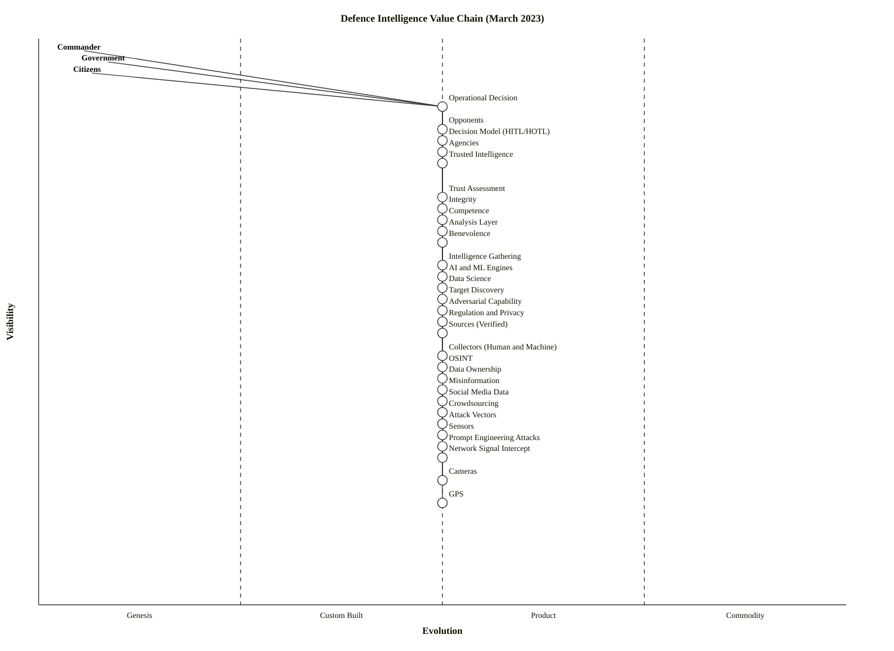

# Defence Intelligence Value Chain (March 2023)

**Document**: ARC-XXX-WVCH-001-v1.0
**Date**: 2026-04-23
**Generated by**: `$arckit-wardley.value-chain`
**Classification**: PUBLIC
**Scenario context**: March 2023

---

## Executive Summary

**Anchor**: Commanders, government officials, and citizens need to make operational decisions based on trusted intelligence.

This value chain decomposes how operational intelligence-driven decisions are produced in March 2023, from the multiple user communities (military commanders, government, agencies, citizens) down through the decision model, trust assessment, analysis layer, collection layer, sensor stack, and into the adversarial and regulatory environment. Twenty-nine components are identified across seven dependency levels. The chain reveals three strategic insights:

1. **Trust is a first-class capability**, not an afterthought — competence, integrity, and benevolence each need to be produced, not assumed.
2. **AI/ML analysis engines are both an amplifier and an attack surface**: the same component that accelerates analysis is directly targeted by prompt-engineering adversaries.
3. **Sensors and GPS are deep commodities**, but the collection layer above them (OSINT, crowdsourcing, social-media intelligence) sits in the product/custom zone and is where competitive advantage is currently being contested.

> **Note** — value chain stage: no evolution axis positions are assigned. All components use ε=0.50 as a placeholder. The follow-on `$arckit-wardley` command positions components on the evolution axis.

## Users and Personas

| User | Primary Need |
|------|-------------|
| Military Commander | Make battlefield/operational decisions with high confidence and low latency |
| Government (political) | Make policy and authorisation decisions with defensible rationale |
| Citizens | Trust that decisions made on their behalf are proportionate and lawful |
| Intelligence Agencies | Produce and disseminate assessments that hold under scrutiny |
| Opponents (adversarial user) | Degrade, distort, or inject into the decision pipeline |

The adversary is explicitly modelled as a user of the landscape — not a component — because adversarial capability is produced against the chain, not within it.

## Value Chain Diagram

### ASCII overview

```
vis
 1.00  Commander   Government   Citizens
 0.90  . . . . . . . . . . . . . . . . . . . (user line)
 0.88  Operational Decision
 0.84                                          Opponents
 0.82  Decision Model (HITL/HOTL)
 0.80  Agencies
 0.78  Trusted Intelligence
 0.72  Trust Assessment
 0.70  Integrity        0.68 Competence   0.64 Benevolence
 0.66  Analysis Layer
 0.60  Intelligence Gathering
 0.58  AI and ML Engines     0.56 Data Science
 0.54  Target Discovery
 0.52  Adversarial Capability
 0.50  Regulation and Privacy
 0.48  Sources (Verified)
 0.44  Collectors (Human and Machine)
 0.42  OSINT
 0.40  Data Ownership
 0.38  Misinformation
 0.36  Social Media Data
 0.34  Crowdsourcing
 0.32  Attack Vectors
 0.30  Sensors
 0.28  Prompt Engineering Attacks
 0.26  Network Signal Intercept
 0.22  Cameras
 0.18  GPS
```

### OWM Code

```owm
title Defence Intelligence Value Chain (March 2023)

anchor Commander [0.98, 0.05]
anchor Government [0.96, 0.08]
anchor Citizens [0.94, 0.06]

component Operational Decision [0.88, 0.50] label [-10, 10]
component Decision Model (HITL/HOTL) [0.82, 0.50] label [5, -5]
component Trusted Intelligence [0.78, 0.50] label [-15, -5]
component Trust Assessment [0.72, 0.50] label [10, 5]
component Analysis Layer [0.66, 0.50] label [-20, 5]
component AI and ML Engines [0.58, 0.50] label [5, -10]
component Data Science [0.56, 0.50] label [-25, 10]
component Intelligence Gathering [0.60, 0.50] label [-15, -10]
component Target Discovery [0.54, 0.50] label [5, 5]
component Sources (Verified) [0.48, 0.50] label [-20, -10]
component OSINT [0.42, 0.50] label [10, -5]
component Social Media Data [0.36, 0.50] label [-25, 5]
component Crowdsourcing [0.34, 0.50] label [5, 10]
component Collectors (Human and Machine) [0.44, 0.50] label [-25, -10]
component Sensors [0.30, 0.50] label [10, 5]
component GPS [0.18, 0.50] label [5, -5]
component Cameras [0.22, 0.50] label [-15, 10]
component Network Signal Intercept [0.26, 0.50] label [5, -10]
component Adversarial Capability [0.52, 0.50] label [10, 10]
component Misinformation [0.38, 0.50] label [5, 5]
component Attack Vectors [0.32, 0.50] label [-20, 5]
component Prompt Engineering Attacks [0.28, 0.50] label [10, -5]
component Regulation and Privacy [0.50, 0.50] label [-15, 5]
component Data Ownership [0.40, 0.50] label [10, -10]
component Competence [0.68, 0.50] label [5, 5]
component Integrity [0.70, 0.50] label [-15, 10]
component Benevolence [0.64, 0.50] label [10, 5]
component Agencies [0.80, 0.50] label [-25, -5]
component Opponents [0.84, 0.50] label [5, 10]

Commander->Operational Decision
Government->Operational Decision
Citizens->Operational Decision
Agencies->Operational Decision
Opponents->Adversarial Capability
Operational Decision->Decision Model (HITL/HOTL)
Operational Decision->Trusted Intelligence
Decision Model (HITL/HOTL)->Trust Assessment
Decision Model (HITL/HOTL)->Analysis Layer
Trusted Intelligence->Analysis Layer
Trusted Intelligence->Trust Assessment
Trusted Intelligence->Regulation and Privacy
Trust Assessment->Competence
Trust Assessment->Integrity
Trust Assessment->Benevolence
Analysis Layer->AI and ML Engines
Analysis Layer->Data Science
Analysis Layer->Intelligence Gathering
Intelligence Gathering->Target Discovery
Intelligence Gathering->Sources (Verified)
Intelligence Gathering->Collectors (Human and Machine)
Sources (Verified)->OSINT
Sources (Verified)->Social Media Data
Sources (Verified)->Crowdsourcing
Collectors (Human and Machine)->Sensors
Sensors->GPS
Sensors->Cameras
Sensors->Network Signal Intercept
AI and ML Engines->Data Science
Adversarial Capability->Misinformation
Adversarial Capability->Attack Vectors
Adversarial Capability->Prompt Engineering Attacks
Misinformation->Social Media Data
Prompt Engineering Attacks->AI and ML Engines
Regulation and Privacy->Data Ownership

style wardley
```

### Mermaid Equivalent

<details>
<summary>Mermaid `wardley-beta` block</summary>



</details>

## Component Inventory

| # | Component | Visibility | Description | Depends on |
|---|-----------|------------|-------------|------------|
| 1 | Operational Decision | 0.88 | The output of the chain — a decision taken with intelligence input | Decision Model, Trusted Intelligence |
| 2 | Decision Model (HITL/HOTL) | 0.82 | Whether a human is in-the-loop or on-the-loop for a given decision class | Trust Assessment, Analysis Layer |
| 3 | Trusted Intelligence | 0.78 | Intelligence product a decision-maker is willing to act on | Analysis Layer, Trust Assessment, Regulation and Privacy |
| 4 | Trust Assessment | 0.72 | The practice of evaluating whether intelligence is trustworthy | Competence, Integrity, Benevolence |
| 5 | Integrity | 0.70 | Honesty and lack of distortion in reporting | — |
| 6 | Competence | 0.68 | Demonstrable capability of the producing function | — |
| 7 | Benevolence | 0.64 | Aligned intent of the producing function with the user | — |
| 8 | Analysis Layer | 0.66 | All-source analysis producing assessed intelligence | AI/ML Engines, Data Science, Intelligence Gathering |
| 9 | Intelligence Gathering | 0.60 | Directed collection activity | Target Discovery, Sources, Collectors |
| 10 | AI and ML Engines | 0.58 | Models that classify, summarise, translate, detect | Data Science |
| 11 | Data Science | 0.56 | Feature engineering, statistics, experimentation | — |
| 12 | Target Discovery | 0.54 | Finding what is worth looking at | — |
| 13 | Adversarial Capability | 0.52 | Capability wielded by opponents to degrade the chain | Misinformation, Attack Vectors, Prompt Engineering |
| 14 | Regulation and Privacy | 0.50 | Legal and policy envelope constraining collection/use | Data Ownership |
| 15 | Sources (Verified) | 0.48 | The vetted source base | OSINT, Social Media Data, Crowdsourcing |
| 16 | Collectors (Human and Machine) | 0.44 | HUMINT and machine collection effectors | Sensors |
| 17 | OSINT | 0.42 | Open-source intelligence | — |
| 18 | Data Ownership | 0.40 | Who owns/licences the data being used | — |
| 19 | Misinformation | 0.38 | Deliberately injected false content | (targets Social Media Data) |
| 20 | Social Media Data | 0.36 | Public posts, networks, platforms | — |
| 21 | Crowdsourcing | 0.34 | Distributed human reporting | — |
| 22 | Attack Vectors | 0.32 | Technical means of degrading collection/analysis | — |
| 23 | Sensors | 0.30 | Physical and logical measurement devices | GPS, Cameras, Network Signal Intercept |
| 24 | Prompt Engineering Attacks | 0.28 | Adversarial prompting/injection against AI components | (targets AI/ML Engines) |
| 25 | Network Signal Intercept | 0.26 | SIGINT | — |
| 26 | Cameras | 0.22 | Optical sensors (visible, IR, satellite) | — |
| 27 | GPS | 0.18 | Position/time utility | — |
| 28 | Agencies | 0.80 | Intelligence agencies as consuming users | — |
| 29 | Opponents | 0.84 | Adversarial users driving Adversarial Capability | Adversarial Capability |

Anchors: Commander, Government, Citizens (user-layer, not counted in component total of 29 activities; note that Agencies and Opponents are modelled as consuming/producing users and sit at the user line but are carried in the inventory for traceability).

## Dependency Matrix

(Abbreviated — direct = X, indirect = I. Rows depend on columns.)

| | Op.Dec | DecMod | TrInt | TrAss | AnLay | IntGath | AI/ML | Sens | GPS |
|---|---|---|---|---|---|---|---|---|---|
| Operational Decision | — | X | X | I | I | I | I | I | I |
| Decision Model | | — | | X | X | I | I | I | I |
| Trusted Intelligence | | | — | X | X | I | I | I | I |
| Analysis Layer | | | | | — | X | X | I | I |
| Intelligence Gathering | | | | | | — | | I | I |
| Collectors | | | | | | | | X | I |
| Sensors | | | | | | | | — | X |

## Critical Path Analysis

**Deepest path**:
`Commander → Operational Decision → Trusted Intelligence → Analysis Layer → Intelligence Gathering → Collectors (Human and Machine) → Sensors → GPS`

Seven-hop path from anchor to utility commodity.

**Bottlenecks and single points of failure**:

- **Trusted Intelligence** is a convergence node — three user groups and the decision model all route through it.
- **AI and ML Engines** is pulled on by the Analysis Layer and simultaneously targeted by Prompt Engineering Attacks. It is a high-leverage dual-use node.
- **Sources (Verified)** depends on public-platform data (Social Media Data) that is independently targeted by Misinformation. Verification practice is therefore doing double work.
- **GPS** is the deepest commodity. Any denial/spoofing of GPS degrades the entire sensor stack.

**Resilience gaps**:

- No redundancy node for GPS (e.g., inertial navigation, celestial fallback) is modelled — real chains would include alternates.
- No explicit dissemination component between Trusted Intelligence and Operational Decision — classified handling is implicit.

## Validation Checklist

### Completeness

- [x] Chain starts with a genuine user need (operational decision-making)
- [x] All significant dependencies captured
- [x] Chain reaches commodity level (GPS, network signal intercept)
- [x] No orphan components — every node has at least one edge
- [x] Components are activities/capabilities (except Agencies, Opponents, Commander, Government, Citizens which are explicitly modelled as actor/user roles per scenario requirement)

### Accuracy

- [x] Dependency direction: every edge `A -> B` has visibility(A) >= visibility(B)
- [x] DAG: no cycles introduced
- [x] No component is both high-level and low-level

### Usefulness

- [x] Granularity suits strategic exercise (29 components)
- [x] Each component positionable on evolution axis in follow-on step
- [x] Chain reveals dual-use insight (AI/ML is lever and target)

### Issues noted

- The scenario explicitly names actors as first-class ("military, opponents, government, citizens, agencies"); the skill's own guidance says components should be capabilities not people. Actors are carried as anchors/users but flagged here as a deviation driven by the scenario statement.

## Visibility Assessment

| Component | Visibility | Rationale |
|-----------|-----------:|-----------|
| Operational Decision | 0.88 | One step below user anchor — the produced outcome |
| Decision Model (HITL/HOTL) | 0.82 | Shapes every decision; visible as policy to the user |
| Agencies | 0.80 | User-layer actor producing decisions |
| Trusted Intelligence | 0.78 | The product a commander consumes |
| Trust Assessment | 0.72 | Visible practice around the product |
| Integrity / Competence / Benevolence | 0.70 / 0.68 / 0.64 | Sub-dimensions of trust |
| Analysis Layer | 0.66 | Immediately behind the product |
| Intelligence Gathering | 0.60 | Directed activity feeding analysis |
| AI and ML Engines | 0.58 | Enabling technology inside analysis |
| Data Science | 0.56 | Practice behind AI/ML |
| Target Discovery | 0.54 | Upstream focusing activity |
| Adversarial Capability | 0.52 | Visible-to-analyst countervailing force |
| Regulation and Privacy | 0.50 | Policy envelope constraining chain |
| Sources (Verified) | 0.48 | Curated source base |
| Collectors (Human and Machine) | 0.44 | The effector layer |
| OSINT | 0.42 | Specific source class |
| Data Ownership | 0.40 | Legal sub-dimension |
| Misinformation | 0.38 | Adversarial content class |
| Social Media Data | 0.36 | Specific source class, platform-mediated |
| Crowdsourcing | 0.34 | Specific source class, human-mediated |
| Attack Vectors | 0.32 | Adversarial technique class |
| Sensors | 0.30 | Hardware/logical collection layer |
| Prompt Engineering Attacks | 0.28 | Specific adversarial technique |
| Network Signal Intercept | 0.26 | SIGINT sensor class |
| Cameras | 0.22 | Imagery sensor class |
| GPS | 0.18 | Position/time utility |

## Assumptions and Open Questions

**Assumptions**:

1. The decision boundary is operational (tactical/operational), not strategic grand-policy — which would pull different dependencies up the chain.
2. "Trust" is modelled as a composite of competence/integrity/benevolence (Mayer-Davis-Schoorman tradition) as implied by the scenario text.
3. "Opponents" are modelled as a user with an adversarial value chain that attacks this one. This is deliberate — adversaries are not components inside our own chain.
4. Regulation and Privacy is modelled as a constraint node that Trusted Intelligence depends on (cannot be produced legally without it). Alternative: model it as a horizontal envelope, not a dependency.
5. ε=0.50 is a placeholder — evolution positioning is out of scope at value-chain stage.

**Open questions for follow-on `$arckit-wardley`**:

- Where is AI/ML Engines on the evolution axis in March 2023? (Arguably still Custom Built / early Product given GPT-4 had just launched.)
- Is Regulation and Privacy a genuine dependency or a climatic/doctrinal constraint?
- Should Prompt Engineering Attacks be split (jailbreaking vs. data-poisoning vs. prompt-injection) for sharper strategic read?
- Should the three trust sub-dimensions collapse into Trust Assessment for readability?

---

**Generated by**: ArcKit `$arckit-wardley.value-chain` command (competitor-benchmark invocation)
**Generated on**: 2026-04-23
**AI Model**: claude-opus-4-7[1m]
**Generation Context**: Blind benchmark against `iteration-14/eval-defence-intelligence`. No reference map read. ε axis intentionally uniform 0.50 (skill is value-chain only).
