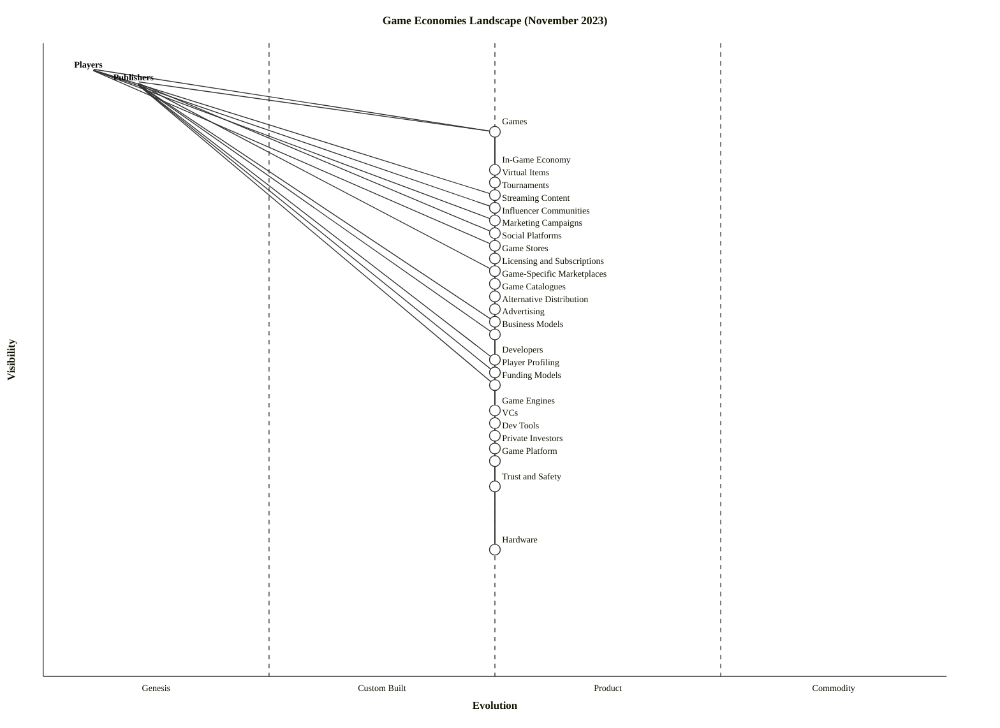

# Value Chain: Game Economies Landscape (November 2023)

**Command**: `arckit-wardley.value-chain`
**Date**: 2023-11-15 (scenario-dated)
**Classification**: PUBLIC

## Executive Summary

**Anchor(s)**: Players (consumer need: play games, belong to a community) and Publishers (business need: profitably ship and sustain a game). The map decomposes 26 components across six sub-chains — experience, distribution, monetisation, production, funding, and the marketing/buzz apparatus — with Trust and Safety isolated as a shared dependency whose failure can collapse the whole chain. Evolution values are placeholders (ε = 0.50); the next step (`$arckit-wardley`) is required to assess commoditisation versus differentiation.

## Users and Personas

| User | Primary need | Where they sit |
|---|---|---|
| Players | Play engaging games, trade/own items, belong to communities | Top anchor (ν = 0.96) |
| Publishers | Fund, ship, monetise, and retain audiences for games | Top anchor (ν = 0.94) |
| Developers | Build games given tooling, engines, platforms, funding | Mid-chain capability (ν = 0.50) |
| VCs / Private investors | Deploy capital into studios and IP | Deep in funding sub-chain (ν = 0.36–0.40) |
| Influencers / streamers | Reach audiences, monetise attention | Buzz apparatus (ν = 0.72–0.74) |

## Anchor Statement

```text
Anchor A: Players can play, spend, stream, and belong around games they trust
User: End-user players (and player-creators)
Outcome: A continuous loop of play, purchase, social engagement, and community identity

Anchor B: Publishers can profitably fund, ship, distribute, and monetise games
User: Game publishers (incl. self-publishing studios)
Outcome: A repeatable pipeline from capital → product → distribution → revenue
```

## Value Chain Diagram (ASCII)

```text
ν=0.96  [Players]                      [Publishers]  ν=0.94
         |     |    |    |    |          |     |     |     |    |    |
ν=0.86  [Games]                          |     |     |     |    |    |
ν=0.80  [In-Game Economy]                |     |     |     |    |    |
ν=0.78  [Virtual Items]                  |     |     |     |    |    |
ν=0.76  [Tournaments]----[Marketing Campaigns]  |     |     |    |    |
ν=0.74  [Streaming Content]              |     |     |     |    |    |
ν=0.72  [Influencer Communities]         |     |     |     |    |    |
ν=0.68  [Social Platforms]               |     |     |     |    |    |
ν=0.66  [Game Stores]                    |     |     |     |    |    |
ν=0.64  [Licensing & Subscriptions]      |     |     |     |    |    |
ν=0.62  [Game-Specific Marketplaces]     |     |     |     |    |    |
ν=0.60  [Game Catalogues]                |     |     |     |    |    |
ν=0.58  [Alternative Distribution]       |     |     |     |    |    |
ν=0.56  [Advertising]                    |     |     |     |    |    |
ν=0.54  [Business Models]                |     |     |     |    |    |
ν=0.50  [Developers] ----- [Player Profiling] ν=0.48
ν=0.46  [Funding Models]
ν=0.42  [Game Engines]
ν=0.40  [VCs]
ν=0.38  [Dev Tools]
ν=0.36  [Private Investors]
ν=0.34  [Game Platform]
ν=0.30  [Trust and Safety]
ν=0.20  [Hardware]
```

### OWM Syntax (paste into https://create.wardleymaps.ai)

```text
title Game Economies Landscape (November 2023)

anchor Players [0.96, 0.05] label [5, -10]
anchor Publishers [0.94, 0.10] label [5, -10]

component Games [0.86, 0.50] label [5, 5]
component In-Game Economy [0.80, 0.50] label [5, 5]
component Virtual Items [0.78, 0.50] label [5, 5]
component Tournaments [0.76, 0.50] label [5, 5]
component Streaming Content [0.74, 0.50] label [5, 5]
component Influencer Communities [0.72, 0.50] label [5, 5]
component Marketing Campaigns [0.70, 0.50] label [5, 5]
component Social Platforms [0.68, 0.50] label [5, 5]
component Game Stores [0.66, 0.50] label [5, 5]
component Licensing and Subscriptions [0.64, 0.50] label [5, 5]
component Game-Specific Marketplaces [0.62, 0.50] label [5, 5]
component Game Catalogues [0.60, 0.50] label [5, 5]
component Alternative Distribution [0.58, 0.50] label [5, 5]
component Advertising [0.56, 0.50] label [5, 5]
component Business Models [0.54, 0.50] label [5, 5]
component Developers [0.50, 0.50] label [5, 5]
component Player Profiling [0.48, 0.50] label [5, 5]
component Funding Models [0.46, 0.50] label [5, 5]
component Game Engines [0.42, 0.50] label [5, 5]
component VCs [0.40, 0.50] label [5, 5]
component Dev Tools [0.38, 0.50] label [5, 5]
component Private Investors [0.36, 0.50] label [5, 5]
component Game Platform [0.34, 0.50] label [5, 5]
component Trust and Safety [0.30, 0.50] label [5, 5]
component Hardware [0.20, 0.50] label [5, 5]

Players->Games
Players->Social Platforms
Players->Streaming Content
Players->Influencer Communities
Players->Tournaments

Games->In-Game Economy
Games->Virtual Items
Games->Game Stores
Games->Game Catalogues
Games->Developers
In-Game Economy->Virtual Items
In-Game Economy->Trust and Safety
Virtual Items->Game-Specific Marketplaces

Publishers->Games
Publishers->Marketing Campaigns
Publishers->Licensing and Subscriptions
Publishers->Advertising
Publishers->Business Models
Publishers->Player Profiling
Publishers->Developers
Publishers->Funding Models

Marketing Campaigns->Influencer Communities
Marketing Campaigns->Streaming Content
Marketing Campaigns->Tournaments
Marketing Campaigns->Social Platforms
Marketing Campaigns->Player Profiling
Tournaments->Streaming Content
Streaming Content->Social Platforms
Influencer Communities->Social Platforms

Game Stores->Alternative Distribution
Game Catalogues->Game Stores
Game-Specific Marketplaces->Game Stores
Alternative Distribution->Game Platform

Licensing and Subscriptions->Business Models
Advertising->Player Profiling
Business Models->Funding Models
Player Profiling->Trust and Safety

Developers->Game Engines
Developers->Dev Tools
Developers->Game Platform
Developers->Funding Models
Game Engines->Dev Tools
Game Engines->Hardware
Dev Tools->Hardware
Game Platform->Hardware

Funding Models->VCs
Funding Models->Private Investors

Social Platforms->Trust and Safety

style wardley
```

### Mermaid Value Chain Map

<details>
<summary>Mermaid wardley-beta</summary>



</details>

## Component Inventory

| # | Component | ν | Description | Depends on |
|---|---|---|---|---|
| 1 | Players | 0.96 | End-user consumers of games and gaming content | Games, Social Platforms, Streaming, Influencers, Tournaments |
| 2 | Publishers | 0.94 | Organisations that fund, ship, and monetise games | Games, Marketing, Licensing, Ads, Business Models, Profiling, Developers, Funding |
| 3 | Games | 0.86 | The playable product; the locus of play and spend | In-Game Economy, Virtual Items, Stores, Catalogues, Developers |
| 4 | In-Game Economy | 0.80 | Currencies, sinks, faucets, marketplaces inside a game | Virtual Items, Trust and Safety |
| 5 | Virtual Items | 0.78 | Cosmetics, skins, power-ups, collectibles | Game-Specific Marketplaces |
| 6 | Tournaments | 0.76 | Organised competitive play (esports, ladders) | Streaming Content |
| 7 | Streaming Content | 0.74 | Live and VOD gameplay content | Social Platforms |
| 8 | Influencer Communities | 0.72 | Creator-led fan audiences | Social Platforms |
| 9 | Marketing Campaigns | 0.70 | Coordinated promotion and launch activity | Influencers, Streaming, Tournaments, Social, Profiling |
| 10 | Social Platforms | 0.68 | Shared venues for discussion, identity, discovery | Trust and Safety |
| 11 | Game Stores | 0.66 | Digital storefronts (Steam, Epic, PSN, Xbox, Nintendo, mobile) | Alternative Distribution |
| 12 | Licensing and Subscriptions | 0.64 | Game Pass / PS Plus / Apple Arcade / IP licensing | Business Models |
| 13 | Game-Specific Marketplaces | 0.62 | Per-game item/skin markets, player-to-player trading | Game Stores |
| 14 | Game Catalogues | 0.60 | Curated lineups bundled into subscription services | Game Stores |
| 15 | Alternative Distribution | 0.58 | Web stores, sideloading, cloud, third-party launchers | Game Platform |
| 16 | Advertising | 0.56 | In-game, rewarded, cross-media ad spend | Player Profiling |
| 17 | Business Models | 0.54 | F2P, premium, live-service, B2P+MTX, ad-supported | Funding Models |
| 18 | Developers | 0.50 | Studios and individual builders | Engines, Dev Tools, Platform, Funding |
| 19 | Player Profiling | 0.48 | Behavioural analytics, segmentation, LTV modelling | Trust and Safety |
| 20 | Funding Models | 0.46 | Equity, publisher advance, crowdfunding, grants | VCs, Private Investors |
| 21 | Game Engines | 0.42 | Unity, Unreal, Godot, proprietary | Dev Tools, Hardware |
| 22 | VCs | 0.40 | Venture capital deploying into studios/IP | — |
| 23 | Dev Tools | 0.38 | SDKs, asset stores, version control, CI, DevOps | Hardware |
| 24 | Private Investors | 0.36 | Angels, family offices, strategic backers | — |
| 25 | Game Platform | 0.34 | Console/mobile/PC platforms (incl. cloud backend) | Hardware |
| 26 | Trust and Safety | 0.30 | Moderation, anti-cheat, fraud, abuse, age checks | — |
| 27 | Hardware | 0.20 | Consoles, GPUs, CPUs, mobile SoCs, datacenters | — |

## Dependency Matrix (abridged)

Full matrix is 27×27; here is the **critical path** row-view. `X` = direct dependency, `I` = indirect.

| From \ To | Games | Devs | Engines | H/W | Stores | Mktg | Social | Profiling | T&S | Funding |
|---|---|---|---|---|---|---|---|---|---|---|
| Players | X | I | I | I | I | I | X | I | I | I |
| Publishers | X | X | I | I | I | X | I | X | I | X |
| Games | — | X | I | I | X | I | I | I | I | I |
| Marketing Campaigns | — | — | — | — | — | — | X | X | I | — |
| Developers | — | — | X | I | — | — | — | — | — | X |
| Game Engines | — | — | — | X | — | — | — | — | — | — |

## Critical Path Analysis

**Publisher path** — capital to shipped product:
`Publishers → Funding Models → {VCs, Private Investors}` and `Publishers → Developers → {Game Engines, Dev Tools, Game Platform} → Hardware`.

**Player path** — attention to play:
`Players → {Social Platforms, Streaming, Influencers} → Marketing Campaigns → Games → In-Game Economy → Virtual Items`.

**Single points of failure / bottlenecks**:

1. **Trust and Safety** is the universal dependency of In-Game Economy, Social Platforms, Player Profiling, and Advertising. Collapse here — a toxicity scandal, a cheating crisis, a data-privacy regulator action — cascades through monetisation (ads, items), community (socials), and acquisition (profiling).
2. **Game Platform / Hardware** is a sovereign layer (Apple, Google, Sony, Microsoft, Nintendo, Nvidia) that publishers cannot route around cheaply; store-fee disputes (Epic v. Apple, 30% tax) cluster here.
3. **Player Profiling** is a choke for Marketing, Advertising, and Business Model tuning; privacy regulation (GDPR, ATT, DSA) is applying pressure.
4. **Funding Models** is the publisher's upstream oxygen — rate-hike-driven VC pullback in 2023 has already stressed studios.

**Resilience gaps** flagged for the subsequent `$arckit-wardley` evolution pass:

- Alternative Distribution vs. Game Stores — regulatory-driven (DMA/Epic ruling) shift starting 2024.
- Streaming Content / Influencer Communities — concentrated on Twitch/YouTube; platform-policy risk.
- In-Game Economy — regulator scrutiny of loot boxes and "gambling-adjacent" mechanics.

## Validation Checklist

**Completeness**

- [x] Chain starts with genuine user needs (Players and Publishers, not solutions)
- [x] All major dependencies captured across funding, build, distribution, monetisation, marketing, profiling
- [x] Chain reaches commodity level (Hardware, Trust and Safety, VCs as terminal inputs)
- [x] No orphans (every component has at least one edge)
- [x] Components are capabilities/activities (Game Stores, Marketing Campaigns, Player Profiling), not specific vendors or people

**Accuracy**

- [x] Dependencies reflect real-world technical and commercial relationships
- [x] Visibility ordering is consistent: ν(A) >= ν(B) for every A→B edge
- [x] DAG: no cycles introduced
- [x] Anchors Players (0.96) and Publishers (0.94) are the highest-visibility nodes

**Usefulness**

- [x] Granularity: 26 components — strategic, not packet-level
- [x] Each component can be meaningfully positioned on ε in the next step
- [x] Reveals strategic insights (Trust and Safety as shared failure mode; Platform/Store as sovereign rent-takers; funding stress 2023)

## Visibility Assessment

| Component | ν | Rationale |
|---|---|---|
| Players | 0.96 | Consumer anchor — directly experienced |
| Publishers | 0.94 | Business anchor — customer outcome for the firm |
| Games | 0.86 | The visible product users play |
| In-Game Economy / Virtual Items | 0.78–0.80 | Inside-the-game experience users see daily |
| Tournaments / Streaming / Influencers | 0.72–0.76 | Part of the lived gaming-culture surface |
| Marketing Campaigns | 0.70 | Reaches players and prospects directly |
| Social Platforms | 0.68 | User-facing, but not a game surface |
| Game Stores / Licensing / Marketplaces / Catalogues / Alt Distribution | 0.58–0.66 | One-click-away from the game |
| Advertising / Business Models | 0.54–0.56 | Publisher-internal logic the player feels indirectly |
| Developers | 0.50 | Invisible to players directly; visible to publishers |
| Player Profiling | 0.48 | Operational analytics — invisible to players |
| Funding Models / Engines / Tools / Platform | 0.34–0.46 | Deep plumbing |
| VCs / Private Investors | 0.36–0.40 | Upstream capital — invisible to players |
| Trust and Safety | 0.30 | Invisible when working; catastrophic when it fails |
| Hardware | 0.20 | Deep infrastructure |

## Assumptions and Open Questions

**Assumptions**

1. The scenario anchor is a dual anchor (Players + Publishers) because the prompt explicitly asks to anchor on both. Some value-chain treatments prefer a single anchor; if required, Players takes priority.
2. "Game Platform" is treated as the sovereign OS/console/cloud-backend layer (Apple, Google, Microsoft, Sony, Nintendo, Nvidia GeForce Now, Amazon Luna), distinct from "Game Stores" which are storefronts built on top.
3. "Alternative Distribution" covers non-incumbent routes: web stores, sideloading on Android, Epic-style direct stores, cloud streaming that bypasses downloads.
4. "Business Models" is a component (F2P, live-service, premium, B2P+MTX, ad-supported) rather than a table row — it evolves as a practice.
5. Trust and Safety is a single component at ν=0.30; a full map might decompose it into moderation, anti-cheat, anti-fraud, and age verification sub-components.

**Open questions (for the Wardley pass)**

- Are engines (Unity/Unreal/Godot) better modelled as Product (Unity/Unreal) vs Custom (proprietary AAA engines)? They differ by studio.
- Should "Esports" be split from Tournaments? At November 2023, esports is contracting commercially — worth flagging as inertia.
- How to represent generative-AI content tools (text-to-asset, NPC behaviour, procedural level gen) — emerging November 2023, not yet dominant, but a 2024 climatic force.
- Web3 / tokenised in-game items — significant in 2021–22, largely retreating by late 2023; include as a faded branch or drop?

**Next steps**: run `$arckit-wardley` to position every component on the evolution axis (ε). Key hypotheses to test there:

- Commoditised: Hardware, Game Platform (sovereign-but-commodity-like), Social Platforms, Dev Tools, basic Streaming infra.
- Productised: Game Engines (Unity/Unreal), Game Stores, Advertising stacks, Funding Models, core Business Models.
- Custom / Genesis room for differentiation: Games (IP), In-Game Economy design, Player Profiling, Marketing Campaigns (creative), Alternative Distribution, AI-assisted dev tooling.

## Footer

**Generated by**: ArcKit `$arckit-wardley.value-chain` (competitor-benchmark harness)
**Generated on**: 2026-04-23
**Project**: Gaming Economies Benchmark
**AI Model**: claude-opus-4-7 (1M context)
**Generation Context**: Blind benchmark — reference map not consulted.
