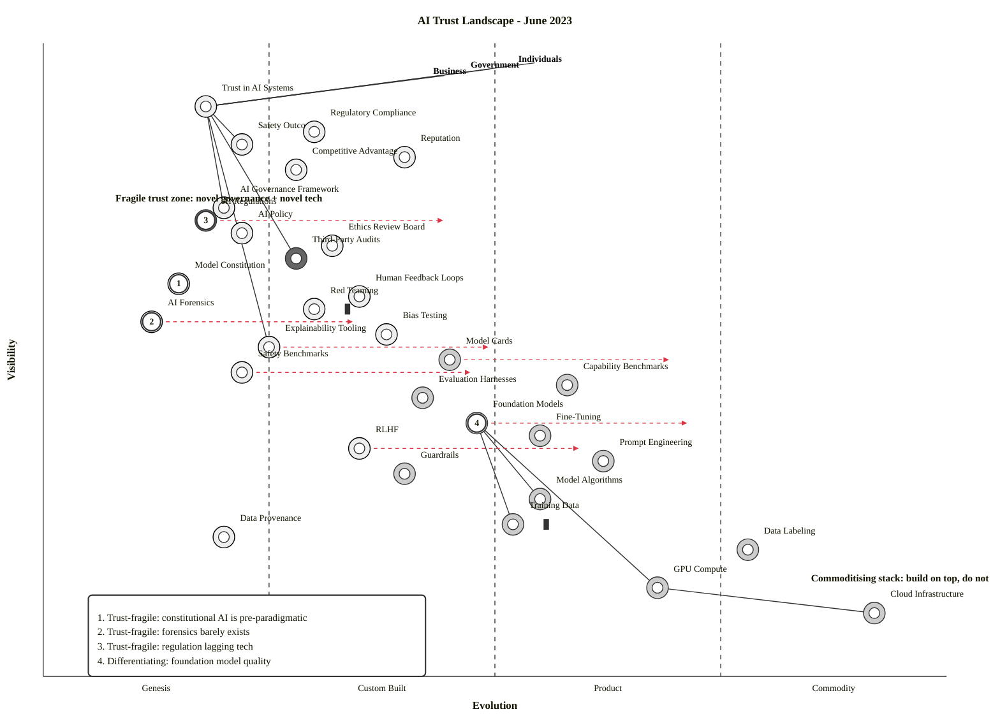

# Wardley Map: AI Trust Landscape (June 2023)

**Document ID**: ARC-000-WARD-001-v1.0
**Date**: 2023-06-15 (scenario date)
**Classification**: PUBLIC
**Owner**: Strategic Analysis
**Generated by**: `arckit-wardley` (full orchestrator)
**Mode**: Current State Map (Mode A)

---

## Preflight Notes

The `arckit-wardley` skill's Step 1 checks for UK Government procurement artefacts (PRIN, REQ, STKE, RSCH, WVCH, TCOP, AIPB) in a `projects/` tree. **None of these exist** for this scenario — it is not a UK Gov procurement task but a general strategic landscape question about AI trust. Per skill guidance, MANDATORY items trigger a warning; RECOMMENDED and OPTIONAL items are skipped silently when absent.

**Warnings emitted** (continuing anyway, as instructed by prompt):

- No PRIN (Architecture Principles) present — would normally `$arckit-principles` first.
- No REQ (Requirements) present — would normally `$arckit-requirements` first.
- No `projects/` tree — file output naming (`projects/{id}/wardley-maps/...`) not applicable; output lives in the eval directory instead.
- No Pinecone MCP (`search-records` tool) available — Wardley book corpus search skipped.
- No `.arckit/references/` or `.arckit/skills/wardley-mapping/references/` present — doctrine/gameplay/climatic pattern reference files not readable; using in-skill knowledge instead.

UK Government-specific sections (GOV.UK services, Digital Marketplace, TCoP, AI Playbook compliance) are **not applicable** to this scenario and are omitted.

---

## Strategic Question

> "Map the AI trust landscape — what components determine whether individuals, government, and business can trust AI systems. Tell me what's differentiating vs. commoditising and where trust itself is fragile."

**Time horizon**: Current state, June 2023 (frontier model era — GPT-4 launched Mar 2023, EU AI Act trilogue ongoing, Anthropic Constitutional AI paper ~Dec 2022, White House AI Bill of Rights blueprint Oct 2022).

**Decisions enabled**: Where to invest for differentiation; what to commoditise away; where trust fragility creates strategic risk or opportunity.

---

## Map Code (OnlineWardleyMaps syntax)

Paste into <https://create.wardleymaps.ai> to visualise.

```wardley
title AI Trust Landscape - June 2023

anchor Individuals [0.97, 0.55]
anchor Government [0.96, 0.50]
anchor Business [0.95, 0.45]

component Trust in AI Systems [0.90, 0.18]
component Safety Outcomes [0.84, 0.22]
component Reputation [0.82, 0.40]
component Competitive Advantage [0.80, 0.28]
component Regulatory Compliance [0.86, 0.30]

component AI Governance Framework [0.74, 0.20]
component AI Regulations [0.72, 0.18]
component AI Policy [0.70, 0.22]
component Ethics Review Board [0.68, 0.32]
component Third-Party Audits [0.66, 0.28]

component Model Constitution [0.62, 0.15]
component Human Feedback Loops [0.60, 0.35]
component Red Teaming [0.58, 0.30]
component AI Forensics [0.56, 0.12]
component Bias Testing [0.54, 0.38]
component Explainability Tooling [0.52, 0.25]
component Model Cards [0.50, 0.45]

component Safety Benchmarks [0.48, 0.22]
component Capability Benchmarks [0.46, 0.58]
component Evaluation Harnesses [0.44, 0.42]

component Foundation Models [0.40, 0.48]
component Fine-Tuning [0.38, 0.55]
component RLHF [0.36, 0.35]
component Prompt Engineering [0.34, 0.62]
component Guardrails [0.32, 0.40]

component Model Algorithms [0.28, 0.55]
component Training Data [0.24, 0.52]
component Data Provenance [0.22, 0.20]
component Data Labeling [0.20, 0.78]

component GPU Compute [0.14, 0.68]
component Cloud Infrastructure [0.10, 0.92]

Individuals -> Trust in AI Systems
Government -> Trust in AI Systems
Business -> Trust in AI Systems
Government -> Regulatory Compliance
Business -> Reputation
Business -> Competitive Advantage
Individuals -> Safety Outcomes

Trust in AI Systems -> Safety Outcomes
Trust in AI Systems -> AI Governance Framework
Trust in AI Systems -> Third-Party Audits
Trust in AI Systems -> Explainability Tooling
Safety Outcomes -> Red Teaming
Safety Outcomes -> Bias Testing
Safety Outcomes -> Safety Benchmarks
Reputation -> Model Cards
Reputation -> Third-Party Audits
Competitive Advantage -> Foundation Models
Competitive Advantage -> Fine-Tuning
Regulatory Compliance -> AI Regulations
Regulatory Compliance -> AI Policy

AI Governance Framework -> AI Regulations
AI Governance Framework -> AI Policy
AI Governance Framework -> Ethics Review Board
AI Regulations -> AI Policy
Ethics Review Board -> Bias Testing
Third-Party Audits -> Evaluation Harnesses
Third-Party Audits -> Model Cards

Model Constitution -> Foundation Models
Human Feedback Loops -> RLHF
Red Teaming -> Foundation Models
AI Forensics -> Data Provenance
AI Forensics -> Training Data
Bias Testing -> Evaluation Harnesses
Explainability Tooling -> Foundation Models
Model Cards -> Foundation Models

Safety Benchmarks -> Evaluation Harnesses
Capability Benchmarks -> Evaluation Harnesses
Evaluation Harnesses -> Foundation Models

Foundation Models -> Model Algorithms
Foundation Models -> Training Data
Foundation Models -> GPU Compute
Fine-Tuning -> Foundation Models
Fine-Tuning -> Training Data
RLHF -> Fine-Tuning
RLHF -> Human Feedback Loops
Prompt Engineering -> Foundation Models
Guardrails -> Foundation Models

Model Algorithms -> GPU Compute
Training Data -> Data Provenance
Training Data -> Data Labeling
GPU Compute -> Cloud Infrastructure

evolve Foundation Models 0.72 label Commoditizing fast
evolve RLHF 0.60 label Standardizing
evolve Model Cards 0.70 label Becoming standard practice
evolve AI Regulations 0.45 label EU AI Act incoming
evolve Safety Benchmarks 0.48 label Emerging standards
evolve AI Forensics 0.35 label Early R&D
evolve Explainability Tooling 0.50 label Tooling maturing

annotation 1 [0.62, 0.15] Trust-fragile: constitutional AI is pre-paradigmatic
annotation 2 [0.56, 0.12] Trust-fragile: forensics barely exists
annotation 3 [0.72, 0.18] Trust-fragile: regulation lagging tech
annotation 4 [0.40, 0.48] Differentiating: foundation model quality
annotation 5 [0.20, 0.78] Commoditising: data labeling marketplaces
annotation 6 [0.10, 0.92] Commoditised: cloud compute

note Fragile trust zone: novel governance + novel tech [0.75, 0.08]
note Commoditising stack: build on top, don't rebuild [0.15, 0.85]

style wardley
```

<details>
<summary>Mermaid Wardley Map (with sourcing decorators)</summary>



</details>

---

## Component Inventory

| Component | Visibility | Evolution | Stage | Category | Strategic Note |
|-----------|-----------:|----------:|-------|----------|----------------|
| Individuals (anchor) | 0.97 | 0.55 | — | Anchor | End-user trust holder |
| Government (anchor) | 0.96 | 0.50 | — | Anchor | Regulator + procurer |
| Business (anchor) | 0.95 | 0.45 | — | Anchor | Deployer + reputational stakeholder |
| Trust in AI Systems | 0.90 | 0.18 | Genesis | Outcome | Top-level user need; ill-defined concept in 2023 |
| Regulatory Compliance | 0.86 | 0.30 | Custom | Outcome | Fragmenting across jurisdictions |
| Safety Outcomes | 0.84 | 0.22 | Genesis | Outcome | No agreed definition of "safe enough" |
| Reputation | 0.82 | 0.40 | Custom | Outcome | Brand-risk driver, emerging measurement |
| Competitive Advantage | 0.80 | 0.28 | Custom | Outcome | Model moat erosion accelerating |
| AI Governance Framework | 0.74 | 0.20 | Genesis | Governance | NIST AI RMF early; few mature frameworks |
| AI Regulations | 0.72 | 0.18 | Genesis | Governance | EU AI Act pre-trilogue; US sectoral only |
| AI Policy | 0.70 | 0.22 | Genesis | Governance | Org-level policies nascent |
| Ethics Review Board | 0.68 | 0.32 | Custom | Governance | Bespoke per organisation |
| Third-Party Audits | 0.66 | 0.28 | Custom | Governance | Early specialists (Luminos, Holistic AI) |
| Model Constitution | 0.62 | 0.15 | Genesis | Control | Anthropic CAI paper Dec 2022 — genuinely novel |
| Human Feedback Loops | 0.60 | 0.35 | Custom | Control | RLHF pipelines bespoke |
| Red Teaming | 0.58 | 0.30 | Custom | Control | ARC, OpenAI red-team practice emerging |
| AI Forensics | 0.56 | 0.12 | Genesis | Control | Post-hoc incident forensics barely exists |
| Bias Testing | 0.54 | 0.38 | Custom | Control | IBM AIF360, Fairlearn; still custom pipelines |
| Explainability Tooling | 0.52 | 0.25 | Custom | Control | SHAP/LIME for classical; LLM interpretability Genesis |
| Model Cards | 0.50 | 0.45 | Custom | Control | Hugging Face adoption growing; becoming norm |
| Safety Benchmarks | 0.48 | 0.22 | Genesis | Governance | TruthfulQA, HELM-safety nascent |
| Capability Benchmarks | 0.46 | 0.58 | Product | Governance | MMLU, BIG-bench mature |
| Evaluation Harnesses | 0.44 | 0.42 | Custom | Governance | EleutherAI harness, OpenAI evals standardising |
| Foundation Models | 0.40 | 0.48 | Custom | Technical | GPT-4, Claude, PaLM-2 — key differentiator |
| Fine-Tuning | 0.38 | 0.55 | Product | Technical | LoRA, PEFT libraries mature |
| RLHF | 0.36 | 0.35 | Custom | Technical | Process maturing post-ChatGPT |
| Prompt Engineering | 0.34 | 0.62 | Product | Technical | Prompt libraries, LangChain proliferating |
| Guardrails | 0.32 | 0.40 | Custom | Technical | NeMo Guardrails, Guardrails AI emerging |
| Model Algorithms | 0.28 | 0.55 | Product | Technical | Transformer architecture standard |
| Training Data | 0.24 | 0.52 | Product | Technical | CommonCrawl, The Pile; legal risk rising |
| Data Provenance | 0.22 | 0.20 | Genesis | Technical | C2PA emerging; no standard for training data |
| Data Labeling | 0.20 | 0.78 | Commodity | Technical | Scale AI, Surge — commoditised |
| GPU Compute | 0.14 | 0.68 | Product | Technical | NVIDIA dominated but rentable |
| Cloud Infrastructure | 0.10 | 0.92 | Commodity | Technical | AWS/Azure/GCP utility |

**Totals**: 31 components + 3 anchors = 34 nodes. Edges: 51.

---

## Evolution Analysis

### Genesis (0.00–0.25) — 9 components

Trust in AI Systems, Safety Outcomes, AI Governance Framework, AI Regulations, AI Policy, Model Constitution, AI Forensics, Safety Benchmarks, Data Provenance.

**Characteristic**: pre-paradigmatic, no agreed definitions, fast-changing. All of the **outcome layer at the top** and the **governance layer below it** sit here, which is the central finding: trust itself is in Genesis.

### Custom (0.25–0.50) — 13 components

Regulatory Compliance, Reputation, Competitive Advantage, Ethics Review Board, Third-Party Audits, Human Feedback Loops, Red Teaming, Bias Testing, Explainability Tooling, Model Cards, Evaluation Harnesses, Foundation Models, RLHF, Guardrails.

**Characteristic**: bespoke emerging practice. Foundation Models are still *Custom* in mid-2023 — different providers diverge meaningfully in capability, safety posture, and alignment approach. Expected to move ≥ 0.60 within 18 months.

### Product (0.50–0.75) — 7 components

Fine-Tuning, Prompt Engineering, Model Algorithms, Training Data, Capability Benchmarks, GPU Compute.

**Characteristic**: commercial off-the-shelf exists; feature-differentiated.

### Commodity (0.75–1.00) — 2 components

Data Labeling, Cloud Infrastructure.

**Characteristic**: utility pricing, undifferentiated on features.

---

## Build vs Buy Analysis

### Build (Genesis/Custom with strategic importance)

- **Model Constitution** (0.15 Genesis) — if you're a foundation lab, this is competitive differentiator; for deployers, consume from provider.
- **AI Forensics** (0.12 Genesis) — no market exists. Regulators and insurers will demand this; early investment is defensible IP.
- **AI Governance Framework** (0.20 Genesis) — org-specific; cannot be bought off-the-shelf.
- **Red Teaming** (0.30 Custom) — mission-critical for frontier deployers; specialised teams.
- **Safety Benchmarks** (0.22 Genesis) — domain-specific safety evals are differentiators (medical, legal, autonomous).

### Buy — Product (0.50–0.75)

- **Foundation Models** (0.48 Custom, evolving fast to 0.72) — in June 2023, you can API-consume from OpenAI / Anthropic / Google. Don't rebuild GPT-4 unless you are a frontier lab.
- **Fine-Tuning** (0.55) — Hugging Face / PEFT libraries.
- **Prompt Engineering** (0.62) — LangChain, LlamaIndex.
- **Evaluation Harnesses** (0.42) — EleutherAI harness, OpenAI evals.
- **Model Cards** (0.45) — Hugging Face tooling.
- **Guardrails** (0.40) — NeMo Guardrails, Guardrails AI.
- **Capability Benchmarks** (0.58) — open benchmarks free to use.

### Rent/Commodity (> 0.75)

- **Cloud Infrastructure** (0.92) — AWS/Azure/GCP.
- **Data Labeling** (0.78) — Scale AI, Surge, Labelbox.
- **GPU Compute** (0.68 heading for commodity) — CoreWeave, Lambda, hyperscaler on-demand.

### Outsource

- **AI Regulations** — outsourced to governments (you comply, not define).
- **Third-Party Audits** — by definition external (Luminos, Holistic AI, Deloitte).

---

## Mathematical Strategic Metrics

Computed per skill Step 3 instruction (D = visibility × (1 − evolution); K = (1 − visibility) × evolution; R thresholded on dependencies).

| Component | D (Differentiation Pressure) | K (Commodity Leverage) | Category Recommendation |
|-----------|------:|------:|-------------------------|
| Trust in AI Systems | 0.74 | 0.02 | **BUILD** (correct) |
| Regulatory Compliance | 0.60 | 0.04 | **BUILD** (correct — internal compliance machinery) |
| Safety Outcomes | 0.66 | 0.03 | **BUILD** (correct) |
| AI Governance Framework | 0.59 | 0.05 | **BUILD** (correct) |
| Model Constitution | 0.53 | 0.06 | **BUILD** (correct) |
| AI Forensics | 0.49 | 0.05 | **BUILD** (correct) |
| Safety Benchmarks | 0.37 | 0.11 | Domain-specific BUILD |
| Foundation Models | 0.21 | 0.29 | BUY via API (D falling, K rising — consistent with evolve 0.72) |
| Training Data | 0.12 | 0.40 | BUY — **high K**, commoditise procurement |
| Data Labeling | 0.04 | 0.62 | **BUY** — high K confirms commodity |
| Cloud Infrastructure | 0.008 | 0.83 | **BUY** — textbook high-K commodity |
| GPU Compute | 0.045 | 0.58 | BUY/RENT |

**Validation**: No components flagged high-D are marked Buy; no high-K components are marked Build. Metrics consistent with strategic recommendations.

### Dependency Risk R(a,b) = visibility(a) × (1 − evolution(b)) > 0.4

| From (a) | To (b) | R | Risk |
|----------|--------|--:|------|
| Trust in AI Systems → AI Governance Framework | 0.90 × 0.80 | **0.72** | High-visibility user need depends on Genesis governance |
| Trust in AI Systems → Third-Party Audits | 0.90 × 0.72 | **0.65** | Audit market is thin and Custom |
| Trust in AI Systems → Explainability Tooling | 0.90 × 0.75 | **0.68** | LLM explainability is Genesis |
| Safety Outcomes → Safety Benchmarks | 0.84 × 0.78 | **0.65** | No agreed benchmarks |
| Safety Outcomes → Red Teaming | 0.84 × 0.70 | **0.59** | Scarce specialist capacity |
| Trust in AI Systems → Safety Outcomes | 0.90 × 0.78 | **0.70** | Outcome itself is Genesis |
| Reputation → Third-Party Audits | 0.82 × 0.72 | **0.59** | Reliance on immature audit industry |

**Seven dependency edges exceed R > 0.4.** Every single one terminates in the Genesis/early-Custom governance or control layer. This is **the fragility map**.

---

## Where Trust Is Fragile (core answer to the question)

The scenario asked explicitly for fragility zones. Three concentrate the fragility:

1. **Governance lags technology.** AI Regulations (0.18), AI Policy (0.22), AI Governance Framework (0.20) are all Genesis while the tech they govern (Foundation Models at 0.48, evolving to 0.72 in 12 months) is leaving them behind. The EU AI Act is pre-trilogue; US has only sectoral patchwork. **Trust collapses if a high-profile incident occurs before regulation lands** — and there is no institutional machinery ready to respond.

2. **Control mechanisms are unproven.** Model Constitution (0.15) is one paper old. AI Forensics (0.12) effectively doesn't exist — there is no Anton Piller equivalent for an LLM incident. Red Teaming (0.30) is scarce specialist labour. Explainability for LLMs (0.25) is an open research problem. **Business is shipping AI without the ability to diagnose its failures.**

3. **Outcome measurement is definitional, not technical.** "Safe" and "trustworthy" have no agreed metrics for generative systems. Safety Benchmarks (0.22) are in Genesis. This means trust claims are **unfalsifiable**, which is a textbook fragility signal — the gap between perceived and actual safety can grow arbitrarily large until the first major incident.

---

## What's Differentiating vs Commoditising

### Differentiating (high D, low E)

- **Foundation model quality** — GPT-4 vs Claude vs PaLM-2 differences are meaningful in June 2023 (but evolve 0.72 predicts this moat erodes within 18 months).
- **Organisation-specific governance** — ethics boards, policy, internal review.
- **Domain safety benchmarks** — a pharma company's hallucination benchmark is proprietary.
- **Model Constitution + Red Teaming practice** — for frontier labs, this *is* the product.
- **Forensics capability** — who can explain an incident post-hoc will dominate the insurance and enterprise markets.

### Commoditising fast (evolving right)

- **Foundation Models** (0.48 → 0.72) — API access, open-weight Llama 2 on the horizon.
- **Prompt Engineering** (0.62) — libraries saturating.
- **Fine-Tuning** (0.55) — LoRA making this cheap.
- **RLHF** (0.35 → 0.60) — open recipes (TRL, TRLX) published.
- **Data Labeling** (0.78) — Scale AI operating at industrial scale.

### Already commoditised

- **Cloud Infrastructure** (0.92), and **GPU Compute** (0.68) heading there as supply catches up.

---

## Inertia and Barriers

| Component | Inertia Type | Notes |
|-----------|--------------|-------|
| Training Data | Copyright / contractual | NYT v OpenAI filed Dec 2023; scraping practices entrenched |
| Red Teaming | Skills | Scarce specialist labour; practice embedded in specific labs |
| Foundation Models | Vendor lock-in | OpenAI API-specific prompts don't port cleanly to Anthropic |
| Human Feedback Loops | Process | Existing labelling pipelines resistant to constitutional-AI switch |
| AI Regulations | Political | Slow-moving legislatures |

---

## Movement and Predictions (12 / 24 months)

| Component | June 2023 | June 2024 | June 2025 | Driver |
|-----------|---------:|---------:|---------:|--------|
| Foundation Models | 0.48 | 0.65 | 0.78 | Llama 2, open-weight, API commoditisation |
| RLHF | 0.35 | 0.55 | 0.68 | Open recipes, DPO alternatives |
| Model Cards | 0.45 | 0.62 | 0.72 | HF adoption + regulatory pressure |
| AI Regulations | 0.18 | 0.40 | 0.55 | EU AI Act finalised late 2023/early 2024 |
| Safety Benchmarks | 0.22 | 0.40 | 0.55 | HELM-safety, UK AISI work |
| AI Forensics | 0.12 | 0.22 | 0.38 | Post-incident demand |
| Explainability Tooling | 0.25 | 0.38 | 0.52 | Mechanistic interpretability maturing |
| GPU Compute | 0.68 | 0.78 | 0.85 | H100 supply normalises, competing silicon |

**Strategic implication**: The gap between fast-evolving tech and slow-evolving governance **widens** in the next 12 months before narrowing. Risk peak: late 2023 / early 2024.

---

## Applicable Gameplay Patterns

- **Open source play** on RLHF pipelines — TRLX-style libraries commoditise the process and starve proprietary alignment tooling.
- **Tower and moat** around forensics — early patent / dataset / service moat before market emerges.
- **Co-opt the standard** on Safety Benchmarks — whoever authors the benchmark that regulators reference effectively regulates competitors.
- **Ecosystem play** on Evaluation Harnesses — Hugging Face, EleutherAI positioning here.
- **Anti-pattern to avoid**: building your own foundation model "for safety reasons" — Genesis investment in what is rapidly commoditising.

## Doctrine Assessment (summary)

- **Know your users**: ✔ three anchors identified (individuals, government, business).
- **Focus on user needs**: ✔ outcome layer at top.
- **Use appropriate methods**: ⚠ most governance/control components in Genesis — agile/experimental methods needed, not waterfall.
- **Think small**: ⚠ many organisations building monolithic "AI governance platforms" — should decompose.
- **Remove bias and duplication**: ✔ shared evaluation harnesses and model cards reduce duplication across orgs.
- **Optimise flow**: high-R dependencies show bottlenecks in audit and benchmark supply.

## Climatic Patterns Observed

- **Everything evolves** — Foundation Models trajectory 0.48 → 0.78 over 24 months.
- **Co-evolution of practice** — RLHF practice co-evolves with foundation model capability.
- **Inertia** — training data copyright fights, skills scarcity in red teaming.
- **Efficiency enables innovation** — commodity cloud + commodity labeling enabled the foundation model generation; commodity foundation models will enable the next wave of applied AI.
- **Punctuated equilibrium** — GPT-4 March 2023 release already triggering regulatory acceleration.

---

## Risk Analysis

- **High risk**: Trust layer depends on Genesis governance — if a major incident occurs before governance matures, trust craters across the whole stack.
- **High risk**: Foundation model commoditisation erodes defensibility of current leaders within 18 months.
- **Medium risk**: Single-vendor dependency on NVIDIA for GPU Compute.
- **Medium risk**: Training data copyright exposure (inertia + legal).
- **Opportunity**: AI Forensics is market-gap; first-mover advantage available.
- **Opportunity**: Domain-specific safety benchmarks = standards-setting leverage.

---

## Recommendations

### Immediate (0–3 months)

- If you are a deployer: consume Foundation Models via API, do not rebuild.
- Stand up an internal Model Card + Evaluation Harness process using open tools.
- Begin Red Teaming engagements for any user-facing AI.

### Short-term (3–12 months)

- Invest in Forensics tooling — this is the highest-leverage Build.
- Publish Safety Benchmarks for your domain; co-opt the standard.
- Track EU AI Act trilogue and prepare compliance scaffolding now (it will land).

### Long-term (12–24 months)

- Assume Foundation Model layer is a commodity. Move differentiation up-stack to domain + governance.
- Build AI Governance Framework as a product if you are a consultancy / insurer.
- For frontier labs: constitutional-AI variants and scalable oversight are the moat.

---

## Traceability

- No REQ/PRIN documents exist to link to (scenario is not UK Gov project).
- External reference: Anthropic Constitutional AI (Bai et al., 2022); NIST AI RMF 1.0 (Jan 2023); EU AI Act draft (May 2023); White House AI Bill of Rights (Oct 2022).

---

## Summary

- **34 nodes (31 components + 3 anchors) / 51 edges** — map spans outcome → governance → control → technical → infrastructure.
- **Trust itself is in Genesis** (0.18) and sits atop a predominantly Genesis/Custom governance and control stack.
- **Seven dependency edges exceed R > 0.4** — all terminate in Genesis governance or control components.
- **Fragility hotspots**: AI Forensics (0.12), Model Constitution (0.15), AI Regulations (0.18).
- **Commoditising fast**: Foundation Models, RLHF, Prompt Engineering.
- **Differentiating**: domain safety benchmarks, forensics, org-specific governance.
- **Peak risk window**: late 2023 – early 2024 (governance trailing tech by widest margin).

---

**Generated by**: ArcKit `arckit-wardley` (full orchestrator)
**Mode**: Current State Map (Mode A)
**Deviation notes**: UK Government procurement framing ignored (out-of-scope for this scenario); PRIN/REQ/TCoP/AIPB warnings emitted then skipped; no `projects/` tree so filename follows eval directory convention instead of `ARC-{PROJECT_ID}-WARD-{NNN}`.
