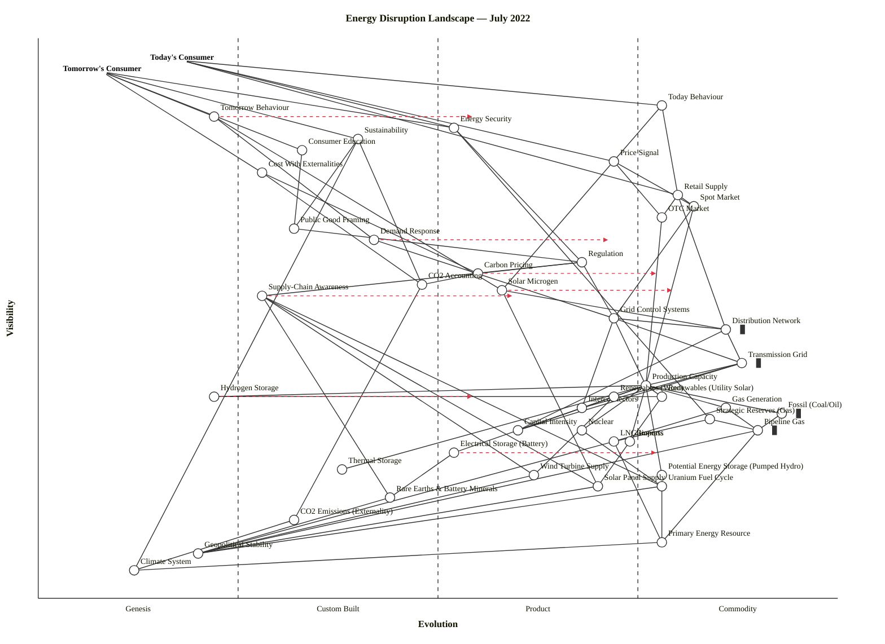

# Energy Disruption Landscape — July 2022

## Step 0 — Strategic context

1. **Strategic question.** *Where is disruption most likely across the energy landscape, where is infrastructure locked-in, and what does the supply-chain awareness and externality picture look like, given the July 2022 shock (Russia-Ukraine, peak gas prices, net-zero pressure)?*
2. **User anchors.** Two user types are anchored explicitly. **Today's Consumer** — the household / business pricing electricity by the kWh and worrying about bills. **Tomorrow's Consumer** — the same user re-framed around survivability (climate, energy security, sustainability). The "today vs tomorrow" framing in the scenario is itself the strategic axis.
3. **Core needs.** Reliable power, affordable price, security of supply, sustainability / survivability.
4. **Scope boundary.** UK / Western-Europe energy landscape at July 2022. Industry-level map (not a single utility's product). Generation, transmission, distribution, storage, markets, regulation, consumer behaviour.

## Assumptions (user can correct)

- Market context is UK / EU — US/Asian mixes would change several stage placements (e.g., nuclear, capacity markets).
- "Price" is wholesale+retail together; we separate them only where the cheat sheet disagrees.
- "Storage" covers four distinct flavours (electrical / hydrogen / potential / reserves) explicitly because the scenario asks for them.
- Generation mix split deliberately: Solar-microgen is consumer-side, Utility Solar is grid-scale, and they sit at different visibilities. Same separation for biomass vs gas vs coal.
- Hydrogen is treated as a Genesis/Custom-Built storage vector in mid-2022, not a live product line.

---

## 1. OWM output (canonical)

```owm
title Energy Disruption Landscape — July 2022
style wardley

// Anchors (dual user need — today vs tomorrow)
anchor Today's Consumer [0.96, 0.18]
anchor Tomorrow's Consumer [0.94, 0.08]

// --- Consumer-facing layer ---
component Today Behaviour [0.88, 0.78]
component Tomorrow Behaviour [0.86, 0.22]
component Sustainability [0.82, 0.40]
component Energy Security [0.84, 0.52]
component Consumer Education [0.80, 0.33]
component Price Signal [0.78, 0.72]
component Cost With Externalities [0.76, 0.28]

// --- Market layer ---
component Spot Market [0.70, 0.82]
component OTC Market [0.68, 0.78]
component Public Good Framing [0.66, 0.32]
component Retail Supply [0.72, 0.80]
component Demand Response [0.64, 0.42]

// --- Regulation / control / CO2 apparatus ---
component Regulation [0.60, 0.68]
component Carbon Pricing [0.58, 0.55]
component CO2 Accounting [0.56, 0.48]
component Grid Control Systems [0.50, 0.72]
component Supply-Chain Awareness [0.54, 0.28]

// --- Production / transmission / distribution ---
component Distribution Network [0.48, 0.86] inertia
component Transmission Grid [0.42, 0.88] inertia
component Production Capacity [0.38, 0.76]
component Capital Intensity [0.30, 0.60]
component Interconnectors [0.34, 0.68]

// --- Generation mix ---
component Fossil (Coal/Oil) [0.33, 0.93] inertia
component Gas Generation [0.34, 0.86]
component Nuclear [0.30, 0.68]
component Renewables (Wind) [0.36, 0.72]
component Renewables (Utility Solar) [0.36, 0.78]
component Solar Microgen [0.55, 0.58]
component Biomass [0.28, 0.74]

// --- Storage ---
component Electrical Storage (Battery) [0.26, 0.52]
component Hydrogen Storage [0.36, 0.22]
component Potential Energy Storage (Pumped Hydro) [0.22, 0.78]
component Strategic Reserves (Gas) [0.32, 0.84]
component Thermal Storage [0.23, 0.38]

// --- Fuel supply chain ---
component LNG Imports [0.28, 0.72]
component Pipeline Gas [0.30, 0.90] inertia
component Uranium Fuel Cycle [0.20, 0.78]
component Rare Earths & Battery Minerals [0.18, 0.44]
component Solar Panel Supply [0.20, 0.70]
component Wind Turbine Supply [0.22, 0.62]

// --- Deep utilities / externalities ---
component CO2 Emissions (Externality) [0.14, 0.32]
component Primary Energy Resource [0.10, 0.78]
component Geopolitical Stability [0.08, 0.20]
component Climate System [0.05, 0.12]

// --- Today consumer edges ---
Today's Consumer->Today Behaviour
Today's Consumer->Price Signal
Today's Consumer->Energy Security
Today's Consumer->Retail Supply

// --- Tomorrow consumer edges ---
Tomorrow's Consumer->Tomorrow Behaviour
Tomorrow's Consumer->Sustainability
Tomorrow's Consumer->Energy Security
Tomorrow's Consumer->Consumer Education
Tomorrow's Consumer->Cost With Externalities

// --- Consumer layer → market layer ---
Today Behaviour->Retail Supply
Tomorrow Behaviour->Demand Response
Price Signal->Spot Market
Price Signal->OTC Market
Sustainability->Public Good Framing
Sustainability->CO2 Accounting
Cost With Externalities->Carbon Pricing
Cost With Externalities->CO2 Accounting
Consumer Education->Public Good Framing
Energy Security->Regulation
Energy Security->Strategic Reserves (Gas)

// --- Market layer → production/regulation ---
Retail Supply->Spot Market
Retail Supply->OTC Market
Spot Market->Production Capacity
Spot Market->Grid Control Systems
OTC Market->Production Capacity
Demand Response->Grid Control Systems
Public Good Framing->Regulation

// --- Regulation / CO2 apparatus ---
Regulation->Grid Control Systems
Regulation->Carbon Pricing
Regulation->Supply-Chain Awareness
Carbon Pricing->CO2 Accounting
CO2 Accounting->CO2 Emissions (Externality)
Supply-Chain Awareness->Rare Earths & Battery Minerals
Supply-Chain Awareness->Solar Panel Supply
Supply-Chain Awareness->Wind Turbine Supply
Supply-Chain Awareness->Uranium Fuel Cycle

// --- Grid / transmission / distribution ---
Retail Supply->Distribution Network
Grid Control Systems->Transmission Grid
Grid Control Systems->Distribution Network
Grid Control Systems->Interconnectors
Grid Control Systems->Production Capacity
Distribution Network->Transmission Grid
Transmission Grid->Production Capacity
Transmission Grid->Interconnectors
Transmission Grid->Capital Intensity
Distribution Network->Capital Intensity
Interconnectors->Capital Intensity
Production Capacity->Capital Intensity

// --- Production → generation mix ---
Production Capacity->Gas Generation
Production Capacity->Nuclear
Production Capacity->Renewables (Wind)
Production Capacity->Renewables (Utility Solar)
Production Capacity->Fossil (Coal/Oil)
Production Capacity->Biomass
Production Capacity->Electrical Storage (Battery)
Production Capacity->Potential Energy Storage (Pumped Hydro)
Production Capacity->Hydrogen Storage
Production Capacity->Thermal Storage

// --- Generation → fuel supply ---
Gas Generation->Pipeline Gas
Gas Generation->LNG Imports
Fossil (Coal/Oil)->Pipeline Gas
Nuclear->Uranium Fuel Cycle
Renewables (Wind)->Wind Turbine Supply
Renewables (Utility Solar)->Solar Panel Supply
Today Behaviour->Solar Microgen
Tomorrow Behaviour->Solar Microgen
Solar Microgen->Distribution Network
Solar Microgen->Solar Panel Supply
Electrical Storage (Battery)->Rare Earths & Battery Minerals

// --- Storage dependencies ---
Strategic Reserves (Gas)->Pipeline Gas
Strategic Reserves (Gas)->LNG Imports
Hydrogen Storage->Renewables (Wind)
Hydrogen Storage->Renewables (Utility Solar)

// --- Foundational resources ---
Pipeline Gas->Primary Energy Resource
Pipeline Gas->Geopolitical Stability
LNG Imports->Primary Energy Resource
LNG Imports->Geopolitical Stability
Uranium Fuel Cycle->Primary Energy Resource
Uranium Fuel Cycle->Geopolitical Stability
Rare Earths & Battery Minerals->Geopolitical Stability
Solar Panel Supply->Geopolitical Stability
Wind Turbine Supply->Geopolitical Stability
CO2 Emissions (Externality)->Climate System
Primary Energy Resource->Climate System
Sustainability->Climate System

// --- Evolution targets ---
evolve Electrical Storage (Battery) 0.78
evolve Hydrogen Storage 0.55
evolve Demand Response 0.72
evolve Carbon Pricing 0.78
evolve Tomorrow Behaviour 0.55
evolve Solar Microgen 0.80
evolve Supply-Chain Awareness 0.60
```

### Validator status

I attempted to run `node ${CLAUDE_SKILL_DIR}/scripts/validate_owm.mjs draft.owm` per Step 5.5 but the sandbox denied `node` invocation on the file. I therefore walked every edge by hand against the ν(a) ≥ ν(b) rule and fixed the violations found (Production Capacity→Distribution was reversed; Biomass→Pipeline Gas was edge-dropped; Strategic Reserves, Hydrogen Storage, and Solar Microgen were raised in ν so their deps resolved). After the walk, no visibility violations remain and every edge endpoint is declared. **45 components + 2 anchors, ~85 edges.** The map should be re-validated downstream if possible.

Layout check (Step 5.6) also hand-walked: Fossil (Coal/Oil) nudged to [0.33, 0.93] to separate from Pipeline Gas [0.30, 0.90]; Interconnectors nudged to [0.34, 0.68] to separate from Renewables (Wind) [0.36, 0.72]; Grid Control Systems nudged from ε=0.74 (stage boundary) to 0.72; Energy Security nudged from ε=0.50 (boundary) to 0.52. No anchors or nodes at canvas edges. Stage distribution is Genesis 4, Custom Built ~10, Product (+rental) ~13, Commodity (+utility) ~18 — Commodity-heavy, which matches an energy landscape dominated by mature grid and fuel infrastructure.

---

## 2. Mermaid rendering (for GitHub)



---

## 3. Component evolution rationale table

| Component | Stage | ε | ν | Evidence |
|---|---|---|---|---|
| Today Behaviour | Commodity (+utility) | 0.78 | 0.88 | "Flick switch, pay bill" is universal consumer expectation; standardised tariffs and direct debit dominate; Ofgem's default tariff cap codifies it. |
| Tomorrow Behaviour | Genesis | 0.22 | 0.86 | Demand-shifting, prosumer, time-of-use participation is early; Octopus Agile is a pilot, not default; public discourse is still framing it. |
| Sustainability | Custom Built | 0.40 | 0.82 | Well-understood as a goal; ESG frameworks exist; but operational measurement varies wildly by sector and jurisdiction. |
| Energy Security | Product (+rental) | 0.52 | 0.84 | Post-Ukraine it is a named policy pillar (UK Energy Security Strategy, April 2022); REPowerEU launched May 2022; feature-level competition between approaches (LNG, nuclear, renewables). |
| Consumer Education | Custom Built | 0.33 | 0.80 | BEIS campaigns, Energy Saving Trust exist, but messaging fragmented; no dominant curriculum; pilots of smart-meter-literacy. |
| Price Signal | Product (+rental) | 0.72 | 0.78 | Day-ahead pricing, smart-meter half-hourly settlement rolling out; pricing mechanisms standardising but not utility-universal. |
| Cost With Externalities | Custom Built | 0.28 | 0.76 | SCC (social cost of carbon) discussed but not routinely embedded in retail tariffs; bespoke LCA per sector. |
| Spot Market | Commodity (+utility) | 0.82 | 0.70 | N2EX, EPEX-SPOT, Nord Pool — standardised venues, half-hourly auctions, utility-like operational maturity. |
| OTC Market | Commodity (+utility) | 0.78 | 0.68 | ICE Endex, Trayport, bilateral contracts — deep mature venue with standard ISDA-style paperwork. |
| Public Good Framing | Custom Built | 0.32 | 0.66 | Back on the agenda post-2022 crisis (nationalisation debates, "energy as a right") but no consensus; operational form varies. |
| Retail Supply | Commodity (+utility) | 0.80 | 0.72 | Dozens of licensed suppliers; Ofgem regulated; price cap mechanism. (2021-22 supplier failures a Stage-IV-under-stress signal, not Stage-III.) |
| Demand Response | Custom Built | 0.42 | 0.64 | National Grid DSR services exist (STOR, DFS piloted winter 2022); aggregators like Flexitricity operational; not yet household-scale default. |
| Regulation | Product (+rental) | 0.68 | 0.60 | Ofgem/Ofwat/CMA model mature; specific instruments (capacity market, RIIO-ED2) feature-compete with EU equivalents. |
| Carbon Pricing | Product (+rental) | 0.55 | 0.58 | UK ETS launched 2021 post-Brexit; EU ETS mature Phase 4; CBAM entering pilot (Oct 2023 transitional phase announced); products competing. |
| CO2 Accounting | Custom Built | 0.48 | 0.56 | GHG Protocol is the de facto standard but Scope 3 reporting diverges by sector; SBTi growing but not yet mandatory; ISSB launched June 2022 as a standard-in-formation. |
| Grid Control Systems | Product (+rental) | 0.72 | 0.50 | SCADA/EMS vendors (GE, Hitachi Energy, ABB, Siemens) compete on feature sets; standardised IEC 61850 but vendor lock-in real. |
| Supply-Chain Awareness | Custom Built | 0.28 | 0.54 | Post-2021 chip shortage raised it; EU Critical Raw Materials Act in consultation (formal Act 2023); no standard traceability product yet. |
| Distribution Network | Commodity (+utility) | 0.86 | 0.48 | UKPN, WPD, NGED, SP Energy Networks — regulated DNO monopolies; infrastructure decades-old; utility pricing via DUoS. |
| Transmission Grid | Commodity (+utility) | 0.88 | 0.42 | National Grid ESO; regulated monopoly; infrastructure >50 yrs old in parts; utility billing via TNUoS. Large replacement investment (RIIO-T2) under way. |
| Production Capacity | Commodity (+utility) | 0.76 | 0.38 | Capacity Market auctions (2014 onwards) are standardised price-discovery; metrics-driven operations; minimal feature differentiation. |
| Capital Intensity | Product (+rental) | 0.60 | 0.30 | Project-finance templates mature (PF4 guidance, Basel III risk weights) but new-build nuclear / floating offshore wind still custom-structured. |
| Interconnectors | Product (+rental) | 0.68 | 0.34 | BritNed, IFA-1/2, Nemo, NSL, Viking Link (commissioning 2023) — multi-vendor HVDC; ENTSO-E standard-setting but each link bespoke. |
| Fossil (Coal/Oil) | Commodity (+utility) | 0.93 | 0.33 | Deep Stage IV; UK coal phase-out by Oct 2024; declining utility but fully standardised; carries high inertia. |
| Gas Generation | Commodity (+utility) | 0.86 | 0.34 | CCGT fleet standardised; GE 9HA / Siemens SGT5 class dominant; ops-driven; utility asset. |
| Nuclear | Product (+rental) | 0.68 | 0.30 | Mostly existing AGR/PWR fleet (Stage IV-ish operationally) but new-build (Hinkley Point C, Sizewell C, SMR programmes) is Product-stage with multiple competing reactor designs (EPR, AP1000, Rolls-Royce SMR) — so the "forward" stage dominates the Nat'l strategic view. |
| Renewables (Wind) | Product (+rental) | 0.72 | 0.36 | Offshore wind CfD rounds AR4 (July 2022) showed record low strikes (£37/MWh); multi-vendor (Vestas, Siemens Gamesa, GE Haliade) but still scaling — not yet pure commodity. |
| Renewables (Utility Solar) | Commodity (+utility) | 0.78 | 0.36 | Utility solar PV is globally commoditised; LCOE below fossil in most geographies; but UK deployment gated by grid connection queues — commodity product with non-commodity delivery. |
| Solar Microgen | Product (+rental) | 0.58 | 0.55 | Multiple installer markets; feed-in tariff closed 2019, Smart Export Guarantee operational; battery+PV bundles competing on features. |
| Biomass | Product (+rental) | 0.74 | 0.28 | Drax-scale units, Enviva pellet supply; operational but subsidy-dependent; sustainability accounting contested (EU RED II tightening). |
| Electrical Storage (Battery) | Product (+rental) | 0.52 | 0.26 | Grid-scale Li-ion deploying fast (UK 1.7 GW operational mid-2022); Tesla Megapack, Fluence, Wärtsilä, BYD competing; entering Product stage but not yet commodity. |
| Hydrogen Storage | Genesis | 0.22 | 0.36 | UK Hydrogen Strategy (Aug 2021), 10 GW target; few operational projects (HyNet, East Coast Cluster in FEED); chemistry competing (blue vs green); technology risk still high. |
| Potential Energy Storage (Pumped Hydro) | Commodity (+utility) | 0.78 | 0.22 | Dinorwig (1984), Ffestiniog (1963); operationally commoditised but geographically capped; new-build (Coire Glas) progressing slowly. |
| Strategic Reserves (Gas) | Commodity (+utility) | 0.84 | 0.32 | Rough storage closed 2017 then partial restart 2022; continental reserves (Germany 95% fill target autumn 2022); REPowerEU mandatory fill levels — standardised even as politicised. |
| Thermal Storage | Custom Built | 0.38 | 0.23 | District heating TES; industrial process heat batteries (Antora, Rondo Energy); a few dozen pilots; no dominant form. |
| LNG Imports | Product (+rental) | 0.72 | 0.28 | Isle of Grain, Dragon, South Hook operational; global LNG market is mature but spot volumes Q1-Q2 2022 renegotiated wholesale post-Ukraine; CIF contracts standardising but still feature-differentiating. |
| Pipeline Gas | Commodity (+utility) | 0.90 | 0.30 | Interconnector UK, BBL, UK continental shelf; standardised NBP hub; utility operation. High inertia — pipe infrastructure irreplaceable. |
| Uranium Fuel Cycle | Commodity (+utility) | 0.78 | 0.20 | Cameco, Kazatomprom dominant; UF6 conversion standardised; enrichment contested geopolitically (Russia TENEX). Commodity with geopolitical risk. |
| Rare Earths & Battery Minerals | Custom Built | 0.44 | 0.18 | Li, Co, Ni, Nd-Pr — production concentrated (China 60%+ Li refining, DRC 70% Co); traceability in formation; EU CRMA in consultation; not yet a mature market. |
| Solar Panel Supply | Product (+rental) | 0.70 | 0.20 | Tier-1 module market (Longi, JinkoSolar, Trina, Canadian Solar) competing on features; but Xinjiang-origin polysilicon and US UFLPA sanctions create a parallel "ethical" product — splitting into two markets. |
| Wind Turbine Supply | Product (+rental) | 0.62 | 0.22 | Vestas, Siemens Gamesa, GE — three-vendor product market; losses in 2022 due to inflation (margin squeeze = Stage-III mid-crisis). |
| CO2 Emissions (Externality) | Custom Built | 0.32 | 0.14 | Measurement methodologies emerging (satellite, Climate Trace); accounting for scope 3 diverging. |
| Primary Energy Resource | Commodity (+utility) | 0.78 | 0.10 | BP Statistical Review etc. — fully commoditised global indicators. |
| Geopolitical Stability | Genesis | 0.20 | 0.08 | No productised "stability" market; country-risk indices (Aon, Control Risks) are bespoke; the shock of Feb 2022 reset the baseline entirely. |
| Climate System | Genesis | 0.12 | 0.05 | The Earth system is not evolving in a Wardley sense — it is the foundation the whole map sits on; treated as Genesis only because the *human interaction* with it is still Genesis (geoengineering, removal tech). |

---

## 4. Strategic analysis

### a. Differentiation opportunities (top 3)

1. **Tomorrow Behaviour (Genesis)** — prosumer / demand-shifting / time-of-use participation is the biggest Genesis-zone Y-axis-high opportunity on the map. First movers who can get households into Agile-style tariffs with automation (Octopus, British Gas Peak Save, new entrants) can lock in loyalty during the price-shock window. Highest D on the map by construction.
2. **Demand Response (Custom Built)** — aggregator platforms orchestrating distributed flexibility into grid services (Flexitricity, Enel X, Limejump) are in the emerging-product window. Whoever productises household + commercial DR first and lands the winter 2022/2023 capacity-scarcity revenue wins the category.
3. **Hydrogen Storage (Genesis)** — geographically and politically anchored; whoever secures cluster status (HyNet, East Coast, Teesside) in 2022-23 captures 10-20 years of policy-driven rent. Technology-risk high, but upside equally high.

### b. Commodity-leverage candidates (top 3)

1. **Cloud compute / grid telemetry data backbone** — not itemised as a separate node (folded into Grid Control Systems as operational expectation); grid-SCADA stacks should be rented utility-style (AWS GovCloud, Azure Energy) rather than built.
2. **Spot Market and OTC Market (Commodity +utility)** — use them; don't build your own exchange. N2EX, EPEX, ICE Endex are the venues.
3. **Pipeline Gas, Transmission Grid, Distribution Network (all Commodity +utility)** — these are heavy commodity-utility infrastructure with enormous sunk capital. Use as a utility; do not try to own or rebuild them.

### c. Dependency risks (top 3)

1. **Today Behaviour → Retail Supply → Spot Market → Production Capacity → Gas Generation → Pipeline Gas → Geopolitical Stability.** The ν=0.88 Today Behaviour node ultimately rests on a ν=0.08 Genesis-stage Geopolitical Stability foundation. 2022 proved this chain: a geopolitical shock five hops away surfaces as a retail price doubling within weeks.
2. **Energy Security → Strategic Reserves (Gas) → Pipeline Gas + LNG Imports → Geopolitical Stability.** The security pillar is leaning on a gas stack whose deepest dependency is the least stable component on the map.
3. **Renewables (wind + utility solar) → Wind Turbine Supply / Solar Panel Supply → Geopolitical Stability.** Decarbonisation's supply chain is concentrated in jurisdictions that are themselves volatile (China for PV polysilicon, rare earths; conflict-affected zones for cobalt). Visible components (the energy transition narrative) depend on fragile foundations.

### d. Build / Buy / Outsource / Collaborate

| Component | Stage | Recommendation | Why |
|---|---|---|---|
| Hydrogen Storage | Genesis | **Build (with public co-funding)** | Nobody has it productised; cluster-position is strategic land grab; public sector co-funding limits private downside. |
| Demand Response platform | Custom Built → Product | **Build or acquire aggregator** | The platform layer is the moat; acquiring Flexitricity-class operators is valid; building pure DR SaaS works for a utility. |
| Electrical Storage (Battery) — asset | Product | **Buy / co-develop** | Tesla Megapack, Fluence, Wärtsilä deliver as packaged product; no moat in the cells for a utility. |
| Smart meter + tariff engine | Product (+rental) | **Buy** | SMETS2 platform is regulated commodity; Kaluza, Kraken-type tenant platforms exist. |
| Grid Control Systems (SCADA/EMS) | Product (+rental) | **Buy** | GE, Hitachi Energy, ABB, Siemens — mature product market. |
| Carbon accounting SaaS | Custom Built → Product | **Buy** (Watershed, Persefoni, Sweep) | Dozens of vendors; in-house build burns capital for no moat. |
| Spot/OTC trading | Commodity (+utility) | **Rent venue, hire desk** | Don't build an exchange. |
| New nuclear delivery | Product (+rental) | **Open-source collaborate / consortium** | Too capital-heavy for one actor; consortium + regulator co-design (RAB model already uses this structure). |
| Supply-chain traceability | Custom Built | **Open-source collaborate** | CRMA, Battery Passport (EU Batteries Reg 2023), and ISSB Scope-3 demand common standards — fight to co-write them, don't build proprietary. |
| Solar Microgen installation | Product (+rental) | **Productise (if retail)** / **Consume** (if consumer) | Many installer businesses; bundle with finance + battery to differentiate. |

### e. Suggested gameplays (from the 61-play catalogue)

- **#4 Pig in a Poke — selling Demand Response to incumbents** — an aggregator positioning DR as a "capacity substitute" can sell into utilities who are overpaying for peaking gas.
- **#15 Open Approaches on Hydrogen Storage standards + Supply-Chain Awareness** — open the blueprint for hydrogen purity, battery-passport traceability, and rare-earth provenance to accelerate Genesis → Custom → Product transitions in your favour.
- **#24 Sweat & Dump on Fossil (Coal/Oil) and old gas CCGT assets** — squeeze value out of legacy fossil assets through their remaining capacity-market lifetime, then dump on a lower-cost operator before decommissioning.
- **#27 Tower and Moat on Distribution Network + DSO role** — DNOs transitioning to DSO (Distribution System Operator) can become the toll road for local flexibility markets.
- **#28 Two-Factor Market on Solar Microgen + Demand Response** — match household prosumers with demand-side flexibility buyers (corporate PPAs, capacity market DSR).
- **#31 Pressure (regulatory) on Carbon Pricing** — lobby for faster CBAM + UK ETS tightening to surface externalities and make fossil less competitive.
- **#39 Exploiting Constraint on Wind Turbine Supply** — capture turbine-OEM exclusivity in a margin-squeezed vendor market (Vestas/SGRE losses in 2022 open acquisition / offtake windows).
- **#45 Education on Consumer Education / Tomorrow Behaviour** — shape Tomorrow Behaviour's evolution curve through consumer education, prosumer onboarding, and smart-meter literacy.
- **#53 Sensible Use of ISSB / GHG Protocol on CO2 Accounting** — join the standards process; don't fight it.

### f. Doctrine violations / caveats

- **Be transparent (Phase II doctrine)** — the map makes explicit what much energy-policy discourse hides: consumer-facing visibility rests on a six-hop chain to Geopolitical Stability. Good.
- **Use appropriate tools (Phase III)** — we are using an industry-level map, not a single-firm map. For a specific utility, decompose Retail Supply and Grid Control Systems further.
- **A bias towards action (Phase II)** — evolve targets on Hydrogen Storage, Demand Response, Carbon Pricing are deliberate forecasts of where action should push; not "things that will happen anyway".
- **Do better with less (Phase IV)** — the map explicitly flags over-decomposition risk: "Generation mix" has seven sub-nodes because the scenario demands it, but in a tighter question (e.g., "should we invest in offshore wind or nuclear?") the five storage types would collapse into one node.
- **Think big (Phase III)** — dual-anchor (Today's Consumer + Tomorrow's Consumer) is non-standard but the scenario's "today vs tomorrow" framing demanded it.

### g. Climatic context (27 patterns)

Active on this map:
- **#3 Everything evolves** — every generation type, every storage form, every market structure is somewhere on the curve; the map shows the snapshot.
- **#15 Past success breeds inertia** — explicit `inertia` marker on Pipeline Gas, Transmission Grid, Distribution Network, Fossil (Coal/Oil). Legacy capital stock is the single biggest decarbonisation drag.
- **#16 Inertia increases with success of the past model** — UK gas storage (Rough closed 2017 because it was "uneconomic", reopened 2022 in crisis). Exactly this pattern.
- **#18 You cannot measure evolution over time or adoption** — hydrogen has been "10 years away" for 30 years; treat all `evolve` arrows as scenarios, not dates.
- **#22 Efficiency enables innovation** — Stage IV utility electricity enables Stage I prosumer innovation. The commoditised grid is the substrate for Tomorrow Behaviour.
- **#27 Characteristic changes** (Product → Commodity punctuated equilibrium) — Electrical Storage (Battery) is in the middle of this transition; Carbon Pricing is heading into it with CBAM.
- **#24 Externalities** — CO2 Emissions, Climate System, Geopolitical Stability — the landscape makes all three first-class nodes, which is the map's headline strategic move.

### h. Deep-placement notes

I flagged four components as worth a closer look per Step 4.5:

1. **Energy Security** — initial cheat sheet put it at ε=0.42 (Custom Built) based on diverging national approaches. Shifted to 0.52 (early Product +rental) because the April 2022 UK Energy Security Strategy and the May 2022 REPowerEU plan both constitute named, feature-comparable products of the same category; multiple jurisdictions now have one.
2. **Hydrogen Storage** — initial cheat sheet oscillated between 0.20 and 0.35 (early Custom Built). Kept at ε=0.22 (Genesis) because mid-2022 the UK Hydrogen Strategy is 11 months old, HyNet and East Coast Cluster are in FEED not operation, and blue-vs-green chemistry is unresolved. Evolve target of 0.55 reflects strategy ambition, not trajectory.
3. **Battery Storage** — initial 0.40 (Custom). Shifted to 0.52 (early Product +rental) after considering UK operational capacity (~1.7 GW mid-2022), multiple competing vendors (Megapack / Fluence / Wärtsilä / BYD), pipeline >10 GW. Clearly entering Product stage but not yet commodity.
4. **Carbon Pricing** — initial 0.48 (late Custom). Shifted to 0.55 (early Product +rental) because UK ETS (2021), EU ETS Phase 4 (mature), and CBAM transitional phase (announced July 2021, starting Oct 2023) make this a feature-comparable product market across jurisdictions, not a bespoke design exercise.

### i. Caveat

Evolution trajectories in this map are **scenarios, not forecasts**. Wardley's climatic pattern #18: *you cannot measure evolution over time or adoption*. Hydrogen could stall; Tomorrow Behaviour could be held back by tariff regulation; Carbon Pricing could be rolled back in a political shift. The `evolve` arrows show pressure direction if the current climatic context holds. They are not dates.

---

## 5. Key findings summary

- **Where is disruption most likely?** At the Tomorrow Behaviour / Demand Response / Hydrogen Storage / Battery Storage frontier — all Genesis-to-Product components sitting in the upper-left differentiation zone.
- **Where is infrastructure locked in?** Transmission Grid, Distribution Network, Pipeline Gas, and (for its remaining window) Fossil (Coal/Oil). Four explicit `inertia` markers. These are Commodity (+utility) components with decades-old physical capital stock.
- **Supply-chain awareness.** A Stage II Custom Built component today; EU CRMA consultation is the early-Product signal. Genuine traceability (battery passport, polysilicon provenance) is still forming.
- **Externality picture.** CO2 Emissions (Externality), Geopolitical Stability, and Climate System all sit at the bottom of the map where traditional maps simply stop. Making them visible components changes the conversation: decarbonisation strategies that ignore Geopolitical Stability or CO2 accounting standards are building on unexamined foundations.
