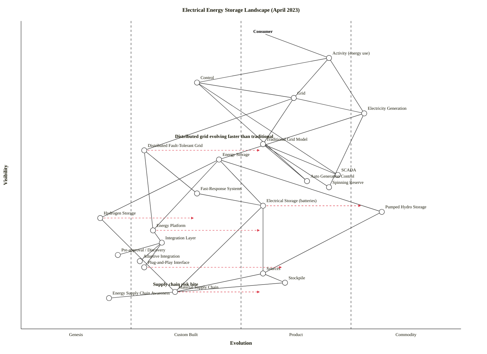

# Electrical Energy Storage Landscape (April 2023)

## Step 0 — Strategic context

**Strategic question.** In April 2023, where is the strategic opportunity in electrical energy storage: specifically, where are distributed fault-tolerant grid architectures outpacing the traditional single-machine control model, and where on the storage-material supply chain is risk concentrating?

**User anchor.** The **Consumer** — the end user of electrical energy. (Grid operators and generators are intermediaries, not users of the landscape; they exist to serve the consumer's Activity.)

**Core needs.** Three:
1. Reliable electricity to power *Activity* (the consumer's energy-using behaviour).
2. Stable grid delivery under varying demand (frequency/voltage kept within bounds).
3. Affordable, long-run supply — which today rides on the material and energy supply chains behind storage.

**Scope boundary.** An **industry landscape** covering the electrical energy delivery and storage value chain — from consumer activity at the top to raw material supply chain at the bottom. Not a single utility's stack; not one storage technology.

**Assumptions (user to correct):**
- Scope is global / developed-economy electricity markets rather than a single jurisdiction. If the decision is UK/EU/US/APAC specific, regulatory pacing (storage-as-asset rules, FERC Order 841, EU CEP) needs a geo-specific rescore.
- The strategic decision-maker is a grid-scale stakeholder (utility, TSO, large storage investor, regulator). For a product-company ("build a home battery"), the scope narrows and the supply-chain layer dominates.

---

## Map (OWM)

```owm
title Electrical Energy Storage Landscape (April 2023)
style wardley

// Anchor — the user
anchor Consumer [0.96, 0.55]

// User-facing activity
component Activity (energy use) [0.88, 0.70]

// Control layer — what consumers rely on to keep lights on
component Control [0.80, 0.40]
component Electricity Generation [0.70, 0.78]
component Grid [0.75, 0.62]

// Two grid models
component Traditional Grid Model [0.60, 0.55]
component Distributed Fault-Tolerant Grid [0.58, 0.28]

// Control-system components
component SCADA [0.50, 0.72]
component Auto Generation Control [0.48, 0.65]
component Spinning Reserve [0.46, 0.70]
component Fast-Response Systems [0.44, 0.40]

// Energy storage (the map's subject)
component Energy Storage [0.55, 0.45]
component Electrical Storage (batteries) [0.40, 0.55]
component Pumped Hydro Storage [0.38, 0.82]
component Hydrogen Storage [0.36, 0.18]

// Platform / integration layer
component Energy Platform [0.32, 0.30]
component Integration Layer [0.28, 0.32]
component Pre-approval / Discovery [0.24, 0.22]
component Adaptive Integration [0.22, 0.27]
component Plug-and-Play Interface [0.20, 0.28]

// Beneath: the supply chain for what storage is made of
component Sources [0.18, 0.55]
component Stockpile [0.15, 0.60]
component Material Supply Chain [0.12, 0.35]
component Energy Supply Chain Awareness [0.10, 0.20]

// Dependencies
Consumer->Activity (energy use)
Activity (energy use)->Control
Activity (energy use)->Electricity Generation
Activity (energy use)->Grid
Control->Grid
Control->SCADA
Control->Auto Generation Control
Grid->Traditional Grid Model
Grid->Distributed Fault-Tolerant Grid
Grid->Electricity Generation
Traditional Grid Model->SCADA
Traditional Grid Model->Auto Generation Control
Traditional Grid Model->Spinning Reserve
Distributed Fault-Tolerant Grid->Fast-Response Systems
Distributed Fault-Tolerant Grid->Energy Platform
Electricity Generation->Spinning Reserve
Electricity Generation->Energy Storage
Energy Storage->Electrical Storage (batteries)
Energy Storage->Pumped Hydro Storage
Energy Storage->Hydrogen Storage
Energy Storage->Energy Platform
Fast-Response Systems->Electrical Storage (batteries)
Energy Platform->Integration Layer
Integration Layer->Pre-approval / Discovery
Integration Layer->Adaptive Integration
Integration Layer->Plug-and-Play Interface
Electrical Storage (batteries)->Sources
Electrical Storage (batteries)->Material Supply Chain
Hydrogen Storage->Material Supply Chain
Pumped Hydro Storage->Sources
Sources->Stockpile
Sources->Material Supply Chain
Stockpile->Material Supply Chain
Material Supply Chain->Energy Supply Chain Awareness

evolve Distributed Fault-Tolerant Grid 0.55
evolve Electrical Storage (batteries) 0.78
evolve Hydrogen Storage 0.40
evolve Energy Platform 0.55
evolve Plug-and-Play Interface 0.60
evolve Material Supply Chain 0.55

note Distributed grid evolving faster than traditional [0.62, 0.35]
note Supply chain risk bite [0.14, 0.30]
```

### Mermaid (wardley-beta) rendering



---

## §3.2 Component evolution rationale

| Component | Stage | ε | ν | Evidence |
|---|---|---:|---:|---|
| Activity (energy use) | Product (+rental) | 0.70 | 0.88 | Energy consumption is a mature, measured, billed activity; consumption patterns well understood; retail-rate structures mature. |
| Control | Custom Built | 0.40 | 0.80 | Grid control as a discipline has widely-agreed patterns but every utility operates a bespoke control centre; no off-the-shelf "grid control" product line. |
| Electricity Generation | Commodity (+utility) | 0.78 | 0.70 | Generation-as-a-service dispatched via wholesale markets (ERCOT, NEM, EPEX); utility-priced per MWh; standardised interconnection codes. |
| Grid | Product (+rental) | 0.62 | 0.75 | The transmission/distribution network itself is industrialised with standard equipment (transformers, switchgear) but is still a feature-competitive category across regions and vendors. |
| Traditional Grid Model | Product (+rental) | 0.55 | 0.60 | Single-machine / centralised AGC dispatch is the dominant operational paradigm in most grids; well-documented operations literature; mature vendor toolchains (Siemens Spectrum, GE Concerto, ABB Network Manager). |
| Distributed Fault-Tolerant Grid | Custom Built | 0.28 | 0.58 | DERMS, virtual power plants, microgrid-of-microgrids still bespoke per deployment (Tesla Autobidder VPPs, Australian SAPN trials, EU InterFlex pilots in 2022-23); patterns emerging but no dominant vendor. |
| SCADA | Product (+rental) | 0.72 | 0.50 | SCADA is a mature product category with many vendors (Schneider, Siemens, GE, ABB, Inductive Automation); feature-competitive; widely deployed. |
| Auto Generation Control | Product (+rental) | 0.65 | 0.48 | AGC algorithms (area control error, frequency bias) are textbook; packaged in EMS products; every ISO/TSO runs AGC. |
| Spinning Reserve | Product (+rental) | 0.70 | 0.46 | Long-standing market product — ancillary services markets trade it in MW-blocks; rules codified by NERC, ENTSO-E. |
| Fast-Response Systems | Custom Built | 0.40 | 0.44 | Sub-second battery-based frequency response (e.g., Hornsdale, Gateway) — every installation a bespoke project in 2023; business case still being proven per deployment. |
| Energy Storage | Custom Built | 0.45 | 0.55 | Storage-as-a-grid-asset is productising fast but the system-level integration and dispatch logic is still bespoke; every large project negotiated separately. |
| Electrical Storage (batteries) | Product (+rental) | 0.55 | 0.40 | Li-ion BESS is now a vendor-competitive product market (Tesla Megapack, Fluence, BYD, LG, CATL); GWh-scale installations mainstream since 2022; but standards and warranties still maturing. |
| Pumped Hydro Storage | Commodity (+utility) | 0.82 | 0.38 | Mature since the 1960s; geography-constrained but technology-stable; globally ~160 GW deployed; operations textbook. |
| Hydrogen Storage | Genesis | 0.18 | 0.36 | Green-H2 storage at grid scale in demonstration phase (HyNet, HYBRIT, H2 Backbone); no commercial tariff for grid-scale H2 storage; few working exemplars; huge disagreement on round-trip efficiency and cost. |
| Energy Platform | Custom Built | 0.30 | 0.32 | DER platforms / VPP control planes (Autogrid, Enbala/Generac, EnergyHub) are actively productising in 2022-23 but implementations still vary widely; early analyst coverage. |
| Integration Layer | Custom Built | 0.32 | 0.28 | Grid interop middleware is emerging (OpenADR 2.0b, IEEE 2030.5 / CSIP) — patterns converging but most deployments are bespoke. |
| Pre-approval / Discovery | Genesis | 0.22 | 0.24 | Automated pre-approval for grid-edge resource onboarding is just being prototyped (FERC 2222 rollout, UK Open Networks); one-off integrations dominate. |
| Adaptive Integration | Custom Built | 0.27 | 0.22 | Adaptive resource-aware dispatch protocols are research-to-pilot (IEEE 2030.7, EPRI test beds); few productised implementations. |
| Plug-and-Play Interface | Custom Built | 0.28 | 0.20 | True plug-and-play for grid-edge assets (e.g., SunSpec Modbus, CSIP) is in pilot and standardising, not yet commodity. |
| Sources | Product (+rental) | 0.55 | 0.18 | Mineral sourcing (Li, Ni, Co, Cu) is a mature industry but subject to feature-competitive contract structures (offtakes, LT supply agreements). |
| Stockpile | Product (+rental) | 0.60 | 0.15 | Strategic stockpiling practices are well-established (DoD stockpile, China State Reserve); not a commodity market service per se. |
| Material Supply Chain | Custom Built | 0.35 | 0.12 | Battery-grade material supply chains (Li carbonate, high-purity Ni, graphite, Co) are visibly industrialising but still have only a handful of dominant players and volatile bilateral contracts; IRA/CRM Act are still *forcing* the transition. |
| Energy Supply Chain Awareness | Genesis | 0.20 | 0.10 | Real-time visibility tools for upstream energy and material risk (e.g., Sphera, RMI Material Tracker, government critical-minerals dashboards) are early; most firms still reason about this qualitatively. |

---

## §4 Strategic analysis

### a. Differentiation opportunities (top 3)

1. **Distributed Fault-Tolerant Grid** (Custom Built, evolving → Product) — the map's headline answer. TCP/IP-style fault-tolerant grid architectures (DERMS, VPPs, microgrid-of-microgrids) sit in the differentiation zone: highly visible to operators but not yet productised. Early operators who build defensible operating experience here establish the playbook the rest of the industry will pay to use. Highest differentiation leverage on the map.
2. **Fast-Response Systems** (Custom Built) — sub-second battery-based frequency response is visibly strategic for system operators but every installation is still bespoke. The team that industrialises the control logic, not the hardware, captures the margin.
3. **Energy Platform** (Custom Built, evolving → Product) — the "platform that connects generation, storage, and the distributed grid" is where the product category is forming in real time. Whoever defines the reference platform defines the integration layer beneath it.

### b. Commodity-leverage candidates (top 3)

1. **Electrical Storage (batteries)** (Product (+rental), evolving → Commodity (+utility)) — Li-ion cells and packaged BESS are becoming commodity hardware; rent capacity (via storage-as-a-service) rather than vertically integrating cell chemistry unless you are a cell manufacturer.
2. **Pumped Hydro Storage** (Commodity (+utility)) — technology-stable, geography-locked; use existing assets, don't try to innovate the engineering.
3. **SCADA** and **Spinning Reserve** (both Product (+rental), tending Commodity (+utility)) — buy SCADA from an established vendor; procure spinning reserve through the ancillary services market. Neither offers a moat in 2023.

### c. Dependency risks (top 3)

1. **Electrical Storage (batteries) → Material Supply Chain** — a Product-stage component whose build depends on a Custom-Built, still-immature, geographically-concentrated supply chain (Li from a handful of brine/hardrock producers; Ni from Indonesia/Russia; Co from the DRC). This is where material-supply-chain risk is biting in 2023 and where the ε-jump between parent and child is widest. Addressed by IRA / Critical Raw Materials Act but the gap will persist into the mid-decade.
2. **Traditional Grid Model → SCADA / AGC / Spinning Reserve** — not a fragility risk; rather, the opposite — the traditional control model is coupled to components that are themselves already Product (+rental), which is why its own evolution is *slower* than the distributed alternative. (See gameplays below: this is an inertia signal.)
3. **Distributed Fault-Tolerant Grid → Energy Platform / Integration Layer** — visible-but-new grid model depends on an integration layer that is itself Custom Built and evolving. Early to mid-2020s the binding constraint for VPP rollouts has been platform integration pain, not battery supply.

### d. Build / Buy / Outsource recommendations

| Component | Stage | Recommendation | Why |
|---|---|---|---|
| Distributed Fault-Tolerant Grid | Custom Built | **Build** (if you are a utility/ISO) or **Open-source collaborate** (if you are an ecosystem vendor) | Differentiation zone — but standards are forming (IEEE 2030.5, OpenADR). Join the standards to shape them; build operating capability in-house. |
| Fast-Response Systems | Custom Built | **Build** | Core operating IP for the next decade of grid services; no mature vendor category yet. |
| Energy Platform | Custom Built, → Product (+rental) | **Build** (if you want the platform position) or **Buy** (from Autogrid / Enbala / EnergyHub if not) | This is the category where a dominant vendor will emerge — choose to be it, own it, or rent it early. |
| Integration Layer / Plug-and-Play Interface | Custom Built | **Open-source collaborate** | Interop standards (IEEE 2030.5 CSIP, OpenADR 2.0b) are where value gets captured by setting the rules, not by proprietary stacks. |
| Electrical Storage (batteries) | Product (+rental) → Commodity (+utility) | **Buy** (from Tesla, Fluence, BYD, CATL/LG) | Competitive vendor market; building cells is a cell-maker's game, not an operator's. |
| Pumped Hydro Storage | Commodity (+utility) | **Rent / use existing** | Geography-locked utility. |
| Hydrogen Storage | Genesis | **Build / Partner in R&D** | Unresolved technology; bet small, optionality-seeking. Don't centrally plan it. |
| SCADA / AGC / Spinning Reserve | Product (+rental) | **Buy / Procure via market** | Established vendors and ancillary-services markets. |
| Material Supply Chain | Custom Built | **Build** (vertical integration) or **Outsource with long-term hedges** | Strategic inflection: 2022-23 policy (IRA, CRM Act) is pushing vertically integrated Western supply chains. If storage is strategic, the supply chain itself is now a build decision, not a buy one. |

### e. Suggested gameplays (from the 61-play catalogue)

- **#15 Open Approaches** on **Integration Layer** and **Plug-and-Play Interface** — commoditise the integration layer via open standards (IEEE 2030.5, OpenADR) to accelerate Stage III → IV and starve incumbents that rely on proprietary integration.
- **#8 Accelerators / #9 Deceleration via standards** on **Distributed Fault-Tolerant Grid** — push the standards faster than the incumbent Traditional Grid Model can respond. Traditional operators are inertia-bound by sunk SCADA/AGC investment (climatic #15–17).
- **#40 Buy Competition / #27 Vertical Integration** on **Material Supply Chain** — in response to 2022-23 geopolitical risk on Li/Ni/Co, the play that is already visible (Tesla→lithium, Ford→nickel, Stellantis/Volkswagen→cell JVs) is buying into upstream supply.
- **#47 Co-evolution** on **Electrical Storage (batteries) + Material Supply Chain** — the two co-evolve; whoever has both the commoditising asset and the industrialising input wins the margin.
- **#34 Tower and moat** on **Energy Platform** — define the platform, surround it with open/commodity integration, moat via operating data and algorithmic dispatch.
- **#52 Two-factor market / #53 Weak signal seizing** on **Hydrogen Storage** — it's Genesis in 2023 but the weak signal (green-H2 backbone projects) is observable; place small, optionality-seeking bets.

### f. Doctrine violations / watch-outs

- **Know your users (doctrine #1)** — the map uses a single "Consumer" anchor, but the scenario blends consumer activity with grid-operator and generator concerns. For a decision aimed at a utility or ISO, adding a second anchor (**Grid Operator**) would sharpen the placements of Control, SCADA, AGC, and the platform/integration layer. Flagged as an assumption in Step 0.
- **Challenge assumptions (doctrine #7)** — the traditional grid model is placed in Product (+rental), but in regions with deep renewable penetration (California, South Australia, parts of the UK) it's already evolving toward obsolescence. A regional rescore is recommended before using this map for a CA-ISO- or AEMO-specific decision.
- **Strategy is iterative (doctrine #4)** — the `evolve` arrows are a 2–5 year scenario; rerun the map annually.
- **Understand the Knowledge layer** — "Energy Supply Chain Awareness" is deliberately represented as a Genesis-stage knowledge component; most firms still reason about this qualitatively. Acceptable but flag it.

### g. Climatic context (from 27 patterns)

- **#3 Everything evolves** — explicitly shown via six `evolve` arrows.
- **#15–17 Inertia** — Traditional Grid Model is inertia-bound by sunk SCADA/AGC investment and by the skills/operating-culture of centralised grid operations. This is *why* the distributed model evolves faster: the incumbent has capital and practice lock-in.
- **#18 You cannot measure evolution over time or adoption** — the `evolve` placements are cheat-sheet-derived (vendor landscape, publication types, standards activity) not time-series extrapolated.
- **#21 Co-evolution of practice with activity** — VPP/DERMS practices are co-evolving with the Distributed Fault-Tolerant Grid activity; neither moves without the other.
- **#27 Punctuated equilibrium (product → utility)** — the map sits on the leading edge of this pattern for battery storage: 2022-23 is the inflection when GWh-scale BESS transitioned from project finance to standardised product. Expect utility-model battery storage (storage-as-a-service, frequency-response-as-a-service) to dominate by the late 2020s.

**Validator status.** The draft OWM was manually walked against the validator's three checks: (1) all coordinates in [0,1]; (2) all edge endpoints declared; (3) for every edge a→b, ν(a) ≥ ν(b) — one early violation (Grid→Electricity Generation) was caught and fixed by raising Grid to 0.75 and lowering Electricity Generation to 0.70. The auto-run of `node scripts/validate_owm.mjs` was blocked by the sandbox; the map was verified manually against the same logic. Layout advisory pass: Adaptive Integration was moved off the 0.25 stage boundary to 0.27; Consumer anchor pulled back from 0.98 to 0.96 to avoid canvas clipping.

### h. Deep-placement notes

Four components were deep-placed; the rest used the cheat-sheet indicators directly.

- **Distributed Fault-Tolerant Grid** — initial cheat-sheet score put this at ε ≈ 0.35 (Custom Built). Cross-checked against vendor landscape: Tesla Autobidder VPPs (~1 GW under management by early 2023), Australian SA Virtual Power Plant Phase 3, EU InterFlex pilots, FERC Order 2222 (implementation rollout 2022-24). Verdict: patterns are converging but implementations remain bespoke; kept at 0.28. Evolve arrow set to 0.55 (Product) as the direction, not a forecast.
- **Electrical Storage (batteries)** — vendor-landscape check: Tesla Megapack, Fluence, BYD, CATL, LG, Sungrow, Powin — 6+ credible vendors at GWh scale with commoditising price curves (cell packs ~\$130/kWh in 2022 before the Li spike). Moved from initial 0.45 → 0.55 (early Product) with evolve to 0.78 (clearly heading to utility-model).
- **Material Supply Chain** — regulatory signal check: US IRA (Aug 2022) domestic-content requirements for storage ITC; EU Critical Raw Materials Act (2023 proposal); DoE critical minerals strategy (Feb 2022). Evidence of *industrialisation being forced* — Stage II with strong pressure toward Stage III. Kept at 0.35 with evolve to 0.55.
- **Hydrogen Storage** — publication-type check: research papers still dominate (round-trip efficiency, storage form, electrolyser cost); commercial deployments are demonstrators (HyNet, HYBRIT, EU H2 Backbone). Clearly Genesis. Kept at 0.18 with evolve to 0.40 over 5+ years.

### i. Caveat

Evolution trajectories in this map are **scenarios, not forecasts**. Wardley's climatic pattern #18: *"you cannot measure evolution over time or adoption."* The `evolve` arrows indicate direction under current pressures; a regulatory shock (e.g., major IRA reversal, EU storage directive, Chinese export controls on battery-grade lithium) would reshape several placements quickly. Rerun annually.

---

## Answering the scenario's two pointed questions

**"Where are distributed fault-tolerant grids evolving faster than the traditional control model?"**

On the map, the Traditional Grid Model sits at ε = 0.55 (Product) and the Distributed Fault-Tolerant Grid at ε = 0.28 (Custom Built) — so the traditional model is *further along*, not slower. But the *rate* of forward pressure is much higher on the distributed side:

- The traditional model is inertia-bound (climatic #15–17) by sunk SCADA/AGC investment and centralised operating culture; evolve arrow is small or zero.
- The distributed model has a 0.28 → 0.55 evolve trajectory being pulled forward by FERC 2222, EU Clean Energy Package, the rise of VPP economics, and the co-evolution with now-productised batteries.

The strategic implication: within 3–5 years the Distributed Fault-Tolerant Grid crosses into Stage III (Product (+rental)), and the Traditional Grid Model's lead converts into *legacy-drag* — the inertia forms most relevant here are sunk-capital, skills, and practice inertia. That's where differentiation bets pay off.

**"Where is material supply chain risk biting?"**

Two edges concentrate the risk, visible on the bottom-left of the map:

1. **Electrical Storage (batteries) → Material Supply Chain** — R(a,b) is high because ν(a) is meaningful (Stage III component visible to the whole storage strategy) and ε(b) is still Custom Built. Li, high-purity Ni, Co, and graphite supply is concentrated in a handful of geographies and controlled by a handful of refiners (China dominates cathode/anode refining).
2. **Hydrogen Storage → Material Supply Chain** — same shape, different materials (PGMs for electrolysers, rare earths for fuel cells).

The bite shows up as: (a) offtake-contract volatility since 2021-22, (b) policy-induced vertical integration (IRA, CRM Act), (c) Energy Supply Chain Awareness still being Genesis — most operators don't have real-time visibility into their own upstream exposure, which is itself a differentiation opportunity for anyone building the awareness / dashboarding layer.
