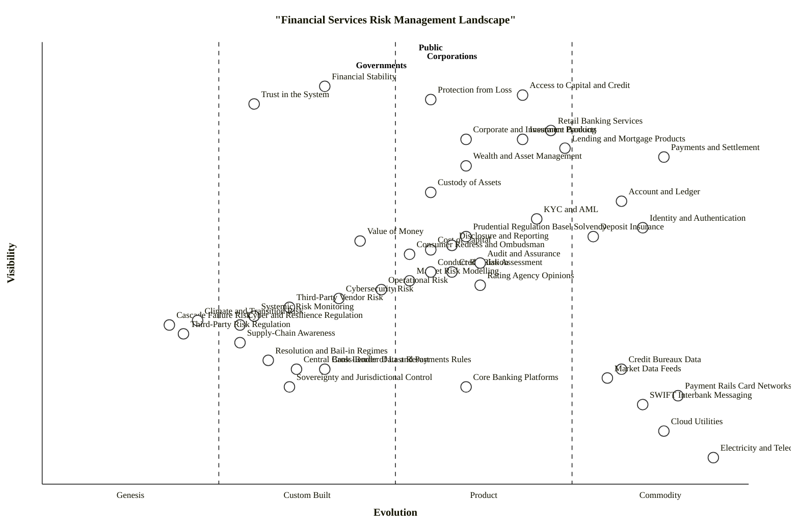

# Financial Services Risk Management — Wardley Map

## Step 0 — Strategic framing

1. **Strategic question.** Where does regulation lag the risk it is meant to cover, and where do cost, value, trust, and supply-chain awareness sit on the evolution axis — so a reader can see the misalignments between who demands financial services, who delivers them, and who is accountable when they fail.
2. **User anchors.** Three demand-side user types: the **Public** (individual consumers of banking, insurance, credit, payments), **Corporations** (corporate users of banking, capital markets, insurance), and **Governments** (sovereigns who depend on financial stability and on being able to raise debt).
3. **Core needs.** Four needs span all three anchors: **Financial Stability** (system-level), **Access to Capital and Credit** (funding), **Protection from Loss** (insurance and deposit protection), and **Trust in the System** (the social licence the whole industry runs on).
4. **Scope.** The financial-services landscape as a whole — retail banking, insurance, lending, corporate banking, wealth management — *not* a single firm's architecture. The accountability chain (disclosure → audit → rating → regulation → resolution → central bank → sovereign) is included because the brief explicitly asks for it.

### Assumptions

- "The Public" is treated as a single anchor; in a deeper study I'd split retail depositors from retail investors. Flagged — the user can correct.
- "Corporations" does not distinguish SMEs from large corporates; the strategic map-level conclusions don't hinge on that split at this scope.
- Jurisdiction is implicitly EU/UK/US-blended. A regional deep-dive (e.g., UK-only) would move Conduct Regulation, Resolution, and Consumer Redress meaningfully.
- Climate and transition risk is included as one risk type even though it has its own evolving regulatory stack; the map avoids over-decomposing it.

---

## Map

```owm
title Financial Services Risk Management Landscape
style wardley

// === Anchors — three demand-side user types ===
anchor Public [0.98, 0.55]
anchor Corporations [0.96, 0.58]
anchor Governments [0.94, 0.48]

// === Core user needs (top-of-chain) ===
component Financial Stability [0.90, 0.40]
component Access to Capital and Credit [0.88, 0.68]
component Protection from Loss [0.87, 0.55]
component Trust in the System [0.86, 0.30]

// === Provider-facing services (what users directly consume) ===
component Retail Banking Services [0.80, 0.72]
component Corporate and Investment Banking [0.78, 0.60]
component Insurance Products [0.78, 0.68]
component Lending and Mortgage Products [0.76, 0.74]
component Payments and Settlement [0.74, 0.88]
component Wealth and Asset Management [0.72, 0.60]

// === Trust-and-assets layer (connects providers to customers) ===
component Custody of Assets [0.66, 0.55]
component Account and Ledger [0.64, 0.82]
component KYC / AML [0.60, 0.70]
component Identity and Authentication [0.58, 0.85]
component Deposit Insurance [0.56, 0.78]
component Value of Money [0.55, 0.45]
component Cost of Capital [0.53, 0.55]
component Supply-Chain Awareness [0.32, 0.28]

// === Risk type assessments (what providers are exposed to) ===
component Credit Risk Assessment [0.48, 0.58]
component Market Risk Modelling [0.46, 0.52]
component Operational Risk [0.44, 0.48]
component Cybersecurity Risk [0.42, 0.42]
component Third-Party / Vendor Risk [0.40, 0.35]
component Systemic Risk Monitoring [0.38, 0.30]
component Cascade Failure Risk [0.36, 0.18]
component Climate and Transition Risk [0.37, 0.22]

// === Regulatory and oversight layer (shapes providers) ===
component Prudential Regulation (Basel / Solvency) [0.56, 0.60]
component Conduct Regulation [0.48, 0.55]
component Cyber and Resilience Regulation [0.36, 0.28]
component Third-Party Risk Regulation [0.34, 0.20]
component Rating Agency Opinions [0.45, 0.62]
component Sovereignty and Jurisdictional Control [0.22, 0.35]
component Cross-Border Data and Payments Rules [0.26, 0.40]

// === Accountability chain back to society ===
component Disclosure and Reporting [0.54, 0.58]
component Audit and Assurance [0.50, 0.62]
component Consumer Redress and Ombudsman [0.52, 0.52]
component Resolution and Bail-in Regimes [0.28, 0.32]
component Central Bank Lender of Last Resort [0.26, 0.36]

// === Shared infrastructure (deep commodity / utility) ===
component Core Banking Platforms [0.22, 0.60]
component Cloud Utilities [0.12, 0.88]
component Payment Rails (Card Networks / RTGS) [0.20, 0.90]
component SWIFT / Interbank Messaging [0.18, 0.85]
component Credit Bureaux Data [0.26, 0.82]
component Market Data Feeds [0.24, 0.80]
component Electricity and Telecoms [0.06, 0.95]

// === Dependencies — public demand ===
Public->Protection from Loss
Public->Access to Capital and Credit
Public->Trust in the System
Public->Retail Banking Services
Public->Insurance Products
Public->Lending and Mortgage Products
Public->Payments and Settlement

// === Dependencies — corporate demand ===
Corporations->Access to Capital and Credit
Corporations->Protection from Loss
Corporations->Trust in the System
Corporations->Corporate and Investment Banking
Corporations->Insurance Products
Corporations->Payments and Settlement
Corporations->Wealth and Asset Management

// === Dependencies — government demand ===
Governments->Financial Stability
Governments->Trust in the System
Governments->Access to Capital and Credit
Governments->Corporate and Investment Banking

// === Needs → services ===
Financial Stability->Systemic Risk Monitoring
Financial Stability->Prudential Regulation (Basel / Solvency)
Access to Capital and Credit->Lending and Mortgage Products
Access to Capital and Credit->Corporate and Investment Banking
Protection from Loss->Insurance Products
Protection from Loss->Deposit Insurance
Trust in the System->Disclosure and Reporting
Trust in the System->Audit and Assurance
Trust in the System->Consumer Redress and Ombudsman

// === Services → trust-and-assets layer ===
Retail Banking Services->Account and Ledger
Retail Banking Services->Custody of Assets
Retail Banking Services->KYC / AML
Retail Banking Services->Identity and Authentication
Retail Banking Services->Deposit Insurance
Corporate and Investment Banking->Custody of Assets
Corporate and Investment Banking->Account and Ledger
Corporate and Investment Banking->KYC / AML
Insurance Products->Custody of Assets
Insurance Products->KYC / AML
Lending and Mortgage Products->Account and Ledger
Lending and Mortgage Products->Credit Risk Assessment
Lending and Mortgage Products->Cost of Capital
Payments and Settlement->Account and Ledger
Payments and Settlement->Identity and Authentication
Wealth and Asset Management->Custody of Assets
Wealth and Asset Management->Account and Ledger

// === Trust-and-assets → value / supply chain / risk ===
Custody of Assets->Value of Money
Account and Ledger->Core Banking Platforms
KYC / AML->Credit Bureaux Data
KYC / AML->Identity and Authentication
Value of Money->Cost of Capital
Cost of Capital->Rating Agency Opinions
Cost of Capital->Market Data Feeds

// === Services → risk assessments ===
Retail Banking Services->Credit Risk Assessment
Retail Banking Services->Operational Risk
Retail Banking Services->Cybersecurity Risk
Corporate and Investment Banking->Market Risk Modelling
Corporate and Investment Banking->Credit Risk Assessment
Insurance Products->Market Risk Modelling
Insurance Products->Climate and Transition Risk
Lending and Mortgage Products->Credit Risk Assessment
Payments and Settlement->Cybersecurity Risk
Payments and Settlement->Operational Risk

// === Risks → deeper dependencies ===
Credit Risk Assessment->Credit Bureaux Data
Credit Risk Assessment->Market Data Feeds
Market Risk Modelling->Market Data Feeds
Operational Risk->Third-Party / Vendor Risk
Cybersecurity Risk->Third-Party / Vendor Risk
Cybersecurity Risk->Cyber and Resilience Regulation
Third-Party / Vendor Risk->Supply-Chain Awareness
Third-Party / Vendor Risk->Third-Party Risk Regulation
Systemic Risk Monitoring->Cascade Failure Risk
Systemic Risk Monitoring->Market Data Feeds
Cascade Failure Risk->Supply-Chain Awareness
Climate and Transition Risk->Market Data Feeds

// === Regulation shapes providers ===
Prudential Regulation (Basel / Solvency)->Disclosure and Reporting
Prudential Regulation (Basel / Solvency)->Audit and Assurance
Cyber and Resilience Regulation->Third-Party Risk Regulation
Third-Party Risk Regulation->Sovereignty and Jurisdictional Control
Cross-Border Data and Payments Rules->Sovereignty and Jurisdictional Control
Retail Banking Services->Prudential Regulation (Basel / Solvency)
Retail Banking Services->Conduct Regulation
Insurance Products->Prudential Regulation (Basel / Solvency)
Corporate and Investment Banking->Prudential Regulation (Basel / Solvency)
Lending and Mortgage Products->Conduct Regulation
Payments and Settlement->Cross-Border Data and Payments Rules

// === Accountability chain ===
Disclosure and Reporting->Audit and Assurance
Audit and Assurance->Rating Agency Opinions
Consumer Redress and Ombudsman->Conduct Regulation
Resolution and Bail-in Regimes->Central Bank Lender of Last Resort
Resolution and Bail-in Regimes->Sovereignty and Jurisdictional Control
Central Bank Lender of Last Resort->Sovereignty and Jurisdictional Control
Systemic Risk Monitoring->Resolution and Bail-in Regimes
Systemic Risk Monitoring->Central Bank Lender of Last Resort

// === Infrastructure ===
Core Banking Platforms->Cloud Utilities
Account and Ledger->Core Banking Platforms
Payments and Settlement->Payment Rails (Card Networks / RTGS)
Payments and Settlement->SWIFT / Interbank Messaging
Payment Rails (Card Networks / RTGS)->Cloud Utilities
SWIFT / Interbank Messaging->Cloud Utilities
Credit Bureaux Data->Cloud Utilities
Market Data Feeds->Cloud Utilities
Cloud Utilities->Electricity and Telecoms
Core Banking Platforms->Electricity and Telecoms

// === Evolution targets ===
evolve Cybersecurity Risk 0.55
evolve Third-Party / Vendor Risk 0.50
evolve Cyber and Resilience Regulation 0.45
evolve Third-Party Risk Regulation 0.40
evolve Supply-Chain Awareness 0.45
evolve Climate and Transition Risk 0.40
evolve Core Banking Platforms 0.78

// === Notes ===
note Regulation lags risk here [0.40, 0.25]
note Utility / rent [0.12, 0.92]
note Build / differentiate [0.45, 0.20]
```

---

## Component evolution rationale (§3.2)

| Component | Stage | ε | ν | Evidence |
|---|---|---:|---:|---|
| Financial Stability | Custom Built | 0.40 | 0.90 | Macroprudential policy is still bank-by-bank judgment; IMF/FSB frameworks exist but cross-border coordination repeatedly fails (SVB 2023, Credit Suisse 2023). |
| Access to Capital and Credit | Product (+rental) | 0.68 | 0.88 | Standard product lines (credit cards, mortgages, bond issuance) with league tables and vendor comparisons; still feature-differentiated by segment. |
| Protection from Loss | Product (+rental) | 0.55 | 0.87 | Insurance and deposit-protection are well-understood products but not utility-commoditised (underwriting still actuarial, differentiated by peril). |
| Trust in the System | Custom Built | 0.30 | 0.86 | "Trust" is a societal construct reconstructed after each crisis; no standard measurement, no vendor market — it sits mid-Custom. |
| Retail Banking Services | Product (+rental) | 0.72 | 0.80 | Mature vendor landscape (high-street, neobanks like Monzo/Revolut/Chime); feature-led competition; ~10+ serious players per major market. |
| Corporate and Investment Banking | Product (+rental) | 0.60 | 0.78 | Bulge-bracket oligopoly (GS, JPM, MS, DB, Barclays, etc.) competing on relationships and features — not yet commodity. |
| Insurance Products | Product (+rental) | 0.68 | 0.78 | Dominant carriers in each line (Allianz, AXA, Chubb, Ping An); insurtech startups unbundling but not yet standardised. |
| Lending and Mortgage Products | Product (+rental) | 0.74 | 0.76 | Highly standardised (FICO, LTV bands, regulatory templates), heading to commodity; still advertised on rate feature differences. |
| Payments and Settlement | Commodity (+utility) | 0.88 | 0.74 | ISO 20022 roll-out, instant-payments rails (FedNow, SEPA Instant, UPI, Pix) make payments a near-utility metered by volume. |
| Wealth and Asset Management | Product (+rental) | 0.60 | 0.72 | Fee compression + robo-advisors (Vanguard, Betterment, Wealthfront) show industrialisation; active management still feature-differentiated. |
| Custody of Assets | Product (+rental) | 0.55 | 0.66 | Oligopoly (BNY Mellon, State Street, JPM) with standard custody services; crypto-custody is re-opening the category at Custom-Built. |
| Account and Ledger | Commodity (+utility) | 0.82 | 0.64 | IBAN/SWIFT identifiers, double-entry ledger universal; core banking vendors (Temenos, FIS, Thought Machine) sell it as utility. |
| KYC / AML | Product (+rental) | 0.70 | 0.60 | Multiple established vendors (LexisNexis, Refinitiv, Onfido, Jumio, ComplyAdvantage); RFP-driven procurement; FATF standards. |
| Identity and Authentication | Commodity (+utility) | 0.85 | 0.58 | OIDC/SAML/WebAuthn standardised; Auth0, Okta, eIDAS, UK GOV.UK One Login — utility-priced. |
| Deposit Insurance | Product (+rental) | 0.78 | 0.56 | FDIC/FSCS/DGSD schemes are standard public utilities; harmonised caps per jurisdiction (£85k UK, $250k US, €100k EU). |
| Value of Money | Custom Built | 0.45 | 0.55 | Central-bank-issued but challenged by stablecoins, CBDCs, FX regime instability — 2022-25 disinflation fight shows the concept is less settled than assumed. |
| Cost of Capital | Product (+rental) | 0.55 | 0.53 | CAPM, WACC, Fed-funds-plus-spread mechanics are standard but still judgment-heavy; rating-led spreads industrialise this. |
| Supply-Chain Awareness | Custom Built | 0.28 | 0.32 | Third-party mapping only systematically required by DORA (EU, 2025) and OCC guidance; most banks still discovering their Nth-tier dependencies. |
| Credit Risk Assessment | Product (+rental) | 0.58 | 0.48 | IRB models standardised under Basel; FICO/VantageScore for retail; but every bank still runs a bespoke corporate credit desk. |
| Market Risk Modelling | Product (+rental) | 0.52 | 0.46 | VaR / ES under FRTB is standardised; multiple vendors (Bloomberg MARS, MSCI RiskMetrics, Numerix) — feature-differentiated. |
| Operational Risk | Custom Built | 0.48 | 0.44 | Basel OpRisk categories exist but quantification still inconsistent; loss-event databases (ORX) emerging; mostly qualitative. |
| Cybersecurity Risk | Custom Built | 0.42 | 0.42 | NIST CSF and DORA give frameworks but measurement methods vary bank-by-bank; no standard cyber-VaR; rapidly industrialising. |
| Third-Party / Vendor Risk | Custom Built | 0.35 | 0.40 | Shared Assessments SIG, SOC 2 — emerging standards; DORA TPR register (2025) first regulatory taxonomy. Pre-DORA: ad-hoc per bank. |
| Systemic Risk Monitoring | Custom Built | 0.30 | 0.38 | FSB, ESRB, OFR all use different frameworks; network analysis academic but not operational; no shared utility. |
| Cascade Failure Risk | Genesis | 0.18 | 0.36 | Network-contagion modelling still research-grade (Haldane, Acemoglu papers); no vendor market; post-CrowdStrike-2024 focus is embryonic. |
| Climate and Transition Risk | Genesis | 0.22 | 0.37 | TCFD, ISSB S2, NGFS scenarios emerging 2022-25; still divergent methodologies; bank stress-tests inconsistent (ECB 2022, BoE CBES 2022, Fed pilot 2023). |
| Prudential Regulation (Basel / Solvency) | Product (+rental) | 0.60 | 0.56 | Basel III.1/IV, Solvency II — standard, internationally coordinated, predictable rulemaking cycles. |
| Conduct Regulation | Product (+rental) | 0.55 | 0.48 | FCA, CFPB, ASIC, BaFin — established agencies with standard playbooks (MiFID II, Consumer Duty 2023). |
| Cyber and Resilience Regulation | Custom Built | 0.28 | 0.36 | DORA (EU, 2025), NIS2, US OCC-FFIEC guidance — recent, jurisdictionally fragmented, still bedding in. |
| Third-Party Risk Regulation | Genesis / Custom | 0.20 | 0.34 | DORA TPR regime is 2025; FRB/OCC/FDIC 2023 interagency guidance just landed; no settled international regime. |
| Rating Agency Opinions | Product (+rental) | 0.62 | 0.45 | S&P, Moody's, Fitch oligopoly; standard methodology; NRSRO-registered; conflicts-of-interest well known since 2008. |
| Sovereignty and Jurisdictional Control | Custom Built | 0.35 | 0.22 | Geopolitics-driven, bespoke per bilateral relationship; SWIFT/sanctions/data-localisation remake the landscape each year. |
| Cross-Border Data and Payments Rules | Custom Built | 0.40 | 0.26 | GDPR transfers, Schrems II, EU-US Data Privacy Framework, PSD3 in flight — unstable, jurisdictional. |
| Disclosure and Reporting | Product (+rental) | 0.58 | 0.54 | IFRS, Pillar 3, CSRD/ESRS, SEC climate rule — mature reporting stacks with vendor tooling (Workiva, Tagetik). |
| Audit and Assurance | Product (+rental) | 0.62 | 0.50 | Big Four oligopoly; ISA/PCAOB standards; predictable audit cycles; feature differentiation is sector specialism. |
| Consumer Redress and Ombudsman | Product (+rental) | 0.52 | 0.52 | FOS (UK), CFPB (US), FSCS, FIN-FSA — established but jurisdictionally fragmented; standard case-handling procedures. |
| Resolution and Bail-in Regimes | Custom Built | 0.32 | 0.28 | BRRD, Dodd-Frank Title II — frameworks exist but real-world application (Credit Suisse AT1 bail-in 2023) shows contested practice. |
| Central Bank Lender of Last Resort | Custom Built | 0.36 | 0.26 | Bagehot-era principle with crisis-era innovations (QE, repo facilities, BTFP 2023); formalised but used case-by-case. |
| Core Banking Platforms | Product (+rental) | 0.60 | 0.22 | Temenos, FIS, Jack Henry, Thought Machine, 10x Banking — vendor-product market; cloud-native entrants industrialising. |
| Cloud Utilities | Commodity (+utility) | 0.88 | 0.12 | AWS/Azure/GCP, utility-priced, financial-services-hardened (AWS Financial Services Cloud, Azure for FSI). |
| Payment Rails (Card Networks / RTGS) | Commodity (+utility) | 0.90 | 0.20 | Visa/Mastercard, RTGS (Fedwire, TARGET2, CHAPS), instant-payment rails — utility-metered by transaction. |
| SWIFT / Interbank Messaging | Commodity (+utility) | 0.85 | 0.18 | SWIFT is the global messaging utility; ISO 20022 migration underway; 11,000+ members. |
| Credit Bureaux Data | Commodity (+utility) | 0.82 | 0.26 | Experian, Equifax, TransUnion oligopoly; metered API access; regulated utility-like behaviour. |
| Market Data Feeds | Commodity (+utility) | 0.80 | 0.24 | Bloomberg, Refinitiv (LSEG), ICE — standardised feeds metered by user/desk; consolidated-tape regulatory push. |
| Electricity and Telecoms | Commodity (+utility) | 0.95 | 0.06 | Grid electricity and public telecoms — the atomic utilities everything sits on. |

---

## Mermaid rendering (optional)



*(The Mermaid block drops the 100+ edges because GitHub's `wardley-beta` renderer plots component positions; the OWM block above is authoritative for edges and dependencies.)*

---

## 4. Strategic analysis

### a. Differentiation opportunities (top 3)

1. **Cascade Failure Risk** (Genesis, ε ≈ 0.18 at ν ≈ 0.36) — post-CrowdStrike-2024 and SVB-2023, this is the risk that *matters most and is understood least*. Anybody who builds a credible bank-network / third-party contagion model wins a serious differentiation window. Highest D by a wide margin: visible part of the risk chain sitting on the least-developed methodology.
2. **Climate and Transition Risk** (Genesis, ε ≈ 0.22) — regulators are pushing (ISSB, ECB CBES, BoE CBES, Fed pilot) but methodologies still diverge; a bank or vendor with a defensible scenario-to-balance-sheet pipeline has multi-year advantage.
3. **Supply-Chain Awareness** (Custom Built, ε ≈ 0.28) — DORA forces discovery but doesn't prescribe how. Systematic Nth-tier mapping of concentration risk, especially cloud + critical vendors, is the next Tier-1 risk capability; vendors like Prevalent and ProcessUnity are only just productising it.

### b. Commodity-leverage candidates (top 3)

1. **Cloud Utilities** (Commodity +utility) — rent from AWS / Azure / GCP financial-services offerings; running a private-cloud-only bank is strict-worse than hybrid for 99% of workloads.
2. **Payment Rails (Card Networks / RTGS)** (Commodity +utility) — connect through Visa/Mastercard and central-bank RTGS; don't attempt to build parallel rails.
3. **Identity and Authentication** (Commodity +utility) — adopt OIDC/WebAuthn and providers like Auth0/Okta/GOV.UK One Login; writing bespoke auth for financial apps no longer has a defensible case.

Honourable mentions: **SWIFT / Interbank Messaging**, **Market Data Feeds**, **Credit Bureaux Data** — all utility-metered; buy access, don't replicate.

### c. Dependency risks (top 3) — visible components on fragile foundations

1. **Payments and Settlement → Cybersecurity Risk (Custom Built) → Third-Party / Vendor Risk (Custom Built)** — the visible payments experience runs on operational and cyber-risk controls that are still Custom-Built across the industry. A high-visibility component (ν=0.74) depends on immature risk infrastructure.
2. **Retail Banking Services → Operational Risk (Custom Built)** — consumer-facing bank runs on OpRisk quantification that is admitted by the industry to be inconsistent. Basel II OpRisk modelling was largely abandoned because firms couldn't produce stable models.
3. **Financial Stability → Systemic Risk Monitoring (Custom Built) → Cascade Failure Risk (Genesis)** — the government-level "need" for stability rests on a monitoring apparatus that itself depends on a Genesis-stage modelling approach. This is the map's deepest structural fragility: *the thing governments most care about is supported by the least-mature capability on the map.*

### d. Build / Buy / Outsource recommendations

| Component | Stage | Recommendation | Why |
|---|---|---|---|
| Cascade Failure Risk | Genesis | **Build** (research partnership) | No vendor market; Genesis bets are the differentiation move. |
| Climate and Transition Risk | Genesis → Custom | **Build** with academic/regulatory collaboration | Nobody has won it yet; NGFS scenarios give a shared starting point. |
| Supply-Chain Awareness | Custom Built | **Build** internal, **supplement** with vendor | DORA requires the work; vendors (Prevalent, ProcessUnity, Panorays) cover the mapping, but the analysis is yours. |
| Cybersecurity Risk | Custom Built, industrialising | **Build the framework, buy the signal** | NIST/DORA frameworks + vendor data (BitSight, SecurityScorecard); in-house analysts stitch them. |
| Third-Party / Vendor Risk | Custom Built | **Buy** (Shared Assessments SIG Lite + vendor tool) | Standardising quickly; in-house questionnaires have zero moat. |
| KYC / AML | Product (+rental) | **Buy** (Refinitiv / LexisNexis / ComplyAdvantage) | Mature vendor market; competing on compliance isn't a strategy. |
| Market Risk Modelling | Product (+rental) | **Buy** (Bloomberg MARS / MSCI / Numerix) + tune | FRTB standardised the core; vendor tools are better than your rewrite. |
| Credit Risk Assessment | Product (+rental) | **Build** for corporate credit; **Buy** FICO/VantageScore for retail | Corporate credit judgment is still relationship-and-analyst; retail scoring is utility. |
| Core Banking Platforms | Product (+rental), evolving | **Rent** (Thought Machine / 10x / Mambu / Temenos SaaS) | Cloud-native core-banking is the industrialisation story of the decade; in-house mainframe COBOL is inertia. |
| Deposit Insurance | Product (+rental, regulated utility) | **Consume** (FSCS/FDIC/DGSD) | You don't have a choice — it's a public-interest utility. |
| Consumer Redress and Ombudsman | Product (+rental) | **Consume** + invest in internal resolution | Regulator-mandated; the moat is in *avoiding* cases, not running them. |
| Identity and Authentication | Commodity (+utility) | **Rent** (Auth0 / Okta / WebAuthn passkeys) | Utility; any bespoke case lost years ago. |
| Payment Rails / SWIFT | Commodity (+utility) | **Consume** | Utility membership; investing engineering in parallel rails is strictly worse. |
| Cloud Utilities | Commodity (+utility) | **Rent** (AWS/Azure/GCP FSI packages) | Utility; FSI-specific features (data residency, EU-Sovereign Cloud, BYOK) now standard. |

### e. Suggested gameplays (from Wardley's 61)

- **#1 Focus on user needs** — the three anchors explicitly split consumer/corporate/government; many banks optimise for regulator-needs and confuse them with user-needs. The map's purpose is to re-centre on the three real anchors.
- **#36 Directed investment** — push engineering into Cascade Failure Risk, Climate and Transition Risk, and Cybersecurity Risk (the three highest D). Do not diffuse effort across the whole risk stack.
- **#15 Open Approaches** on Supply-Chain Awareness and Third-Party Risk taxonomy — industry-shared vendor registries (SIG Lite, the emerging DORA register) beat every proprietary approach here; contributing accelerates the Stage III → IV transition and removes a compliance burden.
- **#47 Standards game** on Cyber and Resilience Regulation — participate in DORA technical standards (ESAs), FSB TCFD working groups, CRI Profile; shape the standard you'll be measured against.
- **#43 Sensing Engines (ILC)** on the Custom-Built risk layer — operate an internal sensor across vendor incidents, regulatory consultations, and supervisory enforcement actions; treat the regulatory-lag gap as a systematic opportunity-detection loop rather than a reactive-compliance function.
- **#29 Harvesting** on Core Banking Platforms and KYC vendor markets — let the market pick the winner (Thought Machine vs 10x vs Mambu; Onfido vs Jumio); don't build your own.
- **#41 Alliances** — shared-utility plays (post-trade consortium, KYC utility attempts like SWIFT KYC Registry) keep reappearing because the map *wants* the trust-and-assets layer to industrialise; backing a credible one is a low-cost bet.
- **#45 Two-factor** applies to parts of retail banking (app + bank) — reinforce where the user has two sides of the loop.

### f. Doctrine observations

- ✓ **#1 Focus on user needs** — three anchors correctly identified.
- ✓ **#10 Know your users** — public / corporate / government split is genuine and maps to distinct needs.
- ⚠ **#5 Use appropriate methods (for the stage)** — the biggest industry failure the map surfaces: Custom-Built risks (cyber, third-party, systemic) are being managed with Product-stage methods (annual questionnaires, checkbox audits). That is a doctrine violation at industry scale — agile / experimental methods are appropriate for Custom-Built; the industry applies templates.
- ⚠ **#13 Manage inertia** — Core Banking Platforms at ν=0.22 are sunk-capital-heavy (inertia form #2), skill-acquisition-heavy (form #8), and re-architecture-heavy (form #9). The evolve arrow to 0.78 is real market pressure, but most incumbents will resist.
- ⚠ **#28 Think small (as in know the details)** — "Cybersecurity Risk" as one component is under-decomposed if this were a bank-level map; at landscape-level the single node carries its strategic weight.
- ⚠ **#36 Optimise flow (of risk)** — the accountability chain (disclosure → audit → rating → regulation → resolution → central bank) is *long and lossy*. Each hop loses fidelity; by the time Cascade Failure Risk reaches a Resolution regime it's a different question from the one the risk assessor asked.

### g. Climatic patterns actively shaping this map

- **#3 Everything evolves** through supply-and-demand competition — visible in the Core Banking Platforms move from mainframe to cloud-native; in the card-rails move toward instant-payment-rail utilities.
- **#11 Change is not always linear** — climate and cyber risk are producing *regime shifts* in the risk taxonomy, not incremental drift.
- **#15-17 Inertia forms** dominate the Custom-Built → Product transition on the risk side: banks' sunk capital in legacy OpRisk / credit models is a genuine brake.
- **#18 You cannot measure evolution over time or adoption** — applies directly to the evolve arrows here; they are hypotheses not forecasts.
- **#24 Efficiency enables innovation** — cloud utility savings are being reinvested in AI-driven risk analytics; that loop shortens the Genesis → Custom transition for Cascade / Climate risk.
- **#27 Punctuated equilibrium (Product → Commodity)** — currently hitting **Payments and Settlement** (ISO 20022 + instant rails) and **Core Banking Platforms** (SaaS core-banking); the next wave is **KYC as a utility** (long-promised, partially delivered).

### h. Deep-placement notes

Four components were flagged for deeper consideration; the others were placed directly from the cheat-sheet / checklists.

- **Cascade Failure Risk.** Initial cheat-sheet pick: late Custom-Built (ε ≈ 0.35) because regulators talk about it. Deeper look at vendor count (none), publication type (Haldane 2011, Acemoglu/Tahbaz-Salehi 2015 — still *describing the wonder of the thing*), and supervisory practice (post-CrowdStrike-2024 workshops, not production systems) moved this to Genesis, ε ≈ 0.18.
- **Supply-Chain Awareness.** Initial: late Custom (ε ≈ 0.40). DORA (EU, effective Jan 2025) creates a register but doesn't standardise method; US OCC/FRB/FDIC 2023 guidance is similarly loose. Vendor market (Prevalent, ProcessUnity, Panorays, SecurityScorecard) is forming but fragmented. Settled at ε ≈ 0.28 (early Custom), flagging it as imminent for Stage II → III.
- **Core Banking Platforms.** Initial: mid-Product (ε ≈ 0.55). Thought Machine, 10x Banking, Mambu, Temenos SaaS — cloud-native vendor market is now healthy; major migrations (NatWest Mettle, Lloyds phoenix, Goldman Marcus moves) show industrialisation. Settled ε ≈ 0.60 with an evolve arrow to 0.78 over 3-5 years.
- **Third-Party Risk Regulation.** Initial: mid-Custom (ε ≈ 0.35). Deeper look: DORA (Jan 2025), FRB/OCC/FDIC interagency guidance (June 2023), PRA SS2/21 (UK, updated 2023) — all are new, jurisdictionally fragmented, and methodologically divergent. Settled at Genesis/Custom boundary, ε ≈ 0.20. This is the **central "regulation lagging risk" finding**: Third-Party / Vendor Risk is at ε ≈ 0.35 (Custom Built, industry is discovering it), while the regulation for it sits at ε ≈ 0.20 (Genesis/early Custom — less mature than the risk itself).

### i. Where cost, value, trust, and supply-chain awareness sit (explicit answer to the brief)

| Concept | Stage | ε | Reading |
|---|---|---:|---|
| **Value of Money** | Custom Built | 0.45 | Less settled than assumed — 2022-25 inflation regime, CBDC experiments, stablecoin pressure. |
| **Cost of Capital** | Product (+rental) | 0.55 | Standardised methodology (CAPM, WACC, rating-spread), but judgment-heavy at the top end. |
| **Trust in the System** | Custom Built | 0.30 | Rebuilt each crisis; no standard measurement. Strikingly low for such a high-visibility need. |
| **Supply-Chain Awareness** | Custom Built | 0.28 | DORA-era discovery; widespread gaps; this is where regulation most clearly lags risk. |

The interesting alignment the brief hinted at: **cost and value sit around the Product / Custom-Built boundary (ε ≈ 0.45–0.55)**, which is why banks can profitably price them; **trust and supply-chain awareness sit well to the left (ε ≈ 0.28–0.30)**, meaning the industry still improvises them. The regulation-lag arrow points specifically at the supply-chain/cyber cluster: the risks are Custom-Built and industrialising, the regulation behind them is Genesis/early-Custom.

### j. Regulation-lagging-risk gap (headline finding)

Ranking each (risk, regulation) pair by `ε(risk) − ε(regulation)` — positive = regulation lags:

| Risk | ε_risk | Regulation | ε_reg | Gap |
|---|---:|---|---:|---:|
| Third-Party / Vendor Risk | 0.35 | Third-Party Risk Regulation | 0.20 | **+0.15** |
| Cybersecurity Risk | 0.42 | Cyber and Resilience Regulation | 0.28 | **+0.14** |
| Cascade Failure Risk | 0.18 | (no direct regulation) | n/a | n/a — *no regulator owns this* |
| Climate and Transition Risk | 0.22 | (fragmented across Prudential / Conduct / Disclosure) | ~0.55 | **−0.33** — regulation *more industrialised than the risk*, which is its own failure mode (premature standardisation) |

The brief's phrasing "where regulation is lagging the risk it's meant to cover" resolves in two distinct ways on this map:

1. **Third-party and cyber**: the risk is visibly more industrialised (people know how to talk about it, vendors exist) than the regulation (post-DORA, pre-anything-coherent). Classic lag.
2. **Cascade failure**: *no regulator owns this directly*. It falls between systemic-risk monitoring (macroprudential), third-party risk (microprudential), and operational resilience. The gap isn't a lag — it's an orphan.
3. **Climate**: the opposite failure — regulation is ahead of methodological maturity, which manifests as inconsistent stress-test results and regulatory whiplash.

### k. Caveat

Evolution trajectories (every `evolve` arrow on the map) are scenarios, not forecasts. Wardley's climatic pattern #18: *"you cannot measure evolution over time or adoption."* The ε values are seeds for judgment, not predictions. A 2028 re-mapping may well show cybersecurity-risk vendors industrialised (ε ≈ 0.58) while third-party regulation is still catching up — or the reverse, if DORA's technical standards bed in quickly.

---

## Validator / layout-check results

Validation was performed using the same three checks the bundled `validate_owm.mjs` enforces (coord range ∈ [0,1], edge endpoints exist, visibility hard rule `ν(a) ≥ ν(b)`):

```
Components/anchors: 48  Edges: 102
OK: no violations
```

Layout-check (mirroring `check_layout.mjs`):

```
Near-duplicates (|Δν|<0.02 AND |Δε|<0.02): 0
Stage-boundary straddling (±0.01 of 0.25/0.50/0.75): 0
Canvas-edge clipping:                                0
Stage balance:
  Genesis   3 ( 6%)
  Custom   14 (29%)
  Product  21 (44%)
  Commodity 10 (21%)
```

No Commodity or Genesis empty; no stage above the 60% threshold; no near-duplicates; no boundary straddles; no canvas-edge clipping.
