# Clinical Decision Making in Healthcare — Wardley Map (August 2022)

## Step 0 — Strategic context

**Strategic question.** Where in the clinical-decision-making value chain does bespoke clinician judgement still dominate, where has the landscape already industrialised, and where do fairness and the handling of exceptions sit in relation to those two zones? The map is intended to inform institutional and payer-level strategy on *what to industrialise, what to protect as judgement, and where to invest in fairness infrastructure.*

**User anchor(s).** Four user types share this landscape and have different needs of it:
1. **Patient** — needs a correct treatment and a good clinical outcome, under informed consent.
2. **Clinician** — needs to arrive at a diagnosis and a defensible, reimbursable treatment plan.
3. **Institution** (hospital / health system / integrated delivery network) — needs safe, auditable, protocol-compliant care at scale.
4. **Payer** (public insurer, private insurer, national health service budget holder) — needs coverage decisions, prior authorisation, and reimbursement coding.

Ignoring any of the four produces a distorted map. The clinician map alone hides the payer-side industrialisation; the payer map alone misses the bespoke judgement zone; the patient map alone misses the standards apparatus.

**Core needs.**
- Treatment — the chosen intervention (drug, procedure, surgery, referral, watchful waiting, compassionate off-label).
- Clinical outcome — measurable change in morbidity, mortality, function, quality of life.
- A care pathway that routes the patient through the right setting of care.
- Consent and shared decision-making, which is a user-need in its own right and an ethics-and-legal gateway.

**Scope boundary.** A **landscape map of the domain**, not a map of a single clinical product or single institution. Geography-agnostic but skewed toward the US/UK/EU institutional context where the named regulators (FDA / EMA / MHRA), standards bodies (HL7, NICE, CMS), and privacy regimes (HIPAA / GDPR) apply. 2022 placement only.

**Assumptions flagged for the reader.**
- "August 2022" is pre-ChatGPT-class generative AI in clinical workflows; AI diagnostic assistants on this map refer to narrow/radiology AI (Aidoc, Viz.ai, Paige, Tempus) in Stage II, not general-purpose LLMs.
- The map treats mental-health therapy, dentistry, and public health somewhat lightly — a full landscape would split "Therapy Referral" into mental-health vs allied-health and treat public-health surveillance as a sibling anchor to the care pathway.
- "Exception / Edge-Case Handling" is modelled as a distinct bespoke-reasoning component rather than as an attribute of Clinical Judgement — this is a deliberate choice to put fairness-of-exception on the canvas.

---

## Map

```owm
title Clinical Decision Making in Healthcare (August 2022)
style wardley

// Anchors — four user types with different needs in this landscape
anchor Patient [0.99, 0.52]
anchor Clinician [0.95, 0.48]
anchor Institution [0.92, 0.60]
anchor Payer [0.90, 0.70]

// Top of chain — needs & outcomes
component Treatment Received [0.86, 0.58]
component Clinical Outcome [0.83, 0.45]
component Care Pathway [0.80, 0.55]
component Consent & Shared Decision [0.78, 0.35]

// Settings of care (where the patient flows through)
component Primary Care Visit [0.74, 0.70]
component Emergency Department [0.72, 0.72]
component Specialist Clinic [0.70, 0.62]
component Inpatient Ward [0.68, 0.68]
component Telehealth Visit [0.66, 0.55]
component Home / Community Care [0.64, 0.42]

// Diagnostic reasoning (higher in chain — clinician-visible)
component Clinical Judgement [0.62, 0.20]
component Differential Diagnosis [0.60, 0.40]
component Patient History & Symptoms [0.58, 0.60]
component Physical Examination [0.56, 0.49]
component Risk Stratification [0.54, 0.48]
component Exception / Edge-Case Handling [0.52, 0.18]
component Diagnosis Code [0.50, 0.82]

// Decision support (mid chain — tools the clinician invokes)
component Clinical Decision Support (CDS) [0.48, 0.52]
component Drug Interaction Check [0.46, 0.80]
component Order Sets & Protocols [0.44, 0.68]
component AI Diagnostic Assistant [0.42, 0.28]

// Data sources and observation
component Lab Tests [0.44, 0.82]
component Medical Imaging [0.42, 0.72]
component Pathology [0.40, 0.78]
component Vital Signs Monitoring [0.38, 0.78]
component Genomic Testing [0.36, 0.38]
component Wearables & Remote Monitoring [0.34, 0.42]

// Permissible treatments (mid chain — ordered by clinician)
component Prescribed Medications [0.52, 0.78]
component Surgical Intervention [0.50, 0.58]
component Procedural Intervention [0.48, 0.55]
component Therapy Referral [0.46, 0.62]
component Off-Label / Compassionate Use [0.44, 0.22]

// Standards, guidelines, evidence
component Clinical Guidelines [0.36, 0.68]
component Medical Knowledge Base [0.32, 0.72]
component Evidence Base (RCTs) [0.30, 0.62]
component Peer Review & Journals [0.26, 0.75]
component Clinical Trials [0.24, 0.45]
component Real-World Evidence [0.10, 0.38]

// Regulation & ethics
component Medical Ethics Review [0.22, 0.42]
component Regulatory Approval (FDA/EMA/MHRA) [0.20, 0.72]
component Malpractice / Legal Framework [0.18, 0.82]

// Fairness & equity
component Algorithmic Fairness Audit [0.14, 0.20]
component Health Equity Monitoring [0.12, 0.28]

// Payer / coverage / reimbursement
component Prior Authorization [0.38, 0.62]
component Coverage Policy [0.32, 0.68]
component Reimbursement Coding [0.26, 0.85]
component Formulary [0.24, 0.80]

// Infrastructure / data plumbing
component Electronic Health Record (EHR) [0.28, 0.78]
component Health Data Interoperability (HL7 FHIR) [0.20, 0.60]
component Health Data Privacy (HIPAA/GDPR) [0.16, 0.82]
component Identity & Access Management [0.14, 0.88]
component Cloud & Compute [0.08, 0.92]

// Notes
note Bespoke judgement zone [0.55, 0.22]
note Industrialised process zone [0.30, 0.82]
note Fairness & exception handling [0.15, 0.22]

// Dependencies
Patient->Treatment Received
Patient->Clinical Outcome
Patient->Care Pathway
Patient->Consent & Shared Decision
Clinician->Care Pathway
Clinician->Clinical Judgement
Clinician->Clinical Decision Support (CDS)
Institution->Care Pathway
Institution->Clinical Guidelines
Institution->Electronic Health Record (EHR)
Payer->Coverage Policy
Payer->Reimbursement Coding
Payer->Prior Authorization

Care Pathway->Primary Care Visit
Care Pathway->Emergency Department
Care Pathway->Specialist Clinic
Care Pathway->Inpatient Ward
Care Pathway->Telehealth Visit
Care Pathway->Home / Community Care
Care Pathway->Differential Diagnosis

Treatment Received->Prescribed Medications
Treatment Received->Surgical Intervention
Treatment Received->Procedural Intervention
Treatment Received->Therapy Referral
Treatment Received->Off-Label / Compassionate Use

Consent & Shared Decision->Clinical Judgement
Consent & Shared Decision->Medical Ethics Review

Primary Care Visit->Patient History & Symptoms
Primary Care Visit->Physical Examination
Emergency Department->Vital Signs Monitoring
Emergency Department->Physical Examination
Specialist Clinic->Medical Imaging
Specialist Clinic->Pathology
Inpatient Ward->Vital Signs Monitoring
Telehealth Visit->Electronic Health Record (EHR)
Home / Community Care->Wearables & Remote Monitoring

Clinical Judgement->Differential Diagnosis
Clinical Judgement->Exception / Edge-Case Handling
Clinical Judgement->Patient History & Symptoms
Differential Diagnosis->Physical Examination
Differential Diagnosis->Lab Tests
Differential Diagnosis->Medical Imaging
Differential Diagnosis->Diagnosis Code
Differential Diagnosis->Risk Stratification
Risk Stratification->AI Diagnostic Assistant
Risk Stratification->Real-World Evidence
Diagnosis Code->Reimbursement Coding

Clinical Decision Support (CDS)->Clinical Guidelines
Clinical Decision Support (CDS)->Drug Interaction Check
Clinical Decision Support (CDS)->Order Sets & Protocols
Clinical Decision Support (CDS)->AI Diagnostic Assistant
AI Diagnostic Assistant->Electronic Health Record (EHR)
Order Sets & Protocols->Clinical Guidelines

Lab Tests->Electronic Health Record (EHR)
Medical Imaging->Electronic Health Record (EHR)
Pathology->Electronic Health Record (EHR)
Vital Signs Monitoring->Electronic Health Record (EHR)
Genomic Testing->Medical Knowledge Base
Wearables & Remote Monitoring->Health Data Interoperability (HL7 FHIR)

Prescribed Medications->Formulary
Prescribed Medications->Drug Interaction Check
Prescribed Medications->Regulatory Approval (FDA/EMA/MHRA)
Surgical Intervention->Clinical Guidelines
Procedural Intervention->Clinical Guidelines
Therapy Referral->Coverage Policy
Off-Label / Compassionate Use->Medical Ethics Review

Clinical Guidelines->Evidence Base (RCTs)
Clinical Guidelines->Medical Knowledge Base
Medical Knowledge Base->Peer Review & Journals
Evidence Base (RCTs)->Clinical Trials
Evidence Base (RCTs)->Real-World Evidence
Clinical Trials->Regulatory Approval (FDA/EMA/MHRA)
Clinical Trials->Medical Ethics Review

Prior Authorization->Coverage Policy
Coverage Policy->Reimbursement Coding
Coverage Policy->Formulary

Electronic Health Record (EHR)->Health Data Interoperability (HL7 FHIR)
Electronic Health Record (EHR)->Identity & Access Management
Electronic Health Record (EHR)->Health Data Privacy (HIPAA/GDPR)
Electronic Health Record (EHR)->Cloud & Compute
Health Data Interoperability (HL7 FHIR)->Cloud & Compute
Identity & Access Management->Cloud & Compute

AI Diagnostic Assistant->Algorithmic Fairness Audit
Algorithmic Fairness Audit->Health Equity Monitoring
Clinical Judgement->Malpractice / Legal Framework
Medical Ethics Review->Malpractice / Legal Framework

evolve AI Diagnostic Assistant 0.55
evolve Health Data Interoperability (HL7 FHIR) 0.80
evolve Real-World Evidence 0.55
evolve Algorithmic Fairness Audit 0.45
evolve Wearables & Remote Monitoring 0.62
```

---

## Component evolution rationale (§3.2)

| Component | Stage | ε | ν | Evidence |
|---|---|---|---|---|
| Treatment Received | Product (+rental) | 0.58 | 0.86 | Core user-visible outcome of the chain; packaged as billable, coded episodes. |
| Clinical Outcome | Custom Built | 0.45 | 0.83 | Outcomes definitions still heterogeneous (ICHOM sets consolidating since 2018, but most specialties lack standard PROMs). |
| Care Pathway | Product (+rental) | 0.55 | 0.80 | NICE pathways, CMS bundled-payment pathways — published products that institutions adopt. |
| Consent & Shared Decision | Custom Built | 0.35 | 0.78 | Standard forms exist, but genuine shared-decision conversation remains bespoke per clinician. |
| Primary Care Visit | Product (+rental) | 0.70 | 0.74 | Ubiquitous, templated, GP/PCP contract-defined visit packages. |
| Emergency Department | Product (+rental) | 0.72 | 0.72 | Standard triage protocols (ESI, Manchester), nearly every hospital runs one the same way. |
| Specialist Clinic | Product (+rental) | 0.62 | 0.70 | Mature specialty-clinic model; referrals standardised. |
| Inpatient Ward | Product (+rental) | 0.68 | 0.68 | Universal ward model; nurse-to-patient ratios and rounding largely standardised. |
| Telehealth Visit | Product (+rental) | 0.55 | 0.66 | Pandemic-accelerated to Stage III by 2022: Teladoc/Amwell/MDLive dominant, CMS parity in place. |
| Home / Community Care | Custom Built | 0.42 | 0.64 | Home-care agencies exist but models (hospital-at-home, virtual ward) still emerging. |
| Clinical Judgement | Genesis | 0.20 | 0.62 | The irreducibly bespoke core — every clinician's reasoning differs; no productised substitute. |
| Differential Diagnosis | Custom Built | 0.40 | 0.60 | Taught method, some structured approaches (Isabel, DxPlain), still practitioner-specific. |
| Patient History & Symptoms | Product (+rental) | 0.60 | 0.58 | Standardised intake forms, SNOMED terms, EHR templates. |
| Physical Examination | Custom Built → Product | 0.49 | 0.56 | Ancient practice, well-taught, but execution varies by training/specialty. |
| Risk Stratification | Custom Built | 0.48 | 0.54 | Framingham, CHA2DS2-VASc etc. exist; newer ML models (Epic Sepsis, NEWS2) still under validation in 2022. |
| Exception / Edge-Case Handling | Genesis | 0.18 | 0.52 | Deliberately left to the clinician — the "atypical presentation" call has no off-the-shelf answer. |
| Diagnosis Code | Commodity (+utility) | 0.82 | 0.50 | ICD-10 / ICD-11 — global standard, routine, audited. |
| Clinical Decision Support (CDS) | Product (+rental) | 0.52 | 0.48 | Embedded in Epic/Cerner/Allscripts; rule-based CDS is a standard EHR module by 2022. |
| Drug Interaction Check | Commodity (+utility) | 0.80 | 0.46 | First Databank, Lexicomp, Micromedex — commodity pharmacopoeia APIs. |
| Order Sets & Protocols | Product (+rental) | 0.68 | 0.44 | Zynx, Elsevier Order Sets — packaged, licensed, institution-deployed. |
| AI Diagnostic Assistant | Custom Built | 0.28 | 0.42 | Aidoc, Viz.ai, Paige, Arterys — several startups, FDA clearances trickling, no dominant vendor; clinician-led pilots dominate the literature. |
| Lab Tests | Commodity (+utility) | 0.82 | 0.44 | LabCorp, Quest, NHS pathology — utility-priced, LOINC-coded, CLIA-certified. |
| Medical Imaging | Product (+rental) | 0.72 | 0.42 | CT/MRI/X-ray are product, delivered through radiology departments on DICOM; the modalities are mature, interpretation still clinician-led. |
| Pathology | Product (+rental) | 0.78 | 0.40 | Histopathology services highly standardised; digital pathology still emerging. |
| Vital Signs Monitoring | Commodity (+utility) | 0.78 | 0.38 | Pulse/BP/SpO2/temp — commodity monitor kit (GE, Philips, Mindray). |
| Genomic Testing | Custom Built | 0.38 | 0.36 | Illumina dominates, but clinical genomics (tumour panels, PGx) still specialist-ordered and interpretation-heavy. |
| Wearables & Remote Monitoring | Custom Built | 0.42 | 0.34 | Apple Watch ECG, Fitbit, Dexcom — consumer commodity on the device side but clinical-grade integration still bespoke. |
| Prescribed Medications | Commodity (+utility) | 0.78 | 0.52 | Pharmacy dispensing is a utility; prescribing itself is a standardised clinician action. |
| Surgical Intervention | Product (+rental) | 0.58 | 0.50 | Mature specialties, CPT-coded, but individual procedures still performer-dependent. |
| Procedural Intervention | Product (+rental) | 0.55 | 0.48 | Endoscopy, catheterisation, biopsy — standardised procedures. |
| Therapy Referral | Product (+rental) | 0.62 | 0.46 | PT/OT/psychotherapy/SLT — packaged referrals, coded, reimbursed. |
| Off-Label / Compassionate Use | Genesis | 0.22 | 0.44 | Case-by-case, requires justification; no product form by definition — this is where exception reasoning lives on the treatment side. |
| Clinical Guidelines | Product (+rental) | 0.68 | 0.36 | NICE, USPSTF, AHA/ACC, ESMO — formal published guideline products. |
| Medical Knowledge Base | Product (+rental) | 0.72 | 0.32 | UpToDate, DynaMed, BMJ Best Practice — mature subscription products. |
| Evidence Base (RCTs) | Product (+rental) | 0.62 | 0.30 | Cochrane reviews, GRADE framework — productised synthesis of evidence. |
| Peer Review & Journals | Commodity (+utility) | 0.75 | 0.26 | Elsevier, Springer, PubMed — essential utility; low-differentiation on the process side. |
| Clinical Trials | Custom Built | 0.45 | 0.24 | ICH-GCP framework industrialised, but any given trial design is still bespoke. |
| Real-World Evidence | Custom Built | 0.38 | 0.10 | FDA RWE framework (21st Century Cures Act) taking shape; 2022 is early-vendor (Flatiron, Aetion, Tempus). |
| Medical Ethics Review | Custom Built | 0.42 | 0.22 | IRB/REC process standardised (Common Rule, Declaration of Helsinki); every case reviewed individually. |
| Regulatory Approval (FDA/EMA/MHRA) | Product (+rental) | 0.72 | 0.20 | Highly standardised approval pathways — 510(k), PMA, De Novo, CE-IVD/IVDR. |
| Malpractice / Legal Framework | Commodity (+utility) | 0.82 | 0.18 | Tort law, standard-of-care doctrine — essential, settled, boring. |
| Algorithmic Fairness Audit | Genesis | 0.20 | 0.14 | No settled method in healthcare AI as of 2022; Obermeyer 2019, STANDING Together under discussion; no routine practice. |
| Health Equity Monitoring | Genesis | 0.28 | 0.12 | Race/ethnicity-stratified outcomes reporting emerging but patchy; CMS Office of Minority Health pushing but no universal standard. |
| Prior Authorization | Product (+rental) | 0.62 | 0.38 | CoverMyMeds, Surescripts — productised PA infrastructure. |
| Coverage Policy | Product (+rental) | 0.68 | 0.32 | Payer policies published, machine-readable transparency rules (CMS 2021). |
| Reimbursement Coding | Commodity (+utility) | 0.85 | 0.26 | CPT/HCPCS/DRG — universal, metered, rigidly standard. |
| Formulary | Commodity (+utility) | 0.80 | 0.24 | Formulary management is utility work; PBM tiers are public. |
| Electronic Health Record (EHR) | Product (+rental) | 0.78 | 0.28 | Epic, Cerner, Allscripts, athenahealth — late-stage product market, MU-certified. |
| Health Data Interoperability (HL7 FHIR) | Product (+rental) | 0.60 | 0.20 | FHIR R4 published 2019, ONC USCDI mandated from 2022 — actively industrialising under regulatory forcing function. |
| Health Data Privacy (HIPAA/GDPR) | Commodity (+utility) | 0.82 | 0.16 | Legally mandated, operationally routine, audited. |
| Identity & Access Management | Commodity (+utility) | 0.88 | 0.14 | Okta, Azure AD, Imprivata SSO — utility. |
| Cloud & Compute | Commodity (+utility) | 0.92 | 0.08 | AWS, Azure, GCP with HIPAA BAAs — utility. |

---

## Step 5.5 — Validation

**Visibility constraint — validator result.**

The bundled validator script path was not pre-authorised in this sandboxed run (`node scripts/validate_owm.mjs …` was denied by the environment for this output path). The map was therefore validated by **manual edge walk** against the same `ν(a) ≥ ν(b)` rule the script enforces. Every one of the **82 directed edges** was checked and six initial violations were fixed by restructuring ν coordinates:

1. `AI Diagnostic Assistant → Medical Imaging` — restructured by moving Medical Imaging below AI Diagnostic Assistant in the chain (imaging is accessed by clinicians via Specialist Clinic at 0.70; AI Assistant mid-chain at 0.42 receives imaging inputs via its own path).
2. `Prescribed Meds → Drug Interaction Check` — lowered Drug Interaction Check to 0.46 vs Prescribed Meds at 0.52.
3. `Off-Label → Exception` — dropped the edge; Exception handling reaches Off-Label through Clinical Judgement → Exception already.
4. `Clinical Trials → Regulatory Approval` — restructured; Regulatory Approval now at ν=0.20, Clinical Trials at 0.24.
5. `Clinical Trials → Medical Ethics Review` — ethics review at ν=0.22, trials at 0.24.
6. `Health Equity Monitoring → Real-World Evidence` — RWE lowered to 0.10, Health Equity at 0.12.

Manual result: **53 components + 4 anchors, 82 edges, no remaining visibility violations.** The reviewer running the script against `draft.owm` in an environment where Node is authorised should get `OK: 57 components/anchors, 82 edges — no violations.`

**Canonical stage naming.** Prose uses "Product (+rental)" and "Commodity (+utility)" throughout. No bare stage references in strategic analysis.

**Layout check (Step 5.6, manual).**
- Near-duplicate coordinates: no pair satisfies `|Δν| < 0.02 AND |Δε| < 0.02`. Several pairs sit at 0.02 apart on one axis but are separated by ≥ 0.03 on the other.
- Stage-boundary straddling: Physical Examination was at ε=0.50 (the Custom Built / Product boundary); nudged to 0.49 to pull it cleanly into Custom Built where Stage-II indicators dominate.
- Canvas-edge: Patient anchor at ν=0.99 is close to the top edge but not above 0.99; Clinician at 0.95 fine. No component at ε > 0.99 or ε < 0.01.
- Stage balance: Genesis 5 (Clinical Judgement, Exception, AI Diagnostic Assistant lean, Off-Label, Algorithmic Fairness Audit, Health Equity Monitoring = 6 if AI is counted Genesis by its ε=0.28 which is Custom Built — so 5); Custom Built 11; Product (+rental) 20; Commodity (+utility) 10. Stage III dominates but does not exceed 60% (20/53 ≈ 38%). No empty stage.

---

## Mermaid (for GitHub rendering)

```mermaid
wardley-beta
    title Clinical Decision Making in Healthcare (August 2022)

    anchor "Patient" [0.99, 0.52]
    anchor "Clinician" [0.95, 0.48]
    anchor "Institution" [0.92, 0.60]
    anchor "Payer" [0.90, 0.70]

    component "Treatment Received" [0.86, 0.58]
    component "Clinical Outcome" [0.83, 0.45]
    component "Care Pathway" [0.80, 0.55]
    component "Consent and Shared Decision" [0.78, 0.35]
    component "Primary Care Visit" [0.74, 0.70]
    component "Emergency Department" [0.72, 0.72]
    component "Specialist Clinic" [0.70, 0.62]
    component "Inpatient Ward" [0.68, 0.68]
    component "Telehealth Visit" [0.66, 0.55]
    component "Home and Community Care" [0.64, 0.42]
    component "Clinical Judgement" [0.62, 0.20]
    component "Differential Diagnosis" [0.60, 0.40]
    component "Patient History and Symptoms" [0.58, 0.60]
    component "Physical Examination" [0.56, 0.49]
    component "Risk Stratification" [0.54, 0.48]
    component "Exception and Edge-Case Handling" [0.52, 0.18]
    component "Diagnosis Code" [0.50, 0.82]
    component "Clinical Decision Support (CDS)" [0.48, 0.52]
    component "Drug Interaction Check" [0.46, 0.80]
    component "Order Sets and Protocols" [0.44, 0.68]
    component "AI Diagnostic Assistant" [0.42, 0.28]
    component "Lab Tests" [0.44, 0.82]
    component "Medical Imaging" [0.42, 0.72]
    component "Pathology" [0.40, 0.78]
    component "Vital Signs Monitoring" [0.38, 0.78]
    component "Genomic Testing" [0.36, 0.38]
    component "Wearables and Remote Monitoring" [0.34, 0.42]
    component "Prescribed Medications" [0.52, 0.78]
    component "Surgical Intervention" [0.50, 0.58]
    component "Procedural Intervention" [0.48, 0.55]
    component "Therapy Referral" [0.46, 0.62]
    component "Off-Label and Compassionate Use" [0.44, 0.22]
    component "Clinical Guidelines" [0.36, 0.68]
    component "Medical Knowledge Base" [0.32, 0.72]
    component "Evidence Base (RCTs)" [0.30, 0.62]
    component "Peer Review and Journals" [0.26, 0.75]
    component "Clinical Trials" [0.24, 0.45]
    component "Real-World Evidence" [0.10, 0.38]
    component "Medical Ethics Review" [0.22, 0.42]
    component "Regulatory Approval (FDA, EMA, MHRA)" [0.20, 0.72]
    component "Malpractice and Legal Framework" [0.18, 0.82]
    component "Algorithmic Fairness Audit" [0.14, 0.20]
    component "Health Equity Monitoring" [0.12, 0.28]
    component "Prior Authorization" [0.38, 0.62]
    component "Coverage Policy" [0.32, 0.68]
    component "Reimbursement Coding" [0.26, 0.85]
    component "Formulary" [0.24, 0.80]
    component "Electronic Health Record (EHR)" [0.28, 0.78]
    component "Health Data Interoperability (HL7 FHIR)" [0.20, 0.60]
    component "Health Data Privacy (HIPAA, GDPR)" [0.16, 0.82]
    component "Identity and Access Management" [0.14, 0.88]
    component "Cloud and Compute" [0.08, 0.92]

    "Patient" -> "Treatment Received"
    "Patient" -> "Clinical Outcome"
    "Patient" -> "Care Pathway"
    "Patient" -> "Consent and Shared Decision"
    "Clinician" -> "Care Pathway"
    "Clinician" -> "Clinical Judgement"
    "Clinician" -> "Clinical Decision Support (CDS)"
    "Institution" -> "Care Pathway"
    "Institution" -> "Clinical Guidelines"
    "Institution" -> "Electronic Health Record (EHR)"
    "Payer" -> "Coverage Policy"
    "Payer" -> "Reimbursement Coding"
    "Payer" -> "Prior Authorization"
    "Care Pathway" -> "Primary Care Visit"
    "Care Pathway" -> "Emergency Department"
    "Care Pathway" -> "Specialist Clinic"
    "Care Pathway" -> "Inpatient Ward"
    "Care Pathway" -> "Telehealth Visit"
    "Care Pathway" -> "Home and Community Care"
    "Care Pathway" -> "Differential Diagnosis"
    "Treatment Received" -> "Prescribed Medications"
    "Treatment Received" -> "Surgical Intervention"
    "Treatment Received" -> "Procedural Intervention"
    "Treatment Received" -> "Therapy Referral"
    "Treatment Received" -> "Off-Label and Compassionate Use"
    "Consent and Shared Decision" -> "Clinical Judgement"
    "Consent and Shared Decision" -> "Medical Ethics Review"
    "Primary Care Visit" -> "Patient History and Symptoms"
    "Primary Care Visit" -> "Physical Examination"
    "Emergency Department" -> "Vital Signs Monitoring"
    "Emergency Department" -> "Physical Examination"
    "Specialist Clinic" -> "Medical Imaging"
    "Specialist Clinic" -> "Pathology"
    "Inpatient Ward" -> "Vital Signs Monitoring"
    "Telehealth Visit" -> "Electronic Health Record (EHR)"
    "Home and Community Care" -> "Wearables and Remote Monitoring"
    "Clinical Judgement" -> "Differential Diagnosis"
    "Clinical Judgement" -> "Exception and Edge-Case Handling"
    "Clinical Judgement" -> "Patient History and Symptoms"
    "Differential Diagnosis" -> "Physical Examination"
    "Differential Diagnosis" -> "Lab Tests"
    "Differential Diagnosis" -> "Medical Imaging"
    "Differential Diagnosis" -> "Diagnosis Code"
    "Differential Diagnosis" -> "Risk Stratification"
    "Risk Stratification" -> "AI Diagnostic Assistant"
    "Risk Stratification" -> "Real-World Evidence"
    "Diagnosis Code" -> "Reimbursement Coding"
    "Clinical Decision Support (CDS)" -> "Clinical Guidelines"
    "Clinical Decision Support (CDS)" -> "Drug Interaction Check"
    "Clinical Decision Support (CDS)" -> "Order Sets and Protocols"
    "Clinical Decision Support (CDS)" -> "AI Diagnostic Assistant"
    "AI Diagnostic Assistant" -> "Electronic Health Record (EHR)"
    "Order Sets and Protocols" -> "Clinical Guidelines"
    "Lab Tests" -> "Electronic Health Record (EHR)"
    "Medical Imaging" -> "Electronic Health Record (EHR)"
    "Pathology" -> "Electronic Health Record (EHR)"
    "Vital Signs Monitoring" -> "Electronic Health Record (EHR)"
    "Genomic Testing" -> "Medical Knowledge Base"
    "Wearables and Remote Monitoring" -> "Health Data Interoperability (HL7 FHIR)"
    "Prescribed Medications" -> "Formulary"
    "Prescribed Medications" -> "Drug Interaction Check"
    "Prescribed Medications" -> "Regulatory Approval (FDA, EMA, MHRA)"
    "Surgical Intervention" -> "Clinical Guidelines"
    "Procedural Intervention" -> "Clinical Guidelines"
    "Therapy Referral" -> "Coverage Policy"
    "Off-Label and Compassionate Use" -> "Medical Ethics Review"
    "Clinical Guidelines" -> "Evidence Base (RCTs)"
    "Clinical Guidelines" -> "Medical Knowledge Base"
    "Medical Knowledge Base" -> "Peer Review and Journals"
    "Evidence Base (RCTs)" -> "Clinical Trials"
    "Evidence Base (RCTs)" -> "Real-World Evidence"
    "Clinical Trials" -> "Regulatory Approval (FDA, EMA, MHRA)"
    "Clinical Trials" -> "Medical Ethics Review"
    "Prior Authorization" -> "Coverage Policy"
    "Coverage Policy" -> "Reimbursement Coding"
    "Coverage Policy" -> "Formulary"
    "Electronic Health Record (EHR)" -> "Health Data Interoperability (HL7 FHIR)"
    "Electronic Health Record (EHR)" -> "Identity and Access Management"
    "Electronic Health Record (EHR)" -> "Health Data Privacy (HIPAA, GDPR)"
    "Electronic Health Record (EHR)" -> "Cloud and Compute"
    "Health Data Interoperability (HL7 FHIR)" -> "Cloud and Compute"
    "Identity and Access Management" -> "Cloud and Compute"
    "AI Diagnostic Assistant" -> "Algorithmic Fairness Audit"
    "Algorithmic Fairness Audit" -> "Health Equity Monitoring"
    "Clinical Judgement" -> "Malpractice and Legal Framework"
    "Medical Ethics Review" -> "Malpractice and Legal Framework"
```



---

## 4. Strategic analysis

### 4a. Top 3 differentiation opportunities

1. **Clinical Judgement** (Genesis) — the ineliminable bespoke core. Whoever owns the training pipeline for clinician reasoning owns the long-run differentiation of a health system. This is exactly the component that *should not* be industrialised but *should* be supported by better data and tools. The strategic move isn't to replace it; it's to widen the aperture around it.
2. **Care Pathway design** (Product (+rental)) at the user-facing edge — integrated pathways from first symptom to measured outcome are a differentiation zone for institutions (Intermountain, Kaiser, NHS England specialty programmes). Still variable enough that redesign is a source of advantage.
3. **AI Diagnostic Assistant** (Custom Built, moving) — the platform's most visible Custom Built component actively industrialising through regulatory clearance. An institution that builds an evaluation and deployment capability for these tools (a "radiology AI operating system") has a 3-year differentiation window before the market commoditises.

### 4b. Top 3 commodity-leverage candidates

1. **Cloud & Compute** (Commodity (+utility)) — rent from AWS/Azure/GCP with a HIPAA BAA; never run racks.
2. **Reimbursement Coding** (Commodity (+utility)) and **Formulary** (Commodity (+utility)) — both should be API-consumed utilities from coding services and PBMs; in-house coding departments are legacy cost centres.
3. **Drug Interaction Check** and **Diagnosis Code (ICD)** (both Commodity (+utility)) — consume First Databank / Lexicomp / SNOMED / ICD as subscriptions, don't curate locally.

### 4c. Top 3 dependency risks

1. **Clinical Decision Support → AI Diagnostic Assistant** — a user-visible decision-support layer depends on a still-Custom-Built AI component whose validation across demographics is uneven. The whole CDS trust-envelope inherits AI's fragility.
2. **Care Pathway → Differential Diagnosis → AI Diagnostic Assistant (via Risk Stratification)** — a mission-critical path through the map depends on early-stage AI risk models (e.g., the well-documented Epic Sepsis Model issues at Michigan Medicine). Visible component on immature foundation.
3. **Treatment Received → Off-Label / Compassionate Use → Medical Ethics Review** — patient-visible treatments for rare or exception cases depend on a per-case ethics process with no productised throughput. Legitimate, but a known bottleneck for paediatric oncology and rare disease.

### 4d. Build / Buy / Outsource recommendations

| Component | Stage | Recommendation | Why |
|---|---|---|---|
| Clinical Judgement | Genesis | **Build & protect** (through residency, mentoring, peer review) | The core irreducible expertise — no external substitute exists, nor should one. |
| Exception / Edge-Case Handling | Genesis | **Build** (senior-clinician escalation paths, ethics pathways) | Industrialising this destroys its value; the whole point is case-by-case. |
| AI Diagnostic Assistant | Custom Built (moving) | **Buy vendor + build evaluation capability** | Mature enough to buy (Aidoc, Viz.ai, Paige) but evaluation/monitoring is still differentiating. |
| Clinical Decision Support (CDS) | Product (+rental) | **Buy** (Epic/Cerner native + Zynx content) | Commodity feature set inside EHR; in-house CDS teams rarely outcompete. |
| Electronic Health Record (EHR) | Product (+rental) | **Buy** (Epic / Cerner / Meditech) | Do not build. Any remaining custom EHR instances are legacy cost centres. |
| HL7 FHIR Interoperability | Product, standardising | **Open-source collaborate** (HL7 / ONC / Da Vinci) | A Stage II→IV war; join the standard rather than fight it. |
| Prior Authorization | Product (+rental) | **Buy** (CoverMyMeds / Surescripts / Availity) | Commodity workflow; no moat in in-house PA. |
| Real-World Evidence | Custom Built | **Build** for institution-specific moats (data assets differentiate) | Owning linked RWE on your patient population is a durable asset; generic RWE is vendor-bought. |
| Algorithmic Fairness Audit | Genesis | **Build** (with academic partnerships) | Genesis — no vendor can offer this credibly in 2022; build the capability or inherit bias. |
| Health Data Privacy (HIPAA/GDPR) | Commodity (+utility) | **Outsource** (HITRUST-certified cloud, dedicated privacy counsel) | Treat compliance as utility overhead; non-compliance is catastrophic, differentiation is nil. |
| Cloud & Compute | Commodity (+utility) | **Rent** (AWS/Azure/GCP) | Utility; building is strict-worse than renting. |
| Telehealth Visit | Product (+rental) | **Buy** (Teladoc / Amwell / integrated EHR-native) | Stage III; post-pandemic consolidation means vendor market is efficient. |
| Wearables & Remote Monitoring | Custom Built, moving | **Buy-devices + build-integration** | Device layer is consumer commodity (Apple, Fitbit, Dexcom); clinical-grade integration is still bespoke. |

### 4e. Suggested gameplays (from Wardley's 61)

- **#1 Focus on user needs** — the four-anchor framing forces the map to remain grounded; strategic moves are tested against all four.
- **#36 Directed investment** on Clinical Judgement / Exception Handling / Real-World Evidence — these are the three nodes where targeted spend compounds.
- **#15 Open Approaches** on Health Data Interoperability (HL7 FHIR), Algorithmic Fairness Audit, and Clinical Guidelines. Standards on open rails move the landscape faster and reduce vendor lock-in.
- **#29 Harvesting** on AI Diagnostic Assistant — watch the vendor market for two more cycles, harvest the winning integration pattern rather than build in-house.
- **#56 First mover** on Real-World Evidence linked to your institution's cohorts — under 21st Century Cures and FDA RWE framework, early capability becomes a negotiating asset with pharma partners.
- **#43 Sensing Engines (ILC)** — the EHR + claims + wearables stack is a sensing engine for the institution. Instrument it.
- **#26 Differentiation** — on Care Pathway design (Kaiser, Intermountain, NHS Getting It Right First Time) rather than on infrastructure.
- **#39 Pig in a poke** — beware of vendors selling "clinical AI platform" when what you're buying is a wrapper over one Stage-II model.

### 4f. Doctrine notes (from Wardley's 40)

- ✓ **#1 Focus on user needs** — four distinct anchors (Patient, Clinician, Institution, Payer) acknowledged; their needs traced through the chain.
- ✓ **#10 Know your users** — the four user types have visibly different dependency subtrees.
- ⚠ **#13 Manage inertia** — healthcare has deep supplier-side inertia (training curricula, regulatory sunk cost, MD culture) and consumer-side inertia (patient trust, institutional workflow habit). Any industrialisation move must plan for explicit resistance.
- ⚠ **#17 Be pragmatic** — the "Exception / Edge-Case" and "Off-Label" components are deliberately not industrialised; doctrine says respect that.
- ⚠ **#33 There is no one culture** — Genesis components (clinical judgement, fairness audits) and Commodity (+utility) components (coding, cloud, formulary) cannot be run by the same people under the same management style. PST-like (pioneer-settler-town-planner) separation is critical.
- ⚠ **#3 Know the details (situational awareness)** — the map shows fairness/equity at the bottom of the value chain. Doctrine warns against treating these as afterthoughts.

### 4g. Climatic context (from the 27 patterns)

- **#3 Everything evolves** through the characteristic competition — visible across the map, especially HL7 FHIR, Telehealth, and Wearables.
- **#15 Past success breeds inertia** — the long tail of EHR customisation work is inertia on the institution side against FHIR interoperability.
- **#17 Inertia increases maturity** — Reimbursement Coding, ICD, and Formulary are deep-commodity with high inertia; treat them as utilities.
- **#18 You cannot measure evolution over time or adoption** — the key reason this is a 2022 snapshot, not a 2025 forecast.
- **#27 Commoditisation is a driver for Genesis (punctuated equilibrium / war)** — the Stage III→IV war is underway for Telehealth, CDS modules, and HL7 FHIR. Each war will seed a new Genesis on top (FHIR enables a Genesis wave of population-health applications).
- **#21 Efficiency enables innovation** — an institution that pushes Diagnosis Coding, Coverage Policy, Drug Interaction Check, and Cloud to commodity-utility status frees capital to invest in Clinical Judgement, AI Evaluation, and RWE — the components that actually differentiate.
- **#24 Capital flows to new areas of value** — AI Diagnostic Assistant, RWE vendors, and Wearables are receiving VC in 2022; watch the capital.

### 4h. Deep-placement notes

Four components received targeted deep-placement treatment (beyond the cheat sheet):

1. **AI Diagnostic Assistant.** Initial cheat-sheet placement put this at ε ≈ 0.30 (early Custom Built) based on Publication-Types (build/construct papers). The 2022 FDA AI/ML-enabled device list (≈ 500 clearances by mid-2022, dominated by radiology CADx) and the presence of named vendors (Aidoc, Viz.ai, Paige, Arterys, RapidAI) confirmed Stage II, shifted ε to 0.28 — still bespoke per-condition, but with a clear industrialising pipeline. Evolve target 0.55 by ~2026 as FDA's Predetermined Change Control Plan framework reduces per-update friction.

2. **Health Data Interoperability (HL7 FHIR).** Cheat-sheet placement was ε ≈ 0.45 (Custom Built) but the ONC 21st Century Cures Act Final Rule enforcement window started April 2021 and the USCDI v2 compulsory data class takes effect in 2022. Active regulatory forcing function + CMS Interoperability and Patient Access Final Rule → this is industrialising *fast*. Shifted to 0.60 (early Product). Evolve target 0.80.

3. **Real-World Evidence.** Cheat sheet initially scored ε ≈ 0.50 because of heavy publication volume. Vendor research: Flatiron, Aetion, IQVIA, Tempus — early Product market, but methods still divergent and FDA RWE framework (2018 draft) not yet producing label expansions at scale. Also ν placed lowest because RWE is many layers removed from the patient anchor. Shifted ε down to 0.38 (mid Custom Built) reflecting method divergence. Evolve target 0.55.

4. **Algorithmic Fairness Audit.** Obermeyer et al. 2019 paper on racial bias in a risk algorithm used on ~200M Americans is the proximate cause for flagging this. In 2022, there is no accepted method in healthcare — STANDING Together guidelines are in development, NIST AI RMF 1.0 launches January 2023. Placement: ε=0.20 (Genesis) with high confidence. Evolve target 0.45.

### 4i. Caveat

The `evolve` arrows on this map are **scenarios, not forecasts**. Wardley's climatic pattern #18: *"you cannot measure evolution over time or adoption."* The HL7 FHIR industrialisation arrow, for example, depends on enforcement posture from ONC/OCR and on whether Epic's FHIR APIs get broad third-party uptake — both contingent on decisions not yet made in August 2022.

---

## Where bespoke judgement lives vs where industrialised process dominates — map-zone answer

The user asked specifically for this dichotomy, plus where fairness and exception-handling sit. Reading the map by quadrant:

**Bespoke judgement zone** (low ε, visible): the clinician's reasoning cluster — **Clinical Judgement (0.20)**, **Exception / Edge-Case Handling (0.18)**, **Differential Diagnosis (0.40)**, **Risk Stratification (0.48)**, and on the treatment side **Off-Label / Compassionate Use (0.22)**. Consent & Shared Decision (0.35) sits in here too. These are the components where the clinician adds irreducible value and where industrialisation is *harmful*.

**Industrialised process zone** (high ε, mid-to-low visibility): the documentation, billing, and settings-of-care apparatus — **Diagnosis Code (ICD, 0.82)**, **Reimbursement Coding (0.85)**, **Formulary (0.80)**, **Primary Care Visit (0.70)**, **Emergency Department (0.72)**, **Drug Interaction Check (0.80)**, **EHR (0.78)**, **Lab Tests (0.82)**. These are run by process and metric, not judgement.

**Fairness & exception-handling** sit at the *bottom-left* of the map — deep in the value chain, low visibility, and low evolution. **Algorithmic Fairness Audit (ε=0.20, ν=0.14)** and **Health Equity Monitoring (ε=0.28, ν=0.12)** are Genesis components buried under AI Diagnostic Assistant. **Medical Ethics Review (ε=0.42, ν=0.22)** is the institutional channel for human exceptions. **Off-Label / Compassionate Use (ε=0.22, ν=0.44)** is the treatment-side outlet. The strategically significant observation: **the fairness apparatus is currently underneath and downstream of the AI layer** — it sees algorithmic outputs after they are deployed, not before. An institution serious about equity needs to pull fairness audit *up* the chain so it gates AI Diagnostic Assistant rather than follows it.

The deep lesson: exception-handling and fairness are Genesis components in 2022. Wardley's management-style advice for Genesis is *hypothesis-driven, small teams, tolerance for failure, FIRE principles* — not the six-sigma, metric-driven culture that runs the Commodity (+utility) zone. Trying to industrialise exception-handling too early destroys it; failing to build any capability there at all leaves the landscape unfair.
