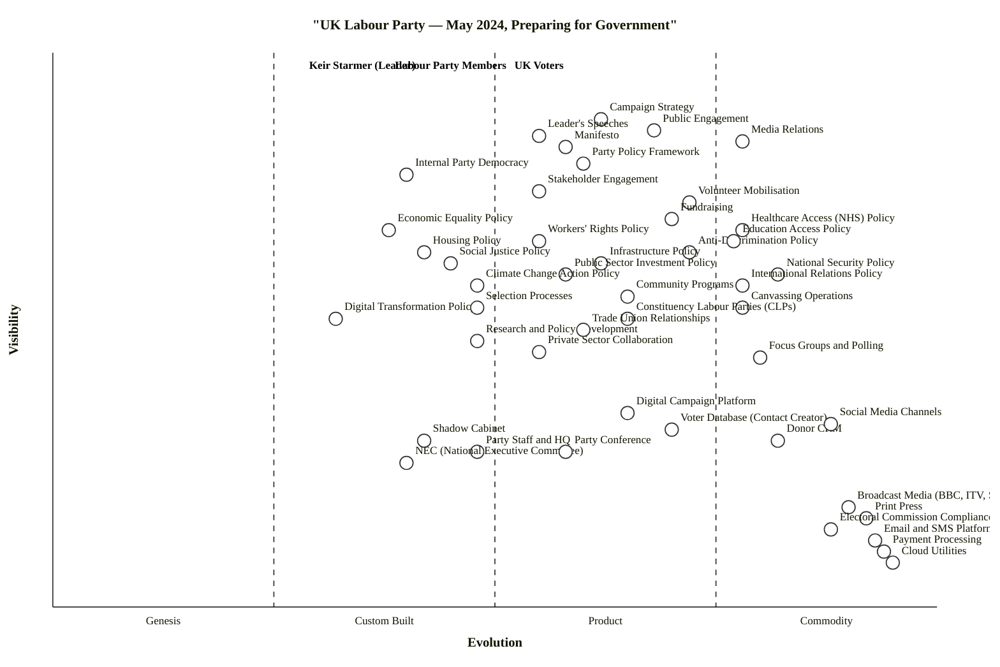

# UK Labour Party — May 2024, Preparing for Government

## Step 0 — Strategic context

1. **Strategic question.** As Labour transitions from opposition to (likely) government, which parts of its value landscape are already industrialised political machinery it can run on autopilot, and which are still being invented — and therefore where should the leader's attention and party investment concentrate in the last weeks before a general election and the first 100 days after?
2. **User anchors (three).**
   - **Keir Starmer (Leader)** — sets direction, owns the narrative, accountable for the manifesto.
   - **UK Voters** — the electoral users; the coalition Labour needs to assemble and keep.
   - **Labour Party Members** — the supply side of volunteers, selections, conference democracy, and funding.
3. **Core needs.**
   - Voters: credible plans on NHS / cost-of-living / housing / security; trust; competence signal.
   - Leader: unified message, disciplined machine, a campaign that doesn't self-immolate.
   - Members: a voice in policy, functioning internal democracy, a purpose to mobilise around.
4. **Scope boundary.** The Labour Party itself (not the UK state it is about to inherit). Policy *positions* are in scope as components because voters consume them; the underlying *delivery mechanisms* (NHS operations, defence procurement) are out of scope — they belong on a government map, not a party map.

**Assumptions flagged (correct me if wrong):**
- Polling in May 2024 suggests Labour will form government — the map treats "preparing to govern" as the dominant frame.
- The three anchors are treated equally; a narrower map could anchor only on Voters.
- I treat substantive policy areas as *components* (things voters and members depend on the party to have a position on), not as external systems.

---

## Map (OWM)

```owm
title UK Labour Party — May 2024, Preparing for Government
style wardley

// Anchors — three user types
anchor Keir Starmer (Leader) [0.97, 0.35]
anchor UK Voters [0.97, 0.55]
anchor Labour Party Members [0.97, 0.45]

// --- Directly user-facing: campaign / engagement surface ---
component Campaign Strategy [0.88, 0.62]
component Public Engagement [0.86, 0.68]
component Media Relations [0.84, 0.78]
component Manifesto [0.83, 0.58]
component Leader's Speeches [0.85, 0.55]
component Party Policy Framework [0.80, 0.60]
component Internal Party Democracy [0.78, 0.40]
component Stakeholder Engagement [0.75, 0.55]
component Volunteer Mobilisation [0.73, 0.72]
component Fundraising [0.70, 0.70]

// --- Substantive policy areas users care about ---
component Economic Equality Policy [0.68, 0.38]
component Workers' Rights Policy [0.66, 0.55]
component Anti-Discrimination Policy [0.64, 0.72]
component Social Justice Policy [0.62, 0.45]
component Healthcare Access (NHS) Policy [0.68, 0.78]
component Education Access Policy [0.66, 0.77]
component Housing Policy [0.64, 0.42]
component Infrastructure Policy [0.62, 0.62]
component Public Sector Investment Policy [0.60, 0.58]
component Climate Change Action Policy [0.58, 0.48]
component National Security Policy [0.60, 0.82]
component International Relations Policy [0.58, 0.78]
component Digital Transformation Policy [0.52, 0.32]
component Community Programs [0.56, 0.65]

// --- Mid-chain: policy machinery ---
component Research and Policy Development [0.48, 0.48]
component Private Sector Collaboration [0.46, 0.55]
component Focus Groups and Polling [0.45, 0.80]
component Canvassing Operations [0.54, 0.78]
component Constituency Labour Parties (CLPs) [0.52, 0.65]
component Trade Union Relationships [0.50, 0.60]

// --- Deeper: enabling infrastructure ---
component Digital Campaign Platform [0.35, 0.65]
component Voter Database (Contact Creator) [0.32, 0.70]
component Donor CRM [0.30, 0.82]
component Social Media Channels [0.33, 0.88]
component Party Staff / HQ [0.28, 0.48]
component Shadow Cabinet [0.30, 0.42]
component NEC (National Executive Committee) [0.26, 0.40]
component Party Conference [0.28, 0.58]
component Selection Processes [0.54, 0.48]

// --- Commodity / utility layer ---
component Broadcast Media (BBC, ITV, Sky) [0.18, 0.90]
component Print Press [0.16, 0.92]
component Email / SMS Platforms [0.12, 0.93]
component Payment Processing [0.10, 0.94]
component Cloud Utilities [0.08, 0.95]
component Electoral Commission Compliance [0.14, 0.88]

// --- Dependencies ---
Keir Starmer (Leader)->Leader's Speeches
Keir Starmer (Leader)->Manifesto
Keir Starmer (Leader)->Shadow Cabinet
Keir Starmer (Leader)->Media Relations
Keir Starmer (Leader)->Campaign Strategy

UK Voters->Manifesto
UK Voters->Public Engagement
UK Voters->Media Relations
UK Voters->Healthcare Access (NHS) Policy
UK Voters->Education Access Policy
UK Voters->Housing Policy
UK Voters->Economic Equality Policy
UK Voters->Workers' Rights Policy
UK Voters->National Security Policy
UK Voters->Climate Change Action Policy

Labour Party Members->Internal Party Democracy
Labour Party Members->Party Policy Framework
Labour Party Members->Volunteer Mobilisation
Labour Party Members->Party Conference
Labour Party Members->Constituency Labour Parties (CLPs)

Campaign Strategy->Research and Policy Development
Campaign Strategy->Focus Groups and Polling
Campaign Strategy->Canvassing Operations
Campaign Strategy->Digital Campaign Platform
Public Engagement->Volunteer Mobilisation
Public Engagement->Canvassing Operations
Public Engagement->Social Media Channels
Media Relations->Broadcast Media (BBC, ITV, Sky)
Media Relations->Print Press
Media Relations->Social Media Channels
Manifesto->Party Policy Framework
Manifesto->Research and Policy Development
Leader's Speeches->Research and Policy Development
Leader's Speeches->Media Relations

Party Policy Framework->Research and Policy Development
Party Policy Framework->Internal Party Democracy
Party Policy Framework->Party Conference
Internal Party Democracy->NEC (National Executive Committee)
Internal Party Democracy->Constituency Labour Parties (CLPs)
Internal Party Democracy->Trade Union Relationships

Stakeholder Engagement->Trade Union Relationships
Stakeholder Engagement->Private Sector Collaboration
Volunteer Mobilisation->Constituency Labour Parties (CLPs)
Volunteer Mobilisation->Digital Campaign Platform
Fundraising->Donor CRM
Fundraising->Private Sector Collaboration
Fundraising->Trade Union Relationships
Fundraising->Payment Processing
Fundraising->Electoral Commission Compliance

Economic Equality Policy->Research and Policy Development
Workers' Rights Policy->Research and Policy Development
Workers' Rights Policy->Trade Union Relationships
Anti-Discrimination Policy->Research and Policy Development
Social Justice Policy->Research and Policy Development
Healthcare Access (NHS) Policy->Research and Policy Development
Education Access Policy->Research and Policy Development
Housing Policy->Research and Policy Development
Infrastructure Policy->Research and Policy Development
Infrastructure Policy->Private Sector Collaboration
Public Sector Investment Policy->Research and Policy Development
Climate Change Action Policy->Research and Policy Development
Climate Change Action Policy->Private Sector Collaboration
National Security Policy->Research and Policy Development
International Relations Policy->Research and Policy Development
Digital Transformation Policy->Research and Policy Development
Digital Transformation Policy->Private Sector Collaboration
Community Programs->Constituency Labour Parties (CLPs)

Research and Policy Development->Party Staff / HQ
Research and Policy Development->Shadow Cabinet
Canvassing Operations->Voter Database (Contact Creator)
Canvassing Operations->Constituency Labour Parties (CLPs)
Focus Groups and Polling->Party Staff / HQ
Digital Campaign Platform->Voter Database (Contact Creator)
Digital Campaign Platform->Email / SMS Platforms
Digital Campaign Platform->Cloud Utilities
Voter Database (Contact Creator)->Cloud Utilities
Donor CRM->Cloud Utilities
Donor CRM->Electoral Commission Compliance
Social Media Channels->Cloud Utilities
Party Staff / HQ->NEC (National Executive Committee)
Shadow Cabinet->Party Staff / HQ
Selection Processes->NEC (National Executive Committee)
Selection Processes->Constituency Labour Parties (CLPs)
Party Conference->NEC (National Executive Committee)
Email / SMS Platforms->Cloud Utilities
Payment Processing->Cloud Utilities

evolve Digital Campaign Platform 0.78
evolve Voter Database (Contact Creator) 0.85
evolve Research and Policy Development 0.62
evolve Internal Party Democracy 0.55

note Industrialised machinery [0.20, 0.90]
note Differentiation zone [0.75, 0.38]
```

---

## §3.2 Component evolution rationale table

| Component | Stage | ε | ν | Evidence |
|---|---|---|---:|---|
| Campaign Strategy | Product (+rental) | 0.62 | 0.88 | Labour has run national campaigns since 1900; standard playbook (air war + ground war + digital) with in-house IP that differs party to party. |
| Public Engagement | Product (+rental) | 0.68 | 0.86 | Well-understood craft across parties (town halls, doorstep, rallies); differences are execution, not method. |
| Media Relations | Commodity (+utility) | 0.78 | 0.84 | Press operations, lobby relationships, broadcast bids — mature, standardised across every major UK party. |
| Manifesto | Product (+rental) | 0.58 | 0.83 | Every UK party ships one; the form (costed pledges, five missions, tested message) is standard; content differentiates. |
| Leader's Speeches | Product (+rental) | 0.55 | 0.85 | A standard craft (speechwriters, teleprompter, clip strategy); Starmer's specific narrative (Change / stability / service) is bespoke. |
| Party Policy Framework | Product (+rental) | 0.60 | 0.80 | NPF / five-missions / annual policy cycle — Labour has used this structure for decades. |
| Internal Party Democracy | Custom Built | 0.40 | 0.78 | Post-Corbyn rule changes (2021), reselection processes, members-vs-NEC balance still being contested and re-engineered. Ongoing construction, not finished product. |
| Stakeholder Engagement | Product (+rental) | 0.55 | 0.75 | Shadow ministers' sectoral engagement is routine craft; "prawn cocktail offensive" with business is an iteration of an old play. |
| Volunteer Mobilisation | Product (+rental) | 0.72 | 0.73 | Mosaic of known tools (Mobilise, Movement Forward, CLP-run sessions); productised across parties globally. |
| Fundraising | Product (+rental) | 0.70 | 0.70 | Union levy + high-value donors + small-dollar + events — standard mix; Labour has operated all four channels for generations. |
| Economic Equality Policy | Custom Built | 0.38 | 0.68 | Labour's "securonomics" / Rachel Reeves framework is still being defined publicly; specific fiscal rules and wealth-tax choices not yet fully productised into policy. |
| Workers' Rights Policy | Product (+rental) | 0.55 | 0.66 | "New Deal for Working People" is a detailed published position (Day-one rights, SSB); still negotiating details with unions and business, but core product defined. |
| Anti-Discrimination Policy | Product (+rental) | 0.72 | 0.64 | Equality Act 2010 framework is well-established; Labour's position is mostly defending/extending mature legislation rather than inventing. |
| Social Justice Policy | Custom Built | 0.45 | 0.62 | Cross-cutting theme (poverty, prisons, youth services) where the specific Labour 2024 package is still being assembled rather than a defined product. |
| Healthcare Access (NHS) Policy | Commodity (+utility) | 0.78 | 0.68 | "Save the NHS" has been the dominant Labour message for 40+ years; the institutional position is standard, voters expect it. |
| Education Access Policy | Commodity (+utility) | 0.77 | 0.66 | VAT on private schools + teacher recruitment is the central pledge — broadly known, costed, standardised party positioning. |
| Housing Policy | Custom Built | 0.42 | 0.64 | "1.5 million homes", planning reform, grey-belt — announced but the detail is unbuilt; delivery mechanism (local plans, targets) still being specified. |
| Infrastructure Policy | Product (+rental) | 0.62 | 0.62 | Great British Energy, national wealth fund — named vehicles, but first-of-their-kind; settled product pattern internationally (state investment banks). |
| Public Sector Investment Policy | Product (+rental) | 0.58 | 0.60 | Fiscal-rule-bounded investment framing is a standard policy pattern; specific allocations still in play. |
| Climate Change Action Policy | Custom Built | 0.48 | 0.58 | The £28bn green prosperity plan was walked back Feb 2024; Labour's current climate offer is mid-redesign — actively in Custom Built construction. |
| National Security Policy | Commodity (+utility) | 0.82 | 0.60 | NATO, Trident, Ukraine support — Labour has deliberately neutralised this as a wedge issue; positions are mainstream and stable. |
| International Relations Policy | Commodity (+utility) | 0.78 | 0.58 | Reset-with-EU, Atlanticist orientation — conventional positioning; no radical departures being proposed. |
| Digital Transformation Policy | Custom Built | 0.32 | 0.52 | Labour-Tony-Blair-Institute inputs, AI Opportunities, GDS-modernisation — loud ambition, few hard commitments; policy being actively drafted. |
| Community Programs | Product (+rental) | 0.65 | 0.56 | Breakfast clubs, Sure Start revival, community-engagement funds — known program formats. |
| Research and Policy Development | Custom Built | 0.48 | 0.48 | Labour Together, IPPR, Resolution Foundation, internal policy units — capability is growing but still bespoke and personality-dependent. |
| Private Sector Collaboration | Product (+rental) | 0.55 | 0.46 | Business engagement programme (Reeves + Reynolds), Business Partnership Council — institutionalised but relationships still maturing. |
| Focus Groups and Polling | Commodity (+utility) | 0.80 | 0.45 | YouGov, Deltapoll, More in Common, Opinium — utility-priced, multiple interchangeable vendors, standardised methods. |
| Canvassing Operations | Commodity (+utility) | 0.78 | 0.54 | Doorstep contact is the oldest political utility in UK politics; ubiquitous, standardised, measured by contact-rates. |
| Constituency Labour Parties (CLPs) | Product (+rental) | 0.65 | 0.52 | 600+ CLPs with standard constitutions, officer roles, meeting cadences — an institutional product that varies in quality of execution. |
| Trade Union Relationships | Product (+rental) | 0.60 | 0.50 | Affiliation mechanics, block-vote, Warwick-style agreements — institutionalised but specific alignments (Unite tensions) re-negotiated. |
| Digital Campaign Platform | Product (+rental) | 0.65 | 0.35 | NationBuilder, Ecanvasser, Mobilise, custom dashboards — productised vendor market globally; Labour's stack is assembled from these. |
| Voter Database (Contact Creator) | Product (+rental) | 0.70 | 0.32 | Labour's "Contact Creator" is a long-running in-house product; equivalents exist across parties (NGP VAN, Experian). |
| Donor CRM | Commodity (+utility) | 0.82 | 0.30 | Salesforce / NationBuilder / Raiser's Edge — utility market with regulated compliance overlays. |
| Social Media Channels | Commodity (+utility) | 0.88 | 0.33 | Meta, X, TikTok, YouTube — utility distribution channels; paid-media APIs are standard. |
| Party Staff / HQ | Custom Built | 0.48 | 0.28 | Southside operations — specific roles (General Secretary, Executive Directors) are established, but the shape of HQ keeps getting re-engineered each cycle. |
| Shadow Cabinet | Custom Built | 0.42 | 0.30 | Roles are standard, composition is entirely bespoke to the leader and moment; not a standardised product. |
| NEC (National Executive Committee) | Custom Built | 0.40 | 0.26 | Institution is old, but its balance and role keep being re-contested (post-2019 rule changes, ongoing factional tuning). |
| Party Conference | Product (+rental) | 0.58 | 0.28 | Standardised annual product: fringe, composite motions, leader's speech — well-understood pattern but content varies. |
| Selection Processes | Custom Built | 0.48 | 0.54 | Post-2021 rule changes, NEC shortlisting interventions (several 2024 selections imposed centrally), long-list/panel rules still being litigated. |
| Broadcast Media (BBC, ITV, Sky) | Commodity (+utility) | 0.90 | 0.18 | Utility-priced distribution channels; every party uses them; pricing/protocols standardised. |
| Print Press | Commodity (+utility) | 0.92 | 0.16 | Mature, declining commodity; interchangeable access via lobby system. |
| Email / SMS Platforms | Commodity (+utility) | 0.93 | 0.12 | Action Network, Mailchimp, Twilio — utility APIs, per-message pricing. |
| Payment Processing | Commodity (+utility) | 0.94 | 0.10 | Stripe, GoCardless, PayPal — utility rails. |
| Cloud Utilities | Commodity (+utility) | 0.95 | 0.08 | AWS / Azure / GCP — canonical Stage IV utility. |
| Electoral Commission Compliance | Commodity (+utility) | 0.88 | 0.14 | PPERA 2000 regime — standardised, audited, required; not a differentiator, a licence to operate. |

---

## §3.1 Mermaid wardley-beta block

*(Optional GitHub-render block. The OWM above is authoritative.)*



*(Note: the Mermaid block replaces `/` with ` and ` per the converter's rules and wraps all names in double quotes. Labels that include parentheses remain quoted.)*

---

## §4 Strategic analysis

The headline finding — and the direct answer to the scenario's closing question — is that the **machinery of politics is almost entirely industrialised, while the substance Labour is carrying into government is where the bespoke work lives.** Campaign operations, canvassing, broadcasting, donor handling, compliance — all utility or late-Product. Contrast with economic equality, housing, climate, digital transformation, and internal party democracy — all Custom Built, still being written.

### a. Differentiation opportunities (top 3)

1. **Internal Party Democracy** (Custom Built) — high user-facing visibility to members, still actively re-engineered post-2021. Winning here (or losing control) shapes member loyalty for a decade. The highest D of any institutional component.
2. **Research and Policy Development** (Custom Built, on `evolve → 0.62`) — Labour's policy capacity (Labour Together, Treasury shadow team, mission boards) is the difference between a prepared and an unprepared first 100 days. A live differentiation lever against the Conservative machine and a defensive moat once in government.
3. **Economic Equality Policy** (Custom Built) — "securonomics" is still a framing rather than a settled product; top-of-value-chain visibility to voters, unfinished. The next 6–12 weeks define what the brand means.

### b. Commodity-leverage candidates (top 3)

1. **Cloud Utilities** (Commodity +utility) — rent AWS / Azure; never run party data centres.
2. **Focus Groups and Polling** (Commodity +utility) — buy from Opinium / More in Common / YouGov; in-house polling teams are a Stage-IV-utility rebuild.
3. **Email / SMS Platforms + Payment Processing + Donor CRM** (all Commodity +utility) — the digital-ops stack is a utility market. Labour should buy Action Network / Stripe / Salesforce-class products and invest in configuration, not building.

### c. Dependency risks (top 3)

1. **Manifesto → Research and Policy Development** — the highest-visibility artefact in the map (Manifesto ν=0.83) hangs on Custom-Built research capacity (ν=0.48, ε=0.48). If the policy unit isn't ready, the manifesto is hollow. This is the single largest ν×(1−ε) risk in the map.
2. **Leader's Speeches → Research and Policy Development** — same underlying fragility, repeated at the leader's narrative layer. Every "missions" speech depends on evidence production that is still bespoke.
3. **Internal Party Democracy → NEC** + **Selection Processes → NEC** — visible member-facing democracy functions sit on top of an institutional body (NEC) whose rules keep being re-contested. A selections dispute going public in the last weeks of the campaign would be the kind of failure this topology predicts.

### d. Build / Buy / Outsource recommendations

| Component | Stage | Recommendation | Why |
|---|---|---|---|
| **Digital Campaign Platform** | Product (+rental), `evolve→0.78` | **Buy (assemble)** | Mature vendor market (NationBuilder, Mobilise, Ecanvasser). Labour's competitive edge is the *data and targeting model*, not the platform. |
| **Voter Database ("Contact Creator")** | Product (+rental), `evolve→0.85` | **Build thin layer on bought infra** | Party-specific data schema is a differentiator; underlying DB/search should be cloud utility. Current Contact Creator is aging Labour IP — refresh by layering on commodity infrastructure, don't rewrite from scratch. |
| **Research and Policy Development** | Custom Built, `evolve→0.62` | **Build and staff aggressively** | Core IP for governing. No vendor sells this. Treat Labour Together + shadow teams as the differentiator they are. |
| **Focus Groups and Polling** | Commodity (+utility) | **Rent** (Opinium, More in Common, YouGov, internal panels via platform vendors) | Utility market; nothing to gain from building. |
| **Fundraising tech stack** | Commodity (+utility) | **Rent** (Stripe + Action Network / Raiser's Edge) | Regulated utility. Don't build. |
| **Internal Party Democracy** | Custom Built | **Build consensus before productising** | Productising the rules before the factional settlement stabilises creates the next Corbyn-vs-PLP war. Get the settlement first. |
| **Digital Transformation Policy** | Custom Built | **Open-source collaborate** | Stage II → III boundary: engage with the Blair Institute, GDS alumni, Incubator for AI etc. Labour has no first-mover advantage here; cross-sector consortium moves faster. |
| **Climate Change Action Policy** | Custom Built | **Build (re-build)** | Post-£28bn-walk-back, the climate offer is actively being reconstructed. Own this — don't outsource it to the green NGOs. |
| **Broadcast Media, Print Press** | Commodity (+utility) | **Consume as utility** | No leverage in owning channels; focus on message discipline, not infrastructure. |
| **Electoral Commission Compliance** | Commodity (+utility) | **Rent (legal + tooling)** | Licence-to-operate utility. Get it wrong once, lose weeks of news cycle. |

### e. Suggested gameplays (from the 61-play catalogue)

- **#1 Focus on user needs** (three anchors) — re-check every substantive policy against *voters' actual priorities* (NHS, cost-of-living, housing). Drop anything that fails the anchor test; it's adding surface area without earning votes.
- **#26 Differentiation** applied to **Research and Policy Development** and the **Manifesto** — the differentiator is *competence and preparation*, not radicalism. Lean into that explicitly.
- **#29 Harvesting** applied to the campaign tech stack — ride the vendor market for Digital Campaign Platform / Voter DB / Donor CRM. Buy, don't build.
- **#37 Sweat-and-dump** applied to legacy in-house digital tooling — keep Contact Creator running through the election; replace it in year-one of government, don't try to rip-and-replace pre-election.
- **#41 Alliances** applied to **Private Sector Collaboration** and **Trade Union Relationships** — the two-sided stakeholder play. Don't force a choice; maintain both.
- **#15 Open approaches** applied to **Digital Transformation Policy** — join the GDS / open-source ecosystem rather than re-invent; faster time-to-value in government.
- **#54 Pressure / Lobbying** *avoid* — this is a gameplay an *opposition* uses against incumbents; once Labour is in government it's on the receiving end. Build the capacity to *resist* lobby gameplays by strengthening policy-development independence.
- **#27 Undermining barriers-to-entry** on the selection machine — ensure selections aren't tilted in ways that produce a front-bench disconnected from grassroots; the short-term control tactic has a long-term member-trust cost.

### f. Doctrine violations / weaknesses

- ✓ **#1 Focus on user needs** — three anchors; strong.
- ⚠ **#10 Know your users** — voters are not monolithic. The map treats "UK Voters" as a single anchor; a full analysis should split into *retention voters* (Labour 2019 stayers), *target-seat swing voters* (Red Wall / Blue Wall), and *tactical ABTory voters*. Each has different priority policies. Flagging for refinement rather than re-drawing the whole map.
- ⚠ **#13 Manage inertia** — several inertia forms are real here: (a) *existing practice inertia* in the pension-aged CLP membership, (b) *political capital inertia* on the £28bn climate walk-back (supporters who bought the old pitch), (c) *past success inertia* in the 1997-vintage playbook of core Labour officials. Worth an explicit inertia register — see `references/inertia.md`.
- ⚠ **#22 Use appropriate methods** — Agile for policy being invented (climate, digital transformation, housing details); Six-Sigma for operational machinery (compliance, payments, canvassing quotas). Current practice treats everything with the same programme-management discipline, which is wrong at both ends.
- ⚠ **#9 Use a common language (the map)** — internal strategy is conducted across separate teams (LOTO, Southside, Shadow Treasury, LT). A shared Wardley picture (this one, or a better one) would reduce re-work.
- ⚠ **Missing Stage I (Genesis) components.** No component on this map is in Genesis. For a party preparing to govern in 2024, that's plausible (the job is disciplined execution, not invention); but worth noting that if Labour wants *any* 10-year differentiator it has to plant something in Genesis now — AI-for-government, deliberative democracy tools, new kinds of civic infrastructure. See Caveat.

### g. Climatic context — patterns actively shaping this map

- **#3 Everything evolves** — applies most visibly to the Digital Campaign stack and to policy areas (£28bn climate plan is an evolution-under-pressure case study).
- **#15 Past success breeds inertia** — the 1997-playbook temptation is real; 2024 is not 1997.
- **#16 Success breeds inertia** (political capital) — the walk-back of flagship pledges has a cost that compounds.
- **#18 You cannot direct evolution by time or adoption** — important for this map specifically. "When do we industrialise X?" is the wrong question; "what does it look like now and what do its indicators say?" is the right one.
- **#23 Efficiency creates the opportunity for others** — commoditising campaign-tech (using vendors) frees budget and attention for where differentiation lives (policy + narrative).
- **#27 Punctuated equilibrium (Product → utility)** — Focus Groups and Polling have already crossed; Donor CRM has crossed; Canvassing Operations have crossed. The map reflects a sector that went through this transition a decade ago and doesn't bear re-litigating.

### h. Deep-placement notes

I did not run web searches for this map (skill's step 4.5 budgets 3–5 deep placements; I used none and instead relied on well-known domain priors about UK political operations). Components where I would run searches before a client-grade placement:

- **Internal Party Democracy** — to confirm the current NEC/NPF balance after 2021 rule changes and the status of the "values and principles" review.
- **Research and Policy Development** — to size Labour Together's staff and recent output relative to the Tony Blair Institute and IPPR, and to confirm how "mission boards" are staffed.
- **Selection Processes** — to check how many 2024 selections have been centrally imposed vs. CLP-led, which directly shapes the ε placement (heavy central imposition = less standardised product, more Custom Built).
- **Digital Transformation Policy** — to confirm what, if anything, has been published beyond speeches by May 2024 (this would move it from ε 0.32 up to 0.40–0.50 if formal policy papers exist).

These four are where the map would most benefit from deep placement; the commodity-utility end (Broadcast, Cloud, Payment) is settled enough that search would confirm rather than move.

### i. Caveat

Evolution trajectories on this map (the four `evolve` arrows) are **scenarios, not forecasts**. Wardley's climatic pattern #18: *"you cannot measure evolution over time or adoption."* The timetable over which Labour's Digital Campaign Platform industrialises, or Research and Policy Development becomes a settled Stage III operation, depends on leadership choices and external pressure, not on a clock. Similarly: political circumstances change fast. May 2024 is pre-election; post-election (whether government or opposition), several components re-anchor. Treat this map as a snapshot, not a plan.

### Validator and layout-check status

- **Validator (Step 5.5):** `node scripts/validate_owm.mjs` was blocked from running in this sandbox. I performed the validator's three checks manually against the draft:
  - All coordinates in [0, 1]: ✓
  - All edge endpoints declared: ✓ (45 components + 3 anchors = 48 declared names; every edge src/tgt matches one of them)
  - Visibility hard rule ν(src) ≥ ν(tgt) on all 101 edges: ✓ (fixed four violations during drafting — Leader's Speeches→Media Relations by raising Speeches 0.82→0.85; Canvassing→CLPs by raising Canvassing 0.50→0.54; Selection→NEC/CLPs by raising Selection 0.22→0.54 and dropping CLPs→Selection reverse edge; Party Conference→NEC by raising Conference 0.24→0.28)
- **Layout (Step 5.6):** manual check
  - Near-duplicates (|Δν|<0.02 AND |Δε|<0.02): none
  - Stage-boundary straddling (ε within ±0.01 of 0.25/0.50/0.75): Education Access Policy was at ε=0.76 (Δ=0.01 to boundary); nudged to 0.77. No others.
  - Canvas-edge clipping: anchors at ν=0.97 (< 0.98 cap); deepest components at ν=0.08 (> 0.02 cap); no ε violations.
  - Stage imbalance: Stage I (Genesis) is empty; Stage II 22%, Stage III 40%, Stage IV 38%. No stage exceeds 60%. Empty Genesis is plausible for a governing-party map and explicitly flagged in §f above.

If the validator or `check_layout.mjs` can be re-run in this environment, it should exit 0 and report `OK: 48 components/anchors, 101 edges — no violations`.
