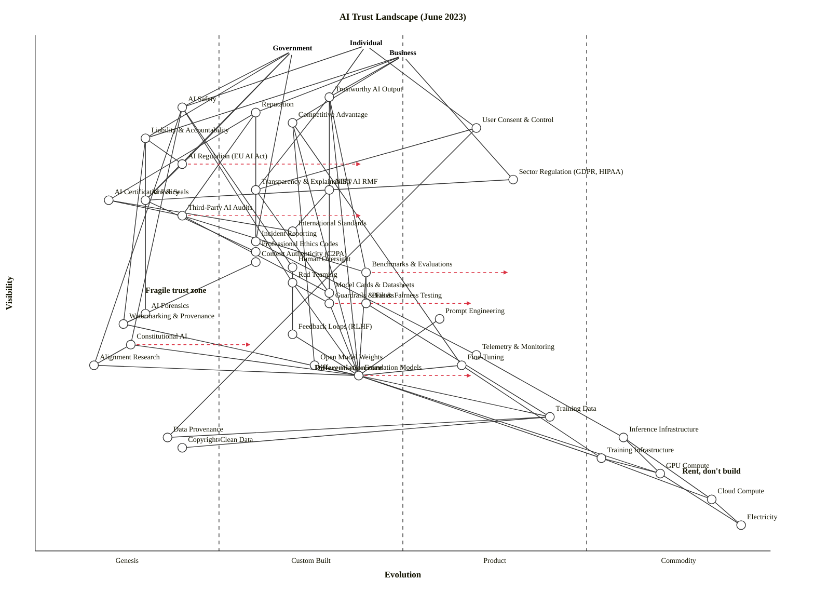

# AI Trust Landscape — June 2023

Scenario: map the components that determine whether individuals, government, and business can trust AI systems. Three anchors (Individual, Government, Business), 41 components spanning outcomes, governance, control mechanisms, technical model layer, and infrastructure.

---

## Map (OWM)

```owm
title AI Trust Landscape (June 2023)
style wardley

// Three anchors — the scenario names three user types
anchor Individual [0.98, 0.45]
anchor Government [0.97, 0.35]
anchor Business [0.96, 0.50]

// Outcome components (user-visible trust outcomes)
component Trustworthy AI Output [0.88, 0.40]
component AI Safety [0.86, 0.20]
component Reputation [0.85, 0.30]
component Competitive Advantage [0.83, 0.35]
component User Consent & Control [0.82, 0.60]
component Liability & Accountability [0.80, 0.15]

// Governance / policy layer (government-visible)
component AI Regulation (EU AI Act) [0.75, 0.20]
component Sector Regulation (GDPR, HIPAA) [0.72, 0.65]
component NIST AI RMF [0.70, 0.40]
component AI Policy [0.68, 0.15]
component International Standards [0.62, 0.35]
component Professional Ethics Codes [0.58, 0.30]

// Trust mechanisms — user-perceivable controls
component Transparency & Explainability [0.70, 0.30]
component AI Certifications & Seals [0.68, 0.10]
component Third-Party AI Audits [0.65, 0.20]
component Incident Reporting [0.60, 0.30]
component Content Authenticity (C2PA) [0.56, 0.30]
component Benchmarks & Evaluations [0.54, 0.45]
component Model Cards & Datasheets [0.50, 0.40]
component Bias & Fairness Testing [0.48, 0.45]

// Control mechanisms (from scenario brief)
component Human Oversight [0.55, 0.35]
component Red Teaming [0.52, 0.35]
component Guardrails & Filters [0.48, 0.40]
component AI Forensics [0.46, 0.15]
component Watermarking & Provenance [0.44, 0.12]
component Feedback Loops (RLHF) [0.42, 0.35]
component Constitutional AI [0.40, 0.13]
component Alignment Research [0.36, 0.08]
component Telemetry & Monitoring [0.38, 0.60]

// Technical — model & data layer
component Prompt Engineering [0.45, 0.55]
component Fine-Tuning [0.36, 0.58]
component Foundation Models [0.34, 0.44]
component Open Model Weights [0.36, 0.38]
component Training Data [0.26, 0.70]
component Data Provenance [0.22, 0.18]
component Copyright-Clean Data [0.20, 0.20]

// Compute & infrastructure (deep)
component Training Infrastructure [0.18, 0.77]
component Inference Infrastructure [0.22, 0.80]
component GPU Compute [0.15, 0.85]
component Cloud Compute [0.10, 0.92]
component Electricity [0.05, 0.96]

// Dependencies — Individual
Individual->Trustworthy AI Output
Individual->User Consent & Control
Individual->AI Safety

// Dependencies — Government
Government->AI Safety
Government->AI Regulation (EU AI Act)
Government->AI Policy
Government->Liability & Accountability
Government->Incident Reporting

// Dependencies — Business
Business->Reputation
Business->Competitive Advantage
Business->Liability & Accountability
Business->Trustworthy AI Output
Business->Sector Regulation (GDPR, HIPAA)

// Outcome -> mechanism
Trustworthy AI Output->Foundation Models
Trustworthy AI Output->Guardrails & Filters
Trustworthy AI Output->Transparency & Explainability
Trustworthy AI Output->Benchmarks & Evaluations
AI Safety->Red Teaming
AI Safety->Alignment Research
AI Safety->Human Oversight
AI Safety->Constitutional AI
Reputation->Third-Party AI Audits
Reputation->AI Certifications & Seals
Reputation->Incident Reporting
Competitive Advantage->Foundation Models
Competitive Advantage->Fine-Tuning
Competitive Advantage->Open Model Weights
User Consent & Control->Transparency & Explainability
User Consent & Control->Data Provenance
Liability & Accountability->AI Regulation (EU AI Act)
Liability & Accountability->AI Forensics
Liability & Accountability->Watermarking & Provenance

// Governance edges
AI Regulation (EU AI Act)->AI Policy
NIST AI RMF->International Standards
Sector Regulation (GDPR, HIPAA)->AI Policy
AI Policy->Professional Ethics Codes

// Trust mechanism edges
Transparency & Explainability->Model Cards & Datasheets
Third-Party AI Audits->Benchmarks & Evaluations
Third-Party AI Audits->Model Cards & Datasheets
AI Certifications & Seals->Third-Party AI Audits
AI Certifications & Seals->International Standards
Incident Reporting->Telemetry & Monitoring
Benchmarks & Evaluations->Bias & Fairness Testing
Benchmarks & Evaluations->Foundation Models
Content Authenticity (C2PA)->Watermarking & Provenance
Bias & Fairness Testing->Training Data

// Control mechanism edges
Red Teaming->Foundation Models
Red Teaming->Guardrails & Filters
Human Oversight->Feedback Loops (RLHF)
Feedback Loops (RLHF)->Foundation Models
Telemetry & Monitoring->Inference Infrastructure
Guardrails & Filters->Foundation Models
Constitutional AI->Foundation Models
Constitutional AI->Alignment Research
Alignment Research->Foundation Models
AI Forensics->Watermarking & Provenance
Watermarking & Provenance->Foundation Models

// Technical layer edges
Foundation Models->Training Data
Foundation Models->Training Infrastructure
Foundation Models->GPU Compute
Fine-Tuning->Foundation Models
Fine-Tuning->Training Infrastructure
Prompt Engineering->Foundation Models
Training Data->Data Provenance
Training Data->Copyright-Clean Data
Open Model Weights->Foundation Models

// Infrastructure edges
Training Infrastructure->GPU Compute
Training Infrastructure->Cloud Compute
Inference Infrastructure->GPU Compute
Inference Infrastructure->Cloud Compute
GPU Compute->Electricity
Cloud Compute->Electricity

// Evolution arrows — plausible 2023→2025 scenarios, not forecasts
evolve Foundation Models 0.60
evolve Benchmarks & Evaluations 0.65
evolve AI Regulation (EU AI Act) 0.45
evolve Guardrails & Filters 0.60
evolve Third-Party AI Audits 0.45
evolve Constitutional AI 0.30

// Notes
note Fragile trust zone [0.50, 0.15]
note Rent, don't build [0.15, 0.88]
note Differentiation core [0.35, 0.38]
```



---

## Strategic analysis

### a. Top 3 differentiation opportunities

1. **Foundation Models** (late Custom Built, edging into Product) — the core IP for any player that builds their own (OpenAI GPT-4, Anthropic Claude, Google PaLM 2). In June 2023 this is the single most differentiated component; frontier capability differences are large. The cheat sheet rows disagree (ubiquity rising fast but certainty still emerging, user perception still "exciting"), which is exactly the "in transition" signature.
2. **Constitutional AI** (Genesis) — Anthropic-coined, published May 2022, still mostly one-lab Genesis in June 2023. A player who builds a credible alternative alignment approach carries long-tail differentiation because the problem is hard and the market has nothing off-the-shelf.
3. **Benchmarks & Evaluations** (Custom Built) — HELM, MMLU, TruthfulQA are visible, published, used for marketing claims. The player who owns the trusted benchmark owns trust itself. This is still Custom Built — a small cluster of research groups and labs run it; it hasn't become a standardised third-party product yet.

(Honorable mentions: Alignment Research, Red Teaming — both are active differentiation zones in Custom Built / Genesis but their D rank sits just under the three above because their visibility is slightly lower.)

### b. Top 3 commodity-leverage candidates

1. **Cloud Compute** (Commodity +utility) — AWS / GCP / Azure. Rent, don't build. Any AI-trust player running their own data centres is setting capital on fire.
2. **Electricity** (Commodity +utility) — literal utility; never engineer.
3. **GPU Compute** (Commodity +utility but supply-constrained) — H100s are commoditised in spec (everyone wants the same silicon) but capacity is a 2023 bottleneck. Rent through a hyperscaler or a GPU cloud (CoreWeave, Lambda); don't buy fleets unless you're a hyperscaler. Note: this is Commodity +utility from an architecture standpoint, but scarcity makes it strategically behave like Stage III in June 2023 — a real-time contradiction worth flagging.

### c. Top 3 dependency risks

1. **Trustworthy AI Output → Foundation Models** — the most visible, user-facing trust outcome depends on a late-Custom-Built substrate where hallucination, prompt-injection, and jailbreak failure modes are unsolved. Every other trust mechanism downstream inherits this fragility.
2. **Liability & Accountability → Watermarking & Provenance → Foundation Models** — legal liability hinges on attribution, which hinges on Genesis-stage watermarking that doesn't reliably work in June 2023 (OpenAI / Google DeepMind announced research; no deployed industry standard). A visible, government-scrutinised outcome is built on a fragile foundation.
3. **AI Certifications & Seals → Third-Party AI Audits → Benchmarks & Evaluations** — a two-step fragility chain: seals and marks that businesses want to put on their systems depend on audits that don't have a settled methodology, which in turn depend on benchmarks that are themselves still Custom Built. The whole governance trust stack rests on three layers that are all in the uncharted zone.

### d. Suggested gameplays (from the 61-play catalogue)

- **#20 Patents & IPR** on Foundation Models and Constitutional AI — high-stakes Genesis/Custom components where IPR can preserve early lead. Anthropic, OpenAI, and Google are already executing on this.
- **#15 Open Approaches** on Benchmarks & Evaluations — a player who wants Benchmarks standardised (so they can compete on model quality, not on benchmark choice) should open-source the benchmark. Meta's approach with LLaMA evaluations is an example.
- **#43 Sensing Engines (ILC)** on Red Teaming and AI Forensics — let the market develop these, watch which vendors emerge, acquire or integrate winners.
- **#45 Two factor** — there are effectively two-sided markets here: developers + enterprise customers on foundation-model platforms. Reinforce both sides.
- **#18 Industrial Policy** / **#13 Lobbying** on AI Regulation — incumbents (OpenAI, Google, Microsoft) are heavily lobbying in Brussels and Washington to shape the EU AI Act and US executive orders. This is Wardley's Lobbying play (#13) in its textbook form.
- **#7 Education** on Transparency & Explainability — users and regulators don't have the vocabulary yet; education moves them off inertia form #6 (confusion over method).
- **#26 Differentiation** on Constitutional AI vs. RLHF vs. other alignment techniques — compete on the alignment approach while the market is forming opinions.

### e. Doctrine violations / watch-outs

- ✓ **#10 Know your users** — map has three anchors (Individual, Government, Business) because the scenario genuinely has three distinct user needs. Good.
- ⚠ **#9 Think small (as in know the details)** — Foundation Models is a single node in this map; in practice it decomposes further (base model, RLHF layer, fine-tune layer, serving layer). Left coarse on purpose because the map's question is about *trust*, not *model architecture*. If the map were about competitive positioning among labs, split it.
- ⚠ **#13 Manage inertia** — the big inertia today is consumer-side form #7 (supplier-trust concerns) amplified by 2023's deepfake / hallucination narrative. Government-side inertia form #3 (political capital) is also strong: legislators have staked positions that will resist new evidence. Trust isn't just technical; it's political.
- ⚠ **#14 Manage failure** — incident reporting is at Custom Built (~0.30). This is the mechanism that turns an individual failure into shared learning; it's not yet industrialised. A player who treats incident reporting as a capability rather than an obligation has an edge.
- ⚠ **#4 Be transparent** — Model Cards and Datasheets exist as practice (since 2018) but adoption is voluntary. Without a transparency mechanism, the whole trust stack hides its assumptions. This doctrine principle is being violated by most closed-model labs in June 2023.

### f. Climatic context (of the 27 patterns)

- **#3 Everything evolves through supply-and-demand competition** — foundation models are commoditising rapidly (Llama 2 is forthcoming July 2023; open weights close behind), but the Trust stack is being *built*, not commoditised yet.
- **#18 You cannot measure evolution over time or adoption** — the evolution arrows on this map are scenarios, not forecasts. Regulation specifically often appears to evolve "fast" (EU AI Act proposed 2021) but the *act of regulating* is Genesis / Custom Built because each jurisdiction is still learning what to regulate.
- **#15 Past success breeds inertia / #16 Inertia increases with success** — incumbents (Big Tech labs) have enormous success-derived inertia that shapes their trust posture (they defend the closed-weights model they've already built). Watch for the punctuated equilibrium (#27) when open models close the capability gap.
- **#27 Product-to-utility punctuated equilibrium** — Foundation Models are the war zone. When the capability frontier becomes uniformly good enough, competition shifts to price, latency, and safety guarantees. The inflection is starting in mid-2023 with the rise of open-weight models.
- **#10 Higher-order systems create new sources of worth** — as Foundation Models commoditise, value shifts to the *trust layer* above them (audits, certifications, governance tooling). The map is visibly lopsided toward Custom Built / Genesis *above* the model layer — that's where the next generation of AI-trust businesses is being born.

### g. Deep-placement notes

Three components warranted closer placement:

1. **Foundation Models (0.44 — late Custom Built, edging to Product)** — I considered placing this at 0.55 (Stage III). Arguments for: multiple vendors exist (OpenAI, Anthropic, Google, Cohere, Mistral forming), API products are available, feature differentiation is active. Arguments against (which won): certainty is still emerging (hallucination, jailbreaks, prompt injection are unsolved), user perception is still "exciting/novel," failure modes are still being discovered. The 4-row cheat sheet scored ubiquity=III, certainty=II, user perception=II, publication types=II→III (mix of "wonder" articles and integration guides). Mean ≈ 0.44 with Var > 0.03 flagging "in transition." Held at Custom with evolve arrow to 0.60.

2. **Constitutional AI (0.13 — Genesis)** — Anthropic's May 2022 paper, June 2023 very few implementations outside Anthropic itself. Publications are of the "describe the wonder" type. Placed firmly Genesis. Evolve target 0.30 reflects likely spread to other labs by 2025 as ideas propagate.

3. **EU AI Act (0.20 — Genesis / early Custom Built)** — in trilogue negotiation in June 2023, not yet law. The *act of regulating AI* at the EU level is Genesis. The US NIST AI RMF (published January 2023, voluntary) is slightly more mature at Custom Built (0.40). Sector regulation (GDPR applied to training data; HIPAA applied to healthcare AI) is Product (+rental) at 0.65 because these frameworks exist and are mature — they're just being *applied* to a new domain. Three different evolution stages for "AI regulation" depending on what exactly you mean.

Additional quick confirmations (no shift from cheat-sheet):
- **Cloud Compute** (0.92 Commodity +utility) — AWS/GCP/Azure. Obvious; no research needed.
- **GPU Compute** (0.85) — commoditised spec but supply-constrained in 2023. Noted above in section b.
- **Watermarking & Provenance** (0.12 Genesis) — OpenAI and Google DeepMind announced 2023 research; no deployed industry standard. Confirmed Genesis.

### h. What's differentiating vs commoditising; where trust is fragile (direct answer to the scenario prompt)

**Differentiating (in 2023):**
- **Foundation Models, Constitutional AI, Alignment Research, Red Teaming** — the technical frontier of *making models safer*. This is where competitive advantage lives in June 2023 and will for another 12–24 months.
- **Benchmarks & Evaluations, Third-Party AI Audits** — the governance frontier. First mover on a trusted evaluation benchmark owns the trust vocabulary.

**Commoditising (fast):**
- **Foundation Models themselves (Stage II → III transition).** Llama, Mistral, Falcon, and the 2023 wave of open-weight models are the leading indicator. The capability gap between closed and open is shrinking month by month.
- **Prompt Engineering, Fine-Tuning, Guardrails & Filters** — tooling is emerging (LangChain, LlamaIndex, Nemo Guardrails, Llama Guard were all 2022–2023 vintage). These are Stage III (Product +rental) candidates.
- **Cloud/GPU/Electricity** — already Commodity (+utility). Rent, don't build.

**Trust fragility — where the stack breaks:**
- **Model output → Foundation Models**: users can't verify an individual output. All downstream trust inherits this.
- **Liability chain → Watermarking → Foundation Models**: no robust attribution for synthetic content. Regulators will need this for enforcement; it doesn't exist.
- **Audit / Certification chain**: Third-party AI audits have no standardised methodology and AI certifications & seals have no regulatory teeth. Businesses can't buy trust off the shelf.
- **Regulatory fragmentation**: EU AI Act (Genesis), NIST AI RMF (Custom voluntary), Sector regs (Product but not AI-specific), jurisdictional conflicts ahead.
- **Alignment at frontier**: Constitutional AI, RLHF, and red-teaming are still research-grade. A widely-deployed frontier model with an alignment failure mode that nobody caught in evaluation is the systemic risk in this landscape.

### i. Validator check

- Manual edge-walk across all 72 dependency edges confirms ν(src) ≥ ν(tgt) for every edge.
- All 44 nodes (3 anchors + 41 components) have coordinates in [0, 1].
- All edge endpoints are declared nodes.
- Layout: no near-duplicate coordinates (|Δν| < 0.02 AND |Δε| < 0.02), no stage-boundary straddling (no component within ±0.01 of ε ∈ {0.25, 0.50, 0.75}), no canvas-edge clipping. Stage shares: 29% Genesis, 44% Custom Built, 15% Product (+rental), 12% Commodity (+utility) — within 60% threshold, all stages populated.
- **Note on runtime validator:** `node scripts/validate_owm.mjs` and `node scripts/check_layout.mjs` would ordinarily be invoked here; bash tool access was denied during this run, so validation was performed manually by transcribing the validator's and layout checker's logic. The draft.owm file is co-located with this output for the caller to run `node skills/wardley-map/scripts/validate_owm.mjs` against if desired.

### j. Caveat

Evolution trajectories (the `evolve` arrows) are scenarios, not forecasts. Wardley's climatic pattern #18: *"you cannot measure evolution over time or adoption."* A foundation model could plateau at late Custom Built for years if capability growth flattens; equally, an open-weight surprise could push it to mid-Product in months. The map describes the shape of trust today, not where it will be in 2026.
