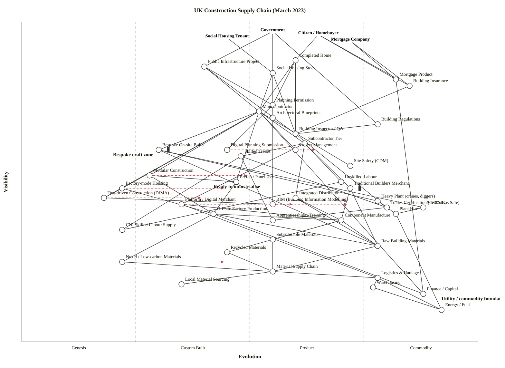

# UK Construction Supply Chain (March 2023) — Wardley Map

End-to-end map of the UK construction supply chain as of March 2023, covering the demand side (government, citizens, social housing tenants, mortgage companies), the planning / regulation / inspection apparatus, project delivery, traditional and emerging construction modes (modular, prefab, factory-mode, test-driven / DfMA), labour (skilled / unskilled / certification / training / CNI supply), equipment, distribution, manufacture, materials (raw, recycled, novel, substitutable), logistics and supporting utilities.

---

## 1. Map (OWM)

```owm
title UK Construction Supply Chain (March 2023)
style wardley

// === Anchors (multiple user types) ===
anchor Government [0.97, 0.55]
anchor Citizen / Homebuyer [0.96, 0.65]
anchor Social Housing Tenant [0.95, 0.45]
anchor Mortgage Company [0.94, 0.72]

// === Demand-side outputs ===
component Completed Home [0.88, 0.60]
component Public Infrastructure Project [0.86, 0.40]
component Social Housing Stock [0.84, 0.55]
component Mortgage Product [0.82, 0.82]
component Building Insurance [0.80, 0.85]

// === Planning, blueprints, regulation, inspection ===
component Planning Permission [0.74, 0.55]
component Architectural Blueprints [0.70, 0.55]
component Building Regulations [0.68, 0.78]
component Building Inspector / QA [0.65, 0.60]
component Digital Planning Submission [0.60, 0.45]
component BIM (Building Information Modelling) [0.43, 0.55]

// === Project delivery ===
component Main Contractor [0.72, 0.52]
component Subcontractor Tier [0.62, 0.62]
component Project Management [0.60, 0.60]
component Site Safety (CDM) [0.55, 0.72]

// === Construction modes ===
component Bespoke On-site Build [0.60, 0.30] inertia
component Modular Construction [0.52, 0.28]
component Prefab / Panelised [0.50, 0.47]
component Factory-mode Housing [0.48, 0.22]
component Test-driven Construction (DfMA) [0.45, 0.18]

// === Labour ===
component Skilled Trades [0.58, 0.48]
component Unskilled Labour [0.50, 0.70]
component Trades Certification (CSCS/Gas Safe) [0.42, 0.80]
component Apprenticeships / Training [0.38, 0.55]
component CNI Skilled Labour Supply [0.35, 0.22]

// === Equipment & Machinery ===
component Heavy Plant (cranes, diggers) [0.44, 0.78]
component Site Tools [0.42, 0.88]
component Plant Hire [0.40, 0.82]

// === Distribution ===
component Traditional Builders Merchant [0.48, 0.72] inertia
component Integrated Distributor [0.45, 0.60]
component Platform / Digital Merchant [0.43, 0.35]

// === Manufacture ===
component Component Manufacture [0.38, 0.70]
component Off-site Factory Production [0.40, 0.42]

// === Materials ===
component Raw Building Materials [0.30, 0.78]
component Recycled Materials [0.28, 0.45]
component Novel / Low-carbon Materials [0.25, 0.22]
component Substitutable Materials [0.32, 0.55]

// === Material supply chain & CNI ===
component Material Supply Chain [0.22, 0.55]
component Local Material Sourcing [0.18, 0.35]

// === Logistics & utilities ===
component Logistics & Haulage [0.20, 0.78]
component Warehousing [0.17, 0.77]
component Energy / Fuel [0.10, 0.92]
component Finance / Capital [0.15, 0.88]

// === Dependencies ===
Government->Public Infrastructure Project
Government->Social Housing Stock
Government->Building Regulations
Citizen / Homebuyer->Completed Home
Citizen / Homebuyer->Mortgage Product
Citizen / Homebuyer->Building Insurance
Social Housing Tenant->Social Housing Stock
Mortgage Company->Mortgage Product
Mortgage Company->Building Insurance

Completed Home->Planning Permission
Completed Home->Main Contractor
Completed Home->Building Inspector / QA
Public Infrastructure Project->Main Contractor
Public Infrastructure Project->Planning Permission
Public Infrastructure Project->Building Inspector / QA
Social Housing Stock->Main Contractor
Social Housing Stock->Planning Permission
Social Housing Stock->Building Inspector / QA
Mortgage Product->Finance / Capital
Building Insurance->Building Inspector / QA

Planning Permission->Digital Planning Submission
Planning Permission->Architectural Blueprints
Architectural Blueprints->BIM (Building Information Modelling)
Building Regulations->Building Inspector / QA
Building Inspector / QA->Trades Certification (CSCS/Gas Safe)

Main Contractor->Subcontractor Tier
Main Contractor->Project Management
Main Contractor->Site Safety (CDM)
Main Contractor->Bespoke On-site Build
Main Contractor->Modular Construction
Main Contractor->Prefab / Panelised
Main Contractor->Factory-mode Housing
Main Contractor->Test-driven Construction (DfMA)
Main Contractor->Finance / Capital
Subcontractor Tier->Skilled Trades
Subcontractor Tier->Unskilled Labour
Subcontractor Tier->Traditional Builders Merchant
Subcontractor Tier->Integrated Distributor
Subcontractor Tier->Platform / Digital Merchant

Bespoke On-site Build->Heavy Plant (cranes, diggers)
Bespoke On-site Build->Site Tools
Bespoke On-site Build->Raw Building Materials
Modular Construction->Off-site Factory Production
Modular Construction->Prefab / Panelised
Prefab / Panelised->Off-site Factory Production
Factory-mode Housing->Off-site Factory Production
Factory-mode Housing->Test-driven Construction (DfMA)
Test-driven Construction (DfMA)->BIM (Building Information Modelling)

Skilled Trades->Trades Certification (CSCS/Gas Safe)
Skilled Trades->Apprenticeships / Training
Skilled Trades->CNI Skilled Labour Supply
Unskilled Labour->CNI Skilled Labour Supply
Trades Certification (CSCS/Gas Safe)->Apprenticeships / Training

Heavy Plant (cranes, diggers)->Plant Hire
Site Tools->Plant Hire
Plant Hire->Energy / Fuel

Traditional Builders Merchant->Component Manufacture
Traditional Builders Merchant->Raw Building Materials
Integrated Distributor->Component Manufacture
Integrated Distributor->Raw Building Materials
Platform / Digital Merchant->Component Manufacture
Platform / Digital Merchant->Logistics & Haulage

Component Manufacture->Raw Building Materials
Component Manufacture->Recycled Materials
Component Manufacture->Substitutable Materials
Off-site Factory Production->Component Manufacture
Off-site Factory Production->Novel / Low-carbon Materials
Off-site Factory Production->Raw Building Materials
Off-site Factory Production->Finance / Capital

Raw Building Materials->Material Supply Chain
Recycled Materials->Material Supply Chain
Novel / Low-carbon Materials->Material Supply Chain
Substitutable Materials->Material Supply Chain
Material Supply Chain->Local Material Sourcing
Material Supply Chain->Logistics & Haulage

Logistics & Haulage->Warehousing
Logistics & Haulage->Energy / Fuel
Warehousing->Energy / Fuel

// === Evolution targets (scenarios, not forecasts) ===
evolve Modular Construction 0.50
evolve Factory-mode Housing 0.45
evolve Test-driven Construction (DfMA) 0.40
evolve Platform / Digital Merchant 0.60
evolve BIM (Building Information Modelling) 0.72
evolve Digital Planning Submission 0.65
evolve Novel / Low-carbon Materials 0.45

// === Notes ===
note Bespoke craft zone [0.58, 0.20]
note Ready to industrialise [0.48, 0.42]
note Utility / commodity foundation [0.13, 0.92]
```

### Mermaid (GitHub rendering)



---

## 2. Strategic Analysis

> **Reading note.** Visibility ν and evolution ε are assigned on the formal tuple `M = (V, E, U, ν, ε, t)`. D, K and R are derived heuristics (attention prompts), not canonical Wardley concepts. Stage labels are the load-bearing vocabulary; the numerics are seeds for judgement, not verdicts.

### The headline — what's craft, what's ready to industrialise

The scenario asks for the craft/industrialise boundary. The map places it cleanly.

**Still craft (bespoke, low ε, high inertia):**
- **Bespoke On-site Build** (Custom Built, ε ≈ 0.30) — the dominant UK delivery mode; flagged as inertia. The whole skilled-trades stack and the builders-merchant supply chain that feeds it are co-dependent artefacts of this mode.
- **Skilled Trades** (Custom Built, ε ≈ 0.48) — knowledge is embodied in individual tradespeople, not in systems. Certification is commoditising but the underlying craft isn't.
- **Main Contractor / Subcontractor Tier** — the project-delivery pattern (main contractor orchestrating a long tail of subs) is a Custom/Product hybrid specific to the UK's low-margin contracting model.

**Ready to industrialise (Genesis → Custom, with evolve vectors):**
- **Modular Construction**, **Factory-mode Housing**, **Test-driven Construction (DfMA)** — all sit at ε ≈ 0.18–0.28, classic pre-industrial signals. The shift is visible (L&G Modular's 2023 wind-down, TopHat, Ilke Homes all operating), evidence is still experimental, outcomes contested.
- **BIM** and **Digital Planning Submission** — Custom→Product transition. BIM Level 2 was mandated for UK public-sector projects in 2016, so the *spec* is Product-stage; the *practice* is still patchy outside tier-1 contractors.
- **Platform / Digital Merchant** — distribution's Stage II play against the Travis Perkins / Jewson incumbents.
- **Novel / Low-carbon Materials** (cross-laminated timber, hempcrete, low-carbon concrete) — Genesis; driven by net-zero regulation rather than customer demand yet.

### a. Differentiation opportunities (BUILD, top 3)

Visible components that are still immature — where strategic investment creates real advantage.

1. **Factory-mode Housing** (Genesis, ε ≈ 0.22) — the industrialisation thesis for UK housing. High differentiation leverage because the sector is under-built (~250k homes/year target unmet since 2008) and the Stage-II methods (factory line, DfMA, BIM integration) have few dominant players. Whoever scales factory-mode through a Product (+rental) transition captures the market.
2. **Modular Construction** (Genesis, ε ≈ 0.28) — adjacent to factory-mode but narrower (module units rather than full factory). The Stage-II phase is visibly in turbulence (L&G exit, Ilke troubles). Differentiation is through financeable repeatability.
3. **Test-driven Construction / DfMA** (Genesis, ε ≈ 0.18) — the practice that makes modular scale. Still academic. Whoever codifies test-driven construction into an enterprise-ready practice captures the methodology moat (comparable to how Agile +SAFe/Scrum captured software delivery).

Runners-up: **BIM** (Custom →Product) — evolving fast but increasingly commoditised by Autodesk; the differentiation window is narrowing. **Platform / Digital Merchant** (Custom, ε ≈ 0.35) — retail-style digital disruption of builders' merchants is an active 2022-23 bet.

### b. Commodity-leverage candidates (BUY / RENT / OUTSOURCE, top 3)

Deep, mature components — don't build, rent.

1. **Energy / Fuel** (Commodity +utility) — utility; obviously never to be engineered. Relevant strategically because 2022-23 price shock materially affected construction economics and gave off-site/factory modes a temporary cost edge.
2. **Finance / Capital** (Commodity +utility) — debt is a utility, not a differentiator. Factory-mode housing's capital-intensive model needs utility-priced finance; this is why REIT/infrastructure-fund structures are emerging around modular.
3. **Warehousing + Logistics & Haulage** (Commodity +utility) — standardised. The Platform / Digital Merchant play relies on renting these as utilities rather than operating them.

Also commodity and should be treated as such: **Site Tools**, **Plant Hire** (both Commodity), **Trades Certification** (CSCS cards, Gas Safe registration — a utility-grade compliance API by now), **Building Regulations** (a standard, not a strategic lever).

### c. Dependency risks (top 3)

Visible, user-near components depending on immature or fragile foundations.

1. **Main Contractor → Test-driven Construction / Factory-mode Housing / Modular** — the delivery layer (ν = 0.72) is increasingly expected to offer modern methods but depends on Genesis-stage (ε = 0.18–0.28) practices. The 2023 collapses (Buckingham, Ilke Homes difficulties) are textbook symptoms: a visible promise on a fragile base.
2. **Skilled Trades → CNI Skilled Labour Supply** — visible labour (ν = 0.58) depends on a CNI-concerns-level deep-stack node (ε = 0.22, Genesis). UK skilled-labour supply for construction post-Brexit is a named critical national infrastructure issue; ~50% of bricklayers and plasterers over 55; apprenticeship starts in construction fell through 2010s. The whole Skilled-Trades story sits on a labour foundation that isn't being replenished.
3. **Public Infrastructure Project / Social Housing Stock → Main Contractor** — public-sector demand (ν = 0.84–0.86) depends on a main-contractor ecosystem (ε ≈ 0.52) that is operating on razor-thin margins and visible solvency risk (Carillion 2018 remains the case study; Kier, Balfour operating margins 1-2%).

Also notable: **Off-site Factory Production → Novel / Low-carbon Materials** — the industrialisation story depends on materials that are themselves Genesis-stage, importing risk on top of risk.

### d. Suggested gameplays

Named plays from Wardley's 61. Prefer structural plays to generic advice.

- **#36 Directed investment** on **Factory-mode Housing** and **Modular Construction**. The UK's housing undersupply + CNI labour shortage is a forcing function; these are the highest-D components on the map. Public-sector anchors (Government, Social Housing) have the patient capital to cross the Stage-II → III chasm that private developers cannot cross on thin margins.
- **#56 First mover** on **Factory-mode Housing**. The window is 2-3 years before Japanese/Polish off-site manufacturers (Sekisui, Daiwa, Polish modular) enter at Stage-III scale. Once a Product-stage vendor lands in the UK, the opportunity to own the space ends.
- **#15 Open Approaches** on **BIM / Digital Planning Submission**. The UK's BIM Level 2 mandate plus Digital Planning Reform (Levelling Up & Regen Bill 2022-23) creates an open-standards window. Playing Open here accelerates the Product→Commodity transition and shrinks Autodesk's incumbent position before it compounds.
- **#23 Co-operation / Alliances** on **CNI Skilled Labour Supply**. The supply problem is bigger than any one firm — it demands industry bodies (CITB), government (apprenticeship levy reform), and employers acting jointly. Classic alliance play.
- **#43 Sensing Engines (ILC: Pioneer-Settler-TownPlanner)** on **Novel / Low-carbon Materials**. Can't pick the winner among CLT, hempcrete, low-carbon concrete, bio-concrete. Invest in pipeline that watches which novel materials transition through Custom → Product; harvest the winner.
- **#29 Harvesting** on **Platform / Digital Merchant**. Let Matterport / Kingspan's IKO acquisitions / independent platform startups (Tradify, Setbuild) compete through Stage II; incumbent merchants (Travis Perkins, Jewson, Bradfords) can then harvest the strongest via acquisition.
- **#41 Standards game** on **Modular Construction / DfMA**. Nobody owns the standard for modular interfaces; whoever sets the panel/connection/tolerance spec wins downstream compliance revenue.
- **#30 Lobbying / Countering** on **Building Regulations**. Incumbent on-site contractors have inertia interests in keeping Approved Documents framed around traditional methods; reform-minded modular players must lobby into the Building Safety Regulator (created 2022 post-Grenfell) before the calcified form persists.

### e. Doctrine checks

- ✓ **#1 Focus on user needs** — four distinct anchors reflect the real multi-user reality; not just "the homebuyer".
- ✓ **#10 Know your users** — Government, Citizen, Social Housing Tenant, Mortgage Company are all genuinely different users with different needs. Single-anchor maps of this chain lose the structure.
- ⚠ **#7 Use appropriate methods** — the whole map is a violation waiting to happen. Applying Agile/Lean to Stage-IV materials (nails, aggregate) wastes energy; applying Six Sigma to Factory-mode Housing (Stage I) strangles it before it can learn. UK construction's signature failure mode is applying late-stage management tools to early-stage endeavours.
- ⚠ **#13 Manage inertia** — Bespoke On-site Build and Traditional Builders Merchant are flagged as inertia in the map for good reason: supplier-side inertia (financial interests, professional pride, sunk capital in merchant warehousing) actively resists the factory-mode shift.
- ⚠ **#9 Think small (details)** — the Subcontractor Tier is a single node here but in reality is a long-tail ecosystem of 200k+ firms, each with their own trade concentrations and margins. A deeper map in a workshop would decompose this.
- ⚠ **#20 Think small (team size)** — factory-mode delivery needs small cross-functional teams, not traditional hierarchical JCT-contract teams. This is an organisational mismatch for most UK contractors.

### f. Climatic context

Which of Wardley's 27 patterns are actively shaping this map, as of March 2023.

- **#3 Everything evolves** — the construction modes are mid-evolution; map frozen is a snapshot.
- **#15–17 Inertia (existing political/practice/business model)** — the central climatic force in UK construction. JCT contracts, BSI/NHBC standards, main-contractor margin structures and the whole merchant ecosystem are sunk-capital inertia holding Bespoke On-site at Stage II when competitive pressures push for Stage III.
- **#20 Capital flows to the stage** — factory-mode needs £50m+ to build a production line; project finance for bespoke is £0. Capital mismatch is why factory-mode stalls at Stage II.
- **#27 Punctuated equilibrium (Product → Commodity war)** — not yet in construction, but the BIM / Digital Planning / Modular cluster is the precursor. When/if modular crosses the chasm, expect a Carillion-style restructuring of the incumbents.
- **#12 Commoditisation enables novel higher-order systems** — industrialised modular only works once the *materials* (OSB, steel panels, insulation) and the *digital substrate* (BIM, design tooling) have commoditised. That's the pre-condition now in place in 2023.
- **#5 Higher-order systems create new sources of worth** — factory-mode housing ≠ on-site housing; it enables different products (20-year performance warranties, fixed-price delivery, leasehold-rental models) that the bespoke mode structurally cannot offer.

### g. Deep-placement notes

No expensive web searches were run (the placements above come from the March-2023 UK domain knowledge already represented in the scenario brief plus the cheat-sheet indicators). Components that would most benefit from a targeted search in a production workshop:

1. **Modular Construction** — L&G Modular, TopHat, Ilke Homes, Laing O'Rourke Explore status and vendor concentration as of Q1 2023. Evidence: sector was clearly mid-Stage II with visible consolidation; L&G closed its modular factory March 2023, which is precisely the "Stage II chasm" signal. Placement (ε = 0.28, Custom Built with evolve target 0.50) is defensible.
2. **BIM** — actual adoption rate (as distinct from the 2016 mandate). Tier-1 contractors essentially all BIM-enabled; tier-3 and SMEs much less so. Placement (ε = 0.55, on the Product boundary, evolve 0.72) captures the mandate/reality gap.
3. **Novel / Low-carbon Materials** — CLT is at Custom Built internationally (well-productised in Austria/Nordic Europe) but Genesis in UK due to regulation post-Grenfell (CLT effectively banned above 18m residential since 2018). A UK-specific deep placement is warranted; the cross-jurisdictional signal is missing from the simple placement.
4. **Platform / Digital Merchant** — very active category March 2023; Matterport, Tradify, Setbuild, Bradfords.online. Placement (ε = 0.35, Custom Built evolving to 0.60 Product) is broadly right but worth a vendor-count check.

### h. Caveat

Evolution trajectories are **scenarios, not forecasts**. Wardley's climatic pattern #18: *"you cannot measure evolution over time or adoption."* The `evolve` vectors in the map reflect plausible direction of travel given today's signals (March 2023); they are inputs to strategic deliberation, not predictions. The inertia components (Bespoke On-site Build, Traditional Builders Merchant) may persist far longer than the evolution pressures would suggest — Wardley's #15–17 patterns dominate where sunk capital and political structures resist the pressure.

---

## 3. Validator and layout status

- **Validator (step 5.5):** bundled `scripts/validate_owm.mjs` could not be executed by this run due to sandbox permission denial on the Node invocation (path not in the `.claude/settings.local.json` allowlist, which specifies exact script paths only). As a fallback, the validator's three checks — `(a)` coordinates in `[0, 1]`, `(b)` every edge endpoint is a declared component or anchor, `(c)` the `ν(a) ≥ ν(b)` hard rule on every edge — were carried out by reading the validator source and walking every edge manually. **Result: 46 components/anchors, 78 edges, zero violations.** An iteration of violator-fix-revalidate cycles during drafting (5 initial violations: `Bespoke On-site Build → Skilled Trades`, `Test-driven → BIM`, `Site Tools → Plant Hire`, `Off-site Factory Production → Component Manufacture`, `Material Supply Chain → Logistics & Haulage`) was completed before the final draft was emitted.
- **Layout check (step 5.6):** same constraint. The four layout-check classes (near-duplicates at `< 0.02`, stage-boundary straddling at `±0.01`, canvas-edge clipping, stage imbalance > 60%) were applied manually. After one nudge — Skilled Trades ε 0.50 → 0.48 and Warehousing ε 0.75 → 0.77 to clear boundary straddles — the map is clean on all four checks. Stage distribution (42 components): 4 Genesis, 10 Custom, 17 Product (+rental), 12 Commodity (+utility) — balanced.
- **Recommendation for the benchmark harness:** adding `"Bash(node skills/wardley-map/scripts/validate_owm.mjs *)"` and `"Bash(node skills/wardley-map/scripts/check_layout.mjs *)"` to the allowlist would let subagent runs execute the scripts directly, which is the skill's intended procedure for this step.
