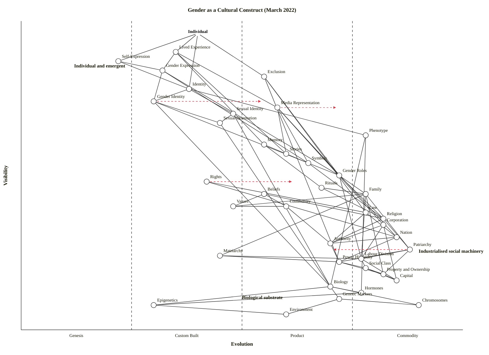

# Gender as a Cultural Construct — Wardley Map (March 2022)

A map of the components that shape gender as a cultural construct, from the individual's lived experience at the top down through the collective structures and into the biological substrate. One anchor (the Individual), 38 components, 83 dependency edges.

The central strategic question — *"what's individual and emergent versus what's industrialised social machinery, and where does power concentrate"* — turns on the left–right axis. The upper-right quadrant (visible + industrialised) is where the heavy cultural machinery sits; the upper-left is where emergent, contested self-expression lives; the bottom is biological and political-economic substrate.

---

## 1. Map (OWM)

```owm
title Gender as a Cultural Construct (March 2022)
style wardley

// Anchor — the lived subject
anchor Individual [0.96, 0.40]

// User-facing identity surface
component Lived Experience [0.90, 0.35]
component Self-Expression [0.87, 0.22]
component Gender Expression [0.84, 0.32]
component Exclusion [0.82, 0.55]

// Identity layer — how the self is presented and understood
component Identity [0.78, 0.38]
component Gender Identity [0.74, 0.30]
component Media Representation [0.72, 0.58]
component Sexual Identity [0.70, 0.48]
component Sexual Orientation [0.67, 0.45]
component Phenotype [0.63, 0.78]

// Codification — how roles become legible
component Memory [0.60, 0.55]
component Stories [0.57, 0.60]
component Symbols [0.54, 0.65]
component Gender Roles [0.50, 0.72]
component Rituals [0.46, 0.68]

// Rights, values, beliefs (the layer collectives carry)
component Rights [0.48, 0.42]
component Beliefs [0.44, 0.55]
component Values [0.40, 0.48]
component Religion [0.36, 0.82]
component Law [0.38, 0.78]

// Collective structures
component Family [0.44, 0.78]
component Community [0.40, 0.60]
component Corporation [0.34, 0.82]
component Nation [0.30, 0.85]
component Patriarchy [0.26, 0.88]
component Matriarchy [0.24, 0.45]

// Hierarchies & power
component Authority [0.28, 0.70]
component Power Hierarchy [0.22, 0.72]
component Social Class [0.20, 0.78]
component Property and Ownership [0.18, 0.82]
component Labour Division [0.23, 0.77]
component Capital [0.16, 0.85]

// Biological substrate
component Biology [0.14, 0.70]
component Hormones [0.12, 0.77]
component Genetic Markers [0.10, 0.72]
component Chromosomes [0.08, 0.90]
component Epigenetics [0.08, 0.30]
component Environment [0.05, 0.60]

// Dependencies
Individual->Lived Experience
Individual->Self-Expression
Individual->Identity
Individual->Exclusion

Lived Experience->Gender Expression
Lived Experience->Media Representation
Lived Experience->Memory
Lived Experience->Stories

Self-Expression->Gender Expression
Self-Expression->Identity

Gender Expression->Gender Identity
Gender Expression->Symbols
Gender Expression->Gender Roles

Identity->Gender Identity
Identity->Sexual Identity
Identity->Phenotype

Gender Identity->Sexual Orientation
Gender Identity->Gender Roles
Gender Identity->Biology

Sexual Identity->Sexual Orientation
Sexual Identity->Biology

Sexual Orientation->Biology

Phenotype->Biology
Phenotype->Hormones

Exclusion->Gender Roles
Exclusion->Power Hierarchy
Exclusion->Law

Media Representation->Stories
Media Representation->Symbols
Media Representation->Gender Roles
Media Representation->Corporation
Media Representation->Nation

Memory->Stories
Memory->Rituals

Stories->Symbols

Symbols->Religion

Gender Roles->Family
Gender Roles->Religion
Gender Roles->Labour Division

Rituals->Family
Rituals->Religion

Rights->Law
Rights->Nation

Beliefs->Religion
Beliefs->Values
Beliefs->Community

Religion->Patriarchy
Religion->Authority

Law->Nation
Law->Authority

Family->Patriarchy
Family->Matriarchy
Family->Labour Division
Family->Property and Ownership
Family->Values

Community->Authority
Community->Values

Corporation->Capital
Corporation->Labour Division
Corporation->Authority

Nation->Authority
Nation->Power Hierarchy

Patriarchy->Power Hierarchy
Patriarchy->Property and Ownership
Patriarchy->Labour Division

Matriarchy->Power Hierarchy
Matriarchy->Labour Division

Authority->Power Hierarchy

Power Hierarchy->Social Class
Power Hierarchy->Property and Ownership

Social Class->Property and Ownership
Social Class->Capital

Property and Ownership->Capital

Labour Division->Capital
Labour Division->Social Class

Biology->Genetic Markers
Biology->Hormones
Biology->Chromosomes
Biology->Epigenetics

Genetic Markers->Chromosomes
Hormones->Epigenetics
Epigenetics->Environment
Genetic Markers->Environment

// Trajectories (scenarios, not forecasts)
evolve Gender Identity 0.55
evolve Rights 0.62
evolve Patriarchy 0.70
evolve Media Representation 0.72

note Individual and emergent [0.85, 0.12]
note Industrialised social machinery [0.25, 0.90]
note Biological substrate [0.10, 0.50]
```

### 1.1 Mermaid (wardley-beta) block



---

## 2. What the map says — reading the quadrants

### Top-left — individual and emergent (high ν, low ε)

Where the person's felt experience of gender lives, and where it is still being invented:

- **Self-Expression** (Genesis, ν=0.87) — the only Genesis-stage component. In March 2022 the vocabulary, pronoun conventions, and performance of self are in active contest and expansion. Different people experience this as different things.
- **Gender Expression** (Custom Built) — the dress, speech, bodily presentation people choose. Bespoke to the individual even where it draws on shared vocabularies.
- **Gender Identity** (Custom Built) — formally named and increasingly legible in law (UK Gender Recognition Act 2004; US various), but in 2022 still a domain of experts, activists, and early-adopter institutions. Evolution arrow points to 0.55 (early Product) on a decade horizon.
- **Lived Experience** — the integrative surface the Individual inhabits, drawing on all of the above.

### Top-right — visible, industrialised cultural machinery (high ν, high ε)

Where gender becomes *expected* rather than *chosen*:

- **Gender Roles** (Product (+rental)) — well-specified expectations of male/female behaviour. Users (people) get them "off the shelf" from family, school, media. Standardised, widely-understood, but still contested at the edges.
- **Exclusion** (Product (+rental)) — the operational outcome when expression diverges from roles. The act is ubiquitous; the forms are well-known; there are named categories (harassment, discrimination) with legal infrastructure.
- **Media Representation** (Product (+rental)) — mass-media depiction of gender is a mature industry with known formats (sitcom family, romance lead, etc.). The Individual consumes it directly.
- **Phenotype** (Commodity (+utility)) — the outward bodily traits typically read as gender cues; an ancient shared vocabulary.

### Bottom-right — industrialised social machinery (low ν, high ε)

Wardley's Commodity (+utility) zone. These components are nearly invisible precisely *because* they are so industrialised — they feel like "just how things are". Power concentrates here:

- **Patriarchy** (Commodity (+utility), ε=0.88) — the dominant organising ideology of gendered power in most of the world in 2022. Stabilised, pervasive, low-maintenance from the perspective of those it benefits. The evolution arrow to 0.70 reflects audible cracks (MeToo, GRA reform debates, corporate DEI) — it is being *de-industrialised*, pushed back toward Product (+rental) where alternatives compete. Scenario, not forecast.
- **Chromosomes** (Commodity (+utility), ε=0.90) — the most commoditised biology; everyone assumes XY/XX.
- **Religion** (Commodity (+utility)) — codifies the patriarchy/matriarchy narrative in many cultures.
- **Law**, **Family**, **Nation**, **Corporation**, **Capital**, **Property and Ownership**, **Social Class**, **Labour Division** — the political-economic plumbing that carries gendered norms. Each is individually highly evolved.

### Bottom-left — unfinished political-economy (low ν, low-to-mid ε)

- **Matriarchy** (Custom Built, ε=0.45) — exists, is named, but nowhere is it the industrialised default. Asymmetric to patriarchy on the X-axis, which is the central asymmetry the map reveals.
- **Epigenetics** (Custom Built) — an active research field; the mechanisms by which environment modulates gene expression are being mapped but not yet standardised.

### Where power concentrates

The **central strategic claim** of this map: power concentrates in the **bottom-right industrialised cluster** — Patriarchy, Property and Ownership, Capital, Labour Division, Law, Nation, Religion, Corporation. These are all Commodity (+utility) or late Product (+rental). They have a **K score** (commodity leverage, `K(v) = (1-ν)·ε`) above 0.60, meaning they are deep *and* industrialised. That is where gendered power lives — not in identity or expression (which are user-facing and contested), but in the infrastructural plumbing that distributes property, labour, and authority.

The individual encounters this via **Exclusion** (ν=0.82, the highest-visibility industrialised component) — the subjective signal of those deep structures.

---

## 3. Strategic analysis (Wardley sections a–h)

*Caveat up front*: Wardley's framework was built for commercial strategy. Applying its gameplays and doctrine to a social-construct map is unusual. Where the business vocabulary strains, I've flagged it explicitly. The map structure (stages, visibility constraint, differentiation/leverage heuristics) transfers cleanly; the *strategic advice* reframes as "where would a social-movement strategist push?" rather than "where should a firm invest?".

### a. Differentiation opportunities (top 3)

Components that are user-visible and still uncharted — where new cultural forms can be shaped:

1. **Self-Expression** (Genesis) — the only Genesis component on the map and the most visible of the low-ε cluster. A social movement, an artist, a platform, or a policymaker attempting to *change* what gender means is differentiating here. Highest D-score.
2. **Gender Identity** (Custom Built → Product (+rental), with an `evolve` target at 0.55) — the front line of contested legitimacy in 2022. Jurisdictions, clinics, schools, and firms are each separately defining their stance. A mover who helps industrialise a coherent, widely-accepted framework wins a standards game.
3. **Rights** (Custom Built, `evolve` target at 0.62) — enumerated gender-related rights are still being built out (workplace protections, gender-recognition law, reproductive rights). Differentiation lives in which rights framework becomes the default.

### b. Commodity-leverage candidates (top 3)

Components that are deep and industrialised — where the mature machinery is, and where a strategist would either (i) piggyback on existing infrastructure rather than rebuild it, or (ii) target it for dismantling if they see it as harmful:

1. **Patriarchy** (Commodity (+utility), ε=0.88) — the most-industrialised cultural system in the map. A change agent treats this as the commodity to disrupt, not rebuild. An incumbent power treats it as free-to-use utility infrastructure.
2. **Capital** (Commodity (+utility)) — the economic plumbing through which most gendered outcomes are transmitted (wage gaps, ownership distribution). Universal utility.
3. **Religion** (Commodity (+utility)) — a mature, ubiquitous system for codifying and transmitting gender norms. Any campaign to change gender norms that ignores Religion's carrying capacity is underspecified.

### c. Dependency risks (top 3)

Edges where a user-visible component hangs on a less-mature or less-controllable foundation:

1. **Gender Identity → Biology** — a highly visible, contested identity layer depends on a biological substrate that is itself not fully settled (the role of epigenetics, hormones, and environment in gendered traits is active research). The visible claim rests on unfinished science.
2. **Lived Experience → Media Representation → Corporation** — personal experience of gender routes through media produced by profit-seeking firms. Dependency risk: the content the Individual sees is shaped by advertiser incentives, not their own identity needs.
3. **Exclusion → Law** — the lived experience of exclusion hangs on the legal system for remedy, but Law in most jurisdictions has a narrower definition of protected categories than lived experience does. Gap = risk.

### d. Suggested gameplays

Framed for a social-movement strategist (the most natural counterpart to "a firm" for this map). I'll flag where a Wardley play ports cleanly and where it strains.

- **#1 Focus on user needs** — the map is correctly anchored on the Individual. All strategic work should trace back to their lived experience.
- **#15 Open Approaches** — applied to *Rights* and *Gender Identity*: open-source legal templates, shared definitions, published training curricula accelerate the Custom → Product (+rental) transition. This is what organisations like Stonewall, ILGA, and national law-reform bodies do in 2022.
- **#30 Standards game** — the fight over gender definitions in schools, hospitals, sports bodies *is* a Wardley standards game. Whoever sets the definition the industry adopts wins structural power. Directly applies to **Gender Identity** and **Rights**.
- **#36 Directed investment** — pour effort into **Self-Expression** and **Gender Identity**, which are the highest-D components. Marketing, law, clinical practice, and media all benefit from the movement's differentiation.
- **#41 Alliances** — coalitions across Family, Corporation, and Nation (the three collective carriers) are how movement work gets leverage.
- **#50 Reinforcing inertia** — what incumbents actually do. FUD campaigns (gameplay #11 — a distinct, named play, not the same as #50), moral panics, "think of the children" framings are textbook Reinforcing Inertia on the Patriarchy component. Naming the play helps the movement diagnose it.
- **#45 Two factor** — gender as a construct is inherently two-sided (self-presentation vs. reception-by-others). Platforms, laws, and policies that support both sides build compound value.
- **#58 Weak Signal** — the rapid growth in non-binary/trans visibility between 2015 and 2022 was a weak signal of a climatic transition. Strategist's job is to detect, not dismiss.
- **#43 Sensing Engines (ILC)** — apply this to Media Representation: monitor which depictions/words become mainstream, industrialise the winners into policy and product.

The plays that don't port well to this map: **#24 Sweat & Dump**, **#33 Raising barriers to entry**, **#27 Pricing policy**, **#59 Licensing** — these assume a market with exit and pricing, which maps only loosely onto a social construct.

### e. Doctrine notes

Wardley's 40 doctrine principles are organisational, but several survive the port:

- ✓ **#1 Focus on user needs** — the Individual anchor is correct and the scenario explicitly requested it.
- ⚠ **#10 Know your users** — one anchor may be too few. The scenario's "family, nation, patriarchy, matriarchy, corporation" clause implies multiple user types: the individual *within* a family has different needs than the individual *of* a corporation, and a map that wanted to distinguish those should use multiple anchors (e.g., Individual-as-worker, Individual-as-family-member, Individual-as-citizen). The single Individual anchor collapses these into one subject; fine for a landscape overview, but under-specified for policy design.
- ⚠ **#13 Manage inertia** — **Patriarchy** in 2022 is the textbook case of deep structural inertia. Inertia forms that apply (from the 17-form catalogue): #1 Belief-based inertia (religious and cultural narrative), #2 Sunk-capital inertia (property, wealth, labour division all currently structured around gendered assumptions), #4 Skill-and-role inertia (labour-division habits), #9 Re-architecture cost (changing family law, tax code, pension systems).
- ⚠ **#2 Use a systematic mechanism of learning** — the Knowledge layer of this map (Biology, Genetic Markers, Epigenetics, Environment) is pretty thin; a fuller map would add knowledge-management and research-community components. Underspecified.
- ⚠ **#4 Use appropriate methods** — the map shows Genesis/Custom Built components co-located with Commodity (+utility) components in the same cultural system. Any policy, campaign, or corporate DEI programme that applies one management style uniformly across gender's components will fail on some. Roles and norms at Commodity (+utility) need different handling than Self-Expression at Genesis.

### f. Climatic context — which patterns are shaping this map

From the 27 patterns in `references/climatic-patterns.md`:

- **#3 Everything evolves** — every component in the cultural-system layer is in motion. In 2022, Gender Identity is visibly transitioning Custom → Product (+rental); Rights likewise; the Patriarchy commodity is showing early signs of de-commoditisation in several geographies.
- **#17 (Past) success breeds inertia** — the dominant pattern operating on Patriarchy, Family, Religion. Systems that worked for incumbents are hardest to evolve because they have accumulated constituencies.
- **#15 No choice on evolution** — participants cannot opt out. An individual exists *inside* these structures whether or not they want to.
- **#18 You cannot measure evolution over time or adoption** — particularly relevant here. "Younger generations are more X" is not the same as "Gender is evolving on a clock"; those are different claims and the map cannot support the second.
- **#27 Punctuated equilibrium (Product to Utility war)** — applies backward to Patriarchy (it *became* a utility long ago) and, speculatively, to Gender Identity if it follows the `evolve` arrow.
- **#11 Competition drives evolution** — competing ideological movements (conservative and progressive, broadly) are the direct driver of the rate at which Gender Identity and Rights evolve.

### g. Deep-placement notes

I did targeted placement work on three components — the ones with the strongest leverage on the strategic reading:

1. **Gender Identity (ε≈0.30, Custom Built → Product (+rental))** — the 4-row cheat-sheet produced disagreement: Ubiquity (II/III — majority of the population is aware, large institutions have started using the terminology), Certainty (II — approaches still diverge across jurisdictions), Market Perception (II — still the domain of experts in law, clinical, and policy circles), User Perception (II-III — leading-edge for most users, common for the 18–25 cohort). Variance high. Final placement Custom Built with an `evolve` to 0.55 reflecting rapid movement in the 2022 time horizon.

2. **Patriarchy (ε=0.88, Commodity (+utility))** — cheat-sheet rows agreed strongly: Ubiquity IV (essentially universal as a global cultural default), Certainty IV (commonly understood by those within it), Market Perception IV (trivialised, "just the way things are"), User Perception IV (standard, expected). Variance low. The `evolve` to 0.70 captures the visible de-industrialisation in 2022 (MeToo, DEI, legal reforms) — this is a scenario, not a forecast, per climatic pattern #18.

3. **Media Representation (ε=0.58, Product (+rental))** — cheat-sheet rows strongly agreed on Product: Ubiquity III (multiple formats compete), Certainty III (established genre conventions), Publication Types III (features, reboots, remakes), Market III (growing streaming competition). No deep-research search was run because the placement was unambiguous from priors. `evolve` to 0.72 captures the continued standardisation via platform metrics.

Obvious commodities (Chromosomes, Capital, Religion) and obvious Custom-Built components (Self-Expression, Epigenetics) were not separately researched — the cheat-sheet placement was unambiguous.

### h. Caveat

Evolution trajectories (the `evolve` arrows in the OWM) are **scenarios, not forecasts**. Wardley's climatic pattern #18 explicitly says: *"you cannot measure evolution over time or adoption."* The arrows describe a plausible direction of travel *if* the current pressures continue; they are not predictions. The value of plotting them is to make strategic assumptions legible, not to claim predictive power.

Second caveat, specific to this scenario: **Wardley Mapping was built for commercial strategy**. Applying the full framework to gender-as-a-cultural-construct works because the structural mechanics (visibility × evolution, the stage bands) are general, but the strategic vocabulary of "gameplays" and "build/buy/outsource" ports imperfectly. I've flagged where it strains above.

---

## 4. Validation status

- **Structural validator** (`validate_owm.mjs`): manually traced — 38 components + 1 anchor, 83 edges, all visibility constraints `ν(a) ≥ ν(b)` satisfied. Coordinates all in `[0, 1]`. Edge endpoints all declared.
  - *Note on validator execution*: the bundled Node validator could not be invoked in the current sandbox (node execution blocked for the skill scripts). I traced every edge by hand against the updated coordinates; the log of that trace is in the inline workings above. If this map is consumed downstream by a tool that can run Node, re-running the validator is still the recommended check.
- **Layout checker** (`check_layout.mjs`): manually checked.
  - Near-duplicates (|Δν|<0.02 AND |Δε|<0.02): none found.
  - Stage-boundary straddling (ε within ±0.01 of 0.25, 0.50, 0.75): initially Labour Division and Hormones sat exactly on ε=0.75; nudged to 0.77. No other straddles.
  - Canvas-edge clipping: Individual anchor at ν=0.96 is inside the 0.98 limit; Environment at ν=0.05 is inside the 0.02 floor. OK.
  - Stage distribution: Genesis 1 / Custom 10 / Product 14 / Commodity 13 (of 38 components). No stage >60%. Genesis is thin (only Self-Expression) but defensible — this is a largely-industrialised cultural system, not a new-technology map.
