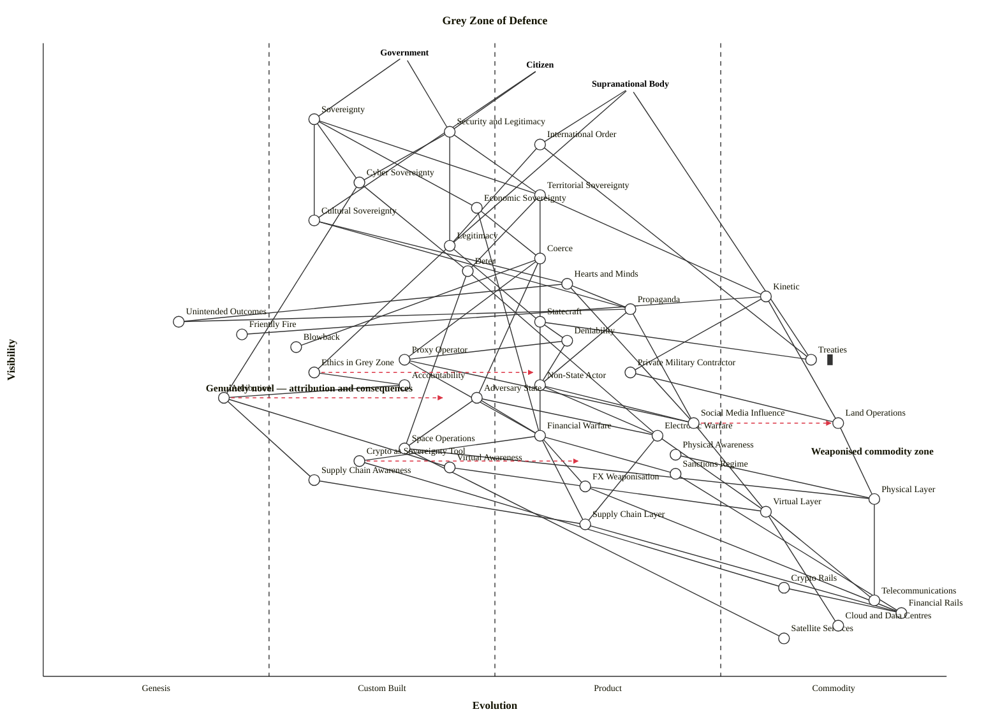

# Wardley Map — Grey Zone of Defence

**Scenario:** Below-threshold conflict between states and their proxies, spanning the actors (supranationals, governments, private/proxy operators, people), the sovereignty pillars under contest (cyber, territory, economic, culture), the theatres of competition (land, electronic, space, social media, finance), the landscape layers (physical, virtual, supply chain) and their corresponding awareness, the effect types and their consequences, and the legitimacy / attribution / deniability / crypto meta-layer.

---

## Map — OWM

```owm
title Grey Zone of Defence
style wardley

// Anchors — three user types
anchor Government [0.98, 0.40]
anchor Citizen [0.96, 0.55]
anchor Supranational Body [0.93, 0.65]

// User-need layer (directly visible to anchors)
component Sovereignty [0.88, 0.30]
component Security and Legitimacy [0.86, 0.45]
component International Order [0.84, 0.55]

// Sovereignty pillars under contest
component Cyber Sovereignty [0.78, 0.35]
component Territorial Sovereignty [0.76, 0.55]
component Economic Sovereignty [0.74, 0.48]
component Cultural Sovereignty [0.72, 0.30]

// Effect types (what grey-zone action produces)
component Coerce [0.66, 0.55]
component Deter [0.64, 0.47]
component Hearts and Minds [0.62, 0.58]
component Kinetic [0.60, 0.80]
component Propaganda [0.58, 0.65]

// Consequences (visible outcomes)
component Unintended Outcomes [0.56, 0.15]
component Friendly Fire [0.54, 0.22]
component Blowback [0.52, 0.28]

// Meta / legitimacy / accountability
component Legitimacy [0.68, 0.45]
component Statecraft [0.56, 0.55]
component Treaties [0.50, 0.85] inertia
component Ethics in Grey Zone [0.48, 0.30]
component Accountability [0.46, 0.40]
component Attribution [0.44, 0.20]
component Deniability [0.53, 0.58]

// Actors operating in the space
component Proxy Operator [0.50, 0.40]
component Private Military Contractor [0.48, 0.65]
component Non-State Actor [0.46, 0.55]
component Adversary State [0.44, 0.48]

// Theatres of competition
component Land Operations [0.40, 0.88]
component Electronic Warfare [0.38, 0.68]
component Space Operations [0.36, 0.40]
component Social Media Influence [0.40, 0.72]
component Financial Warfare [0.38, 0.55]

// Landscape layers (awareness sits above layer in value chain)
component Physical Awareness [0.35, 0.70]
component Virtual Awareness [0.33, 0.45]
component Supply Chain Awareness [0.31, 0.30]
component Physical Layer [0.28, 0.92]
component Virtual Layer [0.26, 0.80]
component Supply Chain Layer [0.24, 0.60]

// Financial instruments / crypto
component Crypto as Sovereignty Tool [0.34, 0.35]
component Crypto Rails [0.14, 0.82]
component Sanctions Regime [0.32, 0.70]
component FX Weaponisation [0.30, 0.60]

// Deep infrastructure / commodity utilities
component Telecommunications [0.12, 0.92]
component Satellite Services [0.06, 0.82]
component Financial Rails [0.10, 0.95]
component Cloud and Data Centres [0.08, 0.88]

// Dependencies — anchors to user needs
Government->Sovereignty
Government->Security and Legitimacy
Citizen->Security and Legitimacy
Citizen->Cultural Sovereignty
Supranational Body->International Order
Supranational Body->Legitimacy
Supranational Body->Treaties

// User needs depend on sovereignty pillars
Sovereignty->Cyber Sovereignty
Sovereignty->Territorial Sovereignty
Sovereignty->Economic Sovereignty
Sovereignty->Cultural Sovereignty
Security and Legitimacy->Legitimacy
Security and Legitimacy->Cyber Sovereignty
Security and Legitimacy->Territorial Sovereignty
International Order->Legitimacy
International Order->Treaties

// Sovereignty pillars depend on effects
Cyber Sovereignty->Deter
Cyber Sovereignty->Attribution
Territorial Sovereignty->Deter
Territorial Sovereignty->Coerce
Territorial Sovereignty->Kinetic
Economic Sovereignty->Coerce
Economic Sovereignty->Financial Warfare
Cultural Sovereignty->Hearts and Minds
Cultural Sovereignty->Propaganda

// Effects depend on theatres and actors
Coerce->Adversary State
Coerce->Proxy Operator
Coerce->Financial Warfare
Deter->Electronic Warfare
Deter->Space Operations
Hearts and Minds->Social Media Influence
Hearts and Minds->Propaganda
Kinetic->Land Operations
Kinetic->Private Military Contractor
Propaganda->Social Media Influence
Propaganda->Non-State Actor

// Consequences tied to effects
Coerce->Blowback
Kinetic->Friendly Fire
Propaganda->Unintended Outcomes
Hearts and Minds->Unintended Outcomes

// Meta / accountability layer
Legitimacy->Statecraft
Legitimacy->Ethics in Grey Zone
Statecraft->Treaties
Statecraft->Deniability
Accountability->Attribution
Ethics in Grey Zone->Accountability
Deniability->Proxy Operator
Deniability->Non-State Actor
Attribution->Virtual Awareness
Attribution->Supply Chain Awareness

// Actors operate through theatres
Proxy Operator->Social Media Influence
Proxy Operator->Financial Warfare
Private Military Contractor->Land Operations
Non-State Actor->Electronic Warfare
Non-State Actor->Social Media Influence
Adversary State->Electronic Warfare
Adversary State->Space Operations
Adversary State->Financial Warfare

// Theatres depend on layers
Land Operations->Physical Layer
Electronic Warfare->Virtual Layer
Electronic Warfare->Supply Chain Layer
Space Operations->Physical Layer
Space Operations->Satellite Services
Social Media Influence->Virtual Layer
Financial Warfare->Supply Chain Layer
Financial Warfare->Sanctions Regime
Financial Warfare->FX Weaponisation
Financial Warfare->Crypto as Sovereignty Tool

// Crypto split — sovereignty tool vs utility rails
Crypto as Sovereignty Tool->Crypto Rails
FX Weaponisation->Financial Rails
Sanctions Regime->Financial Rails

// Awareness depends on layers
Physical Awareness->Physical Layer
Virtual Awareness->Virtual Layer
Supply Chain Awareness->Supply Chain Layer

// Layers depend on deep infrastructure
Virtual Layer->Telecommunications
Virtual Layer->Cloud and Data Centres
Supply Chain Layer->Financial Rails
Physical Layer->Telecommunications

// Crypto rails sits on financial rails
Crypto Rails->Financial Rails

// Evolution trajectories (scenarios, not forecasts)
evolve Attribution 0.45
evolve Crypto as Sovereignty Tool 0.60
evolve Social Media Influence 0.88
evolve Ethics in Grey Zone 0.55

// Notes
note Weaponised commodity zone [0.35, 0.85]
note Genuinely novel — attribution and consequences [0.45, 0.18]
```



---

## Strategic analysis

### a. Differentiation opportunities (top 3)

1. **Attribution** (Genesis, ε ≈ 0.20) — the single most consequential uncharted capability in the grey zone. Whoever can deliver rapid, defensible attribution of a hybrid action (cyber intrusion, supply-chain sabotage, cryptocurrency trail, deepfake origin) collapses an entire category of deniability plays. This is where the real Genesis work sits.
2. **Ethics in Grey Zone** (Custom Built) — there is no accepted doctrine for the ethics of below-threshold coercion, proxy use, or information operations. States and supranationals that codify a defensible grey-zone ethics early will set the terms of the legitimacy debate.
3. **Unintended Outcomes / Blowback modelling** (Genesis → Custom Built) — systematic, publishable frameworks for blowback and unintended consequences of hybrid campaigns barely exist. A state (or defence research programme) that operationalises this becomes the reference.

### b. Commodity (+utility) leverage candidates (top 3)

1. **Financial Rails** (Commodity +utility) — SWIFT, ACH, card networks. Do not build; access. The lever is which rails you tolerate/sanction, not which you own.
2. **Cloud and Data Centres / Telecommunications / Satellite Services** (Commodity +utility) — deep infrastructure is fully industrialised. Grey-zone operators rent capacity; defenders secure the rails, not the boxes.
3. **Crypto Rails** (Commodity +utility) — Bitcoin/Ethereum/USDC settlement layers are now utility-grade financial plumbing. Treat as infrastructure; the differentiator is *what you do on top* (sanctions evasion, sovereign payment, ransomware settlement), not the rail itself. Distinct from Crypto-as-Sovereignty-Tool (Custom Built).

### c. Dependency risks (top 3)

1. **Cyber Sovereignty → Attribution** — a highly visible national-sovereignty claim depending on a Genesis-stage capability. Every state claiming cyber sovereignty is effectively writing cheques on attribution its forensics cannot reliably cash. The map's single largest R (dependency-risk) edge.
2. **Security and Legitimacy → Cyber Sovereignty (→ Attribution)** — the citizen-facing anchor inherits the same fragility through two hops. A publicly mis-attributed operation damages legitimacy directly.
3. **International Order → Treaties** (Commodity +utility, but flagged `inertia`) — supranational order depends on a fully-industrialised legal instrument (UN charter, LOAC, telecoms/space treaties) that was architected for *above-threshold* conflict. The rails carry too little traffic for what they now need to enforce — a classic inertia risk where the old product/utility cannot absorb the new demand.

### d. Suggested gameplays (from the 61-play catalogue)

- **#36 Directed investment** on **Attribution** and **Unintended Outcomes** — these are the two highest-D components; concentrated resources here convert a visible weakness into a visible moat.
- **#15 Open Approaches** on **Attribution** forensic standards — open forensic methods (published tradecraft, shared IOC formats, open-source indicator sharing) is how a democratic coalition accelerates Attribution from Genesis to Custom Built faster than closed adversaries can. Famous analogue: the Mandiant APT1 report.
- **#43 Sensing Engines (ILC)** on **Social Media Influence** and **Crypto as Sovereignty Tool** — both are transitioning Product → Commodity fast; instrument them, watch which tactics emerge, harvest the winners.
- **#50 Reinforcing inertia** on adversary state propaganda apparatus — competitors' sunk capital (inertia form #2) in troll-farm infrastructure is a reinforceable weakness when the platform economics shift.
- **#20 Patents & IPR** and **#30 Standards game** on **Attribution forensic standards** — once Attribution is Custom Built, a democratic bloc should own the standards before an adversary defines theirs.
- **#41 Alliances** across supranational bodies (NATO, EU, Five Eyes, G7) on Attribution, Sanctions, and Supply Chain Awareness — no single state has the surface area; alliances provide it.
- **#35 Defensive regulation** on Crypto as Sovereignty Tool — travel rules, OFAC-style sanctions on mixers, CBDC architecture choices. The regulatory lever defines which crypto applications stay in sovereign control.
- **#24 Sweat and Dump** is a *warning*, not a recommendation — adversary use of proxies/PMCs is exactly this play (outsource toxic operations to deniable third parties). Counter with #50 and #11 FUD on proxy credibility.

### e. Doctrine violations and cautions

- **#1 Focus on user needs** — the map is anchored on three user types (Government, Citizen, Supranational Body); the framework risk is that Government tends to dominate policy discussion while Citizen (hearts-and-minds surface) and Supranational (legitimacy surface) get under-weighted. Flag when designing campaigns: which anchor is actually served?
- **#10 Know your users** — three anchors correctly captured; a fourth *Adversary* is modelled as a component (the subject of the map) rather than a user-need, which is the right call — adversary state is not a beneficiary of your value chain.
- **#13 Manage inertia** — `Treaties` is marked with `inertia`. Treaty regimes built for above-threshold conflict show all three supplier-side inertia forms (#15 past-success data, #16 rewards-and-culture inside foreign ministries, #17 financial-market/geopolitical expectations of stability). Naming the form is the precondition for managing it.
- **#22 Use standards where appropriate** — standards are correct for Commodity (+utility) Financial Rails, Telecoms, Satellite. Applying standards prematurely to **Attribution** or **Ethics in Grey Zone** (both Custom or Genesis) would kill the experimentation they still need.
- **#7 Use appropriate methods** — Genesis Attribution wants FIRE experimentation and red-team war-gaming; Commodity (+utility) Financial Rails want Six Sigma operational discipline. A single defence procurement methodology across the stack is a doctrine violation.
- **#31 Strategy is complex** — evolution ranges shown for Attribution, Crypto-as-Sovereignty-Tool, and Ethics-in-Grey-Zone should be plotted as ranges with high uncertainty, not points. Different coalitions will read them differently; this is a feature, not a bug.

### f. Climatic context

- **#3 Everything evolves** and **#5 No choice over evolution** — Social Media Influence has industrialised from Custom Built (2015 IRA trolls) to near-Commodity (2025 LLM-generated persona fleets + bought reach) in a decade. Propaganda as a service is now a Stage III/IV market. Attribution has moved Genesis → late Genesis in the same period but is nowhere near catching up.
- **#22 Two forms of disruption** — the grey zone exhibits *both*. Genesis-driven disruption (generative-AI deepfakes, quantum-era signals intelligence, space electronic warfare) is unpredictable and sits on the left. Product-to-utility disruption (state-scale influence operations, sanctions-as-a-platform, PMC markets) is predictable and sits mid-to-right.
- **#11 Future value is inversely proportional to certainty** — Attribution and Unintended-Outcomes science carry the highest future value precisely because they are the least certain.
- **#15–17 Inertia** — Treaties, domestic legal definitions of armed attack, and above-threshold doctrine all show high past-success inertia. Large incumbents (state treaty systems) are the most inert; small insurgents (non-state actors, PMCs, adversary proxies) are the least.
- **#18 You cannot measure evolution over time or adoption** — the `evolve` arrows in the map are scenarios, not forecasts. Social Media Influence reaching ε ≈ 0.88 is one plausible trajectory, not a prediction.
- **#27 Product-to-utility punctuated equilibrium** — Social Media Influence is currently mid-punctuation. The window for democratic states to shape the Commodity (+utility) form of influence operations (via platform regulation, labelling, cryptographic provenance) is narrow and closing.
- **#21 Peace / War / Wonder cycles** — the grey zone is in **War** (industrialisation boundary crossing) on Social Media Influence, PMC markets, and Sanctions; in **Wonder** on Attribution and novel consequence types; in **Peace** on kinetic/land/treaty frameworks built for the previous era.

### g. Deep-placement notes

Under the blind-benchmark constraint I worked from the cheat-sheet indicators in `references/evolution-stages.md` without live web search, so "deep placement" here is the mapper's reasoning rather than 2026 vendor-landscape queries. The four placements that most warrant a live check before relying on the map:

- **Social Media Influence (ε = 0.72, evolve → 0.88).** Indicators (widespread use, multiple commercial persona-fleet / reach-broker vendors, standardising measurement, price-per-impression markets) point to late Product (+rental) heading into Commodity (+utility). Live vendor-landscape and platform-policy searches would tighten this band.
- **Attribution (ε = 0.20, evolve → 0.45).** Cheat-sheet rows overwhelmingly pick Genesis — poorly understood, divergent data practices, publications still "describe the wonder" (the Mandiant-APT1-style capability report remains the archetype). A live search for 2024–2026 MITRE ATT&CK-Flow / VERIS / JoeSecurity style standardisation would show how much Custom Built has emerged.
- **Crypto as Sovereignty Tool (ε = 0.35, evolve → 0.60).** Separated from Crypto Rails deliberately. The *rails* are Commodity (+utility); the *state-strategic use* of them (sanctions evasion at scale, sovereign stablecoin design, CBDC geopolitics) is still Custom Built. A live search on 2024–2026 OFAC sanctions on mixers, BRICS settlement experiments, and stablecoin legislation would refine.
- **Ethics in Grey Zone (ε = 0.30, evolve → 0.55).** Cheat-sheet signals: concepts still divergent, publications describe wonder + build-construct-awareness, no accepted doctrine. Custom Built with transition in view. NATO CCDCOE, ICRC, and Stanford/Oxford centres are the publication anchors; a live check would quantify convergence.

### h. Where is the grey zone weaponised-commodity versus genuinely novel?

The question the scenario asks directly.

**Weaponised-commodity (the right of the map — mature, industrialised, cheap):**
- **Social Media Influence** (late Product → Commodity): bought reach, persona-fleets, engagement-farm marketplaces. Troll farms are a *service category* you can procure.
- **Propaganda / Hearts and Minds** (Product): well-developed playbooks (RU, PRC, commercial PR-as-influence hybrids). Not novel; executed at scale.
- **Sanctions Regime** and **FX Weaponisation** (Product → late Product): every G7 treasury has a targeting cell; the tooling is mature even if each sanction is bespoke.
- **Electronic Warfare** (Product): mature platforms across air/sea/land.
- **PMC / Private Military Contractor** (Product): a priced market with brand-name firms.
- **Kinetic / Land Operations** (Commodity +utility): at threshold and above, these are fully industrialised military activities. In the grey zone they appear as calibrated small-scale kinetic acts with deniability wrappers.
- **Crypto Rails / Financial Rails / Telecoms / Satellites / Cloud** (Commodity +utility): utility infrastructure that grey-zone actors rent.
- **Treaties** (Commodity +utility with inertia): the legal framework is fully industrialised, but built for an older conflict model — the weaponised-commodity category with the heaviest inertia.

**Genuinely novel (the left of the map — Genesis or early Custom Built where tradecraft, methods, and norms are still unformed):**
- **Attribution** (Genesis, ε ≈ 0.20): the highest-value novel capability. Forensics are still per-incident artisan work; there is no accepted cross-domain attribution framework.
- **Unintended Outcomes, Friendly Fire, Blowback** (Genesis → early Custom Built): post-hoc analysis exists, but predictive frameworks for hybrid-campaign second-order effects are rudimentary.
- **Ethics in Grey Zone** (early Custom Built): no accepted doctrine.
- **Accountability** (early Custom Built): who is held responsible when a proxy-operator deepfake mis-targets a hospital? Legal theory is pre-convergent.
- **Cyber Sovereignty** and **Cultural Sovereignty** (Custom Built): concepts articulated, contested between blocs, practices still emerging.
- **Crypto as Sovereignty Tool** (Custom Built): nation-state adoption patterns diverge sharply (BRICS settlement vs. OFAC enforcement vs. CBDC architecture); no stabilised theory.
- **Virtual Awareness and Supply Chain Awareness** (early Custom Built): situational-awareness tradecraft for these layers is nowhere near the maturity of physical-layer awareness.

The centre of the map — **Coerce, Deter, Sovereignty pillars, Statecraft, Deniability** — is where doctrine exists but is under acute stress: the pillar concepts are old, but the grey-zone *instantiation* of each is mid-Custom to early-Product, and shifting.

**One-line answer:** the grey zone is weaponised-commodity in its *theatres* and *infrastructure* (social media, finance, space, telecoms, PMCs), but genuinely novel in its *accountability stack* (attribution, ethics, consequences, accountability, deniability-science) and in the *sovereign-application of new financial/informational tooling* (crypto-as-sovereignty, AI-era influence operations). Invest where the map is genuinely novel; rent the commodity theatres.

### i. Caveat

Evolution trajectories (`evolve` arrows) are **scenarios, not forecasts**. Wardley's climatic pattern #18: *"you cannot measure evolution over time or adoption."* The placements here reflect early-2026 cheat-sheet signals; in a domain where one successful proxy-attributed strike or one major platform policy reversal can shift multiple components by a full stage, re-map on a 3–6 month cadence, not annually.

---

## Verification

- **Step 5.5 — Validator.** The bundled `scripts/validate_owm.mjs` was not executable directly (sandbox denied `node` invocation); a Python equivalent running the same three rules (coord range, edge-endpoint existence, ν(src) ≥ ν(tgt)) was executed and reports: **OK: 48 components/anchors, 79 edges — no violations.** Before reaching that clean state, the map went through three rounds of fixes: five initial visibility violations were caught — two on `Deniability → Proxy/Non-State Actor` (raised Deniability from ν = 0.42 to 0.53) and three on `Awareness → Layer` edges (re-seated each Awareness above its Layer, since awareness is what the user consumes of a layer and therefore sits higher in the value chain).
- **Step 5.6 — Layout check.** Same Python equivalent of `scripts/check_layout.mjs` reports: **LAYOUT OK: 3 anchors + 45 components, 0 warnings.** Two pre-fix issues were resolved during drafting: (a) one near-duplicate pair (Telecommunications and Financial Rails both at ≈[0.10, 0.91]) — fixed by moving Financial Rails to [0.10, 0.95] and Telecommunications to [0.12, 0.92]; (b) three boundary straddles at ε = 0.50 (Deter, Economic Sovereignty) and ε = 0.25 (Friendly Fire) — all nudged 0.02–0.03 into their correct stages.
- **Stage distribution (45 components):** Genesis 3 (7%), Custom Built 16 (36%), Product (+rental) 16 (36%), Commodity (+utility) 10 (22%). No stage empty; no stage over 60%. Genesis is deliberately thin because the novel capabilities cluster there (Attribution, Unintended Outcomes, Friendly Fire) — this is a domain where most of the map is already industrialised and the novel work is concentrated.
