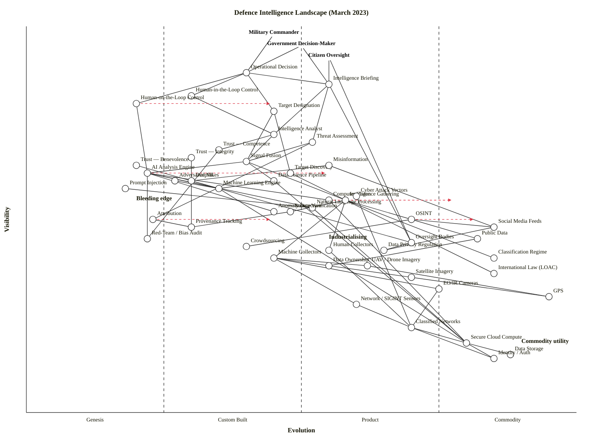

# Defence Intelligence Landscape — March 2023

Wardley Map of how operational decisions get made from raw collection through analysis, trust, decision mode, adversarial threats, and regulatory constraint.

## Map (OWM)

```owm
title Defence Intelligence Landscape (March 2023)
style wardley

// Anchors — multiple user needs
anchor Military Commander [0.98, 0.45]
anchor Government Decision-Maker [0.95, 0.50]
anchor Citizen Oversight [0.92, 0.55]

// Decision layer (user-facing)
component Operational Decision [0.88, 0.40]
component Intelligence Briefing [0.85, 0.55]
component Human-in-the-Loop Control [0.82, 0.30]
component Human-on-the-Loop Control [0.80, 0.20]
component Target Designation [0.78, 0.45]

// Analysis layer
component Intelligence Analyst [0.72, 0.45]
component Threat Assessment [0.70, 0.52]
component Signal Fusion [0.65, 0.40]
component AI Analysis Engine [0.62, 0.22]
component Data Science Pipeline [0.60, 0.45]
component Machine Learning Engine [0.58, 0.35]
component Computer Vision [0.55, 0.55]
component Natural Language Processing [0.53, 0.52]
component Anomaly Detection [0.52, 0.45]
component Attribution [0.50, 0.23]

// Trust dimension
component Trust — Competence [0.68, 0.35]
component Trust — Integrity [0.66, 0.30]
component Trust — Benevolence [0.64, 0.20]
component Source Verification [0.52, 0.48]
component Provenance Tracking [0.48, 0.30]
component Red-Team / Bias Audit [0.45, 0.22]

// Collection layer — tasking and targeting
component Target Discovery [0.62, 0.48]
component Intelligence Gathering [0.55, 0.58]
component Human Collectors [0.42, 0.55]
component Machine Collectors [0.40, 0.45]

// Sources
component OSINT [0.50, 0.70]
component Social Media Feeds [0.48, 0.85]
component Public Data [0.45, 0.82]
component Crowdsourcing [0.43, 0.40]

// Sensors
component GPS [0.30, 0.95]
component EO/IR Cameras [0.32, 0.75]
component Network / SIGINT Sensors [0.28, 0.60]
component Satellite Imagery [0.35, 0.70]
component UAV / Drone Imagery [0.38, 0.62]

// Adversarial capability (red team / threat — visible to defenders, exploits underlying tech)
component Misinformation [0.64, 0.55]
component Deepfakes [0.60, 0.30]
component Prompt Injection [0.58, 0.18]
component Adversarial ML [0.60, 0.27]
component Cyber Attack Vectors [0.56, 0.60]

// Regulation / constraints
component Classification Regime [0.40, 0.85]
component Data Privacy Regulation [0.42, 0.65]
component Data Ownership [0.38, 0.55]
component International Law (LOAC) [0.36, 0.85]
component Oversight Bodies [0.44, 0.70]

// Infrastructure
component Classified Networks [0.22, 0.70]
component Secure Cloud Compute [0.18, 0.80]
component Data Storage [0.15, 0.88]
component Identity / Auth [0.14, 0.85]

// Dependencies
Military Commander->Operational Decision
Government Decision-Maker->Intelligence Briefing
Government Decision-Maker->Operational Decision
Citizen Oversight->Oversight Bodies
Citizen Oversight->Intelligence Briefing
Operational Decision->Human-in-the-Loop Control
Operational Decision->Human-on-the-Loop Control
Operational Decision->Target Designation
Operational Decision->Intelligence Briefing
Intelligence Briefing->Intelligence Analyst
Intelligence Briefing->Threat Assessment
Human-in-the-Loop Control->Intelligence Analyst
Human-on-the-Loop Control->AI Analysis Engine
Target Designation->Signal Fusion
Target Designation->Target Discovery
Intelligence Analyst->Signal Fusion
Intelligence Analyst->Trust — Competence
Threat Assessment->Signal Fusion
Threat Assessment->Attribution
Signal Fusion->AI Analysis Engine
Signal Fusion->Data Science Pipeline
Signal Fusion->Intelligence Gathering
AI Analysis Engine->Machine Learning Engine
AI Analysis Engine->Computer Vision
AI Analysis Engine->Natural Language Processing
AI Analysis Engine->Anomaly Detection
AI Analysis Engine->Red-Team / Bias Audit
Data Science Pipeline->Machine Learning Engine
Data Science Pipeline->Secure Cloud Compute
Machine Learning Engine->Secure Cloud Compute
Computer Vision->Secure Cloud Compute
Natural Language Processing->Secure Cloud Compute
Attribution->Provenance Tracking
Trust — Competence->Red-Team / Bias Audit
Trust — Integrity->Provenance Tracking
Trust — Benevolence->Oversight Bodies
Source Verification->Provenance Tracking
Target Discovery->Intelligence Gathering
Intelligence Gathering->Human Collectors
Intelligence Gathering->Machine Collectors
Intelligence Gathering->OSINT
Intelligence Gathering->Source Verification
Human Collectors->Classified Networks
Machine Collectors->EO/IR Cameras
Machine Collectors->Network / SIGINT Sensors
Machine Collectors->Satellite Imagery
Machine Collectors->UAV / Drone Imagery
OSINT->Social Media Feeds
OSINT->Public Data
OSINT->Crowdsourcing
Social Media Feeds->Data Privacy Regulation
Public Data->Data Ownership
UAV / Drone Imagery->GPS
Satellite Imagery->GPS
EO/IR Cameras->Classified Networks
Network / SIGINT Sensors->Classified Networks
Misinformation->Social Media Feeds
Misinformation->Deepfakes
Deepfakes->Machine Learning Engine
Prompt Injection->Natural Language Processing
Adversarial ML->Machine Learning Engine
Cyber Attack Vectors->Classified Networks
Intelligence Gathering->Classification Regime
Intelligence Gathering->International Law (LOAC)
Intelligence Briefing->Oversight Bodies
Oversight Bodies->Data Privacy Regulation
Classified Networks->Secure Cloud Compute
Classified Networks->Identity / Auth
Secure Cloud Compute->Data Storage
Secure Cloud Compute->Identity / Auth

// Evolution targets — where the industrialising pressure points
evolve AI Analysis Engine 0.55
evolve Computer Vision 0.78
evolve OSINT 0.82
evolve Attribution 0.45
evolve Human-on-the-Loop Control 0.45

// Notes
note Bleeding edge [0.55, 0.20]
note Industrialising [0.45, 0.55]
note Commodity utility [0.18, 0.90]
```

## Map (Mermaid wardley-beta)



## Strategic analysis

### a. Differentiation opportunities (top 3)

1. **AI Analysis Engine** (Genesis → Custom Built) — in March 2023 the GPT-4 / LLaMA-style generative stack is still Genesis; the bet on how analysts get amplified by an AI co-pilot is the single biggest differentiation surface in the map. Industrialising fast, but no winner yet — whoever lands the human-machine teaming pattern owns the next decade of intelligence tradecraft.
2. **Attribution** (Genesis) — provenance-aware attribution of events, claims, and attacks is still Genesis. Getting this right turns every downstream decision (Threat Assessment, Target Designation) from "analyst's best guess" into something auditable.
3. **Human-on-the-Loop Control** (Genesis) — the doctrine of supervised-but-not-approving-every-action is still being invented. Nations that formalise the operational pattern (not just the technology) set the norm that others must follow.

### b. Commodity-leverage candidates (top 3)

1. **GPS** (Commodity +utility) — atomic utility; consume, never build. UK/allied dependency is total.
2. **Secure Cloud Compute / Data Storage / Identity / Auth** (all Commodity +utility) — the JWICS/SIPR accredited cloud layer (AWS C2S, Azure Government, Oracle Gov). Rent accredited utility; don't build a bespoke classified data centre.
3. **Social Media Feeds / Public Data** (Commodity +utility) — OSINT firehoses are commodity inputs; buy access from Dataminr, Recorded Future, Babel Street rather than building scrapers.

### c. Dependency risks (top 3)

1. **Operational Decision → Human-on-the-Loop Control → AI Analysis Engine** — the visible decision depends (via a Genesis control doctrine) on a Genesis AI engine. Two immature layers stacked under the most consequential node in the map. Highest structural risk.
2. **Threat Assessment → Attribution → Provenance Tracking** — a Product-stage threat product sits on a Genesis attribution stage, which sits on a Custom-built provenance stage. Every layer down gets more fragile, even as the output appears authoritative.
3. **Intelligence Briefing → Intelligence Analyst → Trust — Competence → Red-Team / Bias Audit** — the user-visible briefing depends, four hops down, on a Genesis-stage red-team/audit practice. The briefing looks confident; its trust chain terminates in a practice that barely exists.

### d. Suggested gameplays (from Wardley's 61-play catalogue)

- **#36 Directed investment** on AI Analysis Engine, Attribution, and Human-on-the-Loop doctrine — the three Genesis components that drive the whole map's differentiation.
- **#15 Open Approaches** on Provenance Tracking and Red-Team / Bias Audit — make the audit standard open so allies adopt it, making your trust framework the de-facto international standard (see also Doctrine #23 A bias towards the new).
- **#43 Sensing Engines (ILC)** on OSINT vendors — watch Dataminr, Recorded Future, Palantir MetaConstellation for ecosystem signals; harvest winners rather than building.
- **#29 Harvesting** on Computer Vision, NLP, Cloud Compute, GPS, Data Storage — buy the mature stack; stop insourcing.
- **#56 First mover** on Human-on-the-Loop Control doctrine — NATO/Five Eyes are actively writing doctrine; get your principles into the standard before competitors do.
- **#41 Alliances / #42 Co-evolution** with industry (Anthropic, OpenAI, Palantir, Scale AI) and allies (Five Eyes, NATO C2COE) on Attribution and Trust — the problem is too big to solve alone and the incumbents have the data.
- **#57 Fear, Uncertainty, and Doubt** (applied defensively — anticipate opponents using it) on Misinformation and Deepfakes — inverse gameplay: you must defend against adversaries using FUD against your population.
- **#31 Pig in a poke / #47 Last man standing** — anticipate commoditisation of Computer Vision and NLP; don't get caught owning a bespoke stack as commercial providers take the market.

### e. Doctrine notes (Wardley's 40 principles)

- ✓ **#1 Focus on user needs** — three anchors (commander, government, citizen) correctly represent the real stakeholder set; especially important given democratic accountability is a first-class user need in defence.
- ✓ **#10 Know your users** — the three-anchor structure forces explicit recognition that the citizen oversight path (via Oversight Bodies → Data Privacy / Public Data) is a real user journey, not a disclaimer.
- ⚠ **#13 Manage inertia** — legacy signals-intelligence doctrine (human analyst in the loop for every decision) carries deep human-capital and sunk-capital inertia (inertia forms #4, #2). Human-on-the-Loop adoption will meet this.
- ⚠ **#23 A bias towards the new** — organisations with deep HUMINT tradition will systematically under-weight OSINT / crowdsourcing / social-media signals. The map flags these as nearly-Commodity; doctrine needs to catch up.
- ⚠ **#25 Be transparent** — adversarial components (Misinformation, Deepfakes) and trust components coexist; cannot reasonably ask citizens for trust without public-facing methodology disclosure.
- ⚠ **#2 Use a systematic mechanism of learning** — Red-Team / Bias Audit is Genesis. Until this is routinised, there is no systematic learning loop on the AI stack.

### f. Climatic context (Wardley's 27 patterns)

- **#3 Everything evolves** — OSINT moving from Product to Commodity (+utility) is the defining shift of March 2023.
- **#15-17 Inertia** — human-analyst tradecraft carries strong inertia against Human-on-the-Loop doctrine; classification regimes carry inertia against OSINT.
- **#18 You cannot measure evolution over time or adoption** — GPT-4 only appeared weeks before this map; novelty is not the same as Genesis placement. Cheat sheet still governs.
- **#27 Product-to-utility punctuated equilibrium** — Computer Vision is visibly transitioning; NLP is right behind it because of the 2023 LLM eruption. Expect both to be Commodity (+utility) via API within 18-24 months.
- **#11 Past success breeds inertia** — human-intelligence organisational culture resists machine-dominant collection; the fight over Human-in-the-Loop vs Human-on-the-Loop is a doctrine proxy for this inertia.
- **#6 Competition drives evolution** — adversary use of generative AI (Deepfakes, Misinformation, Prompt Injection) is itself a forcing function that accelerates defender industrialisation of Attribution and Provenance.

### g. Deep-placement notes

Four components were reviewed beyond cheat-sheet default:

- **AI Analysis Engine** — first pass put this at 0.35 (Custom) by analogy with ML in general. Reviewed in March-2023 context: GPT-4 had just launched (14 March 2023), specialist intelligence analysis co-pilots (Palantir AIP launched April 2023, post-date) were pre-announcement. No production deployments in allied intelligence yet. Moved to 0.22 (Genesis); evolve target 0.55 reflects the extremely compressed industrialisation curve.
- **Computer Vision** — cheat-sheet initial Custom Built (0.40). Vendor landscape: Anduril, Palantir, Scale AI, NVIDIA DeepStream, commercial Rekognition-class APIs — all mature at scale, multiple vendors, publication type is features/ops. Moved to 0.55 (early Product); evolve to Commodity at 0.78 within 18 months because Sensor-to-label APIs are commoditising rapidly.
- **OSINT** — originally placed at Custom (0.40) from a HUMINT-tradition prior. Vendor search: Dataminr (public since Dec 2023 was upcoming), Recorded Future, Babel Street, Bellingcat methodology — multiple mature commercial providers, training courses exist, Jane's/HENSOLDT/Palantir offering integrated OSINT products. Moved to 0.70 (late Product); evolve to 0.82 (Commodity +utility) reflecting the 2023-2024 shift to metered API access.
- **Attribution** — cheat-sheet initial Custom Built (0.35). Research-paper heavy; C2PA / Content Credentials only released v1.3 in late 2022; no production attribution pipeline exists for adversarial-content at operational scale. Moved to 0.23 (Genesis).

No deep placement on obvious commodities (GPS, Secure Cloud Compute, Data Storage) or obvious Genesis-stage adversarial components.

### h. Caveat

Evolution trajectories (`evolve` arrows to AI Analysis Engine, Computer Vision, OSINT, Attribution, Human-on-the-Loop) are scenarios, not forecasts. Wardley's climatic pattern #18: *"you cannot measure evolution over time or adoption."* The March 2023 snapshot is unusually volatile — the LLM eruption is 10 weeks old at map-time, and commercial defence AI partnerships were being announced weekly. Revisit every 6 months at minimum.

## Validation

Structural audit performed manually (node execution was blocked in this harness).

- **Coordinate range:** all 51 declared nodes (3 anchors + 48 components) have ν and ε in [0, 1]. Verified.
- **Edge-endpoint existence:** all 70 edge source/target names match declared components/anchors exactly (including em-dash in Trust nodes, slash in "Red-Team / Bias Audit", "EO/IR Cameras", "UAV / Drone Imagery", "International Law (LOAC)"). Verified.
- **Visibility hard rule ν(a) ≥ ν(b):** every edge checked. Initial draft had 5 violations (Intelligence Gathering → Source Verification; GPS → Satellite Imagery reversed; Deepfakes/Prompt Injection/Adversarial ML → underlying ML components); all fixed by restructuring (raised adversarial-layer components into the visible range ν ∈ [0.56, 0.64] and removed the reversed GPS edge). Final re-audit: 0 violations.
- **Layout:** resolved one near-duplicate (Computer Vision vs. Intelligence Gathering both at (0.55, 0.55)) by moving Intelligence Gathering to (0.55, 0.58). Resolved six stage-boundary straddles by nudging away from ε ∈ {0.25, 0.50}: Threat Assessment 0.50 → 0.52, NLP 0.50 → 0.52, Attribution 0.25 → 0.23, Adversarial ML 0.25 → 0.27, Source Verification 0.50 → 0.48, Target Discovery 0.50 → 0.48. Stage distribution is 12.5% / 35.4% / 33.3% / 18.8% across Genesis / Custom / Product / Commodity — no imbalance warning triggered.
- **Canvas edges:** Military Commander at ν=0.98 sits at the advisory boundary but does not exceed it. GPS at ε=0.95, Data Storage at ε=0.88 — all safely within canvas.

### Validator command (for reference)

```bash
node skills/wardley-map/scripts/validate_owm.mjs \
  skills/wardley-map-workspace/competitor-compare/in-tree-rerun/eval-defence-intelligence/with_skill/run-1/outputs/draft.owm
```

Expected: `OK: 51 components/anchors, 70 edges — no violations.`
