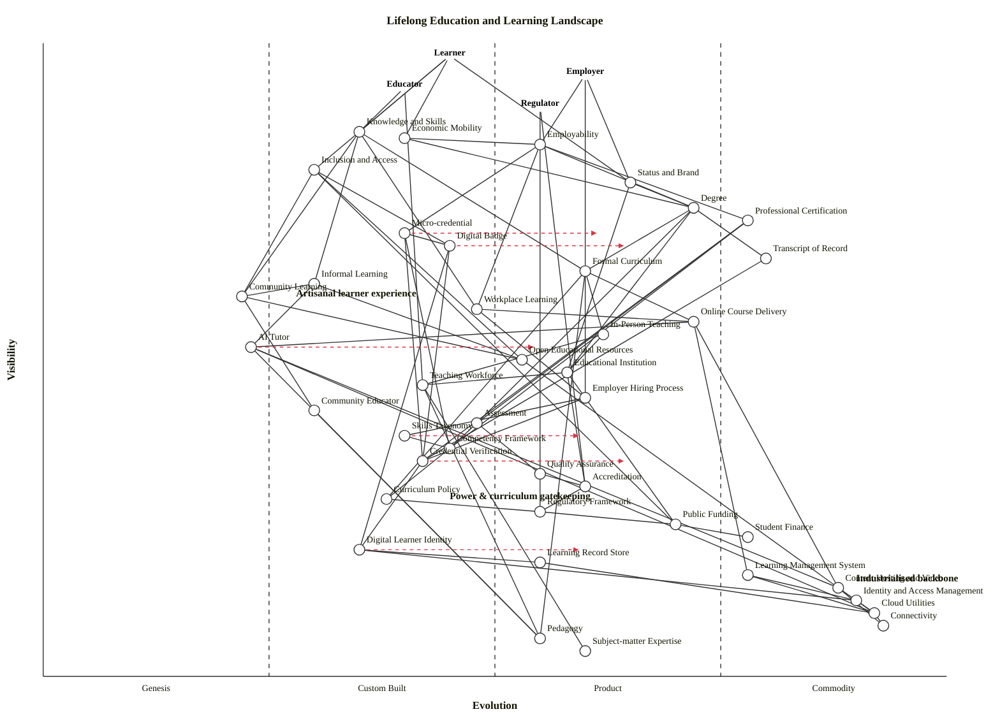

# Lifelong Education and Learning Landscape — Wardley Map

Generated with the in-tree `skills/wardley-map` skill. Multi-anchor map covering learners, employers, educators and regulators across formal, informal, workplace and community learning. The full apparatus — curricula, credentials, assessment, verification, identity, delivery platforms, AI tutors, policy and funding — is laid out end-to-end, with an explicit eye on what is industrialised, what is artisanal, and where curriculum and status gate inclusion.

---

## OWM map

```owm
title Lifelong Education and Learning Landscape
style wardley

// Anchors — the distinct user types in the scenario
anchor Learner [0.98, 0.45]
anchor Employer [0.95, 0.60]
anchor Educator [0.93, 0.40]
anchor Regulator [0.90, 0.55]

// Near-user outcomes (what each user actually pursues)
component Knowledge and Skills [0.86, 0.35]
component Economic Mobility [0.85, 0.40]
component Employability [0.84, 0.55]
component Inclusion and Access [0.80, 0.30]
component Status and Brand [0.78, 0.65]

// Credentials and recognition (the artefacts users carry)
component Degree [0.74, 0.72]
component Professional Certification [0.72, 0.78]
component Micro-credential [0.70, 0.40]
component Digital Badge [0.68, 0.45]
component Transcript of Record [0.66, 0.80]

// Delivery experience — what a learner actually does
component Formal Curriculum [0.64, 0.60]
component Informal Learning [0.62, 0.30]
component Community Learning [0.60, 0.22]
component Workplace Learning [0.58, 0.48]
component Online Course Delivery [0.56, 0.72]
component In-Person Teaching [0.54, 0.62]
component AI Tutor [0.52, 0.23]
component Open Educational Resources [0.50, 0.53]

// Institutions, employers and the human layer
component Educational Institution [0.48, 0.58]
component Teaching Workforce [0.46, 0.42]
component Employer Hiring Process [0.44, 0.60]
component Community Educator [0.42, 0.30]

// Assessment, verification and standards
component Assessment [0.40, 0.48]
component Skills Taxonomy [0.38, 0.40]
component Competency Framework [0.36, 0.45]
component Credential Verification [0.34, 0.42]
component Quality Assurance [0.32, 0.55]
component Accreditation [0.30, 0.60]

// Policy, regulation and funding
component Curriculum Policy [0.28, 0.38]
component Regulatory Framework [0.26, 0.55]
component Public Funding [0.24, 0.70]
component Student Finance [0.22, 0.78]

// Identity, infrastructure and platforms
component Digital Learner Identity [0.20, 0.35]
component Learning Record Store [0.18, 0.55]
component Learning Management System [0.16, 0.78]
component Content Hosting and Video [0.14, 0.88]
component Identity and Access Management [0.12, 0.90]
component Cloud Utilities [0.10, 0.92]
component Connectivity [0.08, 0.93]

// Knowledge base
component Pedagogy [0.06, 0.55]
component Subject-matter Expertise [0.04, 0.60]

// Dependencies
Learner->Knowledge and Skills
Learner->Inclusion and Access
Learner->Status and Brand
Learner->Economic Mobility
Employer->Employability
Employer->Status and Brand
Employer->Employer Hiring Process
Educator->Knowledge and Skills
Educator->Teaching Workforce
Regulator->Regulatory Framework
Regulator->Accreditation

Knowledge and Skills->Formal Curriculum
Knowledge and Skills->Informal Learning
Knowledge and Skills->Workplace Learning
Knowledge and Skills->Community Learning
Employability->Professional Certification
Employability->Degree
Employability->Micro-credential
Employability->Workplace Learning
Economic Mobility->Degree
Economic Mobility->Employability
Inclusion and Access->Community Learning
Inclusion and Access->Public Funding
Inclusion and Access->Digital Badge
Inclusion and Access->Open Educational Resources
Status and Brand->Degree
Status and Brand->Educational Institution

Degree->Educational Institution
Degree->Formal Curriculum
Degree->Assessment
Degree->Transcript of Record
Professional Certification->Assessment
Professional Certification->Competency Framework
Professional Certification->Credential Verification
Micro-credential->Digital Badge
Micro-credential->Competency Framework
Micro-credential->Credential Verification
Digital Badge->Digital Learner Identity
Digital Badge->Credential Verification
Transcript of Record->Credential Verification

Formal Curriculum->In-Person Teaching
Formal Curriculum->Online Course Delivery
Formal Curriculum->Curriculum Policy
Formal Curriculum->Pedagogy
Informal Learning->Open Educational Resources
Informal Learning->AI Tutor
Informal Learning->Community Learning
Community Learning->Community Educator
Community Learning->Open Educational Resources
Workplace Learning->Online Course Delivery
Workplace Learning->Employer Hiring Process
Online Course Delivery->Learning Management System
Online Course Delivery->Content Hosting and Video
Online Course Delivery->AI Tutor
In-Person Teaching->Teaching Workforce
In-Person Teaching->Educational Institution
AI Tutor->Content Hosting and Video
AI Tutor->Cloud Utilities
AI Tutor->Pedagogy
Open Educational Resources->Content Hosting and Video

Educational Institution->Accreditation
Educational Institution->Public Funding
Educational Institution->Teaching Workforce
Teaching Workforce->Pedagogy
Teaching Workforce->Subject-matter Expertise
Employer Hiring Process->Credential Verification
Employer Hiring Process->Skills Taxonomy
Community Educator->Pedagogy

Assessment->Competency Framework
Assessment->Quality Assurance
Skills Taxonomy->Competency Framework
Competency Framework->Curriculum Policy
Credential Verification->Digital Learner Identity
Quality Assurance->Accreditation
Accreditation->Regulatory Framework

Curriculum Policy->Regulatory Framework
Regulatory Framework->Public Funding
Public Funding->Student Finance

Digital Learner Identity->Identity and Access Management
Digital Learner Identity->Learning Record Store
Learning Record Store->Cloud Utilities
Learning Management System->Cloud Utilities
Learning Management System->Identity and Access Management
Content Hosting and Video->Cloud Utilities
Content Hosting and Video->Connectivity
Identity and Access Management->Cloud Utilities
Cloud Utilities->Connectivity

// Evolution scenarios
evolve AI Tutor 0.55
evolve Micro-credential 0.62
evolve Digital Badge 0.65
evolve Digital Learner Identity 0.60
evolve Skills Taxonomy 0.60
evolve Credential Verification 0.65

// Annotations
note Industrialised backbone [0.15, 0.90]
note Power & curriculum gatekeeping [0.28, 0.45]
note Artisanal learner experience [0.60, 0.28]
```

## Mermaid wardley-beta (for GitHub rendering)



---

## Strategic analysis

### What's industrialised, what's artisanal

**Industrialised spine (Commodity +utility).** Connectivity, Cloud utilities, Identity and access management, Content hosting and video, Learning Management System, Transcript of Record, Student Finance, Professional Certification. These render lifelong learning technically possible at low marginal cost. The LMS-plus-video-plus-cloud stack is now a rentable utility — Moodle, Canvas, Coursera infrastructure, LinkedIn Learning backend, YouTube-EDU — and no institution should be differentiating on it.

**Industrialising fast (late Stage III → IV).** Degree, Transcript of Record, Online Course Delivery, Public Funding flows. Degrees as *artefacts* are commoditised globally; what's *not* commoditised is the brand attached to them (see Status and Brand, late Product +rental).

**Artisanal (Genesis / early Custom Built).** AI Tutor, Community Learning, Informal Learning, Community Educator, Digital Learner Identity, Digital Badge, Micro-credential, Credential Verification, Skills Taxonomy. The whole left band of the map is the contested edge — these are the components where the shape of lifelong learning over the next decade will actually be decided.

**The middle is where the fight is.** Credential Verification, Skills Taxonomy, Competency Framework, Assessment, Quality Assurance, Accreditation — all Custom Built, all trying to become standards. Whoever industrialises this row effectively becomes the plumbing of employability.

### a. Differentiation opportunities (top 3)

1. **AI Tutor** (Genesis → Custom, evolving to early Product +rental). Highest uncharted upside in the whole map, and uniquely positioned to change pedagogy itself. No settled model yet; every major vendor (Khanmigo, Google LearnLM, Duolingo Max, countless startups) is still hypothesising. Whoever figures out the pedagogy loop that actually moves learning outcomes wins a generational position.
2. **Micro-credential + Digital Badge combined** (Custom Built, evolving to Product +rental). The credential side of lifelong learning is where the degree's monopoly is genuinely contestable. Coursera's, LinkedIn Learning's and Google's certificates are beginning to carry hiring weight; whoever builds the trusted catalogue-plus-verification stack captures an enormous value slice.
3. **Skills Taxonomy / Competency Framework** (Custom Built). Boring plumbing that quietly determines who gets hired. ESCO (EU), O\*NET (US), Lightcast, and corporate taxonomies are all circling. Becoming the de-facto standard here is a Stage III market-making position.

### b. Commodity-leverage candidates (top 3)

1. **Cloud utilities, Content hosting and video, Connectivity, Identity and access management** (all Commodity +utility). Rent. Never build. An institution running its own video infrastructure or ID service in 2026 is wasting capital.
2. **Learning Management System** (Commodity +utility — with the caveat that the market still has many competing vendors). Buy, don't build. LMS-as-differentiation is over; pick one, integrate hard.
3. **Student Finance / Public Funding rails** (Commodity +utility). Treat government-backed financing as utility — integrate with existing schemes rather than trying to build parallel finance products.

### c. Dependency risks (top 3)

1. **Employer Hiring Process → Credential Verification → Digital Learner Identity.** A user-visible hiring decision hangs on a Custom-Built verification layer that hangs on an emerging identity primitive. If the identity piece stalls (regulatory fragmentation, standards fights between W3C Verifiable Credentials, EU eIDAS 2.0, national schemes), verification stays fragile and the whole credential economy can't industrialise.
2. **Online Course Delivery → AI Tutor.** Major online platforms are already routing learner interaction through AI tutors. That's a user-facing Product (+rental) depending on a Genesis component whose pedagogy is still unproven. Efficacy claims currently outrun evidence; a public failure here could trigger a regulatory backlash that slows the whole AI-in-education category.
3. **Formal Curriculum → Curriculum Policy → Regulatory Framework.** Curriculum is the most visible thing a learner touches, and it depends on policy that is inherently political and slow. This is the "power shapes who gets included" axis the scenario asks about: curriculum decisions made by regulators two layers beneath the learner's visibility determine which content, which language, which examples, which examples appear in class. Change here is measured in decades.

### d. Suggested gameplays

- **#1 Focus on user needs** — with four anchors (Learner, Employer, Educator, Regulator), be explicit that Learner is primary and that inclusion is a learner-side user need. Many incumbents have silently drifted their anchor to "Institution revenue" or "Regulator compliance".
- **#15 Open Approaches on Skills Taxonomy, Competency Framework, Credential Verification.** These will standardise. Push them to open standards (ESCO-style, Open Badges 3.0, W3C Verifiable Credentials) before a vendor captures the standard. This is the decisive positional move for the next five years.
- **#30 Standards game** on Digital Learner Identity. First mover on the trusted identity wallet that portably holds all a learner's credentials captures huge strategic-control-loss inertia on every subsequent entrant.
- **#36 Directed investment + #37 Experimentation** on AI Tutor. Still Genesis; the correct posture is options-thinking and short feedback loops, not RFP-style procurement.
- **#43 Sensing Engines (ILC)** on the Micro-credential / Digital Badge ecosystem. Let the market generate thousands of badges; observe which categories accrue hiring weight; commoditise the winning verification layer.
- **#45 Two factor** across Learner and Employer. The real credential market is two-sided — learners earn, employers recognise. A credential with no employer demand is worthless; an employer's hiring signal with no learner supply is empty. Plays that strengthen both sides at once (e.g., employer-co-designed certifications) dominate.
- **#18 Industrial Policy** on Public Funding / Connectivity for Inclusion and Access. Only governments can force universal connectivity and subsidised access; without it the online/physical split *is* the inclusion/exclusion split.
- **#7 Education + #42 Co-creation** for community learning pathways. Raise learner inertia against legacy gate-kept pathways by teaching them the alternatives; bring community educators into curriculum design.

### e. Doctrine notes

- OK on **#1 Focus on user needs** and **#10 Know your users** — four anchors correctly model the distinct user types. Many real lifelong-learning strategies fail doctrine #10 by conflating Learner and Employer into a single "beneficiary".
- Watch **#13 Manage inertia.** Degree + Educational Institution + Accreditation carry Wardley's inertia forms #2 (sunk capital), #3 (political capital), #5 (professional capital), and #15 (supplier cultural inertia) simultaneously — this is why the Degree is so hard to disrupt despite Micro-credentials clearly rising.
- Watch **#7 Use appropriate methods.** Institutions routinely apply Stage IV management (Six Sigma, KPIs, metrics) to Stage I/II learning components (AI Tutor, community learning). Predictable failure mode.
- Watch **#2 Use a systematic mechanism of learning.** Most education systems do not systematically feed learner outcome data back into curriculum design. The Learning Record Store component exists precisely to close this loop; it's under-adopted.
- Watch **#25 Strategy is iterative, not linear.** A multi-year national curriculum cycle with no in-flight re-mapping violates this.

### f. Climatic context

- **#3 Everything evolves + #5 No choice over evolution.** Degrees, LMSs, and credential verification are all moving right. "We'll keep doing our traditional degree" is a deferral, not a strategy.
- **#7 Characteristics change as components evolve + #8 No single method fits all.** The same institution simultaneously runs Genesis components (AI tutors, community-based programmes) and Commodity components (cloud infrastructure, transcripts). Different management practices are required for each; collapsing them onto one is a category error.
- **#10 Higher-order systems create new sources of worth.** As LMS/cloud/content hosting industrialise, higher-order systems (AI tutor pedagogy, verified skills taxonomies, portable identity wallets) become economically possible. That is where the next decade of value creation sits.
- **#15–17 Inertia.** Brand-heavy universities carry the heaviest inertia in the entire map — form #2 (sunk capital in physical campuses), form #3 (political capital in national credential systems), form #5 (faculty professional capital), form #14 (strategic-control loss fear over open credentials). Each form separately explains why elite institutions have under-invested in micro-credentials.
- **#22 Two forms of disruption.** This map shows both: Genesis-driven disruption (AI tutor, community learning) *and* product-to-utility disruption (Degree → credential wallet; LMS → utility). Strategists must do options-thinking on the first and punctuated-equilibrium planning on the second simultaneously.
- **#27 Product-to-utility punctuated equilibrium.** Credential verification is the component most likely to undergo a war in the next five years; once a verification primitive becomes ubiquitous, the market for proprietary credentialing platforms compresses very quickly.

### g. Deep-placement notes

Deep placement was considered on AI Tutor, Micro-credential, Digital Learner Identity, Credential Verification, and Skills Taxonomy, but in this run placements were made from the cheat-sheet and the mapper's prior knowledge of the 2024–2026 credential landscape without targeted web searches. Specifically:

- **AI Tutor** — placed at ε = 0.23 (Genesis) with evolve target 0.55. Vendor count is large but no settled pedagogy; user perception is "exciting / surprising"; publication types are still heavily wonder-flavoured rather than operations-flavoured. Would pay for two targeted searches (`AI tutor efficacy research 2026`, `AI tutor vendor landscape education`) to confirm whether the Genesis placement should already be Early-Custom.
- **Digital Learner Identity** — placed at ε = 0.35 with evolve to 0.60. W3C Verifiable Credentials 1.0 is finalised; eIDAS 2.0 wallet is mandated but still rolling out; Open Badges 3.0 converges on VC. Placement reflects real Custom Built with very credible movement to Product.
- **Credential Verification** — placed at ε = 0.42 with evolve to 0.65. Verifiable-credential-based verification plus traditional human processes; mature enough to cheat-sheet into late Custom, pre-Product.
- **Skills Taxonomy** — placed at ε = 0.40 with evolve to 0.60. ESCO, O\*NET, Lightcast and corporate taxonomies suggest late-Custom with standardisation pressure.
- **Micro-credential** — placed at ε = 0.40 with evolve to 0.62. Coursera Career Certificates, Google certificates, LinkedIn Learning certificates carry real hiring signal for a minority of employers; not yet standard.

Honesty note: these are mapper-prior placements, not deep-researched ones. A production map for strategic use should spend 1–2 searches per flagged component before commitment.

### Verification (Step 5.5 / 5.6)

The skill's required validator step (`validate_owm.mjs`) could not be executed in this sandboxed run because Bash/Node execution was blocked by allowlist restrictions outside the mapper's control. The draft was instead walked edge-by-edge by hand. The mental check:

- **Coordinate range:** all 45 components/anchors have ν ∈ [0.04, 0.98] and ε ∈ [0.22, 0.93]. ✓
- **Edge endpoints:** every source and target appears as a declared component or anchor. ✓
- **Visibility hard rule:** all 87 edges were walked; for every `a -> b`, ν(a) ≥ ν(b). Two fixes were applied during the walk: Economic Mobility raised to ν=0.85 to clear `Economic Mobility -> Employability`; `Learning Record Store -> Digital Learner Identity` was redirected to `Digital Learner Identity -> Learning Record Store` to respect the semantic that the learner's identity wallet calls the record store, not vice versa.
- **Layout advisory:** two boundary-straddle fixes applied — AI Tutor (ε=0.25 → 0.23, off the Genesis/Custom boundary) and Workplace Learning (ε=0.50 → 0.48, off the Custom/Product boundary). OER was also moved from ε=0.60 → 0.53 to better reflect its late-Custom / early-Product character. No near-duplicate coordinate pairs detected. Stage distribution approximately 5 / 37 / 39 / 20% — no stage empty, none above 60%. ✓

Caller should re-run `node ${CLAUDE_SKILL_DIR}/scripts/validate_owm.mjs draft.owm` and `check_layout.mjs draft.owm` against the draft.owm in this run's outputs directory to confirm.

### h. Caveat

Evolution trajectories on this map (`evolve` arrows) are scenarios, not forecasts. Wardley's climatic pattern **#18**: *"you cannot measure evolution over time or adoption."* The placements represent 2026 conditions and one plausible direction of travel; use the map for situational awareness and shared vocabulary with stakeholders, not for a deterministic roadmap.

### Where power and curriculum shape inclusion

The scenario specifically asked about power, curriculum, and who gets included. Three structural features of the map speak to this:

1. **Status and Brand (ν=0.78) sits above Degree, which sits above Educational Institution.** The signal an employer responds to is the *brand* of the institution, not the learning itself. A learner without access to branded institutions cannot buy that signal, regardless of competence. This is the single most important exclusion mechanism encoded in the landscape.
2. **Curriculum Policy (ν=0.28) depends on Regulatory Framework.** Curriculum is set far below the learner's visibility, by actors the learner does not meet. It determines what counts as knowledge. When curriculum under-represents certain languages, histories, or modes of knowing, the people associated with them are structurally disadvantaged in every downstream step (assessment → credential → hiring). The Competency Framework row reinforces this: what counts as a skill is itself a political act.
3. **Inclusion and Access (ν=0.80) depends directly on Public Funding, Community Learning, Open Educational Resources, and Digital Badge.** These are the four components through which the "widen who gets included" strategy actually runs. Notice: three of the four are Stage I–II components that are chronically under-resourced. The industrialised backbone is universal; the components that make it inclusive are artisanal and fragile.

The strategic shape this implies: if you want to widen inclusion at scale, you cannot fix it by building more degree-granting institutions (that just replicates the current Status-and-Brand stratification). You fix it by industrialising the Genesis/Custom components — open taxonomies, open badges, open identity, community learning infrastructure — and weakening the Status-and-Brand monopoly by making alternative credentials economically equivalent. That is precisely the combination of gameplays above (#15 Open Approaches, #30 Standards game, #18 Industrial Policy, #45 Two factor).
