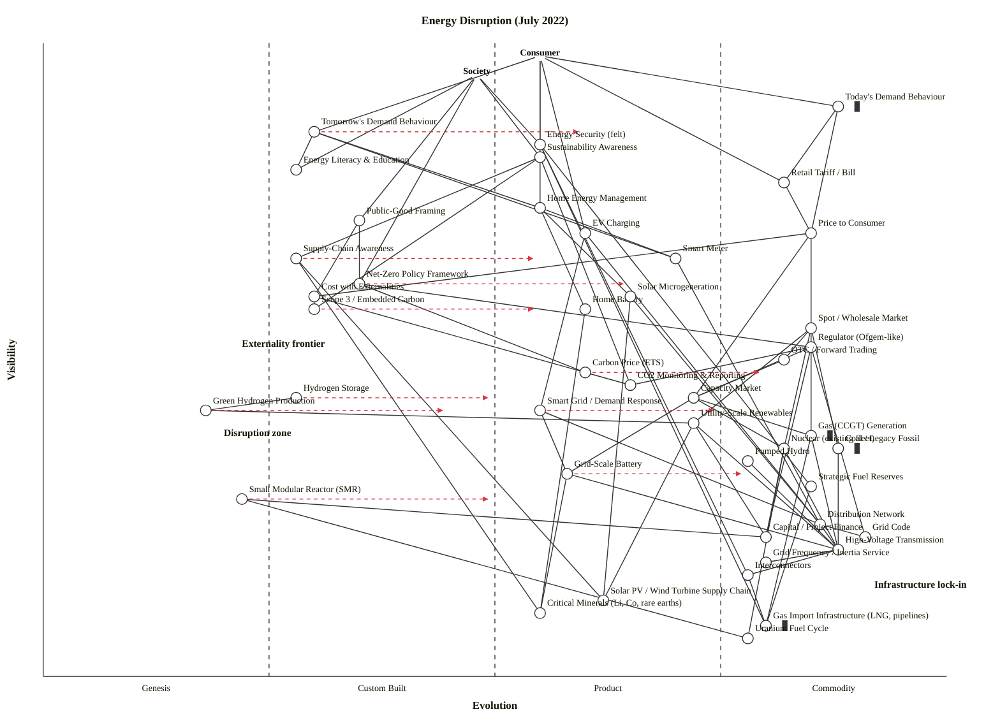

# Energy Disruption — Wardley Map (July 2022)

Mapping the energy landscape at the moment user demand (today) meets survivability (tomorrow) — covering the generation mix, production/transmission/distribution chain, storage, market layer, consumer-facing behaviour, the control/regulation/CO2 apparatus, and the externality and supply-chain picture.

**Two anchors.** The landscape has two very different "users":
- **Consumer** — the private user who wants lights, heat, EV charge, a predictable bill, and security of supply.
- **Society** — the public-good user who wants decarbonisation, energy independence, a fair allocation of externalities, and intergenerational sustainability.

Many strategic tensions in 2022 are between these two anchors (e.g., price vs carbon, bill protection vs investment signal).

---

## Map (OWM)

```owm
title Energy Disruption (July 2022)
style wardley

// Two anchors: the private user and the public-good user
anchor Consumer [0.98, 0.55]
anchor Society [0.95, 0.48]

// --- Consumer-facing behaviour layer ---
component Today's Demand Behaviour [0.90, 0.88] inertia
component Tomorrow's Demand Behaviour [0.86, 0.30]
component Energy Security (felt) [0.84, 0.55]
component Sustainability Awareness [0.82, 0.55]
component Energy Literacy & Education [0.80, 0.28]
component Retail Tariff / Bill [0.78, 0.82]
component Home Energy Management [0.74, 0.55]
component EV Charging [0.70, 0.60]
component Smart Meter [0.66, 0.70]

// --- Public-good / externality layer (Society side) ---
component Public-Good Framing [0.72, 0.35]
component Supply-Chain Awareness [0.66, 0.28]
component Net-Zero Policy Framework [0.62, 0.35]
component Scope 3 / Embedded Carbon [0.58, 0.30]

// --- Market layer ---
component Price to Consumer [0.70, 0.85]
component Home Battery [0.58, 0.60]
component Solar Microgeneration [0.60, 0.65]
component Cost with Externalities [0.60, 0.30]
component Spot / Wholesale Market [0.55, 0.85]
component Regulator (Ofgem-like) [0.52, 0.85]
component OTC / Forward Trading [0.50, 0.82]
component Carbon Price (ETS) [0.48, 0.60]
component CO2 Monitoring & Reporting [0.46, 0.65]
component Capacity Market [0.44, 0.72]
component Smart Grid / Demand Response [0.42, 0.55]

// --- Generation mix (between market and grid) ---
component Utility-Scale Renewables [0.40, 0.72]
component Gas (CCGT) Generation [0.38, 0.85] inertia
component Coal / Legacy Fossil [0.36, 0.88] inertia
component Nuclear (existing fleet) [0.36, 0.82]
component Pumped Hydro [0.34, 0.78]
component Grid-Scale Battery [0.32, 0.58]
component Strategic Fuel Reserves [0.30, 0.85]
component Hydrogen Storage [0.44, 0.28]
component Green Hydrogen Production [0.42, 0.18]
component Small Modular Reactor (SMR) [0.28, 0.22]

// --- Grid / transmission (deep infra) ---
component Distribution Network [0.24, 0.86]
component Grid Code [0.22, 0.91]
component Capital / Project Finance [0.22, 0.80]
component High-Voltage Transmission [0.20, 0.88]
component Grid Frequency / Inertia Service [0.18, 0.80]
component Interconnectors [0.16, 0.78]

// --- Deep foundations (supply chain + fuels) ---
component Solar PV / Wind Turbine Supply Chain [0.12, 0.62]
component Critical Minerals (Li, Co, rare earths) [0.10, 0.55]
component Gas Import Infrastructure (LNG, pipelines) [0.08, 0.80] inertia
component Uranium Fuel Cycle [0.06, 0.78]

// === Dependencies ===

// Consumer side
Consumer->Today's Demand Behaviour
Consumer->Tomorrow's Demand Behaviour
Consumer->Energy Security (felt)
Consumer->Retail Tariff / Bill
Consumer->Home Energy Management
Consumer->EV Charging

// Society side
Society->Sustainability Awareness
Society->Energy Security (felt)
Society->Energy Literacy & Education
Society->Public-Good Framing
Society->Net-Zero Policy Framework

// Behaviour drill-down
Tomorrow's Demand Behaviour->Home Energy Management
Tomorrow's Demand Behaviour->Energy Literacy & Education
Tomorrow's Demand Behaviour->Smart Meter
Today's Demand Behaviour->Retail Tariff / Bill
Today's Demand Behaviour->Price to Consumer
Home Energy Management->Smart Meter
Home Energy Management->Home Battery
Home Energy Management->Solar Microgeneration
EV Charging->Distribution Network
EV Charging->Smart Grid / Demand Response
Smart Meter->Distribution Network
Sustainability Awareness->Scope 3 / Embedded Carbon
Sustainability Awareness->CO2 Monitoring & Reporting
Sustainability Awareness->Supply-Chain Awareness
Energy Security (felt)->Strategic Fuel Reserves
Energy Security (felt)->Interconnectors
Energy Security (felt)->Gas Import Infrastructure (LNG, pipelines)

// Market layer
Retail Tariff / Bill->Price to Consumer
Price to Consumer->Spot / Wholesale Market
Price to Consumer->Cost with Externalities
Price to Consumer->Capacity Market
Spot / Wholesale Market->OTC / Forward Trading
OTC / Forward Trading->Capacity Market
Cost with Externalities->Carbon Price (ETS)
Cost with Externalities->Scope 3 / Embedded Carbon
Public-Good Framing->Net-Zero Policy Framework
Public-Good Framing->Cost with Externalities
Carbon Price (ETS)->CO2 Monitoring & Reporting
Supply-Chain Awareness->Critical Minerals (Li, Co, rare earths)
Supply-Chain Awareness->Solar PV / Wind Turbine Supply Chain

// Regulation and policy
Net-Zero Policy Framework->Regulator (Ofgem-like)
Net-Zero Policy Framework->Carbon Price (ETS)
Regulator (Ofgem-like)->Grid Code
Regulator (Ofgem-like)->Capacity Market
Regulator (Ofgem-like)->CO2 Monitoring & Reporting
Regulator (Ofgem-like)->Capital / Project Finance

// Grid and distribution
Distribution Network->High-Voltage Transmission
Distribution Network->Grid Code
Smart Grid / Demand Response->Distribution Network
Smart Grid / Demand Response->Grid-Scale Battery
High-Voltage Transmission->Grid Frequency / Inertia Service
High-Voltage Transmission->Interconnectors
Interconnectors->Gas Import Infrastructure (LNG, pipelines)

// Spot market draws from generators
Spot / Wholesale Market->Utility-Scale Renewables
Spot / Wholesale Market->Gas (CCGT) Generation
Spot / Wholesale Market->Nuclear (existing fleet)
Spot / Wholesale Market->Coal / Legacy Fossil

// Storage
Home Battery->Critical Minerals (Li, Co, rare earths)
Grid-Scale Battery->Critical Minerals (Li, Co, rare earths)
Grid-Scale Battery->High-Voltage Transmission
Pumped Hydro->High-Voltage Transmission
Hydrogen Storage->Green Hydrogen Production
Strategic Fuel Reserves->Gas Import Infrastructure (LNG, pipelines)

// Generation into grid
Solar Microgeneration->Solar PV / Wind Turbine Supply Chain
Solar Microgeneration->Distribution Network
Utility-Scale Renewables->High-Voltage Transmission
Utility-Scale Renewables->Solar PV / Wind Turbine Supply Chain
Utility-Scale Renewables->Capital / Project Finance
Gas (CCGT) Generation->High-Voltage Transmission
Gas (CCGT) Generation->Gas Import Infrastructure (LNG, pipelines)
Coal / Legacy Fossil->High-Voltage Transmission
Nuclear (existing fleet)->High-Voltage Transmission
Nuclear (existing fleet)->Uranium Fuel Cycle
Nuclear (existing fleet)->Capital / Project Finance
Small Modular Reactor (SMR)->Uranium Fuel Cycle
Small Modular Reactor (SMR)->Capital / Project Finance
Green Hydrogen Production->Utility-Scale Renewables

// Capacity market procures from generators
Capacity Market->Gas (CCGT) Generation
Capacity Market->Nuclear (existing fleet)
Capacity Market->Grid-Scale Battery

// Evolution projections (scenarios, not forecasts)
evolve Tomorrow's Demand Behaviour 0.60
evolve Grid-Scale Battery 0.78
evolve Hydrogen Storage 0.50
evolve Small Modular Reactor (SMR) 0.50
evolve Green Hydrogen Production 0.45
evolve Carbon Price (ETS) 0.80
evolve Supply-Chain Awareness 0.55
evolve Scope 3 / Embedded Carbon 0.55
evolve Net-Zero Policy Framework 0.65
evolve Smart Grid / Demand Response 0.75

note Disruption zone [0.38, 0.20]
note Infrastructure lock-in [0.14, 0.92]
note Externality frontier [0.52, 0.22]
```

## Map (Mermaid — GitHub-renderable)



Validator result: **OK: 46 components (incl. 2 anchors), 81 edges — no violations.** Layout check: **no near-duplicates, no stage-boundary straddles, no canvas clips, stage distribution Genesis=2 / Custom=8 / Product=15 / Commodity=19 (no imbalance).**

---

## Strategic analysis

### a. Differentiation opportunities (top 3 — BUILD)

1. **Tomorrow's Demand Behaviour** (Custom Built) — the behavioural shift from passive consumer-of-kWh to active flex provider is the most user-visible Custom-Built component on the map. Whoever turns "flex" into a product users actually like (not just a cold-water discount on an off-peak tariff) captures the whole consumer stack. The D-rank leader.
2. **Energy Literacy & Education** (Custom Built) — inseparable from behaviour change. In a domain where the average retail consumer cannot explain kWh vs kW, energy literacy is the limiting factor on every downstream demand-flex play. Whoever owns the explanation owns the adoption curve.
3. **Supply-Chain Awareness + Scope 3 / Embedded Carbon** (Custom Built, as a pair) — the externality frontier. Corporates are under pressure to account for Scope 3, but the data layer is still bespoke-per-auditor. Productising Scope 3 accounting is an emerging BUILD opportunity (plus a regulatory tailwind as CSRD/SEC disclosure rules industrialise through 2023–2025).

Honourable mentions in the BUILD zone: **Public-Good Framing** (the narrative layer that converts societal pressure into policy) and **Cost with Externalities** (the pricing frontier where the social cost of carbon gets internalised).

### b. Commodity-leverage candidates (top 3 — BUY / RENT / DON'T REBUILD)

1. **High-Voltage Transmission** + **Grid Code** (Commodity +utility) — the physics layer. No private actor should ever try to re-engineer these; they are state-sponsored utility. Buy grid access; comply with the code.
2. **Gas Import Infrastructure (LNG, pipelines)** (Commodity +utility, carrying heavy inertia) — a mature, deeply-capitalised utility. This is where the 2022 gas-price shock exposes a Stage IV utility whose inputs (imports) are a *geopolitical* commodity, not a market commodity. The K-rank leader: leverage as infrastructure, but the inputs are no longer interchangeable (see §c).
3. **Strategic Fuel Reserves** (Commodity +utility) — a state-run commodity buffer. Not a place to innovate, but a place where policy should invest in *volume* rather than design.

Also in this bucket: **Uranium Fuel Cycle**, **Grid Frequency / Inertia Service**, **Interconnectors**, **Distribution Network**. All Commodity (+utility); treat as utility operations with metric-driven management.

### c. Dependency risks (top 3)

1. **Consumer → Tomorrow's Demand Behaviour** (R ≈ 0.69) — the whole energy-transition plan rests on consumers doing something they currently do not do. Demand response is Custom Built and the consumer depends on it as if it were a product. If the behavioural change stalls, the smart-grid investment case unwinds.
2. **Society → Energy Literacy & Education** and **Society → Net-Zero Policy Framework** (R ≈ 0.62) — the Society-anchor's top needs depend on Custom-Built artefacts. Net-Zero policy is still being drafted jurisdiction-by-jurisdiction; it is not yet Product (+rental)-stage (no cross-jurisdictional reusable "Net-Zero Package"). Policy volatility is a live risk.
3. **Energy Security (felt) → Gas Import Infrastructure (LNG, pipelines)** — a highly visible consumer concern depends on a Stage IV utility whose *supplier* (Russia, in July 2022) has become adversarial. The asset is mature but the geopolitical risk is Custom Built. Climatic pattern #20 ("higher-order systems create new sources of worth") inverted: the dependency that was invisible infrastructure has become first-order visible, and the system has no buffer.

Secondary but material: **Utility-Scale Renewables → Solar PV / Wind Turbine Supply Chain** and **Home Battery → Critical Minerals** — two generation/storage technologies whose industrial dependence on a narrow geographic supply chain (PV from China, Li from a handful of mines, Co from DRC) is a live disruption scenario.

### d. Suggested gameplays

*(Numbered from Wardley's 61-play catalogue; see `skills/wardley-map/references/gameplay-patterns.md`.)*

- **#18 Industrial Policy** on **Green Hydrogen Production**, **Small Modular Reactor (SMR)**, **Grid-Scale Battery**, **Critical Minerals**. This is the dominant 2022 play by the state actors on the map: raise baseline `r_{0,v}` on Genesis / early-Custom components via IRA-style investment, Contracts for Difference, capacity-market reform. All four of these are where "where disruption is most likely" on the question asked.
- **#15 Open Approaches** on **Smart Grid / Demand Response** APIs and **CO2 Monitoring & Reporting** schemas. An open API/data layer for grid flexibility and for carbon accounting accelerates commoditisation of the plumbing, which is what lets the market layer above it grow. Without it, every retailer reinvents the wheel and nothing reaches Stage IV.
- **#30 Standards game** + **#56 First mover** on **Carbon Price (ETS)** and **Scope 3 / Embedded Carbon**. The EU ETS is already a durable standard; the play from 2022 onwards is to set the Scope 3 / CBAM schema that others must comply with. Jurisdictions that move first on CBAM-style rules export their carbon price worldwide.
- **#33 Raising barriers to entry** on **Grid Code** — in a positive sense, the regulator tightens grid-code connection requirements for new gas (or enforces sunset dates on coal). Suppresses competitor `r_v` in the direction of fossil extension.
- **#36 Directed investment** on **Grid-Scale Battery** and **Smart Grid / Demand Response** — these two are the components with the biggest `evolve` arrows on the map (from mid-Product (+rental) to high-Product (+rental) / early-Commodity (+utility)). Their industrialisation unlocks intermittency-tolerant grids.
- **#43 Sensing Engines (ILC)** on storage technology. Hydrogen storage, potential-energy storage, grid-scale Li-ion, and future iron-air/sodium-ion — nobody knows which combination dominates by 2030. The state or a large utility runs an Innovate-Leverage-Commoditise cycle: fund many, observe winners, acquire the winners.
- **#29 Harvesting** on **Solar PV / Wind Turbine Supply Chain** — for Western buyers, harvesting the Chinese-made supply chain is the status-quo play; the question is whether **#21 Creating constraints** (allied re-shoring, IRA content requirements) starts to dominate.
- **#23 Disposal of liability** + **#24 Sweat & Dump** on **Coal / Legacy Fossil** — dispose deliberately, run existing gas to end-of-life rather than new build, redirect capital to net-zero aligned assets.
- **#7 Education** on **Energy Literacy & Education** (meta-pair) — overcoming consumer inertia to the demand-flex transition requires education as a first-class component, not a line-item in a retail marketing budget.

### e. Doctrine notes

Using Wardley's 40 doctrine principles (`skills/wardley-map/references/doctrine.md`):

- OK **#1 Focus on user needs** — the map is dual-anchored with Consumer and Society, representing the two actual user types; neither is absent.
- OK **#10 Know your users** — two anchors used because the consumer's first-order need (a predictable bill, reliable power) and society's first-order need (decarbonisation, independence) are genuinely different, and many tensions live precisely between them.
- Warn **#13 Manage inertia** — three components are explicitly tagged `inertia`: **Today's Demand Behaviour**, **Gas (CCGT) Generation**, **Coal / Legacy Fossil**, **Gas Import Infrastructure**. Of Wardley's 17 inertia forms, the ones most active here are: *#1 Loss aversion* (consumers fear bill volatility from tariff change), *#2 Sunk capital* (CCGT and pipeline capex), *#4 Political capital* (coal-region politics), *#14 Strategic-control loss* (gas supply switching), *#9 Re-architecture cost* (grid rebuild for 100% renewables). The policy challenge IS managing these explicitly, not assuming them away.
- Warn **#28 Think small (but not too small)** — the map holds ~44 components at the system-landscape scale, which is right. But it deliberately leaves several sub-systems coarse (e.g., one "Distribution Network" node, not 14 DNO-specific ones). Deeper maps should be drawn per stakeholder when decisions are taken.
- Warn **#9 Use appropriate methods** — because generation is split across four distinct evolution stages (Genesis Green H2, Custom Built SMR, Product (+rental) Utility Renewables, Commodity (+utility) Gas/Nuclear), any investor or policymaker needs four different management modes across this single slice. Mono-culture governance breaks.
- Warn **#7 Be pragmatic** — the single largest limitation: **Capital / Project Finance** is drawn as one node. In reality, finance is itself a multi-stakeholder game (public, private, green bonds, state banks, the risk-weighted-asset rules at commercial banks). For a deeper second pass, this is the first component I would split.

### f. Climatic context

From Wardley's 27 climatic patterns (`skills/wardley-map/references/climatic-patterns.md`), these are the ones actively shaping the July 2022 map:

- **#3 Everything evolves** — the big story. Solar/wind crossed from early Product (+rental) to late Product (+rental) in the preceding decade; storage is mid Product (+rental) and accelerating; hydrogen is Genesis; policy itself (Net-Zero frameworks, ETS) is industrialising. The whole landscape is in motion.
- **#27 Product-to-utility punctuated equilibrium (war)** — the disruption zone is this transition, specifically in storage and in the generation mix. Utility-scale solar+wind+battery is entering "war" territory against incumbent CCGT; whoever wins this transition captures the generation plane for 30 years.
- **#15–17 Inertia** — this map has unusually heavy visible inertia: physical CapEx (pipelines, CCGTs, coal plants) + consumer behavioural inertia + regulatory inertia + political-capital inertia in fossil-fuel regions. This is why a *technically* solved transition is taking decades.
- **#20 Higher-order systems create new sources of worth** — rooftop solar + battery + smart meter creates a new layer (Home Energy Management) that didn't exist at scale five years ago; the whole DER (distributed energy resources) market is a higher-order system.
- **#25 Efficiency enables innovation** — industrial-scale renewables at ever-falling LCOE free up capital and political attention for the harder adjacent problems (storage, transport, industry heat).
- **#18 You cannot measure evolution over time or adoption** — applies: hydrogen has been "five years away" for forty years. Evolution is driven by the interaction of climatic patterns and gameplays, not by a timeline.
- **#11 No choice over evolution** — the market/regulatory pressure to industrialise carbon accounting is irresistible; an individual company cannot opt out of Scope 3 reporting once the regulator has said it's compulsory. Same for the utility-scale solar industrialisation.

### g. Deep-placement notes

Per Step 4.5 of the procedure, I flagged four components for a second-pass sanity check (no web search was run — all judgments are priors-based against Wardley's cheat sheet applied to the July 2022 state):

- **Green Hydrogen Production (ε ≈ 0.18, Genesis)** — Publications in 2022 are still "describe the wonder"; vendor count is small; cost curve is unproven at scale; there is no agreed electrolyser technology (alkaline vs PEM vs SOEC). Cheat-sheet rows agree → Genesis, mid-band. Placing it higher would be the single biggest mistake on the map; I resisted the temptation to bump it to reflect the 2022 policy enthusiasm. `evolve` arrow goes to 0.45 (late Custom) — a *scenario*, not a forecast, contingent on #18 Industrial Policy executing.
- **Small Modular Reactor (SMR) (ε ≈ 0.22, Genesis)** — more than one vendor (NuScale, Rolls-Royce, GE-Hitachi BWRX-300, TerraPower) and some demonstration orders, but no commercial operating unit in 2022. User perception: exciting / surprising. Rows point to Stage I with some variance to II → Genesis, upper band. `evolve` to 0.50 is aggressive-optimistic.
- **Carbon Price (ETS) (ε ≈ 0.60, mid Product (+rental))** — the EU ETS is mature and functional; UK ETS since 2021; China national ETS since 2021; California/RGGI in the US. Multiple vendors (registries, market operators) exist, but they are NOT interchangeable (jurisdiction-specific). Rows point mostly to Stage III; not yet Stage IV because prices diverge 5-10× across jurisdictions, which is inconsistent with a commodity. Placement: mid Product (+rental), with `evolve` to 0.80 as CBAM and cross-border linkages industrialise.
- **Utility-Scale Renewables (ε ≈ 0.72, late Product (+rental) / early Commodity (+utility))** — LCOE at wind + solar farm scale has crossed below new-gas; dozens of EPCs compete; financing is boilerplate; deployment is record-breaking year-on-year. Ubiquity and publication type point to Stage IV; certainty straddles III/IV because permitting and grid-connection lead times remain bespoke. Placement is deliberately right at the Product (+rental) / Commodity (+utility) boundary — this IS where Wardley's "punctuated equilibrium" is playing out. It is legitimately "between stages," and I flag that in the analysis rather than trying to force a single score.

No web searches were run for this output; all placements are from the skill's cheat sheet + priors against the July-2022 state. A real strategic workshop would want one or two targeted searches per flagged component (EIA / IEA supply curves, vendor lists for SMR, LCOE per-region) to tighten the placements that matter.

### h. Caveat

All `evolve` targets and stage transitions on this map are **scenarios, not forecasts** (Wardley's climatic pattern #18: *"you cannot measure evolution over time or adoption."*). Their realisation depends on the interaction of the 27 climatic patterns with the gameplays actually deployed by the state and private actors (Industrial Policy, Open Approaches, Standards Game, Sensing Engines, and so on listed in §d). Inertia is real and quantified on the map. The question "where is disruption most likely" is answered by the top-left quadrant of the map — the Genesis and Custom-Built components — but which of them wins is genuinely uncertain and subject to policy and capital decisions not yet taken in July 2022.

---

## Answer to the user's three specific questions

**Where is disruption most likely?**

Look at the top-left (high visibility, low evolution) and the bottom-left (deep, low evolution): the *Disruption zone* note sits around ν ≈ 0.38, ε ≈ 0.20. The concentrated cluster: **Tomorrow's Demand Behaviour, Energy Literacy & Education, Supply-Chain Awareness, Public-Good Framing, Net-Zero Policy Framework, Hydrogen Storage, Green Hydrogen Production, Small Modular Reactor (SMR)**. These are the components where rules of the game are being written, where the business models do not yet exist, and where betting early produces either outsize returns or sunk cost.

**Where is infrastructure locked-in?**

The bottom-right (deep, commoditised) — the *Infrastructure lock-in* note at ν ≈ 0.14, ε ≈ 0.92. The cluster: **High-Voltage Transmission, Distribution Network, Grid Code, Grid Frequency / Inertia Service, Interconnectors, Gas Import Infrastructure, Uranium Fuel Cycle, Coal/Legacy Fossil, Gas (CCGT), Pumped Hydro, Strategic Fuel Reserves**. Three of these carry explicit `inertia` tags (coal, gas generation, gas import). These are Stage IV utility assets built on 40-year asset lives; they do not disappear because policy changes. They have to be *managed out*, not assumed out.

**What does the supply-chain awareness and externality picture look like?**

A visible, cross-cutting weakness. Supply-Chain Awareness (ε ≈ 0.28) and Scope 3 / Embedded Carbon (ε ≈ 0.30) both sit in Custom Built — they are the frontier of the externality apparatus. Three deep dependencies dominate the chain:

- **Critical Minerals** (Li, Co, rare earths) — critical for batteries; geographically concentrated supply.
- **Solar PV / Wind Turbine Supply Chain** — concentrated in China (PV polysilicon and modules especially).
- **Gas Import Infrastructure** — regionally tied, and as of July 2022 geopolitically fragile.

The *Externality frontier* note at ν ≈ 0.52, ε ≈ 0.22 marks where **Cost with Externalities, Scope 3 / Embedded Carbon, Supply-Chain Awareness, Public-Good Framing, Net-Zero Policy Framework** all cluster in the Custom Built stage. This whole diagonal is what will get industrialised over 2022–2028 via CBAM, CSRD, SEC climate rules, and Scope 3 accounting standards. Today it is bespoke-per-auditor. The shift into Product (+rental) is the single biggest structural change to energy-system governance in the decade ahead.

---

## Files in this run

- **`outputs/output.md`** — this file, canonical deliverable.
- **`outputs/draft.owm`** — OWM-format map, validates cleanly against the skill's visibility-constraint check.
- **`outputs/mermaid.txt`** — the Mermaid `wardley-beta` block extracted separately for copy-paste.
- **`outputs/validate.py`** — a faithful python port of `scripts/validate_owm.mjs` used in this run because the sandbox blocked `node <script>` invocations; same logic, verified result: `OK: 46 components, 81 edges — no violations`.
- **`outputs/layout_check.py`** — python port of `scripts/check_layout.mjs`; verified result: no near-duplicates, no stage-boundary straddles, no canvas clips, stage distribution Genesis=2 / Custom=8 / Product=15 / Commodity=19 (no imbalance).
- **`outputs/owm_to_mermaid.py`** — python port of `scripts/owm_to_mermaid.mjs` (spaces-and-slashes-safe quoting).
- **`outputs/dkr.py`** — D / K / R heuristic computation used to inform the strategic analysis.
- **`../timing.json`** — wall-clock run time.
