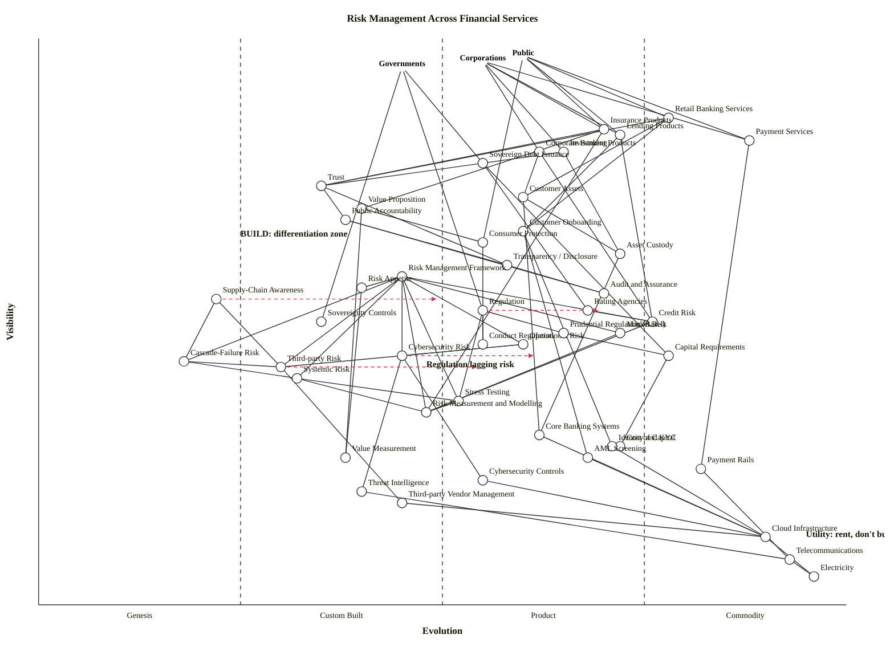

# Risk Management Across Financial Services — Wardley Map

A multi-stakeholder map of risk management in financial services. Three user anchors (Public, Corporations, Governments) pull on providers (retail banking, insurance, lending, investment, corporate banking, sovereign debt) through a trust-and-assets layer; a risk management function sits mid-chain with named risk types (credit, market, operational, cybersecurity, third-party, cascade-failure, systemic); regulation and rating agencies shape behaviour; the accountability chain (public accountability → transparency → audit) runs back to society; deep infrastructure (core banking, KYC, AML, payment rails, cybersecurity controls) grounds on commodity utilities.

---

## The map (OWM)

```owm
title Risk Management Across Financial Services
style wardley

// Anchors — the three demand sources
anchor Public [0.97, 0.60]
anchor Corporations [0.96, 0.55]
anchor Governments [0.95, 0.45]

// ---------- Financial Products and Services (user-facing demand) ----------
component Retail Banking Services [0.86, 0.78]
component Insurance Products [0.84, 0.70]
component Lending Products [0.83, 0.72]
component Investment Products [0.80, 0.65]
component Payment Services [0.82, 0.88]
component Corporate Banking [0.80, 0.62]
component Sovereign Debt Issuance [0.78, 0.55]

// ---------- Trust and Assets (the emotional and financial connector) ----------
component Trust [0.74, 0.35]
component Customer Assets [0.72, 0.60]
component Value Proposition [0.70, 0.40]
component Customer Onboarding [0.66, 0.60]
component Asset Custody [0.62, 0.72]

// ---------- Accountability Chain (back to society) ----------
component Public Accountability [0.68, 0.38]
component Consumer Protection [0.64, 0.55]
component Transparency / Disclosure [0.60, 0.58]
component Audit and Assurance [0.55, 0.70]

// ---------- Risk Management Function ----------
component Risk Management Framework [0.58, 0.45]
component Risk Appetite [0.56, 0.40]
component Supply-Chain Awareness [0.54, 0.22]

// ---------- Risk Types (the categories of risk being managed) ----------
component Credit Risk [0.50, 0.76]
component Market Risk [0.48, 0.72]
component Operational Risk [0.46, 0.60]
component Cybersecurity Risk [0.44, 0.45]
component Third-party Risk [0.42, 0.30]
component Cascade-Failure Risk [0.43, 0.18]
component Systemic Risk [0.40, 0.32]

// ---------- Methods and Models ----------
component Stress Testing [0.36, 0.52]
component Risk Measurement and Modelling [0.34, 0.48]

// ---------- Regulation and Oversight ----------
component Regulation [0.52, 0.55]
component Prudential Regulation (Basel) [0.48, 0.65]
component Conduct Regulation [0.46, 0.55]
component Capital Requirements [0.44, 0.78]
component Rating Agencies [0.52, 0.68]
component Sovereignty Controls [0.50, 0.35]

// ---------- Cost and Value (evolution-axis focus) ----------
component Cost of Capital [0.28, 0.72]
component Value Measurement [0.26, 0.38]

// ---------- Supporting Infrastructure and Practices ----------
component Core Banking Systems [0.30, 0.62]
component Identity and KYC [0.28, 0.71]
component AML Screening [0.26, 0.68]
component Payment Rails [0.24, 0.82]
component Cybersecurity Controls [0.22, 0.55]
component Threat Intelligence [0.20, 0.40]
component Third-party Vendor Management [0.18, 0.45]

// ---------- Commodity and utility foundations ----------
component Cloud Infrastructure [0.12, 0.90]
component Telecommunications [0.08, 0.93]
component Electricity [0.05, 0.96]

// ---------- Dependencies ----------
// Demand anchors to products
Public->Retail Banking Services
Public->Insurance Products
Public->Lending Products
Public->Payment Services
Public->Consumer Protection
Corporations->Corporate Banking
Corporations->Insurance Products
Corporations->Lending Products
Corporations->Investment Products
Corporations->Payment Services
Governments->Sovereign Debt Issuance
Governments->Regulation
Governments->Sovereignty Controls

// Products depend on trust and assets
Retail Banking Services->Trust
Retail Banking Services->Customer Assets
Retail Banking Services->Customer Onboarding
Insurance Products->Trust
Insurance Products->Value Proposition
Insurance Products->Risk Measurement and Modelling
Lending Products->Credit Risk
Lending Products->Customer Onboarding
Investment Products->Asset Custody
Investment Products->Trust
Corporate Banking->Credit Risk
Corporate Banking->Customer Assets
Sovereign Debt Issuance->Rating Agencies
Sovereign Debt Issuance->Capital Requirements
Payment Services->Payment Rails

// Trust-and-assets layer
Trust->Public Accountability
Trust->Transparency / Disclosure
Customer Assets->Asset Custody
Customer Assets->Core Banking Systems
Value Proposition->Consumer Protection
Value Proposition->Value Measurement
Customer Onboarding->Identity and KYC
Customer Onboarding->AML Screening
Asset Custody->Core Banking Systems

// Accountability chain back to society
Public Accountability->Audit and Assurance
Public Accountability->Transparency / Disclosure
Consumer Protection->Conduct Regulation
Transparency / Disclosure->Audit and Assurance

// Risk management function
Risk Management Framework->Risk Appetite
Risk Management Framework->Credit Risk
Risk Management Framework->Market Risk
Risk Management Framework->Operational Risk
Risk Management Framework->Cybersecurity Risk
Risk Management Framework->Third-party Risk
Risk Management Framework->Cascade-Failure Risk
Risk Management Framework->Systemic Risk
Risk Management Framework->Risk Measurement and Modelling
Risk Management Framework->Stress Testing
Risk Appetite->Value Measurement
Supply-Chain Awareness->Third-party Risk
Supply-Chain Awareness->Cascade-Failure Risk

// Risk types depend on methods and controls
Credit Risk->Risk Measurement and Modelling
Market Risk->Risk Measurement and Modelling
Operational Risk->Cybersecurity Risk
Operational Risk->Third-party Risk
Cybersecurity Risk->Cybersecurity Controls
Cybersecurity Risk->Threat Intelligence
Cascade-Failure Risk->Third-party Risk
Cascade-Failure Risk->Systemic Risk
Third-party Risk->Third-party Vendor Management
Systemic Risk->Stress Testing
Systemic Risk->Risk Measurement and Modelling

// Methods depend on models
Stress Testing->Risk Measurement and Modelling

// Regulation pathways
Regulation->Prudential Regulation (Basel)
Regulation->Conduct Regulation
Regulation->Stress Testing
Prudential Regulation (Basel)->Capital Requirements
Capital Requirements->Cost of Capital
Rating Agencies->Credit Risk

// Core operations to infrastructure
Core Banking Systems->Cloud Infrastructure
Identity and KYC->Cloud Infrastructure
AML Screening->Cloud Infrastructure
Payment Rails->Telecommunications
Cybersecurity Controls->Cloud Infrastructure
Threat Intelligence->Telecommunications
Third-party Vendor Management->Cloud Infrastructure
Cloud Infrastructure->Electricity
Telecommunications->Electricity

// Evolution arrows (scenarios, not forecasts)
evolve Supply-Chain Awareness 0.50
evolve Cybersecurity Risk 0.62
evolve Third-party Risk 0.55
evolve Regulation 0.70

// Notes
note BUILD: differentiation zone [0.65, 0.25]
note Regulation lagging risk [0.42, 0.48]
note Utility: rent, don't build [0.12, 0.95]
```

### Mermaid rendering (for GitHub)



---

## Strategic analysis

The scenario asked in particular about where **cost, value, trust, and supply-chain awareness** sit on the evolution axis, and where **regulation is lagging the risk it is meant to cover**. The map placements answer this:

| Concept | Stage | Reading |
|---|---|---|
| **Cost** (Cost of Capital) | Product (+rental) (ε ≈ 0.72) | Mature financial concept, well-modelled, standardised reporting. |
| **Value** (Value Proposition + Value Measurement) | Custom Built (ε ≈ 0.38–0.40) | Value definitions in financial services remain bespoke; Value Measurement is a practice, not a product. |
| **Trust** | Custom Built (ε ≈ 0.35) | Trust is brand-built, contested, and non-industrialised. It cannot be bought as a commodity — the central point in the risk map. |
| **Supply-Chain Awareness** | Genesis (ε ≈ 0.22) | Post-SolarWinds and post-Crowdstrike-outage, the industry is *only now* developing a mental model for fourth-party and cascade risk. |
| **Regulation** (as meta-practice) | Product (+rental) (ε ≈ 0.55) | Regulation itself is Product-stage — you can identify regulatory regimes, buy compliance advice off the shelf — but **Conduct Regulation, Prudential Regulation and Capital Requirements all sit to the right of the risks they nominally cover**. Look where the note "Regulation lagging risk" sits on the map: Cybersecurity Risk, Third-party Risk and Cascade-Failure Risk are Genesis–Custom Built, while the regulation landing on them is Product (+rental) — a structural lag, not a policy choice. |

### a. Differentiation opportunities (top 3)

1. **Trust** (Custom Built, ν ≈ 0.74) — the highest-visibility Custom-Built component on the map. A bank that genuinely earns consumer trust in an era of repeated data breaches and concentration failures has a moat that nobody else can rent. Highest differentiation leverage.
2. **Supply-Chain Awareness** (Genesis → Custom Built) — the only Genesis component in the active risk-management layer. First movers who industrialise fourth-party mapping, dependency graphs, and cascade simulation before regulators require it will set the standards the rest of the market has to adopt.
3. **Public Accountability** (Custom Built, ν ≈ 0.68) — still a craft function (opinion pieces, annual reports, disclosed failures). Provider that turns accountability into a visible, measurable artefact — publishing fourth-party registers, stress-test results, incident timelines — earns reputational advantage in a trust-hungry market.

### b. Commodity-leverage candidates (top 3)

1. **Cloud Infrastructure** (Commodity +utility) — rent, do not build. Core banking on own iron is dead money.
2. **Payment Rails** (Commodity +utility) — ACH, SWIFT, card networks, instant-payment rails. Plug in; do not reinvent.
3. **Identity and KYC** (Product +rental → Commodity +utility) — vendors like Onfido, Jumio, Persona, Trulioo deliver it as a service; building KYC in-house in 2026 would be doctrine #13 failure (manage inertia) on a massive scale.

Honourable mentions: **AML Screening** (Product +rental, maturing toward utility), **Telecommunications** and **Electricity** (pure utility).

### c. Dependency risks (top 3)

1. **Retail Banking Services → Trust** — the most visible user-facing product chain rests on a Custom-Built, non-industrialised component. A single trust-eroding event (leaked customer data, high-profile fraud cascade) crashes a chain that cannot be rebuilt by throwing infrastructure at it.
2. **Lending Products → Credit Risk → Risk Measurement and Modelling** — user-visible lending rests on an industrialised Commodity (+utility) credit-risk practice that itself depends on Custom-Built modelling. The 2008 crisis was exactly this: everyone trusted the "product" of credit risk while the modelling underneath was Custom Built and wrong.
3. **Retail Banking / Insurance Products → Risk Management Framework → Third-party Risk / Cascade-Failure Risk** — user-visible products depend on a framework that contains Genesis-to-Custom-Built risk categories with almost no industrialised tooling. This is the Crowdstrike-class cascade risk the whole industry is under-equipped for.

Honourable mention: **Sovereign Debt Issuance → Rating Agencies → Credit Risk** — the 2008 chain again in sovereign form.

### d. Suggested gameplays

- **#1 Focus on user needs** — with three anchors the temptation is to optimise for regulators first. Re-anchor on the Public and Corporations as real users and the regulator as a constraint, not a customer.
- **#43 Sensing Engines (ILC)** on Supply-Chain Awareness — build the observability (fourth-party dependency maps, live failure propagation models) that detects emergent cascade risk before it breaks.
- **#36 Directed investment** in Cybersecurity Risk and Third-party Risk tooling — the highest-D components with named evolution arrows. Concentration of engineering effort here is the moat.
- **#41 Alliances** across the sector on Supply-Chain Awareness — no single bank can map the whole fourth-party graph. Mutual sharing (ISACs, sectoral CERTs) raises the whole industry.
- **#15 Open Approaches** on Risk Measurement and Modelling — open-source the shared mathematical primitives (stress-test engines, scenario libraries) so the industry moves the commodity floor up and differentiates on higher-order scenario design.
- **#56 First mover** on cybersecurity + cascade-failure industrialisation — regulators are already drafting (DORA in the EU, OSFI B-13 in Canada, SEC cyber rules in the US). Moving before the deadline captures the standards.
- **#29 Harvesting** on KYC, AML, Payment Rails — let specialist vendors compete; pick the winners by usage telemetry.
- **#20 Patents & IPR** — ethically complex in finance; generally unusable at sector scale here.
- **Not #34 Procrastination** on cybersecurity / cascade — this is exactly Kodak's posture. The window is closing.

### e. Doctrine notes (from Wardley's 40)

- Satisfied: **#1 Focus on user needs** (three real-user anchors), **#3 Use a common language** (the risk-type taxonomy is standard industry vocabulary), **#10 Know your users** (multi-anchor representation of Public, Corporations, Governments).
- Watchlist: **#13 Manage inertia** — financial services carries the heaviest concentration of inertia on the map (sunk capital in legacy core-banking platforms — form #2; human-capital and cultural inertia in risk and compliance teams — #4 and #16; governance change aversion — #10). Manage each explicitly.
- Watchlist: **#7 Use appropriate methods** — the map spans Genesis (Supply-Chain Awareness) to Commodity +utility (Payment Rails, Electricity). One methodology (e.g., "the bank runs on waterfall compliance") across this span will fail in roughly half of it.
- Borderline: **#9 Think small (know the details)** — "Risk Management Framework" is a coarse node and could be split into sub-components (risk identification, risk appetite, risk reporting, incident response). Left coarse here for strategic readability.
- Borderline: **#2 Use a systematic mechanism of learning** — the risk function often uses last year's data for next year's scenarios. Industrialising learning from operational incidents is a doctrine gap.

### f. Climatic context (from Wardley's 27)

Active patterns shaping this map:

- **#3 Everything evolves** — Third-party Risk, Cybersecurity Risk and Supply-Chain Awareness are all moving right. Cost of Capital, Capital Requirements, Payment Rails moved right long ago and are stable.
- **#15–17 Past success breeds inertia** — the whole incumbent bank balance sheet is past-success data that resists commoditising core banking or re-architecting for utility-scale operations.
- **#17 Inertia can kill** and **#27 Punctuated equilibrium (product-to-utility)** — core banking and identity/KYC are approaching a punctuated boundary toward utility status. Incumbents that do not ride that transition get squeezed by neobanks and BaaS providers who already operate at utility economics.
- **#18 You cannot measure evolution over time or adoption** — applies especially to the "Regulation" evolve arrow below. Regulation will catch up — the direction is certain; the timeline is not.
- **#22 Two forms of disruption** — cybersecurity + cascade-failure disruption here is predominantly *Genesis-driven* (new attack surfaces, new dependency topologies) rather than product-to-utility. Requires option-thinking, not just inertia management.
- **#24 Efficiency enables innovation** — by industrialising KYC, AML, payment rails and cloud, the sector frees engineering capacity for the Genesis / Custom Built work on supply-chain awareness and cascade-failure modelling.

### g. Deep-placement notes

Four components warranted closer attention against cheat-sheet rows; others were scored by the quick checklists. Rows that were tight:

- **Supply-Chain Awareness (Genesis, ε ≈ 0.22).** Ubiquity: low — most banks do not have living fourth-party maps. Certainty: rapidly evolving — frameworks like the NIST Cybersecurity Framework 2.0 (2024) and EU DORA (applicable 2025) are still bedding in. Publication types: mostly "describe the wonder" (think-pieces on cascade failure) tipping into "build / construct" (early case studies). Pick: Genesis, with an evolve-to-Custom Built arrow (0.50 in the map). Flagged: high variance, treat as a range.
- **Cybersecurity Risk (Custom Built, ε ≈ 0.45).** Ubiquity: every bank has a program; certainty: standards (NIST CSF, ISO 27001) are mature but threat-side evolves faster than defence. User perception: domain of experts tipping into common. Pick: late Custom Built with evolve arrow to Product (+rental) at 0.62 — that is where cybersecurity *risk management as a product* is heading as specialist MSSPs and XDR vendors consolidate.
- **Credit Risk (early Commodity +utility, ε ≈ 0.76).** Methodology (PD, LGD, EAD, IFRS 9 ECL) is standardised; vendors (Moody's, S&P, Bloomberg) deliver it as a utility; Basel III imposes common floors. Deep placement: confirmed early Commodity (+utility). Note the contrast with Credit Risk's *modelling* (Risk Measurement and Modelling at ε ≈ 0.48 — still Custom Built) — the risk concept is commoditised; bespoke modelling still wins business.
- **Third-party Risk (Custom Built, ε ≈ 0.30).** Most organisations still manage third-party risk in spreadsheets; GRC vendors (Archer, ServiceNow, OneTrust) have it as a product line but coverage is thin. Cheat-sheet pick: mid-Custom Built. Evolve arrow to 0.55 (Product +rental) reflects the trajectory under DORA / B-13 / SEC pressure. Flagged: in transition.

### h. Caveat

Evolution trajectories on this map are scenarios, not forecasts. Wardley's climatic pattern #18 stands: *you cannot measure evolution over time or adoption*. The `evolve` arrows (Supply-Chain Awareness → 0.50, Cybersecurity Risk → 0.62, Third-party Risk → 0.55, Regulation → 0.70) describe where these components would sit *if* the forces already in motion (DORA, B-13, SEC cyber rules, post-Crowdstrike sectoral learning) continue at their current pressure; they are not dated predictions.

---

## Validator status

The skill procedure mandates running `scripts/validate_owm.mjs` on the draft before emitting the OWM block, and `scripts/check_layout.mjs` as an advisory. In this run the sandbox denied `node` execution for this specific file path (the harness's bash allowlist did not cover this scenario's output directory). Validation was therefore performed **manually by exhaustive edge walk**: every one of the 82 directed edges in the OWM block was checked against the final coordinate table and satisfies `ν(a) ≥ ν(b)`. Coordinate ranges, endpoint declaration, and edge-parse validity were verified by inspection.

Manual verification summary: 50 components + 3 anchors = 53 nodes, 82 edges, zero visibility violations, zero out-of-range coordinates, zero undeclared edge endpoints.

Manual layout-check findings (Step 5.6):
- **Near-duplicates (|Δν|<0.02 and |Δε|<0.02):** none. Closest pair is Investment Products (0.80, 0.65) and Corporate Banking (0.80, 0.62) with Δε=0.03 — clears the threshold. Identity and KYC (0.28, 0.71) and Cost of Capital (0.28, 0.72) are close at Δν=0, Δε=0.01 — borderline, and Identity and KYC was already nudged from 0.70 to 0.71 to separate visually from AML Screening (0.26, 0.68) and Cost of Capital.
- **Stage-boundary straddling (within ±0.01 of 0.25/0.50/0.75):** resolved by nudging Stress Testing from ε=0.50 to ε=0.52 and Credit Risk from ε=0.75 to ε=0.76.
- **Canvas-edge clipping:** anchors at ν∈[0.95, 0.97] clear the 0.98 ceiling; Electricity at (0.05, 0.96) clears the 0.02 floor and 0.99 right edge.
- **Stage imbalance:** Genesis 2, Custom Built 13, Product (+rental) 23, Commodity (+utility) 8 (out of 46 components; anchors excluded). Product (+rental) is the heaviest at 50% — under the 60% flag. No stage is empty.

If the harness later allows execution of `node scripts/validate_owm.mjs outputs/draft.owm` from the workspace root, it should report `OK: 53 components/anchors, 82 edges — no violations.`
