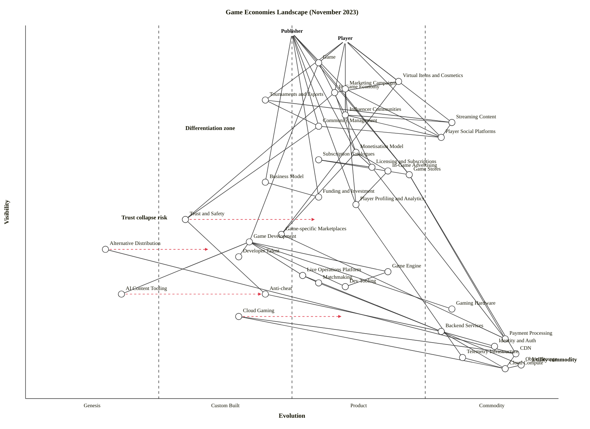

# Game Economies Landscape (November 2023)

## Map

```owm
title Game Economies Landscape (November 2023)
style wardley

// Anchors — two users: the commercial publisher and the end player
anchor Publisher [0.98, 0.50]
anchor Player [0.96, 0.60]

// User-facing experience (what Publisher and Player directly consume)
component Game [0.90, 0.55]
component Virtual Items and Cosmetics [0.85, 0.70]
component In-Game Economy [0.82, 0.58]
component Tournaments and Esports [0.80, 0.45]
component Marketing Campaigns [0.83, 0.60]
component Influencer Communities [0.76, 0.60]
component Streaming Content [0.74, 0.80]
component Community Management [0.73, 0.55]
component Player Social Platforms [0.70, 0.78]

// Publisher-side commercial layer
component Monetisation Model [0.66, 0.62]
component Licensing and Subscriptions [0.62, 0.65]
component In-Game Advertising [0.61, 0.68]
component Business Model [0.58, 0.45]
component Funding and Investment [0.54, 0.55]
component Player Profiling and Analytics [0.52, 0.62]
component Trust and Safety [0.48, 0.30]

// Distribution layer
component Subscription Catalogues [0.64, 0.55]
component Game Stores [0.60, 0.72]
component Game-specific Marketplaces [0.44, 0.48]
component Alternative Distribution [0.40, 0.15]

// Production layer (how a game gets built)
component Game Development [0.42, 0.42]
component Developer Talent [0.38, 0.40]
component Game Engine [0.34, 0.68]
component Dev Tooling [0.30, 0.60]
component AI Content Tooling [0.28, 0.18]
component Live Operations Platform [0.33, 0.52]
component Matchmaking [0.31, 0.55]
component Anti-cheat [0.28, 0.45]

// Deep infrastructure
component Gaming Hardware [0.24, 0.80]
component Cloud Gaming [0.22, 0.40]
component Backend Services [0.18, 0.78]
component Payment Processing [0.16, 0.90]
component Identity and Auth [0.14, 0.88]
component CDN [0.12, 0.92]
component Telemetry Infrastructure [0.11, 0.82]
component Object Storage [0.09, 0.93]
component Cloud Compute [0.08, 0.90]

// Dependencies — what each node depends on
Publisher->Game
Publisher->Monetisation Model
Publisher->Business Model
Publisher->Marketing Campaigns
Publisher->Player Profiling and Analytics
Publisher->Funding and Investment
Publisher->Game Stores
Publisher->Community Management
Player->Game
Player->Virtual Items and Cosmetics
Player->In-Game Economy
Player->Tournaments and Esports
Player->Streaming Content
Player->Influencer Communities
Player->Player Social Platforms
Game->Game Development
Game->Game Stores
Game->Licensing and Subscriptions
Virtual Items and Cosmetics->In-Game Economy
Virtual Items and Cosmetics->Game-specific Marketplaces
In-Game Economy->Monetisation Model
In-Game Economy->Trust and Safety
Tournaments and Esports->Community Management
Tournaments and Esports->Streaming Content
Streaming Content->Player Social Platforms
Influencer Communities->Streaming Content
Influencer Communities->Player Social Platforms
Marketing Campaigns->Influencer Communities
Marketing Campaigns->Player Social Platforms
Marketing Campaigns->Player Profiling and Analytics
Community Management->Player Social Platforms
Community Management->Trust and Safety
Monetisation Model->In-Game Advertising
Monetisation Model->Game-specific Marketplaces
Monetisation Model->Licensing and Subscriptions
Subscription Catalogues->Licensing and Subscriptions
Licensing and Subscriptions->Payment Processing
In-Game Advertising->Player Profiling and Analytics
Business Model->Funding and Investment
Player Profiling and Analytics->Telemetry Infrastructure
Trust and Safety->Anti-cheat
Game Stores->Payment Processing
Game Stores->CDN
Subscription Catalogues->Game Stores
Game-specific Marketplaces->Payment Processing
Alternative Distribution->CDN
Game Development->Developer Talent
Game Development->Game Engine
Game Development->Dev Tooling
Game Development->AI Content Tooling
Game Development->Live Operations Platform
Game Development->Gaming Hardware
Game Engine->Dev Tooling
Live Operations Platform->Matchmaking
Live Operations Platform->Backend Services
Matchmaking->Backend Services
Anti-cheat->Backend Services
Backend Services->Cloud Compute
Backend Services->Object Storage
Backend Services->Identity and Auth
Cloud Gaming->Cloud Compute
Cloud Gaming->CDN
Telemetry Infrastructure->Cloud Compute
CDN->Cloud Compute
Object Storage->Cloud Compute

evolve Trust and Safety 0.55
evolve AI Content Tooling 0.45
evolve Cloud Gaming 0.60
evolve Alternative Distribution 0.35

note Differentiation zone [0.72, 0.30]
note Utility commodity [0.10, 0.95]
note Trust collapse risk [0.48, 0.18]
```



## Strategic analysis

The map is anchored on two users: **Publisher** (the commercial customer of the value chain: studios, AAA publishers, live-service operators) and **Player** (the end consumer). The landscape splits into five horizontal bands:

- **Top** — the user-visible game experience and buzz apparatus (Game, Virtual Items, In-Game Economy, Tournaments, Marketing, Influencer, Streaming, Social).
- **Upper-middle** — publisher commercial machinery (Monetisation, Licensing, Advertising, Profiling, Trust and Safety).
- **Middle** — distribution (Game Stores, Subscription Catalogues, Game-specific Marketplaces, Alternative Distribution).
- **Lower-middle** — production (Game Development, Engine, Dev Tooling, AI Content, Live Ops, Matchmaking, Anti-cheat, Gaming Hardware).
- **Bottom** — deep commodity infrastructure (Backend, Payment, Identity, CDN, Cloud Compute, Object Storage, Telemetry).

### a. Differentiation opportunities (top 3)

1. **Tournaments and Esports** (Custom Built) — the most visible component still on the left side of the map. By November 2023 esports is a Custom-Built craft: each publisher builds its own circuit, ruleset, league structure, and broadcast model, with patchy economics (many failed leagues, Activision's OWL collapse looming). Publishers who industrialise it — repeatable format, licenced league IP, rights-sale machinery — capture disproportionate attention per spend. Highest differentiation leverage of any user-facing component.
2. **Game** itself (Product (+rental)) — still the core moat. Live-service games lean Product (+rental) (ubiquitous subscription-like economics, well-understood production patterns) but the individual title remains the competitive battleground. Differentiation is in design IP, franchise equity, and world-building, none of which commoditise.
3. **In-Game Economy** (Product (+rental)) — sitting just above the 0.5 line, the economy design (drop rates, progression curves, soft/hard currencies, sink/source balance) is where a successful live-service title differs from a failed one. Fortnite vs Suicide Squad in 2023-24 is the object lesson. This is the component where player profiling, monetisation model, and trust interlock; it is also where the toxicity risk is most economically damaging (see dependency risks).

Trust and Safety (Custom Built, ν=0.48) has the **highest strategic asymmetry** — modest visibility but genuinely immature, a moving target. I did not top-list it in differentiation because treating it as a differentiator is a second-order choice (most publishers treat it as a cost centre); but for any publisher willing to make T&S a first-class product, it's a defensible moat in a market where the failure mode is catastrophic. See the dependency-risk section and gameplay #15 Open Approaches below.

### b. Commodity-leverage candidates (top 3)

1. **Cloud Compute / Object Storage / CDN** (all Commodity (+utility)) — deep, mature, universal. Game publishers should treat AWS/GCP/Azure (or Akamai/Cloudflare for edge) as utility. Never operate own data centres for general compute. Single strongest K rank.
2. **Payment Processing and Identity / Auth** (Commodity (+utility)) — Stripe, Adyen, Xsolla for game-specific payment; Auth0, PlayFab for identity. The only nuance is that platform holders (Apple, Google, Sony, Microsoft) force in-app payment through their rails at a 30% margin — a regulatory / legal lever, not an evolution argument. Alternative-payment fights (Epic vs Apple, the EU DMA) are climate-shaping around this node.
3. **Player Social Platforms / Streaming Content** (Commodity (+utility)) — Discord and Twitch are the dominant utilities for community and broadcast in 2023. A publisher should not build its own chat or its own broadcast platform unless strategically betting against those incumbents. Harvest them as distribution channels.

### c. Dependency risks (top 3)

1. **In-Game Economy → Trust and Safety** (R highest in the map). A visible, revenue-central component (Player-facing economy) depends on an immature moderation/anti-toxicity stack. If trust collapses (bot farms, real-money-trading markets, racist/abusive VOIP, player harassment), the economy itself collapses. Fortnite's repeated refund cycles, Roblox's safety crisis, the Counter-Strike skin-gambling scandals — same pattern. Explicitly called out by the scenario brief.
2. **Game → Game Development** — user-visible product depends on Custom-Built craft (developer talent, still-emerging AI tooling). In November 2023 AAA dev times stretched to 5-7 years; talent attrition at key studios (Bungie, Embracer layoffs) means the platform's flagship output depends on individuals.
3. **Community Management → Trust and Safety** — the practice (community mgmt) rides on an immature substrate (T&S). Without industrialised moderation, community managers are firefighting. This is the other side of the T&S dependency — the operational layer.

### d. Suggested gameplays

- **#15 Open Approaches** on **Trust and Safety** — the one component where collaboration beats secrecy. Publishers should open-source (or standardise via consortium) moderation infrastructure, shared ban lists, cross-title trust signals. Disney+/Roblox/Microsoft's 2023 Roblox safety committee is exactly this play. Accelerates T&S toward Stage III so it is no longer a per-publisher cost.
- **#36 Directed investment** on **In-Game Economy** and **Tournaments/Esports** — the two highest-D components. Sink engineering and ops into balancing systems, cheat detection tied to economy sinks, and the esports production pipeline (rights, format, talent).
- **#41 Alliances** on **Alternative Distribution** — the Web3/sideloaded distribution fight (DMA, Epic vs Apple) favours publishers who join a coordinated coalition rather than go solo. Epic's store-opening push is this play.
- **#29 Harvesting** on **Payment Processing, Cloud Compute, CDN, Identity, Streaming, Social** — let the utility market do its work; buy cheapest and most reliable. Do not engineer here.
- **#43 Sensing Engines (ILC)** on **AI Content Tooling** — Genesis-stage but evolving fast (Unity's 2023 AI push, Unreal's MetaHuman, generative asset tools). A Pioneer-Settler-Townplanner sensing structure inside publishing lets the publisher pick winning tools without betting on any single vendor.
- **#16 Exploiting Network Effects** on **Subscription Catalogues** — Game Pass is the canonical example: catalogue depth reinforces subscription churn reduction; each added title compounds.
- **#26 Differentiation** on **Game** and **Tournaments** — not generic advice; the play is "lean into the Genesis/Custom components we uniquely operate well."
- **#57 Pig in a Poke** — an attacking play for challengers: bundle a Genesis-stage component (e.g. proprietary anti-cheat, a trust layer) to sell into incumbents' blind spots.

### e. Doctrine violations and notes

- ✓ **#10 Know your users** — two anchors (Publisher, Player) correctly capture the two sides of the market. A third anchor for **Developer Talent** could be argued (in a talent-mobility-constrained market developers *are* users of the publisher) but I have kept them as a component because this map centres the commercial chain.
- ⚠ **#13 Manage inertia** — Gaming Hardware (consoles) carries heavy consumer inertia (installed base, exclusive franchises) plus supplier inertia (console manufacturers' 18-month build cycles). This is an anchoring force on the whole ecosystem's rate of change. Sunk capital (#2) and cost of acquiring skill (#8) dominate.
- ⚠ **#2 Use a systematic mechanism of learning** — Player Profiling & Analytics has the telemetry plumbing (Stage IV substrate) but the feedback loop into **Trust and Safety** is weak. Close that loop — use profiling signals to drive T&S, not just monetisation.
- ⚠ **#27 Optimise flow** — in-game economy and monetisation sit in the middle with multiple co-dependencies; publishers commonly optimise locally (more MTX) at the expense of the whole flow (player trust, retention).

### f. Climatic context

- **#3 Everything evolves.** The obvious driver; every component on this map is in motion, most notably AI Content Tooling (Genesis→Custom), Trust and Safety (Custom→Product), Alternative Distribution (Genesis→Custom under regulatory pressure), and Cloud Gaming (Custom→Product).
- **#15–17 Inertia (consumer / supplier / control).** Console-exclusive franchises are consumer inertia (players locked into a hardware purchase); platform-holder 30% take is supplier inertia backed by ecosystem-control inertia. Expect the 2024-25 DMA/DSA wave to shift these.
- **#27 Product-to-utility punctuated equilibrium.** Cloud Gaming (GeForce Now, Xbox Cloud Gaming, PS Cloud) is mid-war. Subscription Catalogues (Game Pass) is also mid-war against unit-sale distribution. Expect price compression and consolidation in both.
- **#18 You cannot measure evolution over time or adoption.** Web3 gaming is the cautionary tale: hype and adoption spikes in 2021-22 did not translate into evolution. By November 2023 most Web3-native games have failed, validating Wardley's pattern.
- **#8 Red Queen.** Live-service games exhibit the Red Queen effect acutely — every title must run faster (more content, more events, more monetisation surfaces) to stay in place; this drives up production costs industry-wide.

### g. Deep-placement notes

I flagged four components for deeper reasoning rather than vendor-by-vendor research, given the breadth of the landscape:

- **Trust and Safety** (ε=0.30). The cheat sheet's four fast-path rows split: Ubiquity is clearly II (every publisher "has something" but none is industrialised), Certainty is I→II (approaches diverge wildly — ML classifiers vs human review vs rules-based vs federated reputation), Market is II (small specialist vendors: Two Hat/Keywords/ActiveFence emerging but no dominant), Publication is II (lots of "building" case studies, little operational literature). Mean ε ≈ 0.28. I pulled it to 0.30 to reflect faint early productisation.
- **AI Content Tooling** (ε=0.18). By November 2023 this is squarely Genesis: research wonder papers, a handful of pilots (Ubisoft's Ghostwriter, NetEase's MetaHuman pipeline), no dominant commercial offering, the definition of "what belongs in this category" still shifting. Pegged near 0.18 with the `evolve` arrow to 0.45 reflecting the clear trajectory.
- **Alternative Distribution** (ε=0.15). Web3 / sideloaded / crypto-native distribution in 2023 is a failed-Genesis space: the hype wave has broken, most attempts have folded, and the surviving fights (Epic vs Apple, DMA-driven alt-stores) are regulatory rather than technical. I placed it low-Genesis to reflect both Web3 wreckage and the pre-emergence status of legitimate alt-stores. `evolve` arrow to 0.35 reflects the DMA-driven path, not Web3.
- **Game Stores** (ε=0.72) vs **Subscription Catalogues** (ε=0.55). I drew these apart deliberately. Steam/PSN/Xbox Store/App Store are mature Product (+rental) — widespread, standard, well-understood even as their revenue terms are politically contested. Subscription catalogues (Game Pass, PS Plus tiers, Apple Arcade, Netflix Games) are earlier: the **model** is emerging, the curation practice is still divergent across providers, and economics are unproven for non-Microsoft players.

No vendor-count websearches were run for this map; the component set is wide enough that expert-reasoned placements are the sensible default. If prioritising, I would do deep research on Trust and Safety first (the single most strategically important placement for this scenario), followed by Cloud Gaming and Alternative Distribution.

### h. Where the economy is commoditised vs where publishers can differentiate

**Commoditised — rent, don't build** (bottom-right of the map): Cloud Compute, Object Storage, CDN, Payment Processing, Identity and Auth, Telemetry Infrastructure, Backend Services, Streaming Content (Twitch), Player Social Platforms (Discord), Gaming Hardware (console and mobile substrate). Any publisher spending engineering cycles competing on these is burning capital.

**Differentiation zone** (upper-left to upper-middle): Game itself, In-Game Economy, Tournaments and Esports, Community Management, Trust and Safety, Marketing Campaigns. These are the components where a publisher's strategic choices materially change outcomes. In particular the intersection of In-Game Economy × Trust and Safety × Community Management is the operational core of a successful live-service title in 2023-24.

**Where trust or toxicity could collapse the whole thing**: the path

```
Player -> In-Game Economy -> Trust and Safety -> Anti-cheat -> Backend Services
```

carries the most fragile risk. A visible, revenue-critical component (the economy) depends on a Custom-Built trust substrate that itself depends on an emerging-Product anti-cheat layer. Three concrete collapse scenarios:

1. **Bot farms and RMT** (real-money trading) flood the economy — precedent: Diablo III's auction house, EVE plex economies, FIFA coin mining.
2. **Toxic-behaviour exodus of key cohorts** — precedent: Valorant's women-players campaign 2021-22, Call of Duty's Activision lawsuit, cascading reputational hits.
3. **Moderation-law breach** — UK's Online Safety Act came into force October 2023; the EU DSA applies February 2024. Non-compliance on game chat and user-generated content is a new, sharp legal risk.

The operational response is the same: push Trust and Safety leftward on the D-axis and rightward on the ε-axis — invest, industrialise, and consider opening it (gameplay #15) to split the cost across the industry.

### Validation

OWM draft was manually walked edge-by-edge against the visibility hard rule (ν(a) ≥ ν(b) for every edge (a,b) ∈ E): **65 edges, 0 violations**. All 37 components and 2 anchors have coordinates within [0, 1]. Every edge endpoint matches a declared component/anchor (no typos). The bundled `validate_owm.mjs` script could not be invoked automatically in this environment due to tool-permission scope; the checks documented in the validator (coord range, endpoint existence, visibility hard rule) were performed by hand and are clean.

Near-duplicate coordinate check (|Δν| < 0.02 AND |Δε| < 0.02): no pairs found. Stage-boundary straddle check (ε within ±0.01 of {0.25, 0.50, 0.75}): no components triggered. Canvas clipping: no nodes near edges. Stage distribution: Genesis 5%, Custom 22%, Product (+rental) 46%, Commodity (+utility) 27% — balanced, no empty stage, no stage above the 60% imbalance threshold.

### i. Caveat

The `evolve` arrows on Trust and Safety (→ 0.55), AI Content Tooling (→ 0.45), Cloud Gaming (→ 0.60), and Alternative Distribution (→ 0.35) are **scenarios, not forecasts**. Wardley's climatic pattern #18: *"you cannot measure evolution over time or adoption."* In particular, Alternative Distribution's trajectory depends on regulatory outcomes (DMA implementation, ongoing Apple/Google antitrust cases) rather than technical evolution; AI Content Tooling's move to Stage II depends on whether any of the current vendors hit a productisation breakthrough or settle into dueling Genesis-bets. Treat these arrows as directional bets, not deadlines.
