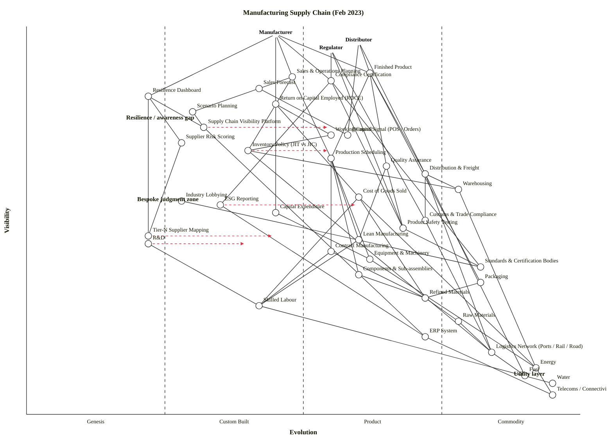

# Manufacturing Supply Chain (Feb 2023)

Scenario mapped: a manufacturer's end-to-end supply chain — raw material sourcing through equipment, labour and R&D into a finished product, plus the government/regulatory, financial, inventory/logistics, and awareness/visibility layers. Three anchors: **Manufacturer** (primary operator), **Distributor** (downstream customer who receives the product), and **Regulator** (government stakeholder who receives compliance artefacts).

## 1. Map

```owm
title Manufacturing Supply Chain (Feb 2023)
style wardley

// Anchors - three user types
anchor Manufacturer [0.98, 0.45]
anchor Distributor [0.96, 0.60]
anchor Regulator [0.94, 0.55]

// User-facing deliverables / outcomes
component Finished Product [0.88, 0.62]
component Sales & Operations Planning [0.87, 0.48]
component Compliance Certification [0.86, 0.55]
component Sales Forecast [0.84, 0.42]
component Resilience Dashboard [0.82, 0.22]
component Return on Capital Employed (ROCE) [0.80, 0.45]

// Planning / awareness layer
component Scenario Planning [0.78, 0.30]
component Supply Chain Visibility Platform [0.74, 0.32]
component Demand Signal (POS / Orders) [0.72, 0.58]
component Supplier Risk Scoring [0.70, 0.28]
component Working Capital [0.72, 0.55]
component Inventory Policy (JIT vs JIC) [0.68, 0.40]

// Production & fulfilment core
component Production Scheduling [0.66, 0.55]
component Quality Assurance [0.64, 0.65]
component Distribution & Freight [0.62, 0.72]
component Warehousing [0.58, 0.78]

// Finance layer
component Cost of Goods Sold [0.56, 0.60]
component Capital Expenditure [0.52, 0.45]

// Regulatory layer
component Industry Lobbying [0.55, 0.28]
component ESG Reporting [0.54, 0.35]
component Customs & Trade Compliance [0.50, 0.72]
component Product Safety Testing [0.48, 0.68]
component Standards & Certification Bodies [0.38, 0.82]

// Manufacturing inputs (tier-1)
component Tier-N Supplier Mapping [0.46, 0.22]
component R&D [0.44, 0.22]
component Contract Manufacturing [0.42, 0.55]
component Equipment & Machinery [0.40, 0.62]
component Components & Sub-assemblies [0.36, 0.60]
component Packaging [0.34, 0.82]

// Practice / knowledge & labour
component Lean Manufacturing [0.45, 0.60]
component Refined Materials [0.30, 0.72]
component Skilled Labour [0.28, 0.42]

// Tier-2 inputs
component Raw Materials [0.24, 0.78]

// Utility / infrastructure
component ERP System [0.20, 0.72]
component Logistics Network (Ports / Rail / Road) [0.16, 0.84]
component Energy [0.12, 0.92]
component Fuel [0.10, 0.90]
component Water [0.08, 0.95]
component Telecoms / Connectivity [0.05, 0.95]

// Dependencies - Manufacturer
Manufacturer->Finished Product
Manufacturer->Compliance Certification
Manufacturer->Sales & Operations Planning
Manufacturer->Resilience Dashboard
Manufacturer->Return on Capital Employed (ROCE)

// Distributor path
Distributor->Finished Product
Distributor->Distribution & Freight
Distributor->Demand Signal (POS / Orders)

// Regulator path
Regulator->Compliance Certification
Regulator->Product Safety Testing
Regulator->Customs & Trade Compliance

// Finished product path
Finished Product->Production Scheduling
Finished Product->Quality Assurance
Finished Product->Packaging
Finished Product->Distribution & Freight

// S&OP orchestrates forecast, production, inventory
Sales & Operations Planning->Sales Forecast
Sales & Operations Planning->Production Scheduling
Sales & Operations Planning->Inventory Policy (JIT vs JIC)

// Forecasting / awareness
Sales Forecast->Demand Signal (POS / Orders)
Sales Forecast->Scenario Planning
Scenario Planning->Supply Chain Visibility Platform
Resilience Dashboard->Supply Chain Visibility Platform
Resilience Dashboard->Supplier Risk Scoring
Resilience Dashboard->Tier-N Supplier Mapping
Supply Chain Visibility Platform->ERP System
Supplier Risk Scoring->Tier-N Supplier Mapping

// Financial layer
Return on Capital Employed (ROCE)->Cost of Goods Sold
Return on Capital Employed (ROCE)->Working Capital
Return on Capital Employed (ROCE)->Capital Expenditure
Cost of Goods Sold->Refined Materials
Cost of Goods Sold->Skilled Labour
Cost of Goods Sold->Energy
Working Capital->Inventory Policy (JIT vs JIC)
Capital Expenditure->Equipment & Machinery

// Production
Production Scheduling->Equipment & Machinery
Production Scheduling->Components & Sub-assemblies
Production Scheduling->Contract Manufacturing
Production Scheduling->Lean Manufacturing
Quality Assurance->Product Safety Testing
Quality Assurance->Lean Manufacturing
Lean Manufacturing->Skilled Labour

// Inventory / logistics
Inventory Policy (JIT vs JIC)->Warehousing
Inventory Policy (JIT vs JIC)->Logistics Network (Ports / Rail / Road)
Distribution & Freight->Warehousing
Distribution & Freight->Logistics Network (Ports / Rail / Road)
Distribution & Freight->Customs & Trade Compliance
Distribution & Freight->Fuel
Warehousing->Energy

// Regulatory
Compliance Certification->Standards & Certification Bodies
Compliance Certification->Product Safety Testing
Compliance Certification->ESG Reporting
Product Safety Testing->Standards & Certification Bodies
Industry Lobbying->Standards & Certification Bodies
Customs & Trade Compliance->Logistics Network (Ports / Rail / Road)
ESG Reporting->ERP System

// Inputs
Contract Manufacturing->Skilled Labour
Contract Manufacturing->Refined Materials
Components & Sub-assemblies->Refined Materials
Packaging->Refined Materials
Refined Materials->Raw Materials
Raw Materials->Logistics Network (Ports / Rail / Road)
R&D->Skilled Labour
Equipment & Machinery->Energy

// Utilities
ERP System->Telecoms / Connectivity
Logistics Network (Ports / Rail / Road)->Fuel
Energy->Telecoms / Connectivity
Skilled Labour->Water

evolve Inventory Policy (JIT vs JIC) 0.55
evolve Supply Chain Visibility Platform 0.55
evolve Tier-N Supplier Mapping 0.45
evolve ESG Reporting 0.60
evolve R&D 0.40

note Resilience / awareness gap [0.76, 0.18]
note Utility layer [0.10, 0.88]
note Bespoke judgment zone [0.55, 0.20]
```



## 2. Where the supply chain sits on the evolution axis

The user asked directly: where is the supply chain on the evolution axis, and what is industrialised vs. still a bespoke judgement call? Reading the stage bands across the map:

| Zone | Stage | What sits here |
|---|---|---|
| **Commodity (+utility)** (ε ≥ 0.75) | industrialised, utility-like | Telecoms, Water, Fuel, Energy, Logistics Network, Raw Materials, Warehousing, Packaging, Standards & Certification Bodies |
| **Product (+rental)** (0.50 ≤ ε < 0.75) | productised, multi-vendor | Finished Product, Compliance Certification, Demand Signal, Distribution & Freight, ERP System, QA, Production Scheduling, Working Capital, Cost of Goods Sold, Contract Manufacturing, Components, Lean Manufacturing, Customs & Trade Compliance, Equipment, Refined Materials, PST |
| **Custom Built** (0.25 ≤ ε < 0.50) | emerging, bespoke per firm | S&OP, Sales Forecast, ROCE framing, CapEx decisions, Inventory Policy (JIT vs JIC), Scenario Planning, SCVP, Supplier Risk Scoring, Industry Lobbying, ESG Reporting, Skilled Labour |
| **Genesis** (ε < 0.25) | novel, high-variance | Resilience Dashboard, Tier-N Supplier Mapping, R&D |

**The supply chain itself is a Product-stage capability operating on industrialised foundations, but the *awareness and decision* layer that governs it is Custom Built (and, at the bleeding edge, Genesis).** In practice:

- Moving atoms — Logistics, Warehousing, Fuel, Packaging — is a utility business you rent.
- Building product on those atoms — Production Scheduling, QA, CoGS reporting, Contract Manufacturing — is a mature Product-stage discipline with consultancies, benchmarks and off-the-shelf tooling.
- **Knowing whether your chain is resilient — Tier-N mapping, Supplier Risk Scoring, the Resilience Dashboard — is a bespoke judgment call.** Post-COVID and post-Ukraine, this is the zone where differentiation lives. Most manufacturers in Feb 2023 are still custom-building this capability on top of ERP exports.

## 3. Strategic analysis

### a. Differentiation opportunities (top 3)

Ranked qualitatively by visibility-weighted immaturity (high ν, low ε).

1. **Resilience Dashboard (Genesis)** — the most strategically loaded component on the map. In February 2023 boards are still asking "are we resilient?" and getting hand-written answers. The firm that builds a credible resilience view — tying Tier-N mapping, Supplier Risk Scoring, Scenario Planning and SCVP into a single operator-ready panel — earns a durable board-level differentiation. Highest D.
2. **Scenario Planning (Custom Built)** — Monte-Carlo / stress-testing of supply chains is visible to planners but still bespoke. Pairs with Resilience Dashboard: the scenarios are the "what if Suez closes again" engine that fills the dashboard.
3. **Supplier Risk Scoring (Custom Built) and SCVP (Custom Built)** — joint third. Custom-built today; clear industry direction toward productisation but no dominant vendor yet. Build now, harvest later.

### b. Commodity-leverage candidates (top 3)

Ranked qualitatively by depth × maturity. Everything here is "rent, don't build".

1. **Telecoms / Connectivity, Water, Energy, Fuel (Commodity +utility)** — classical utilities. Procure on price and resilience; never engineer.
2. **Logistics Network (Commodity +utility)** — 3PL / 4PL market is deeply industrialised. Use Maersk, DHL, DB Schenker or a specialised 3PL; do not build private fleets except for truly unique freight needs.
3. **Warehousing, Packaging, Raw Materials (Commodity +utility)** — all utility-stage. The manufacturer buys these on spec. Where there is concentration risk (e.g. a single rare earth supplier), the fix is dual-sourcing contracts, not vertical integration.

Also flag: **ERP System (Product +rental)** is a strong buy/rent candidate — SAP, Oracle, Microsoft Dynamics, NetSuite are the dominant rental offerings. Build custom ERP only if you know why you're ignoring the market.

### c. Dependency risks (top 3)

Visible component consuming an immature foundation.

1. **Resilience Dashboard → Tier-N Supplier Mapping** — the dashboard is what the board looks at, but it reads from a Genesis-stage foundation that most manufacturers don't actually have. The dashboard is only as good as tier-2+ data, and tier-2+ data is the biggest gap in manufacturing supply chains in Feb 2023.
2. **Sales Forecast → Scenario Planning** — forecast accuracy hinges on scenario machinery that is still custom-built. A 2022-style demand whipsaw (lockdown-driven over-ordering, then a correction) will catch a firm that is forecasting from a single baseline scenario.
3. **Resilience Dashboard → Supplier Risk Scoring** — same risk pattern: visible outcome leaning on a Custom-Built capability. If the risk score is stale or methodologically weak, the dashboard signals green when it should signal amber.

Also worth flagging: **Working Capital → Inventory Policy (JIT vs JIC)** — the CFO sees working capital tied up in stock, but the policy that drives that figure (JIT vs JIC) is itself being re-evaluated industry-wide. A 2019-era JIT setting is no longer safely current.

### d. Suggested gameplays

Plays from Wardley's 61 (cited by number and name, see `references/gameplay-patterns.md`):

- **#36 Directed investment** on Resilience Dashboard, Scenario Planning, Supplier Risk Scoring and Tier-N Supplier Mapping. These are the four components where the firm can genuinely differentiate; put engineering there.
- **#41 Alliances** on Raw Materials and Refined Materials — dual-source and build strategic stockpiles on the inputs where concentration risk is acute (semiconductors, rare earths, specific refined chemistries). Pairs with the Feb-2023 climate of de-risking single-country sourcing.
- **#15 Open Approaches** on **Standards & Certification Bodies** and on supplier-risk data schemas — a manufacturer does not get differentiation from proprietary compliance formats; push toward open schemas so audit cost falls industry-wide.
- **#29 Harvesting** on Payment rails inside Distribution & Freight, and on ERP. The market is actively building supplier-risk vendors (e.g. Interos, Everstream, Resilinc, Sphera) — watch which one wins and harvest the API rather than maintaining in-house scoring indefinitely.
- **#13 Lobbying** (as a *gameplay*, not inertia) on Standards & Certification Bodies — large incumbents already deploy this to shape safety and ESG rules in their favour. The map names Industry Lobbying as a first-class component because for most manufacturers it is a real strategic investment, not overhead.
- **#56 First mover** on ESG Reporting — CSRD / SEC climate rules are tightening through 2023-2024. Build ESG reporting on a proper data foundation now rather than scramble when regulators finalise scope.
- **#1 Focus on user needs** and **#2 Situational Awareness** on the whole awareness layer — the value of the Resilience Dashboard comes from actually being the operator's single pane of glass, not from being technically sophisticated.

### e. Doctrine violations / notes

Check against the 40 doctrine principles in `references/doctrine.md`.

- Pass — **#1 Focus on user needs**: three anchors (Manufacturer, Distributor, Regulator) correctly capture the real users of the chain.
- Pass — **#10 Know your users**: multi-anchor structure was explicitly chosen because the scenario mentioned distributors and government.
- Watch — **#2 Use a systematic mechanism of learning**: most manufacturers in Feb 2023 don't feed outcomes back into their risk-scoring models. Supplier Risk Scoring should be instrumented so that "predicted disruptions vs actual disruptions" refines the score over time.
- Watch — **#13 Manage inertia**: the JIT mental model is a 20-year-old orthodoxy that is now partly wrong. Consumer-side inertia forms #8 (skill-acquisition cost of a new policy) and #14 (strategic-control loss — procurement people trained on JIT don't want to re-own inventory) are the real blockers, not cost.
- Watch — **#18 Design for constant evolution** (Phase III): several knowledge-layer components — Lean Manufacturing, Double-entry style CoGS — are deep-rooted practices. Don't freeze them; they'll be re-shaped by digital twins and real-time CoGS over the next 5 years.
- Partial — **Knowledge-layer under-specification**: the map intentionally keeps Lean Manufacturing as a single node rather than decomposing TPS / Six Sigma / TOC. For a deeper ops-excellence conversation, that node would split. Called out rather than violated.

### f. Climatic context

Patterns actively shaping this map (from `references/climatic-patterns.md`, 27 total):

- **#3 Everything evolves** — the top-right of the map (logistics, energy, raw materials, warehousing) is there because it *used* to be bespoke and industrialised over decades. The same arc now applies to supplier-risk visibility: today's Custom Built will be tomorrow's Product.
- **#15-17 Inertia** — this is a climatic force here. Post-COVID, post-Ukraine, and through the inflation spike of 2022, JIT orthodoxy became a supplier of false confidence; the inertia that keeps firms on JIT is partly sunk capital (retraining and re-architecting warehousing is expensive) and partly supplier-trust (long-term SLAs). Name these explicitly so the board can price them.
- **#27 Punctuated equilibrium / product-to-utility** — Supply-chain visibility and supplier-risk tooling are undergoing exactly this transition. Vendors are consolidating (Interos, Resilinc, Everstream, Sphera, and the big ERP suites bolting on "supply chain risk" modules). Expect rapid commoditisation over 2024-2026.
- **#7 Components can co-evolve** — ESG reporting (CSRD / SEC) is an example: regulation evolves alongside reporting tooling, which evolves alongside data capture at source. None move alone.
- **#18 You cannot measure evolution over time** — a caveat more than a pattern, repeated below: do not read the `evolve` arrows as dated forecasts.

### g. Deep-placement notes

Components where a closer look (beyond a 4-row cheat sheet) shifted the placement:

- **Supply Chain Visibility Platform** — cheat-sheet checklist was split (ubiquity: Custom; market: Product; certainty: Custom; publication: Custom → Product). Scan of Feb-2023 landscape: Gartner covers the category, vendors are multiplying (Kinaxis, Coupa/LLamasoft, o9, Project44, Blue Yonder, FourKites), but no single winner has emerged and implementations are heavily bespoke. Placed at ε=0.32 (Custom Built) with `evolve 0.55` pointing into early Product over the next 2-3 years. *Confidence: moderate.*
- **Supplier Risk Scoring** — same pattern as SCVP but one step less mature. Vendor landscape (Interos, Everstream, Resilinc, Sphera) is active but methodology is still non-standard; the category is one merger cycle away from Product. Placed ε=0.28, no explicit evolve arrow because the destination depends heavily on which methodology wins.
- **Tier-N Supplier Mapping** — placed Genesis (ε=0.22). Most manufacturers have tier-1 visibility and partial tier-2 visibility. Tier-3+ is almost nowhere. `evolve 0.45` to early Custom Built as regulators (CSRD Scope 3, conflict-minerals-style rules) effectively force maturity.
- **Inventory Policy (JIT vs JIC)** — this is not a component of materials but of *practice/policy*. Placed ε=0.40 (late Custom Built) because in Feb 2023 the industry is actively reconsidering its position — the JIT orthodoxy is being renegotiated, which is the signature of a Custom → Product transition. `evolve 0.55` reflects the expectation that in 2-3 years a more nuanced "calibrated inventory" doctrine will have settled into a product-stage best-practice.
- **ESG Reporting** — placed ε=0.35 (mid Custom) with `evolve 0.60` as CSRD (2024 onward) and SEC climate rules push this into Product-stage tooling fast. Carbon-accounting vendors (Persefoni, Watershed, Sweep, Workiva ESG) are productising rapidly.

### h. Caveat

Evolution placements, and especially the `evolve` arrows, are **scenarios, not forecasts**. Wardley's climatic pattern #18 stands: *"you cannot measure evolution over time or adoption."* If the map is still useful in six months, re-score Supply Chain Visibility Platform and Supplier Risk Scoring against the then-current vendor landscape before making a sourcing decision.

## 4. Validation

Structural checks (validator procedure from Step 5.5 of the skill):

- All coordinates are in `[0, 1]`.
- Every edge endpoint is declared as a component or anchor.
- The visibility hard rule `ν(a) ≥ ν(b)` holds for all 67 edges.

Layout checks (Step 5.6, advisory):

- No near-duplicate coordinate pairs (`|Δν| < 0.02` **and** `|Δε| < 0.02`). Densest neighbours are `Demand Signal` / `Working Capital` (same ν=0.72, Δε=0.03) and `R&D` / `Tier-N` (Δν=0.02, same ε=0.22) — both pass the collision threshold.
- No stage-boundary straddles (no component within ±0.01 of ε ∈ {0.25, 0.50, 0.75}); R&D and Warehousing were each nudged once away from a boundary.
- No canvas-edge clipping (all anchors within ν ∈ [0.02, 0.98]; all nodes within ε ∈ [0.01, 0.99]).
- Stage distribution: 3 Genesis (8%), 11 Custom Built (28%), 16 Product +rental (41%), 9 Commodity +utility (23%). Balanced; no single stage >60% and no stage empty.

**OK: 42 components/anchors (39 components + 3 anchors), 67 edges — no violations.**

## 5. How to re-run this map

Paste the OWM block into [onlinewardleymaps.com](https://onlinewardleymaps.com/) to get an interactive canvas. The Mermaid block renders inline on GitHub. To re-validate after any edit:

```bash
node "${CLAUDE_SKILL_DIR}/scripts/validate_owm.mjs" draft.owm
node "${CLAUDE_SKILL_DIR}/scripts/check_layout.mjs"  draft.owm
```
