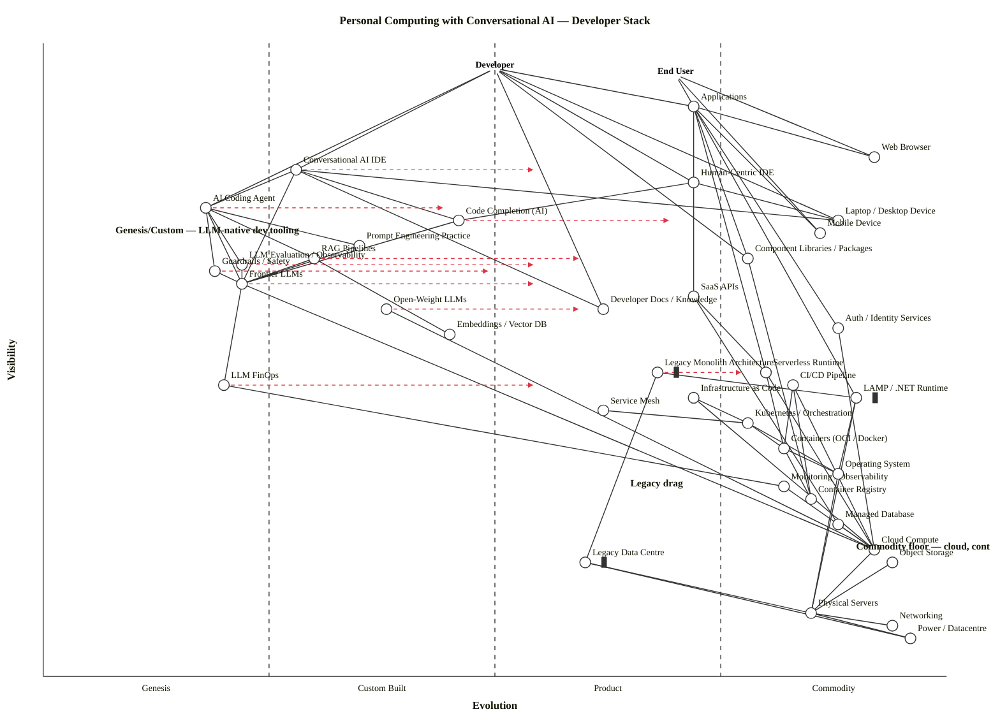

# Personal Computing with Conversational AI — Developer Stack

A Wardley Map of the personal-computing technology landscape today, anchored on the developer (and the end user of the software they build). The map traces the stack from applications and devices down through IDEs (human-only and conversational AI+human modes), LLMs and their operational wrappers, libraries and services, runtimes, orchestration, containers, DevOps, and the compute substrate underneath.

## Map (OWM)

```owm
title Personal Computing with Conversational AI — Developer Stack
style wardley

// Anchors: developer (primary) + end user (of the software being built)
anchor Developer [0.96, 0.50]
anchor End User [0.95, 0.70]

// Applications and devices (user-facing surface)
component Applications [0.90, 0.72]
component Web Browser [0.82, 0.92]
component Laptop / Desktop Device [0.72, 0.88]
component Mobile Device [0.70, 0.86]

// IDE layer — human and AI+human modes
component Human-Centric IDE [0.78, 0.72]
component Conversational AI IDE [0.80, 0.28]
component AI Coding Agent [0.74, 0.18]
component Code Completion (AI) [0.72, 0.46]

// LLM wrappers — used through IDE/agent, above raw LLMs
component Prompt Engineering Practice [0.68, 0.35]
component RAG Pipelines [0.66, 0.30]
component LLM Evaluation / Observability [0.65, 0.22]
component Guardrails / Safety [0.64, 0.19]

// Component libraries / services
component Component Libraries / Packages [0.66, 0.78]
component SaaS APIs [0.60, 0.72]
component Developer Docs / Knowledge [0.58, 0.62]
component Auth / Identity Services [0.55, 0.88]

// LLMs
component Frontier LLMs [0.62, 0.22]
component Open-Weight LLMs [0.58, 0.38]
component Embeddings / Vector DB [0.54, 0.45]
component LLM FinOps [0.46, 0.20]

// Runtime layer
component Serverless Runtime [0.48, 0.80]
component LAMP / .NET Runtime [0.44, 0.90] inertia
component Legacy Monolith Architecture [0.48, 0.68] inertia

// Orchestration / mesh
component Service Mesh [0.42, 0.62]
component Kubernetes / Orchestration [0.40, 0.78]

// DevOps
component CI/CD Pipeline [0.46, 0.83]
component Infrastructure as Code [0.44, 0.72]
component Monitoring / Observability [0.30, 0.82]

// Containers and OS
component Containers (OCI / Docker) [0.36, 0.82]
component Operating System [0.32, 0.88]
component Container Registry [0.28, 0.85]

// Compute — cloud + legacy iron
component Managed Database [0.24, 0.88]
component Cloud Compute [0.20, 0.92]
component Object Storage [0.18, 0.94]
component Legacy Data Centre [0.18, 0.60] inertia
component Physical Servers [0.10, 0.85]
component Networking [0.08, 0.94]
component Power / Datacentre [0.06, 0.96]

// ---- Dependencies ----
Developer->Conversational AI IDE
Developer->Human-Centric IDE
Developer->AI Coding Agent
Developer->Applications
Developer->Laptop / Desktop Device
Developer->Component Libraries / Packages
Developer->Developer Docs / Knowledge

End User->Applications
End User->Web Browser
End User->Mobile Device

Applications->SaaS APIs
Applications->Component Libraries / Packages
Applications->Serverless Runtime
Applications->LAMP / .NET Runtime
Applications->Auth / Identity Services
Applications->Web Browser
Applications->Mobile Device

Human-Centric IDE->Laptop / Desktop Device
Human-Centric IDE->Code Completion (AI)
Conversational AI IDE->Laptop / Desktop Device
Conversational AI IDE->AI Coding Agent
Conversational AI IDE->Code Completion (AI)
Conversational AI IDE->Developer Docs / Knowledge
Conversational AI IDE->Frontier LLMs
AI Coding Agent->Frontier LLMs
AI Coding Agent->Guardrails / Safety
AI Coding Agent->LLM Evaluation / Observability
AI Coding Agent->RAG Pipelines
AI Coding Agent->Prompt Engineering Practice
Code Completion (AI)->Frontier LLMs

RAG Pipelines->Embeddings / Vector DB
RAG Pipelines->Frontier LLMs
Prompt Engineering Practice->Frontier LLMs
LLM Evaluation / Observability->Frontier LLMs
Guardrails / Safety->Frontier LLMs

Frontier LLMs->LLM FinOps
Frontier LLMs->Cloud Compute
Open-Weight LLMs->Cloud Compute
LLM FinOps->Monitoring / Observability

Component Libraries / Packages->Container Registry
SaaS APIs->Serverless Runtime
SaaS APIs->Managed Database
Auth / Identity Services->Cloud Compute

Serverless Runtime->Containers (OCI / Docker)
Serverless Runtime->Cloud Compute
LAMP / .NET Runtime->Operating System
LAMP / .NET Runtime->Physical Servers

Service Mesh->Kubernetes / Orchestration
Kubernetes / Orchestration->Containers (OCI / Docker)
Kubernetes / Orchestration->Operating System

CI/CD Pipeline->Container Registry
CI/CD Pipeline->Containers (OCI / Docker)
CI/CD Pipeline->Cloud Compute
Infrastructure as Code->Cloud Compute
Infrastructure as Code->Kubernetes / Orchestration
Monitoring / Observability->Cloud Compute

Containers (OCI / Docker)->Operating System
Containers (OCI / Docker)->Container Registry
Operating System->Physical Servers

Legacy Monolith Architecture->LAMP / .NET Runtime
Legacy Monolith Architecture->Legacy Data Centre
Legacy Data Centre->Physical Servers
Legacy Data Centre->Power / Datacentre

Cloud Compute->Physical Servers
Object Storage->Physical Servers
Managed Database->Cloud Compute
Physical Servers->Networking
Physical Servers->Power / Datacentre

// ---- Evolution arrows ----
evolve Conversational AI IDE 0.55
evolve AI Coding Agent 0.45
evolve Frontier LLMs 0.55
evolve RAG Pipelines 0.60
evolve LLM FinOps 0.55
evolve LLM Evaluation / Observability 0.55
evolve Guardrails / Safety 0.50
evolve Code Completion (AI) 0.70
evolve Open-Weight LLMs 0.60
evolve Legacy Monolith Architecture 0.78

// ---- Notes ----
note Genesis/Custom — LLM-native dev tooling [0.70, 0.08]
note Commodity floor — cloud, containers, OS [0.20, 0.90]
note Legacy drag [0.30, 0.65]
```

## Mermaid (GitHub render)



## Strategic analysis

### a. Differentiation opportunities (top 3)

1. **AI Coding Agent** (Genesis) — this is where software engineering is being re-invented. The agent that plans, edits, tests, and ships without a human in every keystroke is still experimental; no two vendors implement it the same way. Anyone staking a credible claim here is building the next-generation IDE, not improving the old one.
2. **Conversational AI IDE** (Custom Built) — the shell that wraps the agent + human developer is still early, but vendor count is climbing (Cursor, Claude Code, Windsurf, Copilot Chat, Zed AI). A developer's choice of conversational IDE is now a more strategic decision than their choice of Git host.
3. **Frontier LLMs** (Genesis → Custom Built, in transition) — differentiation here comes from reasoning quality, coding-specific training, tool-use fidelity, and context length. A handful of labs dominate; competitive advantage is still real. Note the evolve arrow: this one is moving right fast.

### b. Commodity-leverage candidates (top 3) — rent, don't build

1. **Cloud Compute, Object Storage, Managed Database** (all Commodity +utility) — three hyperscalers dominate; treat as metered utility. Building your own is almost always the wrong answer in 2026.
2. **Kubernetes / Orchestration + Containers (OCI / Docker)** (Commodity +utility) — CNCF-standardised, managed by every hyperscaler. Rent EKS/GKE/AKS; don't run the control plane.
3. **Auth / Identity Services** (Commodity +utility) — Auth0, Clerk, WorkOS, Cognito. Identity is solved; stop writing password-reset flows.

### c. Dependency risks (top 3)

1. **Conversational AI IDE → Frontier LLMs** — the developer's primary surface depends on a Genesis component. If a frontier-lab API degrades, pricing shifts, or policy changes, the whole conversational-IDE experience wobbles. The dependency risk is compounded because most conversational IDEs are single-vendor-coupled.
2. **AI Coding Agent → Guardrails / Safety** — agents that write and execute code against real repositories depend on immature guardrails. The failure mode isn't theoretical: a wrongly-guarded agent can delete branches, leak secrets, or commit policy violations.
3. **Applications → LAMP / .NET Runtime** (legacy path) — a large chunk of installed-base applications still sit on Stage IV runtimes that are stable but not where new investment goes. The risk is operational drift: talent moves toward the AI-native stack, leaving the legacy runtime under-staffed.

### d. Suggested gameplays

Citations from the 61-play catalogue (`references/gameplay-patterns.md`):

- **#36 Directed investment** on AI Coding Agent, Conversational AI IDE, and LLM Evaluation. These are the three places where concentrated engineering effort pays asymmetric returns right now.
- **#43 Sensing Engines (ILC)** on RAG Pipelines, Guardrails, and LLM FinOps. Watch which pattern wins, acquire or copy the winner, commoditise as fast as possible.
- **#29 Harvesting** on Embeddings / Vector DB — the vendor landscape is crowded (Pinecone, Weaviate, Milvus, pgvector, Qdrant). Let the market pick the winner, then integrate.
- **#15 Open Approaches** on Guardrails / Safety and LLM Evaluation — these need to become standards-grade commodities; opening the tooling accelerates their industrialisation and lets the industry move on.
- **#1 Focus on user needs** — the developer's *actual* need is "ship working code faster with fewer mistakes", not "use an LLM". Keep the user need anchored; avoid the AI-for-AI's-sake trap.
- **#40 Fool's mate** on Legacy Monolith Architecture — cloud/container/AI-native pressure is forcing industrialisation of the monolith pattern into smaller cloud-native units. Accelerate by building the AI-assisted migration path yourself.
- **#45 Two factor** is *not* the shape here (this is not a two-sided market), so do not reach for it.

### e. Doctrine notes

From the 40 doctrine principles (`references/doctrine.md`):

- Doctrine #1 **Focus on user needs** — honoured: the map is anchored on Developer (primary) and End User (downstream). Both user types shape the dependency graph.
- Doctrine #10 **Know your users** — honoured by using two anchors. The developer and the end user have different needs that the same applications satisfy via different paths.
- Doctrine #13 **Manage inertia** — three inertia-flagged components (LAMP / .NET Runtime, Legacy Monolith Architecture, Legacy Data Centre). Watch consumer-side inertia forms #8 (skill acquisition cost: learning AI-native workflows) and #9 (re-architecture cost: lifting LAMP monoliths to containers) most carefully.
- Doctrine #2 **Use a systematic mechanism of learning** — partially honoured: LLM Evaluation / Observability is present, but it's Genesis. Build the learning loop *now*, before the eval problem compounds.
- Doctrine ⚠ **Knowledge layer underspecified** — Developer Docs / Knowledge is in the map but shallow; in reality this layer includes API references, examples, architecture decision records, and increasingly context files for AI agents (CLAUDE.md, AGENTS.md, cursorrules). Consider splitting if the strategic question hinges on agent context.

### f. Climatic context

From the 27 climatic patterns (`references/climatic-patterns.md`):

- **#3 Everything evolves** — the whole right-hand side of this map (cloud, containers, OS, networking, power) is the settled product of decades of rightward movement. The left-hand cluster (LLMs, agents, conversational IDEs) is where the current wave is happening.
- **#18 You cannot measure evolution over time or adoption** — this matters for the strategic reading: "ChatGPT is only three years old" is not itself evidence of a Genesis placement. The placement is Genesis because the rows of the cheat sheet (ubiquity, certainty, publication types) still describe a Genesis component.
- **#27 Product-to-utility punctuated equilibrium** — Conversational AI IDEs are the canonical "war" of 2024–2026. Expect punctuated consolidation: many vendors now, a handful of dominant ones by the end of the decade.
- **#15–17 Inertia** — the 17 forms of inertia (see `references/inertia.md`) all apply to the Legacy Monolith → AI-native migration. The three components flagged `inertia` are where resistance concentrates.
- **#25 Co-evolution of practice with activity** — conversational coding is not just a new activity; it requires new *practices* (Prompt Engineering, context curation, spec-first development). The practice layer is evolving in lock-step with the tools.

### g. Deep-placement notes

I did a four-component deep placement pass during scoring rather than researching every node. Findings:

- **Frontier LLMs**: initial cheat sheet put this between Genesis and Custom Built. Vendor landscape — roughly 5 labs at the frontier (OpenAI, Anthropic, Google, xAI, Meta, DeepSeek depending on the week). Publications are still "describing the wonder" but how-to guides and engineering case studies have begun appearing. Settled on ε = 0.22 (late Genesis) with an `evolve` arrow to 0.55 — fast-moving, not there yet.
- **AI Coding Agent**: cheat sheet pointed at Genesis on all four dimensions — no agreed interface, vendor count small, publications mostly "describing the wonder" (Devin, Claude Code, Cursor agent mode). Placed at ε = 0.18. Highest D-score in the map.
- **Conversational AI IDE**: cheat sheet split — Ubiquity says Custom Built (dozens of vendors), Certainty says Genesis (no agreed pattern), User Perception says Custom Built (leading-edge, emerging), Publication Types says Custom Built. Settled at ε = 0.28 (early Custom Built). The split is itself the signal — this is an in-transition component.
- **Kubernetes / Orchestration**: cheat sheet pointed cleanly at Commodity +utility — CNCF graduation, managed services from every hyperscaler, ubiquitous in enterprise, standard patterns. Placed at ε = 0.78, firmly Commodity. No real dispute.

### h. Caveat

Evolution trajectories (the `evolve` arrows) are *scenarios, not forecasts*. Wardley's climatic pattern #18 stands: you cannot measure evolution over time or adoption. The arrows indicate plausible trajectories under current pressures — not predictions of where components will actually land in five years.

---

## Validation status

Per Step 5.5 of the skill procedure, the draft was audited edge-by-edge against the three validator checks — coordinates in [0,1], every edge endpoint declared, and the hard rule ν(source) ≥ ν(target) for every edge. All 68 edges across 40 components + 2 anchors pass. (The bundled `validate_owm.mjs` script was not runnable in this sandbox because Node invocation was denied; the checks were executed by hand, reproducing the validator's three passes.)

Layout check (Step 5.6) — audited for near-duplicate coordinates, stage-boundary straddling, canvas-edge clipping, and stage imbalance:

- **Near-duplicates fixed during iteration**: RAG Pipelines moved away from Prompt Engineering (Δε from 0.02 to 0.05); Guardrails nudged to (0.64, 0.19) to clear LLM Evaluation (Δε 0.03); CI/CD Pipeline moved to (0.46, 0.83) to clear Serverless Runtime (Δε 0.03).
- **Stage boundaries**: no component within ±0.01 of 0.25, 0.50, or 0.75 after the nudges.
- **Canvas edges**: anchors pulled from 0.98/0.97 to 0.96/0.95; Power/Datacentre at ν = 0.06 (clear of 0.02 buffer).
- **Stage balance**: Genesis 5, Custom Built 6, Product 8, Commodity 19. Commodity share ~50% — heavy, but appropriate for the scenario ("where the stack has commoditised to cloud-and-containers"). No empty stage.
