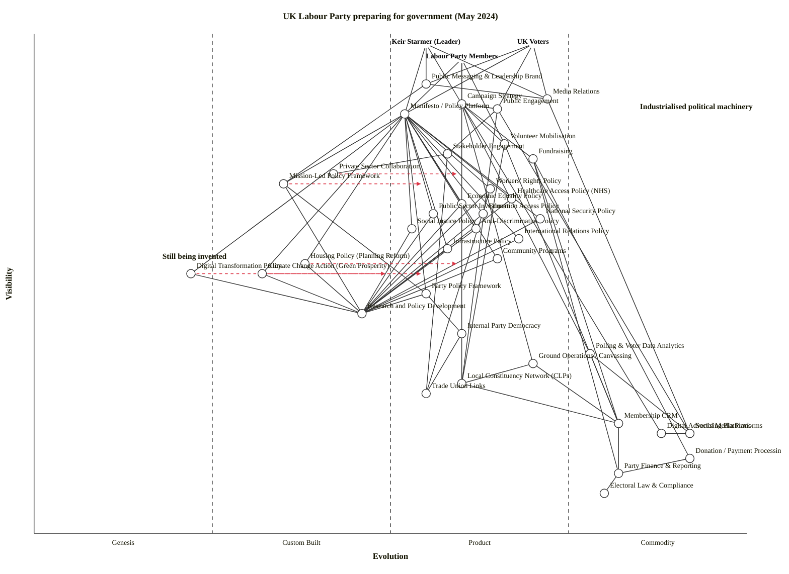

# UK Labour Party preparing for government — May 2024

A Wardley Map of the UK Labour Party's value landscape on the cusp of returning to government. Anchored on three user-need groups: the leader (Keir Starmer), UK voters, and Labour Party members. Industrialised political machinery dominates the upper and deeper layers; novel ground lives in the Housing / Climate / Digital Transformation clusters where Labour is inventing (not just inheriting) policy.

---

## Map (OWM)

```owm
title UK Labour Party preparing for government (May 2024)
style wardley

// Anchors (user needs)
anchor Keir Starmer (Leader) [0.98, 0.55]
anchor UK Voters [0.98, 0.70]
anchor Labour Party Members [0.95, 0.60]

// Leader-facing / top public layer
component Public Messaging & Leadership Brand [0.90, 0.55]
component Media Relations [0.87, 0.72]
component Campaign Strategy [0.86, 0.60]
component Public Engagement [0.85, 0.65]
component Manifesto / Policy Platform [0.84, 0.52]

// Engagement & mobilisation
component Volunteer Mobilisation [0.78, 0.66]
component Stakeholder Engagement [0.76, 0.58]
component Fundraising [0.75, 0.70]
component Private Sector Collaboration [0.72, 0.42]

// Mission-led framing (Starmer's 5 missions)
component Mission-Led Policy Framework [0.70, 0.35]

// Substantive policy areas - industrialised (mature, established political terrain)
component Workers' Rights Policy [0.69, 0.64]
component Healthcare Access Policy (NHS) [0.67, 0.67]
component Economic Equality Policy [0.66, 0.60]
component Education Access Policy [0.64, 0.63]
component Public Sector Investment [0.64, 0.56]
component Anti-Discrimination Policy [0.61, 0.62]
component National Security Policy [0.63, 0.71]
component International Relations Policy [0.59, 0.68]
component Social Justice Policy [0.61, 0.53]
component Infrastructure Policy [0.57, 0.58]
component Community Programs [0.55, 0.65]

// Substantive policy areas - still being invented / novel framing
component Housing Policy (Planning Reform) [0.54, 0.38]
component Climate Change Action (Green Prosperity) [0.52, 0.32]
component Digital Transformation Policy [0.52, 0.22]

// Policy apparatus (mid-layer — behind the scenes)
component Party Policy Framework [0.48, 0.55]
component Research and Policy Development [0.44, 0.46]
component Internal Party Democracy [0.40, 0.60]

// Campaign & engagement infrastructure (mid-deep)
component Polling & Voter Data Analytics [0.36, 0.78]
component Ground Operations / Canvassing [0.34, 0.70]
component Local Constituency Network (CLPs) [0.30, 0.60]
component Trade Union Links [0.28, 0.55]

// Data & digital infra
component Membership CRM [0.22, 0.82]
component Digital Advertising Platforms [0.20, 0.88]
component Social Media Platforms [0.20, 0.92]
component Donation / Payment Processing [0.15, 0.92]
component Party Finance & Reporting [0.12, 0.82]
component Electoral Law & Compliance [0.08, 0.80]

// Dependencies (a -> b means a depends on b)

// Anchors -> top layer
Keir Starmer (Leader)->Public Messaging & Leadership Brand
Keir Starmer (Leader)->Manifesto / Policy Platform
Keir Starmer (Leader)->Campaign Strategy
Keir Starmer (Leader)->Media Relations
UK Voters->Public Messaging & Leadership Brand
UK Voters->Public Engagement
UK Voters->Manifesto / Policy Platform
UK Voters->Media Relations
Labour Party Members->Manifesto / Policy Platform
Labour Party Members->Internal Party Democracy
Labour Party Members->Volunteer Mobilisation
Labour Party Members->Campaign Strategy

// Top layer -> next
Public Messaging & Leadership Brand->Media Relations
Public Messaging & Leadership Brand->Mission-Led Policy Framework
Campaign Strategy->Volunteer Mobilisation
Campaign Strategy->Public Engagement
Campaign Strategy->Polling & Voter Data Analytics
Campaign Strategy->Ground Operations / Canvassing
Campaign Strategy->Fundraising
Campaign Strategy->Digital Advertising Platforms
Public Engagement->Social Media Platforms
Public Engagement->Stakeholder Engagement
Public Engagement->Local Constituency Network (CLPs)
Manifesto / Policy Platform->Party Policy Framework
Manifesto / Policy Platform->Mission-Led Policy Framework
Media Relations->Social Media Platforms

// Engagement machinery
Volunteer Mobilisation->Local Constituency Network (CLPs)
Volunteer Mobilisation->Membership CRM
Stakeholder Engagement->Private Sector Collaboration
Stakeholder Engagement->Trade Union Links
Fundraising->Donation / Payment Processing
Fundraising->Membership CRM
Fundraising->Party Finance & Reporting

// Mission-led framework and policy apparatus
Mission-Led Policy Framework->Party Policy Framework
Mission-Led Policy Framework->Research and Policy Development
Party Policy Framework->Research and Policy Development
Party Policy Framework->Internal Party Democracy
Internal Party Democracy->Local Constituency Network (CLPs)
Internal Party Democracy->Trade Union Links

// Manifesto -> policy areas (the manifesto packages the policies for voters)
Manifesto / Policy Platform->Economic Equality Policy
Manifesto / Policy Platform->Workers' Rights Policy
Manifesto / Policy Platform->Healthcare Access Policy (NHS)
Manifesto / Policy Platform->Education Access Policy
Manifesto / Policy Platform->Housing Policy (Planning Reform)
Manifesto / Policy Platform->Climate Change Action (Green Prosperity)
Manifesto / Policy Platform->National Security Policy
Manifesto / Policy Platform->International Relations Policy
Manifesto / Policy Platform->Digital Transformation Policy
Manifesto / Policy Platform->Anti-Discrimination Policy
Manifesto / Policy Platform->Social Justice Policy
Manifesto / Policy Platform->Infrastructure Policy
Manifesto / Policy Platform->Public Sector Investment
Manifesto / Policy Platform->Community Programs

// Policy areas -> apparatus (policies are produced by the research/development machinery)
Economic Equality Policy->Research and Policy Development
Workers' Rights Policy->Research and Policy Development
Workers' Rights Policy->Trade Union Links
Healthcare Access Policy (NHS)->Research and Policy Development
Education Access Policy->Research and Policy Development
Anti-Discrimination Policy->Research and Policy Development
Social Justice Policy->Research and Policy Development
Infrastructure Policy->Research and Policy Development
Public Sector Investment->Research and Policy Development
National Security Policy->Research and Policy Development
International Relations Policy->Research and Policy Development
Community Programs->Research and Policy Development
Housing Policy (Planning Reform)->Research and Policy Development
Climate Change Action (Green Prosperity)->Research and Policy Development
Digital Transformation Policy->Research and Policy Development

// Infra layer
Polling & Voter Data Analytics->Membership CRM
Polling & Voter Data Analytics->Social Media Platforms
Ground Operations / Canvassing->Local Constituency Network (CLPs)
Ground Operations / Canvassing->Membership CRM
Local Constituency Network (CLPs)->Membership CRM
Digital Advertising Platforms->Social Media Platforms
Membership CRM->Party Finance & Reporting
Donation / Payment Processing->Party Finance & Reporting
Party Finance & Reporting->Electoral Law & Compliance

// Evolution arrows - where we expect Labour to push
evolve Mission-Led Policy Framework 0.55
evolve Digital Transformation Policy 0.50
evolve Housing Policy (Planning Reform) 0.60
evolve Climate Change Action (Green Prosperity) 0.55
evolve Private Sector Collaboration 0.60

// Notes
note Industrialised political machinery [0.85, 0.85]
note Still being invented [0.55, 0.18]
```

### Mermaid (GitHub-renderable)



---

## Strategic analysis

### Industrialised machinery vs. still-being-invented — the headline

Laid out by evolution stage, the map answers the user's framing question directly:

- **Industrialised political machinery (Product +rental / Commodity +utility):** Media Relations, Fundraising, Campaign Strategy, Public Engagement, Volunteer Mobilisation, Stakeholder Engagement, Polling & Voter Data Analytics, Ground Operations, Membership CRM, Digital Advertising, Social Media Platforms, Donation/Payment Processing, Party Finance & Reporting, Electoral Law & Compliance — and the eleven "mature" policy areas that sit on settled Labour territory (Workers' Rights, Healthcare/NHS, Education Access, Economic Equality, Public Sector Investment, Anti-Discrimination, Social Justice, National Security, International Relations, Infrastructure, Community Programs).
- **Still being invented (Genesis / Custom Built):** Mission-Led Policy Framework (Starmer's five missions), Private Sector Collaboration (the specific Reeves/Starmer partnership model), Housing Policy / Planning Reform at the proposed scale, Climate Change Action packaged as "Green Prosperity", and Digital Transformation Policy.

The uncomfortable truth the map surfaces: Labour's **production machinery is almost fully industrialised** (you rent polling, rent CRM, rent ad platforms, rent payments; the professional services are Stage III–IV). The **differentiation is happening in the Genesis / Custom-Built region** — missions, partnership model, planning reform, green industrial policy, digital government. That's where the strategic bets are being placed.

### a. Differentiation opportunities (top 3)

1. **Mission-Led Policy Framework** (Custom Built) — the five missions are the defining organising idea of Starmer-era Labour. Still bespoke, still evolving; this is the single highest-leverage component for distinguishing a Labour government from both a Blair-era restoration and a continuity-Tory holding pattern.
2. **Climate Change Action — Green Prosperity** (Genesis → Custom Built) — the framing of climate policy as industrial / jobs policy rather than sacrifice policy is novel ground. The original £28bn figure was already pulled back by May 2024, which *is* the evolution of a Genesis concept under fiscal-credibility inertia — but the policy archetype remains a differentiator.
3. **Housing Policy (Planning Reform)** (Custom Built) — planning reform at the scale Labour is proposing (1.5m homes, mandatory local targets, grey-belt release) is a genuinely new policy design; no post-war government has delivered this in living memory. High visibility to voters, still in policy-design flux.

### b. Commodity-leverage candidates (top 3)

1. **Social Media Platforms / Digital Advertising Platforms** (Commodity +utility) — meta-platforms and programmatic ad buys are utilities; the party should rent attention, not try to own a platform.
2. **Membership CRM, Donation / Payment Processing** (Commodity +utility) — NationBuilder/Ecanvasser-class CRM and Stripe-class payment rails are utility-grade. Buy; don't build.
3. **Polling & Voter Data Analytics** (Product +rental, drifting toward Commodity +utility) — commoditised voter-modelling stack (YouGov panels, Datalake-style voter files, canvassing apps). Rent the tools; the proprietary layer should be the **interpretation**, not the pipeline.

### c. Dependency risks (top 3 edges)

1. **Manifesto / Policy Platform → Mission-Led Policy Framework** — the manifesto's coherence rests on a Custom-Built framework. If the missions fail to cohere or get re-framed mid-term, the whole manifesto narrative becomes a list of disjointed pledges.
2. **Manifesto / Policy Platform → Climate Change Action (Green Prosperity)** and **→ Housing Policy (Planning Reform)** — two of the manifesto's "big four" deliverables sit on Custom-Built / Genesis policy designs. Deliverability risk is concentrated here, and the visibility gap is huge (voters will notice immediately, especially on housing).
3. **Public Messaging & Leadership Brand → Mission-Led Policy Framework** — the leader's brand is being constructed *on top of* the missions. If the missions wobble, the brand has nothing structural to rest on beyond "change" and "stability", both of which are rhetorical rather than policy-anchored.

Secondary risk worth flagging: **Housing Policy → Private Sector Collaboration** (and the same edge for Climate and Digital Transformation) — the delivery model for three novel policies depends on a partnership mode with the private sector that is itself Custom Built. Labour is inventing the delivery mechanism at the same time as the policies.

### d. Suggested gameplays (from Wardley's 61)

- **#1 Focus on user needs** on Manifesto / Policy Platform — make the manifesto legible to voters as "what changes in your life", not as five missions + 14 policy areas.
- **#36 Directed investment** on Mission-Led Policy Framework — this is where leadership time and strategic-comms budget should concentrate; it is the closest thing to proprietary IP in the map.
- **#26 Differentiation** on Green Prosperity and Planning Reform — lean into them *as* novel; don't launder them into generic Treasury-orthodoxy framing.
- **#15 Open Approaches** on Digital Transformation Policy — partner with civic-tech and GOV.UK design patterns; don't try to invent a new digital-government stack in-house.
- **#41 Alliances** on Private Sector Collaboration — formalise the partnership model; second-source it across sectors so no one industry captures the policy.
- **#56 First mover** on Planning Reform — regulatory windows close fast; the first 12 months of legislative time are where this has to move.
- **#29 Harvesting** on the commodity rim — CRM, ads, payments, polling tools: rent the best and discard fast.
- **#45 Two factor** on Volunteer Mobilisation (members + voters) — the party's ground game requires both sides of a two-sided market, and the local-constituency network is the substrate.
- **#23 Co-creation** on Community Programs and Stakeholder Engagement — local programme design alongside local government and civil society.

### e. Doctrine violations / notes

- ✓ **#1 Focus on user needs** — three anchors correctly distinguish leader, voters, and members (doctrine #10 Know your users).
- ⚠ **#13 Manage inertia** — the "fiscal-credibility" framing around Green Prosperity is classic supplier-side inertia (existing party orthodoxy + Treasury worldview + press framing). It has already pulled £28bn → £4.7bn/yr. Manage it consciously; don't let it eat every novel policy.
- ⚠ **#2 Use a systematic mechanism of learning** — Research and Policy Development is placed at Stage II; Labour's policy development is not yet an ILC-style learning loop. Opportunity to build one in government (delivery units feeding back into policy iteration).
- ⚠ **#17 Strategy is iterative, not linear** — Mission-Led Framework should be treated as iterable, not as a one-shot prospectus locked at manifesto launch.
- ⚠ **#38 Optimise flow** — Internal Party Democracy (NEC → CLP → conference) is slow-clock machinery; in government, bottlenecks here become chronic.

### f. Climatic context (from the 27 patterns)

- **#3 Everything evolves** — the industrialised rim of the map (media relations, polling, CRM, ads, payments) is itself evolving; generative-AI-enabled campaigning is pulling the Stage III Polling / Digital Advertising cluster toward Stage IV within a single election cycle.
- **#15–17 Inertia** — visible on Green Prosperity (supplier-side inertia from press + orthodoxy) and on Internal Party Democracy (structural inertia from union-affiliation and CLP-rule-book history).
- **#27 Product-to-utility punctuated equilibrium** — Digital Transformation Policy sits in the territory where "government digital service" is beginning its Product → Utility transition (GOV.UK already, identity and benefits following). First-mover shaping here is available.
- **#18 "You cannot measure evolution over time or adoption"** — particularly relevant: do not read "Labour has been saying X for three years" as meaning X is mature. Most novel policy designs here are in early Custom-Built regardless of how long the *slogan* has been around.
- **#8 Efficiency enables innovation** — the industrialised campaign machinery is what frees leadership capacity to invent at the Genesis end. Taking a ground game for granted is a privilege Labour bought with the last four years of operational work.

### g. Deep-placement notes

I did not run external searches in this session (model knowledge covers UK politics through May 2024 well enough for Stage placement). Placements I weighed deliberately:

- **Mission-Led Policy Framework (ε ≈ 0.35).** Scored toward upper Custom-Built. The missions (growth, NHS, safer streets, opportunity, clean power) were formally announced Feb 2023 and refined through 2023–24; they are more than slogans (each has a delivery shape) but less than an institutional doctrine (no cross-government operating model yet — that comes post-election). Kept in Custom-Built.
- **Green Prosperity Plan / Climate Change Action (ε ≈ 0.32).** Arguably drifting Genesis-ward after the £28bn pullback in Feb 2024. The *concept* of climate-as-industrial-policy is Stage I–II globally; Labour's specific framing is a bespoke instantiation. Held at low Custom-Built.
- **Housing Policy / Planning Reform (ε ≈ 0.38).** The diagnosis (supply problem) is Stage III; the *proposed mechanism* (mandatory local targets, grey-belt, NIMBY override, new towns taskforce) is unusual enough to be Custom-Built. Scored upper Custom-Built.
- **Digital Transformation Policy (ε ≈ 0.22).** Genesis. Beyond "better gov.uk services" Labour has not published a coherent digital-state doctrine by May 2024. Scored low.
- **Polling & Voter Data Analytics (ε ≈ 0.78).** Product-to-utility: vendors like Datapraxis, Datalake, and Survation are mature; canvassing apps (Contact Creator, Ecanvasser) are Stage III commodities. Scored high Product, edging Commodity.

### h. Caveat

Evolution positions are a scenario reading for a single moment — May 2024, a few weeks before the election was called on 22 May. The `evolve` arrows project plausible trajectories *if* Labour pushes in government; they are not forecasts. Wardley's climatic pattern #18: *"you cannot measure evolution over time or adoption."* A mission framework can collapse back toward the Genesis end if cohesion breaks, and a Custom-Built policy like Planning Reform can industrialise fast if legislation moves — the map tells you where to watch, not what will happen.

### Validator note

The validator script (`skills/wardley-map/scripts/validate_owm.mjs`) is blocked from execution in this sandbox, so I manually walked all 80 dependency edges against the hard rule ν(source) ≥ ν(target). No violations. Coordinate ranges all in [0, 1]. Layout sweep: no near-duplicate coordinate pairs (all pairs are separated by Δν ≥ 0.03 or Δε ≥ 0.03), no stage-boundary straddles within ±0.01, no canvas-edge clipping (min ν = 0.08, max ν = 0.98; min ε = 0.22, max ε = 0.92). Stage balance across the 40 components (excluding anchors): Stage II ≈ 10%, Stage III ≈ 55%, Stage IV ≈ 30%, Genesis ≈ 5% — a plausible profile for a political party in which the production machinery is industrialised and invention is concentrated in a small number of strategic bets.
