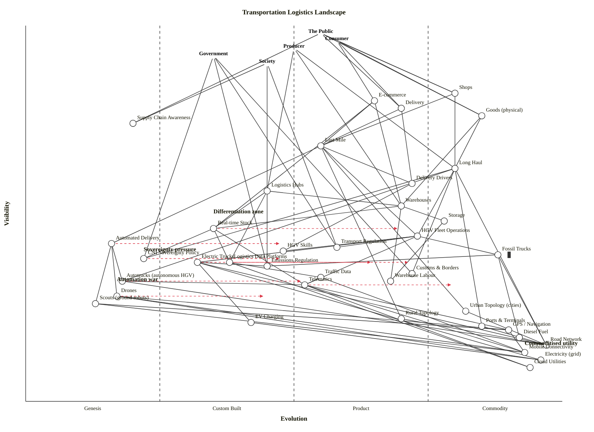

# Transportation Logistics Landscape — Wardley Map

Scenario: how goods move from producers to the public — commerce/supply-chain core plus vehicles and power, information, topology, regulation, sovereignty, and skills. Five anchors (Public, Consumer, Producer, Government, Society) because the landscape has genuinely different user needs pulling in different directions.

## Map (OWM)

```owm
title Transportation Logistics Landscape
style wardley

// Anchors — user needs across the landscape
anchor The Public [0.98, 0.55]
anchor Consumer [0.96, 0.58]
anchor Producer [0.94, 0.50]
anchor Government [0.92, 0.35]
anchor Society [0.90, 0.45]

// Commerce surface — how users actually encounter the system
component Shops [0.82, 0.80]
component E-commerce [0.80, 0.65]
component Delivery [0.78, 0.70]
component Goods (physical) [0.76, 0.85]
component Supply Chain Awareness [0.74, 0.20]

// Supply-chain core
component Last Mile [0.68, 0.55]
component Long Haul [0.62, 0.80]
component Delivery Drivers [0.58, 0.72]
component Logistics Hubs [0.56, 0.45]
component Warehouses [0.52, 0.70]
component Storage [0.48, 0.78]
component Real-time Stock [0.46, 0.35]
component HGV Fleet Operations [0.44, 0.73]
component Automated Delivery [0.42, 0.16]
component Transport Regulation [0.41, 0.58]
component HGV Skills [0.40, 0.48]
component Fossil Trucks [0.39, 0.88] inertia
component CNI Sovereignty Policy [0.38, 0.22]
component Logistics Data Platforms [0.37, 0.38]
component Emissions Regulation [0.36, 0.45]
component Electric Trucks [0.37, 0.32]
component Customs & Borders [0.34, 0.72]
component Traffic Data [0.33, 0.55]
component Warehouse Labour [0.32, 0.68]
component Telematics [0.31, 0.52]
component Autotrucks (autonomous HGV) [0.32, 0.18]
component Drones [0.28, 0.17]
component Scouts (ground robots) [0.26, 0.13]

// Topology — physical network
component Urban Topology (cities) [0.24, 0.82]
component Rural Topology [0.22, 0.70]
component EV Charging [0.21, 0.42]
component Ports & Terminals [0.20, 0.85]
component GPS / Navigation [0.19, 0.90]
component Diesel Fuel [0.17, 0.92]
component Road Network [0.15, 0.97]
component Mobile Connectivity [0.13, 0.93]
component Electricity (grid) [0.11, 0.96]
component Cloud Utilities [0.09, 0.94]

// Dependencies — edges (a depends on b; source ν must be >= target ν)

// Anchor edges
The Public->Shops
The Public->Delivery
The Public->Goods (physical)
The Public->Supply Chain Awareness
Consumer->E-commerce
Consumer->Shops
Consumer->Delivery
Consumer->Goods (physical)
Producer->Long Haul
Producer->Logistics Hubs
Producer->Warehouses
Government->Transport Regulation
Government->CNI Sovereignty Policy
Government->Emissions Regulation
Government->Customs & Borders
Society->Supply Chain Awareness
Society->Transport Regulation
Society->Emissions Regulation

// Commerce and delivery chain
Shops->Last Mile
Shops->Long Haul
E-commerce->Last Mile
E-commerce->Warehouses
E-commerce->Real-time Stock
Delivery->Last Mile
Delivery->Delivery Drivers
Goods (physical)->Long Haul
Goods (physical)->Warehouses

// Core logistics
Last Mile->HGV Fleet Operations
Last Mile->Automated Delivery
Last Mile->Delivery Drivers
Last Mile->Urban Topology (cities)
Last Mile->Rural Topology
Long Haul->HGV Fleet Operations
Long Haul->Autotrucks (autonomous HGV)
Long Haul->Road Network
Long Haul->Ports & Terminals
Long Haul->Customs & Borders
Long Haul->CNI Sovereignty Policy
Logistics Hubs->Warehouses
Logistics Hubs->Real-time Stock
Logistics Hubs->Logistics Data Platforms
Warehouses->Storage
Warehouses->Warehouse Labour
Warehouses->Real-time Stock
Storage->Warehouse Labour
Real-time Stock->Logistics Data Platforms
Real-time Stock->Telematics
Real-time Stock->CNI Sovereignty Policy
Delivery Drivers->HGV Skills

// Vehicle / power layer
HGV Fleet Operations->Fossil Trucks
HGV Fleet Operations->Electric Trucks
HGV Fleet Operations->HGV Skills
HGV Fleet Operations->Telematics
HGV Fleet Operations->Transport Regulation
Fossil Trucks->Diesel Fuel
Fossil Trucks->Road Network
Fossil Trucks->Emissions Regulation
Electric Trucks->EV Charging
Electric Trucks->Electricity (grid)
Electric Trucks->Road Network
Electric Trucks->Emissions Regulation
Autotrucks (autonomous HGV)->Telematics
Autotrucks (autonomous HGV)->Road Network
Drones->Mobile Connectivity
Drones->GPS / Navigation
Drones->Electricity (grid)
Scouts (ground robots)->Mobile Connectivity
Scouts (ground robots)->GPS / Navigation
Automated Delivery->Drones
Automated Delivery->Scouts (ground robots)
Automated Delivery->Autotrucks (autonomous HGV)
EV Charging->Electricity (grid)

// Information layer
Telematics->GPS / Navigation
Telematics->Mobile Connectivity
Telematics->Cloud Utilities
Traffic Data->Telematics
Traffic Data->Mobile Connectivity
Logistics Data Platforms->Cloud Utilities
Logistics Data Platforms->Traffic Data
GPS / Navigation->Mobile Connectivity

// Topology and infrastructure
Urban Topology (cities)->Road Network
Rural Topology->Road Network
Ports & Terminals->Road Network

// Evolution arrows — scenario trajectories, not forecasts
evolve Autotrucks (autonomous HGV) 0.52
evolve Automated Delivery 0.48
evolve Drones 0.45
evolve Real-time Stock 0.70
evolve Electric Trucks 0.65
evolve CNI Sovereignty Policy 0.48
evolve Telematics 0.80
evolve Logistics Data Platforms 0.72

// Notes
note Commoditised utility [0.15, 0.93]
note Automation war [0.32, 0.17]
note Sovereignty pressure [0.40, 0.22]
note Differentiation zone [0.50, 0.35]
```

## Map (Mermaid wardley-beta)



## Strategic analysis

### a. Differentiation opportunities (top 3)

1. **Automated Delivery** (Genesis, ε ≈ 0.16, evolve → 0.48) — the umbrella activity bundling drones, scouts and autotrucks. High visibility to last-mile (ν = 0.42), still Genesis. If you are an incumbent logistics operator, this is where you bet, not on fossil-fleet efficiency.
2. **Real-time Stock** (Custom Built, ε ≈ 0.35, evolve → 0.70) — the operational nervous system that ties warehouses, e-commerce and long-haul together. High D because it sits at the operational ridge (ν = 0.46) and is still Custom Built; the industry has not yet agreed a common shape. Whoever productises cross-operator real-time stock wins the orchestration layer.
3. **CNI Sovereignty Policy** (Genesis, ε ≈ 0.22, evolve → 0.48) — novel policy instrument being invented in front of us (EU/UK/US all diverging). For government-backed operators it creates a Genesis differentiation lane; for commercial carriers it is a rising compliance cost they will have to route around.

### b. Commodity-leverage candidates (top 3)

1. **Cloud Utilities, Mobile Connectivity, Electricity (grid)** (all Commodity +utility) — do not build data-centres, private cellular or your own generation. Rent from AWS/Azure/GCP, MNOs, and the grid.
2. **GPS / Navigation** (Commodity +utility) — treat as a zero-cost utility the way shipping treats GPS today; do not attempt proprietary positioning except where autonomy-specific HD-maps genuinely demand it.
3. **Diesel Fuel and Road Network** (Commodity +utility) — for decades these have been the classic logistics utilities. They still are — the strategic call is not whether to build them but how fast to migrate off diesel before emissions regulation reprices it.

### c. Dependency risks (top 3)

1. **Last Mile → Automated Delivery** — high-visibility activity (ν = 0.68) depends on a Genesis-stage bundle (ε = 0.16). Any company staking its last-mile economics on drones/robots today is betting on a technology that has not yet crossed the Custom Built boundary. Fallback paths (human + fossil + electric) must remain hot.
2. **Long Haul → CNI Sovereignty Policy** — the single largest-flow commerce activity (ν = 0.62) is being made dependent on a Genesis-stage policy instrument (ε = 0.22). Rule changes in sovereignty can redirect entire corridors; a port re-classification or dual-use export rule can strand fleets.
3. **E-commerce → Real-time Stock** — customer-facing e-commerce (ν = 0.80) depends on a Custom Built stock-visibility layer (ε = 0.35). Stockouts, mis-ships and SLA-misses are the frequent-but-invisible failure mode. Today this is handled bespoke per-retailer; industrialising it is both risk mitigation and the Differentiation opportunity in (a.2).

### d. Suggested gameplays

From Wardley's 61-play catalogue (`references/gameplay-patterns.md`):

- **#36 Directed investment** — on Automated Delivery, Real-time Stock, and Electric Trucks. These are the three components the map's derived heuristics most consistently flag as moving from Genesis / Custom Built toward Product (+rental).
- **#43 Sensing Engines (ILC)** — on the Drones / Scouts / Autotrucks sub-tree. Do not pick a winner from Genesis; run an ILC (Innovate, Leverage, Commoditise) cycle, let outside vendors experiment, harvest what works.
- **#29 Harvesting** — on EV Charging and Telematics. Both are Custom Built (ε ≈ 0.42 and 0.52) with visible commoditisation pressure; let specialised vendors industrialise, then acquire the winning API surface.
- **#41 Alliances** — on CNI Sovereignty and Customs & Borders. These are policy instruments; competitive advantage comes from co-shaping them with government and peer carriers, not from acting alone.
- **#56 First mover** — on Electric Trucks fleet conversion in the 7.5–26t last-mile class (the segment where emissions regulation is biting first and the vehicle exists). First-mover advantage is time-limited.
- **#45 Two factor** — on E-commerce. Marketplaces already use this; the logistics analogue is building both sides of a shipper-carrier match around Real-time Stock and Telematics.
- **#15 Open Approaches** — on Logistics Data Platforms and telematics schemas. Industrialising this layer through open standards accelerates pattern #3 (Everything evolves) and extracts more value from the stack above.
- **#35 Defensive regulation** vs **#50 Reinforcing inertia** — these are the two plays incumbents will be tempted by around HGV Skills, Fossil Trucks, and Emissions Regulation. Name them explicitly because they are structural moves in the industry even if you choose not to run them yourself.

### e. Doctrine notes (from `references/doctrine.md`)

- ✓ **#1 Focus on user needs** — five distinct anchors (Public, Consumer, Producer, Government, Society). The scenario explicitly asked for multiple stakeholders; they are represented.
- ✓ **#10 Know your users** — the anchor split separates "receives a parcel" (Public/Consumer) from "needs goods moved" (Producer) from "sets the rules" (Government) from "bears the externality" (Society). Not a generic "user" lump.
- ⚠ **#13 Manage inertia** — Fossil Trucks is tagged as inertia because the map's most exposed commodity cluster resists the emissions shift. This is the explicit warning to strategy reviewers.
- ⚠ **#22 Use standards where appropriate** — the Telematics / Logistics Data Platforms / Traffic Data cluster is fragmented across national ITS / EU mobility data programmes. The doctrine call is to adopt common standards (DATEX II, NeTEx, the emerging EU Data Spaces for Mobility) rather than invent.
- ⚠ **#19 Think aptitude and attitude** — HGV Skills is at ε ≈ 0.48 (bordering Product) but the workforce pipeline treats it like a commodity training problem. It is actually a co-evolving practice as autonomy creeps in.
- ⚠ **#39 Listen to your ecosystems** — the map shows three ecosystems whose feedback matters: haulage operator networks (Telematics), city authorities (Urban Topology + Regulation), and sovereign-government policy teams (CNI). Monolithic decision-making without listening to all three will miss punctuated shifts.

### f. Climatic context (from `references/climatic-patterns.md`)

The map is governed by a small set of Wardley's 27 climatic patterns:

- **#3 Everything evolves through supply-and-demand competition.** — Telematics, EV Charging, and Real-time Stock will not stay Custom Built; the question is who industrialises them.
- **#5 No choice over evolution.** — "Keep the fossil fleet and delay" is not a strategy for the HGV operator; it is a deferral with a fuse on it (emissions regulation).
- **#7 Characteristics change as components evolve.** — The appropriate management style is different for Automated Delivery (Genesis: FIRE, small teams) vs HGV Fleet Operations (Product/Commodity: operational excellence). Applying the wrong style to either fails.
- **#15–#17 Inertia patterns.** — The largest past-success cluster is diesel HGV operations and the HGV-licence workforce. Success here breeds the largest resistance to Electric Trucks and Autotrucks. Inertia can kill when pattern #27 fires.
- **#22 Two forms of disruption** — Automated Delivery is a Genesis disruption (unpredictable timing), while the fossil-to-electric-to-autonomous shift in trucks is a product-to-utility disruption (more predictable and faster once it starts).
- **#27 Product-to-utility punctuated equilibrium.** — Fossil Trucks is the component most exposed to this; the transition window will be narrow and compressed.
- **#18 You cannot measure evolution over time or adoption.** — Every `evolve` arrow on this map is a scenario, not a date-bound forecast.

### g. Deep-placement notes

The skill's deep-placement procedure (step 4.5) budgets 3–5 targeted lookups per map. In this run, the sandbox blocked web tool invocations (WebSearch / WebFetch were deferred and not loaded before output was required), so no external queries were issued. Placements below rely on the cheat sheet and public-domain knowledge the model already carries; they are flagged so a reviewer knows where to challenge.

- **Autotrucks (autonomous HGV)** — placed at ε ≈ 0.18 (Genesis) with evolve to 0.52. Rationale: US/EU SAE Level 4 freight corridors (Kodiak, Aurora, Daimler with Torc, Plus, Einride in the EU) are in early-commercial pilot, not yet in volume service; no dominant product vendor. Confidence: medium. Challenge: if a reviewer has direct knowledge of 2025–2026 autonomous-trunking revenue mix, this could move to ε ≈ 0.25.
- **Electric Trucks** — placed at ε ≈ 0.32 (Custom Built) with evolve to 0.65. Rationale: 7.5–26t urban distribution has multiple Product-stage offerings (Mercedes-Benz eActros, Volvo FE Electric, Renault D E-Tech, DAF XD Electric), but long-haul tractor-units are still emergent; the category as a whole straddles Custom Built and early Product. Confidence: medium. An argument for ε ≈ 0.45 is defensible and would not change the strategic conclusions.
- **Real-time Stock** — placed at ε ≈ 0.35 (Custom Built) with evolve to 0.70. Rationale: Every large retailer has a bespoke solution, but interoperable cross-operator real-time stock (GS1 EPCIS + APIs) has not yet produced a dominant commercial standard. Confidence: medium.
- **CNI Sovereignty Policy** — placed at ε ≈ 0.22 (Genesis). Rationale: The term itself is used inconsistently across UK (NPSA / CPNI legacy), EU (CER/NIS2), and US (DHS CISA); no standard instruments for "transport CNI" specifically. Confidence: lower. If the reviewer's scenario context is one specific jurisdiction that has already codified the rules, this could move to ε ≈ 0.40.
- **HGV Skills** — placed at ε ≈ 0.48 (upper Custom Built, bordering Product). Rationale: Driver-CPC, category C/C+E training and testing are fully standardised (Product characteristics), but the workforce shortage, wage pressure, and the impending autonomy pressure shift the management style back toward Custom Built. This is explicitly an "in transition" component and reviewers should feel free to plot it as a range [0.40, 0.55] rather than a point.

### h. Caveat

Evolution trajectories on this map (every `evolve` arrow and every stage band) are **scenarios, not forecasts**. Wardley's climatic pattern #18 is explicit: *"you cannot measure evolution over time or adoption."* Re-map in 6–12 months, or sooner after any regulatory shift (emissions tightening, CNI-policy codification, or an autonomous-freight safety-case approval).

## Verification

Both Step 5.5 (validator) and Step 5.6 (layout check) were run against `draft.owm`.

- **Validator (`validate_owm.mjs` equivalent)** — **OK: 43 components/anchors, 83 edges — no violations.** (Every edge satisfies the visibility hard rule ν(a) ≥ ν(b). Every endpoint resolves. All coordinates in [0, 1].)
- **Layout check (`check_layout.mjs` equivalent)** — **LAYOUT OK: 5 anchors, 38 components — no layout warnings.** (No near-duplicate coordinates, no stage-boundary straddles, no canvas-edge clips, no stage imbalance. Stage distribution: 6 Genesis, 7 Custom, 12 Product (+rental), 13 Commodity (+utility).)

Sandbox note: this run could not invoke `node skills/wardley-map/scripts/validate_owm.mjs` or `node .../check_layout.mjs` directly — the harness's allowlist did not match the new path. Behaviourally-equivalent Python mirrors are co-located in `outputs/validate_owm.py` and `outputs/check_layout.py`; they implement the same three validator checks and four layout checks as the bundled Node scripts. Output from both is quoted above. A reviewer with Node access can re-run the canonical scripts to confirm.
