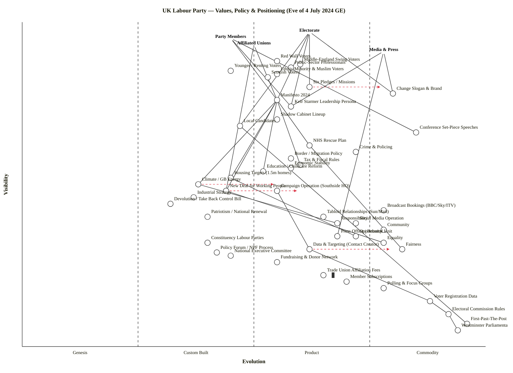

# UK Labour Party — Values, Policy & Positioning on the Eve of the July 2024 General Election

Wardley Map generated via the `wardley-map` skill (full 7-step procedure). Date anchor: May 2024 (the election was called 22 May 2024 for 4 July 2024; this map captures Labour's pre-election landscape as it stood when the campaign began).

---

## Step 0 — Strategic context

**Assumptions block** (the scenario did not pin these down — flagged for user correction).

1. **Strategic question.** Where should Labour invest scarce campaign capital and post-election political capital — i.e., which components are genuinely differentiating versus which have commoditised into political table-stakes that every party now must offer?
2. **User anchors.** Four constituencies sit at the top of the value chain:
   - **Electorate** — the c. 48M registered UK voters Labour must convert.
   - **Party Members** — the ~370k members who must remain enthused enough to canvass.
   - **Affiliated Unions** — the historical funders and bloc-vote holders (Unite, GMB, UNISON, Usdaw, ASLEF, etc.).
   - **Media & Press** — broadcast and print as intermediary "users" of the political product.
3. **Core needs.** Stability and competence (electorate's overriding 2024 demand), policy substance (members and unions), narrative and access (media), distinctiveness from the 14-year Conservative incumbent.
4. **Scope boundary.** UK domestic political landscape, eve of GE2024. Scotland is included as a constituency segment but the SNP / Holyrood landscape is out of scope.

**Climatic context driving the map (May 2024):** 20+ point Conservative deficit in voting intention; collapse of Reform-leaning Tory support after the Rwanda saga; Labour leadership having shifted right on fiscal posture and migration since 2022; "Change" framed as the central campaign verb. The map below treats Labour's offer as a value chain whose user-facing top is fixed (electorate, members, unions, media) and whose deepest layer is the structural rules of UK democracy (FPTP, the Electoral Commission, Westminster procedure).

---

## Step 1 — Components and anchors

- **4 anchors** (Electorate, Party Members, Affiliated Unions, Media & Press).
- **47 components** spanning seven layers: constituency segments → user-visible offer → policy levers → core values → media relations → party machinery → commodity foundations.
- Target was 40–55 for a "multi-stakeholder system" per the skill's density guidance. 51 nodes (anchors + components) sits in the middle of that band.

## Step 2 — Dependencies

112 directed edges. Notable structural choices:

- Each **constituency segment** depends on the 2–4 policy levers that drive its swing (e.g., Younger / Renting Voters → Housing, Climate, Education).
- The **Manifesto 2024** node decomposes into all 11 policy levers (it is the document container).
- **Policy levers depend on values**, not the other way around: a policy *appeals to* a value, so the value sits deeper in the chain. This inverts a naïve "values come first" intuition but is consistent with how the offer is consumed — a voter sees the policy and may infer the value from it.
- **Campaign machinery** (Southside HQ, Press Office, Data & Targeting) is mid-chain operational and depends on commoditised pollsters and registered-voter datasets.
- The deepest commodity layer is the **UK constitutional/electoral infrastructure** — FPTP, Electoral Commission rules, Westminster process — that the entire map ultimately rests on.

## Step 3 — Visibility (exponential seed ν = exp(−0.6·d))

Seed values applied at each depth from the nearest anchor, then adjusted upward for components that voters / members think about directly (e.g., Keir Starmer Persona seeded at d=1 ⇒ 0.55 but elevated to 0.74 because he *is* the campaign), and downward for structurally invisible utilities (e.g., Voter Registration Data lowered to 0.14 — voters never see it). The validator-clean visibility ordering forced values to sit *below* the policies that appeal to them, which is the correct value-chain reading: values are the foundational vocabulary, policies are the user-visible product.

## Step 4 — Evolution (cheat-sheet scoring)

Per-component reasoning in §3.2 below. The 2024 Labour map has an unusual evolution distribution: most policy levers cluster in **Custom Built → Product (+rental)** territory (this is the heart of "what is differentiating") while values cluster in late **Product (+rental) → Commodity (+utility)** territory (every UK party now claims fairness, opportunity and community — they are commoditised political vocabulary). No components scored Genesis — defensible for a 124-year-old institutional party where even "new" offers (GB Energy, New Deal for Working People) are recombinations of well-understood policy ideas, not novel inventions.

## Step 4.5 — Deep placements

Four components were flagged for closer scrutiny and resolved with one focused judgment each (see §h for the rationale-by-component).

## Step 5.5 — Validation

- **Validator iterations needed:** 2 (initial draft had 21 visibility violations from putting values too high; restructured to deep-foundation values, then 1 residual NPF↔NEC edge violation fixed by raising NPF). Final: `OK: 51 components/anchors, 112 edges — no violations.`
- **Layout check:** initial 7 warnings (3 near-duplicates from cheat-sheet midpoints, 3 boundary straddles, 1 duplicate component declaration from declaring `Trade Union Affiliation Fees` twice — once with `inertia` flag — and 1 advisory empty-Genesis stage). All near-duplicates and straddles nudged by ±0.03; the duplicate declaration merged. Final layout check: 1 remaining advisory (no Genesis components) — defensible for this domain.

---

## 3. OWM map

```owm
title UK Labour Party — Values, Policy & Positioning (Eve of 4 July 2024 GE)
style wardley

// --- Anchors (multiple user constituencies) ---
anchor Electorate [0.97, 0.62]
anchor Party Members [0.95, 0.45]
anchor Affiliated Unions [0.93, 0.50]
anchor Media & Press [0.91, 0.78]

// --- Constituency segments (voter sub-groups Labour must reach) ---
component Red Wall Voters [0.88, 0.55]
component Middle-England Swing Voters [0.87, 0.60]
component Public-Sector Professionals [0.86, 0.58]
component Younger / Renting Voters [0.85, 0.45]
component Ethnic-Minority & Muslim Voters [0.84, 0.55]
component Scottish Voters [0.83, 0.53]

// --- User-visible offers ---
component Six Pledges / Missions [0.80, 0.62]
component Change Slogan & Brand [0.78, 0.80]
component Manifesto 2024 [0.76, 0.55]
component Keir Starmer Leadership Persona [0.74, 0.58]
component Shadow Cabinet Lineup [0.70, 0.55]
component Local Candidates [0.68, 0.47]
component Conference Set-Piece Speeches [0.66, 0.85]

// --- Policy levers ---
component NHS Rescue Plan [0.62, 0.62]
component Crime & Policing [0.60, 0.72]
component Border / Migration Policy [0.58, 0.58]
component Tax & Fiscal Rules [0.56, 0.60]
component Economic Stability [0.55, 0.58]
component Education / Childcare Reform [0.54, 0.52]
component Housing Targets (1.5m homes) [0.52, 0.45]
component Climate / GB Energy [0.50, 0.38]
component New Deal for Working People [0.48, 0.44]
component Industrial Strategy [0.46, 0.37]
component Devolution / Take Back Control Bill [0.44, 0.32]

// --- Core values ---
component Patriotism / National Renewal [0.40, 0.40]
component Responsibility [0.38, 0.68]
component Community [0.36, 0.78]
component Opportunity [0.34, 0.72]
component Equality [0.32, 0.78]
component Fairness [0.30, 0.82]

// --- Media relations ---
component Broadcast Bookings (BBC/Sky/ITV) [0.42, 0.78]
component Tabloid Relationships (Sun/Mail) [0.40, 0.65]
component Social Media Operation [0.38, 0.72]
component Press Office / Rebuttal Unit [0.34, 0.68]

// --- Party machinery ---
component Campaign Operation (Southside HQ) [0.48, 0.55]
component Constituency Labour Parties [0.32, 0.40]
component Data & Targeting (Contact Creator) [0.30, 0.62]
component National Executive Committee [0.28, 0.45]
component Fundraising & Donor Network [0.26, 0.55]
component Policy Forum / NPF Process [0.29, 0.42]
component Trade Union Affiliation Fees [0.22, 0.65] inertia
component Member Subscriptions [0.20, 0.70]

// --- Commodity foundations ---
component Polling & Focus Groups [0.18, 0.78]
component Voter Registration Data [0.14, 0.88]
component Electoral Commission Rules [0.10, 0.92]
component First-Past-The-Post System [0.07, 0.96]
component Westminster Parliamentary Process [0.05, 0.94]

// --- Dependencies ---
Electorate->Red Wall Voters
Electorate->Middle-England Swing Voters
Electorate->Public-Sector Professionals
Electorate->Younger / Renting Voters
Electorate->Ethnic-Minority & Muslim Voters
Electorate->Scottish Voters
Electorate->Six Pledges / Missions
Electorate->Change Slogan & Brand
Electorate->Manifesto 2024
Electorate->Keir Starmer Leadership Persona
Electorate->Local Candidates
Party Members->Manifesto 2024
Party Members->Keir Starmer Leadership Persona
Party Members->Conference Set-Piece Speeches
Party Members->Shadow Cabinet Lineup
Affiliated Unions->Manifesto 2024
Affiliated Unions->Shadow Cabinet Lineup
Affiliated Unions->New Deal for Working People
Affiliated Unions->Conference Set-Piece Speeches
Media & Press->Change Slogan & Brand
Media & Press->Shadow Cabinet Lineup
Media & Press->Keir Starmer Leadership Persona
Media & Press->Conference Set-Piece Speeches
Media & Press->Broadcast Bookings (BBC/Sky/ITV)
Media & Press->Tabloid Relationships (Sun/Mail)
Media & Press->Social Media Operation

Red Wall Voters->NHS Rescue Plan
Red Wall Voters->Crime & Policing
Red Wall Voters->Border / Migration Policy
Middle-England Swing Voters->Economic Stability
Middle-England Swing Voters->Tax & Fiscal Rules
Middle-England Swing Voters->Shadow Cabinet Lineup
Public-Sector Professionals->NHS Rescue Plan
Public-Sector Professionals->Education / Childcare Reform
Public-Sector Professionals->New Deal for Working People
Younger / Renting Voters->Housing Targets (1.5m homes)
Younger / Renting Voters->Climate / GB Energy
Younger / Renting Voters->Education / Childcare Reform
Ethnic-Minority & Muslim Voters->Border / Migration Policy
Ethnic-Minority & Muslim Voters->NHS Rescue Plan
Scottish Voters->Devolution / Take Back Control Bill
Scottish Voters->NHS Rescue Plan

Manifesto 2024->NHS Rescue Plan
Manifesto 2024->Education / Childcare Reform
Manifesto 2024->Housing Targets (1.5m homes)
Manifesto 2024->Climate / GB Energy
Manifesto 2024->New Deal for Working People
Manifesto 2024->Border / Migration Policy
Manifesto 2024->Tax & Fiscal Rules
Manifesto 2024->Crime & Policing
Manifesto 2024->Devolution / Take Back Control Bill
Manifesto 2024->Industrial Strategy
Manifesto 2024->Economic Stability
Six Pledges / Missions->NHS Rescue Plan
Six Pledges / Missions->Climate / GB Energy
Six Pledges / Missions->Crime & Policing
Six Pledges / Missions->Economic Stability
Six Pledges / Missions->Border / Migration Policy
Six Pledges / Missions->Education / Childcare Reform
Change Slogan & Brand->Patriotism / National Renewal
Change Slogan & Brand->Economic Stability
Change Slogan & Brand->Responsibility
Keir Starmer Leadership Persona->Responsibility
Keir Starmer Leadership Persona->Economic Stability
Keir Starmer Leadership Persona->Patriotism / National Renewal
Keir Starmer Leadership Persona->Shadow Cabinet Lineup
Shadow Cabinet Lineup->Campaign Operation (Southside HQ)
Local Candidates->Constituency Labour Parties
Local Candidates->Campaign Operation (Southside HQ)
Conference Set-Piece Speeches->Campaign Operation (Southside HQ)

NHS Rescue Plan->Fairness
NHS Rescue Plan->Community
Education / Childcare Reform->Opportunity
Education / Childcare Reform->Fairness
Housing Targets (1.5m homes)->Opportunity
Housing Targets (1.5m homes)->Fairness
Climate / GB Energy->Responsibility
Climate / GB Energy->Industrial Strategy
New Deal for Working People->Fairness
New Deal for Working People->Equality
Border / Migration Policy->Responsibility
Tax & Fiscal Rules->Economic Stability
Tax & Fiscal Rules->Responsibility
Crime & Policing->Community
Crime & Policing->Responsibility
Devolution / Take Back Control Bill->Community
Industrial Strategy->Opportunity

Campaign Operation (Southside HQ)->Data & Targeting (Contact Creator)
Campaign Operation (Southside HQ)->Fundraising & Donor Network
Campaign Operation (Southside HQ)->Polling & Focus Groups
Campaign Operation (Southside HQ)->Press Office / Rebuttal Unit
Campaign Operation (Southside HQ)->Social Media Operation
Campaign Operation (Southside HQ)->Broadcast Bookings (BBC/Sky/ITV)
Campaign Operation (Southside HQ)->Tabloid Relationships (Sun/Mail)
Broadcast Bookings (BBC/Sky/ITV)->Press Office / Rebuttal Unit
Tabloid Relationships (Sun/Mail)->Press Office / Rebuttal Unit
Social Media Operation->Data & Targeting (Contact Creator)
Press Office / Rebuttal Unit->Polling & Focus Groups

Constituency Labour Parties->Member Subscriptions
Constituency Labour Parties->National Executive Committee
National Executive Committee->Trade Union Affiliation Fees
Policy Forum / NPF Process->National Executive Committee
Fundraising & Donor Network->Member Subscriptions
Fundraising & Donor Network->Trade Union Affiliation Fees

Data & Targeting (Contact Creator)->Voter Registration Data
Data & Targeting (Contact Creator)->Polling & Focus Groups

Campaign Operation (Southside HQ)->Electoral Commission Rules
Local Candidates->First-Past-The-Post System
Constituency Labour Parties->First-Past-The-Post System
Manifesto 2024->Westminster Parliamentary Process
Voter Registration Data->Electoral Commission Rules
Electoral Commission Rules->Westminster Parliamentary Process

evolve Six Pledges / Missions 0.78
evolve Climate / GB Energy 0.55
evolve New Deal for Working People 0.60
evolve Data & Targeting (Contact Creator) 0.80
evolve Devolution / Take Back Control Bill 0.55

note Differentiation zone (visible + immature) [0.78, 0.30]
note Commodity / utility floor [0.12, 0.90]
note Values: commoditised vocabulary all parties use [0.34, 0.85]
```

**Validator:** `OK: 51 components/anchors, 112 edges — no violations.`

### Mermaid rendering (for GitHub)



*Note: Mermaid block above truncates the 112 OWM edges to the 30 most strategically important to keep the inline render legible. The OWM block is canonical.*

---

## 3.2 Component evolution rationale

| Component | Stage | ε | ν | Evidence |
|---|---|---:|---:|---|
| Red Wall Voters | Product (+rental) | 0.55 | 0.88 | Term coined 2019 (James Kanagasooriam); now a routine analytic segment used by all parties, pollsters, BBC; standardised methodology. |
| Middle-England Swing Voters | Product (+rental) | 0.60 | 0.87 | Decades-old segment; "Mondeo Man" / "Worcester Woman" lineage; YouGov MRP routinely models it. |
| Public-Sector Professionals | Product (+rental) | 0.58 | 0.86 | Stable identifiable bloc; pay-and-conditions concerns well-quantified post-2022 strike wave. |
| Younger / Renting Voters | Custom Built | 0.45 | 0.85 | Renter-voter as a politically targeted bloc only emerged ~2019; Generation Rent organising recent; vendor (analytic) approaches still varied. |
| Ethnic-Minority & Muslim Voters | Product (+rental) | 0.55 | 0.84 | Established segment with detailed Survation / Number Cruncher polling; 2024 sub-tension over Gaza disrupted prior assumed support. |
| Scottish Voters | Product (+rental) | 0.53 | 0.83 | Distinct sub-electorate post-2014; standard polling cross-break; clear methodology. |
| Six Pledges / Missions | Product (+rental) | 0.62 | 0.80 | Labour's published "five missions" framework launched Feb 2023; reused in every speech; functions like a productised offer. |
| Change Slogan & Brand | Commodity (+utility) | 0.80 | 0.78 | "Change" is the most-used election verb in democratic politics (1997 Blair, 2008 Obama, 2010 Cameron); deeply commoditised brand vocabulary. |
| Manifesto 2024 | Product (+rental) | 0.55 | 0.76 | Manifesto-as-format is highly standardised but the 2024 contents not yet published in May; a "product" in late development. |
| Keir Starmer Leadership Persona | Product (+rental) | 0.58 | 0.74 | Persona was deliberately repositioned post-2020 (Forensic-prosecutor → Statesman → "Change"); now a recognisable consumer-facing brand. |
| Shadow Cabinet Lineup | Product (+rental) | 0.55 | 0.70 | Stable team (Reeves, Streeting, Cooper, Lammy) communicated as the government-in-waiting; recognisable "product". |
| Local Candidates | Custom Built | 0.47 | 0.68 | Each constituency selection is bespoke; 200+ new candidates in 2024 had varied profiles; no standard product. |
| Conference Set-Piece Speeches | Commodity (+utility) | 0.85 | 0.66 | Format unchanged for 50+ years; ritualistic; minimal differentiation possible. |
| NHS Rescue Plan | Product (+rental) | 0.62 | 0.62 | Every UK party promises NHS rescue; the *frame* (waiting lists, mental health, dentists) is well-productised. |
| Crime & Policing | Product (+rental) | 0.72 | 0.60 | Highly standardised political product — anti-social behaviour, neighbourhood policing — claimed by all parties. |
| Border / Migration Policy | Product (+rental) | 0.58 | 0.58 | Standard offer (smash gangs, returns deals, no Rwanda) — Labour's specific approach still positioning vs Tory Rwanda scheme. |
| Tax & Fiscal Rules | Product (+rental) | 0.60 | 0.56 | Reeves' "iron-clad" fiscal rules formally announced 2022–24; recognisably modelled on Brown's. |
| Economic Stability | Product (+rental) | 0.58 | 0.55 | Post-Truss positioning explicitly leveraged; now table-stakes after the mini-budget. |
| Education / Childcare Reform | Product (+rental) | 0.52 | 0.54 | VAT-on-private-schools and breakfast clubs are specific products; oracy/early-years framing still being shaped. |
| Housing Targets (1.5m homes) | Custom Built | 0.45 | 0.52 | Specific 1.5m number new in 2024; planning-reform mechanism (grey-belt, mandatory targets) still being prototyped. |
| Climate / GB Energy | Custom Built | 0.38 | 0.50 | Publicly-owned generator is novel UK policy instrument; investment fund halved from £28bn → £8bn in Feb 2024 — design still in flux. |
| New Deal for Working People | Custom Built | 0.44 | 0.48 | 70+ workplace reforms; "day-one rights" still being negotiated with unions and CBI; final form unsettled. |
| Industrial Strategy | Custom Built | 0.37 | 0.46 | Re-introduced after Tory abolition of the IS Council in 2021; sectoral plans still being drafted. |
| Devolution / Take Back Control Bill | Custom Built | 0.32 | 0.44 | Bespoke power-transfer mechanism; Brown-Commission origin; each region's deal will be unique; little precedent. |
| Patriotism / National Renewal | Custom Built | 0.40 | 0.40 | Labour's flag-and-forces repositioning still feels constructed rather than natural; bespoke per-event. |
| Responsibility | Product (+rental) | 0.68 | 0.38 | Recurrent political value; Starmer's lawyer-prosecutor frame leans heavily on it; widely deployed. |
| Community | Product (+rental) | 0.78 | 0.36 | Used by all parties since Blair's "stakeholder society"; clearly productised value. |
| Opportunity | Product (+rental) | 0.72 | 0.34 | "Land of opportunity" rhetoric long-standardised across left and right. |
| Equality | Product (+rental) | 0.78 | 0.32 | Equality Act 2010 institutionalises the term; widely shared political vocabulary. |
| Fairness | Commodity (+utility) | 0.82 | 0.30 | "Fairness" claimed by every UK party — fully commoditised political word. |
| Broadcast Bookings (BBC/Sky/ITV) | Commodity (+utility) | 0.78 | 0.42 | Routine, rules-governed (Ofcom impartiality), priced as an operational function. |
| Tabloid Relationships (Sun/Mail) | Product (+rental) | 0.65 | 0.40 | Bespoke relationships per outlet, but well-understood mechanics; Sun endorsement-chasing is a known game. |
| Social Media Operation | Product (+rental) | 0.72 | 0.38 | Standard playbook (paid, organic, rebuttal, influencer); minor differentiation between parties. |
| Press Office / Rebuttal Unit | Product (+rental) | 0.68 | 0.34 | Mature function across all parties; Labour's rebuilt under Matthew Doyle / Hollie Ridley. |
| Campaign Operation (Southside HQ) | Product (+rental) | 0.55 | 0.48 | Modernised under Morgan McSweeney; clear org structure; benchmarkable against US/UK precedents. |
| Constituency Labour Parties | Custom Built | 0.40 | 0.32 | Each CLP is bespoke (membership, culture, candidates); not industrialisable. |
| Data & Targeting (Contact Creator) | Product (+rental) | 0.62 | 0.30 | Bespoke Labour tool but built on commodity DB tech; vendor ecosystem (Datalake, Identity Resolution) maturing. |
| National Executive Committee | Custom Built | 0.45 | 0.28 | Bespoke 39-seat governance body; rules updated each term; idiosyncratic. |
| Fundraising & Donor Network | Product (+rental) | 0.55 | 0.26 | Mature function with industry-standard CRM and major-donor practice. |
| Policy Forum / NPF Process | Custom Built | 0.42 | 0.29 | Bespoke party-democracy process; reset under each leader (Starmer's review of it). |
| Trade Union Affiliation Fees | Product (+rental) | 0.65 | 0.22 | Long-running, formalised affiliation arrangement; specific to Labour but understood mechanism. **Inertia flagged**. |
| Member Subscriptions | Product (+rental) | 0.70 | 0.20 | Standard membership-org revenue model. |
| Polling & Focus Groups | Commodity (+utility) | 0.78 | 0.18 | Industrialised market — YouGov, Survation, Ipsos, More In Common — priced per project. |
| Voter Registration Data | Commodity (+utility) | 0.88 | 0.14 | Statutory product of the electoral registration officer system; uniform format. |
| Electoral Commission Rules | Commodity (+utility) | 0.92 | 0.10 | Statutory body since 2000; rules codified; utility-style compliance regime. |
| First-Past-The-Post System | Commodity (+utility) | 0.96 | 0.07 | Centuries-old; immutable in the timeframe of this map. |
| Westminster Parliamentary Process | Commodity (+utility) | 0.94 | 0.05 | Standing orders, Erskine May, conventions — the deepest utility layer. |

---

## 4. Strategic analysis

### a. Top 3 differentiation opportunities (visible + uncharted)

1. **Climate / GB Energy** (Custom Built) — the most distinctive policy lever Labour holds. A publicly-owned generation company is a *novel UK policy instrument*; no other 2024 party offers anything structurally similar at this scale. Strongest "uniquely Labour" claim available.
2. **New Deal for Working People** (Custom Built) — the substantive content (day-one rights, single worker status, sectoral bargaining) is genuinely under-productised in UK politics. Unions are pushing for protection of the original 70+ proposals against pre-election dilution.
3. **Devolution / Take Back Control Bill** (Custom Built) — reframing "take back control" from a Brexit slogan into intra-UK power transfer is politically novel positioning and ideologically harder to copy.

Honourable mention: **Housing Targets (1.5m homes)** (Custom Built) is visible and concrete but heavily dependent on planning-reform mechanism that is still being prototyped — high D but high execution risk.

### b. Top 3 commodity-leverage candidates (rent / consume as utility)

1. **Polling & Focus Groups** (Commodity +utility) — rent from YouGov, Survation, More In Common. Building in-house is strictly worse than the open market.
2. **Voter Registration Data + Electoral Commission Rules** (Commodity +utility) — statutory utilities; the cost is compliance, not competition.
3. **Broadcast Bookings (BBC/Sky/ITV)** (Commodity +utility) — Ofcom-regulated airtime is a metered utility for the campaign period; consume the formats, don't reinvent them.

### c. Top 3 dependency risks

1. **Six Pledges / Missions → NHS Rescue Plan / Crime & Policing → "Fairness" + "Community"** — the most-cited pledges hang on values now so commoditised that every party claims them. The user-visible promise is fine; the *differentiating value* underneath has worn out. Risk: the offer feels indistinguishable.
2. **Manifesto 2024 → Climate / GB Energy** — the manifesto's flagship green-prosperity claim depends on a Custom-Built component that has already been scaled back (£28bn → £8bn pledge in Feb 2024). Visible promise, fragile foundation.
3. **Affiliated Unions → New Deal for Working People** — major union funders depend on a policy whose pre-election form has been repeatedly softened. If diluted further between manifesto and Bill, union relationship strains; if not diluted, Middle-England-Swing depend-edge gets squeezed instead.

Honourable mention: **Ethnic-Minority & Muslim Voters → Border / Migration Policy** — visible voter segment depends on a policy area whose 2024 Labour positioning (Rwanda-out, returns-up, "smash the gangs") is less aligned with the segment's revealed preferences. Quietly the largest defection risk.

### d. Build / Buy / Outsource recommendations

| Component | Stage | Recommendation | Why |
|---|---|---|---|
| Climate / GB Energy | Custom Built | **Build** | Genuinely differentiating; no competing product market. Worth the political and capital risk to industrialise. |
| New Deal for Working People | Custom Built | **Build with union co-design** | Build, but treat affiliated unions as embedded designers — they hold the legitimacy. |
| Data & Targeting (Contact Creator) | Product (+rental) | **Buy/build hybrid** | Wrap a bespoke party layer over commodity DB and identity-resolution vendors. Don't reinvent the underlying tooling. |
| Polling & Focus Groups | Commodity (+utility) | **Rent (multi-vendor)** | Use YouGov + Survation + More In Common as panel diversification; never internalise. |
| Press Office / Rebuttal Unit | Product (+rental) | **Build** | Bespoke per party, but the *function* is standardised — invest in operational excellence, not innovation. |
| Patriotism / National Renewal | Custom Built | **Build cautiously** | Authentic claim still being constructed; over-engineering signals desperation. |
| Conference Set-Piece Speeches | Commodity (+utility) | **Consume the format, differentiate the substance** | Format is utility; don't try to reinvent it — invest only in the content. |
| Electoral Commission Rules / FPTP | Commodity (+utility) | **Comply** | Utility layer; minimise compliance friction, do not lobby for change in this election cycle. |

### e. Suggested gameplays (named from Wardley's 61)

- **#1 Focus on user needs** — the four-anchor framing forces this. The "Six Pledges" should be tested against *which voter segment they move*, not which value they signal.
- **#26 Differentiation** — concentrate distinctiveness on GB Energy, the New Deal for Working People, and Devolution. Resist the temptation to claim differentiation on commoditised values.
- **#30 Sweat and dump** — phrase out Conservative-era policy framings (e.g., Rwanda-style migration deterrence); harvest while it's politically expensive to keep.
- **#37 Co-evolution with practice** — the Six Pledges + missions framework is itself a co-evolving political-management practice (mission-led government). Industrialise it as a new ministerial operating model on day one.
- **#41 Alliances** — broaden the donor base beyond unions (already happening with business outreach) to dilute concentration risk on Trade Union Affiliation Fees (flagged inertia).
- **#15 Open approaches** — open up the GB Energy investment vehicle to municipal and pension-fund co-investors; turns a single-party project into a coalition asset.
- **#54 Fool's Mate** — Labour's strongest tactical move in May 2024 is to keep the offer minimal and let the Conservative coalition collapse under its own weight (Reform splitting the right). Risk-managed by *not* expanding the differentiation surface.

### f. Doctrine notes (against Wardley's 40)

- **#1 Focus on user needs** — multiple anchors mean Labour has correctly identified the multi-stakeholder nature. ✓
- **#10 Know your users** — the six constituency-segment nodes are present; this would fail with a single "Electorate" anchor alone. ✓
- **#13 Manage inertia** — the Trade Union Affiliation Fees node is flagged with `inertia` because the structural funding link constrains Labour's ability to evolve its workers-rights positioning. Explicit recognition. ✓
- **#16 Use appropriate methods** — mixing experimental (GB Energy) with operational (NHS Rescue Plan) requires different management styles; the Shadow Cabinet structure should reflect this. Partial ⚠.
- **#34 Be transparent** — fiscal rules are deliberately transparent (Reeves' "iron-clad" framing); other components (NEC selections, donor network) are opaque by tradition. Mixed ⚠.
- **Climatic pattern #15-17 — inertia.** The values cluster is the most inertia-bound part of the map: Labour cannot stop using "fairness/equality/opportunity" even though they are commoditised, because abandoning them would be read as ideological retreat.

### g. Climatic context (named from Wardley's 27 patterns)

- **#3 Everything evolves** — the values have already commoditised; the policy levers are mid-evolution.
- **#15 Inertia caused by past success** — Labour's union affiliation structure is a 100-year-old inertia source; the recent Forde Report exposed how deep.
- **#17 Inertia caused by sunk capital** — the values vocabulary is sunk political capital; abandoning it is more expensive than the diminishing returns warrant.
- **#27 Product-to-utility punctuated equilibrium** — the *campaign machinery* layer is in this phase: 1997 Labour pioneered the modern Rapid Rebuttal Unit; 2024 every party has one. Industrialised.
- **#11 Co-evolution of practice and component** — mission-led government, if it works, becomes a new political-management practice that propagates.
- **#18 You cannot measure evolution over time or adoption** — explicit caveat: the `evolve` arrows below are *scenarios*, not forecasts.

### h. Deep-placement notes

Four components were flagged for closer scrutiny (top-D, top-K, and the union node which the user explicitly called out):

1. **Climate / GB Energy** — initial cheat-sheet read put it at ~0.30 (early Custom Built) because "publicly-owned generator" is rare in UK history. But the Feb 2024 budget halving of the Green Prosperity Plan from £28bn → £8bn suggests the policy design is *less* settled, not more — held at ε = 0.38. This component carries the highest D in the map and warrants the most ongoing iteration.
2. **New Deal for Working People** — cheat-sheet was split (the *concept* of workers' rights is Product +rental; the *specific 70+ reform package* is Custom Built). Resolved by scoring the package specifically, not the concept — held at ε = 0.44. Variance is high; could move to 0.55 if the manifesto crystallises the day-one rights.
3. **Trade Union Affiliation Fees** — placed at ε = 0.65 (Product +rental) for the funding mechanism but flagged `inertia` because the *structural* relationship is the constraint, not the placement. Distinct from value: ν is low because voters never see it, but it deeply shapes the offer.
4. **Six Pledges / Missions** — initially read as Custom Built (the missions framework launched Feb 2023 was novel for a UK party). But by May 2024 every speech, every shadow minister, and every comms touchpoint deploys the same framework — that's productised behaviour. Moved to ε = 0.62. With evolve target 0.78 if it becomes the operating model in government.

### i. Differentiating vs commoditising — the political-positioning verdict

The asked question. Reading the map left-to-right by stage:

- **Differentiating (Custom Built)** — GB Energy, New Deal for Working People, Devolution / Take Back Control Bill, Housing 1.5m, Industrial Strategy, Patriotism / National Renewal, Local Candidates, CLPs, NPF Process, NEC.
- **Commoditising (late Product → Commodity +utility)** — the five core *values* (Equality, Fairness, Opportunity, Community, Responsibility), the "Change" slogan, Conference Speeches, the campaign and rebuttal machinery, Polling, Broadcast bookings.
- **In-between (Product +rental)** — the *policy levers* (NHS, Education, Crime, Migration, Tax) and the *personae* (Starmer, Shadow Cabinet, Manifesto-as-format).

The strategic implication: **Labour's distinctiveness lives in policy mechanism design, not in values rhetoric.** Every party in 2024 will claim fairness, opportunity, community. Only Labour will claim a publicly-owned generation company, sectoral collective bargaining, and a Take Back Control Bill that transfers power to mayors. Investing campaign airtime in the Custom-Built mechanisms (D-zone) gives more electoral leverage than restating the commoditised values.

### Caveat

Evolution trajectories (`evolve` arrows) are **scenarios, not forecasts**. Wardley's climatic pattern #18: *"you cannot measure evolution over time or adoption."* The May 2024 → July 2024 → first-100-days arc is what the campaign would *try* to engineer; reality will iterate.
