# UK Labour Party — Values & Policy Landscape (Wardley Map)

**Date anchor:** May 2024 (eve of the 4 July 2024 UK general election).

## Strategic context (Step 0)

1. **Strategic question.** Where in Labour's pre-election value chain does its electoral advantage actually live, and where is its offer commoditising into "what every governing party promises"? The map is built to inform two related decisions: which parts of the offer to keep distinctive (and protect), and which parts to deliberately commoditise (to neutralise risk and dare opponents to argue against them).
2. **User anchors.** Three. (i) **Electorate (swing & base voters)** — the people who will cast a ballot. (ii) **Party Members & Affiliated Unions** — the body that legitimises the leadership and provides money, doorstep labour, and ideological constraint. (iii) **Parliamentary Leadership** — Starmer's leader's office, shadow cabinet, and the operational centre delivering the campaign.
3. **Core needs.** Voters want a credible alternative government on cost-of-living, NHS waiting lists, and competence; members and unions want a Labour government that delivers on workers' rights, public services, and recognisable Labour values; the leadership needs internal discipline and a fundable, deliverable manifesto.
4. **Scope boundary.** Labour's strategic landscape as a political party in the four-to-six weeks before polling day — *not* the UK political landscape as a whole (no Tory, Reform, Lib Dem or SNP components), and *not* a programme-for-government map (no civil service, treasury operations).

### Assumptions (correctable)

- Date anchor is **May 2024**, before the 22 May surprise election call but with the manifesto framework ("Five Missions", *Change* slogan) already in public. The "Green Prosperity Plan (scaled-back)" reflects the February 2024 reversal from £28 bn/yr to the smaller figure.
- "Constituencies" here are electoral segments (Red Wall, swing, etc.), not parliamentary seats. Geographic seat-level targeting sits inside "Constituency Targeting (Battleground Seats)" in the machinery layer.
- Core values are treated as a deep, slow-moving *Knowledge layer* — the things every Labour policy ultimately appeals back to — rather than as a top-of-chain user need. Voters consume policy and narrative; values are the substrate.

---

## OWM map

```owm
title UK Labour Party - Values & Policy Landscape (May 2024, eve of GE)
style wardley

anchor Electorate (Swing & Base Voters) [0.96, 0.62]
anchor Party Members & Affiliated Unions [0.93, 0.45]
anchor Parliamentary Leadership [0.90, 0.55]

// Constituencies
component Red Wall Voters [0.88, 0.55]
component Traditional Labour Base [0.87, 0.70]
component Middle-class Swing Voters [0.86, 0.60]
component Young / First-time Voters [0.84, 0.55]
component Ethnic Minority Voters [0.82, 0.65]
component Scottish Voters (post-SNP) [0.83, 0.45]
component Business & City Donors [0.80, 0.55]

// Policy offer / "missions"
component Change Manifesto Narrative [0.74, 0.45]
component Five Missions Framework [0.72, 0.40]
component NHS Recovery Plan [0.70, 0.65]
component Education Reform (VAT on private schools) [0.66, 0.55]
component Housing & Planning Reform [0.65, 0.47]
component Green Prosperity Plan (scaled-back) [0.62, 0.45]
component New Deal for Working People [0.63, 0.53]
component Industrial Strategy & GB Energy [0.58, 0.35]
component Border Security & Migration Policy [0.68, 0.55]
component Fiscal Rules & Tax Lock [0.70, 0.60]

// Media relations
component Broadcast Media Relations (BBC/ITV/Sky) [0.82, 0.78]
component Print Media Relations (Sun/Times/Mirror) [0.79, 0.82]
component Manifesto Launch & Set Pieces [0.76, 0.70]
component Leader Media Training & Debates [0.62, 0.55]
component Social Media / Influencer Strategy [0.42, 0.45]

// Core values (Knowledge layer)
component Fairness [0.55, 0.82]
component Equality [0.52, 0.80]
component Opportunity [0.50, 0.72]
component Community [0.48, 0.74]
component Responsibility (Fiscal & Civic) [0.46, 0.58]
component Security (Economic & National) [0.44, 0.53]

// Party machinery
component Leader's Office (LOTO) [0.55, 0.42]
component Shadow Cabinet Discipline [0.50, 0.45]
component Candidate Selection (NEC) [0.42, 0.55]
component Constituency Targeting (Battleground Seats) [0.52, 0.70]
component Ground Campaign / GOTV [0.48, 0.78]
component Digital Campaigning & Data Ops [0.45, 0.60]
component Polling & Focus Groups [0.44, 0.78]
component Conference & NEC Governance [0.36, 0.78]
component Party Funding (Unions + Donors) [0.48, 0.70]
component Affiliated Trade Unions [0.46, 0.65]
component Membership Mobilisation [0.42, 0.62]

// Deep machinery / utilities
component Internal Polling Models [0.30, 0.55]
component Voter ID / Canvassing Data (Contact Creator) [0.28, 0.78]
component CCHQ Counter-ops Awareness [0.46, 0.55]
component Electoral Commission Compliance [0.22, 0.88]
component Royal Mail / Leaflet Distribution [0.16, 0.90]
component Electoral Register (data utility) [0.12, 0.92]

// Dependencies
Electorate (Swing & Base Voters)->Red Wall Voters
Electorate (Swing & Base Voters)->Traditional Labour Base
Electorate (Swing & Base Voters)->Middle-class Swing Voters
Electorate (Swing & Base Voters)->Young / First-time Voters
Electorate (Swing & Base Voters)->Ethnic Minority Voters
Electorate (Swing & Base Voters)->Scottish Voters (post-SNP)
Electorate (Swing & Base Voters)->Change Manifesto Narrative
Electorate (Swing & Base Voters)->Broadcast Media Relations (BBC/ITV/Sky)
Electorate (Swing & Base Voters)->Print Media Relations (Sun/Times/Mirror)

Party Members & Affiliated Unions->Conference & NEC Governance
Party Members & Affiliated Unions->Affiliated Trade Unions
Party Members & Affiliated Unions->Membership Mobilisation
Party Members & Affiliated Unions->New Deal for Working People
Party Members & Affiliated Unions->Equality
Party Members & Affiliated Unions->Fairness
Party Members & Affiliated Unions->Community

Parliamentary Leadership->Leader's Office (LOTO)
Parliamentary Leadership->Shadow Cabinet Discipline
Parliamentary Leadership->Five Missions Framework
Parliamentary Leadership->Change Manifesto Narrative
Parliamentary Leadership->Fiscal Rules & Tax Lock
Parliamentary Leadership->Business & City Donors
Parliamentary Leadership->Responsibility (Fiscal & Civic)
Parliamentary Leadership->Security (Economic & National)

Red Wall Voters->NHS Recovery Plan
Red Wall Voters->Border Security & Migration Policy
Red Wall Voters->Housing & Planning Reform
Traditional Labour Base->NHS Recovery Plan
Traditional Labour Base->New Deal for Working People
Traditional Labour Base->Equality
Middle-class Swing Voters->Fiscal Rules & Tax Lock
Middle-class Swing Voters->Education Reform (VAT on private schools)
Middle-class Swing Voters->NHS Recovery Plan
Young / First-time Voters->Housing & Planning Reform
Young / First-time Voters->Green Prosperity Plan (scaled-back)
Ethnic Minority Voters->Equality
Ethnic Minority Voters->NHS Recovery Plan
Scottish Voters (post-SNP)->NHS Recovery Plan
Scottish Voters (post-SNP)->Change Manifesto Narrative
Business & City Donors->Fiscal Rules & Tax Lock
Business & City Donors->Industrial Strategy & GB Energy

Change Manifesto Narrative->Five Missions Framework
Change Manifesto Narrative->Responsibility (Fiscal & Civic)
Change Manifesto Narrative->Security (Economic & National)
Five Missions Framework->NHS Recovery Plan
Five Missions Framework->Education Reform (VAT on private schools)
Five Missions Framework->Housing & Planning Reform
Five Missions Framework->Green Prosperity Plan (scaled-back)
Five Missions Framework->Industrial Strategy & GB Energy
Five Missions Framework->Border Security & Migration Policy

NHS Recovery Plan->Fairness
NHS Recovery Plan->Community
Education Reform (VAT on private schools)->Opportunity
Education Reform (VAT on private schools)->Fairness
Housing & Planning Reform->Opportunity
Housing & Planning Reform->Community
Green Prosperity Plan (scaled-back)->Responsibility (Fiscal & Civic)
Green Prosperity Plan (scaled-back)->Industrial Strategy & GB Energy
New Deal for Working People->Fairness
New Deal for Working People->Equality
Industrial Strategy & GB Energy->Responsibility (Fiscal & Civic)
Border Security & Migration Policy->Security (Economic & National)
Fiscal Rules & Tax Lock->Responsibility (Fiscal & Civic)

Broadcast Media Relations (BBC/ITV/Sky)->Manifesto Launch & Set Pieces
Broadcast Media Relations (BBC/ITV/Sky)->Leader Media Training & Debates
Print Media Relations (Sun/Times/Mirror)->Manifesto Launch & Set Pieces
Manifesto Launch & Set Pieces->Five Missions Framework
Manifesto Launch & Set Pieces->Change Manifesto Narrative
Leader Media Training & Debates->Leader's Office (LOTO)
Digital Campaigning & Data Ops->Social Media / Influencer Strategy

Leader's Office (LOTO)->Shadow Cabinet Discipline
Leader's Office (LOTO)->Polling & Focus Groups
Shadow Cabinet Discipline->Candidate Selection (NEC)
Candidate Selection (NEC)->Conference & NEC Governance
Constituency Targeting (Battleground Seats)->Polling & Focus Groups
Constituency Targeting (Battleground Seats)->Internal Polling Models
Constituency Targeting (Battleground Seats)->Voter ID / Canvassing Data (Contact Creator)
Ground Campaign / GOTV->Voter ID / Canvassing Data (Contact Creator)
Ground Campaign / GOTV->Royal Mail / Leaflet Distribution
Ground Campaign / GOTV->Membership Mobilisation
Digital Campaigning & Data Ops->Voter ID / Canvassing Data (Contact Creator)
Polling & Focus Groups->Internal Polling Models
Internal Polling Models->Voter ID / Canvassing Data (Contact Creator)
Voter ID / Canvassing Data (Contact Creator)->Electoral Register (data utility)
Party Funding (Unions + Donors)->Affiliated Trade Unions
Party Funding (Unions + Donors)->Electoral Commission Compliance
Affiliated Trade Unions->Membership Mobilisation
Membership Mobilisation->Conference & NEC Governance
CCHQ Counter-ops Awareness->Polling & Focus Groups
Electoral Commission Compliance->Electoral Register (data utility)

evolve Voter ID / Canvassing Data (Contact Creator) 0.88
evolve Five Missions Framework 0.62
evolve Green Prosperity Plan (scaled-back) 0.60
evolve Digital Campaigning & Data Ops 0.78

note Differentiation zone [0.75, 0.30]
note Commodity / utility zone [0.18, 0.92]
note Values = shared Knowledge layer [0.50, 0.78]
```

### Mermaid rendering

```mermaid
wardley-beta
title UK Labour Party - Values & Policy Landscape (May 2024, eve of GE)
size [1100, 800]

anchor "Electorate (Swing & Base Voters)" [0.96, 0.62]
anchor "Party Members & Affiliated Unions" [0.93, 0.45]
anchor "Parliamentary Leadership" [0.90, 0.55]

component "Red Wall Voters" [0.88, 0.55]
component "Traditional Labour Base" [0.87, 0.70]
component "Middle-class Swing Voters" [0.86, 0.60]
component "Young / First-time Voters" [0.84, 0.55]
component "Ethnic Minority Voters" [0.82, 0.65]
component "Scottish Voters (post-SNP)" [0.83, 0.45]
component "Business & City Donors" [0.80, 0.55]

component "Change Manifesto Narrative" [0.74, 0.45]
component "Five Missions Framework" [0.72, 0.40]
component "NHS Recovery Plan" [0.70, 0.65]
component "Education Reform (VAT on private schools)" [0.66, 0.55]
component "Housing & Planning Reform" [0.65, 0.47]
component "Green Prosperity Plan (scaled-back)" [0.62, 0.45]
component "New Deal for Working People" [0.63, 0.53]
component "Industrial Strategy & GB Energy" [0.58, 0.35]
component "Border Security & Migration Policy" [0.68, 0.55]
component "Fiscal Rules & Tax Lock" [0.70, 0.60]

component "Broadcast Media Relations (BBC/ITV/Sky)" [0.82, 0.78]
component "Print Media Relations (Sun/Times/Mirror)" [0.79, 0.82]
component "Manifesto Launch & Set Pieces" [0.76, 0.70]
component "Leader Media Training & Debates" [0.62, 0.55]
component "Social Media / Influencer Strategy" [0.42, 0.45]

component "Fairness" [0.55, 0.82]
component "Equality" [0.52, 0.80]
component "Opportunity" [0.50, 0.72]
component "Community" [0.48, 0.74]
component "Responsibility (Fiscal & Civic)" [0.46, 0.58]
component "Security (Economic & National)" [0.44, 0.53]

component "Leader's Office (LOTO)" [0.55, 0.42]
component "Shadow Cabinet Discipline" [0.50, 0.45]
component "Candidate Selection (NEC)" [0.42, 0.55]
component "Constituency Targeting (Battleground Seats)" [0.52, 0.70]
component "Ground Campaign / GOTV" [0.48, 0.78]
component "Digital Campaigning & Data Ops" [0.45, 0.60]
component "Polling & Focus Groups" [0.44, 0.78]
component "Conference & NEC Governance" [0.36, 0.78]
component "Party Funding (Unions + Donors)" [0.48, 0.70]
component "Affiliated Trade Unions" [0.46, 0.65]
component "Membership Mobilisation" [0.42, 0.62]

component "Internal Polling Models" [0.30, 0.55]
component "Voter ID / Canvassing Data (Contact Creator)" [0.28, 0.78]
component "CCHQ Counter-ops Awareness" [0.46, 0.55]
component "Electoral Commission Compliance" [0.22, 0.88]
component "Royal Mail / Leaflet Distribution" [0.16, 0.90]
component "Electoral Register (data utility)" [0.12, 0.92]

"Electorate (Swing & Base Voters)" -> "Red Wall Voters"
"Electorate (Swing & Base Voters)" -> "Traditional Labour Base"
"Electorate (Swing & Base Voters)" -> "Middle-class Swing Voters"
"Electorate (Swing & Base Voters)" -> "Young / First-time Voters"
"Electorate (Swing & Base Voters)" -> "Ethnic Minority Voters"
"Electorate (Swing & Base Voters)" -> "Scottish Voters (post-SNP)"
"Electorate (Swing & Base Voters)" -> "Change Manifesto Narrative"
"Electorate (Swing & Base Voters)" -> "Broadcast Media Relations (BBC/ITV/Sky)"
"Electorate (Swing & Base Voters)" -> "Print Media Relations (Sun/Times/Mirror)"

"Party Members & Affiliated Unions" -> "Conference & NEC Governance"
"Party Members & Affiliated Unions" -> "Affiliated Trade Unions"
"Party Members & Affiliated Unions" -> "Membership Mobilisation"
"Party Members & Affiliated Unions" -> "New Deal for Working People"
"Party Members & Affiliated Unions" -> "Equality"
"Party Members & Affiliated Unions" -> "Fairness"
"Party Members & Affiliated Unions" -> "Community"

"Parliamentary Leadership" -> "Leader's Office (LOTO)"
"Parliamentary Leadership" -> "Shadow Cabinet Discipline"
"Parliamentary Leadership" -> "Five Missions Framework"
"Parliamentary Leadership" -> "Change Manifesto Narrative"
"Parliamentary Leadership" -> "Fiscal Rules & Tax Lock"
"Parliamentary Leadership" -> "Business & City Donors"
"Parliamentary Leadership" -> "Responsibility (Fiscal & Civic)"
"Parliamentary Leadership" -> "Security (Economic & National)"

"Red Wall Voters" -> "NHS Recovery Plan"
"Red Wall Voters" -> "Border Security & Migration Policy"
"Red Wall Voters" -> "Housing & Planning Reform"
"Traditional Labour Base" -> "NHS Recovery Plan"
"Traditional Labour Base" -> "New Deal for Working People"
"Traditional Labour Base" -> "Equality"
"Middle-class Swing Voters" -> "Fiscal Rules & Tax Lock"
"Middle-class Swing Voters" -> "Education Reform (VAT on private schools)"
"Middle-class Swing Voters" -> "NHS Recovery Plan"
"Young / First-time Voters" -> "Housing & Planning Reform"
"Young / First-time Voters" -> "Green Prosperity Plan (scaled-back)"
"Ethnic Minority Voters" -> "Equality"
"Ethnic Minority Voters" -> "NHS Recovery Plan"
"Scottish Voters (post-SNP)" -> "NHS Recovery Plan"
"Scottish Voters (post-SNP)" -> "Change Manifesto Narrative"
"Business & City Donors" -> "Fiscal Rules & Tax Lock"
"Business & City Donors" -> "Industrial Strategy & GB Energy"

"Change Manifesto Narrative" -> "Five Missions Framework"
"Change Manifesto Narrative" -> "Responsibility (Fiscal & Civic)"
"Change Manifesto Narrative" -> "Security (Economic & National)"
"Five Missions Framework" -> "NHS Recovery Plan"
"Five Missions Framework" -> "Education Reform (VAT on private schools)"
"Five Missions Framework" -> "Housing & Planning Reform"
"Five Missions Framework" -> "Green Prosperity Plan (scaled-back)"
"Five Missions Framework" -> "Industrial Strategy & GB Energy"
"Five Missions Framework" -> "Border Security & Migration Policy"

"NHS Recovery Plan" -> "Fairness"
"NHS Recovery Plan" -> "Community"
"Education Reform (VAT on private schools)" -> "Opportunity"
"Education Reform (VAT on private schools)" -> "Fairness"
"Housing & Planning Reform" -> "Opportunity"
"Housing & Planning Reform" -> "Community"
"Green Prosperity Plan (scaled-back)" -> "Responsibility (Fiscal & Civic)"
"Green Prosperity Plan (scaled-back)" -> "Industrial Strategy & GB Energy"
"New Deal for Working People" -> "Fairness"
"New Deal for Working People" -> "Equality"
"Industrial Strategy & GB Energy" -> "Responsibility (Fiscal & Civic)"
"Border Security & Migration Policy" -> "Security (Economic & National)"
"Fiscal Rules & Tax Lock" -> "Responsibility (Fiscal & Civic)"

"Broadcast Media Relations (BBC/ITV/Sky)" -> "Manifesto Launch & Set Pieces"
"Broadcast Media Relations (BBC/ITV/Sky)" -> "Leader Media Training & Debates"
"Print Media Relations (Sun/Times/Mirror)" -> "Manifesto Launch & Set Pieces"
"Manifesto Launch & Set Pieces" -> "Five Missions Framework"
"Manifesto Launch & Set Pieces" -> "Change Manifesto Narrative"
"Leader Media Training & Debates" -> "Leader's Office (LOTO)"
"Digital Campaigning & Data Ops" -> "Social Media / Influencer Strategy"

"Leader's Office (LOTO)" -> "Shadow Cabinet Discipline"
"Leader's Office (LOTO)" -> "Polling & Focus Groups"
"Shadow Cabinet Discipline" -> "Candidate Selection (NEC)"
"Candidate Selection (NEC)" -> "Conference & NEC Governance"
"Constituency Targeting (Battleground Seats)" -> "Polling & Focus Groups"
"Constituency Targeting (Battleground Seats)" -> "Internal Polling Models"
"Constituency Targeting (Battleground Seats)" -> "Voter ID / Canvassing Data (Contact Creator)"
"Ground Campaign / GOTV" -> "Voter ID / Canvassing Data (Contact Creator)"
"Ground Campaign / GOTV" -> "Royal Mail / Leaflet Distribution"
"Ground Campaign / GOTV" -> "Membership Mobilisation"
"Digital Campaigning & Data Ops" -> "Voter ID / Canvassing Data (Contact Creator)"
"Polling & Focus Groups" -> "Internal Polling Models"
"Internal Polling Models" -> "Voter ID / Canvassing Data (Contact Creator)"
"Voter ID / Canvassing Data (Contact Creator)" -> "Electoral Register (data utility)"
"Party Funding (Unions + Donors)" -> "Affiliated Trade Unions"
"Party Funding (Unions + Donors)" -> "Electoral Commission Compliance"
"Affiliated Trade Unions" -> "Membership Mobilisation"
"Membership Mobilisation" -> "Conference & NEC Governance"
"CCHQ Counter-ops Awareness" -> "Polling & Focus Groups"

"Electoral Commission Compliance" -> "Electoral Register (data utility)"

evolve "Voter ID / Canvassing Data (Contact Creator)" 0.88
evolve "Five Missions Framework" 0.62
evolve "Green Prosperity Plan (scaled-back)" 0.60
evolve "Digital Campaigning & Data Ops" 0.78

note "Differentiation zone" [0.75, 0.30]
note "Commodity / utility zone" [0.18, 0.92]
note "Values = shared Knowledge layer" [0.50, 0.78]
```



---

## Component evolution rationale

| Component | Stage | ε | ν | Evidence |
|---|---|---:|---:|---|
| Red Wall Voters | Product (+rental) | 0.55 | 0.88 | Defined and segmentable since 2019; bespoke targeting practice in every major party; "Red Wall" is industry shorthand. |
| Traditional Labour Base | Product (+rental) | 0.70 | 0.87 | Century-old segment, well-modelled, predictable turnout patterns; commoditising as the base shrinks. |
| Middle-class Swing Voters | Product (+rental) | 0.60 | 0.86 | Standard target since Blair; abundant polling and modelling vendors (Survation, Opinium, More in Common). |
| Young / First-time Voters | Product (+rental) | 0.55 | 0.84 | Identifiable cohort with established turnout-uplift playbooks since 2017 (registration drives, social-first ads). |
| Ethnic Minority Voters | Product (+rental) | 0.65 | 0.82 | Well-mapped via Operation Black Vote and party BAME structures; concerns over Labour's loss of Muslim votes over Gaza in May 2024 mean live, productised analysis. |
| Scottish Voters (post-SNP) | Custom Built | 0.45 | 0.83 | New target after the SNP's 2023 collapse and Yousaf's 2024 resignation; segmentation, messaging, and ground operation being rebuilt bespoke. |
| Business & City Donors | Product (+rental) | 0.55 | 0.80 | "Smoked salmon offensive" professionalised; FT and CityAM coverage; donor-relations playbook is mature. |
| Change Manifesto Narrative | Custom Built | 0.45 | 0.74 | Bespoke to 2024 Starmer Labour; the "Change" slogan and tone are new packaging of older themes — not yet a product anyone else uses. |
| Five Missions Framework | Custom Built | 0.40 | 0.72 | Launched Feb 2023, refined through 2024; explicitly Starmer's framing device — no other party uses it. |
| NHS Recovery Plan | Product (+rental) | 0.65 | 0.70 | Waiting-list reduction pledges and workforce plans are now a commoditised political product; every party offers a variant. |
| Education Reform (VAT on private schools) | Product (+rental) | 0.55 | 0.66 | Specific named policy with funded line-items; differentiated from Conservatives but a well-understood lever debated since 2016. |
| Housing & Planning Reform | Custom Built | 0.47 | 0.65 | 1.5m-homes target and planning-system overhaul are bespoke to 2024 Labour; nimby-vs-yimby debate has not yet productised. |
| Green Prosperity Plan (scaled-back) | Custom Built | 0.45 | 0.62 | February 2024 reversal from £28 bn to a smaller "by end of parliament" figure shows it is mid-transition — not yet a stable product. |
| New Deal for Working People | Custom Built | 0.53 | 0.63 | Detailed but contested package (zero-hours, day-one rights, sectoral bargaining); unions push, business pushes back — still being reshaped in May 2024. |
| Industrial Strategy & GB Energy | Custom Built | 0.35 | 0.58 | GB Energy is a new public-sector vehicle proposed for 2024; institutionally novel; no incumbent equivalent in the UK. |
| Border Security & Migration Policy | Product (+rental) | 0.55 | 0.68 | Border Security Command + Rwanda-scheme cancellation is bespoke positioning, but the underlying policy product (enforcement + processing) is fully commoditised across UK parties. |
| Fiscal Rules & Tax Lock | Product (+rental) | 0.60 | 0.70 | "Iron-clad fiscal rules" plus no rises to income tax, NI, VAT, corporation tax — a deliberate commoditisation match-the-Tories play, well understood and copied. |
| Broadcast Media Relations (BBC/ITV/Sky) | Commodity (+utility) | 0.78 | 0.82 | Mature press-office function in every party; standardised lobby system; predictable bulletin-feeding rhythm. |
| Print Media Relations (Sun/Times/Mirror) | Commodity (+utility) | 0.82 | 0.79 | Newspaper-endorsement courtship is utility-level political infrastructure; Sun-endorsement playbook unchanged since 1997. |
| Manifesto Launch & Set Pieces | Product (+rental) | 0.70 | 0.76 | Choreographed launch (Manchester, June 2024) follows a well-understood political-product format. |
| Leader Media Training & Debates | Product (+rental) | 0.55 | 0.62 | Boutique consultancies (Brunswick, Stonehaven) provide it; well-developed practice. |
| Social Media / Influencer Strategy | Custom Built | 0.45 | 0.42 | Labour's TikTok and creator-led approach (e.g., partnerships with younger creators) is bespoke and rapidly iterating, not productised. |
| Fairness | Commodity (+utility) | 0.82 | 0.55 | Universally claimed political value; no party differentiates by saying it values fairness. |
| Equality | Commodity (+utility) | 0.80 | 0.52 | Codified in the 2010 Equality Act; institutionally embedded; no longer a differentiator at the level of stating it. |
| Opportunity | Product (+rental) | 0.72 | 0.50 | Slightly less commoditised than fairness/equality (Conservatives' "Opportunity" and Labour's are subtly different products), but heavily contested. |
| Community | Product (+rental) | 0.74 | 0.48 | Contested concept (cf. Blue Labour, Maurice Glasman) but in 2024 broadly common ground. |
| Responsibility (Fiscal & Civic) | Product (+rental) | 0.58 | 0.46 | Reframed strongly under Starmer/Reeves; not yet commoditised because the Tories had owned it. |
| Security (Economic & National) | Product (+rental) | 0.53 | 0.44 | "Security" framing has been deliberately seized from the Conservatives — distinctive in Labour mouths in May 2024. |
| Leader's Office (LOTO) | Custom Built | 0.42 | 0.55 | Each leadership re-staffs and re-architects LOTO; Starmer/McSweeney/Gray operation is bespoke. |
| Shadow Cabinet Discipline | Custom Built | 0.45 | 0.50 | Famously tight under Starmer (cf. comparisons to Corbyn-era leakiness); a custom-built operation, not a generic product. |
| Candidate Selection (NEC) | Product (+rental) | 0.55 | 0.42 | Rules and procedures formalised; though 2024 had high-profile interventions (e.g., Faiza Shaheen, Diane Abbott), the *mechanism* is a product. |
| Constituency Targeting (Battleground Seats) | Product (+rental) | 0.70 | 0.52 | Standard battleground-seat methodology, model-driven, repeated each cycle. |
| Ground Campaign / GOTV | Commodity (+utility) | 0.78 | 0.48 | Doorstep canvassing, lit drops, polling-day knock-ups — same playbook for decades. |
| Digital Campaigning & Data Ops | Product (+rental) | 0.60 | 0.45 | Vendors (NationBuilder, Ecanvasser, Bluelabs) plus in-house teams; productised but still differentiable. |
| Polling & Focus Groups | Commodity (+utility) | 0.78 | 0.44 | Multiple agencies, standardised methodology, utility pricing. |
| Conference & NEC Governance | Commodity (+utility) | 0.78 | 0.36 | Statutory party-governance function; centuries-old conference rituals. |
| Party Funding (Unions + Donors) | Product (+rental) | 0.70 | 0.48 | Regulated and well-understood; union affiliation fees + Labour Together / private donors mix is productised. |
| Affiliated Trade Unions | Product (+rental) | 0.65 | 0.46 | 11 affiliated unions, established legal and constitutional relationship; ongoing tension over New Deal scaled back, but the relationship itself is a stable product. |
| Membership Mobilisation | Product (+rental) | 0.62 | 0.42 | Well-developed CRM and contact tooling; standardised mobilisation playbook. |
| Internal Polling Models | Product (+rental) | 0.55 | 0.30 | MRP and similar modelling — every major party uses comparable approaches (YouGov MRP, JL Partners). |
| Voter ID / Canvassing Data (Contact Creator) | Commodity (+utility) | 0.78 | 0.28 | Labour's "Contact Creator" platform plus the standardised voter-data pipeline is now utility-grade campaign infrastructure. |
| CCHQ Counter-ops Awareness | Product (+rental) | 0.55 | 0.46 | Watching the opponent's machine is a mature, productised practice but each cycle's intel is bespoke. |
| Electoral Commission Compliance | Commodity (+utility) | 0.88 | 0.22 | Statutory; PPERA 2000 framework; standardised compliance. |
| Royal Mail / Leaflet Distribution | Commodity (+utility) | 0.90 | 0.16 | Universal-service postal delivery; metered, regulated, utility. |
| Electoral Register (data utility) | Commodity (+utility) | 0.92 | 0.12 | Statutory register; metered access; pure utility. |

---

## Strategic analysis

### a. Differentiation opportunities (top 3)

1. **Five Missions Framework (Custom Built).** Starmer's bespoke organising device — no other party uses missions. While Labour's individual policies are largely commoditised (every party promises NHS recovery), the *framing* is uniquely Labour's. Highest differentiation leverage in the policy layer. Protect it; resist the temptation to abandon it once in government.
2. **Industrial Strategy & GB Energy (Custom Built, ε ≈ 0.35 — edge of Genesis/Custom).** A new public-sector vehicle with no UK analogue. Genuinely fresh. The most differentiated piece of the offer.
3. **Security (Economic & National) (Product (+rental), early).** Labour has seized "security" as a value from the Conservatives — a contested frame that hasn't yet commoditised across parties. This is a positioning advantage that pays off long after the manifesto launch.

(Honourable mention: **Social Media / Influencer Strategy** — high differentiation pressure D ≈ 0.42 × 0.55 ≈ 0.23, but the visibility is lower because voters consume the output via media intermediaries rather than thinking about the strategy directly.)

### b. Commodity-leverage candidates (top 3)

1. **Electoral Register & Royal Mail (Commodity +utility).** Use; don't build. Both are statutory utilities — engineering effort is wasted on either.
2. **Polling & Focus Groups (Commodity +utility).** Buy from multiple vendors (Survation, More in Common, Opinium) rather than try to centralise in-house. The vendor diversity is itself a hedge against any one house effect.
3. **Voter ID / Canvassing Data (Commodity +utility, late Product transitioning).** Contact Creator is already utility-grade. Pressure to stop layering bespoke tooling on top; the marginal value is now in *using* the data, not building new pipes for it.

### c. Dependency risks (top 3)

1. **Change Manifesto Narrative → Five Missions Framework.** The whole public-facing "Change" story rests on a still-Custom-Built framework. If a Mission becomes unfundable (as Green Prosperity already partially did), the visible narrative wobbles. R ≈ 0.74 · (1 − 0.40) ≈ 0.44 — the highest single-edge risk in the map.
2. **NHS Recovery Plan → Fairness (and Community).** A high-visibility policy depends on shared values that opposition parties also claim. Without owning the value (which is hard at Commodity +utility), Labour's policy can be matched without distinction. This is the structural reason Labour cannot win the campaign on NHS *alone*.
3. **Green Prosperity Plan (scaled-back) → Industrial Strategy & GB Energy.** A visible, recently-rescaled climate offer rests on an institutionally novel (Custom Built) delivery vehicle. If GB Energy hits standing-up problems in Year 1, the climate offer loses its anchor. The February 2024 scale-back already shifted ν down by lowering ambition; further wobbles will compound.

### d. Build / Buy / Outsource recommendations

| Component | Stage | Recommendation | Why |
|---|---|---|---|
| Five Missions Framework | Custom Built | **Build / own** | The core organising device; ceding it loses the narrative. |
| Industrial Strategy & GB Energy | Custom Built (edge of Genesis) | **Build (state)** | No vendor exists; the public sector is the only credible builder of a state energy company. |
| Social Media / Influencer Strategy | Custom Built | **Build with creators (don't outsource to agencies)** | The differentiation comes from direct, authentic relationships; agency-led versions read as cringe. |
| Internal Polling Models | Product (+rental) | **Buy from multiple vendors** | MRP is productised; multi-vendor hedges house effects. |
| Voter ID / Canvassing Data | Commodity (+utility) | **Consume as utility (Contact Creator + LBN)** | Mature; further engineering won't yield advantage. |
| Royal Mail / Leaflet Distribution | Commodity (+utility) | **Rent (Royal Mail Door-to-Door)** | Utility; never build. |
| Border Security Command | Product (+rental) | **Buy / repurpose** | The political product is fully commoditised — replicate the format, change the policy substance. |
| Fiscal Rules & Tax Lock | Product (+rental) | **Open-source collaborate (with OBR / IFS)** | Credibility comes from external endorsement; treat the rules as a published standard the watchdogs help define. |

### e. Suggested gameplays (from Wardley's 61)

- **#1 Focus on user needs.** The "Change" narrative is already this play; relentless message discipline serves it.
- **#26 Differentiation** on **Five Missions Framework** and **GB Energy** — lean into the bits that have no Tory equivalent.
- **#36 Commoditisation** on **Fiscal Rules & Tax Lock** and **Border Security & Migration Policy** — deliberately commoditise (match the Conservatives' position) to neutralise risk and dare opponents to attack from an extreme. This is exactly what Reeves and Cooper are doing in May 2024.
- **#41 Alliances** on the **Affiliated Trade Unions ↔ New Deal for Working People** axis — keep the alliance live, since the deliverability of the policy depends on it.
- **#19 Pig in a poke** *risk* on **Print Media Relations** — Murdoch papers' endorsement is a high-status signal that can rapidly become a liability in government; treat it as transitional rather than load-bearing.
- **#15 Open approaches** on **Digital Campaigning & Data Ops** — collaborate with the wider progressive ecosystem (Labour Together, More in Common) rather than build a closed stack.

### f. Doctrine violations / flags

- **Doctrine #1 — Know your users.** Map has three distinct anchors (Electorate, Members & Unions, Parliamentary Leadership) — discharged.
- **Doctrine #4 — Focus on high situational awareness.** The map's Knowledge layer (values) is explicit. Discharged.
- **Risk flag against Doctrine #8 — Use appropriate methods.** Labour's apparatus uses largely productised tools (CRM, MRP polling) for what is in some cases a Custom-Built strategic problem (Scottish reset, Muslim-voter recovery post-Gaza). Watch for tool-strategy mismatch.
- **Risk flag against Doctrine #21 — Manage inertia.** The **Affiliated Trade Unions** node carries clear inertia against the recent dilutions of the New Deal — visible in the May 2024 spats with UNITE. Manage it, don't ignore it.

### g. Climatic context (Wardley's 27 patterns)

- **#3 Everything evolves.** Border policy, fiscal credibility, and Green Prosperity have all visibly evolved across 2023–24 — the map is a snapshot, not a steady state.
- **#15 Inertia from past practice.** Affiliated unions' resistance to New Deal scale-back; party-left resistance to candidate selections.
- **#16 Inertia from co-evolved practice.** Lobby journalism + press-office operations evolved together; both will need to adapt as social-first consumption grows.
- **#18 You cannot measure evolution over time or adoption.** Important caveat — the *date anchor* does not determine stage; cheat-sheet evidence does.
- **#27 Punctuated equilibrium (product → utility).** Voter ID / Canvassing Data is mid-transition from Product to utility-grade infrastructure (modelled by the `evolve` arrow to ε = 0.88).

**Validator status:** OK — 48 components/anchors, 90 edges, no violations.

**Layout-check status:** 1 advisory remaining (no components in Genesis). Defended below.

### h. Deep-placement notes

I ran focused placement work on 4 components where the cheat-sheet checklist either disagreed across rows or where the placement was strategically load-bearing:

1. **Green Prosperity Plan (scaled-back) — Custom Built, ε = 0.45.** Initial cheat-sheet read placed it as early Product (~0.55, reflecting the policy being well-known and widely covered). Evidence on the February 2024 rescaling — funding cut from £28 bn/yr to a much smaller "by end of parliament" figure, with new package definitions emerging through spring 2024 — pulled it back into Custom Built. The policy *product* is being rebuilt; consumption hasn't stabilised. Widened uncertainty: this is a 0.40–0.55 component with rapid change.
2. **Industrial Strategy & GB Energy — Custom Built (Genesis edge), ε = 0.35.** Initial pass put this near 0.45. Deeper read: GB Energy is institutionally novel — a public sector vehicle with no UK incumbent. The pre-election prospectus is sparse; structure and statute would have to be created. The "publication type" (manifesto pages + policy briefings, not how-to guides) is Genesis/Custom-Built register. Moved leftward to 0.35.
3. **Border Security & Migration Policy — Product (+rental), ε = 0.55.** Cheat-sheet rows disagreed: the *political product* (an enforcement regime + small-boats-pledge + Border Security Command) is well-understood (Product), but Labour's *bespoke* version (cancelling Rwanda, replacing it with Border Security Command + Europol-style cooperation) is newer (Custom Built). Resolved by separating the underlying product (Stage III, the placement chosen) from the specific Labour packaging (a Custom-Built variant). Confident at 0.55.
4. **Voter ID / Canvassing Data (Contact Creator) — Commodity (+utility), ε = 0.78.** Confirmed Stage IV. Labour's "Contact Creator" plus the Local Business Networks and Doorstep app form a utility-grade pipeline indistinguishable in capability from CCHQ's. Standardised features (door-knock recording, GOTV scoring, MRP overlay), low switching costs internally, metered consumption (volunteers + GOTV ops). Evolve target 0.88 reflects further industrialisation as AI-assisted segmentation matures through the parliament.

### i. Caveat

Evolution trajectories ("evolve" arrows) are scenarios, not forecasts. Wardley's climatic pattern #18: *"you cannot measure evolution over time or adoption."* The map captures a May 2024 snapshot; events between snapshot and polling day (e.g., debate performances, a leak, an external shock) will move components — usually in visibility rather than in evolution.

### Note on the empty Genesis stage

The layout checker flagged that there are no Stage I (Genesis) components. This is a defensible feature of the map: a 124-year-old political party's pre-election landscape contains no truly novel, poorly-understood, rare-in-the-market components. The most-bespoke pieces (GB Energy at ε = 0.35, Five Missions at ε = 0.40, Social Media / Influencer Strategy at ε = 0.45) are still Custom Built rather than Genesis — they are new packagings of well-understood things (state-owned enterprise; manifesto-organising device; creator marketing), not rare wonders. Labour is not, structurally, in the business of generating Stage-I components on the eve of an election; the upside lives in the Custom-Built band.

---

## What's differentiating vs commoditising — at a glance

**Differentiating (defend, invest):**

- Five Missions framing
- Industrial Strategy & GB Energy
- "Security" and "Responsibility" as reclaimed values
- Social-first / influencer media approach
- Housing & Planning Reform (1.5m homes + planning overhaul is a bespoke package)
- Scottish reset operation (genuinely Custom Built)

**Commoditising (deliberately match, dare opponents to escalate):**

- Fiscal Rules & Tax Lock — make it boring and identical to Tory orthodoxy
- Border Security & Migration Policy — match the underlying product, change the supplier
- NHS Recovery Plan — every party offers a variant; differentiation comes from competence, not promise
- Equality, Fairness — these are Stage-IV values; no party gains from claiming them more loudly
