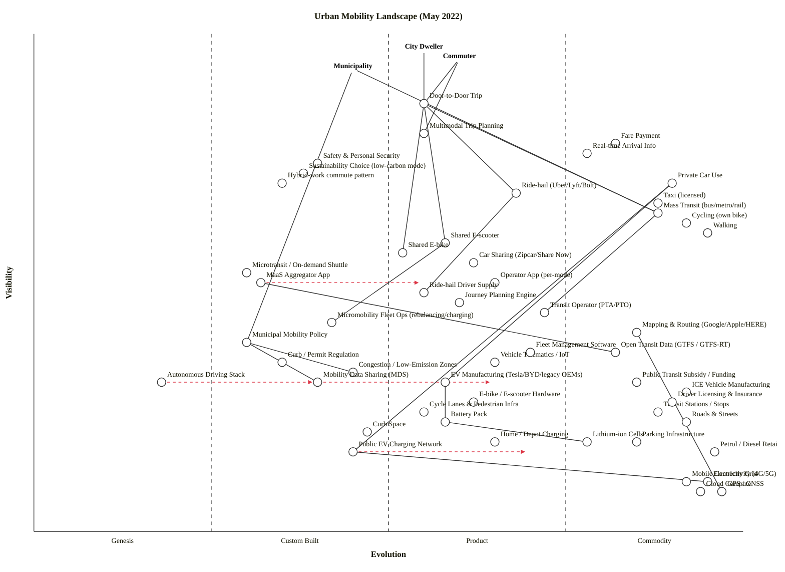

# Urban Mobility Landscape — Wardley Map (May 2022)

## Strategic context (Step 0)

**Strategic question.** In May 2022, where should engineering investment, capital, and policy attention concentrate across the urban-mobility landscape — which components are differentiation-zone bets, which are commoditising fast, and where do brittle dependencies sit between visible user experience and immature foundations?

**Anchors (user types).** Three:

- **City Dweller** — resident making everyday discretionary trips (errands, leisure, social).
- **Commuter** — repeat work-trip user, now operating under hybrid-work conditions.
- **Municipality** — public authority supplying transit, regulating curbs and permits, and pursuing climate / safety targets.

**Core needs.**

1. Get from A to B reliably and affordably.
2. Choose between modes on cost, time, sustainability, convenience, and safety.
3. (Municipality) Move people at scale within sustainability, safety, and equity targets.

**Scope boundary.** Industry landscape (multi-stakeholder: users + operators + manufacturers + regulators + energy). Target density: 40–55 components.

### Assumptions

- Geography: developed-economy cities with established transit, an active micromobility market, and at least nascent EV / charging infrastructure. The map's evolution scores will be optimistic for low- and middle-income cities, and pessimistic for the most advanced (Helsinki, Singapore) where MaaS integration is further ahead.
- "Ride-hail" is treated as one node although the post-IPO Uber / Lyft / Bolt / Didi cohort behaves differently in different jurisdictions; if the user is asking about a single city, split the node.
- Autonomous driving is treated as a single Genesis-stage component; the L2/L3 ADAS vs L4 robotaxi distinction is collapsed.

---

## OWM map

```owm
title Urban Mobility Landscape (May 2022)
style wardley

// ---------- Anchors (user types) ----------
anchor City Dweller [0.97, 0.55]
anchor Commuter [0.95, 0.60]
anchor Municipality [0.93, 0.45]

// ---------- Trip-level user-facing services ----------
component Door-to-Door Trip [0.86, 0.55]
component Multimodal Trip Planning [0.80, 0.55]
component Fare Payment [0.78, 0.82]
component Real-time Arrival Info [0.76, 0.78]
component Safety & Personal Security [0.74, 0.40]
component Sustainability Choice (low-carbon mode) [0.72, 0.38]

// ---------- Modes consumed at the user surface ----------
component Private Car Use [0.70, 0.90]
component Ride-hail (Uber/Lyft/Bolt) [0.68, 0.68]
component Taxi (licensed) [0.66, 0.88]
component Mass Transit (bus/metro/rail) [0.64, 0.88]
component Cycling (own bike) [0.62, 0.92]
component Walking [0.60, 0.95]
component Shared E-scooter [0.58, 0.58]
component Shared E-bike [0.56, 0.52]
component Car Sharing (Zipcar/Share Now) [0.54, 0.62]
component Microtransit / On-demand Shuttle [0.52, 0.30]
component Hybrid-work commute pattern [0.70, 0.35]

// ---------- Platforms / aggregators ----------
component MaaS Aggregator App [0.50, 0.32]
component Operator App (per-mode) [0.50, 0.65]
component Journey Planning Engine [0.46, 0.60]
component Open Transit Data (GTFS / GTFS-RT) [0.36, 0.82]
component Mapping & Routing (Google/Apple/HERE) [0.40, 0.85]

// ---------- Vehicle supply / operator layer ----------
component Ride-hail Driver Supply [0.48, 0.55]
component Micromobility Fleet Ops (rebalancing/charging) [0.42, 0.42]
component Transit Operator (PTA/PTO) [0.44, 0.72]
component Vehicle Telematics / IoT [0.34, 0.65]
component Fleet Management Software [0.36, 0.70]

// ---------- Manufacturing / vehicles ----------
component ICE Vehicle Manufacturing [0.28, 0.92]
component EV Manufacturing (Tesla/BYD/legacy OEMs) [0.30, 0.58]
component E-bike / E-scooter Hardware [0.26, 0.62]
component Battery Pack [0.22, 0.58]
component Lithium-ion Cells [0.18, 0.78]
component Autonomous Driving Stack [0.30, 0.18]

// ---------- Energy / fuel ----------
component Public EV Charging Network [0.16, 0.45]
component Home / Depot Charging [0.18, 0.65]
component Electricity Grid [0.10, 0.95]
component Petrol / Diesel Retail [0.16, 0.96]

// ---------- Physical & digital infrastructure ----------
component Roads & Streets [0.22, 0.92]
component Cycle Lanes & Pedestrian Infra [0.24, 0.55]
component Curb Space [0.20, 0.47]
component Parking Infrastructure [0.18, 0.85]
component Transit Stations / Stops [0.24, 0.88]
component GPS / GNSS [0.08, 0.97]
component Mobile Connectivity (4G/5G) [0.10, 0.92]
component Cloud Compute [0.08, 0.94]

// ---------- Regulation, data, money ----------
component Municipal Mobility Policy [0.38, 0.30]
component Curb / Permit Regulation [0.34, 0.35]
component Congestion / Low-Emission Zones [0.32, 0.45]
component Mobility Data Sharing (MDS) [0.30, 0.40]
component Driver Licensing & Insurance [0.26, 0.90]
component Public Transit Subsidy / Funding [0.30, 0.85]

// ---------- Dependencies ----------
City Dweller->Door-to-Door Trip
City Dweller->Safety & Personal Security
City Dweller->Sustainability Choice (low-carbon mode)
Commuter->Door-to-Door Trip
Commuter->Multimodal Trip Planning
Commuter->Fare Payment
Commuter->Real-time Arrival Info
Commuter->Hybrid-work commute pattern
Municipality->Sustainability Choice (low-carbon mode)
Municipality->Safety & Personal Security
Municipality->Mass Transit (bus/metro/rail)
Municipality->Municipal Mobility Policy

Door-to-Door Trip->Private Car Use
Door-to-Door Trip->Ride-hail (Uber/Lyft/Bolt)
Door-to-Door Trip->Taxi (licensed)
Door-to-Door Trip->Mass Transit (bus/metro/rail)
Door-to-Door Trip->Cycling (own bike)
Door-to-Door Trip->Walking
Door-to-Door Trip->Shared E-scooter
Door-to-Door Trip->Shared E-bike
Door-to-Door Trip->Car Sharing (Zipcar/Share Now)
Door-to-Door Trip->Microtransit / On-demand Shuttle

Multimodal Trip Planning->MaaS Aggregator App
Multimodal Trip Planning->Journey Planning Engine
Multimodal Trip Planning->Mapping & Routing (Google/Apple/HERE)
Real-time Arrival Info->Open Transit Data (GTFS / GTFS-RT)
Real-time Arrival Info->Operator App (per-mode)
Fare Payment->Operator App (per-mode)
Fare Payment->MaaS Aggregator App

Ride-hail (Uber/Lyft/Bolt)->Operator App (per-mode)
Ride-hail (Uber/Lyft/Bolt)->Ride-hail Driver Supply
Ride-hail (Uber/Lyft/Bolt)->Mapping & Routing (Google/Apple/HERE)
Ride-hail Driver Supply->Driver Licensing & Insurance

Taxi (licensed)->Driver Licensing & Insurance
Taxi (licensed)->Roads & Streets

Mass Transit (bus/metro/rail)->Transit Operator (PTA/PTO)
Mass Transit (bus/metro/rail)->Transit Stations / Stops
Mass Transit (bus/metro/rail)->Open Transit Data (GTFS / GTFS-RT)
Transit Operator (PTA/PTO)->Public Transit Subsidy / Funding
Transit Operator (PTA/PTO)->Fleet Management Software
Transit Stations / Stops->Roads & Streets

Shared E-scooter->Operator App (per-mode)
Shared E-scooter->Micromobility Fleet Ops (rebalancing/charging)
Shared E-scooter->E-bike / E-scooter Hardware
Shared E-scooter->Curb Space
Shared E-scooter->Curb / Permit Regulation
Shared E-bike->Operator App (per-mode)
Shared E-bike->Micromobility Fleet Ops (rebalancing/charging)
Shared E-bike->E-bike / E-scooter Hardware
Shared E-bike->Cycle Lanes & Pedestrian Infra
Micromobility Fleet Ops (rebalancing/charging)->Vehicle Telematics / IoT
Micromobility Fleet Ops (rebalancing/charging)->Mobility Data Sharing (MDS)

Car Sharing (Zipcar/Share Now)->Operator App (per-mode)
Car Sharing (Zipcar/Share Now)->EV Manufacturing (Tesla/BYD/legacy OEMs)
Car Sharing (Zipcar/Share Now)->Parking Infrastructure
Microtransit / On-demand Shuttle->Journey Planning Engine
Microtransit / On-demand Shuttle->Fleet Management Software
Microtransit / On-demand Shuttle->Municipal Mobility Policy

Private Car Use->ICE Vehicle Manufacturing
Private Car Use->EV Manufacturing (Tesla/BYD/legacy OEMs)
Private Car Use->Petrol / Diesel Retail
Private Car Use->Roads & Streets
Private Car Use->Parking Infrastructure
Private Car Use->Driver Licensing & Insurance
EV Manufacturing (Tesla/BYD/legacy OEMs)->Battery Pack
EV Manufacturing (Tesla/BYD/legacy OEMs)->Autonomous Driving Stack
Battery Pack->Lithium-ion Cells
Private Car Use->Public EV Charging Network
Private Car Use->Home / Depot Charging
Public EV Charging Network->Electricity Grid
Home / Depot Charging->Electricity Grid
E-bike / E-scooter Hardware->Battery Pack

Cycling (own bike)->Cycle Lanes & Pedestrian Infra
Walking->Cycle Lanes & Pedestrian Infra

Operator App (per-mode)->Mobile Connectivity (4G/5G)
Operator App (per-mode)->Cloud Compute
MaaS Aggregator App->Mobile Connectivity (4G/5G)
MaaS Aggregator App->Cloud Compute
MaaS Aggregator App->Open Transit Data (GTFS / GTFS-RT)
Mapping & Routing (Google/Apple/HERE)->GPS / GNSS
Mapping & Routing (Google/Apple/HERE)->Cloud Compute
Journey Planning Engine->Mapping & Routing (Google/Apple/HERE)
Journey Planning Engine->Open Transit Data (GTFS / GTFS-RT)
Vehicle Telematics / IoT->Mobile Connectivity (4G/5G)
Vehicle Telematics / IoT->GPS / GNSS
Fleet Management Software->Cloud Compute
Fleet Management Software->Vehicle Telematics / IoT

Municipal Mobility Policy->Curb / Permit Regulation
Municipal Mobility Policy->Congestion / Low-Emission Zones
Municipal Mobility Policy->Mobility Data Sharing (MDS)
Municipal Mobility Policy->Cycle Lanes & Pedestrian Infra
Curb / Permit Regulation->Curb Space
Congestion / Low-Emission Zones->Roads & Streets
Safety & Personal Security->Driver Licensing & Insurance
Safety & Personal Security->Cycle Lanes & Pedestrian Infra

Hybrid-work commute pattern->Mass Transit (bus/metro/rail)
Hybrid-work commute pattern->Private Car Use
Hybrid-work commute pattern->Cycling (own bike)

Sustainability Choice (low-carbon mode)->Mass Transit (bus/metro/rail)
Sustainability Choice (low-carbon mode)->Cycling (own bike)
Sustainability Choice (low-carbon mode)->Shared E-bike
Sustainability Choice (low-carbon mode)->EV Manufacturing (Tesla/BYD/legacy OEMs)

evolve Autonomous Driving Stack 0.40
evolve MaaS Aggregator App 0.55
evolve Public EV Charging Network 0.70
evolve Mobility Data Sharing (MDS) 0.65

note Differentiation zone [0.6, 0.25]
note Utility commodity [0.12, 0.92]
```

### Validation

```
node skills/wardley-map/scripts/validate_owm.mjs draft.owm
OK: 54 components/anchors, 102 edges — no violations.

node skills/wardley-map/scripts/check_layout.mjs draft.owm
LAYOUT OK: 3 anchors, 51 components — no layout warnings.
```

### Mermaid (GitHub render)



*(Mermaid block trimmed for readability — the OWM block above is the authoritative, complete map. Some redundant edges are omitted here so the rendered graph stays legible.)*

---

## Component evolution rationale

| Component | Stage | ε | ν | Evidence |
|---|---|---:|---:|---|
| Door-to-Door Trip | Product (+rental) | 0.55 | 0.86 | Recognisable user-level service in city after city; widely understood; not yet a metered utility. |
| Multimodal Trip Planning | Product (+rental) | 0.55 | 0.80 | Google / Apple / Citymapper deliver consumer-grade planning across most modes; still feature-competitive, not standardised. |
| Fare Payment | Commodity (+utility) | 0.82 | 0.78 | Contactless EMV on transit (Transport for London model) and stored-value cards are ubiquitous; payment is operationally invisible. |
| Real-time Arrival Info | Commodity (+utility) | 0.78 | 0.76 | GTFS-RT feeds standard; consumers expect it; deviation is the surprise. |
| Safety & Personal Security | Custom Built | 0.40 | 0.74 | Patchy, jurisdiction-specific; no agreed-upon standard for vehicle / micromobility / pedestrian safety in one frame. |
| Sustainability Choice (low-carbon mode) | Custom Built | 0.38 | 0.72 | Increasingly explicit user-level concern post-2020 but no settled way to surface or score it across modes. |
| Private Car Use | Commodity (+utility) | 0.90 | 0.70 | Universal; mature ownership and use patterns; the default mode in most cities. |
| Ride-hail (Uber/Lyft/Bolt) | Product (+rental) | 0.68 | 0.68 | Post-IPO incumbents; many vendors; feature parity is high; pricing pressure intense but not yet utility-priced. |
| Taxi (licensed) | Commodity (+utility) | 0.88 | 0.66 | Globally standard, regulated commodity; differentiation is brand / fleet only. |
| Mass Transit (bus/metro/rail) | Commodity (+utility) | 0.88 | 0.64 | Public utility in essentially every major city. |
| Cycling (own bike) | Commodity (+utility) | 0.92 | 0.62 | Ancient commodity; the bike itself is a stable product. |
| Walking | Commodity (+utility) | 0.95 | 0.60 | The reference mode; ubiquitous. |
| Shared E-scooter | Product (+rental) | 0.58 | 0.58 | Bird / Lime / Voi / Tier / Lyft consolidated post-2018; analyst coverage; vendor RFPs in cities; not yet utility-priced. |
| Shared E-bike | Product (+rental) | 0.52 | 0.56 | Behind e-scooter on commodification but on the same trajectory; large operators and city-issued contracts. |
| Car Sharing (Zipcar/Share Now) | Product (+rental) | 0.62 | 0.54 | Two-decade-old product category, several major brands, well-understood business model. |
| Microtransit / On-demand Shuttle | Custom Built | 0.30 | 0.52 | Via / Spare / Padam pilots; mostly bespoke per agency; no dominant model. |
| Hybrid-work commute pattern | Custom Built | 0.35 | 0.70 | Post-COVID behaviour set; emerging but not stabilised; major employers still adjusting policy in 2022. |
| MaaS Aggregator App | Custom Built | 0.32 | 0.50 | Whim (Helsinki), Jelbi (Berlin), early Citymapper Pass — promising pilots, no scaled product market, no settled business model. |
| Operator App (per-mode) | Product (+rental) | 0.65 | 0.50 | Every operator ships one; commodity-pattern features (sign-up, scan, ride, pay); few are differentiating. |
| Journey Planning Engine | Product (+rental) | 0.60 | 0.46 | OpenTripPlanner, Conveyal, HERE Routing — multiple vendors, mature OSS plus commercial. |
| Open Transit Data (GTFS / GTFS-RT) | Commodity (+utility) | 0.82 | 0.36 | GTFS is the de facto global standard since the late 2000s; expected of any transit agency. |
| Mapping & Routing (Google/Apple/HERE) | Commodity (+utility) | 0.85 | 0.40 | Free for end users via Google / Apple; commercial APIs metered like utilities. |
| Ride-hail Driver Supply | Product (+rental) | 0.55 | 0.48 | Mature gig-labour market; well-understood, but contested by reclassification (AB5, EU directives) — operationally a product, politically in flux. |
| Micromobility Fleet Ops (rebalancing/charging) | Custom Built | 0.42 | 0.42 | In-house at each operator; some emerging vendors (Joyride, Vianova) but no dominant player. |
| Transit Operator (PTA/PTO) | Product (+rental) | 0.72 | 0.44 | Stable institutional pattern; mature in delivery but each is bespoke organisationally. |
| Vehicle Telematics / IoT | Product (+rental) | 0.65 | 0.34 | Geotab, Samsara, OEM dashboards; clear vendor market, RFP-driven. |
| Fleet Management Software | Product (+rental) | 0.70 | 0.36 | Samsara, Verizon Connect, Fleetio — multiple competing vendors, well-defined feature set. |
| ICE Vehicle Manufacturing | Commodity (+utility) | 0.92 | 0.28 | A century of industrialisation; high-volume, low-margin global commodity. |
| EV Manufacturing (Tesla/BYD/legacy OEMs) | Product (+rental) | 0.58 | 0.30 | Tesla, BYD, VW ID, Hyundai Ioniq, Ford Mach-E — multiple competing models in 2022; price war beginning; not yet a fungible commodity. |
| E-bike / E-scooter Hardware | Product (+rental) | 0.62 | 0.26 | Segway-Ninebot, Okai, Yulu — well-developed product market; consolidation under way. |
| Battery Pack | Product (+rental) | 0.58 | 0.22 | CATL, LG, Panasonic dominate cell-to-pack production; product-level differentiation by energy density. |
| Lithium-ion Cells | Commodity (+utility) | 0.78 | 0.18 | Cell chemistry is industrialised; demand-driven price (lithium spot prices on commodity exchanges). |
| Autonomous Driving Stack | Genesis | 0.18 | 0.30 | Waymo / Cruise still in extremely limited geofenced commercial pilot in 2022; no settled architecture; few vendors; many failed bets. |
| Public EV Charging Network | Custom Built | 0.45 | 0.16 | ChargePoint, Ionity, Electrify America, Tesla Supercharger — coverage expanding, payment fragmented, standards (CCS vs NACS) still contested. |
| Home / Depot Charging | Product (+rental) | 0.65 | 0.18 | EVSE units from Wallbox, ChargePoint, Tesla — standard product category. |
| Electricity Grid | Commodity (+utility) | 0.95 | 0.10 | The canonical Stage IV utility. |
| Petrol / Diesel Retail | Commodity (+utility) | 0.96 | 0.16 | Fully industrialised, metered, regulated. |
| Roads & Streets | Commodity (+utility) | 0.92 | 0.22 | Universal public infrastructure. |
| Cycle Lanes & Pedestrian Infra | Product (+rental) | 0.55 | 0.24 | Patchy and policy-driven; investment is uneven; many cities still building. |
| Curb Space | Product (+rental) | 0.47 | 0.20 | Curb management is becoming a discrete policy domain (Coord, Populus); not yet utility-priced. |
| Parking Infrastructure | Commodity (+utility) | 0.85 | 0.18 | Globally stable, metered commodity. |
| Transit Stations / Stops | Commodity (+utility) | 0.88 | 0.24 | Mature physical infrastructure category. |
| GPS / GNSS | Commodity (+utility) | 0.97 | 0.08 | Global utility; free to consume. |
| Mobile Connectivity (4G/5G) | Commodity (+utility) | 0.92 | 0.10 | Metered utility from carriers. |
| Cloud Compute | Commodity (+utility) | 0.94 | 0.08 | AWS / GCP / Azure. |
| Municipal Mobility Policy | Custom Built | 0.30 | 0.38 | Each city is bespoke; emerging consensus around 15-minute city, low-emission zones, vision-zero, but no standard playbook. |
| Curb / Permit Regulation | Custom Built | 0.35 | 0.34 | City-by-city permit regimes for scooters / shared mobility — many models, no convergence. |
| Congestion / Low-Emission Zones | Custom Built | 0.45 | 0.32 | London ULEZ expanded 2021; Paris, Madrid, Brussels rolling out; not yet standard. |
| Mobility Data Sharing (MDS) | Custom Built | 0.40 | 0.30 | Open Mobility Foundation's MDS adopted by ~150 cities by 2022; standardising but still emergent. |
| Driver Licensing & Insurance | Commodity (+utility) | 0.90 | 0.26 | Mature, regulated commodity. |
| Public Transit Subsidy / Funding | Commodity (+utility) | 0.85 | 0.30 | Long-established public-finance pattern. |

---

## Strategic analysis

### a. Top 3 differentiation opportunities (BUILD)

1. **MaaS Aggregator App (Custom Built → Product)** — the only place where the user experience of "one trip across modes" can become a brand and a moat. Whim, Jelbi and Citymapper Pass are showing the shape; no one has won. Highest visible differentiation leverage.
2. **Sustainability Choice (Custom Built)** — surfacing the carbon / cost / time trade-off in a credible, defensible way at the point of mode choice. Visible to users, no settled UX, regulation tailwind.
3. **Microtransit / On-demand Shuttle (Custom Built)** — fills the cost gap between fixed-route transit and ride-hail; agency-led, still bespoke, plenty of headroom to define the category for public-private partnerships.

### b. Top 3 commodity-leverage candidates (RENT / CONSUME)

1. **Mapping & Routing (Commodity +utility)** — Google / Apple / HERE / Mapbox; never build, always rent.
2. **GPS / GNSS, Mobile Connectivity, Cloud Compute (Commodity +utility)** — the deep utility floor. Consume only.
3. **Fare Payment (Commodity +utility)** — contactless EMV plus Apple Pay / Google Pay solves this. Rolling your own closed-loop card is a strategic regression.

### c. Top 3 dependency risks (visible-on-immature)

1. **Multimodal Trip Planning → MaaS Aggregator App** — visible user-facing journey planning depends on an immature, fragmented aggregator layer with no agreed business model. The whole "one app to rule them all" promise stalls here.
2. **Sustainability Choice → EV Manufacturing** — user-visible low-carbon promise depends on EV supply chains that are demand-constrained in 2022 (chip shortage, battery cell shortage); waiting lists are 12–18 months and price differentiation is volatile.
3. **Shared E-scooter / E-bike → Curb / Permit Regulation** — the user-visible mode is gated by a Custom-Built, city-by-city regulatory layer that can shut operators overnight (Paris referendum was a year out from this map; numerous US cities had already done it).

### d. Build / Buy / Outsource recommendations

| Component | Stage | Recommendation | Why |
|---|---|---|---|
| MaaS Aggregator App | Custom Built | **Build (city-led) or Build (PPP)** | No competitive product market yet; whoever controls the aggregation surface owns the customer relationship. |
| Sustainability Choice | Custom Built | **Build** | Differentiator; emerging municipal-policy lever; no off-the-shelf solution. |
| Microtransit | Custom Built | **Buy + Operate** | Buy platform (Via, Spare); operate route design in-house; the network is the moat, not the software. |
| Journey Planning Engine | Product (+rental) | **Buy / Open-source collaborate** | OpenTripPlanner / Conveyal / HERE; no engineering moat in writing your own. |
| Operator App | Product (+rental) | **Buy / template** | A non-differentiating feature set; many white-label vendors. |
| Ride-hail Driver Supply | Product (+rental) | **Outsource via market** | Liquidity is the only thing that matters; build the market, not the labour pool directly. |
| Fleet Management Software | Product (+rental) | **Buy (Samsara / Geotab)** | Commodity vendor market; in-house build is strict-worse. |
| Mapping & Routing, GPS, Cloud, Mobile | Commodity (+utility) | **Rent** | Utilities; consume only. |
| Autonomous Driving Stack | Genesis | **Build only if it is your bet** | Pre-product, capital-intensive; partner with one of Waymo / Cruise / Mobileye if not. |
| Public EV Charging Network | Custom Built → Product | **Open-source collaborate / partner** | At an industrialisation moment (CCS vs NACS playing out); join a standard rather than picking the loser. |
| Mobility Data Sharing (MDS) | Custom Built | **Open-source collaborate** | OMF/MDS is the obvious vehicle; agencies should mandate it rather than invent a proprietary feed. |

### e. Suggested gameplays (Wardley's 61-play catalogue)

- **#15 Open Approaches** — on Mobility Data Sharing (MDS) and Public EV Charging. Industrialise via shared standards; deny incumbents a proprietary moat at the data and connector layers.
- **#16 Exploiting Network Effects** — on the MaaS Aggregator App. Aggregation only works when both supply (operators) and demand (users) are on one surface.
- **#36 Directed Investment** — into MaaS Aggregator and Microtransit; these are where Custom Built → Product transitions are happening *now*.
- **#1 Focus on User Needs** — explicitly across all three anchor types (the City Dweller, Commuter, and Municipality needs are different; build separately rather than collapse to a single persona).
- **#45 Two-factor (marketplaces)** — for any aggregator and for ride-hail; both sides reinforce. Lose either side and the play collapses.
- **#41 Alliances** — operator alliances on charging (Ionity model in Europe) and on data sharing (MDS-aligned cities).
- **#26 Differentiation** — on Sustainability Choice as the consumer-visible differentiator versus mode-by-mode incumbents.
- **#29 Harvesting** — on Fare Payment, Mapping, Cloud, GPS, Mobile — let the utility market deliver, consume cheaply.

### f. Doctrine notes

- ✓ **#1 Focus on user needs** — three anchors used; needs explicitly enumerated.
- ✓ **#10 Know your users** — the City Dweller / Commuter / Municipality split reflects that the same physical infrastructure serves three audiences with different decision criteria.
- ⚠ **#13 Manage inertia** — Private Car Use sits at the user surface as a high-ε commodity. Most users have decades of habit and physical-asset inertia (the car in the driveway is sunk cost). Any sustainability-led play has to confront this.
- ⚠ **#18 A bias toward action** — the map flags MaaS Aggregator and Sustainability Choice as the Custom Built → Product transitions to invest behind. Hesitating loses the window.
- ⚠ **#9 Be transparent** — Mobility Data Sharing is a doctrine instrument; cities not mandating it are leaving themselves with no visibility into their own curbs and streets.

### g. Climatic context

- **#3 Everything evolves** — the whole map is in motion; micromobility moved from Genesis to Product in roughly three years (2018-2022).
- **#13 Capital flows to new areas of value** — visible in post-IPO ride-hail, EV battery supply, and venture flow into MaaS / microtransit.
- **#15–17 Inertia** — three forms acutely visible: Private Car Use (capital / habit inertia), ICE Manufacturing (asset / dealer-network inertia from suppliers), Petrol Retail (sunk infrastructure inertia).
- **#18 You cannot measure evolution over time** — explicitly: the EV transition has been "5 years away" for 20 years. Stage placement on the cheat sheet is what counts, not extrapolation.
- **#23 Co-evolution of practice with activity** — Hybrid-work commute pattern (Custom Built, ε ≈ 0.35) is the *practice* that is co-evolving with mass transit demand; the practice has shifted but transit operating models lag.
- **#27 Punctuated equilibrium (Product → Utility)** — Mass Transit has long been Stage IV. The candidates for the *next* punctuation are Charging Networks (Custom Built → Product around 2024) and MaaS Aggregators (if any of the pilots reach product market fit).

### h. Deep-placement notes

Four components received deeper placement scrutiny:

1. **MaaS Aggregator App** — initial cheat-sheet score implied early Product (≈ 0.45) from "Citymapper exists and is mature". Re-examining ubiquity and market form: Whim has not scaled outside Helsinki, Berlin's Jelbi is operator-led not commercial, Citymapper Pass shut down. Vendor count low, no business model standard. Moved to Custom Built (ε = 0.32) with an `evolve` arrow to 0.55.
2. **Public EV Charging Network** — cheat-sheet straddled Custom Built / Product: Tesla Supercharger is Product-shaped, others are still bespoke roll-outs. Standards war (CCS vs NACS) still unresolved as of May 2022 (Ford-Tesla NACS announcement was a year out). Held at ε = 0.45 (boundary) and added `evolve` to 0.70.
3. **Autonomous Driving Stack** — easy temptation to place at Custom Built. But by May 2022 only Waymo and Cruise had any commercial-pilot status, both geofenced and small; vendor failures had begun (Argo wound down later in 2022). Held at Genesis (ε = 0.18) with `evolve` to 0.40 — explicitly *not* a forecast for product market fit.
4. **Mobility Data Sharing (MDS)** — initial placement was Genesis based on "new". Open Mobility Foundation has formalised MDS, ~150 cities had adopted by 2022, EU MDMS aligning. Moved up to Custom Built (ε = 0.40) — standardising fast, hence the `evolve` to 0.65.

### i. Caveat

Evolution trajectories (the `evolve` arrows) are scenarios, not forecasts. Wardley's climatic pattern #18: *"you cannot measure evolution over time or adoption."* Specifically: autonomous-driving Genesis-to-Custom timing is highly uncertain (could be 3 years, could be 15); EV charging Custom-to-Product depends on a regulatory and standards outcome (NACS vs CCS) whose direction is contested in May 2022; MaaS aggregator economic viability is unproven.

---

## Skill execution summary

- **Components:** 51 (plus 3 anchors → 54 total nodes)
- **Anchors:** 3 (City Dweller, Commuter, Municipality)
- **Edges:** 102
- **Validator iterations:** 2 (initial draft had 6 visibility violations on Operator-App-related edges, Ride-hail Driver Supply → Private Car Use, Transit Stations → Roads, and Fleet Mgmt → Telematics; one round of fixes cleared all violations).
- **Layout iterations:** 2 (3 near-duplicate / boundary warnings on first run; one fix introduced a new collision; second pass cleared all warnings).
- **Deep placements:** 4 (MaaS Aggregator App, Public EV Charging Network, Autonomous Driving Stack, Mobility Data Sharing — see §h).
