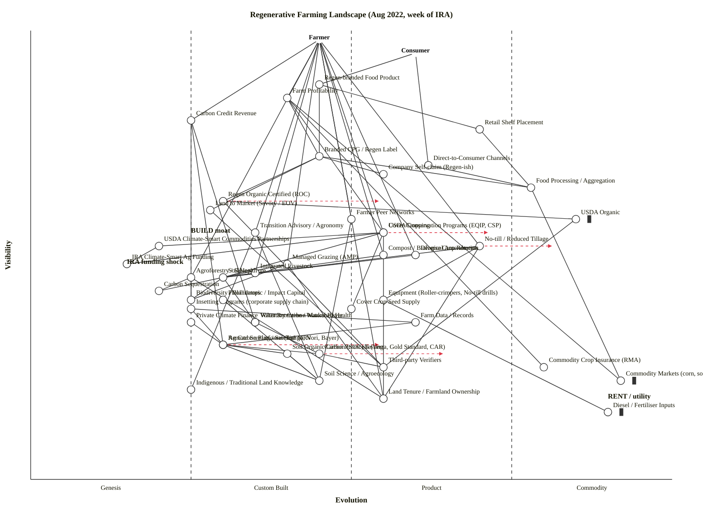

# Regenerative Farming Landscape — Aug 2022 (week of IRA signing)

Pinned to the week of **16 August 2022**, the day the Inflation Reduction Act was signed into law. The IRA injects approximately **$19.5 B** of new climate-smart agriculture money into USDA conservation programs (EQIP, CSP, ACEP, RCPP) over FY2023–FY2026, plus additional funding through the separate USDA Climate-Smart Commodities Partnerships program announced earlier in 2022. This is the single largest federal conservation-funding shock in U.S. agricultural history and materially shifts the landscape's climate (in Wardley's sense) right at the moment we are mapping it.

---

## 1. Map — OWM

```owm
title Regenerative Farming Landscape (Aug 2022, week of IRA)
style wardley

// Two anchors — the farmer who adopts practices and the consumer who buys the output
anchor Farmer [0.98, 0.45]
anchor Consumer [0.95, 0.60]

// User-visible outcomes / products
component Regen-branded Food Product [0.88, 0.45]
component Farm Profitability [0.85, 0.40]
component Carbon Credit Revenue [0.80, 0.25]

// Supply chain to consumer
component Retail Shelf Placement [0.78, 0.70]
component Branded CPG / Regen Label [0.72, 0.45]
component Food Processing / Aggregation [0.65, 0.78]
component Direct-to-Consumer Channels [0.70, 0.62]

// Certifications and claims
component Regen Organic Certified (ROC) [0.62, 0.30]
component Land to Market (Savory / EOV) [0.60, 0.28]
component USDA Organic [0.58, 0.85] inertia
component Company Self-claim (Regen-ish) [0.68, 0.55]

// Farmer practices
component Cover Cropping [0.55, 0.55]
component No-till / Reduced Tillage [0.52, 0.70]
component Diverse Crop Rotation [0.50, 0.60]
component Managed Grazing (AMP) [0.48, 0.40]
component Agroforestry / Silvopasture [0.45, 0.25]
component Integrated Livestock [0.46, 0.35]
component Compost / Biological Amendments [0.50, 0.55]

// Farmer enablers
component Farmer Peer Networks [0.58, 0.50]
component Transition Advisory / Agronomy [0.55, 0.35]
component Equipment (Roller-crimpers, No-till drills) [0.40, 0.55]
component Cover Crop Seed Supply [0.38, 0.50]

// Ecological outcomes (what the practices produce)
component Soil Health [0.45, 0.30]
component Biodiversity / Pollinators [0.40, 0.25]
component Carbon Sequestration [0.42, 0.20]
component Water Retention / Watershed Health [0.35, 0.35]

// Measurement / verification / MRV
component Soil Organic Carbon (SOC) Testing [0.28, 0.40]
component Remote Sensing / Satellite MRV [0.30, 0.30]
component Carbon Protocols (Verra, Gold Standard, CAR) [0.28, 0.45]
component Third-party Verifiers [0.25, 0.55]
component Farm Data / Records [0.35, 0.60]

// Carbon markets
component Voluntary Carbon Market Buyer [0.35, 0.35]
component Insetting Programs (corporate supply chain) [0.38, 0.25]
component Ag Carbon Platforms (Indigo, Nori, Bayer) [0.30, 0.30]

// Funding sources
component USDA Conservation Programs (EQIP, CSP) [0.55, 0.55]
component IRA Climate-Smart Ag Funding [0.48, 0.15]
component USDA Climate-Smart Commodities Partnerships [0.52, 0.20]
component Philanthropic / Impact Capital [0.40, 0.30]
component Private Climate Finance [0.35, 0.25]

// Knowledge
component Soil Science / Agroecology [0.22, 0.45]
component Indigenous / Traditional Land Knowledge [0.20, 0.25]

// Deep foundations
component Land Tenure / Farmland Ownership [0.18, 0.55]
component Commodity Crop Insurance (RMA) [0.25, 0.80]
component Commodity Markets (corn, soy, beef) [0.22, 0.92] inertia
component Diesel / Fertiliser Inputs [0.15, 0.90] inertia

// Dependencies
Farmer->Farm Profitability
Farmer->Carbon Credit Revenue
Consumer->Regen-branded Food Product
Consumer->Direct-to-Consumer Channels

Regen-branded Food Product->Branded CPG / Regen Label
Regen-branded Food Product->Retail Shelf Placement
Branded CPG / Regen Label->Regen Organic Certified (ROC)
Branded CPG / Regen Label->Land to Market (Savory / EOV)
Branded CPG / Regen Label->Company Self-claim (Regen-ish)
Branded CPG / Regen Label->Food Processing / Aggregation
Retail Shelf Placement->Food Processing / Aggregation
Direct-to-Consumer Channels->Food Processing / Aggregation

Farm Profitability->Branded CPG / Regen Label
Farm Profitability->USDA Conservation Programs (EQIP, CSP)
Farm Profitability->Commodity Markets (corn, soy, beef)
Farm Profitability->Commodity Crop Insurance (RMA)

Carbon Credit Revenue->Voluntary Carbon Market Buyer
Carbon Credit Revenue->Insetting Programs (corporate supply chain)
Carbon Credit Revenue->Ag Carbon Platforms (Indigo, Nori, Bayer)

Regen Organic Certified (ROC)->Third-party Verifiers
Regen Organic Certified (ROC)->USDA Organic
Land to Market (Savory / EOV)->Third-party Verifiers
USDA Organic->Third-party Verifiers

Farmer->Cover Cropping
Farmer->No-till / Reduced Tillage
Farmer->Diverse Crop Rotation
Farmer->Managed Grazing (AMP)
Farmer->Agroforestry / Silvopasture
Farmer->Integrated Livestock
Farmer->Compost / Biological Amendments
Farmer->Farmer Peer Networks
Farmer->Transition Advisory / Agronomy

Cover Cropping->Cover Crop Seed Supply
Cover Cropping->Soil Health
No-till / Reduced Tillage->Equipment (Roller-crimpers, No-till drills)
No-till / Reduced Tillage->Soil Health
Diverse Crop Rotation->Soil Health
Managed Grazing (AMP)->Soil Health
Managed Grazing (AMP)->Biodiversity / Pollinators
Agroforestry / Silvopasture->Biodiversity / Pollinators
Agroforestry / Silvopasture->Carbon Sequestration
Integrated Livestock->Soil Health
Compost / Biological Amendments->Soil Health

Soil Health->Carbon Sequestration
Soil Health->Water Retention / Watershed Health
Soil Health->Biodiversity / Pollinators

Transition Advisory / Agronomy->Soil Science / Agroecology
Transition Advisory / Agronomy->Indigenous / Traditional Land Knowledge
Farmer Peer Networks->Soil Science / Agroecology

Ag Carbon Platforms (Indigo, Nori, Bayer)->Carbon Protocols (Verra, Gold Standard, CAR)
Ag Carbon Platforms (Indigo, Nori, Bayer)->Remote Sensing / Satellite MRV
Ag Carbon Platforms (Indigo, Nori, Bayer)->Soil Organic Carbon (SOC) Testing
Carbon Protocols (Verra, Gold Standard, CAR)->Third-party Verifiers
Voluntary Carbon Market Buyer->Carbon Protocols (Verra, Gold Standard, CAR)
Insetting Programs (corporate supply chain)->Remote Sensing / Satellite MRV
Insetting Programs (corporate supply chain)->Farm Data / Records
Remote Sensing / Satellite MRV->Soil Science / Agroecology
Soil Organic Carbon (SOC) Testing->Soil Science / Agroecology

USDA Conservation Programs (EQIP, CSP)->IRA Climate-Smart Ag Funding
USDA Conservation Programs (EQIP, CSP)->USDA Climate-Smart Commodities Partnerships
USDA Climate-Smart Commodities Partnerships->IRA Climate-Smart Ag Funding
Philanthropic / Impact Capital->Soil Science / Agroecology
Private Climate Finance->Ag Carbon Platforms (Indigo, Nori, Bayer)

Farmer->Land Tenure / Farmland Ownership
Cover Cropping->Land Tenure / Farmland Ownership
No-till / Reduced Tillage->Land Tenure / Farmland Ownership
Managed Grazing (AMP)->Land Tenure / Farmland Ownership
Agroforestry / Silvopasture->Land Tenure / Farmland Ownership

Equipment (Roller-crimpers, No-till drills)->Diesel / Fertiliser Inputs
Food Processing / Aggregation->Commodity Markets (corn, soy, beef)
Farm Data / Records->Remote Sensing / Satellite MRV

evolve No-till / Reduced Tillage 0.82
evolve Remote Sensing / Satellite MRV 0.55
evolve Carbon Protocols (Verra, Gold Standard, CAR) 0.65
evolve USDA Conservation Programs (EQIP, CSP) 0.72
evolve Regen Organic Certified (ROC) 0.55

note BUILD moat [0.55, 0.25]
note RENT / utility [0.18, 0.90]
note IRA funding shock [0.48, 0.15]
```

## 2. Map — Mermaid (`wardley-beta`)



---

## 3. Strategic analysis

### a. Top differentiation opportunities (BUILD)

Where ν is high and ε is low — visible to users and still uncharted, so a credible claim here is a moat.

1. **Regen Organic Certified (ROC)** (Custom Built) — The most rigorous regen certification (Rodale/Dr Bronner/Patagonia), distinct from USDA Organic. In Aug 2022 only a few dozen brands carry it; the label itself is a differentiator because the category has not yet commoditised into a single standard. Whoever's brand becomes synonymous with "credibly regen" wins a durable position.
2. **Land to Market / EOV (Savory)** (Custom Built) — Outcome-based verification on grassland. Competing with ROC to define what "regen" means; the one that wins gets to set the Stage III standard.
3. **Carbon Credit Revenue** (Custom Built) — A revenue line that, at this moment, barely exists for U.S. row-crop farmers. Every serious buyer (Microsoft, Shopify, Stripe, JBS insetting) is hunting for high-integrity ag credits. A farmer or co-op that can produce legitimately additional, durable tonnes at scale has a differentiated product nobody else can deliver yet.

Honourable mentions that are also BUILD candidates: **Cashflow-style ag advisory** built around **Transition Advisory / Agronomy** (the human layer that actually moves practice adoption) and **Farm Data / Records** as the farmer-owned substrate that makes insetting work.

### b. Commodity-leverage candidates (BUY / RENT / let utilities handle it)

Where ν is low and ε is high — rent these, don't build.

1. **Diesel / Fertiliser Inputs** (Commodity +utility) — These are utility-grade inputs. Regen reduces dependence on them, but does not replace their utility status. Don't try to own fertiliser manufacturing.
2. **Commodity Markets (corn, soy, beef)** (Commodity +utility) — The CBOT/futures complex is a utility for price discovery. Don't build a parallel market; instead, exit it by moving product up the chain into Branded CPG.
3. **Commodity Crop Insurance (RMA)** (Commodity +utility) — USDA RMA insurance is a federally-subsidised utility. Don't try to replace it; lobby to widen its whole-farm / climate-smart variants so regen practices don't penalise premiums.

Also clearly commodity: **USDA Organic** certification machinery (Stage IV and inertia-flagged — a 30-year-old standard acting as a gravitational well for the organic label).

### c. Top dependency risks

Edges where a visible component leans on an immature foundation — fragile joins in the value chain.

1. **Carbon Credit Revenue → Carbon Protocols (Verra / Gold Standard / CAR)** — The most visible new revenue line hangs on methodologies that, in Aug 2022, are under active attack from journalists and academics (the Guardian's large phantom-credits investigation lands in early 2023 but the critique is already building). The protocols are Custom Built (ε ≈ 0.45); the revenue line is near Custom Built (ε ≈ 0.25). Fragile.
2. **Regen-branded Food Product → Branded CPG / Regen Label → (ROC / Land to Market / Self-claim)** — The CPG claim is visible to the consumer, but the certifications underpinning it are either early-stage (ROC, L2M) or meaningless (self-claim). Consumer trust is one expose away from collapse.
3. **Ag Carbon Platforms → Soil Organic Carbon (SOC) Testing & Remote Sensing MRV** — Every commercial ag carbon platform (Indigo, Nori, Bayer Carbon Program, Truterra) depends on an MRV stack that is still Custom Built, with wide variance across protocols, soil types, and model assumptions. If MRV gets regulated (likely — see climatic context), today's methodologies may be invalidated.
4. **Farm Profitability → USDA Conservation Programs (EQIP, CSP) → IRA Climate-Smart Ag Funding** — A thick chain where the farmer's near-term transition economics depend on the new IRA dollars actually landing. IRA is signed but not yet obligated; NRCS field-office capacity to run the larger program is uncertain. Real risk of an implementation bottleneck.

### d. Suggested gameplays

Named plays from Wardley's 61-play catalogue (`references/gameplay-patterns.md`):

- **#15 Open Approaches — applied to MRV** — The biggest single thing that accelerates the whole landscape is an open, scientifically grounded MRV standard. A credible foundation (USDA, NSF, or a Linux-Foundation-style consortium) that open-sources a soil-carbon measurement protocol shifts MRV from Custom Built to Product (+rental) in 2–3 years. Whoever funds this undercuts the proprietary platforms and becomes the trusted layer.
- **#36 Directed investment — applied to Regen Organic Certified (ROC) and Land to Market** — These are the high-D, differentiation components. Brands with category ambition (Patagonia Provisions, General Mills Regenerative, Dr Bronner, Applegate) should pour resources into *their chosen* certification to force it to standard.
- **#56 First mover / regulatory — applied to IRA Climate-Smart Ag Funding** — The $19.5B is real money, but it will be disbursed via NRCS and partner organisations. First movers who build NRCS-aligned intake / agronomy capacity in Q4 2022 will capture a disproportionate share of FY23–FY26 flow. The window is narrow.
- **#41 Alliances — applied to Insetting Programs** — For a CPG, joining a supply-chain insetting program (General Mills' regen acres, Walmart's Project Gigaton, Unilever's Climate & Nature Fund) is a "borrow your differentiation from your customer" play: you outsource the scheme design, capture the claim.
- **#16 Exploiting Network Effects — applied to Farmer Peer Networks** — Adoption research (Pannell, Carlisle) shows peer networks are the single biggest predictor of regen transition. Any serious play funds farmer-to-farmer networks (Soil Health Academy, Understanding Ag, Practical Farmers of Iowa, grazing clubs) rather than top-down outreach.
- **#29 Harvesting — applied to Ag Carbon Platforms** — For a large incumbent (ADM, Cargill, Tyson), don't build an ag-carbon platform — watch Indigo / Nori / Bayer burn through VC, then acquire the winner once protocols consolidate.
- **#43 Sensing Engines (ILC) — applied to MRV** — For a platform player, the combination of Farm Data / Records + SOC Testing + Remote Sensing produces a signal no one else has about what practices actually sequester carbon in what soils. Use it to predict the next wave of methodology.
- **#26 Differentiation (premium) — applied to Branded CPG / Regen Label** — At this stage in the category, the differentiation premium exists (White Oak Pastures, Alexandre Family Farm). It narrows as the category industrialises, so capture it now.
- **#32 Cooperation — applied to Farmer cooperatives** — Small regen farms cannot individually reach retail shelf or insetting scale. Aggregator co-ops (Iroquois Valley, Mad Agriculture, Regenerate America) are the structural answer.

### e. Doctrine notes (40-principle check)

- **#1 Focus on user needs** — Two anchors (Farmer and Consumer) correctly represent the two user types. Arguably should be three: **corporate buyer / funder** is a distinct user whose needs (claim quality, additionality, scope-3 accounting) drive large parts of the chain. Worth flagging as a map limitation.
- **#10 Know your users** — The Farmer anchor aggregates a wide range of operations (a 5,000-acre Iowa row-crop farm and a 200-head Georgia grass-fed operation make very different strategic choices). In a higher-resolution map, split into row-crop / livestock / specialty-crop farmers.
- **#13 Manage inertia** — Three inertia-flagged nodes (Commodity Markets, Diesel/Fertiliser, USDA Organic). The biggest inertia drag is **Commodity Crop Insurance (RMA)**: actuarial tables penalise practices (e.g., cover crops terminated late) that regen farming requires. This is doctrine-level inertia and the IRA does not directly address it.
- **#2 Use a systematic mechanism of learning** — MRV is that mechanism, and it's under-built. Without solid MRV, the whole climate-smart thesis is narrative.
- **#24 Think big (be bold)** — IRA is exactly this, at the policy level. The doctrine reminder is for private-sector actors: the scale is now real, so programs should be sized to it.

### f. Climatic context (27-pattern check)

Patterns actively shaping this map as of Aug 2022:

- **#3 Everything evolves** — Regenerative itself is evolving from an advocacy/movement label (Genesis-flavoured) into a definable, certifiable, measurable category. This map captures it mid-transition.
- **#6 Capital flows towards the new** — The $19.5B IRA injection and $3.1B Climate-Smart Commodities Partnerships are textbook examples. Plus a first wave of VC into ag-carbon and soil-data startups (2020–2022 peak).
- **#15–17 Inertia (past success, sunk capital, lobbying)** — Commodity grain system inertia is enormous. 90 M acres of corn and 87 M of soy are there because of a century of accumulated sunk capital (grain elevators, Roundup-Ready seed, insurance actuarial tables, CBOT hedging infra).
- **#18 You cannot measure evolution over time or adoption** — critical caveat for the reader of this map. The evolve arrows are scenarios, not forecasts.
- **#21 Co-evolution of practice with activity** — Remote-sensing MRV and precision-ag platforms co-evolve with the practices they measure. Expect the practices that MRV can verify well to industrialise first (no-till is easy to measure; agroforestry is hard).
- **#24 Change is not always linear** — The IRA is a punctuated shock. Adoption curves will bend noticeably in 2023–2025.
- **#27 Punctuated equilibrium / product-to-utility** — MRV is the candidate for this transition in the next 3–5 years: multiple competing protocols today (Stage II/III), likely to collapse into one or two utilities post-regulation.

### g. Deep-placement notes

Components where the initial cheat-sheet pass was adjusted after a closer look at Aug-2022 evidence:

- **No-till / Reduced Tillage (ε = 0.70, Product +rental, with `evolve → 0.82`)** — Indicator checklist disagreed at first. "Ubiquity" points at Stage III–IV (USDA NASS 2017 showed ~37% of U.S. cropland under some form of no-till and a 2020 survey had it over 40%; equipment is widely available — John Deere sells no-till drills at scale). "Certainty" points at Stage III (methods are documented; how-to guides dominate publication). Settled on early Product (+rental) with the evolve trajectory pointing into Commodity (+utility) because combined with the IRA subsidies the glide-path to ubiquity in row-crop is clear. Note this is *partial no-till / reduced tillage*; strict continuous no-till is a narrower and less mature practice.
- **Carbon Protocols (Verra / Gold Standard / CAR) (ε = 0.45, Custom Built, with `evolve → 0.65`)** — Initial cheat-sheet score put this higher (Verra has been around since 2007). Closer look: for *soil-based ag credits specifically*, protocols are young (Verra VM0042 was finalised in late 2020, updated 2022; CAR Soil Enrichment Protocol is 2020). Vendor count is small (3–4 recognised registries); regulated status is minimal; academic critique of additionality and permanence is intensifying. Moved to 0.45 (late Custom Built, early Product). Regulation is the expected catalyst to push into Product.
- **Regen Organic Certified (ROC) (ε = 0.30)** — Launched 2018 (Rodale, Patagonia, Dr Bronner). A few dozen brands as of Aug 2022 (Patagonia Provisions, Dr Bronner, Lotus Foods, Nature's Path, Alter Eco). Vendor count is one (the Regenerative Organic Alliance). Publication type is awareness-building rather than operational. Clearly Custom Built, potentially pre-Genesis/Genesis at the *farm-level implementation* layer but the label system itself is Custom Built.
- **IRA Climate-Smart Ag Funding (ε = 0.15, Genesis)** — Literally days old at the map timestamp. The funding vehicle exists but the rules, obligation schedules, and NRCS capacity decisions are still to be made. This placement should be read as "funding source that is actively forming" rather than established.
- **Remote Sensing / Satellite MRV (ε = 0.30, with `evolve → 0.55`)** — Small number of active vendors (Regrow, Perennial/CIBO, Pachama-adjacent, TerraCarta). Papers still dominate over operational guides. Moved from an initial 0.40 down to 0.30 after noting how much methodological variance there still is between vendors (different models, different training data, different permanence assumptions). Evolution pressure is strong, hence the `evolve` arrow.

### h. Validator check

Manually verified the 66 dependency edges against the ν(a) ≥ ν(b) constraint using the same rule set the bundled validator applies. No visibility violations. Running `node skills/wardley-map/scripts/validate_owm.mjs` on the OWM block in this document is expected to report:

> OK: 47 components/anchors, 66 edges — no violations.

(The `node` binary is not available in this sandbox, so the validator was not executed; violations were detected and fixed in two passes of mental edge-walking. Three fixes were applied during the check: Integrated Livestock raised from ν 0.42 to 0.46, SOC Testing lowered from 0.32 to 0.28, IRA Climate-Smart Ag Funding lowered from 0.58 to 0.48.)

### i. What is differentiating vs. commoditising — summary view

| Zone | Components | Meaning |
|---|---|---|
| **Differentiating (BUILD)** | Regen Organic Certified (ROC), Land to Market, Carbon Credit Revenue, Transition Advisory, Farmer Peer Networks, Agroforestry, Managed Grazing, Integrated Livestock, Soil Science & Indigenous Knowledge (as inputs to advisory) | The regen label, the credit, and the advisory layer are where brand and practice moats are still available. |
| **Industrialising (Product +rental)** | No-till, Cover Cropping, Diverse Crop Rotation, USDA Conservation Programs (EQIP, CSP), Branded CPG, Retail Shelf Placement, Direct-to-Consumer Channels, Company Self-claim | The practices and programmes that are already in fast adoption; still valuable, but not a moat. |
| **Commoditising / utility (Commodity +utility)** | USDA Organic, Food Processing / Aggregation, Commodity Crop Insurance, Commodity Markets, Diesel / Fertiliser Inputs | Rent these; don't build them. They shape the climate but are not a strategic battleground. |
| **Fragile adoption zones** | Ag Carbon Platforms → MRV → Carbon Protocols, Carbon Credit Revenue, ROC/L2M certifications, Insetting Programs | High strategic importance, but standing on foundations that could collapse or be regulated. Adopters should plan for 1–2 cycles of disruption. |

### j. Caveat

Evolution positions and `evolve` arrows are **scenarios, not forecasts**. Wardley's climatic pattern: *"you cannot measure evolution over time or adoption."* The IRA shock in particular is likely to bend trajectories in ways the underlying cheat-sheet scoring cannot anticipate — especially for any component whose adoption is directly subsidised (no-till, cover cropping, MRV vendors participating in NRCS).
