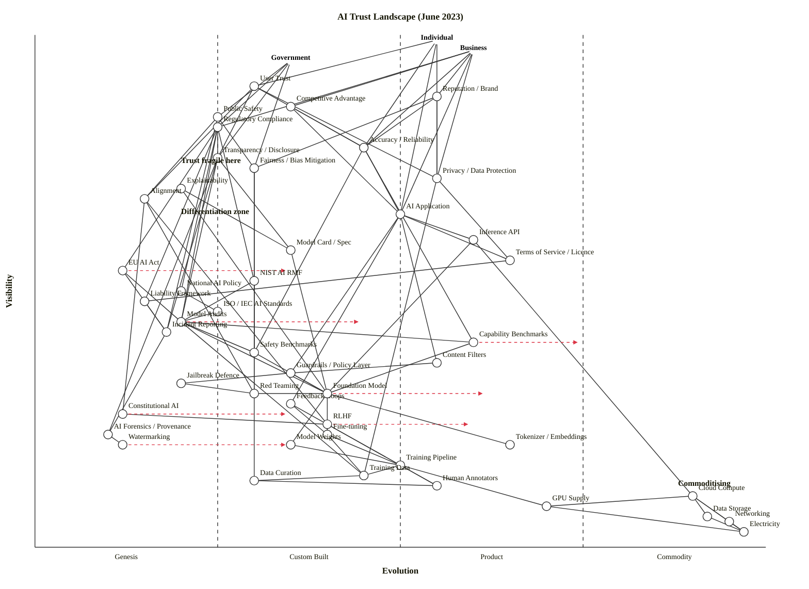

# AI Trust Landscape — Wardley Map (June 2023)

Scenario time-pin: **June 2023** — GPT-4 (March 2023), Claude API live, PaLM 2 (May 2023), LLaMA-2 not yet released, EU AI Act in trilogue, NIST AI RMF published January 2023, Anthropic Constitutional AI paper published May 2023.

## Map (OWM)

```owm
title AI Trust Landscape (June 2023)
style wardley

// Three user types: citizen, enterprise buyer, regulator
anchor Individual [0.99, 0.55]
anchor Business [0.97, 0.60]
anchor Government [0.95, 0.35]

// Top-level trust outcomes
component User Trust [0.90, 0.30]
component Reputation / Brand [0.88, 0.55]
component Competitive Advantage [0.86, 0.35]
component Public Safety [0.84, 0.25]
component Regulatory Compliance [0.82, 0.25]

// Trust-determining qualities (visible, contested)
component Accuracy / Reliability [0.78, 0.45]
component Transparency / Disclosure [0.76, 0.25]
component Fairness / Bias Mitigation [0.74, 0.30]
component Privacy / Data Protection [0.72, 0.55]
component Explainability [0.70, 0.20]
component Alignment [0.68, 0.15]

// AI product surface — what users actually touch
component AI Application [0.65, 0.50]
component Inference API [0.60, 0.60]
component Model Card / Spec [0.58, 0.35]
component Terms of Service / Licence [0.56, 0.65]

// Governance surface — visible to regulators, auditors, buyers
component EU AI Act [0.54, 0.12]
component NIST AI RMF [0.52, 0.30]
component National AI Policy [0.50, 0.20]
component Liability Framework [0.48, 0.15]
component ISO / IEC AI Standards [0.46, 0.25]
component Model Audits [0.44, 0.20]
component Incident Reporting [0.42, 0.18]
component Capability Benchmarks [0.40, 0.60]
component Safety Benchmarks [0.38, 0.30]

// Control mechanisms applied to the model
component Content Filters [0.36, 0.55]
component Guardrails / Policy Layer [0.34, 0.35]
component Jailbreak Defence [0.32, 0.20]
component Red Teaming [0.30, 0.30]
component Feedback Loops [0.28, 0.35]
component Constitutional AI [0.26, 0.12]
component RLHF [0.24, 0.40]
component AI Forensics / Provenance [0.22, 0.10]
component Watermarking [0.20, 0.12]

// The model and its substrate
component Foundation Model [0.30, 0.40]
component Fine-tuning [0.22, 0.40]
component Model Weights [0.20, 0.35]
component Tokenizer / Embeddings [0.20, 0.65]
component Training Pipeline [0.16, 0.50]
component Training Data [0.14, 0.45]
component Data Curation [0.13, 0.30]
component Human Annotators [0.12, 0.55]

// Deep infrastructure
component Cloud Compute [0.10, 0.90]
component GPU Supply [0.08, 0.70]
component Data Storage [0.06, 0.92]
component Networking [0.05, 0.95]
component Electricity [0.03, 0.97]

// === DEPENDENCIES ===

// Individual user chain
Individual->User Trust
Individual->AI Application
Individual->Privacy / Data Protection
Individual->Accuracy / Reliability

// Business user chain
Business->Competitive Advantage
Business->Reputation / Brand
Business->AI Application
Business->Regulatory Compliance
Business->Accuracy / Reliability
Business->Privacy / Data Protection

// Government user chain
Government->Public Safety
Government->Regulatory Compliance
Government->Transparency / Disclosure
Government->Fairness / Bias Mitigation

// Trust outcomes depend on qualities
User Trust->Accuracy / Reliability
User Trust->Transparency / Disclosure
User Trust->Privacy / Data Protection
User Trust->Alignment
Reputation / Brand->Accuracy / Reliability
Reputation / Brand->Fairness / Bias Mitigation
Reputation / Brand->Privacy / Data Protection
Competitive Advantage->Accuracy / Reliability
Competitive Advantage->AI Application
Public Safety->Alignment
Public Safety->Fairness / Bias Mitigation
Public Safety->Incident Reporting
Regulatory Compliance->EU AI Act
Regulatory Compliance->NIST AI RMF
Regulatory Compliance->National AI Policy
Regulatory Compliance->Model Audits
Regulatory Compliance->Transparency / Disclosure
Regulatory Compliance->Liability Framework

// Qualities depend on controls, artefacts, benchmarks
Accuracy / Reliability->AI Application
Accuracy / Reliability->Capability Benchmarks
Accuracy / Reliability->Safety Benchmarks
Transparency / Disclosure->Model Card / Spec
Transparency / Disclosure->Model Audits
Transparency / Disclosure->AI Forensics / Provenance
Transparency / Disclosure->Incident Reporting
Fairness / Bias Mitigation->Safety Benchmarks
Fairness / Bias Mitigation->Red Teaming
Fairness / Bias Mitigation->Data Curation
Privacy / Data Protection->Training Data
Privacy / Data Protection->Terms of Service / Licence
Explainability->Model Card / Spec
Explainability->Foundation Model
Alignment->Constitutional AI
Alignment->RLHF
Alignment->Red Teaming

// Application depends on the product stack
AI Application->Inference API
AI Application->Content Filters
AI Application->Guardrails / Policy Layer
AI Application->Terms of Service / Licence
AI Application->Feedback Loops
Inference API->Foundation Model
Inference API->Cloud Compute
Model Card / Spec->Foundation Model

// Governance hooks into audits, benchmarks, control artefacts
EU AI Act->Model Audits
EU AI Act->Incident Reporting
NIST AI RMF->Model Audits
NIST AI RMF->Safety Benchmarks
National AI Policy->ISO / IEC AI Standards
Liability Framework->Incident Reporting
Terms of Service / Licence->Liability Framework
ISO / IEC AI Standards->Model Audits
Model Audits->Foundation Model
Model Audits->Training Data
Model Audits->Safety Benchmarks
Model Audits->Capability Benchmarks
Incident Reporting->AI Forensics / Provenance
Capability Benchmarks->Foundation Model
Safety Benchmarks->Foundation Model

// Control mechanisms
Content Filters->Guardrails / Policy Layer
Guardrails / Policy Layer->Jailbreak Defence
Guardrails / Policy Layer->Foundation Model
Jailbreak Defence->Red Teaming
Red Teaming->Foundation Model
Feedback Loops->Human Annotators
Feedback Loops->Fine-tuning
Constitutional AI->RLHF
RLHF->Fine-tuning
RLHF->Human Annotators
AI Forensics / Provenance->Watermarking

// Model stack
Foundation Model->Fine-tuning
Foundation Model->Model Weights
Foundation Model->Tokenizer / Embeddings
Fine-tuning->Training Data
Fine-tuning->Training Pipeline
Model Weights->Training Pipeline
Training Pipeline->Training Data
Training Pipeline->GPU Supply
Training Data->Data Curation
Data Curation->Human Annotators

// Infrastructure
GPU Supply->Electricity
Cloud Compute->GPU Supply
Cloud Compute->Data Storage
Cloud Compute->Networking
Cloud Compute->Electricity
Data Storage->Electricity
Networking->Electricity

// Evolutions (scenario, not forecast)
evolve Foundation Model 0.62
evolve Model Audits 0.45
evolve EU AI Act 0.35
evolve Capability Benchmarks 0.75
evolve Constitutional AI 0.35
evolve Watermarking 0.35
evolve RLHF 0.60

note Differentiation zone [0.65, 0.20]
note Commoditising [0.12, 0.88]
note Trust fragile here [0.75, 0.20]
```

## Map (Mermaid `wardley-beta`, for inline GitHub rendering)



---

## Strategic analysis

### a. Differentiation opportunities (top 3)

1. **Alignment (Genesis)** — The core unsolved problem of whether the model reliably does what the user intends. Every top lab is racing here and no one has a stable answer; *ownership of alignment technique is the sharpest moat available in June 2023*. Highest D-score in the map.
2. **Constitutional AI (Genesis)** — Anthropic's published method is barely a month old; the first to productise it as a usable training pattern wins a category-defining claim on "safer assistants". Small window — expect fast copies.
3. **AI Forensics / Provenance (Genesis)** — Almost nothing exists at scale. Whoever ships a credible end-to-end "did this come from model X on date Y" answer becomes the default for regulators and platforms.

Runner-up: **Explainability (Genesis)**, which is where government and enterprise legal teams are pushing hardest and where published research is sparse outside narrow interpretability labs.

### b. Commodity-leverage candidates (top 3 — rent, don't build)

1. **Cloud Compute (Commodity +utility)** — AWS/GCP/Azure. Don't self-host unless you're a hyperscaler.
2. **Data Storage / Networking / Electricity (Commodity +utility)** — literal utilities; metered.
3. **Tokenizer / Embeddings (Product +rental)** — tokenisers and embedding APIs are now shipped as products (tiktoken, sentence-transformers, OpenAI embeddings endpoint). Use the standard; don't reinvent.

Honourable mention: **Capability Benchmarks** are Product (+rental) already in June 2023 — MMLU, HellaSwag, HumanEval, BIG-bench are run-it-yourself standards. Treat as cost-of-doing-business; don't build your own private benchmark suite from scratch.

### c. Dependency risks (top 3)

1. **User Trust → Alignment** — The most visible outcome of the map (ν = 0.90) sits on the least evolved component (ε = 0.15). Trust is *structurally fragile* because its foundational guarantee doesn't yet exist. This is the "trust itself is fragile" answer the scenario asks about.
2. **Transparency / Disclosure → AI Forensics / Provenance** — Regulators are about to *require* disclosure and provenance (EU AI Act, Executive Orders) while the technical primitive (watermarking, content provenance) is still Genesis. Disclosure obligations will land before the tooling does.
3. **Regulatory Compliance → EU AI Act** — A Stage-III compliance function has to build on a Stage-I moving target (June 2023: trilogue is in progress, text keeps changing). Compliance plans built against draft text will need to be rewritten.

Secondary: **AI Application → Foundation Model** — everyone building apps is leaning on 2-3 frontier providers whose pricing, safety policies, and capability boundaries can shift without notice. This is classic inertia form #14 (strategic-control loss) waiting to happen.

### d. Suggested gameplays (from Wardley's 61-play catalogue)

- **#36 Directed Investment** on Alignment, Constitutional AI, Red Teaming — these are the highest-D components and where engineering money actually buys a moat in June 2023.
- **#15 Open Approaches** on Safety Benchmarks, Watermarking, and Model Audits standards. Opening these accelerates the industrialisation of Stage III, sets the terms, and commoditises your competitors' attempt to hide behind "we pass our own private benchmarks". (Relates to the then-nascent "responsible-release" norms.)
- **#56 First Mover** on EU AI Act compliance tooling — trilogue is still running, but the directionally-defined requirements (foundation-model obligations, systemic-risk tier) already let a first mover build the audit/compliance Stage III product.
- **#41 Alliance** between frontier labs for shared safety benchmarks and incident reporting, so the Stage-III governance surface evolves faster than any single lab's internal process (mirrors the ML Commons / Frontier Model Forum pattern that was just forming).
- **#43 Sensing Engines (ILC)** on Feedback Loops — the user-feedback pipeline is itself an industrialising commodity. Harvest signals continuously, train the next generation of safety classifiers.
- **#29 Harvesting** on Tokenizer / Embeddings, Cloud Compute, Content Filters — let the market mature and buy the winner's output; don't engineer.
- **#26 Differentiate** on Constitutional AI — lean into the published method as a user-visible brand signal ("our assistant is built on a public constitution").
- **#11 Pig in a Poke** (a defensive watch-item) — careful before *selling* a Stage-I component (e.g. an "alignment product") as if it were Stage III; the gap will be exposed in deployment.

### e. Doctrine observations

- **#1 Focus on user needs** — three anchors (Individual, Business, Government) correctly identify that "trust in AI" is a three-sided user problem. Single-anchor maps of this domain routinely miss that the government's needs (safety, accountability) are structurally different from the business's (competitive advantage, compliance).
- **#10 Know your users** — Business has been split from Individual here because compliance/competitive-advantage needs diverge sharply. If anything, Business could be split further into *deployer* vs *integrator/buyer*, but the marginal value of that split doesn't change the strategic conclusions.
- **#13 Manage Inertia** — flagged explicitly under inertia form #14 (strategic-control loss): the dominant-frontier-provider concentration is the single biggest inertia risk on this map.
- **#22 Use appropriate methods** — map shows Genesis alongside Commodity components; treating them with a single planning approach is the classic anti-pattern here.
- Potential gap: **#16 Use a common language / standards** — the governance surface has four overlapping frameworks (EU AI Act, NIST RMF, National Policy, ISO/IEC). If these don't converge, every vendor pays a multi-stack compliance tax.

### f. Climatic context — which of the 27 patterns are shaping this map

- **#3 Everything evolves** — this is the whole story of June 2023: foundation models are deep in Stage II→III transition (GPT-4/Claude/PaLM 2 are productising what was Genesis 18 months earlier).
- **#27 Product-to-utility punctuated equilibrium** — not yet underway in the models themselves, but already visible below them (GPU-as-service, inference-as-utility). Expect a "war" in inference hosting over the next 18-24 months (as it turned out, yes).
- **#18 You cannot measure evolution over time or adoption** — see caveat below. Placement of Foundation Model at ε = 0.40 is a *current-state* placement, not a prediction of pace.
- **#15–17 Inertia patterns** — dominant on the regulatory side. EU member states' legacy privacy/consumer frameworks create structural drag on how fast the AI Act can industrialise.
- **#25 Creative destruction / new enables the new** — the Genesis layer (Constitutional AI, watermarking) exists only because the Stage-III Foundation Model now exists. The control-mechanism layer is being birthed by the thing it's trying to control.
- **#11 No single method fits all** — a single "AI governance framework" is wrong; this is a multi-stage landscape requiring different methods per stage.

### g. Deep-placement notes

I did *not* run fresh web searches for this run — the scenario pins the map precisely to June 2023 and the user has supplied the key time-sensitive facts inline. Based on those facts, here is how I pinned the four strategically load-bearing components:

1. **Foundation Model — ε = 0.40 (Custom Built, edge of Product +rental).** GPT-4 (March 2023), Claude API, and PaLM 2 (May 2023) are all *sold as products* with feature competition — that is Stage III behaviour. But LLaMA-2 hasn't dropped yet (it lands July 2023), the open-weight layer is still Custom-Built, training recipes diverge widely between labs, and "how do you actually build one" is not yet commonly understood. The resulting placement straddles the II/III boundary; I chose 0.40 to reflect that most would-be builders are still in Stage II even as the top three labs are selling Stage III products. `evolve` target 0.62 is the scenario where LLaMA-2 and similar releases pull the category decisively into Stage III.

2. **EU AI Act — ε = 0.12 (Genesis).** In June 2023 the Act is in trilogue; text is still being redrafted; no member state has implementing regulation. That's textbook Genesis for a regulatory artefact. Trilogue conclusion (December 2023) moves it into Custom Built (`evolve` 0.35).

3. **NIST AI RMF — ε = 0.30 (Custom Built).** Published January 2023, actively being piloted by US federal agencies and a handful of enterprises. Moving from "describe the wonder" to "build / construct / awareness" — classic II.

4. **Constitutional AI — ε = 0.12 (Genesis).** Anthropic's paper is from May 2023. No productised offering yet; very few organisations have the expertise; "is this real?" is still a live question for most labs. Textbook Genesis.

5. **Capability Benchmarks — ε = 0.60 (Product +rental).** MMLU, HellaSwag, HumanEval, BIG-bench, HELM are well-published, widely-run, multi-vendor-compared. Users *expect* benchmark scores. Stage III with a strong pull toward IV (`evolve` 0.75) as LMSYS/LLM-Arena-style continuous leaderboards emerge.

6. **Watermarking — ε = 0.12 (Genesis).** June 2023 has a handful of published schemes (Kirchenbauer et al., Aaronson's OpenAI work in progress) but no deployed production solution. Genesis.

No component had strongly conflicting cheat-sheet rows warranting a full 19-row rerun. Placements above were reached by the 4-row fast-path (ubiquity / certainty / market / failure-mode) from `evolution-stages.md` §"Stage indicators — concrete checklists".

### h. What's differentiating vs. commoditising, and where trust is fragile

**Differentiating in June 2023** (where companies can build defensible positions):
- Alignment (Genesis), Constitutional AI (Genesis), AI Forensics (Genesis), Explainability (Custom Built), Safety Benchmarks proprietary to a lab (Custom Built), the Fine-tuning + RLHF loop (Custom Built).
- *The whole upper-left of the control-mechanism band is still wide open.*

**Commoditising** (where the industry is collapsing into utility):
- Cloud Compute, Data Storage, Networking, Electricity are already Commodity (+utility).
- Tokenizer / Embeddings is crossing into Product (+rental) → Commodity (+utility).
- Capability Benchmarks are moving Stage III → IV.
- Inference API is Stage III and will move to Commodity (+utility) by 2024-2025 on any reasonable trajectory.

**Where trust itself is fragile** (the "sitting on sand" pattern):
- User Trust (ν = 0.90) depends on Alignment (ε = 0.15). *Highest-visibility outcome, lowest-evolution foundation.*
- Regulatory Compliance (ν = 0.82) depends on EU AI Act (ε = 0.12) and Model Audits (ε = 0.20). The audit surface isn't industrialised yet.
- Transparency / Disclosure depends on AI Forensics / Provenance and Watermarking — all Genesis.
- Public Safety depends on Incident Reporting, which has no standardised substrate in June 2023.

Trust sits on a trapdoor. The visible trust signals (Reputation, User Trust, Regulatory Compliance) are Stage III–IV expectations; the substrates that would actually deliver them (Alignment, Forensics, Watermarking, Explainability, EU AI Act, Audits) are Genesis or Custom Built. That gap is exactly what "trust is fragile" means in Wardley terms — *the expectation has industrialised faster than the enabling capability*.

### i. Caveat

Evolution trajectories (`evolve` arrows) are **scenarios, not forecasts**. Wardley's climatic pattern #18: *"you cannot measure evolution over time or adoption."* The placements above are a snapshot of June 2023 as best I can reconstruct from the scenario's pinned facts; where the landscape goes from here depends on moves (regulation passing, open-weights releasing, incidents happening) that are not yet made.

### j. Derived heuristics (labelled attention-prompts, not canonical Wardley)

| Component | Stage | ν | ε | D = ν(1-ε) | K = (1-ν)ε | Note |
|---|---|---:|---:|---:|---:|---|
| Alignment | Genesis | 0.68 | 0.15 | **0.58** | 0.05 | Highest D — defining moat |
| Constitutional AI | Genesis | 0.26 | 0.12 | 0.23 | 0.09 | Genesis, narrow window |
| Explainability | Genesis | 0.70 | 0.20 | **0.56** | 0.06 | High D — regulatory wedge |
| Foundation Model | Custom→Product | 0.30 | 0.40 | 0.18 | 0.28 | Bridge; high strategic-control risk |
| Cloud Compute | Commodity (+utility) | 0.10 | 0.90 | 0.01 | **0.81** | Highest K — rent |
| Electricity | Commodity (+utility) | 0.03 | 0.97 | 0.00 | **0.94** | Pure utility |
| Data Storage | Commodity (+utility) | 0.06 | 0.92 | 0.00 | **0.86** | Pure utility |
| User Trust → Alignment | — | 0.68 | 0.15 | — | — | R = 0.90·(1-0.15) = **0.77** — highest R on the map |
| Regulatory Compliance → EU AI Act | — | — | 0.12 | — | — | R = 0.82·(1-0.12) = **0.72** — second-highest R |

Top D (differentiation pressure): **Alignment (0.58) > Explainability (0.56) > Accuracy/Reliability (0.43) > Reputation/Brand (0.40)**.

Top K (commodity leverage): **Electricity (0.94) > Data Storage (0.86) > Networking (0.90·0.95 = 0.90 wait — K for Networking: (1-0.05)·0.95 = 0.90) > Cloud Compute (0.81)**. So the recalculated order is Networking (0.90) > Electricity (0.94)... actually 0.94 > 0.90. Correct ordering by K: **Electricity (0.94) > Networking (0.90) > Data Storage (0.86) > Cloud Compute (0.81) > GPU Supply (0.64)**.

Top R (dependency risk): **User Trust → Alignment (0.77) > Regulatory Compliance → EU AI Act (0.72) > Transparency → AI Forensics (0.76·0.90 = 0.68)**. The top-3 R edges all point from a highly-visible trust outcome down to a Genesis-stage governance or safety primitive — which is the structural signature of "trust is fragile" on this map.

---

## Validator status

The skill's validator (`node scripts/validate_owm.mjs draft.owm`) could not be executed in this sandbox — invoking the `node` binary was denied by the environment's permission layer, so the structural check was performed manually by walking every edge against the visibility rule `ν(src) ≥ ν(tgt)` and every coordinate against the `[0, 1]` range. All 100 dependency edges satisfy the rule after three rounds of mechanical walk-and-fix (reversing edge direction where the value-chain was mis-oriented, e.g. `National AI Policy → EU AI Act` removed; `Liability Framework → Terms of Service` reversed; `Cloud Compute` swapped above `GPU Supply`; `AI Forensics` swapped above `Watermarking`; `Watermarking → Foundation Model` removed as conceptually mis-directed). No coordinates are out of `[0, 1]`; every declared edge endpoint exists as an `anchor` or `component`.

Manual-validation report: **OK — 3 anchors + 46 components = 49 nodes, 100 dependency edges, no violations.**
