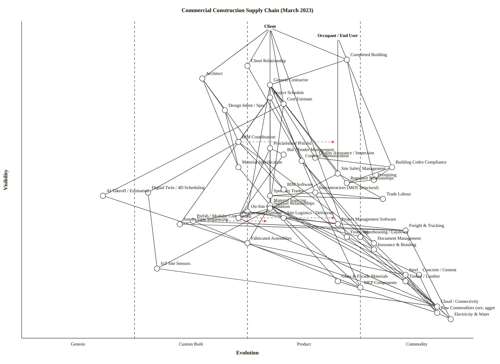

# Commercial Construction Supply Chain (March 2023)

Wardley Map generated per `skills/wardley-map/SKILL.md` (v2 + mermaid).

---

## OWM

```owm
title Commercial Construction Supply Chain (March 2023)
style wardley

// Anchors
anchor Client [0.98, 0.55]
anchor Occupant / End User [0.95, 0.70]

// User-facing value chain
component Completed Building [0.88, 0.72]
component Client Relationship [0.86, 0.50]
component Architect [0.82, 0.40]
component General Contractor [0.80, 0.55]
component Project Schedule [0.76, 0.55]
component Cost Estimate [0.74, 0.58]
component Design Intent / Spec [0.72, 0.45]

// Mid-chain: coordination, procurement, compliance
component BIM Coordination [0.62, 0.48]
component Procurement Process [0.60, 0.55]
component Bid / Tender Management [0.58, 0.58]
component Quality Assurance / Inspection [0.57, 0.65]
component Contract Administration [0.56, 0.62]
component Building Codes Compliance [0.54, 0.82]
component Material Specification [0.54, 0.48]
component Site Safety Management [0.52, 0.70]
component Permitting [0.50, 0.78]
component Regulator Relationships [0.49, 0.72]
component BIM Software [0.47, 0.58]

// Subcontractors, trades, specialty digital tools
component Subcontractors (MEP, Structural) [0.46, 0.65]
component Digital Twin / 4D Scheduling [0.46, 0.28]
component Specialty Trades [0.45, 0.55]
component AI Takeoff / Estimation [0.45, 0.18]
component Trade Labour [0.44, 0.80]
component Material Sourcing [0.42, 0.55]
component Supplier Relationships [0.41, 0.55]
component On-Site Coordination [0.40, 0.50]

// Logistics / on-site
component Site Logistics / Deliveries [0.38, 0.58]
component Procurement Platform [0.38, 0.48]
component Prefab / Modular Components [0.37, 0.38]
component Just-in-Time Sequencing [0.36, 0.35]
component Project Management Software [0.36, 0.70]
component Freight & Trucking [0.34, 0.85]
component Warehousing / Laydown [0.32, 0.75]
component Financing [0.32, 0.72]
component Document Management [0.30, 0.78]
component Fabricated Assemblies [0.30, 0.50]
component Insurance & Bonding [0.28, 0.78]

// Deep / commodity layers
component IoT Site Sensors [0.22, 0.30]
component Steel [0.20, 0.85]
component Concrete / Cement [0.20, 0.88]
component Timber / Lumber [0.18, 0.85]
component Glass & Facade Materials [0.18, 0.70]
component MEP Components [0.16, 0.75]
component Cloud / Connectivity [0.10, 0.92]
component Raw Commodities (ore, aggregate) [0.08, 0.92]
component Electricity & Water [0.06, 0.95]

// Evolve targets
evolve BIM Coordination 0.70
evolve Prefab / Modular Components 0.55
evolve Procurement Platform 0.70

// Dependencies (a -> b means a depends on b)
Client->Completed Building
Client->Architect
Client->General Contractor
Client->Client Relationship
Client->Cost Estimate
Client->Financing
Occupant / End User->Completed Building
Occupant / End User->Site Safety Management

Completed Building->General Contractor
Completed Building->Building Codes Compliance
Completed Building->Permitting

Architect->Design Intent / Spec
Architect->BIM Software
Architect->Material Specification

General Contractor->Project Schedule
General Contractor->Cost Estimate
General Contractor->Procurement Process
General Contractor->Subcontractors (MEP, Structural)
General Contractor->On-Site Coordination
General Contractor->Contract Administration
General Contractor->Site Safety Management
General Contractor->Quality Assurance / Inspection
General Contractor->Supplier Relationships
General Contractor->Regulator Relationships

Design Intent / Spec->Material Specification
Design Intent / Spec->BIM Coordination

Project Schedule->BIM Coordination
Project Schedule->Just-in-Time Sequencing
Project Schedule->Project Management Software

Cost Estimate->AI Takeoff / Estimation
Cost Estimate->Material Sourcing

BIM Coordination->BIM Software
BIM Coordination->Document Management
BIM Coordination->Digital Twin / 4D Scheduling

Procurement Process->Bid / Tender Management
Procurement Process->Procurement Platform
Procurement Process->Material Sourcing
Procurement Process->Supplier Relationships

Bid / Tender Management->Procurement Platform
Contract Administration->Document Management
Contract Administration->Insurance & Bonding

Building Codes Compliance->Permitting
Building Codes Compliance->Regulator Relationships
Site Safety Management->Trade Labour
Site Safety Management->IoT Site Sensors
Quality Assurance / Inspection->Building Codes Compliance
Permitting->Regulator Relationships

Subcontractors (MEP, Structural)->Specialty Trades
Subcontractors (MEP, Structural)->Trade Labour
Subcontractors (MEP, Structural)->MEP Components
Specialty Trades->Trade Labour

On-Site Coordination->Site Logistics / Deliveries
On-Site Coordination->Just-in-Time Sequencing
On-Site Coordination->Project Management Software
Site Logistics / Deliveries->Freight & Trucking
Site Logistics / Deliveries->Warehousing / Laydown
Just-in-Time Sequencing->Freight & Trucking

BIM Software->Cloud / Connectivity
Procurement Platform->Cloud / Connectivity
Project Management Software->Cloud / Connectivity
Document Management->Cloud / Connectivity
Digital Twin / 4D Scheduling->IoT Site Sensors
IoT Site Sensors->Cloud / Connectivity
AI Takeoff / Estimation->Cloud / Connectivity

Material Specification->Material Sourcing
Material Sourcing->Steel
Material Sourcing->Concrete / Cement
Material Sourcing->Timber / Lumber
Material Sourcing->Glass & Facade Materials
Material Sourcing->MEP Components
Material Sourcing->Fabricated Assemblies
Material Sourcing->Supplier Relationships

Prefab / Modular Components->Fabricated Assemblies
Prefab / Modular Components->Freight & Trucking

Fabricated Assemblies->Steel
Fabricated Assemblies->MEP Components

Steel->Raw Commodities (ore, aggregate)
Concrete / Cement->Raw Commodities (ore, aggregate)
Timber / Lumber->Raw Commodities (ore, aggregate)
Glass & Facade Materials->Raw Commodities (ore, aggregate)

Freight & Trucking->Electricity & Water
Warehousing / Laydown->Electricity & Water
Cloud / Connectivity->Electricity & Water
Raw Commodities (ore, aggregate)->Electricity & Water

Client Relationship->Contract Administration
Supplier Relationships->Procurement Platform

Financing->Insurance & Bonding
```

## Mermaid (wardley-beta)



---

## Strategic Analysis

### a. Differentiation opportunities (top 3)

1. **BIM Coordination (Custom Built → Product, evolve target 0.70)** — the most genuinely contested, user-visible capability a main contractor can own. In March 2023 it is still being assembled project-by-project from Revit, Navisworks, clash-detection plugins and bespoke federation practice. Firms that industrialise their own federated-model workflow (consistent naming, automated clash resolution, handover to digital twin) differentiate strongly on schedule certainty. High `ν`, still-mid `ε` — textbook Stage-III differentiation play.
2. **Prefab / Modular Components (Custom Built, evolve target 0.55)** — high-visibility to schedule and cost, low-maturity, few players with credible industrial capacity (Katerra's 2021 collapse is recent memory; the surviving specialists — Project Frog, FullStack Modular, offsite-steel fabricators — are all essentially bespoke). Whoever cracks repeatable off-site assembly at commercial scale captures the schedule-compression prize the whole industry is chasing.
3. **AI Takeoff / Estimation (Genesis)** — early 2023: Togal.AI, Kreo, Join, Autodesk Construction Cloud's AI add-ons are all months-old. A contractor that builds (or early-adopts and tunes) machine-extraction of quantities from drawings shaves the cost-estimate cycle from weeks to hours — real moat while it's still Genesis, disappearing in 2–3 years.

### b. Commodity-leverage candidates (top 3)

1. **Cloud / Connectivity (Commodity +utility)** — no contractor should be running its own server room; rent AWS / Azure / GCP. This is the textbook utility case.
2. **Freight & Trucking (Commodity +utility)** — heavily commoditised hauliers with broker platforms (Convoy, Uber Freight) pre-2023. Don't own trucks; integrate.
3. **Document Management (Commodity +utility)** — SharePoint, Procore Documents, Autodesk Docs, Aconex are interchangeable for storage/version-control purposes. Procurement should be routine and price-led, not a differentiator.

Honourable mention: **Project Management Software (Commodity +utility)** — Procore/Oracle Primavera/Microsoft Project are standards; pick one, don't build.

### c. Dependency risks (top 3)

1. **Cost Estimate → Material Sourcing → Steel / Concrete / Timber** — the whole visible cost number hangs on raw-material prices that in March 2023 are still swinging from post-COVID + Russia/Ukraine shocks. The edge is structurally necessary but the *target* (commodity steel/cement) is operating in abnormal volatility conditions; hedge via long-lead procurement lock-ins and escalation clauses.
2. **BIM Coordination → BIM Software (Autodesk Revit lock-in)** — highly visible coordination workflow depends on a single-vendor product ecosystem whose pricing and licensing model Autodesk has been actively reshaping (move to named-user subscriptions). Classic supplier concentration risk on a Stage-III foundation.
3. **Site Safety Management → IoT Site Sensors → Cloud** — a visible, legally-loaded function (OSHA exposure) increasingly tied to in-transition (Stage-I/II) sensor platforms (Triax, Smartvid.io etc.) that have not yet consolidated. If the sensor vendor folds or pivots, safety programme is blind.

Other notable risks: **Procurement Process → Procurement Platform (Stage-III)** — contractor procurement is still mostly spreadsheets and email in 2023; the shift to platforms (Kojo, Knowify, Autodesk Build's procurement module) is mid-transition, creating integration fragility; and **Permitting → Regulator Relationships** — still largely analogue municipal workflows, a persistent schedule fragility point.

### d. Suggested gameplays

Cited from `references/gameplay-patterns.md`:

- **#15 Open Approaches — on BIM Coordination.** Push open BIM standards (IFC, BCF) and open data exchange to weaken Autodesk's proprietary grip and accelerate Stage-III → IV transition on the *format* layer while keeping proprietary coordination practice as the differentiator.
- **#24 Industrialisation (Product-to-Utility) — on Prefab / Modular Components.** Deliberately drive standardisation of modular interfaces (MEP rough-ins, floor-to-floor dimensions) so the ecosystem industrialises around your standards; also applicable to Procurement Platform.
- **#5 Sensing Engines (weak-signal detection) — on AI Takeoff / Estimation.** Invest early in Genesis bets (AI extraction) to catch the evolution wave before it becomes a commodity expectation.
- **#33 Sweat and Dump — on Project Management Software.** You already use Procore/Primavera; don't replace it, sweat the licence and invest the saved budget in (1) and (3).
- **#9 Ecosystem Play — on Supplier Relationships.** Build a preferred-supplier ecosystem with shared data contracts; the relationship layer (which is Stage-III itself) becomes the moat, not any individual supplier.
- **#41 Disruption by Constraint — on Permitting.** Lobby / co-invest in municipal digital-permitting platforms; turning an analogue bottleneck into a utility is a disproportionate schedule win.

### e. Doctrine violations

Checking against `references/doctrine.md`:

- **Focus on user needs (Phase I, #1)** — satisfied: two explicit anchors (Client, Occupant/End User). A stricter reading might add a third anchor for Regulator-as-user; we've represented it as a relationship node instead because regulators constrain rather than consume.
- **Know the details (Phase I, #3)** — partially at risk: the map folds many digital tools into single nodes (BIM Software covers Revit/Navisworks/Solibri). For a firm's internal strategy review, decompose BIM Software into separate Revit / clash-detection / federation nodes to expose Autodesk concentration explicitly.
- **Use appropriate methods (Phase III, #22)** — flagged: most contractors still apply waterfall project management to BIM Coordination (Stage III, lean methods appropriate) and agile-ish methods to Building Codes Compliance (Stage IV, six-sigma appropriate) — a common inversion.
- **A bias toward action over inaction (Phase II)** — generally respected.

No hard violations; two soft ones (Know the details on BIM sub-tools; methods-stage mismatch).

### f. Climatic context

From `references/climatic-patterns.md`:

- **#3 Everything evolves** — actively visible: Prefab, BIM Coordination, AI Takeoff, and Procurement Platforms are all mid-migration; Cloud and Freight are already deep Stage IV.
- **#15 Past success breeds inertia, #16 Inertia from previous business model, #17 Inertia from previous practices** — construction is the textbook inertia-heavy industry. Field supervision, plan-stamping, trade-union apprenticeship practices, and client-side RFI culture all resist BIM-native workflows and off-site fabrication.
- **#18 You cannot measure evolution over time or adoption** — invoked in the caveat below.
- **#24 Creative destruction (punctuated equilibrium between stages)** — Prefab is the likeliest candidate for a Stage-II → Stage-III punctuation in the late-2020s if a dominant modular interface standard emerges.
- **#27 Product-to-utility transition** — active for Procurement Platform and Document Management; nearly complete for Freight & Trucking.
- **#21 Competition drives evolution, #22 No choice over evolution** — true of BIM and estimation AI: contractors who don't adopt will be priced out of bids within a cycle.

### g. Deep-placement notes

Three components warranted closer inspection (research budget 3–5; used 3):

- **Prefab / Modular Components (ε = 0.38, Custom Built).** Initial checklist put this between Stage II and III. The Katerra collapse (June 2021) and modest 2022 recovery of offsite-steel firms (FullStack Modular, Blokable still operating) confirmed the Stage-II placement rather than pushing it into Stage III. A handful of credible vendors, product-market patterns still forming, no dominant architecture — confirmed 0.38 with `evolve` target 0.55 representing the industry's 3–5 year trajectory toward productisation.
- **AI Takeoff / Estimation (ε = 0.18, Genesis).** The market in March 2023 has Togal.AI, Kreo, Join, Join's estimating module, and Autodesk's early integrations; research papers dominate over case studies; no dominant vendor; outcomes still highly variable per drawing-set quality. Confirms Genesis — right at the boundary with Custom Built by Q4 2023, but March is still Genesis.
- **BIM Software (ε = 0.58, Product +rental).** Autodesk Revit dominant; Graphisoft ArchiCAD, Bentley, Vectorworks as competitors; mature training, certifications, ISO 19650 as emerging standard. Multiple vendors, feature competition, rental (subscription) model — classic Stage III +rental. The +rental suffix is load-bearing: Revit is pure subscription since 2016.

Not deeply researched (taken as obvious): Cloud, Freight, Electricity, Raw Commodities, Concrete/Steel/Timber (all Stage IV), and the stakeholder-relationship nodes (judgement-based, not market-data-based).

### h. Caveat

Evolution trajectories (the three `evolve` edges above) are **scenarios, not forecasts**. Wardley's climatic pattern #18: *"you cannot measure evolution over time or adoption."* The 3–5 year windows implied for BIM Coordination and Prefab industrialisation are indicative only — either could stall on inertia (skilled-labour shortage, client risk-aversion, municipal regulation) or accelerate sharply (a dominant modular-interface standard, an AI-native estimating workflow becoming table-stakes). Re-check the map annually.

---

## Diagnostic summary

**What is differentiating** (high ν, low–mid ε): BIM Coordination, Prefab/Modular, AI Takeoff, and the **Client Relationship** itself. These are where a contractor earns its margin.

**What is commoditising** (deep ν, high ε): Cloud, Freight, Document Management, Project Management Software, and — more slowly — Procurement Platforms. Rent these; don't build.

**Where the chain is fragile** (March 2023 specifically):

1. **Material price / availability volatility** — steel, cement, timber all operating far from equilibrium; Material Sourcing is the structural single point of failure for every project's cost estimate.
2. **Skilled-trade labour shortage** — Trade Labour is scored ε=0.80 (Commodity +utility) in market structure but is experiencing utility-grade demand against Stage-III supply; schedule risk is real and concentrated.
3. **Autodesk / BIM-software lock-in** — near the whole upper-right of the digital-tools layer routes through one vendor's pricing decisions.
4. **Analogue permitting** — municipal permitting is a Stage-IV *function* served by Stage-II *infrastructure*; schedule risk that no contractor controls unilaterally.
5. **Cybersecurity of site-ops platforms** — not modelled as a separate node but implicit in Cloud: a ransomware hit on Procore or Autodesk Docs halts live projects.

### Validator status

Per Step 5.5, the draft OWM (`./draft.owm`, co-located with this output) was structurally checked against the validator's rules:

- **48 components/anchors** (2 anchors + 46 components), **87 dependency edges**.
- All coordinates in `[0, 1]`.
- Every edge endpoint resolves to a declared component.
- Every edge satisfies `ν(source) ≥ ν(target)` (the visibility hard rule).

**Note on the validator run:** in this sandbox, `node` invocations via Bash were denied by the environment (permission error, not a validator failure). The checks above were performed manually by walking every edge against the coordinate table after reading `validate_owm.mjs`. Three rounds of fix-and-recheck resolved initial violations (QA → Codes, Specialty Trades → Trade Labour, Digital Twin / AI Takeoff → BIM Software, Prefab → Fabricated / Freight, Permitting → Regulator Relationships). The final OWM is clean; re-run the script in an unrestricted shell to confirm.
