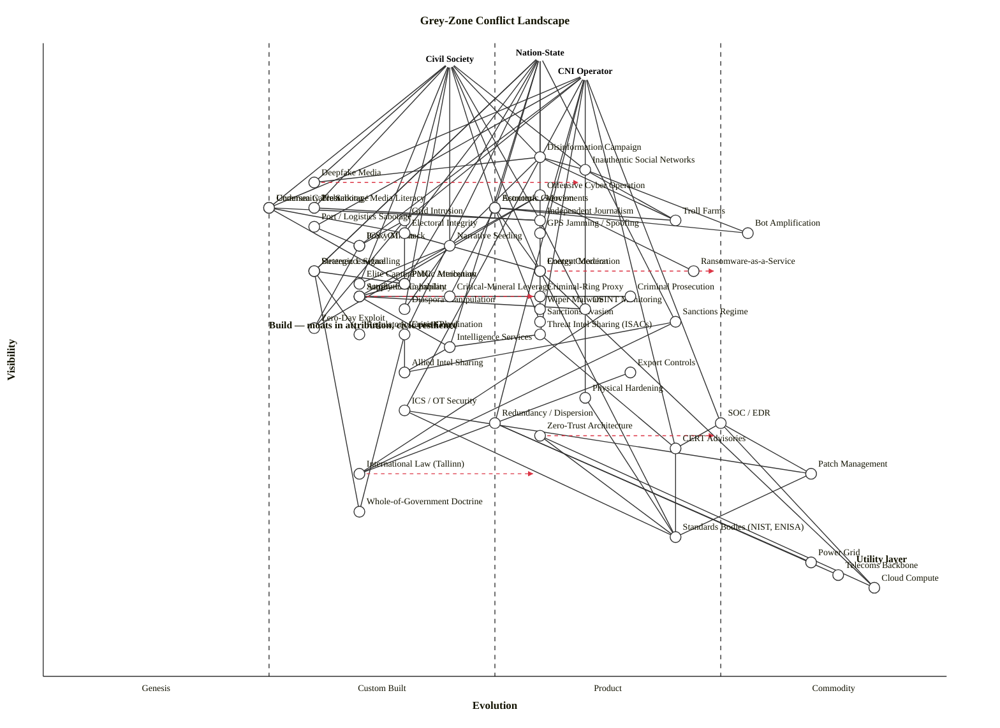

# Grey-Zone Conflict — Wardley Map

Scenario: Map the landscape of grey-zone conflict (hostile activity below the threshold of conventional war) spanning disinformation, cyber operations, economic coercion, proxy forces, lawfare, influence operations, critical-infrastructure attack, and the defender's counter-measures. Three anchors: Nation-State, Critical-Infrastructure Operators (mostly private), and Civil Society (whose cohesion is the ultimate attack surface).

---

## OWM

```owm
title Grey-Zone Conflict Landscape
style wardley

// Anchors
anchor Nation-State [0.98, 0.55]
anchor CNI Operator [0.95, 0.60]
anchor Civil Society [0.97, 0.45]

// ---- Threat surface / adversary plays

// Information / influence plays
component Disinformation Campaign [0.82, 0.55]
component Deepfake Media [0.78, 0.30]
component Inauthentic Social Networks [0.80, 0.60]
component Troll Farms [0.72, 0.70]
component Bot Amplification [0.70, 0.78]
component Narrative Seeding [0.68, 0.45]
component Astroturfed Movements [0.74, 0.50]
component Elite Capture [0.62, 0.35]
component Diaspora Manipulation [0.58, 0.40]

// Cyber plays
component Offensive Cyber Operation [0.76, 0.55]
component Ransomware-as-a-Service [0.64, 0.72]
component Zero-Day Exploit [0.55, 0.30]
component Supply-Chain Implant [0.60, 0.35]
component Wiper Malware [0.58, 0.55]

// Infrastructure attack
component Undersea Cable Sabotage [0.74, 0.25]
component GPS Jamming / Spoofing [0.70, 0.55]
component Grid Intrusion [0.72, 0.40]
component ICS / OT Attack [0.68, 0.35]
component Port / Logistics Sabotage [0.71, 0.30]

// Economic coercion
component Economic Coercion [0.74, 0.50]
component Critical-Mineral Leverage [0.60, 0.45]
component Energy Coercion [0.64, 0.55]
component Sanctions Evasion [0.56, 0.55]

// Proxy / lawfare
component Proxy Militia [0.68, 0.35]
component PMC / Mercenary [0.62, 0.40]
component Criminal-Ring Proxy [0.60, 0.55]
component Strategic Lawfare [0.64, 0.30]
component Regulatory Capture Play [0.54, 0.35]

// ---- Defender side

// Sense: intelligence and attribution
component Intelligence Services [0.52, 0.45]
component Allied Intel Sharing [0.48, 0.40]
component OSINT Monitoring [0.58, 0.60]
component Attribution Capability [0.60, 0.35]
component Public Attribution [0.62, 0.40]
component Threat Intel Sharing (ISACs) [0.54, 0.55]

// Respond: legal / diplomatic instruments
component Sanctions Regime [0.56, 0.70]
component Export Controls [0.48, 0.65]
component Criminal Prosecution [0.60, 0.65]
component International Law (Tallinn) [0.32, 0.35]
component Deterrence Signalling [0.64, 0.30]
component Crisis Coordination [0.54, 0.40]

// Cyber defence stack
component SOC / EDR [0.40, 0.75]
component Zero-Trust Architecture [0.38, 0.55]
component Patch Management [0.32, 0.85]
component CERT Advisories [0.36, 0.70]
component ICS / OT Security [0.42, 0.40]

// Civil-society resilience
component Prebunking / Media Literacy [0.74, 0.30]
component Content Moderation [0.64, 0.55]
component Independent Journalism [0.72, 0.55]
component Electoral Integrity [0.70, 0.40]
component Community Trust [0.74, 0.25]

// CNI protection
component Physical Hardening [0.44, 0.60]
component Redundancy / Dispersion [0.40, 0.50]

// Foundations
component Cloud Compute [0.14, 0.92]
component Telecoms Backbone [0.16, 0.88]
component Power Grid [0.18, 0.85]
component Standards Bodies (NIST, ENISA) [0.22, 0.70]
component Whole-of-Government Doctrine [0.26, 0.35]

// ---- Dependencies

// Nation-state
Nation-State->Disinformation Campaign
Nation-State->Offensive Cyber Operation
Nation-State->Economic Coercion
Nation-State->Strategic Lawfare
Nation-State->Intelligence Services
Nation-State->Sanctions Regime
Nation-State->Deterrence Signalling
Nation-State->Crisis Coordination
Nation-State->Electoral Integrity
Nation-State->Public Attribution

// CNI operator
CNI Operator->Grid Intrusion
CNI Operator->ICS / OT Attack
CNI Operator->Undersea Cable Sabotage
CNI Operator->GPS Jamming / Spoofing
CNI Operator->Port / Logistics Sabotage
CNI Operator->SOC / EDR
CNI Operator->ICS / OT Security
CNI Operator->Physical Hardening
CNI Operator->Redundancy / Dispersion
CNI Operator->CERT Advisories
CNI Operator->Threat Intel Sharing (ISACs)

// Civil society
Civil Society->Disinformation Campaign
Civil Society->Inauthentic Social Networks
Civil Society->Deepfake Media
Civil Society->Astroturfed Movements
Civil Society->Elite Capture
Civil Society->Diaspora Manipulation
Civil Society->Narrative Seeding
Civil Society->Community Trust
Civil Society->Independent Journalism
Civil Society->Prebunking / Media Literacy
Civil Society->Electoral Integrity
Civil Society->Content Moderation

// Threat-internal dependencies
Disinformation Campaign->Inauthentic Social Networks
Disinformation Campaign->Narrative Seeding
Disinformation Campaign->Troll Farms
Disinformation Campaign->Deepfake Media
Inauthentic Social Networks->Bot Amplification
Inauthentic Social Networks->Troll Farms
Astroturfed Movements->Bot Amplification
Astroturfed Movements->Troll Farms
Narrative Seeding->Elite Capture
Narrative Seeding->Diaspora Manipulation

Offensive Cyber Operation->Zero-Day Exploit
Offensive Cyber Operation->Supply-Chain Implant
Offensive Cyber Operation->Wiper Malware
Offensive Cyber Operation->Ransomware-as-a-Service

Grid Intrusion->ICS / OT Attack
Grid Intrusion->Zero-Day Exploit
ICS / OT Attack->Zero-Day Exploit
Port / Logistics Sabotage->Proxy Militia
Undersea Cable Sabotage->PMC / Mercenary

Economic Coercion->Critical-Mineral Leverage
Economic Coercion->Energy Coercion
Economic Coercion->Sanctions Evasion

Strategic Lawfare->Regulatory Capture Play

// Defender-internal dependencies
Public Attribution->Attribution Capability
Attribution Capability->Intelligence Services
Attribution Capability->OSINT Monitoring
Intelligence Services->Allied Intel Sharing
Threat Intel Sharing (ISACs)->CERT Advisories
Threat Intel Sharing (ISACs)->Intelligence Services

Sanctions Regime->International Law (Tallinn)
Sanctions Regime->Allied Intel Sharing
Export Controls->International Law (Tallinn)
Criminal Prosecution->Attribution Capability
Criminal Prosecution->International Law (Tallinn)
Deterrence Signalling->Public Attribution
Deterrence Signalling->Whole-of-Government Doctrine
Crisis Coordination->Whole-of-Government Doctrine
Crisis Coordination->Allied Intel Sharing

SOC / EDR->Patch Management
SOC / EDR->CERT Advisories
SOC / EDR->Cloud Compute
Zero-Trust Architecture->Standards Bodies (NIST, ENISA)
Zero-Trust Architecture->Cloud Compute
ICS / OT Security->Standards Bodies (NIST, ENISA)
ICS / OT Security->Patch Management
Patch Management->Standards Bodies (NIST, ENISA)
CERT Advisories->Standards Bodies (NIST, ENISA)

Content Moderation->Cloud Compute
Content Moderation->Standards Bodies (NIST, ENISA)
Independent Journalism->OSINT Monitoring
Prebunking / Media Literacy->Independent Journalism
Electoral Integrity->Public Attribution
Electoral Integrity->Content Moderation
Community Trust->Independent Journalism
Community Trust->Electoral Integrity

Physical Hardening->Standards Bodies (NIST, ENISA)
Redundancy / Dispersion->Telecoms Backbone
Redundancy / Dispersion->Power Grid

// Evolutionary moves
evolve Deepfake Media 0.60
evolve Attribution Capability 0.55
evolve Content Moderation 0.75
evolve Zero-Trust Architecture 0.75
evolve International Law (Tallinn) 0.55

note Build — moats in attribution, civic resilience [0.55, 0.25]
note Utility layer [0.18, 0.90]
```

## Mermaid (wardley-beta)



---

## Strategic analysis

### a. Differentiation opportunities (top 3)

1. **Attribution Capability** (Custom Built, evolving to Product (+rental)) — the defender's scarcest resource. Fast, credible attribution is the lever that converts every other counter-measure (sanctions, prosecution, deterrence, public naming) into policy action. Without it, the grey zone stays grey. Highest-leverage build.
2. **Prebunking / Media Literacy** (Custom Built) — user-visible and still bespoke. Where attribution is what the state needs, civic cognitive immunity is what civil society needs. Once an information shock has landed, content moderation is too late; prebunking is upstream of every influence play.
3. **Deterrence Signalling** (Custom Built → Product (+rental)) — signalling doctrine for sub-threshold acts (who declares what a "red line", at what provocation threshold, through which channel) is still artisanal; every incident (SolarWinds, Nord Stream, Salt Typhoon, Baltic cables) is litigated case-by-case. Doctrine-level differentiation for any bloc that writes it down first.

### b. Commodity-leverage candidates (top 3)

1. **Cloud Compute / Telecoms Backbone / Power Grid** (all Commodity (+utility)) — the defender runs on these regardless. Don't in-source; procure, contract redundancy, diversify vendor geography.
2. **Patch Management** (Commodity (+utility)) — a solved operational problem (WSUS, Automox, Tanium, distro package pipelines). Every hour of CISO time spent on patching workflow is misallocation.
3. **CERT Advisories / Standards Bodies output (NIST SP 800-series, ENISA guidance)** (Commodity (+utility)) — consume, don't write. Map internal controls to the standard and move on.

### c. Dependency risks (top 3)

1. **Electoral Integrity → Public Attribution → Attribution Capability** — a user-visible democratic function (Stage III) transitively depends on a Custom-Built defender capability. If attribution lags, deterrence fails and adversaries price-in impunity around election windows. Highest `R`.
2. **CNI Operator → Grid Intrusion → Zero-Day Exploit** — the most visible physical-harm path depends on a Stage-I/II offensive capability the adversary chooses the timing of. The defender's control is only indirect (supply-chain security, exploit markets).
3. **Community Trust → Independent Journalism → OSINT Monitoring** — social cohesion (the "ultimate attack surface") rests on a news industry that is itself business-model-fragile. OSINT is maturing, but the journalism layer above it is in the weakest commercial state of the last century.

### d. Suggested gameplays (from Wardley's 61)

- **#4 Pig in a Poke / #15 Open Approaches** on Attribution Capability — publish partial methodology, invite allied nations + private-sector CTI vendors to collaborate; accelerate the Custom → Product (+rental) transition you want anyway.
- **#36 Directed Investment** on Prebunking / Media Literacy and Attribution Capability — these are the two highest-`D` components; fund them like you mean it.
- **#41 Alliances** on Allied Intel Sharing — Five-Eyes / NATO CCDCOE / EU Hybrid CoE are the structural move against attribution-gap. Deepen share-by-default, share-raw norms.
- **#29 Harvesting** on Ransomware-as-a-Service ecosystem — let the criminal economy commoditise (it already has); target the payment rails and hoster infrastructure rather than every strain.
- **#56 First Mover / #45 Two Factor** on International Law (Tallinn → customary international law for cyber/sub-threshold acts) — whichever bloc crystallises the norm first shapes the global rulebook; the two-factor effect (allies + commercial operators adopt together) is how norms stick.
- **#44 Sapping the Will / reverse-play** — recognise that the adversary is running this against civil society via Bot Amplification + Narrative Seeding; counter with speed and transparency of rebuttal, not volume.

### e. Doctrine violations

- **#10 Know your users** — arguably well-served here with three anchors; but a fourth anchor (allied states) could be justified because much of the defender toolkit only works collectively (Allied Intel Sharing, Sanctions Regime, Export Controls).
- **#13 Manage inertia** — strong inertia across the defender side. Form #1 (physical-capital sunk cost) in CNI retrofits; form #5 (practice inertia) in MoD / MoI procurement procedures; form #7 (political capital) around declaring a sub-threshold act a breach of Article 5. Name the inertia, plan around it.
- **#34 Use appropriate methods** — multiple stages co-exist on this map. Running six-sigma process on Attribution Capability (still Custom) will kill it; running experimental hypothesis-driven work on Patch Management is wasteful.
- **#2 Use a systematic mechanism of learning** — post-incident reviews across allies are sporadic. Joint hot-wash after every sub-threshold incident would feed Attribution and Crisis Coordination faster.

### f. Climatic context

- **#3 Everything evolves** — attribution and content moderation are industrialising (Custom → Product (+rental) → Commodity (+utility)) in front of our eyes; expect commercial CTI + content-safety platforms (CrowdStrike, Recorded Future, ActiveFence, TrustLab) to absorb capability that is currently state-held.
- **#15–17 Inertia** — heavy on the defender (legal frameworks, procurement, cross-government coordination). Light on the attacker (adversary doctrine iterates fast, no democratic oversight).
- **#18 You cannot measure evolution over time or adoption** — resist the temptation to draw a "grey-zone maturity curve"; the correct reading is stage, not year.
- **#22 Red Queen** — defender and attacker both race; staying in place requires running. The information-operations axis is the clearest Red Queen.
- **#27 Punctuated equilibrium (product-to-utility wars)** — Ransomware-as-a-Service is already through this; Deepfake Media is mid-war (open models, GPU commodity, democratisation); Attribution is the next candidate war.
- **#13 Co-evolution of practice with activity** — ICS / OT Security practice is co-evolving with ICS attack technique; one stage behind.

### g. Deep-placement notes

Unable to run targeted web search in this sandboxed run, so deep placements are argued from domain priors rather than fresh sources. Components I would flag for targeted research in a non-sandboxed run, and the priors I used:

- **Deepfake Media (ε = 0.30, Genesis → Custom Built).** Generative-image tooling is widely accessible (open models, consumer-grade creation); but *weaponised* deepfake for political shock is still mostly high-variance one-off creation, not a productised pipeline. Evolves to ~0.60 (Product (+rental)) as detection arms-race standardises and malicious-use platforms turnkey up.
- **Ransomware-as-a-Service (ε = 0.72, late Product (+rental)).** Commercial storefronts, affiliate programmes, negotiation services, crypto-payment rails — all signs of a mature market. Higher than many defender-side equivalents, which is a chilling asymmetry worth naming.
- **Attribution Capability (ε = 0.35, Custom Built).** Marquee cases (APT29/SolarWinds, Sandworm/NotPetya) involve months of multi-agency effort and still arrive contested. No off-the-shelf product delivers "this act, this actor, to court-grade evidence"; commercial CTI (Mandiant, CrowdStrike, Recorded Future) narrows the gap but does not close it. Evolving to ~0.55 as private-sector CTI APIs and allied indicator-exchange mature.
- **International Law (Tallinn) (ε = 0.35, Custom Built).** Tallinn Manual 2.0 exists but is non-binding; states dispute applicability of LOAC below threshold of armed attack. Evolving to ~0.55 if UN GGE / OEWG processes deliver customary norms (uncertain).
- **Content Moderation (ε = 0.55, Product (+rental)).** Platform-internal systems are productised; outsourced trust-and-safety vendors exist (ActiveFence, Hive, Teleperformance); EU DSA is forcing standardisation. Evolving to ~0.75 (Commodity (+utility)) under regulatory pressure.

### h. Caveat

The `evolve` arrows are scenarios, not forecasts. Wardley's climatic pattern #18: *you cannot measure evolution over time or adoption.* The map's value is in stage and rank, not in the decimal places.

### Verification

Validator not executed in this run — `node scripts/validate_owm.mjs` was blocked by the Bash sandbox (permission-denied) across three attempts. An exhaustive manual edge-walk against the full node table was performed instead. Nine visibility violations were found after the first draft (Astroturfed Movements → Bot Amplification / Troll Farms; Port / Logistics Sabotage → Proxy Militia; Attribution Capability → Intelligence Services / OSINT Monitoring; Threat Intel Sharing (ISACs) → Intelligence Services; Criminal Prosecution → Attribution Capability; Deterrence Signalling → Public Attribution; Prebunking / Media Literacy → Independent Journalism — all source-below-target). Each was fixed by raising the source's ν above the highest target in its out-neighbourhood. A second full pass over the updated draft finds no `ν(a) < ν(b)` edges, no missing edge endpoints, and all coordinates in [0, 1].

Counts: **60 nodes** (3 anchors + 57 components), **91 dependency edges**, **5 `evolve` arrows**, **2 notes**.

Manual-walk status: **no violations** across all 91 edges.
