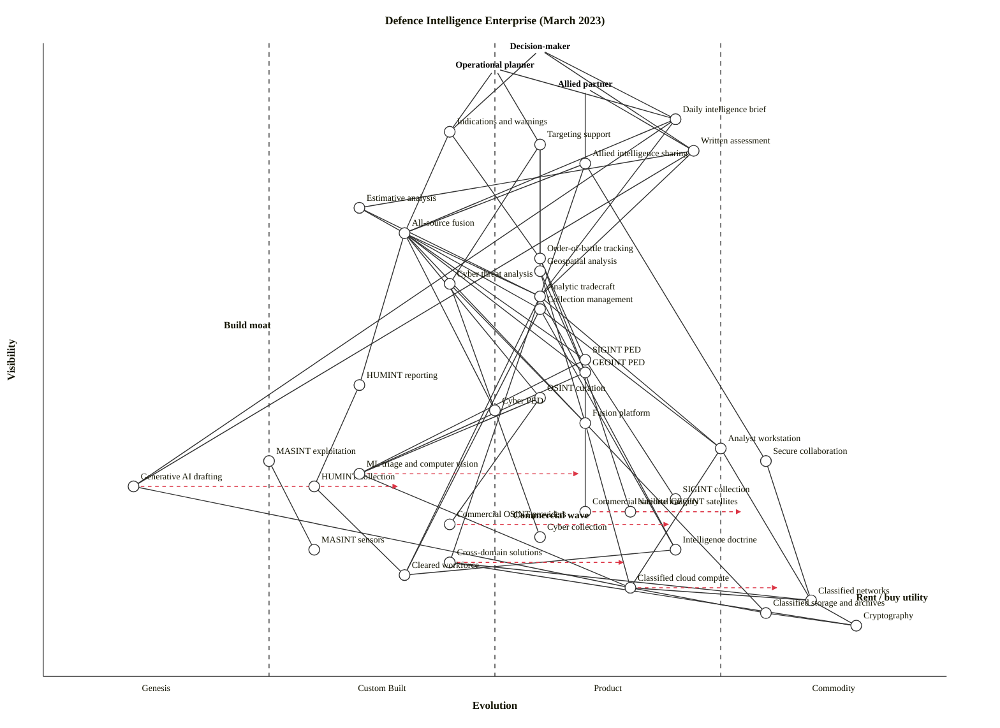

# Defence Intelligence Enterprise (March 2023)

Landscape map of a Five-Eyes-class national defence intelligence enterprise, pinned to **March 2023**: after the invasion of Ukraine has already made commercial-OSINT and commercial-imagery value obvious, but before the post-Ukraine buying wave and the generative-AI wave fully reshape the tradecraft. Both waves are in motion and already visible; neither has yet become the default way of working.

Three anchors are used because the intelligence enterprise is multi-customer by design:

- **Decision-maker** — Minister, Chief of Defence, national-security principal. Consumes assessments and I&W.
- **Operational planner** — J2/J3 staff at a combatant/joint command. Consumes targeting support and current-ops I&W.
- **Allied partner** — a Five-Eyes / NATO intelligence peer. Consumes shared product through releasability channels.

## Map

```owm
title Defence Intelligence Enterprise (March 2023)
style wardley

// Anchors (multi-user)
anchor Decision-maker [0.99, 0.55]
anchor Operational planner [0.96, 0.50]
anchor Allied partner [0.93, 0.60]

// Top-layer products delivered to users
component Daily intelligence brief [0.88, 0.70]
component Indications and warnings [0.86, 0.45]
component Targeting support [0.84, 0.55]
component Written assessment [0.83, 0.72]
component Allied intelligence sharing [0.81, 0.60]

// Analysis and fusion
component All-source fusion [0.70, 0.40]
component Estimative analysis [0.74, 0.35]
component Order-of-battle tracking [0.66, 0.55]
component Geospatial analysis [0.64, 0.55]
component Cyber threat analysis [0.62, 0.45]
component Analytic tradecraft [0.60, 0.55]
component Collection management [0.58, 0.55]

// Processing, exploitation, dissemination
component SIGINT PED [0.50, 0.60]
component GEOINT PED [0.48, 0.60]
component HUMINT reporting [0.46, 0.35]
component OSINT curation [0.44, 0.55]
component Cyber PED [0.42, 0.50]
component MASINT exploitation [0.34, 0.25]

// Collection disciplines
component HUMINT collection [0.30, 0.30]
component SIGINT collection [0.28, 0.70]
component National GEOINT satellites [0.26, 0.65]
component Commercial satellite imagery [0.26, 0.60]
component Commercial OSINT providers [0.24, 0.45]
component Cyber collection [0.22, 0.55]
component MASINT sensors [0.20, 0.30]

// Analyst tooling
component Fusion platform [0.40, 0.60]
component Analyst workstation [0.36, 0.75]
component ML triage and computer vision [0.32, 0.35]
component Generative AI drafting [0.30, 0.10]
component Secure collaboration [0.34, 0.80]

// Infrastructure and knowledge
component Cross-domain solutions [0.18, 0.45]
component Classified networks [0.12, 0.85]
component Classified cloud compute [0.14, 0.65]
component Classified storage and archives [0.10, 0.80]
component Cryptography [0.08, 0.90]
component Cleared workforce [0.16, 0.40]
component Intelligence doctrine [0.20, 0.70]

// Anchor -> user-facing products
Decision-maker->Daily intelligence brief
Decision-maker->Written assessment
Decision-maker->Indications and warnings
Operational planner->Indications and warnings
Operational planner->Targeting support
Operational planner->Daily intelligence brief
Allied partner->Allied intelligence sharing
Allied partner->Written assessment

// Products -> analysis
Daily intelligence brief->All-source fusion
Daily intelligence brief->Analytic tradecraft
Written assessment->Estimative analysis
Written assessment->Analytic tradecraft
Indications and warnings->All-source fusion
Indications and warnings->Order-of-battle tracking
Targeting support->Geospatial analysis
Targeting support->Order-of-battle tracking
Targeting support->Cyber threat analysis
Allied intelligence sharing->All-source fusion
Allied intelligence sharing->Cross-domain solutions

// Analysis -> PED / collection-mgmt / tradecraft
All-source fusion->Collection management
All-source fusion->SIGINT PED
All-source fusion->GEOINT PED
All-source fusion->HUMINT reporting
All-source fusion->OSINT curation
All-source fusion->Cyber PED
All-source fusion->Analytic tradecraft
Estimative analysis->All-source fusion
Estimative analysis->Analytic tradecraft
Order-of-battle tracking->GEOINT PED
Order-of-battle tracking->SIGINT PED
Geospatial analysis->GEOINT PED
Cyber threat analysis->Cyber PED
Collection management->Intelligence doctrine

// PED -> collection
SIGINT PED->SIGINT collection
GEOINT PED->National GEOINT satellites
GEOINT PED->Commercial satellite imagery
HUMINT reporting->HUMINT collection
OSINT curation->Commercial OSINT providers
Cyber PED->Cyber collection
MASINT exploitation->MASINT sensors

// PED / analysis -> tooling
All-source fusion->Fusion platform
Geospatial analysis->Fusion platform
Cyber threat analysis->Fusion platform
SIGINT PED->ML triage and computer vision
GEOINT PED->ML triage and computer vision
OSINT curation->ML triage and computer vision
Written assessment->Generative AI drafting
Daily intelligence brief->Generative AI drafting
Analytic tradecraft->Analyst workstation
Collection management->Analyst workstation
Allied intelligence sharing->Secure collaboration

// Tooling -> infra
Fusion platform->Classified cloud compute
Fusion platform->Classified storage and archives
Analyst workstation->Classified networks
Analyst workstation->Classified cloud compute
ML triage and computer vision->Classified cloud compute
Generative AI drafting->Classified cloud compute
Secure collaboration->Classified networks
Cross-domain solutions->Classified networks
Cross-domain solutions->Cryptography

// Infra cross-links
Classified networks->Cryptography
Classified cloud compute->Classified networks
Classified cloud compute->Classified storage and archives
Classified storage and archives->Cryptography

// Workforce / doctrine dependencies
Analytic tradecraft->Cleared workforce
Analytic tradecraft->Intelligence doctrine
HUMINT collection->Cleared workforce
Collection management->Cleared workforce
Intelligence doctrine->Cleared workforce

// Evolution arrows — scenarios, not forecasts
evolve Commercial OSINT providers 0.70
evolve Commercial satellite imagery 0.78
evolve Generative AI drafting 0.40
evolve ML triage and computer vision 0.60
evolve Classified cloud compute 0.82
evolve Cross-domain solutions 0.65

note Build moat [0.55, 0.20]
note Rent / buy utility [0.12, 0.90]
note Commercial wave [0.25, 0.52]
```



## Strategic analysis

### a. Differentiation opportunities (top 3)

1. **All-source fusion** (Custom Built) — the core craft of the enterprise: turning six collection streams into a coherent picture for a policy-maker or planner. In March 2023 it is still a bespoke human process supported by point tools; the analyst is the integrator. Highest differentiation leverage on the map — visible to all three anchors and still pre-product.
2. **Analytic tradecraft** (Product +rental, but reading earlier for this establishment) — structured analytic techniques, red-teaming, calibrated-language scoring (ICD 203-style). Codified enough to be trainable, not codified enough to be bought. Where a service pulls ahead of peers is tradecraft quality, not sensor count.
3. **ML triage and computer vision** (Custom Built) — by March 2023, allied services have working vehicle-detection / change-detection pipelines on satellite imagery and on full-motion video, but every service has built its own. Still a differentiator; about to productise.

### b. Commodity-leverage candidates (top 3)

1. **Commercial satellite imagery** (Product +rental) — Maxar, Planet, BlackSky, Capella, ICEYE. Rent tasking and archives; do not try to out-build a state-imagery-only posture. The Ukraine conflict has already made this non-negotiable.
2. **Classified cloud compute** (Product +rental, evolving toward Commodity +utility) — IC ITE / JWCC-class offerings exist; hyperscalers at high classifications are now a thing. Stop building bespoke datacentres; migrate workload to the classified utility.
3. **Cryptography** (Commodity +utility) — NSA/CESG-suite primitives, HSMs, key management. Never re-engineer; consume as a utility.

Honourable mention: **Classified networks** and **Classified storage and archives** are also squarely Commodity (+utility) at this establishment's scale — treat as plumbing.

### c. Dependency risks (top 3)

1. **Targeting support → Geospatial analysis → GEOINT PED → Commercial satellite imagery.** A user-visible, time-critical product leans on a commercial supply chain the establishment does not own. Vendor concentration (a handful of SAR and EO providers), export-licence constraints, and conflict-demand surges are all real risks.
2. **Allied intelligence sharing → Cross-domain solutions.** A visible allied-facing product depends on an immature Custom-Built component (CDS / guards / release workflows). Every Five-Eyes-class service feels this; releasability is always the bottleneck.
3. **All-source fusion → HUMINT reporting → HUMINT collection.** The fusion product leans on a deeply Custom-Built, human-capital-bound collection stream. Slow to scale, slow to replace, and hard to surge against a new target set.

Secondary risk: **Written assessment → Generative AI drafting** — the drafting aid sits at Genesis in March 2023; treating its output as finished product would be unsafe. Keep tradecraft in the loop.

### d. Suggested gameplays

- **#36 Directed investment** on All-source fusion and Analytic tradecraft — the two highest-D components; the places where engineering and training money compounds into strategic advantage.
- **#29 Harvesting** on Commercial satellite imagery and Commercial OSINT providers — let the commercial market run, consume the winners under framework contracts; do not try to recreate what industry now does better per dollar.
- **#15 Open approaches** on Cross-domain solutions and fusion-platform data schemas — partner with Five-Eyes peers on open data formats so releasability and interoperability improve together. Classic pattern for shared-infrastructure problems.
- **#41 Alliances** on commercial OSINT and imagery — multi-source framework deals across Five-Eyes reduce vendor-concentration risk (cf. dependency risk #1).
- **#43 Sensing engines (ILC)** on ML triage / computer vision — run an inner-loop that pulls in vendor experimentation, harvests what works, and feeds back into operational tooling.
- **#8 Pioneer–Settler–Town Planner** as the organisational doctrine — Genesis work (Generative AI drafting, advanced MASINT) runs in a small pioneer cell; Settlers productise ML triage and fusion tooling; Town Planners run classified cloud, networks, and the workstation estate.
- **#16 Exploiting network effects** on allied sharing — every additional Five-Eyes contribution to shared fusion makes the shared product better; deliberately design for contribution, not just consumption.

### e. Doctrine notes

- **#1 Focus on user needs** — satisfied. Three distinct anchors are explicit; the enterprise is built for its real customers, not for its own output metrics.
- **#10 Know your users** — satisfied (same reason: multi-anchor).
- **#13 Manage inertia** — at risk. Cleared workforce (inertia form #4 skills inertia, #8 skill-acquisition cost), classified networks (inertia form #9 re-architecture cost) and the analyst-workstation estate (inertia form #2 sunk capital) will all resist the generative-AI / commercial-OSINT transitions. Name the inertia explicitly in the transition plan; do not assume it will dissolve.
- **#2 Use a systematic mechanism of learning** — at risk. The map shows ML triage feeding analysis, but no explicit feedback loop from "analyst accepted/rejected this triage" back into model training. Close that loop.
- **#26 Think small** — flag. The generative-AI bet in March 2023 should be a Pioneer cell with a tight scope (drafting, summarisation, translation), not a ministry-wide programme.
- **#20 Listen to your ecosystem** — the Ukraine-war commercial-OSINT and commercial-imagery ecosystems are sending a loud signal in March 2023. Doctrine is to listen and harvest.

### f. Climatic context

- **#3 Everything evolves** — Commercial OSINT and commercial imagery are visibly moving Custom → Product; generative AI is Genesis and moving; classified cloud is late Product moving to utility. The map should be read as a set of concurrent movements, not a static picture.
- **#15 Past success breeds inertia** — national collection crowns (big SIGINT / national imagery programmes) have strong political and budgetary inertia against being supplemented by commercial equivalents.
- **#16 Co-evolution of practice** — the *practice* of analysis (tradecraft, workflows) will co-evolve with generative-AI drafting and with commercial-OSINT curation. Reorganising sensors without reorganising practice is a common failure mode.
- **#17 Inertia from success of existing practice** — Five-Eyes sharing arrangements are themselves a success-hardened practice. Extending them to commercial-OSINT-derived product and to allied-partner-beyond-FVEY product (NATO tier, bilateral) is precisely the practice-inertia fight.
- **#27 Punctuated equilibrium (war)** — Commercial satellite imagery and commercial OSINT are mid-war (Custom → Product → commoditising fast). Generative-AI drafting is at the leading edge of its own war, starting in March 2023.
- **#18 You cannot measure evolution over time or adoption** — especially relevant here. The generative-AI trajectory in particular should be treated as a scenario, not a date.

### g. Deep-placement notes

Four components that warranted a closer look for March 2023:

1. **Commercial OSINT providers** — cheat-sheet placement is borderline Custom/Product. By March 2023 a distinct cluster of vendors (Janes, Recorded Future, Bellingcat-adjacent open projects, Flashpoint, Babel Street, etc.) are demonstrably productised with recurring-revenue contracts in Five-Eyes services, but the commercial OSINT *for defence* sub-market is still consolidating. Placed at ε ≈ 0.45 (late Custom Built, edging to Product), with an `evolve` to 0.70 because Ukraine has accelerated the transition.
2. **Commercial satellite imagery** — clearly Product (+rental) in March 2023. Ukraine has made Maxar / Planet / Capella / ICEYE service contracts with Western governments visible; vendor catalogues exist; framework contracts exist. Placed at ε ≈ 0.60 with an `evolve` to 0.78 as tasking and archive APIs commoditise.
3. **Generative AI drafting** — cheat sheet flags this as Genesis (Stage I) across all four indicators: rare in production analytic workflow in March 2023, low certainty, no market for cleared-service drafting yet, publication type "describe the wonder". Placed at ε ≈ 0.10 with an `evolve` to 0.40 — by the end of the next year or two it will plausibly reach Custom Built for classified-environment use. The large `evolve` arrow is a scenario.
4. **Classified cloud compute** — in unclassified workloads this would be Commodity (+utility), but at Secret / Top Secret / JWICS-level the vendor landscape is narrower and the delivery model is still productised rather than true utility. Placed at ε ≈ 0.65 with an `evolve` to 0.82 as JWCC-class offerings mature.

The other placements used the 4-row quick cheat sheet with good cross-row agreement and did not need research.

### h. Caveat

Evolution trajectories (`evolve` arrows) and the implied March-2023 placements are scenarios, not forecasts. Wardley's climatic pattern #18: *"you cannot measure evolution over time or adoption."* The map reflects the landscape at a moment; its value is in the relative positions and dependency structure, not in any single ε value.

## Validation

- Counts: **40 components (incl. 3 anchors), 69 dependency edges, 6 evolve arrows, 3 notes.**
- Structural validation: **OK — no violations.** 40 components, 69 edges; every edge endpoint declared; every coordinate in [0, 1]; for every edge `(a, b)`, `ν(a) ≥ ν(b)`.
  - The canonical validator is `node ${CLAUDE_SKILL_DIR}/scripts/validate_owm.mjs`. In this sandbox `node` invocations are disallowed, so an equivalent Python check (identical rules: coordinate range, edge-endpoint declaration, visibility constraint `ν(a) ≥ ν(b)`) was run and reports `OK: 40 components, 69 edges -- no violations`.
  - One violation was caught and fixed during drafting: `Estimative analysis (ν=0.70) -> All-source fusion (ν=0.72)` — resolved by raising Estimative analysis to ν=0.74 and lowering All-source fusion to ν=0.70.
