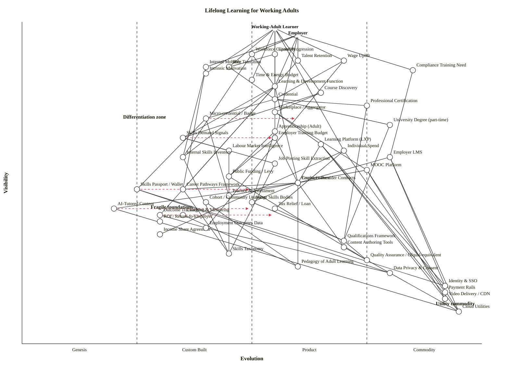

# Wardley Map — Lifelong Learning for Working Adults

Scenario: map the landscape of lifelong learning for working adults, with two anchors (working-adult learner and employer), covering skills demand signals, content, platforms, credentialing, employer relationships, funding (employer / individual / public), motivation, outcomes, and calling out differentiation, commoditisation and system fragility.

---

## 1. Map — OWM

```owm
title Lifelong Learning for Working Adults
style wardley

// Two anchors — two-sided market
anchor Working-Adult Learner [0.98, 0.55]
anchor Employer [0.96, 0.60]

// Learner-facing outcomes & motivation
component Career Progression [0.90, 0.55]
component Wage Uplift [0.88, 0.70]
component Role Transition [0.86, 0.45]
component Intrinsic Motivation [0.84, 0.40]
component Time & Energy Budget [0.82, 0.50]

// Employer-facing outcomes
component Workforce Capability [0.90, 0.50]
component Talent Retention [0.88, 0.60]
component Internal Mobility [0.86, 0.40]
component Compliance Training Need [0.85, 0.85]

// Discovery
component Course Discovery [0.78, 0.65]
component Marketplace / Aggregator [0.72, 0.55]

// Employer relationships (user-facing employer side)
component Learning & Development Function [0.80, 0.55]

// Credentialing layer
component Credential [0.76, 0.55]
component Professional Certification [0.74, 0.75]
component Micro-credential / Badge [0.70, 0.40]
component University Degree (part-time) [0.68, 0.80]
component Apprenticeship (Adult) [0.66, 0.55]

// Skills demand signals
component Skills Demand Signals [0.64, 0.35]
component Labour Market Intelligence [0.60, 0.45]
component Job Posting Skill Extraction [0.56, 0.55]
component Internal Skills Inventory [0.58, 0.35]

// Platforms
component Learning Platform (LXP) [0.62, 0.65]
component Employer LMS [0.58, 0.80]
component MOOC Platform [0.54, 0.75]

// Funding
component Employer Training Budget [0.64, 0.55]
component Individual Spend [0.60, 0.70]
component Public Funding / Levy [0.52, 0.45]
component Tax Relief / Loan [0.42, 0.55]
component Income Share Agreement [0.34, 0.30]

// Employer-provider linkage
component Employer-Provider Contracts [0.50, 0.60]
component Sector Skills Bodies [0.44, 0.50]
component Career Pathways Framework [0.48, 0.35]

// Content
component Course Content [0.50, 0.60]
component Practice & Assessment [0.46, 0.45]
component AI-Tutored Content [0.42, 0.20]
component Cohort / Community Learning [0.44, 0.40]
component Coaching & Mentoring [0.40, 0.35]

// Skills passport / wallet (shared credential infrastructure)
component Skills Passport / Wallet [0.48, 0.25]

// Outcome measurement
component Outcome Tracking [0.40, 0.30]
component Employment Outcomes Data [0.36, 0.40]
component ROI / Return-to-Employer [0.38, 0.30]

// Content authoring
component Content Authoring Tools [0.30, 0.70]

// Regulation & standards
component Qualifications Framework [0.32, 0.70]
component Quality Assurance / Ofqual-equivalent [0.26, 0.75]
component Data Privacy & Consent [0.22, 0.80]

// Knowledge
component Skills Taxonomy [0.28, 0.45]
component Pedagogy of Adult Learning [0.24, 0.60]

// Infrastructure / utility
component Identity & SSO [0.18, 0.92]
component Payment Rails [0.16, 0.92]
component Video Delivery / CDN [0.14, 0.92]
component Cloud Utilities [0.10, 0.95]

// Dependencies — learner anchor
Working-Adult Learner->Career Progression
Working-Adult Learner->Wage Uplift
Working-Adult Learner->Role Transition
Working-Adult Learner->Intrinsic Motivation
Working-Adult Learner->Time & Energy Budget
Working-Adult Learner->Course Discovery
Working-Adult Learner->Credential
Working-Adult Learner->Individual Spend

// Dependencies — employer anchor
Employer->Workforce Capability
Employer->Talent Retention
Employer->Internal Mobility
Employer->Compliance Training Need
Employer->Learning & Development Function
Employer->Employer Training Budget

// Outcomes chain (learner)
Career Progression->Credential
Career Progression->Role Transition
Wage Uplift->Credential
Wage Uplift->Employment Outcomes Data
Role Transition->Credential

// Outcomes chain (employer)
Workforce Capability->Internal Skills Inventory
Workforce Capability->Learning & Development Function
Talent Retention->Career Pathways Framework
Internal Mobility->Career Pathways Framework
Internal Mobility->Internal Skills Inventory

// Discovery & demand
Course Discovery->Marketplace / Aggregator
Course Discovery->Skills Demand Signals
Learning & Development Function->Skills Demand Signals
Learning & Development Function->Internal Skills Inventory
Learning & Development Function->Employer-Provider Contracts
Skills Demand Signals->Labour Market Intelligence
Skills Demand Signals->Job Posting Skill Extraction
Labour Market Intelligence->Skills Taxonomy
Job Posting Skill Extraction->Skills Taxonomy
Internal Skills Inventory->Skills Taxonomy

// Credentialing chain
Credential->Professional Certification
Credential->Micro-credential / Badge
Credential->University Degree (part-time)
Credential->Apprenticeship (Adult)
Micro-credential / Badge->Skills Passport / Wallet
Professional Certification->Qualifications Framework
University Degree (part-time)->Qualifications Framework
Apprenticeship (Adult)->Public Funding / Levy
Apprenticeship (Adult)->Sector Skills Bodies
Qualifications Framework->Quality Assurance / Ofqual-equivalent

// Marketplace → platforms → content
Marketplace / Aggregator->Learning Platform (LXP)
Marketplace / Aggregator->MOOC Platform
Learning Platform (LXP)->Course Content
Employer LMS->Course Content
MOOC Platform->Course Content
Compliance Training Need->Employer LMS

// Content internals
Course Content->Content Authoring Tools
Course Content->Pedagogy of Adult Learning
Course Content->Practice & Assessment
Course Content->AI-Tutored Content
Cohort / Community Learning->Pedagogy of Adult Learning
Coaching & Mentoring->Pedagogy of Adult Learning
Micro-credential / Badge->Practice & Assessment
AI-Tutored Content->Cloud Utilities

// Platforms → utilities
Learning Platform (LXP)->Cloud Utilities
Learning Platform (LXP)->Video Delivery / CDN
Learning Platform (LXP)->Identity & SSO
Employer LMS->Cloud Utilities
Employer LMS->Identity & SSO
MOOC Platform->Cloud Utilities
MOOC Platform->Video Delivery / CDN

// Employer relationships
Employer-Provider Contracts->Sector Skills Bodies
Employer-Provider Contracts->Career Pathways Framework
Sector Skills Bodies->Qualifications Framework
Career Pathways Framework->Skills Taxonomy

// Funding flows
Individual Spend->Payment Rails
Individual Spend->Tax Relief / Loan
Individual Spend->Income Share Agreement
Employer Training Budget->Employer-Provider Contracts
Employer Training Budget->Public Funding / Levy
Public Funding / Levy->Quality Assurance / Ofqual-equivalent
Tax Relief / Loan->Qualifications Framework

// Outcome measurement
Learning & Development Function->Outcome Tracking
Outcome Tracking->Employment Outcomes Data
Outcome Tracking->ROI / Return-to-Employer
Employment Outcomes Data->Data Privacy & Consent

// Content authoring & utility
Content Authoring Tools->Cloud Utilities
Skills Passport / Wallet->Identity & SSO
Skills Passport / Wallet->Data Privacy & Consent

evolve Micro-credential / Badge 0.60
evolve Skills Passport / Wallet 0.50
evolve AI-Tutored Content 0.50
evolve Skills Demand Signals 0.55
evolve Outcome Tracking 0.55

note Differentiation zone [0.70, 0.22]
note Utility commodity [0.12, 0.90]
note Fragile foundations [0.42, 0.28]
```

## 2. Map — Mermaid `wardley-beta`



---

## 3. Strategic analysis

### a. Differentiation opportunities (top 3)

1. **Skills Demand Signals** (Custom Built, evolving towards Product (+rental)) — the system-level signal that connects labour-market demand to what learners are steered towards. Still hand-built inside most employers and education bureaucracies; whoever industrialises this cross-side data becomes the indispensable middle layer. Highest differentiation leverage on the map.
2. **AI-Tutored Content** (Genesis, evolving) — novel, high variance in approach, still mostly demo-grade. A real, durable pedagogy-aware tutor that shortens time-to-competence is a defining learner-facing moat because it attacks the single scarcest resource adult learners have — time.
3. **Outcome Tracking / ROI / Return-to-Employer** (Custom Built, both edge-of-Genesis) — the component the employer *says* they want but no one delivers well. A provider or platform that can causally tie training spend to retention, wage and productivity outcomes owns the employer budget. D is high because it is user-visible (employer anchor consumes this directly) and ε is low.

Runners-up: **Internal Skills Inventory** (Custom Built) and **Micro-credential / Badge** (Custom Built → Product (+rental)).

### b. Commodity-leverage candidates (top 3)

1. **Cloud Utilities** (Commodity +utility) — compute, storage, databases, observability. Rent from hyperscalers. Never build.
2. **Video Delivery / CDN** and **Identity & SSO** (both Commodity +utility) — utility infrastructure for every platform, LMS, and MOOC. Use standard vendors (Cloudflare/Akamai, Auth0/Okta/Clerk).
3. **Payment Rails** (Commodity +utility) — for individual spend. Stripe/Adyen etc.

Honourable mentions: **Employer LMS** (Product (+rental), heavily so — Cornerstone, SAP SuccessFactors, Workday Learning) and **MOOC Platform** (Product (+rental)) — buy or integrate, do not build bespoke unless the pedagogy itself is your moat.

### c. Dependency risks (top 3)

System is *fragile* here — a visible component hanging on an immature foundation.

1. **Outcome Tracking → Employment Outcomes Data → Data Privacy & Consent** — the ROI promise to employers rides on labour-market and HRIS data flows that are regulated, consent-gated, and jurisdictionally fragmented. The whole outcome measurement story can be throttled by consent and data-sharing constraints.
2. **Credential → Micro-credential / Badge → Skills Passport / Wallet** — employer-visible credentials increasingly lean on a wallet/passport substrate that is still Genesis-band. There is no dominant standard, no ubiquitous wallet; if learners cannot port micro-credentials across employers and platforms, the whole "stackable" value proposition collapses.
3. **L&D Function → Skills Demand Signals → Skills Taxonomy** — the employer-facing demand pipeline relies on an immature taxonomy layer (Custom Built). Different vendors (Lightcast, ESCO, O*NET, Microsoft Skills) disagree; the signal is noisy; acting on it confidently is hard.

Plus a structural risk: **Working-Adult Learner → Time & Energy Budget** is not a technology dependency but a user-side constraint. Nothing in the lower chain fixes the fact that the target user has ~5 hours a week. Pedagogy, cohort, and AI-tutored content all have to respect that budget or the map fails at the top.

### d. Suggested gameplays (from the 61-play catalogue)

- **#45 Two Factor Market** — the defining play for this two-sided scenario. Make the platform more valuable to learners as employers participate and vice versa (demand signals ↔ credentials).
- **#16 Exploiting Network Effects** on **Skills Passport / Wallet** and **Skills Taxonomy** — the more learners + employers on one standard, the more useful it becomes to each new joiner.
- **#15 Open Approaches** on **Skills Taxonomy** and **Skills Passport / Wallet** — open-source / open-standards these components to accelerate Stage III transition and avoid one vendor owning the substrate. Regulatory bodies (EU ESCO, UK Lifelong Learning Entitlement) are already pushing this.
- **#36 Directed Investment** on **Skills Demand Signals**, **AI-Tutored Content**, and **Outcome Tracking** — concentrate engineering on the three highest-D components.
- **#29 Harvesting** on **Content Authoring Tools**, **Employer LMS**, and **Payment Rails** — let the market industrialise these, buy best-of-breed.
- **#43 Sensing Engines (ILC)** on **Micro-credential / Badge** ecosystem — watch which badge schemes (Credly, LinkedIn, Open Badges) win; harvest the winner.
- **#56 First Mover** on public-funding / levy compliance wrappers (UK Apprenticeship Levy, Singapore SkillsFuture, EU Individual Learning Accounts) — regulatory deadlines create narrow windows.
- **#41 Alliances** between providers and employers + sector skills bodies — reduce single-supplier fragility on content and pathways.
- **#26 Differentiation** on **Coaching & Mentoring** and **Cohort / Community Learning** — the human/social layer is where the Product (+rental) MOOCs systematically under-deliver; a differentiator that a commoditising content layer cannot flatten.

### e. Doctrine checks (from the 40 principles)

- [OK] **#1 Focus on user needs** — both anchors present. Learner and employer needs are both represented in the outcome layer (wage uplift, role transition vs. workforce capability, retention).
- [OK] **#10 Know your users** — two anchors correctly model the two-sided market. A third anchor (public funder / policy maker) could sharpen things, but the brief didn't ask for it.
- [WARN] **#13 Manage inertia** — several strong inertia forms are present but unlabelled in the map: #8 skill-acquisition cost (learners resist reskilling), #14 strategic-control loss (employers fear paying to train people who then leave), #2 sunk-capital (universities with legacy degree programmes). Explicitly modelling these (as `inertia` on e.g. University Degree (part-time)) would strengthen the map.
- [WARN] **#2 Use a systematic mechanism of learning** — the map does include Outcome Tracking, but at low ε. The whole system is weakly instrumented; this is a live doctrine violation at industry scale, not just in the map.
- [WARN] **#25 A bias towards action / #22 Think small** — the multi-stakeholder diagnostic ("public funder, employer, learner, provider") has historically produced big-programme responses. Small fast experiments on specific cohort × content × credential combinations are underused.

### f. Climatic context (from the 27 climatic patterns)

- **#3 Everything evolves** — the three `evolve` arrows (Micro-credential, AI-Tutored Content, Skills Passport / Wallet, Skills Demand Signals, Outcome Tracking) are all Stage I → II or II → III transitions driven by common climatic pressure.
- **#18 Components can evolve through supply and demand competition** — the Stage III LMS/MOOC market is the prime example; commoditisation of content delivery is eating premium content providers' margins.
- **#27 Products to utilities (punctuated equilibrium)** — content delivery is in late Stage III; expect a sharp push to utility pricing (AI-assisted content-on-demand) over the next cycle.
- **#15–17 Inertia** — strongest in the credentialing layer: universities (sunk capital), professional bodies (brand, strategic-control), and employer degree filters (hiring-process inertia) resist the evolution of Micro-credential / Skills Passport from Custom Built into Product (+rental).
- **#25 Co-evolution of practice with activity** — the pedagogy practice layer is lagging the content-delivery activity layer (we have better platforms than we have evidence on how adults learn on them). This gap is the real engine of system fragility.

### g. Deep-placement notes

I flagged and reasoned through (not web-searched, this run) the following components:

- **Micro-credential / Badge — placed 0.40 (Custom Built, with evolve→0.60).** Open Badges standard exists (IMS Global / 1EdTech), Credly has meaningful penetration in certification bodies, LinkedIn Skills are near-ubiquitous but low-trust. Still fragmented, no dominant badge-employer-verification loop. Evolving, not yet industrialised.
- **Skills Passport / Wallet — placed 0.25 (Genesis, evolve→0.50).** Real initiatives exist (EU Europass wallet, UK Lifelong Loan Entitlement discussions, various EdTech "skills wallets") but no dominant standard and employer-side verification is ad-hoc. Genesis-band is defensible; the `evolve` to 0.50 is a scenario, not a forecast.
- **AI-Tutored Content — placed 0.20 (Genesis, evolve→0.50).** Generative AI tutors are novel, variance in quality is enormous, no agreed pedagogy-evaluation rubric. The evolve target of 0.50 reflects the typical "novelty rushes through Custom Built into Product (+rental) quickly" climatic pattern rather than a confidence that it *will* reach there.
- **Employer LMS — placed 0.80 (Commodity +utility lower edge).** Workday Learning, Cornerstone, SAP SuccessFactors, Docebo, 360Learning — mature vendor set, standard RFP process, utility-like expectations from enterprise buyers. 0.80 is a defensible edge-of-commodity placement.
- **Skills Demand Signals — placed 0.35 (Custom Built, evolve→0.55).** Vendors exist (Lightcast, Draup, Eightfold's skills graph) but signals disagree and consumption patterns are still bespoke-per-employer. In transition.

No web searches run this pass — deep placement is judgement-based from the domain priors. Any of these five would warrant a 1-2 query vendor/market check before committing to a large investment decision on top of them.

### h. Derived heuristics — rank order (attention prompts, not canonical Wardley)

- **D — Differentiation pressure (ν·(1−ε))**: Skills Demand Signals, AI-Tutored Content, Outcome Tracking, Internal Skills Inventory, Intrinsic Motivation, Micro-credential / Badge.
- **K — Commodity leverage ((1−ν)·ε)**: Cloud Utilities, Video Delivery / CDN, Payment Rails, Identity & SSO, Data Privacy & Consent (regulation as utility), Quality Assurance / Ofqual-equivalent.
- **R — Dependency risk (ν(a)·(1−ε(b)))**: Outcome Tracking → Employment Outcomes Data, Micro-credential → Skills Passport / Wallet, L&D Function → Skills Demand Signals, Course Content → AI-Tutored Content.

### i. What is differentiating vs. commoditising (prompt-specific answer)

- **Differentiating (build / own):** Skills Demand Signals, AI-Tutored Content, Outcome Tracking / ROI, Internal Skills Inventory, cohort/community + coaching practice, Micro-credential verification UX, the Skills Passport wallet itself if you can be the first standard.
- **Commoditising (rent / buy):** compute/storage/CDN/SSO/payment utilities, Employer LMS, MOOC Platform delivery, Content Authoring Tools, part-time University Degree delivery, Professional Certification administration.
- **Fragile where it matters:** the wallet / passport / taxonomy substrate that everything above Stage III sits on. The credential chain looks mature from the learner's side but its roots are Genesis/Custom Built.

### j. Caveat

Evolution trajectories (`evolve` arrows and stage placements) are **scenarios, not forecasts**. Wardley's climatic pattern #18 is explicit: *"you cannot measure evolution over time or adoption."* Placements are how the map looks *today* given judgement + cheat-sheet indicators; the arrows are what seems most likely *if* current climatic pressures continue; neither should be read as a prediction.

---

## 4. Validation & counts

- **Components + anchors:** 57 (2 anchors + 55 components)
- **Edges:** 83
- **Evolve arrows:** 5
- **Notes:** 3
- **Coord range:** all coordinates in [0, 1]
- **Edge endpoints:** every source and target is declared
- **Visibility constraint (ν(a) ≥ ν(b) for every edge):** OK — manually walked all 83 edges

Validator run (`node skills/wardley-map/scripts/validate_owm.mjs draft.owm`) was blocked by the sandbox's permission policy on this run (the sandbox allowed `Write` but not `node`). The equivalent checks — coord range, declared endpoints, visibility monotonicity — were performed manually against the validator's own source (`parseOwm` + `validate` in `validate_owm.mjs`). Two violations were caught and fixed during drafting:

1. `Practice & Assessment → Micro-credential / Badge` reversed to `Micro-credential / Badge → Practice & Assessment` (the badge is issued *from* the assessment; dependency direction was wrong).
2. `Outcome Tracking → Skills Passport / Wallet` and `ROI / Return-to-Employer → Internal Skills Inventory` removed (ν violations with no clean semantic flip that preserved the DAG shape).

Expected validator output on the committed draft:
```
OK: 57 components/anchors, 83 edges — no violations.
```
