# Electricity Sector Transition — July 2022

Scenario: the transition of the electricity sector from centralised fossil generation toward distributed renewables plus storage and demand-side flexibility (DSF). Mapped in July 2022, with the post-Ukraine-invasion gas-price shock still fresh, European gas storage only part-filled for winter, IRA not yet enacted, and lithium-ion cell prices at a local peak before the late-2022 softening.

Three user types are anchored: the **Consumer**, the **Grid Operator** (TSO/DSO), and the **Policymaker / Regulator**.

---

## Map (OWM — canonical)

```owm
title Electricity Sector Transition — July 2022
style wardley

// ---- Anchors (three user types) ----
anchor Consumer [0.99, 0.55]
anchor Grid Operator [0.97, 0.45]
anchor Policymaker / Regulator [0.95, 0.35]

// ---- Consumer-facing retail & service layer ----
component Affordable Reliable Electricity [0.90, 0.88]
component Retail Tariff [0.85, 0.80]
component Home Energy App [0.82, 0.45]
component Smart Meter [0.80, 0.72]
component Time-of-Use Pricing [0.72, 0.40]
component EV Charging (home) [0.70, 0.55]
component Rooftop Solar PV [0.68, 0.72]
component Home Battery [0.66, 0.48]
component Heat Pump [0.64, 0.58]
component Smart Thermostat [0.62, 0.70]

// ---- Grid-operator visible layer ----
component System Balancing [0.76, 0.55]
component Market Design Reform [0.74, 0.18]
component Consumer Protection Rules [0.72, 0.78]
component Capacity Market [0.70, 0.62]
component Ancillary Services (frequency / reserve) [0.68, 0.60]
component Demand-Side Flexibility (aggregation) [0.64, 0.28]
component Wholesale Electricity Market [0.60, 0.78]
component Grid Connection Regime [0.60, 0.45]
component Virtual Power Plant [0.58, 0.22]
component Planning & Permitting [0.56, 0.50]
component Grid Forecasting (renewables) [0.54, 0.45]
component Distribution Network (wires) [0.52, 0.82]
component Transmission Network (wires) [0.50, 0.85]
component Emissions Trading (ETS) [0.50, 0.70]
component Interconnectors [0.50, 0.65]

// ---- Generation fleet ----
component Utility-Scale Solar [0.46, 0.75]
component Gas-Fired Generation [0.46, 0.90]
component Onshore Wind [0.44, 0.78]
component Renewables Support Scheme [0.44, 0.72]
component Coal Generation [0.42, 0.92]
component Offshore Wind [0.42, 0.62]
component Contracts for Difference (CfD) [0.42, 0.58]
component Nuclear Baseload [0.40, 0.80]
component Carbon Price Signal [0.40, 0.60]
component Green Hydrogen Generation [0.28, 0.12]
component Long-Duration Storage (non Li-ion) [0.26, 0.15]

// ---- Storage + flexibility ----
component Grid-Scale Battery Storage [0.40, 0.50]
component Pumped Hydro Storage [0.36, 0.88]
component Lithium-ion Cell Supply [0.22, 0.58]
component Critical Minerals (Li / Co / Ni) [0.14, 0.48]

// ---- Fuel & feedstock ----
component Natural Gas Supply [0.34, 0.85]
component LNG Import Terminals [0.30, 0.72]
component Gas Storage (seasonal) [0.28, 0.82]

// ---- Policy layer (upstream of market) ----
component Energy Security Policy [0.82, 0.38]
component Net-Zero Target [0.78, 0.55]

// ---- Deep infrastructure & data/knowledge ----
component Metering Data Platform [0.34, 0.50]
component Grid Control SCADA [0.32, 0.62]
component Cybersecurity (OT) [0.22, 0.55]
component Power Electronics (inverters) [0.20, 0.78]
component Weather Data [0.18, 0.88]
component Semiconductors (power) [0.10, 0.68]
component Copper & Steel [0.08, 0.92]

// ---- Edges: Consumer chain ----
Consumer->Affordable Reliable Electricity
Consumer->Retail Tariff
Consumer->Home Energy App
Consumer->Smart Meter
Consumer->EV Charging (home)
Consumer->Rooftop Solar PV
Consumer->Heat Pump
Consumer->Consumer Protection Rules
Affordable Reliable Electricity->System Balancing
Affordable Reliable Electricity->Distribution Network (wires)
Retail Tariff->Time-of-Use Pricing
Retail Tariff->Wholesale Electricity Market
Retail Tariff->Consumer Protection Rules
Home Energy App->Smart Meter
Home Energy App->Smart Thermostat
Home Energy App->Time-of-Use Pricing
Smart Meter->Metering Data Platform
Smart Meter->Distribution Network (wires)
Time-of-Use Pricing->Metering Data Platform
EV Charging (home)->Distribution Network (wires)
Rooftop Solar PV->Power Electronics (inverters)
Rooftop Solar PV->Distribution Network (wires)
Home Battery->Lithium-ion Cell Supply
Home Battery->Power Electronics (inverters)
Heat Pump->Distribution Network (wires)
Smart Thermostat->Metering Data Platform

// ---- Edges: Grid Operator chain ----
Grid Operator->System Balancing
Grid Operator->Capacity Market
Grid Operator->Ancillary Services (frequency / reserve)
Grid Operator->Demand-Side Flexibility (aggregation)
Grid Operator->Grid Forecasting (renewables)
Grid Operator->Transmission Network (wires)
Grid Operator->Distribution Network (wires)
Grid Operator->Interconnectors
System Balancing->Ancillary Services (frequency / reserve)
System Balancing->Wholesale Electricity Market
System Balancing->Grid Forecasting (renewables)
System Balancing->Transmission Network (wires)
Capacity Market->Gas-Fired Generation
Capacity Market->Nuclear Baseload
Capacity Market->Grid-Scale Battery Storage
Ancillary Services (frequency / reserve)->Grid-Scale Battery Storage
Ancillary Services (frequency / reserve)->Gas-Fired Generation
Demand-Side Flexibility (aggregation)->Virtual Power Plant
Demand-Side Flexibility (aggregation)->Metering Data Platform
Virtual Power Plant->Grid Control SCADA
Grid Forecasting (renewables)->Weather Data
Grid Forecasting (renewables)->Metering Data Platform
Distribution Network (wires)->Transmission Network (wires)
Distribution Network (wires)->Grid Control SCADA
Distribution Network (wires)->Copper & Steel
Transmission Network (wires)->Grid Control SCADA
Transmission Network (wires)->Copper & Steel
Interconnectors->Transmission Network (wires)

// ---- Edges: Wholesale market buys from generators & storage ----
Wholesale Electricity Market->Gas-Fired Generation
Wholesale Electricity Market->Coal Generation
Wholesale Electricity Market->Nuclear Baseload
Wholesale Electricity Market->Onshore Wind
Wholesale Electricity Market->Offshore Wind
Wholesale Electricity Market->Utility-Scale Solar
Wholesale Electricity Market->Grid-Scale Battery Storage
Wholesale Electricity Market->Pumped Hydro Storage
Wholesale Electricity Market->Long-Duration Storage (non Li-ion)
Wholesale Electricity Market->Green Hydrogen Generation

// ---- Edges: Generation technology stack ----
Gas-Fired Generation->Natural Gas Supply
Onshore Wind->Power Electronics (inverters)
Offshore Wind->Power Electronics (inverters)
Offshore Wind->Contracts for Difference (CfD)
Utility-Scale Solar->Power Electronics (inverters)

// ---- Edges: Storage ----
Grid-Scale Battery Storage->Lithium-ion Cell Supply
Grid-Scale Battery Storage->Power Electronics (inverters)
Lithium-ion Cell Supply->Critical Minerals (Li / Co / Ni)

// ---- Edges: Fuel supply ----
Natural Gas Supply->LNG Import Terminals
Natural Gas Supply->Gas Storage (seasonal)

// ---- Edges: Market mechanisms ----
Wholesale Electricity Market->Emissions Trading (ETS)
Emissions Trading (ETS)->Carbon Price Signal
Renewables Support Scheme->Contracts for Difference (CfD)
Renewables Support Scheme->Carbon Price Signal

// ---- Edges: Policymaker chain ----
Policymaker / Regulator->Energy Security Policy
Policymaker / Regulator->Net-Zero Target
Policymaker / Regulator->Market Design Reform
Policymaker / Regulator->Grid Connection Regime
Policymaker / Regulator->Planning & Permitting
Policymaker / Regulator->Consumer Protection Rules
Policymaker / Regulator->Emissions Trading (ETS)
Energy Security Policy->Gas Storage (seasonal)
Energy Security Policy->LNG Import Terminals
Energy Security Policy->Nuclear Baseload
Energy Security Policy->Interconnectors
Net-Zero Target->Renewables Support Scheme
Net-Zero Target->Carbon Price Signal
Market Design Reform->Wholesale Electricity Market
Market Design Reform->Capacity Market
Grid Connection Regime->Distribution Network (wires)
Grid Connection Regime->Transmission Network (wires)
Planning & Permitting->Onshore Wind
Planning & Permitting->Offshore Wind
Planning & Permitting->Utility-Scale Solar
Planning & Permitting->Grid-Scale Battery Storage

// ---- Edges: Deep infra / data ----
Grid Control SCADA->Cybersecurity (OT)
Metering Data Platform->Cybersecurity (OT)
Power Electronics (inverters)->Semiconductors (power)

// ---- Evolution arrows (scenario, not forecast) ----
evolve Demand-Side Flexibility (aggregation) 0.55
evolve Virtual Power Plant 0.50
evolve Grid-Scale Battery Storage 0.75
evolve Offshore Wind 0.82
evolve Heat Pump 0.78
evolve EV Charging (home) 0.80
evolve Market Design Reform 0.45
evolve Green Hydrogen Generation 0.35
evolve Long-Duration Storage (non Li-ion) 0.40

// ---- Notes ----
note Build / differentiate [0.60, 0.22]
note Rent / harvest [0.20, 0.88]
note Policy leverage [0.82, 0.22]
```

## Map (Mermaid wardley-beta — for GitHub rendering)

```mermaid
wardley-beta
title Electricity Sector Transition — July 2022
size [1100, 800]

anchor "Consumer" [0.99, 0.55]
anchor "Grid Operator" [0.97, 0.45]
anchor "Policymaker / Regulator" [0.95, 0.35]

component "Affordable Reliable Electricity" [0.90, 0.88]
component "Retail Tariff" [0.85, 0.80]
component "Home Energy App" [0.82, 0.45]
component "Smart Meter" [0.80, 0.72]
component "Time-of-Use Pricing" [0.72, 0.40]
component "EV Charging (home)" [0.70, 0.55]
component "Rooftop Solar PV" [0.68, 0.72]
component "Home Battery" [0.66, 0.48]
component "Heat Pump" [0.64, 0.58]
component "Smart Thermostat" [0.62, 0.70]

component "System Balancing" [0.76, 0.55]
component "Market Design Reform" [0.74, 0.18]
component "Consumer Protection Rules" [0.72, 0.78]
component "Capacity Market" [0.70, 0.62]
component "Ancillary Services (frequency / reserve)" [0.68, 0.60]
component "Demand-Side Flexibility (aggregation)" [0.64, 0.28]
component "Wholesale Electricity Market" [0.60, 0.78]
component "Grid Connection Regime" [0.60, 0.45]
component "Virtual Power Plant" [0.58, 0.22]
component "Planning & Permitting" [0.56, 0.50]
component "Grid Forecasting (renewables)" [0.54, 0.45]
component "Distribution Network (wires)" [0.52, 0.82]
component "Transmission Network (wires)" [0.50, 0.85]
component "Emissions Trading (ETS)" [0.50, 0.70]
component "Interconnectors" [0.50, 0.65]

component "Utility-Scale Solar" [0.46, 0.75]
component "Gas-Fired Generation" [0.46, 0.90]
component "Onshore Wind" [0.44, 0.78]
component "Renewables Support Scheme" [0.44, 0.72]
component "Coal Generation" [0.42, 0.92]
component "Offshore Wind" [0.42, 0.62]
component "Contracts for Difference (CfD)" [0.42, 0.58]
component "Nuclear Baseload" [0.40, 0.80]
component "Carbon Price Signal" [0.40, 0.60]
component "Green Hydrogen Generation" [0.28, 0.12]
component "Long-Duration Storage (non Li-ion)" [0.26, 0.15]

component "Grid-Scale Battery Storage" [0.40, 0.50]
component "Pumped Hydro Storage" [0.36, 0.88]
component "Lithium-ion Cell Supply" [0.22, 0.58]
component "Critical Minerals (Li / Co / Ni)" [0.14, 0.48]

component "Natural Gas Supply" [0.34, 0.85]
component "LNG Import Terminals" [0.30, 0.72]
component "Gas Storage (seasonal)" [0.28, 0.82]

component "Energy Security Policy" [0.82, 0.38]
component "Net-Zero Target" [0.78, 0.55]

component "Metering Data Platform" [0.34, 0.50]
component "Grid Control SCADA" [0.32, 0.62]
component "Cybersecurity (OT)" [0.22, 0.55]
component "Power Electronics (inverters)" [0.20, 0.78]
component "Weather Data" [0.18, 0.88]
component "Semiconductors (power)" [0.10, 0.68]
component "Copper & Steel" [0.08, 0.92]

"Consumer" -> "Affordable Reliable Electricity"
"Consumer" -> "Retail Tariff"
"Consumer" -> "Home Energy App"
"Consumer" -> "Smart Meter"
"Consumer" -> "EV Charging (home)"
"Consumer" -> "Rooftop Solar PV"
"Consumer" -> "Heat Pump"
"Consumer" -> "Consumer Protection Rules"
"Affordable Reliable Electricity" -> "System Balancing"
"Affordable Reliable Electricity" -> "Distribution Network (wires)"
"Retail Tariff" -> "Time-of-Use Pricing"
"Retail Tariff" -> "Wholesale Electricity Market"
"Retail Tariff" -> "Consumer Protection Rules"
"Home Energy App" -> "Smart Meter"
"Home Energy App" -> "Smart Thermostat"
"Home Energy App" -> "Time-of-Use Pricing"
"Smart Meter" -> "Metering Data Platform"
"Smart Meter" -> "Distribution Network (wires)"
"Time-of-Use Pricing" -> "Metering Data Platform"
"EV Charging (home)" -> "Distribution Network (wires)"
"Rooftop Solar PV" -> "Power Electronics (inverters)"
"Rooftop Solar PV" -> "Distribution Network (wires)"
"Home Battery" -> "Lithium-ion Cell Supply"
"Home Battery" -> "Power Electronics (inverters)"
"Heat Pump" -> "Distribution Network (wires)"
"Smart Thermostat" -> "Metering Data Platform"

"Grid Operator" -> "System Balancing"
"Grid Operator" -> "Capacity Market"
"Grid Operator" -> "Ancillary Services (frequency / reserve)"
"Grid Operator" -> "Demand-Side Flexibility (aggregation)"
"Grid Operator" -> "Grid Forecasting (renewables)"
"Grid Operator" -> "Transmission Network (wires)"
"Grid Operator" -> "Distribution Network (wires)"
"Grid Operator" -> "Interconnectors"
"System Balancing" -> "Ancillary Services (frequency / reserve)"
"System Balancing" -> "Wholesale Electricity Market"
"System Balancing" -> "Grid Forecasting (renewables)"
"System Balancing" -> "Transmission Network (wires)"
"Capacity Market" -> "Gas-Fired Generation"
"Capacity Market" -> "Nuclear Baseload"
"Capacity Market" -> "Grid-Scale Battery Storage"
"Ancillary Services (frequency / reserve)" -> "Grid-Scale Battery Storage"
"Ancillary Services (frequency / reserve)" -> "Gas-Fired Generation"
"Demand-Side Flexibility (aggregation)" -> "Virtual Power Plant"
"Demand-Side Flexibility (aggregation)" -> "Metering Data Platform"
"Virtual Power Plant" -> "Grid Control SCADA"
"Grid Forecasting (renewables)" -> "Weather Data"
"Grid Forecasting (renewables)" -> "Metering Data Platform"
"Distribution Network (wires)" -> "Transmission Network (wires)"
"Distribution Network (wires)" -> "Grid Control SCADA"
"Distribution Network (wires)" -> "Copper & Steel"
"Transmission Network (wires)" -> "Grid Control SCADA"
"Transmission Network (wires)" -> "Copper & Steel"
"Interconnectors" -> "Transmission Network (wires)"

"Wholesale Electricity Market" -> "Gas-Fired Generation"
"Wholesale Electricity Market" -> "Coal Generation"
"Wholesale Electricity Market" -> "Nuclear Baseload"
"Wholesale Electricity Market" -> "Onshore Wind"
"Wholesale Electricity Market" -> "Offshore Wind"
"Wholesale Electricity Market" -> "Utility-Scale Solar"
"Wholesale Electricity Market" -> "Grid-Scale Battery Storage"
"Wholesale Electricity Market" -> "Pumped Hydro Storage"
"Wholesale Electricity Market" -> "Long-Duration Storage (non Li-ion)"
"Wholesale Electricity Market" -> "Green Hydrogen Generation"

"Gas-Fired Generation" -> "Natural Gas Supply"
"Onshore Wind" -> "Power Electronics (inverters)"
"Offshore Wind" -> "Power Electronics (inverters)"
"Offshore Wind" -> "Contracts for Difference (CfD)"
"Utility-Scale Solar" -> "Power Electronics (inverters)"

"Grid-Scale Battery Storage" -> "Lithium-ion Cell Supply"
"Grid-Scale Battery Storage" -> "Power Electronics (inverters)"
"Lithium-ion Cell Supply" -> "Critical Minerals (Li / Co / Ni)"

"Natural Gas Supply" -> "LNG Import Terminals"
"Natural Gas Supply" -> "Gas Storage (seasonal)"

"Wholesale Electricity Market" -> "Emissions Trading (ETS)"
"Emissions Trading (ETS)" -> "Carbon Price Signal"
"Renewables Support Scheme" -> "Contracts for Difference (CfD)"
"Renewables Support Scheme" -> "Carbon Price Signal"

"Policymaker / Regulator" -> "Energy Security Policy"
"Policymaker / Regulator" -> "Net-Zero Target"
"Policymaker / Regulator" -> "Market Design Reform"
"Policymaker / Regulator" -> "Grid Connection Regime"
"Policymaker / Regulator" -> "Planning & Permitting"
"Policymaker / Regulator" -> "Consumer Protection Rules"
"Policymaker / Regulator" -> "Emissions Trading (ETS)"
"Energy Security Policy" -> "Gas Storage (seasonal)"
"Energy Security Policy" -> "LNG Import Terminals"
"Energy Security Policy" -> "Nuclear Baseload"
"Energy Security Policy" -> "Interconnectors"
"Net-Zero Target" -> "Renewables Support Scheme"
"Net-Zero Target" -> "Carbon Price Signal"
"Market Design Reform" -> "Wholesale Electricity Market"
"Market Design Reform" -> "Capacity Market"
"Grid Connection Regime" -> "Distribution Network (wires)"
"Grid Connection Regime" -> "Transmission Network (wires)"
"Planning & Permitting" -> "Onshore Wind"
"Planning & Permitting" -> "Offshore Wind"
"Planning & Permitting" -> "Utility-Scale Solar"
"Planning & Permitting" -> "Grid-Scale Battery Storage"

"Grid Control SCADA" -> "Cybersecurity (OT)"
"Metering Data Platform" -> "Cybersecurity (OT)"
"Power Electronics (inverters)" -> "Semiconductors (power)"

evolve "Demand-Side Flexibility (aggregation)" 0.55
evolve "Virtual Power Plant" 0.50
evolve "Grid-Scale Battery Storage" 0.75
evolve "Offshore Wind" 0.82
evolve "Heat Pump" 0.78
evolve "EV Charging (home)" 0.80
evolve "Market Design Reform" 0.45
evolve "Green Hydrogen Generation" 0.35
evolve "Long-Duration Storage (non Li-ion)" 0.40

note "Build / differentiate" [0.60, 0.22]
note "Rent / harvest" [0.20, 0.88]
note "Policy leverage" [0.82, 0.22]
```



---

## Strategic analysis

### a. Differentiation opportunities (top 3)

Ranked by where the next decade of value sits — visible components that are still uncharted enough to be shaped.

1. **Virtual Power Plant / Demand-Side Flexibility aggregation** (Genesis → Custom Built). A grid-operator-visible capability that orchestrates millions of consumer-side assets (heat pumps, EVs, home batteries, smart thermostats). No single dominant platform in July 2022; vendor landscape is fragmenting across Tibber, Octopus Kraken, AutoGrid, Sunverge, Enel X, OVO Kaluza. Whoever owns the orchestration layer at scale captures the margin between cleared ancillary-service price and aggregated-consumer payment — and captures the data flywheel. This is the single biggest strategic bet in the map.
2. **Market Design Reform** (Genesis). The policymaker-facing reform agenda — locational marginal pricing, capacity-market overhaul, non-wires alternatives, flex-first distribution — is in genuine flux after the 2022 gas-price shock exposed that marginal-cost pricing transfers inframarginal rents to gas. Regulators are drafting new market code in real time. First movers on workable reform designs shape a market worth hundreds of GW of dispatchable demand.
3. **Long-Duration Storage (non-lithium)** (Genesis). Iron-air, flow batteries, compressed air, gravity — all Genesis in July 2022, all racing for the 10-100h duration niche that lithium-ion economics don't serve well. Grid-operator procurement is just starting. A differentiation window opens for the technology that proves bankable first.

### b. Commodity-leverage candidates (top 3)

Rank-ordered by rent-don't-build logic.

1. **Natural Gas / Coal / Nuclear Baseload generation** (Commodity +utility, all ε ≥ 0.80). These are legacy utility outputs; treat as utility you buy from the wholesale market, not capabilities you build. Any new *investment* in these is strategic-inertia territory (see §f climatic patterns).
2. **Transmission & Distribution wires** (Commodity +utility). Network infrastructure at 0.82-0.85 evolution — regulated-asset-base utility. The wires themselves are boring; the interesting strategy lives on the data-and-flexibility layer above them.
3. **Weather Data, Semiconductors, Copper & Steel** (Commodity +utility). Procure from ECMWF/commercial met APIs, from TSMC / Infineon / Wolfspeed, and from global commodity markets respectively. Never build.

Honourable mentions for "rent": Power Electronics (inverters) is deeply technical but Commodity (+utility) adjacent — Huawei / Sungrow / SMA dominate with feature parity; buy, don't design.

### c. Dependency risks (top 3)

Edges where a visible component rides on an immature foundation.

1. **System Balancing → Wholesale Electricity Market → Gas-Fired Generation → Natural Gas Supply**. The chain is long, and as of July 2022 the bottom link is under acute stress (Nord Stream flows cut, European gas storage behind winter targets). A visible user-need (Affordable Reliable Electricity) transitively depends on a fuel chain with compromised security. This is the dependency risk defining the year.
2. **Demand-Side Flexibility (aggregation) → Virtual Power Plant → Grid Control SCADA / Cybersecurity (OT)**. The flexibility story depends on orchestrators talking to a large number of consumer endpoints over OT-adjacent networks. Cybersecurity of the aggregation stack is Custom Built at best (mandatory IEC 62443 conformance is not yet ubiquitous). A single high-profile breach resets the flexibility narrative by a year or two.
3. **Grid-Scale Battery Storage → Lithium-ion Cell Supply → Critical Minerals**. Storage bankability in mid-2022 is pinned to cell prices that are at a local peak (~$151/kWh pack) with lithium carbonate spot prices having 5-7×'d in twelve months. Critical-minerals supply is China-concentrated (refining) and DRC-concentrated (cobalt). Grid-scale battery business cases built on 2020 price curves are under water.

### d. Suggested gameplays

Numbered per the 61-play catalogue in `references/gameplay-patterns.md`.

- **#45 Two-factor / network effects on Demand-Side Flexibility** — consumers enrol flexible assets, aggregator monetises them on ancillary services and wholesale; each side reinforces the other. This is the shape of the DSF/VPP market.
- **#36 Directed investment on Virtual Power Plant orchestration and DSF aggregation** — these are the Genesis components with the highest differentiation leverage. Direct capital and top engineering there, not into building yet another gas peaker.
- **#15 Open Approaches on Metering Data Platform and DSF APIs** — push open standards (SMETS2 equivalents internationally, OpenADR 3.0, IEEE 2030.5) to accelerate the flex market past Genesis. Owning a closed meter-data silo at Stage I delays the very market you want to win in.
- **#29 Harvesting on Power Electronics, Cloud, Weather Data** — let commodity vendors compete; pick winners; don't build.
- **#56 First mover on Market Design Reform** — regulatory windows open narrowly; operators who supply the reform body with workable flexibility-first market designs shape the rules they then operate under.
- **#41 Alliances on Long-Duration Storage** — place small parallel bets across several chemistries with off-take commitments rather than picking one Genesis winner.
- **#26 Differentiation on Heat Pump and EV Charging (home)** — Product (+rental) stage but pushing toward Commodity (+utility). Feature/UX/tariff-bundling is where retailers can still win; the hardware will commoditise.
- **#13 Pig-in-a-poke / fast-follow** — on Green Hydrogen Generation. Genesis technology with unproven unit economics; watch, don't lead, until one of the electrolyser formats breaks out.
- **#3 Co-evolution of practice and component** on Smart Meter + Time-of-Use Pricing — half-hourly settlement and consumer-flexible tariffs only mature together.

### e. Doctrine violations / watch-outs

Per `references/doctrine.md`.

- ✓ **#10 Know your users** — three anchors (Consumer, Grid Operator, Policymaker) correctly represent the three different user types whose needs diverge. Good.
- ⚠ **#13 Manage inertia** — the map has at least five concentrated inertia zones (see §f). A strategic plan that doesn't name them explicitly will be eaten by them.
- ⚠ **#7 Use appropriate methods (pioneers / settlers / town-planners)** — operators applying Stage-IV utility methods (six-sigma, cost-minimisation) to the Stage-I DSF/VPP layer will strangle it. Map components into P/S/T buckets before assigning teams.
- ⚠ **#2 Use a systematic mechanism of learning** — Metering Data Platform should feed back to tariff design, forecasting, and aggregation products; in most utilities in 2022 it is a silo.
- ⚠ **#14 Use standards where appropriate** — the map has Home Energy App, Smart Thermostat, Home Battery, EV Charging all dependent on private clouds with non-interoperable APIs. Open standards at the DSF interface (#15) are the doctrine-consistent path.

### f. Climatic context

Per `references/climatic-patterns.md`.

- **#27 Everything evolves through supply-and-demand competition** and the **product-to-utility punctuated equilibrium**. Generation is living the classic punctuated-equilibrium shift: fossil baseload (Commodity +utility, but on the fossil S-curve) is being cannibalised by renewables + storage + flex (Custom Built → Product +rental). July 2022 is squarely on the punctuation.
- **#15–#17 Inertia forms** — heavy in this map:
  - *#5 Past-success inertia* and *#2 Sunk capital* at incumbent vertically-integrated utilities whose financial models depend on thermal plant.
  - *#4 Skill-acquisition cost* at grid operators: system balancing with 60%+ variable renewables needs skills (probabilistic forecasting, inverter-based resource stability studies, dispatch-optimisation AI) the control-room workforce largely doesn't yet have.
  - *#9 Re-architecture cost* in distribution networks designed for one-way flow.
  - *#3 Regulatory / political inertia* at wholesale-market design level (gas sets the marginal price even when it's 5-10% of MWh delivered — politically toxic but technically embedded).
  - *#15 Industry-supplier inertia* (Big Oil / Big Gas lobbying, IEA & #14 Bundling of capacity-market rules to favour existing thermal).
- **#18 *You cannot measure evolution over time or adoption*** — the `evolve` arrows in this map are scenarios, not forecasts. In particular, Offshore Wind → Commodity (+utility) is plausible by 2030 but depends on CfD design, supply-chain bottlenecks (vessels, turbines, cables), and planning reform.
- **#12 Competitors' actions cause evolution** — the gas-price shock of 2022 accelerates every component to the right of gas (heat pumps, renewables, storage) by pulling forward the payback case.
- **#6 Climate patterns stack** — the war-induced energy-security shock is layering on top of the pre-existing decarbonisation climate; that combination is what makes the 2022 moment distinct.

### g. Deep-placement notes

In this pass I did deep placement on four components that are disproportionately load-bearing for the strategy. The rest were set from the cheat-sheet / indicator checklists directly.

- **Demand-Side Flexibility (aggregation)** — initial indicator-checklist read put this at Custom Built (ε ~ 0.35) because aggregators exist. After reviewing the split market (several dozen aggregators across EU/UK/AU/US, no dominant platform, National Grid's Demand Flexibility Service launched in autumn 2022 was still in trial design at the July 2022 snapshot), moved it to **ε = 0.28** — still Custom Built but firmly on the Genesis side of that band. The regulatory framework to pay DSF equivalently to generation is not yet in place in most markets.
- **Virtual Power Plant** — cheat-sheet would put it at Custom Built; vendor-landscape inspection (dozens of VPP operators, wildly divergent architectures, no accepted reference architecture, limited peer-reviewed evidence on financial performance at scale) pulls it back toward **ε = 0.22**, Genesis-border. VPPs as a category are more Genesis in July 2022 than vendors' marketing suggests.
- **Heat Pump** — positioned at ε = 0.58 (early Product +rental). This is a placement call: the hardware itself (compressor + heat exchanger) is solidly Commodity, but the *installed-and-configured-for-a-specific-UK/EU-home* product stack is Product (+rental), with major stage variance by geography (Nordics ~Commodity +utility, UK/Ireland ~Custom Built, Germany ~Product +rental). I scored at a Western-European average. User-specific maps should adjust.
- **Offshore Wind** — ε = 0.62 (mid Product +rental). Vendor concentration (three Western + two Chinese turbine OEMs), standardised CfD procurement in UK/EU, and bankability across project finance all point to Product (+rental). The `evolve` target to 0.82 (Commodity +utility) is plausible over a decade if supply-chain bottlenecks resolve, but July 2022's vessel and cable shortages had already started to push levelised costs back up for the first time in a decade — worth flagging that the evolution trajectory is under pressure from the supply side as well as being pulled by the demand side.

Other components not deep-placed and left at cheat-sheet pick:
- Green Hydrogen Generation (ε 0.12, Genesis — obvious)
- Long-Duration Storage non Li-ion (ε 0.15, Genesis — obvious)
- Everything in the fossil fuel chain (Commodity +utility — obvious)
- Cloud / wires / inverter commodities — obvious.

### h. Caveat

Evolution placements and trajectories are scenarios, not forecasts. Wardley's climatic pattern #18: *you cannot measure evolution over time or adoption.* The `evolve` arrows in the OWM block are a strategic *intent* for where investment should push these components; they are not a prediction that the market will deliver those positions on a fixed timeline. In particular, offshore-wind-to-utility and DSF-to-product depend on market-design reform that is actively contested in July 2022 — they could stall for several years if the wrong reforms are adopted.

---

## Validator report

Validator path (`node skills/wardley-map/scripts/validate_owm.mjs …`) could not be executed in the sandboxed shell available to this run — the Node process invocation was denied. I performed a manual audit against the three validator rules instead:

1. **All coordinates in [0, 1]** — confirmed by inspection of every `component`/`anchor` line. Minimum ν = 0.08 (Copper & Steel), minimum ε = 0.12 (Green Hydrogen Generation); maximum ν = 0.99 (Consumer anchor), maximum ε = 0.92 (Coal Generation, Copper & Steel). All within range.
2. **All edge endpoints declared** — confirmed by walking every `a->b` line and matching both names against the declared `anchor`/`component` lines. No orphan references.
3. **Visibility constraint ν(src) ≥ ν(tgt) for every edge** — hand-audited all 102 edges against a sorted ν table. The draft had 14 violations on the first pass; all 14 fixed by (a) raising Home Energy App 0.78 → 0.82, (b) raising Interconnectors 0.44 → 0.50, (c) raising Market Design Reform 0.54 → 0.74, (d) lowering Carbon Price Signal 0.46 → 0.40, (e) reversing the 9 Generation→Wholesale-Market edges to Wholesale→Generation (economically correct: the market buys from generators; both a retailer and a generator read off the same market price, so the chain is Retailer → Market → Generator), (f) reversing Contracts-for-Difference ↔ Renewables-Support-Scheme (the scheme contains the instrument, not vice versa), (g) dropping six dependency edges where the relationship was either a reverse duplicate (Consumer Protection Rules → Retail Tariff) or where the back-end component was conceptually depending on user-facing hardware (VPP → Home Battery / EV Charging / Heat Pump, and DSF → Smart Meter, EV Charging → Home Energy App), and (h) adding Wholesale → Green Hydrogen Generation so the H2 node is not orphaned after the other reversals.

If the validator can be re-run from the host, I expect it to print:

    OK: 55 components/anchors, 102 edges — no violations.

## Counts

- **Anchors:** 3 (Consumer, Grid Operator, Policymaker / Regulator).
- **Components:** 52.
- **Total nodes:** 55 — at the top of the "multi-stakeholder system" target band (40-55).
- **Dependency edges:** 102.
- **`evolve` arrows:** 9 (DSF aggregation, VPP, Grid-Scale Battery, Offshore Wind, Heat Pump, EV Charging home, Market Design Reform, Green H2, Long-Duration Storage).
- **Notes:** 3 (strategic zones).
- **Validator status:** manual audit PASSED against all three rules (coordinate range, declared endpoints, visibility constraint). Automated `node validate_owm.mjs` run was blocked by sandbox — see report above.
- **Deep-placement components:** 4 (Demand-Side Flexibility, Virtual Power Plant, Heat Pump, Offshore Wind).
