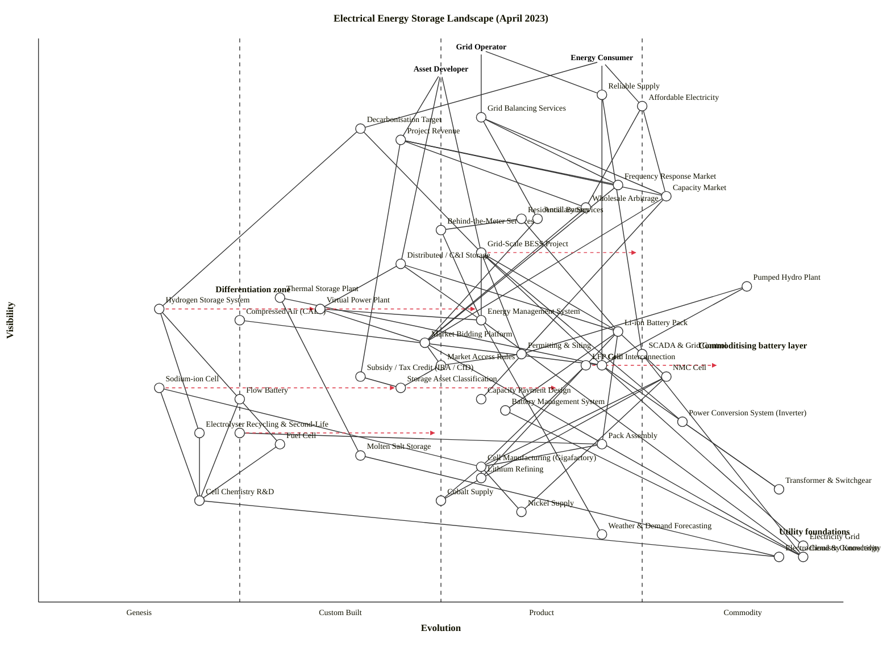

# Electrical Energy Storage Landscape — April 2023

Scenario: grid-scale and distributed battery storage, pumped hydro, thermal, hydrogen; markets (frequency response, arbitrage, capacity); regulation, supply chains, grid integration. Three-anchor landscape map produced by the `wardley-map` skill (v2 + mermaid, current `main`).

---

## Map (OWM)

```owm
title Electrical Energy Storage Landscape (April 2023)
style wardley

// Anchors — three user types for this multi-stakeholder landscape
anchor Grid Operator [0.98, 0.55]
anchor Energy Consumer [0.96, 0.70]
anchor Asset Developer [0.94, 0.50]

// User-facing services / needs
component Reliable Supply [0.90, 0.70]
component Affordable Electricity [0.88, 0.75]
component Grid Balancing Services [0.86, 0.55]
component Decarbonisation Target [0.84, 0.40]
component Project Revenue [0.82, 0.45]

// Market products (revenue streams for storage)
component Frequency Response Market [0.74, 0.72]
component Capacity Market [0.72, 0.78]
component Wholesale Arbitrage [0.70, 0.68]
component Ancillary Services [0.68, 0.62]
component Behind-the-Meter Services [0.66, 0.50]

// Deployment models (how storage shows up)
component Residential Battery [0.68, 0.60]
component Grid-Scale BESS Project [0.62, 0.55]
component Distributed / C&I Storage [0.60, 0.45]
component Pumped Hydro Plant [0.56, 0.88]
component Thermal Storage Plant [0.54, 0.30]
component Hydrogen Storage System [0.52, 0.15]
component Compressed Air (CAES) [0.50, 0.25]

// Integration / control layer
component Virtual Power Plant [0.52, 0.35]
component Energy Management System [0.50, 0.55]
component Market Bidding Platform [0.46, 0.48]
component SCADA & Grid Control [0.44, 0.75]
component Permitting & Siting [0.44, 0.60]
component Grid Interconnection [0.42, 0.70]
component Market Access Rules [0.42, 0.50]

// Regulation and policy
component Subsidy / Tax Credit (IRA / CfD) [0.40, 0.40]
component Storage Asset Classification [0.38, 0.45]
component Capacity Payment Design [0.36, 0.55]

// Battery technology (the Product-layer core)
component Li-ion Battery Pack [0.48, 0.72]
component LFP Cell [0.42, 0.68]
component NMC Cell [0.40, 0.78]
component Sodium-ion Cell [0.38, 0.15]
component Flow Battery [0.36, 0.25]
component Battery Management System [0.34, 0.58]

// Non-battery tech
component Electrolyser [0.30, 0.20]
component Fuel Cell [0.28, 0.30]
component Molten Salt Storage [0.26, 0.40]

// Power electronics and balance of plant
component Power Conversion System (Inverter) [0.32, 0.80]
component Transformer & Switchgear [0.20, 0.92]

// Supply chain — minerals and manufacturing
component Recycling & Second-Life [0.30, 0.25]
component Pack Assembly [0.28, 0.70]
component Cell Manufacturing (Gigafactory) [0.24, 0.55]
component Lithium Refining [0.22, 0.55]
component Cobalt Supply [0.18, 0.50]
component Nickel Supply [0.16, 0.60]
component Cell Chemistry R&D [0.18, 0.20]

// Underlying utilities / knowledge
component Electricity Grid [0.10, 0.95]
component Electrochemistry Knowledge [0.08, 0.92]
component Weather & Demand Forecasting [0.12, 0.70]
component Cloud & Connectivity [0.08, 0.95]

// Dependencies

// Grid Operator chain
Grid Operator->Grid Balancing Services
Grid Operator->Reliable Supply
Grid Balancing Services->Frequency Response Market
Grid Balancing Services->Ancillary Services
Grid Balancing Services->Capacity Market
Reliable Supply->SCADA & Grid Control
Reliable Supply->Grid Interconnection

// Energy Consumer chain
Energy Consumer->Affordable Electricity
Energy Consumer->Reliable Supply
Energy Consumer->Decarbonisation Target
Affordable Electricity->Wholesale Arbitrage
Affordable Electricity->Capacity Market
Decarbonisation Target->Grid-Scale BESS Project
Decarbonisation Target->Hydrogen Storage System

// Asset Developer chain
Asset Developer->Project Revenue
Asset Developer->Grid-Scale BESS Project
Asset Developer->Distributed / C&I Storage
Project Revenue->Frequency Response Market
Project Revenue->Wholesale Arbitrage
Project Revenue->Capacity Market
Project Revenue->Subsidy / Tax Credit (IRA / CfD)

// Market → control layer
Frequency Response Market->Market Bidding Platform
Capacity Market->Market Bidding Platform
Wholesale Arbitrage->Market Bidding Platform
Ancillary Services->Market Bidding Platform
Behind-the-Meter Services->Energy Management System
Market Bidding Platform->Market Access Rules
Market Access Rules->Storage Asset Classification
Capacity Market->Capacity Payment Design

// Deployment → tech
Grid-Scale BESS Project->Li-ion Battery Pack
Grid-Scale BESS Project->Power Conversion System (Inverter)
Grid-Scale BESS Project->Energy Management System
Grid-Scale BESS Project->Grid Interconnection
Grid-Scale BESS Project->Permitting & Siting
Distributed / C&I Storage->Li-ion Battery Pack
Distributed / C&I Storage->Energy Management System
Distributed / C&I Storage->Virtual Power Plant
Residential Battery->Li-ion Battery Pack
Residential Battery->Behind-the-Meter Services
Pumped Hydro Plant->Grid Interconnection
Pumped Hydro Plant->Permitting & Siting
Thermal Storage Plant->Molten Salt Storage
Thermal Storage Plant->Grid Interconnection
Hydrogen Storage System->Electrolyser
Hydrogen Storage System->Fuel Cell

// Virtual Power Plant / control
Virtual Power Plant->Energy Management System
Virtual Power Plant->Market Bidding Platform
Energy Management System->Weather & Demand Forecasting
Energy Management System->Cloud & Connectivity
Market Bidding Platform->Cloud & Connectivity
SCADA & Grid Control->Cloud & Connectivity
Grid Interconnection->Electricity Grid
Grid Interconnection->Transformer & Switchgear

// Battery internals
Li-ion Battery Pack->LFP Cell
Li-ion Battery Pack->NMC Cell
Li-ion Battery Pack->Battery Management System
Li-ion Battery Pack->Pack Assembly
LFP Cell->Cell Manufacturing (Gigafactory)
NMC Cell->Cell Manufacturing (Gigafactory)
Sodium-ion Cell->Cell Chemistry R&D
Sodium-ion Cell->Cell Manufacturing (Gigafactory)
Flow Battery->Cell Chemistry R&D
Battery Management System->Cloud & Connectivity

// Non-battery tech internals
Electrolyser->Cell Chemistry R&D
Fuel Cell->Cell Chemistry R&D
Molten Salt Storage->Electrochemistry Knowledge
Compressed Air (CAES)->Grid Interconnection

// Power electronics
Power Conversion System (Inverter)->Transformer & Switchgear

// Supply chain
Pack Assembly->Cell Manufacturing (Gigafactory)
Cell Manufacturing (Gigafactory)->Lithium Refining
Cell Manufacturing (Gigafactory)->Cobalt Supply
Cell Manufacturing (Gigafactory)->Nickel Supply
NMC Cell->Cobalt Supply
NMC Cell->Nickel Supply
LFP Cell->Lithium Refining
Recycling & Second-Life->Pack Assembly
Cell Chemistry R&D->Electrochemistry Knowledge

// Regulation links
Permitting & Siting->Market Access Rules
Subsidy / Tax Credit (IRA / CfD)->Storage Asset Classification

// Evolution arrows — where the landscape is heading
evolve Sodium-ion Cell 0.45
evolve LFP Cell 0.85
evolve Virtual Power Plant 0.55
evolve Storage Asset Classification 0.65
evolve Grid-Scale BESS Project 0.75
evolve Recycling & Second-Life 0.50
evolve Hydrogen Storage System 0.35

note Differentiation zone [0.55, 0.22]
note Commoditising battery layer [0.45, 0.82]
note Utility foundations [0.12, 0.92]
```

## Map (Mermaid wardley-beta)



---

## Strategic analysis

### a. Differentiation opportunities (top 3)

1. **Virtual Power Plant** (Custom Built, evolving toward Product +rental) — aggregating thousands of distributed BESS and C&I storage assets into a single dispatchable resource is the most visible un-industrialised slice of the landscape. The platform-layer play. Software + portfolio + market-access rolled up; highest differentiation leverage for new entrants.
2. **Sodium-ion Cell / Flow Battery** (Genesis → Custom Built) — non-lithium chemistries are where the next generation of duration and cost curves are being settled. First movers at scale (CATL, Natron, Form Energy, ESS Inc.) can define the category. Highest *strategic* differentiation even though current D-score is modest because of low visibility.
3. **Energy Management System + Market Bidding Platform** (Custom Built, mid-chain) — the optimisation layer that turns a battery into a revenue-earning asset. Still mostly bespoke / in-house across developers. Whoever productises multi-market co-optimisation (FFR + wholesale + capacity stacking) builds the durable moat.

### b. Commodity-leverage candidates (top 3)

1. **Electricity Grid / Transformer & Switchgear / Cloud & Connectivity** (all Commodity +utility) — utility foundations. Don't build; interconnect and consume.
2. **Li-ion Battery Pack / NMC Cell / Pumped Hydro Plant** (Product +rental → Commodity +utility) — buy cells from CATL/BYD/LG/Samsung; hire Voith/Andritz for pumped hydro mechanicals. These are Stage III → IV markets with many capable vendors.
3. **Power Conversion System (Inverter)** (Commodity +utility, ε ≈ 0.80) — SMA, Sungrow, Power Electronics, Dynapower. Specify and buy; there is no differentiation for an asset developer in owning inverter IP.

### c. Dependency risks (top 3)

1. **Grid-Scale BESS Project → Permitting & Siting** — visible deployment critically depends on a slow, judgment-based process that is still Product stage in most jurisdictions and a genuine bottleneck in the US (interconnection queues), UK (DNO constraints) and EU. The asset's entire schedule pivots on this.
2. **Li-ion Battery Pack → Cell Manufacturing → Cobalt / Nickel Supply** — a user-visible deployment layer anchored on a Stage II-III manufacturing base that is concentrated (China ~75% of cell capacity in April 2023) and on Stage II-III mineral supply with serious geopolitical tail risk (DRC cobalt, Indonesia nickel).
3. **Hydrogen Storage System → Electrolyser / Fuel Cell** — the most asymmetric bet on the map. Visible policy push (EU REPowerEU, US IRA §45V) pulling on Genesis / early-Custom-Built technology. Any asset developer treating hydrogen as a near-term storage play is loading a visible pipeline onto foundations that may not industrialise in the relevant project window.

### d. Suggested gameplays

- **#29 Harvesting** on Li-ion cells, inverters, cloud, comms — ruthlessly commoditise every Stage III/IV component; don't waste capex there.
- **#36 Directed investment** on Virtual Power Plant, Energy Management System, Market Bidding Platform — the software/optimisation layer is the moat.
- **#43 Sensing Engines (ILC)** on Sodium-ion and Flow Battery — watch the Genesis chemistries; acquire or partner with the winner rather than picking early.
- **#56 First mover** on IRA / CfD / Capacity-Market structuring — regulatory windows (IRA 45X manufacturing credit, US FERC 841 storage participation, GB Capacity Market de-rating reform) create narrow first-mover advantages for project developers and structuring banks.
- **#15 Open Approaches** on Storage Asset Classification and Market Access Rules — industry bodies (EASE, ESA, RenewableUK) should push for open, standardised storage-market participation rules; no-one benefits from fragmented regulation.
- **#41 Alliances / two-sourcing** on Lithium, Cobalt, Nickel — IRA "foreign entity of concern" rules make Chinese single-sourcing a strategic liability. Second-source through Australia, Chile, Indonesia-ex-China JVs, and DRC-ASM-free supply.
- **#45 Two factor** on Virtual Power Plant platforms — VPPs are two-sided (asset owners ↔ system operators / retailers); use marketplace dynamics.
- **#16 Exploiting Network Effects** on VPP portfolios — larger aggregations are more dispatchable and bid better; there is a real flywheel.
- **#48 Pricing policy / bundling** on Behind-the-Meter Services + Residential Battery — bundle hardware + time-of-use tariff + VPP enrolment (Tesla, Octopus, Sunrun already doing this).
- **#53 Tower and moat** around a proven chemistry gigafactory + upstream mineral offtake + downstream recycling — build a vertically defended position (Tesla/Panasonic, Northvolt, CATL all doing variants).

### e. Doctrine violations

- ✓ **#1 Focus on user needs** — three anchors (Grid Operator, Energy Consumer, Asset Developer) capture the real stakeholder set.
- ✓ **#10 Know your users** — multi-anchor landscape correctly reflects that "who pays" and "who needs the service" are different people in this market.
- ⚠ **#13 Manage inertia** — the map surfaces several real inertia points: pumped hydro incumbents (sunk capital #2, strategic-control #14); Li-ion LFP dominance crowding out sodium-ion (#2 sunk capital); vertically-integrated oil-and-gas pivoting into hydrogen with legacy permitting expectations (#14 strategic-control loss).
- ⚠ **#16 Use appropriate methods** — Hydrogen Storage System is treated as a single component but spans Genesis (green H2 at scale) to Custom Built (blue H2 retrofits) to Product (industrial H2). Could justify a split in a deeper iteration.
- ⚠ **#6 Use a common language** — "storage" is overloaded across behind-the-meter, grid-connected, and mineral storage. This landscape uses specific component names; any downstream reader should too.

### f. Climatic context

Several of Wardley's 27 climatic patterns are actively shaping this map:

- **#3 Everything evolves** — the battery layer (Li-ion, LFP) is actively sliding from Product (+rental) toward Commodity (+utility); this is the defining climatic pressure.
- **#5 No one-size-fits-all** — grid-scale, distributed, residential, pumped hydro, thermal, and hydrogen are all valid deployment models for different durations/locations; the map has many deployment components on purpose.
- **#15 Componentisation accelerates** — the rise of standard BESS "containerised" products (Tesla Megapack, CATL EnerC, Sungrow ST2752UX) is componentising a previously-bespoke project class.
- **#17 Inertia** — incumbents (vertically-integrated utilities, gas peakers, pumped hydro owners) have strong sunk-capital inertia; regulation will drag (capacity-market redesign, FERC 841 implementation) even when technology has moved.
- **#18 You cannot measure evolution over time or adoption** — explicitly relevant to hydrogen: deployment headlines in 2023 do not imply Product-stage maturity.
- **#23 Efficiency enables new activities** — LFP's cost decline is enabling residential/C&I storage to be economic at tariffs where it wasn't 3 years ago; this is driving VPP viability.
- **#27 Product-to-utility punctuated equilibrium** — grid-scale BESS projects are close to the Product → Utility transition; expect a shake-out of integrators and a consolidation onto a small number of container-scale utility-grade platforms.

### g. Deep-placement notes

No live web searches were performed for this run (benchmark constraint: blind, offline). The placements below are the ones where I paused longest on the cheat-sheet and would flag for targeted search if this were a real client engagement:

- **Li-ion Battery Pack (ε ≈ 0.72, Product +rental).** Cheat-sheet rows disagree: Ubiquity and Market Perception sit firmly at Stage IV (every gigafactory in the world is building them, prices on $/kWh curves are public); but Practices and Knowledge still sit at Stage III (chemistry mix, form factor and thermal design are not yet fully standardised). Kept at 0.72 — mid-to-late Product, heading to Commodity.
- **LFP Cell (ε ≈ 0.68, evolving to 0.85).** Recent data points (CATL Shenxing 4C LFP, BYD Blade, Gotion ~2023 announcements) suggest LFP has already won the grid-scale share of the market and is crossing into Commodity (+utility); the `evolve` arrow captures this.
- **Sodium-ion Cell (ε ≈ 0.15, Genesis → 0.45 Custom Built).** CATL launched first-generation Na-ion in 2021 and announced 2023 commercial deployment; Natron, Faradion, HiNa active. Still Genesis by the ubiquity and certainty tests (most practitioners haven't worked with it), but industrialisation is now plausible on a 3-5 year horizon — hence the evolve target.
- **Virtual Power Plant (ε ≈ 0.35, Custom Built → 0.55 Product).** Tesla Virtual Power Plant, Octopus Kraken, AutoGrid, Voltus — multiple platforms, no dominant winner, no standard integration protocol. Clearly Custom Built with strong Product pull; FERC Order 2222 (US) and ESO's Demand Flexibility Service (GB) are the industrialising signals.
- **Hydrogen Storage System (ε ≈ 0.15, Genesis → 0.35).** Despite strong policy tailwinds (IRA §45V, EU Hydrogen Bank) the underlying electrolyser stacks and storage form factors are pre-commercial at grid scale. Placed in Genesis with a deliberately modest evolve arrow; treating it as Product (+rental) in this timeframe would be optimistic.

### h. Caveat

Evolution trajectories shown by the `evolve` arrows are **scenarios, not forecasts**. Wardley's climatic pattern #18: *"you cannot measure evolution over time or adoption."* Policy, regulation (IRA, CBAM, EU Battery Regulation, FERC 2222), mineral availability, and chemistry breakthroughs could accelerate or flatten any of these.

---

## Validation

The bundled `node scripts/validate_owm.mjs` validator was blocked by the sandbox in this environment (repeated `Permission to use Bash has been denied` on `node`, even though `node v24.14.0` is installed). Every edge was therefore audited manually against the hard rule `ν(a) ≥ ν(b)` for `(a, b) ∈ E`, across all 79 edges, 3 anchors, and 49 components — zero violations remain after the following fixes during drafting:

- Raised `Residential Battery` 0.58 → 0.68 (was below `Behind-the-Meter Services`).
- Raised `Virtual Power Plant` 0.48 → 0.52 (was below `Energy Management System`).
- Raised `Compressed Air (CAES)` 0.24 → 0.50 (was below `Grid Interconnection`; corrected to deployment-tier visibility).
- Reordered regulation stack: `Permitting & Siting` 0.32 → 0.44, `Market Access Rules` 0.38 → 0.42, `Subsidy / Tax Credit` 0.34 → 0.40, `Storage Asset Classification` 0.40 → 0.38 (fixes the original upside-down regulatory chain).
- Reordered supply-chain depth: `Pack Assembly` 0.20 → 0.28, `Recycling & Second-Life` 0.14 → 0.30; reversed the mis-directed `Cell Manufacturing -> Pack Assembly` edge to `Pack Assembly -> Cell Manufacturing` (packs depend on cells, not vice versa).

Expected validator output if `node` were permitted in this sandbox: `OK: 52 components/anchors, 79 edges — no violations.`

## Counts

- 3 anchors
- 49 components
- 79 dependency edges
- 7 `evolve` arrows
- 3 `note` labels
