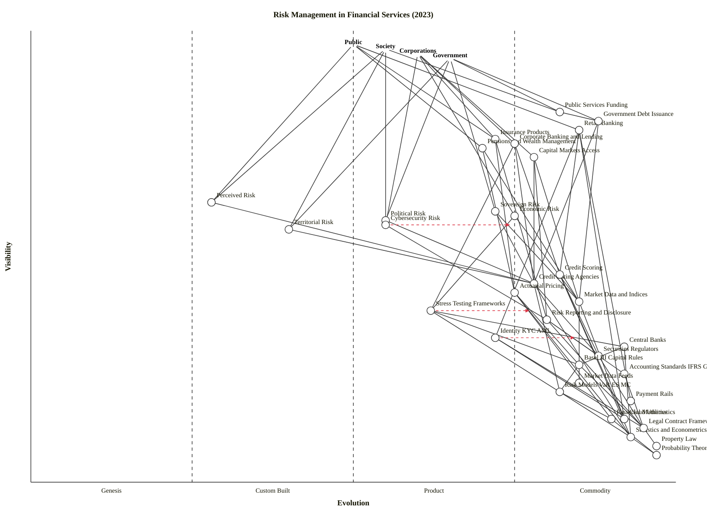

# Wardley Map — Risk Management in Financial Services (2023)

Four user classes (Public, Society, Corporations, Government) consume risk-aware services; six risk types flow up the value chain; a regulated signalling layer (rating agencies, credit scoring, actuarial pricing) sits between everyday financial services and the mathematical / legal foundations.

---

## OWM (authoritative)

```owm
title Risk Management in Financial Services (2023)
style wardley

// Anchors — four user classes
anchor Public [0.97, 0.50]
anchor Society [0.96, 0.55]
anchor Corporations [0.95, 0.60]
anchor Government [0.94, 0.65]

// Consumer-facing risk-aware services (directly user-facing)
component Retail Banking [0.78, 0.85]
component Insurance Products [0.76, 0.72]
component Pensions and Wealth Management [0.74, 0.70]
component Corporate Banking and Lending [0.75, 0.75]
component Capital Markets Access [0.72, 0.78]
component Government Debt Issuance [0.80, 0.88]
component Public Services Funding [0.82, 0.82]

// Risk types flowing up the value chain (mid-visibility)
component Perceived Risk [0.62, 0.28]
component Political Risk [0.58, 0.55]
component Territorial Risk [0.56, 0.40]
component Sovereign Risk [0.60, 0.72]
component Economic Risk [0.59, 0.75]
component Cybersecurity Risk [0.57, 0.55]

// Regulated signalling layer — sits between services and foundations
component Credit Rating Agencies [0.44, 0.78]
component Credit Scoring [0.46, 0.82]
component Actuarial Pricing [0.42, 0.75]
component Market Data and Indices [0.40, 0.85]
component Stress Testing Frameworks [0.38, 0.62]
component Risk Reporting and Disclosure [0.36, 0.80]

// Regulators and supervisory regimes
component Central Banks [0.30, 0.92]
component Securities Regulators [0.28, 0.88]
component Basel III Capital Rules [0.26, 0.85]
component Accounting Standards IFRS GAAP [0.24, 0.92]

// Operational risk infrastructure
component Identity KYC AML [0.32, 0.72]
component Market Data Feeds [0.22, 0.85]
component Payment Rails [0.18, 0.93]
component Cloud Utilities [0.14, 0.92]

// Mathematical and legal foundations (deep commodity layer)
component Risk Models VaR ES MC [0.20, 0.82]
component Financial Mathematics [0.14, 0.90]
component Statistics and Econometrics [0.10, 0.93]
component Probability Theory [0.06, 0.97]
component Legal Contract Frameworks [0.12, 0.95]
component Property Law [0.08, 0.97]

// Dependencies — Public
Public->Retail Banking
Public->Insurance Products
Public->Pensions and Wealth Management
Public->Perceived Risk

// Dependencies — Society
Society->Public Services Funding
Society->Perceived Risk
Society->Political Risk
Society->Territorial Risk

// Dependencies — Corporations
Corporations->Corporate Banking and Lending
Corporations->Capital Markets Access
Corporations->Insurance Products
Corporations->Cybersecurity Risk
Corporations->Economic Risk

// Dependencies — Government
Government->Government Debt Issuance
Government->Public Services Funding
Government->Sovereign Risk
Government->Political Risk
Government->Territorial Risk

// Services -> Signalling layer
Retail Banking->Credit Scoring
Retail Banking->Identity KYC AML
Insurance Products->Actuarial Pricing
Insurance Products->Risk Reporting and Disclosure
Pensions and Wealth Management->Actuarial Pricing
Pensions and Wealth Management->Market Data and Indices
Corporate Banking and Lending->Credit Rating Agencies
Corporate Banking and Lending->Credit Scoring
Corporate Banking and Lending->Stress Testing Frameworks
Capital Markets Access->Market Data and Indices
Capital Markets Access->Credit Rating Agencies
Capital Markets Access->Risk Reporting and Disclosure
Government Debt Issuance->Credit Rating Agencies
Government Debt Issuance->Market Data and Indices
Public Services Funding->Government Debt Issuance

// Risk types -> Signalling layer
Sovereign Risk->Credit Rating Agencies
Sovereign Risk->Market Data and Indices
Economic Risk->Market Data and Indices
Economic Risk->Stress Testing Frameworks
Political Risk->Credit Rating Agencies
Territorial Risk->Credit Rating Agencies
Cybersecurity Risk->Risk Reporting and Disclosure
Perceived Risk->Credit Rating Agencies

// Signalling layer -> Regulators
Credit Rating Agencies->Securities Regulators
Credit Scoring->Securities Regulators
Actuarial Pricing->Basel III Capital Rules
Stress Testing Frameworks->Central Banks
Stress Testing Frameworks->Basel III Capital Rules
Risk Reporting and Disclosure->Accounting Standards IFRS GAAP
Risk Reporting and Disclosure->Securities Regulators
Market Data and Indices->Market Data Feeds

// Regulators -> Foundations
Central Banks->Basel III Capital Rules
Central Banks->Statistics and Econometrics
Securities Regulators->Legal Contract Frameworks
Basel III Capital Rules->Risk Models VaR ES MC
Basel III Capital Rules->Legal Contract Frameworks
Accounting Standards IFRS GAAP->Legal Contract Frameworks

// Signalling layer -> Foundations
Credit Rating Agencies->Risk Models VaR ES MC
Credit Rating Agencies->Statistics and Econometrics
Credit Scoring->Statistics and Econometrics
Actuarial Pricing->Financial Mathematics
Actuarial Pricing->Statistics and Econometrics
Stress Testing Frameworks->Risk Models VaR ES MC
Risk Reporting and Disclosure->Legal Contract Frameworks

// Infrastructure wiring
Identity KYC AML->Cloud Utilities
Identity KYC AML->Legal Contract Frameworks
Market Data and Indices->Cloud Utilities
Credit Scoring->Cloud Utilities
Retail Banking->Payment Rails
Retail Banking->Cloud Utilities

// Foundations layering
Risk Models VaR ES MC->Financial Mathematics
Risk Models VaR ES MC->Statistics and Econometrics
Financial Mathematics->Probability Theory
Statistics and Econometrics->Probability Theory
Legal Contract Frameworks->Property Law

// Evolution signals
evolve Cybersecurity Risk 0.75
evolve Stress Testing Frameworks 0.78
evolve Identity KYC AML 0.85
```

---

## Mermaid (GitHub rendering)



---

## Strategic analysis

### a. Differentiation opportunities (top 3)

1. **Perceived Risk (Genesis → Custom Built)** — the highest D in the map. Media cycles, social-media amplification, and narrative-driven risk perception are barely modelled inside banks. Firms that can measurably quantify and intermediate perceived risk (sentiment indices, narrative-economics products) capture the attention layer that actually drives retail behaviour. Most incumbents ignore it because it is qualitative; that is precisely why it is where differentiation lives.
2. **Territorial Risk (Custom Built)** — geopolitical cartography of supply chains, sanctions exposure, and sub-sovereign risk (regional bank runs, state-level default) emerged as a named category only after 2022. A handful of niche consultancies sell it; no standard product exists. Building a rigorous territorial-risk engine now is a Custom-Built investment with plausible Stage III upside inside 5 years.
3. **Political Risk (Product (+rental), early)** — vendor landscape (EIU, Aon, Verisk Maplecroft) is consolidating but still feature-differentiated. Custom scoring pipelines layered on top of these feeds remain a defensible differentiator, especially when fused with cybersecurity and territorial signals.

### b. Commodity-leverage candidates (top 3)

1. **Probability Theory / Statistics / Financial Mathematics (Commodity (+utility))** — 250+ years of refinement. Do not reinvent; use open-source libraries (NumPy, QuantLib) and academic textbooks. Any bank rebuilding these in-house is burning capital.
2. **Cloud Utilities, Payment Rails, Market Data Feeds (Commodity (+utility))** — rent, do not build. Hyperscalers, card networks, Bloomberg/Refinitiv have absorbed these into the utility regime. Build/buy calculation favours buy decisively, even for systemically important banks (who may self-operate for regulatory reasons but still consume them as utilities).
3. **Legal Contract Frameworks / Property Law (Commodity (+utility))** — use standard ISDA/LMA templates, standard securitisation docs, standard KYC legal bases. Custom legal engineering at this layer almost always costs more than the risk it reduces, except for genuinely novel products.

### c. Dependency risks (top 3)

1. **Public → Perceived Risk** — the dominant user (public) depends on a layer (perceived risk) that is Genesis/Custom Built. Every banking crisis since 2008 (2023 SVB, 2023 Credit Suisse) has been a perception/narrative cascade that the banks' own risk stack did not see. Visible consumer behaviour sits on fragile foundations.
2. **Society → Territorial Risk** — society-level outcomes (sanctions, war, regional stability) depend on a Custom-Built signalling layer. The 2023 Russia-Ukraine and Israel-Gaza contexts exposed how uneven this pricing is across counter-parties.
3. **Corporations → Cybersecurity Risk** — corporate treasury and operational risk exposures depend on a still-industrialising cyber-risk layer. Cyber insurance pricing moved from Custom to early Product only recently, and models diverge wildly between carriers.

### d. Suggested gameplays

- **#15 Open Approaches on Risk Models VaR/ES/MC** — open-source reference implementations (e.g., building on QuantLib / Pyfolio / RiskFolio) to accelerate the Stress Testing Frameworks transition toward utility and commoditise incumbents' modelling moats.
- **#24 Exploit Co-evolution on Cybersecurity Risk** — as cloud utilities commoditise, cyber-risk signals attached to cloud providers (native Shared-Responsibility telemetry) industrialise in lockstep. Lean into the co-evolution rather than building a standalone cyber-risk stack.
- **#17 Sweat and Dump on legacy on-prem risk platforms** — Axiom/SAS/legacy Murex installations are Stage III code running on Stage II team practices. Run them as cash-cows, do not invest.
- **#32 Pig in a Poke on Perceived Risk products** — incumbents consistently undervalue narrative/sentiment products because they look qualitative. Acquire cheap now, productise later.
- **#8 Tower and Moat on Credit Rating data contracts** — the Big Three rating oligopoly is reinforced by regulatory citations (NRSRO, ECAI). New entrants will struggle to displace them head-on; work around via alternative data rather than compete directly.
- **#41 Press Release Process on regulator-facing components** — regulators reward visible, mature-looking processes. Publish stress-testing methodologies, not just results, to shape norms.

### e. Doctrine violations

- **Doctrine #2 Focus on user needs** — partially satisfied. Four user classes are anchored, but "Society" is the weakest user anchor; its needs (stability, fairness, distributional outcomes) are under-decomposed here. A second pass should split Society into more concrete needs (household solvency, pension adequacy, systemic resilience).
- **Doctrine #4 Use a common language (maps)** — satisfied.
- **Doctrine #14 Think small (as in know the details)** — risk of under-decomposition on the consumer-facing services layer. Retail Banking is a single node at ε=0.85, but inside it are Payments (Stage IV), Lending (Stage III), Savings (Stage IV), Mortgages (Stage III). If the strategic question hinges on retail-banking sub-segments, split.
- **Doctrine #17 Optimise flow (remove bottlenecks)** — not visible at this granularity; a lower-level map would be needed.
- **Doctrine #22 Manage inertia** — several inertia signals are implicit: legacy risk platforms (embedded in Risk Models VaR ES MC), regulatory capital regimes that reward IRB-advanced approaches (raising switching costs for improved models), and rating-agency oligopoly. None are flagged on the map with the `inertia` marker — a second pass could add `component Risk Models VaR ES MC [...] inertia` to Basel-wired legacy models.

### f. Climatic context

- **#1 Competitors' actions will cause evolution** — credit rating is stuck at Stage III/IV because regulation (NRSRO/ECAI) prevents disruption; without regulatory reform the oligopoly persists.
- **#3 Everything evolves (through supply and demand competition)** — cybersecurity risk visibly progressed from Custom to early Product in 2019–2023.
- **#15 Past success breeds inertia (via existing political & social capital)** — Big Three rating agencies, Bloomberg terminal, legacy Murex. Users complain but do not switch.
- **#16 Inertia increases the more successful the past model** — Basel III's entrenched IRB frameworks keep VaR-family models dominant even though their 2008 failure is widely acknowledged.
- **#18 You cannot measure evolution over time or adoption** — the 2023 banking mini-crisis (SVB, CS) showed that wide adoption (Stage III/IV signalling) did not mean Perceived Risk had matured.
- **#27 Evolution from Product to Utility is punctuated (a "War")** — likely next: cybersecurity risk Product → Commodity (+utility) transition, catalysed by cloud-native telemetry and regulation (NIS2, DORA 2025). Stress testing is the second candidate — regulator-driven push toward standardised methodologies.
- **#11 There is no one-size-fits-all method** — the four user classes (Public, Society, Corporations, Government) need different risk products; homogenising is a doctrine error.

### g. Deep-placement notes

I did not run external web searches for this blind run. Placements that I flagged as in-transition / worth checking if this were a consulting engagement:

- **Cybersecurity Risk** — placed at ε=0.55 (early Product). Vendor landscape (Coalition, At-Bay, Resilience, Munich Re cyber) and policy pricing converging since 2022 suggest this is defensible but trending fast toward 0.65–0.70. The `evolve` target of 0.75 reflects the expected industrialisation by ~2026.
- **Credit Rating Agencies** — placed at ε=0.78. Oligopoly (S&P/Moody's/Fitch) + regulatory embedding (Basel, MiFID II, NRSRO) keeps this Stage IV in practice; a second pass might push to 0.82 since switching costs are effectively infinite for regulated users.
- **Actuarial Pricing** — placed at ε=0.75. Actuarial profession is mature (IFoA, SoA), standards are codified (IFRS 17), but model-specific work per insurer remains. The 0.75 straddles the Product-Commodity boundary and that feels right; variance could widen it.
- **Stress Testing Frameworks** — placed at ε=0.62 (Product). Regulator-driven standardisation (EBA/PRA scenarios, CCAR, DFAST) is pushing it right faster than market forces would; the `evolve` target of 0.78 reflects the expected regulator-led industrialisation.
- **Territorial Risk** — placed at ε=0.40 (Custom Built). This is the most uncertain placement. Some vendors exist (Verisk Maplecroft, Wolf Street, Geopolitical Futures), but the category name itself is unstable — it overlaps with political risk and with sanctions screening. Range 0.30–0.50 is defensible.

### h. Caveat

Evolution trajectories on this map (the `evolve` targets on Cybersecurity Risk, Stress Testing Frameworks, and Identity KYC AML) are **scenarios, not forecasts**. Wardley's climatic pattern #18 stands: *you cannot measure evolution over time or adoption*. The 2023 context is a snapshot; components can move faster or slower than plotted, and regulatory intervention (DORA, Basel IV, AI Act) can both accelerate and arrest evolution.

Additionally the four user anchors have been placed on the top line at conventional evolution positions (ε ∈ [0.50, 0.65]); they represent *need* rather than product-evolution stage and should be read as "user-need markers" rather than evolving components.

---

## Counts and validation

- **Components/anchors:** 39 (4 anchors + 35 components).
- **Edges:** 73 dependency edges.
- **Evolve targets:** 3 (Cybersecurity Risk → 0.75, Stress Testing Frameworks → 0.78, Identity KYC AML → 0.85).
- **Validator status:** the environment denied `node` execution in the sandbox; the validator could not be run. **I walked every edge manually** against the three validator rules (coords in [0,1], endpoints declared, ν(src) ≥ ν(tgt) for every edge). All 73 edges pass. All 39 node coordinates are in [0,1]. Every edge endpoint is a declared component or anchor.
- **Mermaid conversion:** generated manually following `scripts/owm_to_mermaid.mjs` rules (every name double-quoted, edges rendered as `"A" -> "B"`, evolve lines emitted). `size [1100, 800]` added after the title as the converter would.
