# Game Economies in Modern Live-Service Games — November 2023

## Map (OWM)

```owm
title Game Economies in Modern Live-Service Games (Nov 2023)
style wardley

// Anchors — three real stakeholders around a game economy
anchor Player [0.99, 0.55]
anchor Studio / Publisher [0.97, 0.50]
anchor Regulator [0.95, 0.30]

// Player-facing
component Fun / Flow [0.90, 0.35]
component Progression System [0.88, 0.55]
component Cosmetic Items [0.86, 0.72]
component Battle Pass [0.89, 0.70]
component Storefront / Shop UI [0.82, 0.78]
component Seasonal Content [0.80, 0.60]

// Player motivation & engagement
component Player Motivation Model [0.68, 0.40]
component Engagement Loop Design [0.73, 0.50]
component Social / Guild Systems [0.68, 0.62]
component Matchmaking / PvP [0.66, 0.68]
component Events & Limited-Time Modes [0.64, 0.60]

// Economy core
component Soft Currency [0.62, 0.85]
component Hard (Premium) Currency [0.55, 0.80]
component In-Game Items & Loot [0.58, 0.72]
component Loot Boxes / Gacha [0.56, 0.55]
component Player-to-Player Trading [0.54, 0.40]
component Player Marketplace / Auction House [0.52, 0.55]

// Monetisation & commerce
component Monetisation Strategy [0.58, 0.45]
component Store Pricing & Bundling [0.55, 0.60]
component IAP SDK (App Store / Play Billing) [0.42, 0.92]
component Payment Processing [0.38, 0.93]
component Tax / VAT on Virtual Goods [0.36, 0.45]

// Live-ops
component Live-Ops Calendar [0.52, 0.55]
component Content Release Pipeline [0.48, 0.60]
component A/B Testing & Experimentation [0.45, 0.70]
component Remote Config / Feature Flags [0.42, 0.80]
component Player Segmentation [0.44, 0.55]
component CRM / LiveOps Messaging [0.46, 0.75]

// Analytics & data
component Telemetry & Event Pipeline [0.32, 0.82]
component Economy Analytics & Dashboards [0.40, 0.55]
component Cohort & Retention Analytics [0.36, 0.70]
component LTV / Whale Modelling [0.37, 0.45]
component ML Personalisation / Offer Targeting [0.46, 0.35]

// Integrity & safety
component Anti-Cheat Client [0.34, 0.55]
component Anti-Cheat Server [0.32, 0.60]
component Fraud & Chargeback Detection [0.40, 0.65]
component Account Security / 2FA [0.30, 0.85]

// Regulation layer
component Age Gating / Age Assurance [0.28, 0.30]
component Loot-Box Disclosure / Drop Rates [0.26, 0.30]
component Regional Compliance Rules [0.24, 0.35]
component AML / KYC for Cash-Out [0.22, 0.55]

// Platform & infra
component Game Server / Netcode [0.20, 0.55]
component Cloud Utilities (compute/DB/CDN) [0.14, 0.92]
component Identity / Auth [0.16, 0.88]
component Observability [0.15, 0.85]

// Knowledge layer
component Behavioural Economics Knowledge [0.08, 0.35]
component Gambling-Law Expertise [0.06, 0.55]

// Dependencies — Player side
Player->Fun / Flow
Player->Progression System
Player->Cosmetic Items
Player->Battle Pass
Player->Storefront / Shop UI
Player->Seasonal Content
Player->Social / Guild Systems
Player->Matchmaking / PvP

// Dependencies — Studio side
Studio / Publisher->Monetisation Strategy
Studio / Publisher->Live-Ops Calendar
Studio / Publisher->Economy Analytics & Dashboards
Studio / Publisher->Engagement Loop Design

// Dependencies — Regulator side
Regulator->Age Gating / Age Assurance
Regulator->Loot-Box Disclosure / Drop Rates
Regulator->Regional Compliance Rules
Regulator->Tax / VAT on Virtual Goods

// Player-facing -> mid-chain
Fun / Flow->Engagement Loop Design
Fun / Flow->Player Motivation Model
Progression System->Engagement Loop Design
Progression System->Soft Currency
Progression System->In-Game Items & Loot
Cosmetic Items->In-Game Items & Loot
Battle Pass->Progression System
Battle Pass->Hard (Premium) Currency
Storefront / Shop UI->Store Pricing & Bundling
Storefront / Shop UI->Hard (Premium) Currency
Seasonal Content->Content Release Pipeline
Seasonal Content->Live-Ops Calendar
Social / Guild Systems->Game Server / Netcode
Matchmaking / PvP->Game Server / Netcode
Events & Limited-Time Modes->Live-Ops Calendar

// Motivation & engagement
Engagement Loop Design->Player Motivation Model
Engagement Loop Design->A/B Testing & Experimentation
Player Motivation Model->Behavioural Economics Knowledge
Player Motivation Model->Cohort & Retention Analytics

// Economy core
In-Game Items & Loot->Loot Boxes / Gacha
In-Game Items & Loot->Player Marketplace / Auction House
Loot Boxes / Gacha->Hard (Premium) Currency
Loot Boxes / Gacha->Loot-Box Disclosure / Drop Rates
Player-to-Player Trading->Player Marketplace / Auction House
Player Marketplace / Auction House->Fraud & Chargeback Detection
Player Marketplace / Auction House->AML / KYC for Cash-Out
Soft Currency->Economy Analytics & Dashboards
Hard (Premium) Currency->IAP SDK (App Store / Play Billing)
Hard (Premium) Currency->Tax / VAT on Virtual Goods

// Monetisation
Monetisation Strategy->Store Pricing & Bundling
Monetisation Strategy->LTV / Whale Modelling
Monetisation Strategy->ML Personalisation / Offer Targeting
Store Pricing & Bundling->Player Segmentation
Store Pricing & Bundling->A/B Testing & Experimentation
IAP SDK (App Store / Play Billing)->Payment Processing
Payment Processing->Cloud Utilities (compute/DB/CDN)

// Live-ops
Live-Ops Calendar->Content Release Pipeline
Live-Ops Calendar->CRM / LiveOps Messaging
Live-Ops Calendar->Remote Config / Feature Flags
Content Release Pipeline->Cloud Utilities (compute/DB/CDN)
A/B Testing & Experimentation->Telemetry & Event Pipeline
A/B Testing & Experimentation->Remote Config / Feature Flags
Player Segmentation->Cohort & Retention Analytics
CRM / LiveOps Messaging->Player Segmentation
Remote Config / Feature Flags->Cloud Utilities (compute/DB/CDN)

// Analytics
Economy Analytics & Dashboards->Telemetry & Event Pipeline
Cohort & Retention Analytics->Telemetry & Event Pipeline
LTV / Whale Modelling->Cohort & Retention Analytics
LTV / Whale Modelling->Behavioural Economics Knowledge
ML Personalisation / Offer Targeting->Telemetry & Event Pipeline
ML Personalisation / Offer Targeting->Player Segmentation
Telemetry & Event Pipeline->Cloud Utilities (compute/DB/CDN)

// Integrity
Matchmaking / PvP->Anti-Cheat Server
Anti-Cheat Client->Anti-Cheat Server
Anti-Cheat Server->Cloud Utilities (compute/DB/CDN)
Fraud & Chargeback Detection->Payment Processing
Fraud & Chargeback Detection->Account Security / 2FA
Account Security / 2FA->Identity / Auth

// Regulation
Age Gating / Age Assurance->Identity / Auth
Loot-Box Disclosure / Drop Rates->Regional Compliance Rules
Regional Compliance Rules->Gambling-Law Expertise
Tax / VAT on Virtual Goods->Regional Compliance Rules
AML / KYC for Cash-Out->Identity / Auth
AML / KYC for Cash-Out->Gambling-Law Expertise

// Infra
Game Server / Netcode->Cloud Utilities (compute/DB/CDN)
Game Server / Netcode->Observability
Identity / Auth->Cloud Utilities (compute/DB/CDN)
Observability->Cloud Utilities (compute/DB/CDN)

// Evolve arrows — where things are actively moving
evolve Loot Boxes / Gacha 0.75
evolve Age Gating / Age Assurance 0.55
evolve Loot-Box Disclosure / Drop Rates 0.60
evolve ML Personalisation / Offer Targeting 0.60
evolve Anti-Cheat Server 0.75
evolve Tax / VAT on Virtual Goods 0.70

// Regions of interest
note Fragile — regulatory pressure [0.42, 0.35]
note Build moat (behavioural ML) [0.30, 0.22]
note Rent / buy commodity infra [0.15, 0.90]
```

## Map (Mermaid wardley-beta)

```mermaid
wardley-beta
title Game Economies in Modern Live-Service Games (Nov 2023)
size [1100, 800]

anchor "Player" [0.99, 0.55]
anchor "Studio / Publisher" [0.97, 0.50]
anchor "Regulator" [0.95, 0.30]

component "Fun / Flow" [0.90, 0.35]
component "Progression System" [0.88, 0.55]
component "Cosmetic Items" [0.86, 0.72]
component "Battle Pass" [0.89, 0.70]
component "Storefront / Shop UI" [0.82, 0.78]
component "Seasonal Content" [0.80, 0.60]

component "Player Motivation Model" [0.68, 0.40]
component "Engagement Loop Design" [0.73, 0.50]
component "Social / Guild Systems" [0.68, 0.62]
component "Matchmaking / PvP" [0.66, 0.68]
component "Events & Limited-Time Modes" [0.64, 0.60]

component "Soft Currency" [0.62, 0.85]
component "Hard (Premium) Currency" [0.55, 0.80]
component "In-Game Items & Loot" [0.58, 0.72]
component "Loot Boxes / Gacha" [0.56, 0.55]
component "Player-to-Player Trading" [0.54, 0.40]
component "Player Marketplace / Auction House" [0.52, 0.55]

component "Monetisation Strategy" [0.58, 0.45]
component "Store Pricing & Bundling" [0.55, 0.60]
component "IAP SDK (App Store / Play Billing)" [0.42, 0.92]
component "Payment Processing" [0.38, 0.93]
component "Tax / VAT on Virtual Goods" [0.36, 0.45]

component "Live-Ops Calendar" [0.52, 0.55]
component "Content Release Pipeline" [0.48, 0.60]
component "A/B Testing & Experimentation" [0.45, 0.70]
component "Remote Config / Feature Flags" [0.42, 0.80]
component "Player Segmentation" [0.44, 0.55]
component "CRM / LiveOps Messaging" [0.46, 0.75]

component "Telemetry & Event Pipeline" [0.32, 0.82]
component "Economy Analytics & Dashboards" [0.40, 0.55]
component "Cohort & Retention Analytics" [0.36, 0.70]
component "LTV / Whale Modelling" [0.37, 0.45]
component "ML Personalisation / Offer Targeting" [0.46, 0.35]

component "Anti-Cheat Client" [0.34, 0.55]
component "Anti-Cheat Server" [0.32, 0.60]
component "Fraud & Chargeback Detection" [0.40, 0.65]
component "Account Security / 2FA" [0.30, 0.85]

component "Age Gating / Age Assurance" [0.28, 0.30]
component "Loot-Box Disclosure / Drop Rates" [0.26, 0.30]
component "Regional Compliance Rules" [0.24, 0.35]
component "AML / KYC for Cash-Out" [0.22, 0.55]

component "Game Server / Netcode" [0.20, 0.55]
component "Cloud Utilities (compute/DB/CDN)" [0.14, 0.92]
component "Identity / Auth" [0.16, 0.88]
component "Observability" [0.15, 0.85]

component "Behavioural Economics Knowledge" [0.08, 0.35]
component "Gambling-Law Expertise" [0.06, 0.55]

"Player" -> "Fun / Flow"
"Player" -> "Progression System"
"Player" -> "Cosmetic Items"
"Player" -> "Battle Pass"
"Player" -> "Storefront / Shop UI"
"Player" -> "Seasonal Content"
"Player" -> "Social / Guild Systems"
"Player" -> "Matchmaking / PvP"

"Studio / Publisher" -> "Monetisation Strategy"
"Studio / Publisher" -> "Live-Ops Calendar"
"Studio / Publisher" -> "Economy Analytics & Dashboards"
"Studio / Publisher" -> "Engagement Loop Design"

"Regulator" -> "Age Gating / Age Assurance"
"Regulator" -> "Loot-Box Disclosure / Drop Rates"
"Regulator" -> "Regional Compliance Rules"
"Regulator" -> "Tax / VAT on Virtual Goods"

"Fun / Flow" -> "Engagement Loop Design"
"Fun / Flow" -> "Player Motivation Model"
"Progression System" -> "Engagement Loop Design"
"Progression System" -> "Soft Currency"
"Progression System" -> "In-Game Items & Loot"
"Cosmetic Items" -> "In-Game Items & Loot"
"Battle Pass" -> "Progression System"
"Battle Pass" -> "Hard (Premium) Currency"
"Storefront / Shop UI" -> "Store Pricing & Bundling"
"Storefront / Shop UI" -> "Hard (Premium) Currency"
"Seasonal Content" -> "Content Release Pipeline"
"Seasonal Content" -> "Live-Ops Calendar"
"Social / Guild Systems" -> "Game Server / Netcode"
"Matchmaking / PvP" -> "Game Server / Netcode"
"Events & Limited-Time Modes" -> "Live-Ops Calendar"

"Engagement Loop Design" -> "Player Motivation Model"
"Engagement Loop Design" -> "A/B Testing & Experimentation"
"Player Motivation Model" -> "Behavioural Economics Knowledge"
"Player Motivation Model" -> "Cohort & Retention Analytics"

"In-Game Items & Loot" -> "Loot Boxes / Gacha"
"In-Game Items & Loot" -> "Player Marketplace / Auction House"
"Loot Boxes / Gacha" -> "Hard (Premium) Currency"
"Loot Boxes / Gacha" -> "Loot-Box Disclosure / Drop Rates"
"Player-to-Player Trading" -> "Player Marketplace / Auction House"
"Player Marketplace / Auction House" -> "Fraud & Chargeback Detection"
"Player Marketplace / Auction House" -> "AML / KYC for Cash-Out"
"Soft Currency" -> "Economy Analytics & Dashboards"
"Hard (Premium) Currency" -> "IAP SDK (App Store / Play Billing)"
"Hard (Premium) Currency" -> "Tax / VAT on Virtual Goods"

"Monetisation Strategy" -> "Store Pricing & Bundling"
"Monetisation Strategy" -> "LTV / Whale Modelling"
"Monetisation Strategy" -> "ML Personalisation / Offer Targeting"
"Store Pricing & Bundling" -> "Player Segmentation"
"Store Pricing & Bundling" -> "A/B Testing & Experimentation"
"IAP SDK (App Store / Play Billing)" -> "Payment Processing"
"Payment Processing" -> "Cloud Utilities (compute/DB/CDN)"

"Live-Ops Calendar" -> "Content Release Pipeline"
"Live-Ops Calendar" -> "CRM / LiveOps Messaging"
"Live-Ops Calendar" -> "Remote Config / Feature Flags"
"Content Release Pipeline" -> "Cloud Utilities (compute/DB/CDN)"
"A/B Testing & Experimentation" -> "Telemetry & Event Pipeline"
"A/B Testing & Experimentation" -> "Remote Config / Feature Flags"
"Player Segmentation" -> "Cohort & Retention Analytics"
"CRM / LiveOps Messaging" -> "Player Segmentation"
"Remote Config / Feature Flags" -> "Cloud Utilities (compute/DB/CDN)"

"Economy Analytics & Dashboards" -> "Telemetry & Event Pipeline"
"Cohort & Retention Analytics" -> "Telemetry & Event Pipeline"
"LTV / Whale Modelling" -> "Cohort & Retention Analytics"
"LTV / Whale Modelling" -> "Behavioural Economics Knowledge"
"ML Personalisation / Offer Targeting" -> "Telemetry & Event Pipeline"
"ML Personalisation / Offer Targeting" -> "Player Segmentation"
"Telemetry & Event Pipeline" -> "Cloud Utilities (compute/DB/CDN)"

"Matchmaking / PvP" -> "Anti-Cheat Server"
"Anti-Cheat Client" -> "Anti-Cheat Server"
"Anti-Cheat Server" -> "Cloud Utilities (compute/DB/CDN)"
"Fraud & Chargeback Detection" -> "Payment Processing"
"Fraud & Chargeback Detection" -> "Account Security / 2FA"
"Account Security / 2FA" -> "Identity / Auth"

"Age Gating / Age Assurance" -> "Identity / Auth"
"Loot-Box Disclosure / Drop Rates" -> "Regional Compliance Rules"
"Regional Compliance Rules" -> "Gambling-Law Expertise"
"Tax / VAT on Virtual Goods" -> "Regional Compliance Rules"
"AML / KYC for Cash-Out" -> "Identity / Auth"
"AML / KYC for Cash-Out" -> "Gambling-Law Expertise"

"Game Server / Netcode" -> "Cloud Utilities (compute/DB/CDN)"
"Game Server / Netcode" -> "Observability"
"Identity / Auth" -> "Cloud Utilities (compute/DB/CDN)"
"Observability" -> "Cloud Utilities (compute/DB/CDN)"

evolve "Loot Boxes / Gacha" 0.75
evolve "Age Gating / Age Assurance" 0.55
evolve "Loot-Box Disclosure / Drop Rates" 0.60
evolve "ML Personalisation / Offer Targeting" 0.60
evolve "Anti-Cheat Server" 0.75
evolve "Tax / VAT on Virtual Goods" 0.70

note "Fragile — regulatory pressure" [0.42, 0.35]
note "Build moat (behavioural ML)" [0.30, 0.22]
note "Rent / buy commodity infra" [0.15, 0.90]
```



---

## Strategic analysis

### a. Differentiation opportunities (top 3)

1. **Player Motivation Model** (Custom Built) — the behavioural-economics core that turns telemetry into a theory of *why* players keep playing. Bespoke to every studio's genre and audience; no vendor sells "your game's motivation model". Highest long-run differentiation leverage of any component in the map.
2. **Engagement Loop Design** (Custom Built → Product edge) — the craft of assembling progression + social + events + cosmetics into a loop that compounds. Studios who crack this (Fortnite, Genshin, Helldivers) win decades of DAU.
3. **Economy Analytics & Dashboards** plus **LTV / Whale Modelling** (Custom Built) — the feedback loop that lets you tune an economy without killing it. Still bespoke per studio, in-house data-science teams. This is where a live-service studio's real moat lives in 2023.

### b. Commodity-leverage candidates (top 3)

1. **Cloud Utilities (compute/DB/CDN)** (Commodity +utility) — AWS/GCP/Azure + PlayFab/Unity Gaming Services. Rent; do not run your own.
2. **Payment Processing** and **IAP SDK** (Commodity +utility) — Stripe/Adyen for web, mandatory platform billing (Apple/Google 30%) on mobile. No choice to build; the question is only which rails to route through.
3. **Remote Config / Feature Flags** (Commodity +utility) — LaunchDarkly/Firebase/Unity Remote Config. Solved problem; stop maintaining home-grown config servers.

### c. Dependency risks (top 3)

1. **Loot Boxes / Gacha → Loot-Box Disclosure / Drop Rates** — a core monetisation mechanic whose legality and disclosure regime is actively shifting (Belgium/Netherlands bans in force; UK, Germany, Australia, Japan under review). A visible revenue system depends on a Genesis/Custom-Built regulatory foundation.
2. **Player Marketplace / Auction House → AML / KYC for Cash-Out** — secondary marketplaces with real cash-out touch gambling/AML regimes. Visible trading UX depends on immature compliance tooling and Gambling-Law expertise that few game studios have in-house.
3. **Engagement Loop Design → Player Motivation Model → Behavioural Economics Knowledge** — studios' whole retention strategy depends on a Custom Built model grounded in Genesis-stage interdisciplinary knowledge (behavioural econ + casino psychology + game design). Single-vendor / single-consultant failure point.

### d. Suggested gameplays

- **#36 Directed investment** on Engagement Loop Design, Player Motivation Model, and LTV / Whale Modelling — these are the moats; concentrate engineering and data-science headcount here.
- **#29 Harvesting** on Cloud Utilities, Payment Processing, IAP SDK, Remote Config, Observability, Identity/Auth — let the ecosystem standardise; buy cheapest.
- **#16 Exploiting Network Effects** on Social / Guild Systems and Player Marketplace — more players → better matching, more liquid trading, more retention.
- **#15 Open Approaches** on Loot-Box Disclosure / Drop Rates — publish drop rates voluntarily (China already mandates this; some Western publishers e.g. Blizzard, Respawn, EA have moved preemptively). Shapes the regulation rather than being shaped by it.
- **#41 Alliances** on Anti-Cheat Server — BattlEye, EAC, Ricochet. Shared kernel-level detection is stronger than any single studio's.
- **#43 Sensing Engines (ILC)** on ML Personalisation / Offer Targeting — treat personalised-offer experiments as the "I" of ILC; harvest winners across titles.
- **#56 First mover** on Age Assurance — the UK Online Safety Act and EU DSA are pushing age-assurance toward mandatory by mid-2024. Getting ahead of the standard avoids retrofit cost.
- **#26 Differentiation** on Seasonal Content and Events — craft-led differentiation is what separates sticky live-service from churn.

### e. Doctrine violations / watch items

- Probably OK — **#1 Focus on user needs**: three anchors (Player, Studio, Regulator) correctly reflect the three user types whose needs shape a live-service economy in 2023.
- Probably OK — **#10 Know your users**: multi-anchor recognises that the Regulator is now a first-class user of the system, not an externality.
- Flag — **#13 Manage inertia**: Hard Currency and Loot Boxes carry heavy *supplier* inertia (existing revenue line, existing certifications, App Store compliance rewrites). Consumer inertia also: players have spent real money, expect redemption.
- Flag — **#2 Use a systematic mechanism of learning**: many studios run A/B tests on monetisation but don't feed outcomes back into the Motivation Model in a disciplined way. Map has the edges; doctrine requires the loop be *used*.
- Flag — **#7 Use appropriate methods**: applying six-sigma ops to Genesis-stage Motivation Model work (or agile experimentation to Cloud Utilities) is a common failure mode.

### f. Climatic context

- **#3 Everything evolves** — nothing in this map is exempt. Loot Boxes are visibly moving from Product (+rental) to something more commoditised *and* regulated.
- **#18 You cannot measure evolution over time or adoption** — loot boxes are ~15 years old and still only Stage III; age-gating has accelerated from Genesis to early Custom in ~24 months under regulatory pressure.
- **#17 Inertia increases with success** — the biggest live-service titles (Genshin, Fortnite, EAFC) have the strongest supplier inertia around their monetisation mechanics; hardest to redesign even when regulation demands it.
- **#27 Punctuated equilibrium** — IAP + platform billing sat at stable Stage IV for a decade; Epic v. Apple and the EU DMA are punctuating that equilibrium right now (sideloading, alt-billing). Expect fragmentation, then re-standardisation.
- **#24 Competitors' actions accelerate evolution** — Blizzard/Respawn/EA publishing drop rates made it cheaper for regulators to demand the same of everyone. First-mover disclosure becomes an industry default.
- **#15-17 Inertia clusters** — co-evolution of loot-box mechanic + loot-box regulation means studios that built decks of cards around specific jurisdictions (e.g., Belgium-disabled features) now carry maintenance inertia.

### g. Deep-placement notes

I did not run live web searches in this run — the scenario's core placements (loot boxes, age-gating, IAP) are well-documented from the cheat-sheet indicator checklists alone. Calibration notes:

- **Loot Boxes / Gacha (ε = 0.55, Product +rental)**: ubiquity widespread in mobile free-to-play but declining in Western console/PC; certainty high on mechanics, low on legality; publication type is now "ops + how to disclose" — consistent with mid-Stage III, transitioning toward Stage IV *disclosure norms* while the *mechanic itself* faces extinction pressure in several jurisdictions. Evolve arrow to 0.75 reflects the disclosure standardisation, not approval of the mechanic.
- **Age Gating / Age Assurance (ε = 0.30, Custom Built)**: UK Online Safety Act (Oct 2023) + EU DSA + Utah/Louisiana state laws are *just now* forcing age-assurance beyond self-declaration. Vendor market (Yoti, Persona, Veriff) is emerging but standards not settled. Sits on the Genesis/Custom boundary, moving right fast — evolve to 0.55.
- **Anti-Cheat Server (ε = 0.60, Product +rental)**: BattlEye, EAC (Epic Online Services), Ricochet (Activision), Vanguard (Riot) — multiple competing products with kernel-level clients; not yet commoditised but clear Stage III. Evolve to 0.75 as cross-title shared signals (Steam Trust Factor model generalising) push toward utility.
- **Tax / VAT on Virtual Goods (ε = 0.45, Custom Built)**: OECD digital-services tax rules still evolving, jurisdictions carving out virtual-goods tax differently (Japan consumption tax on in-game items is distinctive; EU moving toward harmonisation post-2025). Accounting-engine vendors (Avalara, Stripe Tax) handle the easy cases; edge cases still Custom. Evolve to 0.70 as rules harmonise.

### h. Caveat

All evolution positions and `evolve` arrows are **scenarios, not forecasts**. Wardley's climatic pattern #18: *"you cannot measure evolution over time or adoption."* The regulatory pressure on loot boxes in particular has already produced very different trajectories in different jurisdictions (Belgium/Netherlands outright prohibition, China mandatory disclosure, US/UK industry self-regulation); this map reflects the global median as of Nov 2023 and will diverge by region.

---

## Validation status

Validator command `node scripts/validate_owm.mjs` could not be executed in this sandbox (Bash `node` invocations denied by harness). I validated manually by walking every declared edge against the coordinate table; the draft was iterated through three fix passes.

- **Counts:** 3 anchors + 47 components = **50 nodes**, **84 dependency edges**, 6 evolve arrows, 3 notes.
- **Visibility constraint (ν(a) ≥ ν(b) for every a → b):** checked by hand on all 84 edges — **no violations**.
- **Coord range [0, 1]:** all 50 node coordinates within range.
- **Edge endpoints declared:** every source and target has a matching `anchor`/`component` declaration.
- Ten ν violations were found and fixed in-place during iteration (Battle Pass, Engagement Loop ↔ Motivation Model, Loot Boxes ↔ Hard Currency, CRM ↔ Segmentation, Cohort ↔ Telemetry, LTV ↔ Cohort, ML Personalisation ↔ Telemetry/Segmentation, Fraud ↔ Payment/Account Security, Observability ↔ Cloud Utilities).

If a human runs `node scripts/validate_owm.mjs` against the OWM block above, it should print `OK: 50 components/anchors, 84 edges — no violations.` If it doesn't, the fix will be a local raise-source / lower-target — happy to iterate.
