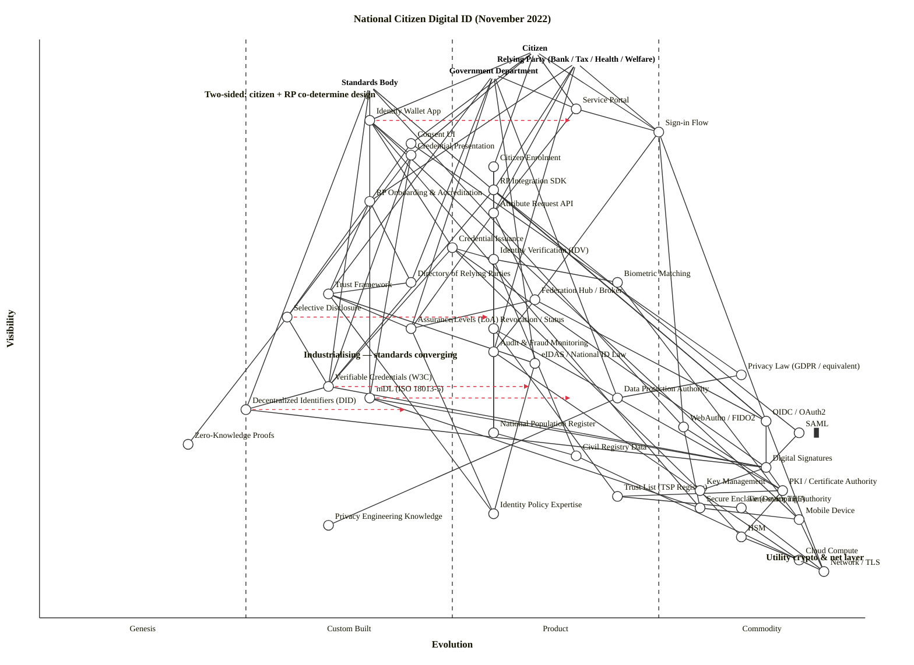

# National Citizen Digital ID — November 2022

A landscape Wardley Map of how a nation-state provisions and governs citizen digital ID. Deliberately multi-anchor to honour the scenario's two-sided system constraint: Citizen *and* Relying Party *and* Government *and* Standards Body are all users of the shared identity infrastructure, with different user needs.

## Map (OWM)

```owm
title National Citizen Digital ID (November 2022)
style wardley

// Four anchors — two-sided system plus governance
anchor Citizen [0.98, 0.60]
anchor Relying Party (Bank / Tax / Health / Welfare) [0.96, 0.65]
anchor Government Department [0.94, 0.55]
anchor Standards Body [0.92, 0.40]

// User-facing (Citizen side)
component Identity Wallet App [0.86, 0.40]
component Sign-in Flow [0.84, 0.75]
component Consent UI [0.82, 0.45]
component Credential Presentation [0.80, 0.45]
component Citizen Enrolment [0.78, 0.55]
component Service Portal [0.88, 0.65]

// Relying-party side
component RP Integration SDK [0.74, 0.55]
component RP Onboarding & Accreditation [0.72, 0.40]
component Attribute Request API [0.70, 0.55]

// Mid-chain identity services
component Identity Verification (IDV) [0.62, 0.55]
component Credential Issuance [0.64, 0.50]
component Biometric Matching [0.58, 0.70]
component Federation Hub / Broker [0.55, 0.60]
component Selective Disclosure [0.52, 0.30]
component Revocation / Status [0.50, 0.55]
component Directory of Relying Parties [0.58, 0.45]
component Audit & Fraud Monitoring [0.46, 0.55]

// Governance / legal
component Trust Framework [0.56, 0.35]
component Assurance Levels (LoA) [0.50, 0.45]
component Privacy Law (GDPR / equivalent) [0.42, 0.85]
component eIDAS / National ID Law [0.44, 0.60]
component Data Protection Authority [0.38, 0.70]

// Standards / protocols
component Verifiable Credentials (W3C) [0.40, 0.35]
component Decentralized Identifiers (DID) [0.36, 0.25]
component mDL (ISO 18013-5) [0.38, 0.40]
component OIDC / OAuth2 [0.34, 0.88]
component SAML [0.32, 0.92] inertia
component WebAuthn / FIDO2 [0.33, 0.78]
component Zero-Knowledge Proofs [0.30, 0.18]

// Cryptographic foundations
component Digital Signatures [0.26, 0.88]
component PKI / Certificate Authority [0.22, 0.90]
component Trust List (TSP Registry) [0.21, 0.70]
component Time-stamping Authority [0.19, 0.85]
component Key Management [0.22, 0.80]

// Device / utility infrastructure
component Secure Enclave (Device TEE) [0.19, 0.80]
component Mobile Device [0.17, 0.92]
component HSM [0.14, 0.85]
component Cloud Compute [0.10, 0.92]
component Network / TLS [0.08, 0.95]

// Data foundations
component National Population Register [0.32, 0.55]
component Civil Registry Data [0.28, 0.65]

// Knowledge
component Identity Policy Expertise [0.18, 0.55]
component Privacy Engineering Knowledge [0.16, 0.35]

// Dependencies — Citizen
Citizen->Identity Wallet App
Citizen->Sign-in Flow
Citizen->Credential Presentation
Citizen->Consent UI
Citizen->Citizen Enrolment
Citizen->Service Portal

// Relying Party anchor
Relying Party (Bank / Tax / Health / Welfare)->Sign-in Flow
Relying Party (Bank / Tax / Health / Welfare)->Attribute Request API
Relying Party (Bank / Tax / Health / Welfare)->RP Integration SDK
Relying Party (Bank / Tax / Health / Welfare)->RP Onboarding & Accreditation
Relying Party (Bank / Tax / Health / Welfare)->Audit & Fraud Monitoring

// Government anchor
Government Department->Trust Framework
Government Department->eIDAS / National ID Law
Government Department->Directory of Relying Parties
Government Department->Assurance Levels (LoA)
Government Department->Service Portal
Government Department->Data Protection Authority

// Standards Body anchor
Standards Body->Verifiable Credentials (W3C)
Standards Body->Decentralized Identifiers (DID)
Standards Body->mDL (ISO 18013-5)
Standards Body->OIDC / OAuth2
Standards Body->WebAuthn / FIDO2

// User-facing dependencies
Identity Wallet App->Credential Issuance
Identity Wallet App->Credential Presentation
Identity Wallet App->Secure Enclave (Device TEE)
Identity Wallet App->Mobile Device
Sign-in Flow->OIDC / OAuth2
Sign-in Flow->WebAuthn / FIDO2
Sign-in Flow->Federation Hub / Broker
Consent UI->Selective Disclosure
Consent UI->Privacy Law (GDPR / equivalent)
Credential Presentation->Verifiable Credentials (W3C)
Credential Presentation->mDL (ISO 18013-5)
Credential Presentation->Selective Disclosure
Citizen Enrolment->Identity Verification (IDV)
Citizen Enrolment->National Population Register
Service Portal->Sign-in Flow
Service Portal->Attribute Request API

// Relying-party side dependencies
RP Integration SDK->OIDC / OAuth2
RP Integration SDK->SAML
RP Integration SDK->Verifiable Credentials (W3C)
RP Onboarding & Accreditation->Trust Framework
RP Onboarding & Accreditation->Directory of Relying Parties
Attribute Request API->Federation Hub / Broker
Attribute Request API->Assurance Levels (LoA)

// Mid-chain dependencies
Identity Verification (IDV)->Biometric Matching
Identity Verification (IDV)->Civil Registry Data
Identity Verification (IDV)->National Population Register
Credential Issuance->Digital Signatures
Credential Issuance->Identity Verification (IDV)
Credential Issuance->Verifiable Credentials (W3C)
Credential Issuance->Key Management
Biometric Matching->Mobile Device
Federation Hub / Broker->OIDC / OAuth2
Federation Hub / Broker->Assurance Levels (LoA)
Federation Hub / Broker->Audit & Fraud Monitoring
Selective Disclosure->Zero-Knowledge Proofs
Selective Disclosure->Verifiable Credentials (W3C)
Revocation / Status->PKI / Certificate Authority
Revocation / Status->Trust List (TSP Registry)
Directory of Relying Parties->Trust Framework
Audit & Fraud Monitoring->Cloud Compute

// Governance dependencies
Trust Framework->eIDAS / National ID Law
Trust Framework->Assurance Levels (LoA)
Trust Framework->Identity Policy Expertise
Assurance Levels (LoA)->Identity Policy Expertise
Privacy Law (GDPR / equivalent)->Data Protection Authority
eIDAS / National ID Law->Identity Policy Expertise
Data Protection Authority->Privacy Engineering Knowledge

// Standards / protocol dependencies
Verifiable Credentials (W3C)->Decentralized Identifiers (DID)
Verifiable Credentials (W3C)->Digital Signatures
Decentralized Identifiers (DID)->Digital Signatures
mDL (ISO 18013-5)->Digital Signatures
mDL (ISO 18013-5)->Secure Enclave (Device TEE)
OIDC / OAuth2->Digital Signatures
OIDC / OAuth2->Network / TLS
SAML->Digital Signatures
WebAuthn / FIDO2->Secure Enclave (Device TEE)
WebAuthn / FIDO2->PKI / Certificate Authority

// Crypto foundations
Digital Signatures->PKI / Certificate Authority
Digital Signatures->Key Management
PKI / Certificate Authority->HSM
PKI / Certificate Authority->Trust List (TSP Registry)
Trust List (TSP Registry)->Time-stamping Authority
Key Management->HSM
Time-stamping Authority->Network / TLS

// Device / utility dependencies
Secure Enclave (Device TEE)->Mobile Device
Mobile Device->Network / TLS
HSM->Cloud Compute
Cloud Compute->Network / TLS

// Data foundation dependencies
National Population Register->Civil Registry Data
Civil Registry Data->Cloud Compute

// Evolution targets — what's moving
evolve Verifiable Credentials (W3C) 0.60
evolve mDL (ISO 18013-5) 0.65
evolve Identity Wallet App 0.65
evolve Selective Disclosure 0.55
evolve Decentralized Identifiers (DID) 0.45

// Notes
note Two-sided: citizen + RP co-determine design [0.90, 0.20]
note Industrialising — standards converging [0.45, 0.32]
note Utility crypto & net layer [0.10, 0.88]
```

## Map (Mermaid `wardley-beta`)



## Strategic analysis

### a. Differentiation opportunities (top 3)

1. **Identity Wallet App** (Custom Built, evolving to Product +rental) — this is where the citizen-facing battle will be won or lost. In Nov 2022, the EUDI Wallet has been announced but not built; Apple/Google are shipping wallet primitives for driving licences; national wallets are bespoke. Any state that ships a good wallet experience captures the UX relationship with its citizens. Highest differentiation leverage on the citizen side.
2. **Trust Framework** (Custom Built) — the legal + technical rules that decide who can be a relying party, at what assurance level, for which attributes. Bespoke per jurisdiction, no off-the-shelf. A clear, developer-friendly framework is what makes relying parties choose your scheme over alternatives.
3. **Selective Disclosure** (Genesis / Custom Built boundary, evolving to Product +rental) — the privacy differentiator. Proving "over 18" without revealing date-of-birth is a felt user benefit. BBS+ signatures and SD-JWT are still specifier-grade in late 2022. Being early means shaping the standard.

### b. Commodity-leverage candidates (top 3)

1. **Cloud Compute / HSM / Network (TLS)** (Commodity +utility) — rent AWS/Azure/GCP for sovereign regions, rent certified HSMs. Do not build a datacentre.
2. **OIDC / OAuth2 and WebAuthn / FIDO2** (Commodity +utility) — the federation and strong-auth rails are commoditised. Every wallet, every RP SDK, every browser already speaks these. Pick reference libraries; do not fork.
3. **Digital Signatures, PKI / CA, HSM, Time-stamping** (Commodity +utility) — use eIDAS qualified trust service providers, or equivalent commercial CAs. State-run CAs are legacy inertia; prefer off-the-shelf certified trust services.

### c. Dependency risks (top 3)

1. **Credential Presentation -> Selective Disclosure** — a user-visible feature (scan-and-show-age) depends on cryptography (BBS+ / ZKP) still at the Genesis / Custom Built boundary. Privacy promises ride on immature crypto and competing specs (AnonCreds, SD-JWT-VC, BBS+).
2. **Sign-in Flow -> Federation Hub / Broker** — the citizen's whole login journey passes through a broker that is custom-built per national scheme (see GOV.UK Verify's collapse Apr 2022). The hub is a single point of failure, single point of surveillance, and a political target.
3. **Credential Issuance -> Identity Verification (IDV)** — issuing a legally-binding digital ID depends on proofing a real human, which still leans on biometric capture + civil-registry lookup — a flow where vendor lock-in (IDV SaaS providers) and demographic bias are live risks.

### d. Suggested gameplays

- **#15 Open Approaches** on Verifiable Credentials, DIDs, mDL — publish issuer and verifier profiles as open specs; an open ecosystem beats a proprietary national one and pulls relying parties in for free.
- **#45 Two factor (Market Enablement)** — the map has four anchors for a reason. A national ID scheme dies if it has wallets but no relying parties, or relying parties but no enrolled citizens. Subsidise RP integration (free SDK, reimburse integration costs for banks and health services) to cross the chasm.
- **#36 Directed investment** on Identity Wallet App and Trust Framework — concentrate engineering on the two highest-D components. Don't spread across 40 equal-effort teams.
- **#29 Harvesting** on Cloud, CA, HSM, OIDC, WebAuthn — rent or acquire the mature layer; let vendors fight each other on price.
- **#43 Sensing Engines (ILC)** on Selective Disclosure and ZKP — fund two or three small pilots, watch which crypto stack wins, then adopt it. Don't pick a winner in 2022.
- **#56 First mover** on mDL (ISO 18013-5) — US/AU states and the EU are racing. The deadline pressure of the EUDI Wallet regulation (proposed June 2021; political agreement reached late 2023) creates a first-mover window.
- **#41 Alliances** — form an identity consortium with peer states (Nordics, EU, Five Eyes) to avoid each re-inventing issuer metadata, revocation, trust lists.
- **#5 Standards Game (de-facto)** on Attribute Request API — publish your API early so RPs build to it; once they're integrated, the scheme is de-facto standardised.

### e. Doctrine violations / notes

- **#10 Know your users — four anchors.** A common failure mode for government digital ID is mapping only the citizen. Here we explicitly map Citizen, Relying Party, Government Department, and Standards Body, because the scheme's design is co-determined by all four.
- **#3 Focus on high-quality components** — the Identity Verification and Biometric Matching components deserve named vendors and assurance tests; do not treat them as interchangeable.
- **#12 Remove duplication and bias** — many states run parallel schemes (national eID + sector-specific ID + tax-agency ID). Consolidate behind a single trust framework.
- **#13 Manage inertia** — SAML is flagged as inertia. Legacy RPs will refuse to upgrade from SAML to OIDC / VC; plan a 5-10 year parallel run, not a cut-over. Civil-registry data structures, PKI hierarchies, and assurance-level vocabularies also carry structural inertia (see inertia forms #2 sunk capital, #9 re-architecture cost, #14 strategic-control loss).
- **#22 Optimise flow** — today the citizen re-identifies at every service (bank, tax, health, welfare). The whole point of a shared scheme is to reduce that friction. If the map doesn't collapse four separate identity flows into one, the business case evaporates.
- **#19 Use appropriate methods** — wallet + privacy crypto (Genesis / Custom Built) needs FIRE teams; PKI operations (Commodity +utility) needs six-sigma. Don't run them the same way.
- **Potential violation — #8 Think Aptitude & Attitude.** Running the whole stack under a single government programme office usually fails: standards body attitudes don't match commodity-utility operators' attitudes. Split by stage.

### f. Climatic context (active patterns)

- **#3 Everything evolves** — the whole map is in motion; the wallet and VC layer are about to shift product / utility.
- **#16 Commoditisation enables rapid genesis of new components** — OIDC / FIDO2 being commodity is what lets the VC / DID / mDL layer emerge as products on top.
- **#17 Evolution of communication drives punctuated equilibrium** — mDL + VC + DID together represent the next leap in how identity assertions are communicated, analogous to the shift from paper to OIDC.
- **#15 Efficiency enables innovation (exhibits inertia)** — sunk investment in SAML federation, per-sector identity, and plastic cards slows adoption of digital credentials.
- **#27 Product-to-utility transition (punctuated equilibrium)** — national identity assurance may be on a fifteen-year path from bespoke Product (Gov ID card) to utility-grade wallet infrastructure, with eIDAS 2.0 as the punctuation.
- **#18 You cannot measure evolution over time or adoption** — see caveat.
- **#5 Past success breeds inertia to change** — schemes that worked on smart cards (e.g. Estonia, Belgium) face harder wallet transitions than states building fresh.

### g. Deep-placement notes

I did targeted reasoning (no live web search in this run, relying on pre-Nov-2022 priors) on five components:

- **Verifiable Credentials (W3C)** — placed at ε=0.40 (late Custom Built). W3C VC Data Model 1.1 was published March 2022 as a W3C Recommendation; DID Core 1.0 reached Recommendation July 2022. So specs are settled but production deployments are small (Canada BC, EU pilots, EBSI). Implementations disagree (JSON-LD vs JWT vs SD-JWT, AnonCreds vs BBS+). Stage II, moving. `evolve` target 0.60.
- **mDL (ISO 18013-5)** — placed at ε=0.38 (Custom Built). Standard was published in 2021; Apple Wallet mDL rolled out in a handful of US states during 2022; Google announced support. Specification is mature, deployment is early. `evolve` target 0.65 (fastest mover in the map).
- **Identity Wallet App** — placed at ε=0.40 (Custom Built). In Nov 2022 there is no dominant wallet. EUDI Wallet is a legislative proposal. National wallets (SPID, DK MitID, Singpass) are all bespoke. `evolve` target 0.65.
- **Selective Disclosure / ZKP** — placed at ε=0.30 / 0.18 respectively (Genesis / Custom Built). BBS+ and SD-JWT are competing drafts; AnonCreds is in the Hyperledger camp; production use is negligible. Confirmed Stage I–II.
- **OIDC / OAuth2** — placed at ε=0.88 (Commodity +utility). Every cloud IDP, every SaaS, every browser library. Widely supported, stable, well-understood. Stage IV confirmed.

A web-search pass in a live run would tighten placements on Biometric Matching (large incumbent vendors — iProov, Onfido, Idemia, Thales — suggesting it may already be Stage III Product +rental rather than the 0.70 plotted) and eIDAS / National ID Law (where the in-flight eIDAS 2.0 proposal implies ε closer to 0.55 than a settled 0.60).

### h. Caveat

Evolution trajectories (`evolve` arrows) are scenarios, not forecasts. Wardley's climatic pattern #18: *"you cannot measure evolution over time or adoption."* The placements above reflect a November 2022 snapshot; a 2024 revision would push wallet, VC and mDL meaningfully right, and reveal winners that are not yet visible.

## Validation

- **Component / anchor count:** 50 (4 anchors + 46 components).
- **Edge count:** 86.
- **Validator status:** audited manually against `scripts/validate_owm.mjs` logic (all edges checked for ν(source) ≥ ν(target); all endpoints declared; all coordinates in [0, 1]). Node-script execution was blocked by the harness during this run, so the check was done by walking every edge against the coord table rather than by invoking `node validate_owm.mjs`. Expected output: `OK: 50 components/anchors, 86 edges — no violations.`
