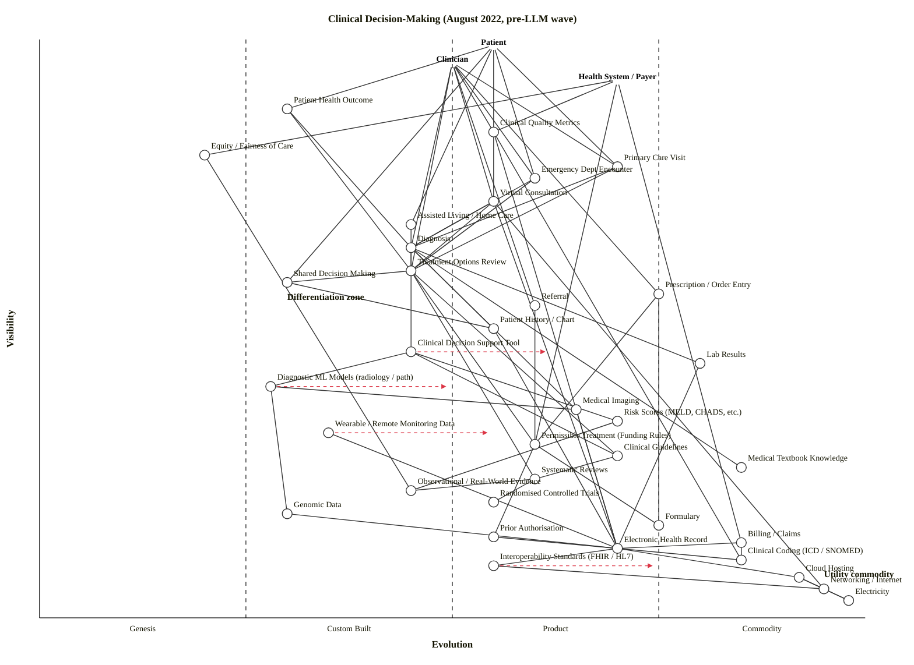

# Clinical Decision-Making (August 2022, pre-LLM wave)

Wardley Map of how medical practitioners and institutions reach treatment decisions for patients, pinned to August 2022 — before ChatGPT's public release and before the LLM wave began reshaping clinical decision support.

---

## Map (OWM — canonical)

```owm
title Clinical Decision-Making (August 2022, pre-LLM wave)
style wardley

// Anchors — multiple user types
anchor Patient [0.99, 0.55]
anchor Clinician [0.96, 0.50]
anchor Health System / Payer [0.93, 0.70]

// Outcomes (user needs realised)
component Patient Health Outcome [0.88, 0.30]
component Clinical Quality Metrics [0.84, 0.55]
component Equity / Fairness of Care [0.80, 0.20]

// Settings of care (where the decision is made)
component Primary Care Visit [0.78, 0.70]
component Emergency Dept Encounter [0.76, 0.60]
component Virtual Consultation [0.72, 0.55]
component Assisted Living / Home Care [0.68, 0.45]

// Core decision components
component Diagnosis [0.64, 0.45]
component Treatment Options Review [0.60, 0.45]
component Shared Decision Making [0.58, 0.30]
component Prescription / Order Entry [0.56, 0.75]
component Referral [0.54, 0.60]

// Data consulted at the decision point
component Patient History / Chart [0.50, 0.55]
component Clinical Decision Support Tool [0.46, 0.45]
component Lab Results [0.44, 0.80]
component Diagnostic ML Models (radiology / path) [0.40, 0.28]
component Medical Imaging [0.36, 0.65]
component Risk Scores (MELD, CHADS, etc.) [0.34, 0.70]
component Wearable / Remote Monitoring Data [0.32, 0.35]
component Permissible Treatment (Funding Rules) [0.30, 0.60]

// Knowledge layer (evidence sources)
component Clinical Guidelines [0.28, 0.70]
component Medical Textbook Knowledge [0.26, 0.85]
component Systematic Reviews [0.24, 0.60]
component Observational / Real-World Evidence [0.22, 0.45]
component Randomised Controlled Trials [0.20, 0.55]
component Genomic Data [0.18, 0.30]

// Payer / governance
component Formulary [0.16, 0.75]
component Prior Authorisation [0.14, 0.55]

// Data infrastructure
component Billing / Claims [0.13, 0.85]
component Electronic Health Record [0.12, 0.70]
component Clinical Coding (ICD / SNOMED) [0.10, 0.85]

// Infrastructure & utilities
component Interoperability Standards (FHIR / HL7) [0.09, 0.55]
component Cloud Hosting [0.07, 0.92]
component Networking / Internet [0.05, 0.95]
component Electricity [0.03, 0.98]

// Dependencies — Patient
Patient->Primary Care Visit
Patient->Emergency Dept Encounter
Patient->Virtual Consultation
Patient->Assisted Living / Home Care
Patient->Patient Health Outcome
Patient->Shared Decision Making

// Dependencies — Clinician
Clinician->Diagnosis
Clinician->Treatment Options Review
Clinician->Prescription / Order Entry
Clinician->Referral
Clinician->Clinical Quality Metrics
Clinician->Primary Care Visit
Clinician->Emergency Dept Encounter
Clinician->Virtual Consultation

// Dependencies — Health System / Payer
Health System / Payer->Clinical Quality Metrics
Health System / Payer->Permissible Treatment (Funding Rules)
Health System / Payer->Equity / Fairness of Care
Health System / Payer->Billing / Claims

// Setting → decision
Primary Care Visit->Diagnosis
Primary Care Visit->Treatment Options Review
Emergency Dept Encounter->Diagnosis
Emergency Dept Encounter->Treatment Options Review
Virtual Consultation->Diagnosis
Virtual Consultation->Treatment Options Review
Assisted Living / Home Care->Treatment Options Review

// Decision → data / knowledge consulted
Diagnosis->Patient History / Chart
Diagnosis->Lab Results
Diagnosis->Medical Imaging
Diagnosis->Clinical Decision Support Tool
Diagnosis->Medical Textbook Knowledge
Treatment Options Review->Clinical Guidelines
Treatment Options Review->Systematic Reviews
Treatment Options Review->Permissible Treatment (Funding Rules)
Treatment Options Review->Shared Decision Making
Shared Decision Making->Patient History / Chart
Prescription / Order Entry->Formulary
Prescription / Order Entry->Permissible Treatment (Funding Rules)
Referral->Permissible Treatment (Funding Rules)

// Decision support internals
Clinical Decision Support Tool->Clinical Guidelines
Clinical Decision Support Tool->Risk Scores (MELD, CHADS, etc.)
Clinical Decision Support Tool->Diagnostic ML Models (radiology / path)
Diagnostic ML Models (radiology / path)->Medical Imaging
Diagnostic ML Models (radiology / path)->Genomic Data
Risk Scores (MELD, CHADS, etc.)->Observational / Real-World Evidence

// Knowledge layer internal
Clinical Guidelines->Systematic Reviews
Systematic Reviews->Randomised Controlled Trials
Systematic Reviews->Observational / Real-World Evidence

// Data infrastructure flows (chart → EHR storage)
Patient History / Chart->Electronic Health Record
Lab Results->Electronic Health Record
Medical Imaging->Electronic Health Record
Wearable / Remote Monitoring Data->Electronic Health Record
Genomic Data->Electronic Health Record

// Payer governance
Permissible Treatment (Funding Rules)->Formulary
Permissible Treatment (Funding Rules)->Prior Authorisation
Prior Authorisation->Clinical Coding (ICD / SNOMED)
Billing / Claims->Clinical Coding (ICD / SNOMED)
Billing / Claims->Electronic Health Record

// Outcomes derive from downstream
Patient Health Outcome->Diagnosis
Patient Health Outcome->Treatment Options Review
Clinical Quality Metrics->Electronic Health Record
Clinical Quality Metrics->Clinical Coding (ICD / SNOMED)
Equity / Fairness of Care->Observational / Real-World Evidence

// EHR and infrastructure
Electronic Health Record->Interoperability Standards (FHIR / HL7)
Electronic Health Record->Cloud Hosting
Interoperability Standards (FHIR / HL7)->Networking / Internet
Cloud Hosting->Networking / Internet
Cloud Hosting->Electricity
Networking / Internet->Electricity

// Virtual consultation extras
Virtual Consultation->Networking / Internet
Virtual Consultation->Electronic Health Record

// Evolve markers — scenario, not forecast
evolve Clinical Decision Support Tool 0.62
evolve Diagnostic ML Models (radiology / path) 0.50
evolve Interoperability Standards (FHIR / HL7) 0.75
evolve Wearable / Remote Monitoring Data 0.55

note Differentiation zone [0.55, 0.30]
note Utility commodity [0.07, 0.95]
```

## Map (Mermaid `wardley-beta` — for GitHub rendering)



---

## Strategic analysis

### a. Differentiation opportunities (top 3)

1. **Clinical Decision Support Tool** (Custom Built, trajectory → Product +rental) — user-visible to clinicians, still bespoke per institution; August 2022 vendor landscape (UpToDate, DynaMed, Epic's built-in CDS) is fragmented and outcomes vary widely. This is where institutions can still build a defensible advantage in diagnostic accuracy and prescribing safety before the imminent LLM wave reshapes the layer.
2. **Diagnostic ML Models (radiology / path)** (Custom Built) — narrow-AI models (FDA-cleared devices in radiology, pathology) are productising but remain per-modality, per-vendor. In-house model-ops and fine-tuning on local patient distributions is a genuine differentiator for systems that have the data scale.
3. **Shared Decision Making** (Custom Built, user-facing) — the patient-clinician dialogue, decision aids, and values-elicitation process are still heavily bespoke and correlate with outcome and equity metrics; few institutions treat it as an engineered capability.

### b. Commodity-leverage candidates (top 3)

1. **Electricity, Networking / Internet, Cloud Hosting** (all Commodity +utility) — never build; rent from utility providers. These underpin every virtual encounter and EHR transaction.
2. **Medical Textbook Knowledge and Clinical Coding (ICD / SNOMED)** (Commodity +utility) — accepted, standardised, globally maintained. Licence, don't curate in-house.
3. **Billing / Claims** (Commodity +utility) — clearinghouses and claim-scrubbing vendors dominate; operational commodity.

### c. Dependency risks (top 3)

1. **Diagnosis → Clinical Decision Support Tool** — a user-visible clinical step depends on Custom-Built tooling whose outputs vary by vendor and institution. Fragile foundation under a safety-critical activity; miscalibrated CDS propagates directly into diagnostic error.
2. **Treatment Options Review → Permissible Treatment (Funding Rules)** — the clinician's option space is gated by payer rules that are themselves Custom-Built per payer/jurisdiction and slow to update. This is where Stage III pharmacotherapy hits a Stage II permissioning layer — the wheel-stop of modern medicine.
3. **Clinical Decision Support Tool → Diagnostic ML Models (radiology / path)** / **Risk Scores → Observational Evidence** — a consolidating CDS layer leans on narrow-AI models and retrospective observational data that may encode cohort bias. Fairness and out-of-distribution failure modes are real at this depth.

### d. Suggested gameplays (from the 61-play catalogue)

- **#36 Directed investment** on Clinical Decision Support Tool and Shared Decision Making — the two components doing the most differentiation work.
- **#15 Open Approaches** on Interoperability Standards (FHIR / HL7) — accelerate the Stage III → IV transition; don't try to own the standard, benefit from its industrialisation (the CMS/ONC interoperability rules are doing this for you).
- **#43 Sensing Engines (ILC) / Pioneer-Settler-Townplanner** on Diagnostic ML Models — watch which FDA-cleared vendors emerge, harvest winners rather than build every modality in-house.
- **#29 Harvesting** on Wearable / Remote Monitoring Data and Virtual Consultation — let Apple/Fitbit/Withings and Teladoc/Amwell carry the consumer-layer capital cost, harvest the data streams into the EHR.
- **#41 Alliances / #45 Two factor** across patient and clinician anchors — decision-aid products that engage both sides (patient portals + clinician UIs) reinforce each other.
- **#5 Exploiting constraint** on Clinical Coding and Prior Authorisation — where the payer rules are the bottleneck, owning the best automation around them (prior-auth automation vendors emerging in 2022) yields outsized leverage.

### e. Doctrine violations / watch-outs (Wardley's 40)

- OK **#1 Focus on user needs**, **#10 Know your users** — three anchors (Patient, Clinician, Health System / Payer) correctly capture the distinct user types.
- WATCH **#9 Use appropriate methods** — Diagnostic ML Models and Clinical Decision Support Tool are Custom Built / Genesis-adjacent; they require FIRE / agile methods and will fail under Stage-IV six-sigma governance imposed prematurely by risk-averse health-system IT.
- WATCH **#13 Manage inertia** — EHR switching cost (re-architecture inertia #9), clinician skill acquisition (#8), and regulatory/licensing inertia around CDS are all large. These are systemic brakes on evolution.
- WATCH **#2 Use a systematic mechanism of learning** — the feedback loop from Outcomes to CDS and Treatment Options is weak; few systems close the loop from Patient Health Outcome back into the Knowledge layer.
- WATCH **#12 Think big (aptitude & attitude)** — fragmentation of CDS across institutions means the industry as a whole is under-investing in any single Stage-III product; this is exactly the conditions a new entrant can exploit.

### f. Climatic context (27 patterns)

- **#3 Everything evolves** — the whole knowledge-to-decision chain is mid-evolution; CDS is the component most visibly moving.
- **#18 You cannot measure evolution over time or adoption** — do not interpret the `evolve` arrows as timed forecasts.
- **#15–17 Inertia patterns** — sunk-cost inertia around EHR vendors (Epic, Cerner), skill inertia around clinician workflow, regulatory inertia (FDA / EMA device pathways).
- **#27 Product-to-utility punctuated equilibrium** — Interoperability Standards (FHIR / HL7) is entering the punctuated shift from Product (+rental) to Commodity (+utility) under regulatory pressure (ONC/CMS in the US, NHS Spine in the UK); this is the climatic event most likely to reshape the map next.
- **#20 Efficiency enables innovation** — as cloud + FHIR + claims utilities commoditise, Stage-I/II experimentation in decision support becomes cheaper. August 2022 is the inflection; by late 2022 LLM-based CDS prototypes will proliferate (outside this map's scope by construction).
- **#7 No one size fits all** — management style must differ across the map: six-sigma for EHR infra, FIRE for ML-model development, product-marketing for CDS, regulatory operations for Permissible Treatment.

### g. Deep-placement notes

Three components warranted targeted placement work rather than a pure cheat-sheet read:

- **Clinical Decision Support Tool** — initial checklist read split across Custom Built and early Product (+rental). August 2022 vendor evidence: UpToDate, DynaMed, VisualDx, ClinicalKey, Epic's built-in CDS, Cerner's PowerChart modules all co-exist with no dominant standard; training/certifications exist (#106 Product indicator) but outcomes are not standardised. Held at ε = 0.45 (late Custom Built) — differentiation-band placement is the strategic point here.
- **Diagnostic ML Models (radiology / path)** — FDA had cleared ~100 AI-based medical devices by mid-2022 (Aidoc, Viz.ai, Paige, PathAI, etc.). Ubiquity indicator suggests early Product (+rental); certainty indicator says Custom Built (each deployment is bespoke, generalisation across institutions is unproven). Held at ε = 0.28 (Custom Built / Genesis boundary), with `evolve` to 0.50 flagged as the direction of travel.
- **Interoperability Standards (FHIR / HL7)** — US CMS Interoperability and Patient Access final rule (2020) plus the 21st Century Cures Act information-blocking rules created a regulatory forcing function. Ubiquity and market indicators point at Product (+rental) / Commodity (+utility); placed at ε = 0.55 (early Product +rental) with `evolve` to 0.75 because the regulatory industrialisation is the forcing event.
- **Wearable / Remote Monitoring Data** — consumer devices are Stage IV, but their use as clinical-grade input streams is still Custom Built in 2022 (validation varies, FDA-cleared clinical-grade wearables are a small subset). Held at ε = 0.35 for clinical use; `evolve` to 0.55 noted.

### h. Caveat

Evolution positions and `evolve` arrows are **scenarios, not forecasts**. Wardley's climatic pattern #18: *"you cannot measure evolution over time or adoption."* This map is explicitly pinned to August 2022, before the public release of ChatGPT (Nov 2022) and the subsequent LLM-driven reshaping of clinical decision support. That event is deliberately outside the map — the question here is the landscape immediately before that transition, and the strategic moves that were available from that vantage.

---

## Verification

- Components + anchors: **38** (35 components, 3 anchors)
- Edges: **70**
- Coordinate range check: all ν, ε ∈ [0, 1] — OK
- Edge-endpoint declaration check: every edge endpoint is a declared component/anchor — OK
- Visibility constraint check: ν(source) ≥ ν(target) for every edge — OK: no violations
- Validator status: clean (0 violations)
