# Modern Manufacturing Supply Chain — Wardley Map (Feb 2023)

Scenario: discrete-manufacturing OEM (electronics, automotive, industrial equipment). Two anchors — the OEM end-customer (cost / reliability) and the supply-chain organisation itself (resilience / agility). Post-COVID shortages easing but chip allocation ongoing, Ukraine war year two, IRA + CHIPS Acts reshaping US manufacturing, EU CSRD / Scope-3 about to take effect.

## Map (OWM)

```owm
title Modern Manufacturing Supply Chain (Feb 2023, discrete-manufacturing OEM)
style wardley

// Anchors — two user needs
anchor OEM End-Customer [0.99, 0.70]
anchor Supply-Chain Organisation [0.97, 0.45]

// User-visible outcomes
component Finished Product Delivery [0.90, 0.72]
component Product Quality and Reliability [0.88, 0.70]
component On-Time-In-Full Performance [0.85, 0.60]
component Supply Continuity [0.88, 0.40]
component Scenario Planning and What-if [0.82, 0.50]
component Risk Visibility Dashboard [0.80, 0.40]

// Planning and orchestration
component Sales and Operations Planning [0.72, 0.70]
component Demand Forecasting (ML) [0.68, 0.60]
component Supply Chain Control Tower [0.70, 0.45]
component Multi-tier Supplier Visibility [0.62, 0.35]
component Supplier Risk Scoring [0.60, 0.50]

// Sourcing
component Strategic Sourcing [0.72, 0.70]
component Supplier Qualification [0.58, 0.70]
component Contract Manufacturing [0.50, 0.75]
component Multi-sourcing Strategy [0.68, 0.40]
component Nearshoring and Reshoring Programmes [0.65, 0.35]
component Tier-1 Supplier Relationships [0.55, 0.65]
component Tier-2 and Tier-3 Supplier Mapping [0.52, 0.35]

// Critical inputs
component Semiconductor Sourcing [0.50, 0.65]
component Critical Minerals Sourcing [0.42, 0.35]
component Long-lead-time Components [0.45, 0.55]
component Commodity Raw Materials [0.40, 0.80]

// Production
component Assembly Lines [0.52, 0.70]
component Industrial Robotics and Automation [0.42, 0.70]
component Manufacturing Execution System [0.40, 0.65]
component Product Lifecycle Management [0.38, 0.65]
component Quality Control and SPC [0.45, 0.80]
component Predictive Maintenance [0.32, 0.45]
component Digital Twin [0.28, 0.40]
component Skilled Manufacturing Labour [0.35, 0.40]

// Logistics
component Inbound Logistics [0.48, 0.65]
component Warehouse Management [0.42, 0.75]
component Inventory Management [0.40, 0.80]
component Transport Management [0.40, 0.70]
component Ocean Freight [0.30, 0.85]
component Air Freight and Expedite [0.28, 0.85]
component Last-mile OEM Distribution [0.55, 0.75]

// Compliance
component Customs Brokerage [0.40, 0.80]
component Customs Documentation [0.22, 0.85]
component Export Controls and Sanctions [0.38, 0.65]
component Conflict Minerals Compliance [0.55, 0.65]
component ESG and Scope-3 Reporting [0.62, 0.30]
component IRA and CHIPS Compliance [0.60, 0.18]

// Enterprise backbone
component Enterprise Resource Planning [0.35, 0.78]
component Supplier Portal and EDI [0.28, 0.82]

// Infrastructure and utilities
component Data Lake [0.18, 0.80]
component Cloud Platform [0.12, 0.92]
component Energy [0.06, 0.95]

// Dependencies — OEM customer branch (cost / reliability)
OEM End-Customer->Finished Product Delivery
OEM End-Customer->Product Quality and Reliability
OEM End-Customer->On-Time-In-Full Performance

// Dependencies — Supply-chain organisation branch (resilience / agility)
Supply-Chain Organisation->Supply Continuity
Supply-Chain Organisation->Scenario Planning and What-if
Supply-Chain Organisation->Risk Visibility Dashboard
Supply-Chain Organisation->On-Time-In-Full Performance

// Outcome -> planning/orchestration
Finished Product Delivery->Last-mile OEM Distribution
Finished Product Delivery->Assembly Lines
Product Quality and Reliability->Quality Control and SPC
Product Quality and Reliability->Supplier Qualification
On-Time-In-Full Performance->Sales and Operations Planning
On-Time-In-Full Performance->Transport Management
Supply Continuity->Multi-sourcing Strategy
Supply Continuity->Tier-1 Supplier Relationships
Supply Continuity->Strategic Sourcing
Scenario Planning and What-if->Supply Chain Control Tower
Scenario Planning and What-if->Demand Forecasting (ML)
Risk Visibility Dashboard->Supply Chain Control Tower
Risk Visibility Dashboard->Supplier Risk Scoring
Risk Visibility Dashboard->Multi-tier Supplier Visibility

// Planning layer
Sales and Operations Planning->Demand Forecasting (ML)
Sales and Operations Planning->Enterprise Resource Planning
Demand Forecasting (ML)->Data Lake
Supply Chain Control Tower->Multi-tier Supplier Visibility
Supply Chain Control Tower->Supplier Risk Scoring
Supply Chain Control Tower->Cloud Platform
Multi-tier Supplier Visibility->Tier-2 and Tier-3 Supplier Mapping
Multi-tier Supplier Visibility->Supplier Portal and EDI
Supplier Risk Scoring->Tier-1 Supplier Relationships
Supplier Risk Scoring->Data Lake

// Sourcing
Strategic Sourcing->Supplier Qualification
Strategic Sourcing->Tier-1 Supplier Relationships
Strategic Sourcing->Multi-sourcing Strategy
Supplier Qualification->Tier-1 Supplier Relationships
Multi-sourcing Strategy->Nearshoring and Reshoring Programmes
Multi-sourcing Strategy->Tier-1 Supplier Relationships
Tier-1 Supplier Relationships->Semiconductor Sourcing
Tier-1 Supplier Relationships->Critical Minerals Sourcing
Tier-1 Supplier Relationships->Long-lead-time Components
Tier-1 Supplier Relationships->Commodity Raw Materials
Tier-1 Supplier Relationships->Contract Manufacturing
Tier-2 and Tier-3 Supplier Mapping->Critical Minerals Sourcing
Tier-2 and Tier-3 Supplier Mapping->Semiconductor Sourcing
Nearshoring and Reshoring Programmes->IRA and CHIPS Compliance
Nearshoring and Reshoring Programmes->Contract Manufacturing

// Production
Assembly Lines->Manufacturing Execution System
Assembly Lines->Industrial Robotics and Automation
Assembly Lines->Skilled Manufacturing Labour
Assembly Lines->Semiconductor Sourcing
Assembly Lines->Long-lead-time Components
Assembly Lines->Commodity Raw Materials
Assembly Lines->Energy
Manufacturing Execution System->Enterprise Resource Planning
Manufacturing Execution System->Cloud Platform
Product Lifecycle Management->Enterprise Resource Planning
Product Lifecycle Management->Digital Twin
Industrial Robotics and Automation->Predictive Maintenance
Industrial Robotics and Automation->Energy
Predictive Maintenance->Data Lake
Digital Twin->Data Lake
Quality Control and SPC->Manufacturing Execution System

// Logistics
Inbound Logistics->Transport Management
Inbound Logistics->Customs Brokerage
Inbound Logistics->Warehouse Management
Last-mile OEM Distribution->Transport Management
Last-mile OEM Distribution->Warehouse Management
Warehouse Management->Inventory Management
Warehouse Management->Enterprise Resource Planning
Transport Management->Ocean Freight
Transport Management->Air Freight and Expedite
Ocean Freight->Customs Documentation
Air Freight and Expedite->Customs Documentation
Customs Brokerage->Customs Documentation
Customs Brokerage->Export Controls and Sanctions

// Compliance
Export Controls and Sanctions->Data Lake
Conflict Minerals Compliance->Tier-2 and Tier-3 Supplier Mapping
Conflict Minerals Compliance->Critical Minerals Sourcing
ESG and Scope-3 Reporting->Tier-2 and Tier-3 Supplier Mapping
ESG and Scope-3 Reporting->Supplier Portal and EDI
ESG and Scope-3 Reporting->Data Lake
IRA and CHIPS Compliance->Critical Minerals Sourcing
IRA and CHIPS Compliance->Semiconductor Sourcing

// Enterprise backbone
Enterprise Resource Planning->Cloud Platform
Supplier Portal and EDI->Cloud Platform

// Infrastructure
Data Lake->Cloud Platform

// Evolve arrows — forward scenarios (Feb 2023 vantage)
evolve Multi-tier Supplier Visibility 0.55
evolve ESG and Scope-3 Reporting 0.55
evolve Supplier Risk Scoring 0.70
evolve Digital Twin 0.60
evolve IRA and CHIPS Compliance 0.45
evolve Predictive Maintenance 0.65

note Differentiation zone (build) [0.72, 0.30]
note Rent or buy (products) [0.45, 0.70]
note Utility (treat as cost) [0.15, 0.92]
```

## Map (Mermaid `wardley-beta`)

```mermaid
wardley-beta
title Modern Manufacturing Supply Chain (Feb 2023, discrete-manufacturing OEM)
size [1100, 800]

anchor "OEM End-Customer" [0.99, 0.70]
anchor "Supply-Chain Organisation" [0.97, 0.45]

component "Finished Product Delivery" [0.90, 0.72]
component "Product Quality and Reliability" [0.88, 0.70]
component "On-Time-In-Full Performance" [0.85, 0.60]
component "Supply Continuity" [0.88, 0.40]
component "Scenario Planning and What-if" [0.82, 0.50]
component "Risk Visibility Dashboard" [0.80, 0.40]

component "Sales and Operations Planning" [0.72, 0.70]
component "Demand Forecasting (ML)" [0.68, 0.60]
component "Supply Chain Control Tower" [0.70, 0.45]
component "Multi-tier Supplier Visibility" [0.62, 0.35]
component "Supplier Risk Scoring" [0.60, 0.50]

component "Strategic Sourcing" [0.72, 0.70]
component "Supplier Qualification" [0.58, 0.70]
component "Contract Manufacturing" [0.50, 0.75]
component "Multi-sourcing Strategy" [0.68, 0.40]
component "Nearshoring and Reshoring Programmes" [0.65, 0.35]
component "Tier-1 Supplier Relationships" [0.55, 0.65]
component "Tier-2 and Tier-3 Supplier Mapping" [0.52, 0.35]

component "Semiconductor Sourcing" [0.50, 0.65]
component "Critical Minerals Sourcing" [0.42, 0.35]
component "Long-lead-time Components" [0.45, 0.55]
component "Commodity Raw Materials" [0.40, 0.80]

component "Assembly Lines" [0.52, 0.70]
component "Industrial Robotics and Automation" [0.42, 0.70]
component "Manufacturing Execution System" [0.40, 0.65]
component "Product Lifecycle Management" [0.38, 0.65]
component "Quality Control and SPC" [0.45, 0.80]
component "Predictive Maintenance" [0.32, 0.45]
component "Digital Twin" [0.28, 0.40]
component "Skilled Manufacturing Labour" [0.35, 0.40]

component "Inbound Logistics" [0.48, 0.65]
component "Warehouse Management" [0.42, 0.75]
component "Inventory Management" [0.40, 0.80]
component "Transport Management" [0.40, 0.70]
component "Ocean Freight" [0.30, 0.85]
component "Air Freight and Expedite" [0.28, 0.85]
component "Last-mile OEM Distribution" [0.55, 0.75]

component "Customs Brokerage" [0.40, 0.80]
component "Customs Documentation" [0.22, 0.85]
component "Export Controls and Sanctions" [0.38, 0.65]
component "Conflict Minerals Compliance" [0.55, 0.65]
component "ESG and Scope-3 Reporting" [0.62, 0.30]
component "IRA and CHIPS Compliance" [0.60, 0.18]

component "Enterprise Resource Planning" [0.35, 0.78]
component "Supplier Portal and EDI" [0.28, 0.82]

component "Data Lake" [0.18, 0.80]
component "Cloud Platform" [0.12, 0.92]
component "Energy" [0.06, 0.95]

"OEM End-Customer" -> "Finished Product Delivery"
"OEM End-Customer" -> "Product Quality and Reliability"
"OEM End-Customer" -> "On-Time-In-Full Performance"

"Supply-Chain Organisation" -> "Supply Continuity"
"Supply-Chain Organisation" -> "Scenario Planning and What-if"
"Supply-Chain Organisation" -> "Risk Visibility Dashboard"
"Supply-Chain Organisation" -> "On-Time-In-Full Performance"

"Finished Product Delivery" -> "Last-mile OEM Distribution"
"Finished Product Delivery" -> "Assembly Lines"
"Product Quality and Reliability" -> "Quality Control and SPC"
"Product Quality and Reliability" -> "Supplier Qualification"
"On-Time-In-Full Performance" -> "Sales and Operations Planning"
"On-Time-In-Full Performance" -> "Transport Management"
"Supply Continuity" -> "Multi-sourcing Strategy"
"Supply Continuity" -> "Tier-1 Supplier Relationships"
"Supply Continuity" -> "Strategic Sourcing"
"Scenario Planning and What-if" -> "Supply Chain Control Tower"
"Scenario Planning and What-if" -> "Demand Forecasting (ML)"
"Risk Visibility Dashboard" -> "Supply Chain Control Tower"
"Risk Visibility Dashboard" -> "Supplier Risk Scoring"
"Risk Visibility Dashboard" -> "Multi-tier Supplier Visibility"

"Sales and Operations Planning" -> "Demand Forecasting (ML)"
"Sales and Operations Planning" -> "Enterprise Resource Planning"
"Demand Forecasting (ML)" -> "Data Lake"
"Supply Chain Control Tower" -> "Multi-tier Supplier Visibility"
"Supply Chain Control Tower" -> "Supplier Risk Scoring"
"Supply Chain Control Tower" -> "Cloud Platform"
"Multi-tier Supplier Visibility" -> "Tier-2 and Tier-3 Supplier Mapping"
"Multi-tier Supplier Visibility" -> "Supplier Portal and EDI"
"Supplier Risk Scoring" -> "Tier-1 Supplier Relationships"
"Supplier Risk Scoring" -> "Data Lake"

"Strategic Sourcing" -> "Supplier Qualification"
"Strategic Sourcing" -> "Tier-1 Supplier Relationships"
"Strategic Sourcing" -> "Multi-sourcing Strategy"
"Supplier Qualification" -> "Tier-1 Supplier Relationships"
"Multi-sourcing Strategy" -> "Nearshoring and Reshoring Programmes"
"Multi-sourcing Strategy" -> "Tier-1 Supplier Relationships"
"Tier-1 Supplier Relationships" -> "Semiconductor Sourcing"
"Tier-1 Supplier Relationships" -> "Critical Minerals Sourcing"
"Tier-1 Supplier Relationships" -> "Long-lead-time Components"
"Tier-1 Supplier Relationships" -> "Commodity Raw Materials"
"Tier-1 Supplier Relationships" -> "Contract Manufacturing"
"Tier-2 and Tier-3 Supplier Mapping" -> "Critical Minerals Sourcing"
"Tier-2 and Tier-3 Supplier Mapping" -> "Semiconductor Sourcing"
"Nearshoring and Reshoring Programmes" -> "IRA and CHIPS Compliance"
"Nearshoring and Reshoring Programmes" -> "Contract Manufacturing"

"Assembly Lines" -> "Manufacturing Execution System"
"Assembly Lines" -> "Industrial Robotics and Automation"
"Assembly Lines" -> "Skilled Manufacturing Labour"
"Assembly Lines" -> "Semiconductor Sourcing"
"Assembly Lines" -> "Long-lead-time Components"
"Assembly Lines" -> "Commodity Raw Materials"
"Assembly Lines" -> "Energy"
"Manufacturing Execution System" -> "Enterprise Resource Planning"
"Manufacturing Execution System" -> "Cloud Platform"
"Product Lifecycle Management" -> "Enterprise Resource Planning"
"Product Lifecycle Management" -> "Digital Twin"
"Industrial Robotics and Automation" -> "Predictive Maintenance"
"Industrial Robotics and Automation" -> "Energy"
"Predictive Maintenance" -> "Data Lake"
"Digital Twin" -> "Data Lake"
"Quality Control and SPC" -> "Manufacturing Execution System"

"Inbound Logistics" -> "Transport Management"
"Inbound Logistics" -> "Customs Brokerage"
"Inbound Logistics" -> "Warehouse Management"
"Last-mile OEM Distribution" -> "Transport Management"
"Last-mile OEM Distribution" -> "Warehouse Management"
"Warehouse Management" -> "Inventory Management"
"Warehouse Management" -> "Enterprise Resource Planning"
"Transport Management" -> "Ocean Freight"
"Transport Management" -> "Air Freight and Expedite"
"Ocean Freight" -> "Customs Documentation"
"Air Freight and Expedite" -> "Customs Documentation"
"Customs Brokerage" -> "Customs Documentation"
"Customs Brokerage" -> "Export Controls and Sanctions"

"Export Controls and Sanctions" -> "Data Lake"
"Conflict Minerals Compliance" -> "Tier-2 and Tier-3 Supplier Mapping"
"Conflict Minerals Compliance" -> "Critical Minerals Sourcing"
"ESG and Scope-3 Reporting" -> "Tier-2 and Tier-3 Supplier Mapping"
"ESG and Scope-3 Reporting" -> "Supplier Portal and EDI"
"ESG and Scope-3 Reporting" -> "Data Lake"
"IRA and CHIPS Compliance" -> "Critical Minerals Sourcing"
"IRA and CHIPS Compliance" -> "Semiconductor Sourcing"

"Enterprise Resource Planning" -> "Cloud Platform"
"Supplier Portal and EDI" -> "Cloud Platform"

"Data Lake" -> "Cloud Platform"

evolve "Multi-tier Supplier Visibility" 0.55
evolve "ESG and Scope-3 Reporting" 0.55
evolve "Supplier Risk Scoring" 0.70
evolve "Digital Twin" 0.60
evolve "IRA and CHIPS Compliance" 0.45
evolve "Predictive Maintenance" 0.65

note "Differentiation zone (build)" [0.72, 0.30]
note "Rent or buy (products)" [0.45, 0.70]
note "Utility (treat as cost)" [0.15, 0.92]
```



## Strategic analysis

### a. Differentiation opportunities (top 3)

1. **Multi-tier Supplier Visibility (Custom Built)** — Wardley's single largest post-COVID uplift lives here. Vendors exist (Interos, Resilinc, Everstream, Sayari) but every implementation is bespoke, and the OEMs who see two tiers deep into critical-minerals and chip supply *before* a disruption win the resilience anchor. Top of the build list.
2. **Supplier Risk Scoring (edge of Custom Built / Product (+rental))** — scoring on ESG, geo-political, financial, and single-source concentration signals. Data moat compounds over time; the longer you score, the better your model.
3. **Scenario Planning and What-if (Product (+rental))** — capability is productised (Kinaxis, o9, Blue Yonder) but *OEM-specific* scenario libraries and tariff / IRA-content-rule encodings are differentiated. Build the library even if you rent the engine.

Honourable mentions: **Digital Twin** (Custom Built) and **Predictive Maintenance** (Custom Built) — real but slower-burn differentiators; investment horizon 3–5 years.

### b. Commodity-leverage candidates (top 3)

1. **Cloud Platform (Commodity +utility)** — rent from AWS / Azure / GCP. Never build. Single-hyperscaler concentration risk noted below.
2. **Customs Documentation, Ocean Freight, Air Freight, Customs Brokerage (Commodity +utility)** — deep utility layer. Broker via multi-carrier TMS; do not own the freight.
3. **Commodity Raw Materials, Inventory Management, Supplier Portal / EDI (Commodity +utility)** — metal, plastic, EDI protocols are utility-grade. Procure on price; do not treat as strategic unless they are *critical* minerals (see risks).

Also: **Enterprise Resource Planning** — late Product (+rental) / early Commodity (+utility). SAP / Oracle / MS Dynamics / Infor. Rent, do not build. Tolerate the inertia (see doctrine notes).

### c. Dependency risks (top 3)

Edge `a -> b` where a visible component depends on an immature or concentrated foundation.

1. **Assembly Lines -> Semiconductor Sourcing** — a Product-stage production line blocked by an allocation-constrained input. In Feb 2023 automotive OEMs were still losing weeks of production to single-chip shortages (analog power MOSFETs, automotive MCUs). Single-fab and single-geography concentration (TSMC / Taiwan) is a macro tail-risk.
2. **Tier-1 Supplier Relationships -> Critical Minerals Sourcing** — rare-earths (neodymium, dysprosium), lithium, cobalt, nickel. Custom-Built evolution stage plus geographic concentration (China for rare-earths processing, DRC for cobalt, Russia for nickel / palladium) makes this the single biggest resilience exposure. The IRA's content rules make it a compliance risk simultaneously.
3. **Supply Chain Control Tower -> Multi-tier Supplier Visibility** — the SC org's resilience story depends on a Custom-Built foundation. Most OEMs only know Tier-1 deeply; Tier-2 and Tier-3 mapping is where shortages actually form (the Ukraine war took out Tier-3 neon gas supply that almost no OEM knew they depended on).

Also worth flagging: **Nearshoring / Reshoring Programmes -> IRA and CHIPS Compliance** — reshoring decisions are being written on top of Genesis-stage regulation (IRA = August 2022, CHIPS = August 2022, Treasury guidance still evolving in Feb 2023). High risk that today's capex gets stranded by tomorrow's guidance revision.

### d. Suggested gameplays

Named plays from Wardley's 61-play catalogue (`references/gameplay-patterns.md`).

- **#15 Open Approaches** — on **Multi-tier Supplier Visibility** and **ESG / Scope-3 Reporting**. Neither becomes industry-grade while each OEM hoards its own supplier graph. Consortium data-sharing (CDP supplier chain, RMI, the Catena-X automotive initiative) accelerates the Stage III transition and builds standards you shape.
- **#36 Directed Investment** — on **Supplier Risk Scoring** and **Scenario Planning**. The D ranking says these are where engineering and data-science effort pays.
- **#41 Alliances / Co-operation** — on **Critical Minerals Sourcing** and **Semiconductor Sourcing**. Joint long-term offtake agreements with miners / foundries (Ford + Liontown, GM + Livent, Stellantis + Vulcan Energy). Second-source mandate in procurement.
- **#29 Harvesting** — on **Contract Manufacturing** and the commodity logistics layer. Let Foxconn / Jabil / Flex consolidate; harvest capacity and price.
- **#45 Sensing Engines (ILC) / Ecosystem play** — on **Supplier Portal and EDI**. Use the portal as the sensor for emerging shortages; the portal data is the input to Risk Scoring.
- **#56 First Mover on Regulation** — on **IRA and CHIPS Compliance** and **ESG / Scope-3 Reporting**. Regulatory deadlines create narrow windows; moving early captures subsidies (IRA content bonuses) and avoids 2024 / 2025 CSRD penalties.
- **#25 Pig in a Poke** / **#31 Experimentation** — on **Digital Twin** and **Predictive Maintenance**. Keep pilots small, time-boxed, with clear kill-criteria. Do not treat as transformational platform investments yet.
- **#17 Embrace and Extend** — on **Cloud Platform**. Use it fully; but dual-region, dual-cloud for concentration insurance on Risk Scoring and Control Tower data.

### e. Doctrine violations / flags

From Wardley's 40 doctrine principles (`references/doctrine.md`).

- [ok] **#1 Focus on user needs** — two user needs explicitly anchored (OEM customer cost / reliability; SC org resilience / agility).
- [ok] **#10 Know your users** — two anchors, not one.
- [warn] **#13 Manage inertia** — large inertia sinks in this map: ERP (re-architecture cost, form #9; sunk capital, form #2), MES, Tier-1 supplier relationships (long-term contracts, form #3). Name the inertia explicitly in any transformation plan.
- [warn] **#2 Use a systematic mechanism of learning** — the Risk Scoring -> Control Tower -> Multi-tier Visibility loop should feed observed disruption outcomes back into the scoring model. If it does not, the scores do not improve.
- [warn] **#25 A bias toward action** — the skilled-labour shortage (Skilled Manufacturing Labour at Custom Built) is often deferred because it is uncomfortable; do not.
- [warn] **#8 Use appropriate methods** (right tools for the stage) — beware applying six-sigma / lean discipline to Genesis-stage components (IRA compliance, Scope-3) or applying agile / pilot logic to Commodity (+utility) components (Customs Brokerage).

### f. Climatic context

From `references/climatic-patterns.md` (27 patterns).

- **#3 Everything evolves** — the whole compliance column is mid-transition (ESG Custom -> Product, IRA Genesis -> Custom, Conflict Minerals Product -> Commodity).
- **#15–17 Inertia** — ERP lock-in, Tier-1 contract duration, workforce skill re-tooling are the dominant drags.
- **#18 You cannot measure evolution over time or adoption** — in particular, do not assume that because semiconductor demand has stabilised since the 2020–2022 shortage, the stage of *semiconductor sourcing* has moved.
- **#19 / #20 Past success breeds inertia** — OEMs that ran decades of Japanese-style single-source JIT are the slowest to move to multi-sourcing; that prior success is actively harmful now.
- **#22 Efficiency enables innovation** — the very efficient supply chains of 2010–2019 removed the buffer that would have absorbed 2020–2022 shocks. Over-optimisation created the exposure.
- **#27 Punctuated equilibrium (product-to-utility)** — expect this on ESG / Scope-3 Reporting (CSRD + IRA + SEC climate rule = utility-ification forcing function) and on Supplier Risk Scoring within 3–5 years.
- **#24 Co-evolution of practice with activity** — reshoring is not just sourcing-on-a-shorter-line; it co-evolves with labour practice, automation choice, and compliance stance.

### g. Deep-placement notes

Researched / deep-placement calls (top 5 strategically load-bearing components):

- **Semiconductor Sourcing (0.50 / mid Product)** — cheat-sheet rows point squarely at Product (+rental): mature vendor landscape (TSMC, Samsung, Intel, GloFo, SMIC, and hundreds of fabless suppliers), standardised pricing, RFP-driven. Held at 0.50 rather than 0.65 because the Feb 2023 *market behaviour* is allocation-driven rather than price-driven — the component is *behaving* like Custom Built even though it is structurally Product. Flag as "in transition — dislocated".
- **Critical Minerals Sourcing (0.35 / Custom Built)** — vendor count low, geographic concentration extreme, price discovery thin, offtake-contract-driven. Ubiquity: rare. Certainty: rapidly improving but still unstable. Placement at 0.35 rather than 0.25 because major OEMs *are* doing it (GM, Ford, Tesla, VW), just bespoke-per-OEM.
- **ESG and Scope-3 Reporting (0.30 / Custom Built, evolving to 0.55 by 2025)** — CSRD effective 2024 for large EU entities; Scope-3 voluntary today, mandatory tomorrow. Vendor landscape forming (Watershed, Sweep, Persefoni, Normative). Multiple competing methodologies (GHG Protocol, SBTi, EU taxonomy). Placed at 0.30 pre-regulation, scenarioed to 0.55 post.
- **IRA and CHIPS Compliance (0.18 / late Genesis)** — IRA signed August 2022, CHIPS signed August 2022. Treasury guidance on domestic-content and FEOC rules still being written in Feb 2023. By definition Genesis; placement reflects novelty. Scenarioed to 0.45 as rulings accumulate.
- **Multi-tier Supplier Visibility (0.35 / Custom Built)** — deliberately flagged. Vendor landscape exists (Resilinc, Interos, Everstream, Sayari, Z2Data, Exiger) but every deployment is bespoke, datasets are proprietary, and there is no standard schema. Evolve arrow to 0.55 reflects the consortium push (Catena-X, CDP) in the 2023–2026 horizon.

### h. Caveat

Evolution trajectories on the `evolve` arrows are **scenarios, not forecasts**. Wardley's climatic pattern #18: *"you cannot measure evolution over time or adoption."* Regulatory shocks (a tightened IRA, a CSRD delay, a Taiwan-Strait crisis) can accelerate or stall the punctuated-equilibrium transitions called out in section f. Re-run the map every 6–12 months, or on any material change in IRA / CHIPS / CSRD rulings or in semiconductor allocation behaviour.

---

## Validator result

```
OK: 50 components/anchors, 86 edges — no violations.
```

(Executed via a Python port of `skills/wardley-map/scripts/validate_owm.mjs` — the sandbox in this run denied `node`; the Python port applies the same three checks: coordinate range, edge endpoint declared, and the hard rule `ν(a) ≥ ν(b)` for every edge `a -> b`.)
