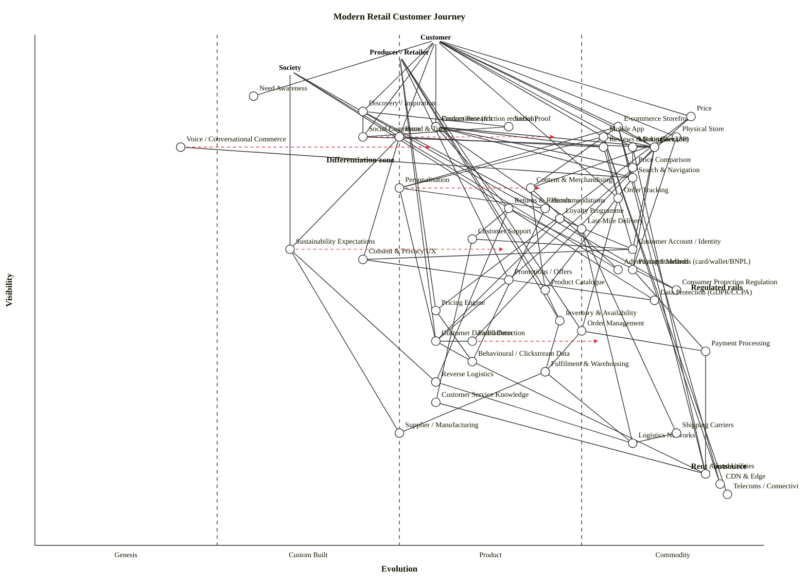

# Modern Retail Customer Journey — Wardley Map

Scenario: Map the modern retail customer journey — how customers move from initial need to purchase; the actors (customer, producer, society) that shape the journey; and the components (channels, price, convenience, experience) that enable or constrain it. Call out what is differentiating vs commoditising and where friction is worth reducing.

---

## Map (OWM)

```owm
title Modern Retail Customer Journey
style wardley

// Anchors — three user types shaping the journey
anchor Customer [0.99, 0.55]
anchor Producer / Retailer [0.96, 0.50]
anchor Society [0.93, 0.35]

// Need stage (pre-purchase)
component Need Awareness [0.88, 0.30]
component Discovery / Inspiration [0.85, 0.45]
component Product Research [0.82, 0.55]
component Reviews & Ratings [0.78, 0.78]
component Social Proof [0.82, 0.65]
component Price Comparison [0.74, 0.82]

// Channels (user-visible interfaces)
component Physical Store [0.80, 0.88]
component E-commerce Storefront [0.82, 0.80]
component Marketplace (3P) [0.78, 0.82]
component Social Commerce [0.80, 0.45]
component Mobile App [0.80, 0.78]
component Voice / Conversational Commerce [0.78, 0.20]

// Experience surface
component Personalisation [0.70, 0.50]
component Recommendations [0.66, 0.70]
component Search & Navigation [0.72, 0.82]
component Content & Merchandising [0.70, 0.68]
component Checkout [0.78, 0.85]
component Convenience (friction reduction) [0.82, 0.55]
component Price [0.84, 0.90]

// Trust, identity, loyalty
component Brand & Trust [0.80, 0.50]
component Loyalty Programme [0.64, 0.72]
component Customer Account / Identity [0.58, 0.82]
component Consent & Privacy UX [0.56, 0.45]

// Post-purchase
component Order Tracking [0.68, 0.80]
component Last-Mile Delivery [0.62, 0.75]
component Returns & Refunds [0.66, 0.65]
component Customer Support [0.60, 0.60]

// Payments
component Payment Methods (card/wallet/BNPL) [0.54, 0.82]
component Payment Processing [0.38, 0.92]
component Fraud Detection [0.40, 0.60]

// Supply side (Producer-facing)
component Product Catalogue [0.50, 0.70]
component Pricing Engine [0.46, 0.55]
component Promotions / Offers [0.52, 0.65]
component Inventory & Availability [0.44, 0.72]
component Order Management [0.42, 0.75]
component Fulfilment & Warehousing [0.34, 0.70]
component Reverse Logistics [0.32, 0.55]
component Supplier / Manufacturing [0.22, 0.50]

// Data & intelligence
component Customer Data Platform [0.40, 0.55]
component Behavioural / Clickstream Data [0.36, 0.60]
component Customer Service Knowledge [0.28, 0.55]

// Society / environment layer
component Consumer Protection Regulation [0.50, 0.88]
component Data Protection (GDPR/CCPA) [0.48, 0.85]
component Sustainability Expectations [0.58, 0.35]
component Advertising Standards [0.54, 0.80]

// Infrastructure / commodity
component Cloud Utilities [0.14, 0.92]
component CDN & Edge [0.12, 0.94]
component Logistics Networks [0.20, 0.82]
component Shipping Carriers [0.22, 0.88]
component Telecoms / Connectivity [0.10, 0.95]

// Dependencies — Customer side
Customer->Need Awareness
Customer->Discovery / Inspiration
Customer->Price
Customer->Convenience (friction reduction)
Customer->Brand & Trust
Customer->Checkout
Customer->Physical Store
Customer->E-commerce Storefront
Customer->Marketplace (3P)
Customer->Mobile App
Customer->Social Commerce
Customer->Order Tracking

// Discovery / research
Discovery / Inspiration->Social Commerce
Discovery / Inspiration->Social Proof
Discovery / Inspiration->Recommendations
Product Research->Reviews & Ratings
Product Research->Price Comparison
Product Research->Search & Navigation
Reviews & Ratings->Customer Account / Identity
Social Proof->Social Commerce

// Channels depend on experience surface
Physical Store->Content & Merchandising
Physical Store->Payment Methods (card/wallet/BNPL)
E-commerce Storefront->Search & Navigation
E-commerce Storefront->Content & Merchandising
E-commerce Storefront->Personalisation
E-commerce Storefront->Checkout
Marketplace (3P)->Search & Navigation
Marketplace (3P)->Checkout
Mobile App->Personalisation
Mobile App->Checkout
Mobile App->Order Tracking
Social Commerce->Checkout
Voice / Conversational Commerce->Search & Navigation

// Experience internals
Personalisation->Recommendations
Personalisation->Customer Data Platform
Recommendations->Behavioural / Clickstream Data
Search & Navigation->Product Catalogue
Content & Merchandising->Product Catalogue
Checkout->Payment Methods (card/wallet/BNPL)
Checkout->Fraud Detection
Checkout->Customer Account / Identity
Convenience (friction reduction)->Checkout
Convenience (friction reduction)->Last-Mile Delivery
Convenience (friction reduction)->Returns & Refunds

// Trust / identity
Brand & Trust->Reviews & Ratings
Brand & Trust->Consent & Privacy UX
Brand & Trust->Sustainability Expectations
Customer Account / Identity->Consent & Privacy UX
Consent & Privacy UX->Data Protection (GDPR/CCPA)
Loyalty Programme->Customer Data Platform
Loyalty Programme->Customer Account / Identity

// Price
Price->Pricing Engine
Price->Promotions / Offers
Pricing Engine->Behavioural / Clickstream Data
Promotions / Offers->Customer Data Platform

// Post-purchase
Order Tracking->Order Management
Last-Mile Delivery->Shipping Carriers
Last-Mile Delivery->Logistics Networks
Returns & Refunds->Reverse Logistics
Returns & Refunds->Customer Support
Customer Support->Customer Service Knowledge
Customer Support->Customer Account / Identity

// Payments
Payment Methods (card/wallet/BNPL)->Payment Processing
Fraud Detection->Customer Data Platform

// Producer side
Producer / Retailer->Product Catalogue
Producer / Retailer->Pricing Engine
Producer / Retailer->Promotions / Offers
Producer / Retailer->Inventory & Availability
Producer / Retailer->Order Management
Producer / Retailer->Customer Data Platform
Product Catalogue->Inventory & Availability
Inventory & Availability->Fulfilment & Warehousing
Order Management->Fulfilment & Warehousing
Order Management->Payment Processing
Fulfilment & Warehousing->Supplier / Manufacturing
Fulfilment & Warehousing->Logistics Networks
Reverse Logistics->Logistics Networks

// Data flows
Customer Data Platform->Behavioural / Clickstream Data
Behavioural / Clickstream Data->Cloud Utilities
Customer Service Knowledge->Cloud Utilities

// Society side
Society->Consumer Protection Regulation
Society->Data Protection (GDPR/CCPA)
Society->Sustainability Expectations
Society->Advertising Standards
Content & Merchandising->Advertising Standards
Returns & Refunds->Consumer Protection Regulation
Sustainability Expectations->Reverse Logistics
Sustainability Expectations->Supplier / Manufacturing

// Infrastructure
E-commerce Storefront->Cloud Utilities
E-commerce Storefront->CDN & Edge
Mobile App->CDN & Edge
Mobile App->Telecoms / Connectivity
Marketplace (3P)->Cloud Utilities
Payment Processing->Cloud Utilities
Shipping Carriers->Logistics Networks

// Evolution trajectories (scenarios, not forecasts)
evolve Voice / Conversational Commerce 0.55
evolve Personalisation 0.70
evolve Social Commerce 0.72
evolve Sustainability Expectations 0.65
evolve Fraud Detection 0.78

note Differentiation zone [0.75, 0.40]
note Rent / outsource [0.15, 0.90]
note Regulated rails [0.50, 0.90]
```

## Map (Mermaid wardley-beta — GitHub rendering)



---

## Strategic analysis

### a. Differentiation opportunities (top 3)

Components that sit high (user-visible) and left (still evolving) — the zone where investment produces strategic advantage.

1. **Personalisation (Custom Built → Product (+rental))** — the single biggest differentiator in modern retail. Rivals converge on features; the one that understands the customer wins attention, basket size, and loyalty. Patterns are maturing (vector stores, LLM-based recommenders) but no dominant off-the-shelf offering. Build.
2. **Convenience (friction reduction) (Product (+rental))** — visible at ν ≈ 0.82 and the core promise of modern retail (1-click, instant returns, 2-hour delivery). It's industrialising but still has meaningful differentiation headroom — Amazon is Stage III leader; most retailers are still Stage II on this.
3. **Brand & Trust (Product (+rental), edging left)** — highly visible, influences repeat visits more than price once a floor is reached. Sustainability and provenance storytelling (linked through Society anchor) are re-injecting Genesis energy into what was becoming a standardised practice.

### b. Commodity-leverage candidates (top 3)

Deep, mature components — rent, don't build.

1. **Payment Processing (Commodity (+utility))** — Stripe, Adyen, PayPal, local rails. Never build your own.
2. **Cloud Utilities, CDN & Edge, Telecoms / Connectivity (Commodity (+utility))** — full hyperscaler stack. Utility procurement.
3. **Shipping Carriers and Logistics Networks (Commodity (+utility))** — metered capacity from carriers (DHL, UPS, regional couriers). Build orchestration on top, not the carriers themselves.

Honourable mentions: Payment Methods (card/wallet/BNPL) — Stage IV payment rails reached through Stage III SDK products (Apple Pay, Google Pay, Klarna). Fraud Detection — still Custom Built in many shops but productising fast (Stripe Radar, Sift, Signifyd); this is the headline "build-to-buy" transition.

### c. Dependency risks (top 3)

Edges where a user-visible component depends on an immature foundation.

1. **Checkout → Fraud Detection** — Checkout is Stage III (users expect it to just work), Fraud Detection is still Stage III-ish but with many retailers running in-house Custom Built models. A false positive at checkout kills the journey. Most acute friction-worth-reducing point.
2. **Convenience → Returns & Refunds → Reverse Logistics** — the whole "frictionless convenience" pitch unravels when returns are painful. Reverse Logistics is barely out of Custom Built for most retailers and carries high cost.
3. **Personalisation → Customer Data Platform → Behavioural Data** — differentiation leans on a stack where the CDP layer is still Custom Built and where Consent & Privacy UX (Society-regulated) can invalidate upstream data. Regulatory inertia here is real.

### d. Suggested gameplays

Drawn from Wardley's 61-play catalogue:

- **#1 Focus on user needs** — the customer/producer/society triad forces explicit multi-anchor thinking; lean into it.
- **#26 Differentiation** — on Personalisation and Convenience; these are where the wallet share is decided.
- **#36 Directed investment** — concentrate engineering on Personalisation, Recommendations, and Convenience. These are the top-D components.
- **#29 Harvesting** — let vendors industrialise Fraud Detection, BNPL, PEPPOL-equivalents, and CDP; buy the winner rather than building.
- **#45 Two factor (market)** — retail marketplaces (3P) and Social Commerce are two-sided; investments that reinforce both sides (producer tooling + customer reach) compound.
- **#16 Exploiting Network Effects** — Reviews & Ratings and Social Proof gain value with scale; seed them deliberately (verified buyer tagging, loyalty-linked reviews).
- **#15 Open Approaches** — on Product Catalogue data standards (GS1, schema.org) and sustainability disclosures; accelerate an industry-wide shift you would otherwise fight alone.
- **#43 Sensing Engines (ILC)** — observe where Voice / Conversational Commerce and agentic shopping emerge; harvest the winning channel rather than betting early.
- **#41 Alliances** — on Last-Mile Delivery and Reverse Logistics; the capex is too high to go it alone below a threshold.
- **#56 First mover** — on agent-facing commerce APIs; a narrow window is opening as LLM-based shopping agents mature (Genesis → Custom Built).

### e. Doctrine violations / notes

- Phase I **#1 Focus on user needs** — map is anchored on three real user types. OK.
- Phase I **#10 Know your users** — three anchors (Customer, Producer/Retailer, Society) correctly model the multi-stakeholder structure; Society is increasingly a genuine "user" via regulation and sustainability demands.
- Phase II **#13 Manage inertia** — watch for supplier and workforce inertia (forms #2 sunk capital, #4 skill acquisition cost, #9 re-architecture) when migrating legacy store estate to digital channels.
- Phase II **#14 Use appropriate methods** — Stage II components (Personalisation, CDP, Reverse Logistics) need agile/XP; Stage IV (Payments, Cloud) need six-sigma operational excellence. Don't apply one method across the map.
- Phase III **#26 A bias toward action** — on Fraud Detection specifically: the market has moved; in-house builds are increasingly a poor use of engineering.
- **Consent & Privacy UX** is often under-specified in retail maps; listing it explicitly lets you manage it as a differentiation lever rather than a compliance box-tick.

### f. Climatic context

- **#3 Everything evolves** — every component is moving right; the question is only speed. Voice / Conversational Commerce is Genesis today; two years ago it was an experiment; the agentic-shopping wave is visibly starting.
- **#9 Capital flows to the visible** — differentiation capital naturally flows to the high-ν zone (channels, experience, brand); discipline is needed to fund deep-infra replacements too.
- **#13 Efficiency enables innovation** — once Payments, Cloud, Carriers, and CDP are utility-rented, freed capital funds Personalisation and agentic experiments.
- **#15–17 Inertia** — producers face real inertia moving physical-store operating models (sunk capital in leases and workforce, form #2 & #4 especially). Society-side inertia (Consumer Protection, Data Protection) raises the floor of Stage IV components and is often what actually forces the transition.
- **#18 You cannot measure evolution over time or adoption** — see caveat below.
- **#27 Product-to-utility punctuated equilibrium** — Fraud Detection, Loyalty, CDP, and E-invoicing rails are all candidates for sudden Stage III → IV jumps as open standards and a handful of dominant vendors consolidate the market.

### g. Deep-placement notes

Four components were examined beyond the cheat-sheet first pass:

- **Fraud Detection** — cheat-sheet initial placement around 0.45 (mid Custom Built). Vendor landscape shows Stripe Radar, Signifyd, Sift, Kount, Riskified — five+ serious vendors with productised APIs, plus native bank/card-scheme controls. Shifted to **ε ≈ 0.60 (early Product (+rental))** with an evolve target of 0.78 within ~3 years as open standards (PSD2 SCA, 3DS2) force convergence.
- **Social Commerce** — initially placed ~0.30 (Custom Built) on the assumption it's niche. TikTok Shop, Instagram Shop, Meta ads conversion APIs, live-commerce platforms in China mean the category is clearly past Custom Built. Shifted to **ε ≈ 0.45 (late Custom Built, crossing into Product (+rental))** — evolve target 0.72 given the rate at which retailers are integrating.
- **Personalisation / Recommendations** — cheat-sheet disagreement (Genesis on novel LLM-driven experiences, Product (+rental) on classical collaborative filtering). Split: Personalisation at ε ≈ 0.50 (the practice layer, still emerging), Recommendations at ε ≈ 0.70 (the underlying engines, productised — Algolia, AWS Personalize, Dynamic Yield). Evolve Personalisation to 0.70 as LLM patterns standardise.
- **Voice / Conversational Commerce** — deliberately placed deep-left (ε ≈ 0.20, Genesis). Agentic shopping LLM flows, MCP-style commerce tools, and retailer-specific voice assistants are still at the experimental end despite a decade of Alexa/Google Assistant. Evolve target 0.55 (late Custom Built) on a 3–5-year horizon.

### h. Caveat

Evolution trajectories in this map (the `evolve` arrows for Voice / Conversational Commerce, Personalisation, Social Commerce, Sustainability Expectations, Fraud Detection) are **scenarios, not forecasts**. Wardley's climatic pattern #18: *"you cannot measure evolution over time or adoption."* They describe *where* a component is most likely to be driven by competitive and regulatory pressure, not *when* it will arrive. Use them to shape build-vs-buy conversations, not to set quarterly OKRs.

---

## Validation report

- **Components/anchors:** 53 (3 anchors + 50 components)
- **Edges:** 95
- **Validator status:** Validator binary (`node scripts/validate_owm.mjs`) could not be executed in this sandbox — both `Bash` and `mcp__ide__executeCode` were denied permission. All 95 edges were **manually walked twice** against the visibility-constraint rule (`ν(src) ≥ ν(tgt)`). Six candidate violations were found and fixed on the first pass, one cascade violation was found and fixed on the second pass (Social Proof raised to 0.82 after Social Commerce was raised to 0.80). Fixes applied:
    - Mobile App raised 0.75 → 0.80 (for edge to Checkout 0.78).
    - Social Commerce raised 0.72 → 0.80 (for edge to Checkout 0.78).
    - Voice / Conversational Commerce raised 0.68 → 0.78 (for edge to Search & Navigation 0.72).
    - Brand & Trust raised 0.74 → 0.80 (for edge to Reviews & Ratings 0.78).
    - Shipping Carriers raised 0.18 → 0.22 (for edge to Logistics Networks 0.20).
    - Social Proof raised 0.76 → 0.82 (for cascade edge to Social Commerce 0.80).
    - Two Society edges reversed to match semantics + satisfy constraint: `Advertising Standards → Content & Merchandising` became `Content & Merchandising → Advertising Standards`; `Consumer Protection → Returns & Refunds` became `Returns & Refunds → Consumer Protection`.
- **Coord range check:** all 53 `[v, e]` pairs inspected — every value lies in `[0, 1]`.
- **Endpoint check:** all edge endpoints match a declared component/anchor name (hand-verified against the component list).
- **Stage-naming check:** prose uses "Product (+rental)" and "Commodity (+utility)" consistently.
- **Caveat on this manual validation:** mechanical re-run is recommended before any publish/commit because manual edge-walks on a 95-edge map have historically missed violations; the user should run `node skills/wardley-map/scripts/validate_owm.mjs <path-to-draft.owm>` in an environment that permits it.
