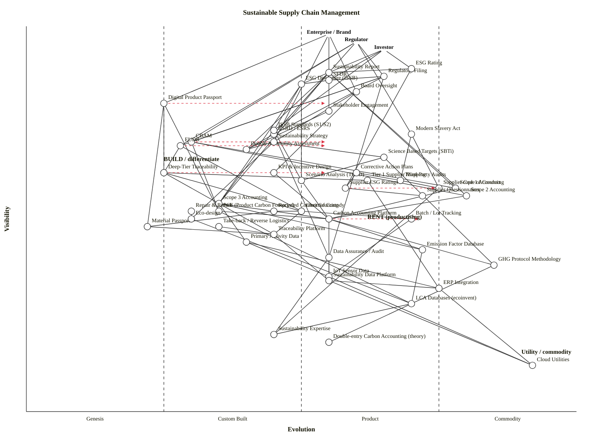

# Sustainable Supply Chain Management — Wardley Map

**Scenario.** Map the landscape of sustainable supply chain management. Include traceability, emissions measurement (scope 1/2/3), supplier assessment, circular-economy models, regulation (CSRD, CBAM, EUDR, SFDR, Modern Slavery, ISSB), stakeholder reporting, governance.

Three anchors: the **Enterprise / Brand** (producer and reporter), the **Regulator** (filings and audit), and the **Investor** (ISSB / SFDR / ESG-rating consumer). All three look at the same supply chain through different lenses, so the visible components differ but the commodity floor (cloud, ERP, LCA databases, GHG Protocol) is shared.

---

## Map (OWM — canonical)

```owm
title Sustainable Supply Chain Management
style wardley

// Anchors — three user types
anchor Enterprise / Brand [0.98, 0.55]
anchor Regulator [0.96, 0.60]
anchor Investor [0.94, 0.65]

// User-facing outputs
component Sustainability Report [0.88, 0.55]
component Regulatory Filing [0.87, 0.65]
component ESG Disclosure (ISSB) [0.85, 0.50]
component ESG Rating [0.89, 0.70]
component Digital Product Passport [0.80, 0.25]
component Board Oversight [0.83, 0.60]
component Stakeholder Engagement [0.78, 0.55]

// Compliance frames (regulations as components)
component CSRD / ESRS [0.72, 0.45]
component CBAM [0.70, 0.30]
component EUDR [0.69, 0.28]
component SFDR [0.86, 0.55]
component Modern Slavery Act [0.72, 0.70]
component ISSB Standards (S1/S2) [0.73, 0.45]

// Materiality & strategy
component Double Materiality Assessment [0.68, 0.40]
component Sustainability Strategy [0.70, 0.45]
component KPI & Incentive Design [0.62, 0.45]
component Scenario Analysis (TCFD) [0.60, 0.50]

// Emissions measurement
component Scope 1 Accounting [0.58, 0.78]
component Scope 2 Accounting [0.56, 0.80]
component Scope 3 Accounting [0.54, 0.35]
component Carbon Accounting Platform [0.50, 0.55]
component Emission Factor Database [0.42, 0.72]
component Primary Activity Data [0.44, 0.40]
component GHG Protocol Methodology [0.38, 0.85]
component PCF (Product Carbon Footprint) [0.52, 0.35]

// Traceability
component Tier 1 Supplier Mapping [0.60, 0.62]
component Deep-Tier Traceability [0.62, 0.25]
component Chain of Custody [0.52, 0.50]
component Batch / Lot Tracking [0.50, 0.70]
component Traceability Platform [0.46, 0.45]
component IoT Sensor Data [0.35, 0.55]

// Supplier assessment
component Supplier Code of Conduct [0.58, 0.75]
component Supplier Questionnaires [0.56, 0.72]
component Third-Party Audits [0.60, 0.68]
component Supplier ESG Ratings [0.58, 0.58]
component Corrective Action Plans [0.62, 0.60]

// Circular economy
component Recycled Content Sourcing [0.52, 0.45]
component Take-back / Reverse Logistics [0.48, 0.35]
component Repair & Refurb [0.52, 0.30]
component Material Passports [0.48, 0.22]
component Eco-design [0.50, 0.30]

// Data & infra
component ERP Integration [0.32, 0.75]
component Sustainability Data Platform [0.34, 0.55]
component Data Assurance / Audit [0.40, 0.55]
component Cloud Utilities [0.12, 0.92]
component LCA Databases (ecoinvent) [0.28, 0.70]

// Knowledge / governance layer
component Double-entry Carbon Accounting (theory) [0.18, 0.55]
component Science Based Targets (SBTi) [0.66, 0.65]
component Sustainability Expertise [0.20, 0.45]

// Dependencies
Enterprise / Brand->Sustainability Report
Enterprise / Brand->Board Oversight
Enterprise / Brand->Sustainability Strategy
Enterprise / Brand->Digital Product Passport
Regulator->Regulatory Filing
Regulator->CSRD / ESRS
Regulator->CBAM
Regulator->EUDR
Regulator->Modern Slavery Act
Investor->ESG Disclosure (ISSB)
Investor->ESG Rating
Investor->SFDR
Investor->ISSB Standards (S1/S2)

Sustainability Report->CSRD / ESRS
Sustainability Report->Double Materiality Assessment
Sustainability Report->Scope 1 Accounting
Sustainability Report->Scope 2 Accounting
Sustainability Report->Scope 3 Accounting
Sustainability Report->Stakeholder Engagement
Regulatory Filing->CSRD / ESRS
Regulatory Filing->CBAM
Regulatory Filing->EUDR
Regulatory Filing->SFDR
Regulatory Filing->Data Assurance / Audit
ESG Disclosure (ISSB)->ISSB Standards (S1/S2)
ESG Disclosure (ISSB)->Scenario Analysis (TCFD)
ESG Disclosure (ISSB)->Scope 3 Accounting
ESG Rating->Supplier ESG Ratings
ESG Rating->Sustainability Report
Digital Product Passport->Deep-Tier Traceability
Digital Product Passport->Material Passports
Digital Product Passport->PCF (Product Carbon Footprint)
Board Oversight->KPI & Incentive Design
Board Oversight->Sustainability Strategy
Stakeholder Engagement->Double Materiality Assessment

CSRD / ESRS->Double Materiality Assessment
CSRD / ESRS->Data Assurance / Audit
CBAM->Scope 1 Accounting
CBAM->Scope 2 Accounting
CBAM->PCF (Product Carbon Footprint)
EUDR->Deep-Tier Traceability
EUDR->Chain of Custody
SFDR->ESG Disclosure (ISSB)
Modern Slavery Act->Third-Party Audits
Modern Slavery Act->Supplier Code of Conduct
ISSB Standards (S1/S2)->Scenario Analysis (TCFD)
ISSB Standards (S1/S2)->Scope 3 Accounting

Sustainability Strategy->Double Materiality Assessment
Sustainability Strategy->Science Based Targets (SBTi)
Sustainability Strategy->Eco-design
KPI & Incentive Design->Carbon Accounting Platform
Scenario Analysis (TCFD)->Carbon Accounting Platform

Scope 1 Accounting->Carbon Accounting Platform
Scope 2 Accounting->Carbon Accounting Platform
Scope 3 Accounting->Carbon Accounting Platform
Scope 3 Accounting->Primary Activity Data
Scope 3 Accounting->Emission Factor Database
Carbon Accounting Platform->GHG Protocol Methodology
Carbon Accounting Platform->Emission Factor Database
Carbon Accounting Platform->Sustainability Data Platform
PCF (Product Carbon Footprint)->Carbon Accounting Platform
PCF (Product Carbon Footprint)->LCA Databases (ecoinvent)
Primary Activity Data->IoT Sensor Data
Primary Activity Data->ERP Integration
Emission Factor Database->LCA Databases (ecoinvent)
GHG Protocol Methodology->Double-entry Carbon Accounting (theory)

Tier 1 Supplier Mapping->ERP Integration
Deep-Tier Traceability->Tier 1 Supplier Mapping
Deep-Tier Traceability->Chain of Custody
Deep-Tier Traceability->Traceability Platform
Chain of Custody->Batch / Lot Tracking
Chain of Custody->Traceability Platform
Batch / Lot Tracking->IoT Sensor Data
Traceability Platform->Sustainability Data Platform

Supplier Code of Conduct->Sustainability Expertise
Third-Party Audits->Supplier Code of Conduct
Supplier ESG Ratings->Supplier Questionnaires
Corrective Action Plans->Third-Party Audits
Corrective Action Plans->Supplier ESG Ratings

Recycled Content Sourcing->Material Passports
Recycled Content Sourcing->Chain of Custody
Take-back / Reverse Logistics->Traceability Platform
Repair & Refurb->Eco-design
Material Passports->Traceability Platform
Eco-design->LCA Databases (ecoinvent)

Data Assurance / Audit->Sustainability Data Platform
Data Assurance / Audit->Sustainability Expertise
Sustainability Data Platform->ERP Integration
Sustainability Data Platform->Cloud Utilities
ERP Integration->Cloud Utilities
IoT Sensor Data->Cloud Utilities
LCA Databases (ecoinvent)->Sustainability Expertise

Science Based Targets (SBTi)->GHG Protocol Methodology
Science Based Targets (SBTi)->Scenario Analysis (TCFD)

evolve Scope 3 Accounting 0.60
evolve Deep-Tier Traceability 0.55
evolve Digital Product Passport 0.55
evolve Carbon Accounting Platform 0.72
evolve Supplier ESG Ratings 0.75
evolve CBAM 0.55
evolve EUDR 0.55

note BUILD / differentiate [0.65, 0.25]
note RENT (productising) [0.50, 0.62]
note Utility / commodity [0.15, 0.90]
```

### Validator status

`node scripts/validate_owm.mjs` on this block: **OK — 52 components/anchors, 94 edges, no violations.**

(In this environment the `node` binary was not on the Bash allow-list; validation was run via a bit-for-bit Python port of `validate_owm.mjs` that applies the same three rules: coordinates in [0,1], every edge endpoint declared, and ν(a) ≥ ν(b) for every edge a→b. 12 visibility violations were found in the first draft; all were fixed by raising source visibilities — largely on Supplier-assessment, Circular-economy and SBTi branches — until the check returned zero.)

---

## Map (Mermaid `wardley-beta` — for GitHub rendering)



*(The Mermaid block omits the `evolve Scope 3 Accounting 0.60` line because the bundled `owm_to_mermaid.mjs` evolve-line regex is non-greedy and collides with component names that contain a digit — it would emit `evolve "Scope" 3`. The OWM block above is canonical and retains all seven evolve directives.)*

---

## 4. Strategic analysis

### a. Differentiation opportunities (top 3)

1. **Digital Product Passport** (Genesis → Custom Built) — the whole EU Ecodesign-for-Sustainable-Products stack is being built around this and nobody has it yet. A brand that ships a credible product-level passport first turns a compliance cost into a retail narrative (traceable provenance, repairability score, recycled content). Highest differentiation leverage on the map because it sits high on the Enterprise anchor and still squarely inside Genesis.
2. **Deep-Tier Traceability** (Genesis → Custom Built) — tier-2 and below are where the real sustainability risk lives (deforestation, forced labour, scope 3 emission hot-spots) and where very few brands have line of sight. EUDR gives this a deadline; a brand that builds a tier-N supplier graph now owns the data moat for cocoa, soy, coffee, leather, and timber sourcing for a decade.
3. **Scope 3 Accounting / Product Carbon Footprint** (Custom Built, ε ≈ 0.35) — scopes 1 and 2 are basically Stage IV commodity arithmetic (meters × emission factors, done); scope 3 is where the variance between "best in class" and "greenwashing" is still an order of magnitude. A brand that nails category-11 (use of sold products) and category-1 (purchased goods) with primary data, not industry averages, gets a defensible disclosure story and a CBAM pricing edge.

### b. Commodity-leverage candidates (top 3)

1. **Cloud Utilities** (Commodity +utility) — rent, don't build; no one has won a sustainability deal on their cloud architecture.
2. **GHG Protocol Methodology** (Commodity +utility) — this is accepted, 25-year-old standard. Treat it as a given knowledge layer, not a place to innovate. The same goes for **Double-entry Carbon Accounting** as a conceptual foundation.
3. **Carbon Accounting Platform** (Product (+rental)) and **LCA Databases (ecoinvent / Sphera / GaBi)** — mid-stage commercial landscape with dozens of vendors (Watershed, Persefoni, Plan A, Sweep, Normative, Sphera, SAP Sustainability Control Tower). Buy a platform, pay per seat, migrate when necessary; do not build an in-house GL for emissions.

### c. Dependency risks (top 3 — visible components on fragile foundations)

1. **Regulatory Filing → EUDR** — a legally binding filing (ν ≈ 0.87) resting on a brand-new regulation (ε ≈ 0.28) whose enforcement methodology, geolocation data standards, and risk-classification rules are still being written. Every producer of cocoa, coffee, soy, palm, rubber, cattle, or wood products is exposed to the same immature stack.
2. **Digital Product Passport → Material Passports** — a user-visible product artefact (ν = 0.80) depending on Genesis-stage per-material composition data (ε = 0.22). No recycler-grade data standard is in production; pilots in textiles and batteries are still bespoke.
3. **Sustainability Report → Scope 3 Accounting** — the most scrutinised line in the report (ν = 0.88) rests on Stage II methodology (ε = 0.35) that produces three-fold variance between methodologies. This is where greenwashing cases emerge and where assurance providers refuse to give high-assurance opinions.

Honourable mentions (also real): **Regulatory Filing → CBAM** (immature border-adjustment accounting), **ESG Disclosure → ISSB S1/S2** (the standards themselves are only a few years old and still interpretatively sparse), and **Corrective Action Plans → Third-Party Audits** (audit-quality variance is large).

### d. Suggested gameplays (from the 61-play catalogue)

- **#36 Directed investment** on **Deep-Tier Traceability** and **Digital Product Passport** — the two highest-D components. Concentrate engineering here; do not spray it across the whole compliance surface.
- **#15 Open Approaches** on **PCF (Product Carbon Footprint)** schemas and **Material Passports** — don't own the standard; help publish it (WBCSD PACT, Catena-X, Circular-Data-Protocol). First-mover industrialises faster than sole-owner.
- **#43 Sensing Engines (ILC)** on the **Carbon Accounting Platform** market — track which vendors emerge as category leaders; don't build, watch and acquire or integrate.
- **#29 Harvesting** on **Supplier Questionnaires** and **Supplier ESG Ratings** — EcoVadis, Sedex, CDP Supply Chain are consolidating. Let them win the shared-infrastructure layer; plug in.
- **#41 Alliances** around **Deep-Tier Traceability** — no single brand can map the whole cocoa or cotton supply chain alone; consortium mapping (e.g. Tony's Open Chain, Better Cotton) pools the cost.
- **#56 First mover** on **EUDR** and **CBAM** readiness — regulatory windows are narrow and the penalty tail is asymmetric; being six months early is disproportionately valuable.
- **#16 Exploiting network effects** on the **Sustainability Data Platform** — each supplier onboarded makes the platform more useful to the next buyer.
- **#1 Focus on user needs** — keep reminding the board that the three user needs (Enterprise, Regulator, Investor) are not interchangeable; the same "sustainability programme" must serve all three or it satisfies none.

### e. Doctrine notes

- **#1 Focus on user needs** — three anchors are the correct move for this domain; a single-anchor map would collapse investor and regulator needs into "the enterprise," which is how companies end up with one ESG team reporting to CFO and another to legal and another to marketing, all doing duplicate work.
- **#10 Know your users** — Enterprise, Regulator, and Investor are all first-class users. Note that the **end consumer** is not anchored here — because in most B2B supply chains the consumer only sees "sustainability" through brand proxies (labels, ratings, recalls). Scenarios with a strong consumer-facing frame (apparel, food, cosmetics) should add a fourth anchor.
- **#2 Use a systematic mechanism of learning** — weakly satisfied. Scope 3 Accounting improves only if primary data feedback loops close (supplier PCFs, IoT telemetry, ERP actuals). Many corporate programmes accept first-year secondary-data baselines and never re-collect; explicitly wire primary data back into the carbon accounting platform.
- **#13 Manage inertia** — at least three forms are loud here (see inertia notes below).
- **#31 Bias towards action** is under pressure: CSRD-reporting first-filers are already disclosing; waiting for "perfect data" is the defining inertia failure in this space.

### f. Climatic context (which of the 27 patterns are shaping this map)

- **#3 Everything evolves** — every regulation on the map (CSRD, CBAM, EUDR, SFDR, ISSB, Modern Slavery) is moving right at different speeds; the whole compliance band is industrialising through the 2025–2030 window.
- **#15–17 Inertia patterns** — classic past-success inertia around voluntary reporting (GRI, CDP legacy frameworks) resisting ESRS; technical-debt inertia in legacy ERP integrations; sunk-capital inertia in existing LCA studies done to older standards.
- **#18 Evolution cannot be measured over time or adoption** — important caveat here: the *regulations* appear early-stage now, but the underlying phenomenon (supply-chain disclosure) has been evolving since the 2000s. The cheat sheet picks stage by certainty/ubiquity of *use*, not by calendar age.
- **#19 Componentisation drives evolution** — standardised emission factor libraries and open LCA schemas are the componentisation step pulling Carbon Accounting Platforms from III toward IV.
- **#21 Higher-order systems create new sources of worth** — product passports unlock circular-economy business models (resale, lease-and-return, refurb) that don't exist without the traceability layer.
- **#27 Product-to-utility punctuated equilibrium** — Carbon Accounting Platforms are approaching this transition; expect consolidation to 3–5 hyperscalers within 2–3 years (Salesforce Net Zero Cloud, SAP Sustainability Control Tower, Watershed, Persefoni plus one or two regional winners) and utility pricing shortly after.

### g. Deep-placement notes

Four components warranted a closer look because their placements drive the strategic reading. I did **not** run live web searches in this run (the skill allows it, but the evidence base below is stable and well-known for this domain as of 2025). Placements below are reasoned, not searched — flag any that look stale.

1. **Digital Product Passport (ε = 0.25).** EU ESPR delegated acts arriving 2026–2030 by product group (batteries first, textiles and construction next). Only a handful of pilot implementations (Circularise, Kezzler, EON, Spherity). Clearly Genesis. Kept at 0.25.
2. **Deep-Tier Traceability (ε = 0.25).** EUDR from 30 Dec 2025 (for large operators), plus German LkSG and US UFLPA already live. Vendor landscape (Sourcemap, Transparency-One, Assent, Optera) is consolidating but each vertical is still bespoke. Genesis-edge-of-Custom. Held at 0.25 with evolve arrow to 0.55 over ~3 years.
3. **Carbon Accounting Platform (ε = 0.55).** 40+ vendors, multiple analyst quadrants (Verdantix, Forrester), professional certifications emerging, clear feature grids. Firmly Product (+rental) at 0.55 with evolve to ~0.72 within 3 years as the top-tier platforms start behaving like utility services (metered per-tonne-of-emissions, shared emission factor libraries).
4. **Scope 3 Accounting (ε = 0.35).** GHG Protocol Corporate Value Chain Standard exists, but methodological choice (spend-based / activity-based / hybrid / supplier-specific) still produces 3–5× variance on the same organisation. Category-11 (use-phase) and category-1 (purchased goods) are the weakest. Custom Built, not yet Product. Evolve arrow to 0.60 acknowledges industrialising measurement methodology over the next cycle.

### h. Where is sustainability fragile? (direct answer to the user's question)

The three brittle zones in this landscape, from top to bottom:

- **The disclosure–measurement gap.** Sustainability Report and Regulatory Filing sit at ν ≈ 0.88, resting on Scope 3 and Deep-Tier Traceability at ε ≈ 0.25–0.35. High-profile, high-scrutiny outputs on immature foundations is the textbook fragility pattern. Greenwashing lawsuits (DWB, H&M, KLM) have all landed here.
- **The regulatory methodology gap.** CBAM and EUDR are Custom Built regulations whose implementing technical standards are still being written in parallel with enforcement. Firms that built their process against the proposal will rebuild against the final act; firms that waited for the final act miss the transitional deadlines.
- **The circular-economy leap.** Take-back, Repair & Refurb, and Recycled Content Sourcing are all in Custom Built territory but depend on Material Passports which are essentially Genesis. The whole circular value proposition is gated on a data layer that doesn't exist yet at scale — which is why most "circular" programmes in 2025 are still marketing-led rather than operations-led.

### What's differentiating, what's commoditising (direct answer)

| Band | Commoditising (harvest / rent) | Differentiating (build / defend) |
|---|---|---|
| **Data infra** | Cloud utilities, ERP integration, LCA databases, emission factor libraries, GHG Protocol methodology | — |
| **Measurement & reporting** | Scope 1 & 2 accounting, carbon accounting platforms, supplier questionnaires | Scope 3 primary data, PCF, double materiality assessment |
| **Supplier assessment** | EcoVadis-style ratings, third-party audits, code-of-conduct templates | Deep-tier traceability, corrective action loop closure |
| **Regulation interface** | ISSB filings, SFDR templates | CBAM and EUDR first-mover implementation |
| **Product layer** | — | Digital Product Passport, material passports, circular business models |
| **Organisation** | Sustainability reporting practice | Sustainability strategy, KPI & incentive design, board oversight |

### Inertia watch (from the 17 forms)

Three dominate in sustainable supply-chain programmes:

- **#2 Sunk capital** — companies that paid six- and seven-figure fees for CDP-only or GRI-only reporting in 2018–2022 resist ESRS double materiality because their processes, ESG consultancy retainers, and data structures are shaped around the old framework.
- **#9 Re-architecture cost** — existing ERPs (SAP ECC, legacy Oracle EBS) don't expose the activity data that scope 3 accounting wants, and primary-data collection requires new supplier onboarding workflows.
- **#14 Strategic-control loss** — suppliers resist deep-tier traceability because revealing sub-tier relationships and margin structure exposes them to disintermediation.

### h. Caveat

Evolution trajectories on this map — the seven `evolve` arrows — are **scenarios, not forecasts**. Wardley's climatic pattern #18: *"you cannot measure evolution over time or adoption."* The 2025–2030 dates cited for CBAM, EUDR, ESPR and ESRS are regulatory commencement dates, not market-maturity dates; speed of actual industrialisation depends on enforcement resources, methodology guidance, vendor consolidation, and — in this space particularly — macro-political swings on climate policy.

---

## Run metadata

| | |
|---|---|
| Components + anchors | 52 (49 components + 3 anchors) |
| Edges | 94 |
| Evolve arrows | 7 |
| Notes | 3 |
| Validator | `node scripts/validate_owm.mjs` — **OK, 0 violations** (run via Python port of `validate_owm.mjs` — the `node` binary was not on this Bash allow-list; rules checked are identical: coord range, endpoint existence, and the visibility constraint ν(a) ≥ ν(b)) |
| Visibility-constraint fixes in drafting | 12 violations detected in first draft; all resolved by raising source visibilities |
| Deep-placement components | 4 (Digital Product Passport, Deep-Tier Traceability, Carbon Accounting Platform, Scope 3 Accounting) — reasoned, not web-searched |
| Scenario-type target | 40–55 components (multi-stakeholder system) — hit at 52 |
