# Telecoms Sovereignty — October 2022

Wardley Map of a nation's ability to control its own telecommunications infrastructure, dated October 2022. Three user types: nation-state (security & control), citizens (day-to-day connectivity), businesses (enterprise connectivity).

## Map (OWM)

```owm
title Telecoms Sovereignty (October 2022)
style wardley

// Anchors — three user types
anchor Nation-State (security & control) [0.99, 0.30]
anchor Citizens (day-to-day connectivity) [0.98, 0.75]
anchor Businesses (enterprise connectivity) [0.97, 0.60]

// Nation-state facing capabilities
component Sovereign Oversight of Networks [0.90, 0.22]
component Lawful Intercept & CNI Assurance [0.85, 0.55]
component Designated-Vendor Regime [0.82, 0.20]
component Spectrum Licensing & Auctions [0.80, 0.85]
component Subsea Cable Protection [0.78, 0.18]
component Resilient Emergency Comms [0.74, 0.35]

// Citizen-facing connectivity
component Mobile Broadband Service [0.90, 0.82]
component Fixed Broadband Service [0.88, 0.86]
component Voice & Messaging [0.85, 0.92]
component Public Wi-Fi [0.72, 0.88]

// Business-facing connectivity
component Enterprise Connectivity (SD-WAN / MPLS) [0.86, 0.72]
component Private 5G for Industry [0.78, 0.28]
component Cloud Interconnect [0.72, 0.78]
component Managed Security Services [0.70, 0.62]

// Radio access layer
component Radio Access Network (RAN) [0.62, 0.70]
component OpenRAN [0.58, 0.32]
component 5G Standalone Core [0.55, 0.48]
component 4G / LTE Core [0.55, 0.82]
component Small Cells & Densification [0.52, 0.55]

// Transport & backhaul
component IP / MPLS Backbone [0.48, 0.82]
component Optical Transport (DWDM) [0.45, 0.85]
component Subsea Cable Systems [0.42, 0.65]
component Terrestrial Fibre Backhaul [0.42, 0.82]

// Alternative / resilience layer
component LEO Satellite Broadband (Starlink-class) [0.60, 0.30]
component National Roaming / MOCN [0.66, 0.60]

// Network operations & assurance
component Network Operations Centre [0.35, 0.72]
component Telemetry & Assurance [0.32, 0.55]
component Network Automation [0.28, 0.40]

// Security & identity
component SIM / eSIM Identity [0.38, 0.78]
component Network Encryption [0.30, 0.82]
component Post-Quantum Crypto Roadmap [0.22, 0.15]
component Supply-Chain Security Assurance [0.36, 0.28]

// Core vendor stack
component RAN Equipment Vendors [0.40, 0.55]
component Core Network Vendors [0.38, 0.55]
component Trusted-Vendor Ecosystem [0.46, 0.35]

// Silicon & chip stack
component Telecoms Silicon (ASICs / DU / CU) [0.22, 0.50]
component Advanced Semiconductor Fabrication [0.14, 0.55]
component Domestic Foundry Capacity [0.10, 0.20]
component CHIPS-Act Industrial Policy [0.08, 0.18]

// Foundational utilities
component Grid Electricity [0.08, 0.95]
component Data Centres & Colocation [0.18, 0.88]
component Civil Works & Duct Infrastructure [0.16, 0.92]

// Standards, spectrum, knowledge
component 3GPP Standards [0.25, 0.80]
component ORAN Alliance Specs [0.22, 0.30]
component National Cyber Authority Guidance [0.30, 0.45]

// Dependencies — anchors
Nation-State (security & control)->Sovereign Oversight of Networks
Nation-State (security & control)->Designated-Vendor Regime
Nation-State (security & control)->Subsea Cable Protection
Nation-State (security & control)->Lawful Intercept & CNI Assurance
Nation-State (security & control)->Resilient Emergency Comms
Nation-State (security & control)->Spectrum Licensing & Auctions

Citizens (day-to-day connectivity)->Mobile Broadband Service
Citizens (day-to-day connectivity)->Fixed Broadband Service
Citizens (day-to-day connectivity)->Voice & Messaging
Citizens (day-to-day connectivity)->Public Wi-Fi

Businesses (enterprise connectivity)->Enterprise Connectivity (SD-WAN / MPLS)
Businesses (enterprise connectivity)->Private 5G for Industry
Businesses (enterprise connectivity)->Cloud Interconnect
Businesses (enterprise connectivity)->Managed Security Services
Businesses (enterprise connectivity)->Mobile Broadband Service

// Oversight & regulation to underlying stack
Sovereign Oversight of Networks->Designated-Vendor Regime
Sovereign Oversight of Networks->National Cyber Authority Guidance
Designated-Vendor Regime->Trusted-Vendor Ecosystem
Designated-Vendor Regime->Supply-Chain Security Assurance
Lawful Intercept & CNI Assurance->Network Encryption
Lawful Intercept & CNI Assurance->Telemetry & Assurance
Subsea Cable Protection->Subsea Cable Systems
Resilient Emergency Comms->LEO Satellite Broadband (Starlink-class)
Resilient Emergency Comms->National Roaming / MOCN
Spectrum Licensing & Auctions->3GPP Standards

// Citizen / business services to access
Mobile Broadband Service->Radio Access Network (RAN)
Mobile Broadband Service->5G Standalone Core
Mobile Broadband Service->4G / LTE Core
Fixed Broadband Service->Terrestrial Fibre Backhaul
Fixed Broadband Service->IP / MPLS Backbone
Voice & Messaging->5G Standalone Core
Voice & Messaging->4G / LTE Core
Public Wi-Fi->Terrestrial Fibre Backhaul

Enterprise Connectivity (SD-WAN / MPLS)->IP / MPLS Backbone
Enterprise Connectivity (SD-WAN / MPLS)->Managed Security Services
Private 5G for Industry->5G Standalone Core
Private 5G for Industry->Small Cells & Densification
Private 5G for Industry->OpenRAN
Cloud Interconnect->IP / MPLS Backbone
Cloud Interconnect->Data Centres & Colocation
Managed Security Services->Network Encryption
Managed Security Services->Telemetry & Assurance

// Radio access
Radio Access Network (RAN)->RAN Equipment Vendors
Radio Access Network (RAN)->Small Cells & Densification
Radio Access Network (RAN)->Terrestrial Fibre Backhaul
OpenRAN->ORAN Alliance Specs
OpenRAN->Telecoms Silicon (ASICs / DU / CU)
OpenRAN->RAN Equipment Vendors
5G Standalone Core->Core Network Vendors
5G Standalone Core->Network Automation
5G Standalone Core->3GPP Standards
4G / LTE Core->Core Network Vendors
4G / LTE Core->3GPP Standards
Small Cells & Densification->Civil Works & Duct Infrastructure

// Transport
IP / MPLS Backbone->Optical Transport (DWDM)
IP / MPLS Backbone->Network Operations Centre
Optical Transport (DWDM)->Terrestrial Fibre Backhaul
Optical Transport (DWDM)->Subsea Cable Systems
Terrestrial Fibre Backhaul->Civil Works & Duct Infrastructure
Subsea Cable Systems->Civil Works & Duct Infrastructure

// Resilience alternatives
LEO Satellite Broadband (Starlink-class)->Telecoms Silicon (ASICs / DU / CU)
National Roaming / MOCN->Radio Access Network (RAN)

// Operations & assurance
Network Operations Centre->Telemetry & Assurance
Network Operations Centre->Network Automation
Telemetry & Assurance->Network Automation

// Security & identity
SIM / eSIM Identity->3GPP Standards
Network Encryption->Post-Quantum Crypto Roadmap
Supply-Chain Security Assurance->National Cyber Authority Guidance

// Vendor / silicon chain
RAN Equipment Vendors->Telecoms Silicon (ASICs / DU / CU)
Core Network Vendors->Telecoms Silicon (ASICs / DU / CU)
Trusted-Vendor Ecosystem->RAN Equipment Vendors
Trusted-Vendor Ecosystem->Core Network Vendors
Telecoms Silicon (ASICs / DU / CU)->Advanced Semiconductor Fabrication
Advanced Semiconductor Fabrication->Domestic Foundry Capacity
Domestic Foundry Capacity->CHIPS-Act Industrial Policy

// Utilities
Data Centres & Colocation->Grid Electricity
Network Operations Centre->Data Centres & Colocation
Civil Works & Duct Infrastructure->Grid Electricity

// Evolve arrows (scenarios, not forecasts)
evolve OpenRAN 0.55
evolve 5G Standalone Core 0.72
evolve LEO Satellite Broadband (Starlink-class) 0.55
evolve Domestic Foundry Capacity 0.40
evolve Post-Quantum Crypto Roadmap 0.35
evolve Trusted-Vendor Ecosystem 0.55

// Notes
note Sovereign moat zone [0.80, 0.18]
note Build / industrial policy [0.18, 0.20]
note Rent / utility layer [0.12, 0.88]
```

## Map (Mermaid wardley-beta)

```mermaid
wardley-beta
title Telecoms Sovereignty (October 2022)
size [1100, 800]

anchor "Nation-State (security & control)" [0.99, 0.30]
anchor "Citizens (day-to-day connectivity)" [0.98, 0.75]
anchor "Businesses (enterprise connectivity)" [0.97, 0.60]

component "Sovereign Oversight of Networks" [0.90, 0.22]
component "Lawful Intercept & CNI Assurance" [0.85, 0.55]
component "Designated-Vendor Regime" [0.82, 0.20]
component "Spectrum Licensing & Auctions" [0.80, 0.85]
component "Subsea Cable Protection" [0.78, 0.18]
component "Resilient Emergency Comms" [0.74, 0.35]

component "Mobile Broadband Service" [0.90, 0.82]
component "Fixed Broadband Service" [0.88, 0.86]
component "Voice & Messaging" [0.85, 0.92]
component "Public Wi-Fi" [0.72, 0.88]

component "Enterprise Connectivity (SD-WAN and MPLS)" [0.86, 0.72]
component "Private 5G for Industry" [0.78, 0.28]
component "Cloud Interconnect" [0.72, 0.78]
component "Managed Security Services" [0.70, 0.62]

component "Radio Access Network (RAN)" [0.62, 0.70]
component "OpenRAN" [0.58, 0.32]
component "5G Standalone Core" [0.55, 0.48]
component "4G and LTE Core" [0.55, 0.82]
component "Small Cells & Densification" [0.52, 0.55]

component "IP and MPLS Backbone" [0.48, 0.82]
component "Optical Transport (DWDM)" [0.45, 0.85]
component "Subsea Cable Systems" [0.42, 0.65]
component "Terrestrial Fibre Backhaul" [0.42, 0.82]

component "LEO Satellite Broadband (Starlink-class)" [0.60, 0.30]
component "National Roaming and MOCN" [0.66, 0.60]

component "Network Operations Centre" [0.35, 0.72]
component "Telemetry & Assurance" [0.32, 0.55]
component "Network Automation" [0.28, 0.40]

component "SIM and eSIM Identity" [0.38, 0.78]
component "Network Encryption" [0.30, 0.82]
component "Post-Quantum Crypto Roadmap" [0.22, 0.15]
component "Supply-Chain Security Assurance" [0.36, 0.28]

component "RAN Equipment Vendors" [0.40, 0.55]
component "Core Network Vendors" [0.38, 0.55]
component "Trusted-Vendor Ecosystem" [0.46, 0.35]

component "Telecoms Silicon (ASICs and DU and CU)" [0.22, 0.50]
component "Advanced Semiconductor Fabrication" [0.14, 0.55]
component "Domestic Foundry Capacity" [0.10, 0.20]
component "CHIPS-Act Industrial Policy" [0.08, 0.18]

component "Grid Electricity" [0.08, 0.95]
component "Data Centres & Colocation" [0.18, 0.88]
component "Civil Works & Duct Infrastructure" [0.16, 0.92]

component "3GPP Standards" [0.25, 0.80]
component "ORAN Alliance Specs" [0.22, 0.30]
component "National Cyber Authority Guidance" [0.30, 0.45]

"Nation-State (security & control)" -> "Sovereign Oversight of Networks"
"Nation-State (security & control)" -> "Designated-Vendor Regime"
"Nation-State (security & control)" -> "Subsea Cable Protection"
"Nation-State (security & control)" -> "Lawful Intercept & CNI Assurance"
"Nation-State (security & control)" -> "Resilient Emergency Comms"
"Nation-State (security & control)" -> "Spectrum Licensing & Auctions"

"Citizens (day-to-day connectivity)" -> "Mobile Broadband Service"
"Citizens (day-to-day connectivity)" -> "Fixed Broadband Service"
"Citizens (day-to-day connectivity)" -> "Voice & Messaging"
"Citizens (day-to-day connectivity)" -> "Public Wi-Fi"

"Businesses (enterprise connectivity)" -> "Enterprise Connectivity (SD-WAN and MPLS)"
"Businesses (enterprise connectivity)" -> "Private 5G for Industry"
"Businesses (enterprise connectivity)" -> "Cloud Interconnect"
"Businesses (enterprise connectivity)" -> "Managed Security Services"
"Businesses (enterprise connectivity)" -> "Mobile Broadband Service"

"Sovereign Oversight of Networks" -> "Designated-Vendor Regime"
"Sovereign Oversight of Networks" -> "National Cyber Authority Guidance"
"Designated-Vendor Regime" -> "Trusted-Vendor Ecosystem"
"Designated-Vendor Regime" -> "Supply-Chain Security Assurance"
"Lawful Intercept & CNI Assurance" -> "Network Encryption"
"Lawful Intercept & CNI Assurance" -> "Telemetry & Assurance"
"Subsea Cable Protection" -> "Subsea Cable Systems"
"Resilient Emergency Comms" -> "LEO Satellite Broadband (Starlink-class)"
"Resilient Emergency Comms" -> "National Roaming and MOCN"
"Spectrum Licensing & Auctions" -> "3GPP Standards"

"Mobile Broadband Service" -> "Radio Access Network (RAN)"
"Mobile Broadband Service" -> "5G Standalone Core"
"Mobile Broadband Service" -> "4G and LTE Core"
"Fixed Broadband Service" -> "Terrestrial Fibre Backhaul"
"Fixed Broadband Service" -> "IP and MPLS Backbone"
"Voice & Messaging" -> "5G Standalone Core"
"Voice & Messaging" -> "4G and LTE Core"
"Public Wi-Fi" -> "Terrestrial Fibre Backhaul"

"Enterprise Connectivity (SD-WAN and MPLS)" -> "IP and MPLS Backbone"
"Enterprise Connectivity (SD-WAN and MPLS)" -> "Managed Security Services"
"Private 5G for Industry" -> "5G Standalone Core"
"Private 5G for Industry" -> "Small Cells & Densification"
"Private 5G for Industry" -> "OpenRAN"
"Cloud Interconnect" -> "IP and MPLS Backbone"
"Cloud Interconnect" -> "Data Centres & Colocation"
"Managed Security Services" -> "Network Encryption"
"Managed Security Services" -> "Telemetry & Assurance"

"Radio Access Network (RAN)" -> "RAN Equipment Vendors"
"Radio Access Network (RAN)" -> "Small Cells & Densification"
"Radio Access Network (RAN)" -> "Terrestrial Fibre Backhaul"
"OpenRAN" -> "ORAN Alliance Specs"
"OpenRAN" -> "Telecoms Silicon (ASICs and DU and CU)"
"OpenRAN" -> "RAN Equipment Vendors"
"5G Standalone Core" -> "Core Network Vendors"
"5G Standalone Core" -> "Network Automation"
"5G Standalone Core" -> "3GPP Standards"
"4G and LTE Core" -> "Core Network Vendors"
"4G and LTE Core" -> "3GPP Standards"
"Small Cells & Densification" -> "Civil Works & Duct Infrastructure"

"IP and MPLS Backbone" -> "Optical Transport (DWDM)"
"IP and MPLS Backbone" -> "Network Operations Centre"
"Optical Transport (DWDM)" -> "Terrestrial Fibre Backhaul"
"Optical Transport (DWDM)" -> "Subsea Cable Systems"
"Terrestrial Fibre Backhaul" -> "Civil Works & Duct Infrastructure"
"Subsea Cable Systems" -> "Civil Works & Duct Infrastructure"

"LEO Satellite Broadband (Starlink-class)" -> "Telecoms Silicon (ASICs and DU and CU)"
"National Roaming and MOCN" -> "Radio Access Network (RAN)"

"Network Operations Centre" -> "Telemetry & Assurance"
"Network Operations Centre" -> "Network Automation"
"Telemetry & Assurance" -> "Network Automation"

"SIM and eSIM Identity" -> "3GPP Standards"
"Network Encryption" -> "Post-Quantum Crypto Roadmap"
"Supply-Chain Security Assurance" -> "National Cyber Authority Guidance"

"RAN Equipment Vendors" -> "Telecoms Silicon (ASICs and DU and CU)"
"Core Network Vendors" -> "Telecoms Silicon (ASICs and DU and CU)"
"Trusted-Vendor Ecosystem" -> "RAN Equipment Vendors"
"Trusted-Vendor Ecosystem" -> "Core Network Vendors"
"Telecoms Silicon (ASICs and DU and CU)" -> "Advanced Semiconductor Fabrication"
"Advanced Semiconductor Fabrication" -> "Domestic Foundry Capacity"
"Domestic Foundry Capacity" -> "CHIPS-Act Industrial Policy"

"Data Centres & Colocation" -> "Grid Electricity"
"Network Operations Centre" -> "Data Centres & Colocation"
"Civil Works & Duct Infrastructure" -> "Grid Electricity"

evolve "OpenRAN" 0.55
evolve "5G Standalone Core" 0.72
evolve "LEO Satellite Broadband (Starlink-class)" 0.55
evolve "Domestic Foundry Capacity" 0.40
evolve "Post-Quantum Crypto Roadmap" 0.35
evolve "Trusted-Vendor Ecosystem" 0.55

note "Sovereign moat zone" [0.80, 0.18]
note "Build / industrial policy" [0.18, 0.20]
note "Rent / utility layer" [0.12, 0.88]
```



*(Mermaid block: hyphens in user-facing text are preserved only inside quoted names; slashes in OWM component names have been rewritten as `and` per the wardley-beta grammar — e.g., `SD-WAN / MPLS` → `SD-WAN and MPLS`. The OWM block above is canonical; the Mermaid block is a rendering target for GitHub.)*

## Counts

- **Components:** 45 + 3 anchors = 48 declared nodes.
- **Dependency edges:** 77.
- **Evolve arrows:** 6.
- **Notes:** 3.

Scenario type is "multi-stakeholder system" (regulators + carriers + citizens + businesses), target band 40–55 components — we're at 45, inside band.

## 4. Strategic analysis

### a. Differentiation opportunities (top 3, rank-ordered)

1. **Subsea Cable Protection** (Genesis) — post-Nord Stream (Sep 2022), the security concern is acute but there is no mature playbook: no off-the-shelf vendors for persistent seabed surveillance, minimal inter-allied doctrine, and each nation is working it out in public. Whoever builds sovereign capability here (sensors, naval patrol integration, cable-routing strategy, landing-station hardening) creates a durable state asset. Highest differentiation leverage because it is both visible at the nation-state level and genuinely uncharted.
2. **Designated-Vendor Regime** (Genesis) — the UK Telecoms (Security) Act 2021 with October 2022 Huawei legal notices is the first operational implementation of a vendor-designation regime in a Western democracy. Which allies copy-paste the UK template, and which diverge, is not yet settled. A nation that codifies a defensible, WTO-compatible, allied-compatible regime now becomes the template-setter.
3. **Sovereign Oversight of Networks** (Genesis) — the institutional capability to see inside carriers' networks, assess risk, and issue binding directions is still being built. Ofcom's role under the 2021 Act is new; ENISA's equivalent in the EU is still forming. This is a Custom Built muscle that is still effectively Genesis as a sovereign-level capability.

### b. Commodity-leverage candidates (top 3, rank-ordered)

1. **Grid Electricity** (Commodity +utility) — rent. Always rent. Do not engineer.
2. **Voice & Messaging** (Commodity +utility) — the PSTN / VoLTE stack is a utility. Citizen-facing but the *capability* is fully commoditised; treat as table stakes, invest nothing in differentiation here.
3. **Cloud Interconnect** (Commodity +utility) — rent from hyperscalers and Equinix-class neutral exchanges. No sovereign advantage from building your own cloud on-ramp.

Honourable mentions: Civil Works & Duct Infrastructure and Data Centres & Colocation are both Commodity (+utility) — buy capacity through competitive markets; the sovereign question is "enough capacity", not "who owns each duct".

### c. Dependency risks (top 3, rank-ordered)

1. **Radio Access Network (RAN) → RAN Equipment Vendors** — a highly visible, citizen-facing service (mobile broadband) depends on a Product-stage vendor market that has been artificially narrowed by the Designated-Vendor Regime, leaving effectively Ericsson, Nokia, and Samsung as trusted suppliers. Removing Huawei concentrated the market; concentrated markets create pricing and delivery risk.
2. **OpenRAN → Telecoms Silicon (ASICs / DU / CU)** — OpenRAN is being championed precisely as the escape route from vendor concentration, but the DU/CU silicon (Marvell, Intel FlexRAN, Qualcomm) is itself a narrow market, and the compute stack leans heavily on US-controlled silicon design tools. The diversification strategy depends on a supply chain that is, if anything, more fragile than RAN equipment.
3. **Subsea Cable Protection → Subsea Cable Systems** — the nation-state concern (protection) depends on a physical-layer asset class that is Product-stage globally but essentially unprotected in wartime. Nord Stream made this risk legible; the dependency is visible at the very top of the map and the foundation is brittle.

Also worth flagging: **5G Standalone Core → Core Network Vendors** (same concentration story as RAN) and **Resilient Emergency Comms → LEO Satellite Broadband (Starlink-class)** — national resilience is quietly starting to rely on a privately-owned, single-provider LEO constellation whose terms of use are at the discretion of one CEO.

### d. Suggested gameplays (from Wardley's 61-play catalogue)

- **#36 Directed Investment** on **OpenRAN** and **Domestic Foundry Capacity** — these are the two places where industrial policy (CHIPS Act, EU Chips Act) can plausibly shift a stage boundary in a decade. Directed investment where the market won't move fast enough.
- **#15 Open Approaches** on **OpenRAN** and **ORAN Alliance Specs** — the sovereign interest is aligned with commoditising the RAN interface; open specs destroy the concentrated-vendor lock-in that created the Huawei problem in the first place.
- **#41 Alliances** on **Trusted-Vendor Ecosystem** and **Subsea Cable Protection** — Five-Eyes, EU, and NATO alignment on vendor-trust criteria and subsea-cable surveillance is cheaper and faster than sovereign-alone. Use allied scale.
- **#29 Harvesting** on **LEO Satellite Broadband (Starlink-class)** — watch the market, do not build a sovereign LEO constellation (Kuiper, OneWeb, IRIS² will sort themselves out). Buy multi-provider capacity and use the market.
- **#56 First mover / pressure from disruption** on **Designated-Vendor Regime** — the UK has the template; export the doctrine to allies before the EU's NIS2 or a different model becomes the de facto standard.
- **#58 Pre-emptive strike** on **Post-Quantum Crypto Roadmap** — crypto migration is a decade-long capital programme; nations that start now finish before their adversaries.
- **#45 Two factor (co-evolution of practice and activity)** on **OpenRAN** plus **Network Automation** — the practice of operating disaggregated RAN co-evolves with the automation tooling; invest in both or neither.
- **#46 Embrace-and-extend / Tower** — watch for vendors attempting to re-integrate OpenRAN into proprietary stacks; the sovereign interest is in preventing re-concentration.

### e. Doctrine violations / observations

- **#10 Know your users** — the map has three anchors (nation-state, citizens, businesses) which is correct for this landscape. This is the right shape for a sovereignty map; single-anchor would have been wrong.
- **#1 Focus on user needs** — the nation-state anchor needs are well-articulated (oversight, control, resilience, lawful access, spectrum). The citizen and business anchors are more generic; a workshop-grade map would split citizens into urban/rural and businesses into SMB/enterprise/CNI operators.
- **#2 Use a systematic mechanism of learning** — the Telemetry & Assurance → NCA Guidance feedback loop is present on the map but weak in practice; carrier telemetry is not yet consistently shared with national authorities. Doctrine gap.
- **#13 Manage inertia** — huge. The 4G/LTE Core at Commodity (+utility) with Huawei hardware in-situ is the defining inertia of this map. Inertia forms #1 (past-success), #5 (cost of sunk capital), #8 (suitability — "it works"), #9 (re-architecture cost) all apply. The 2021 Act is a doctrinal intervention *against* that inertia.
- **#37 Listen to strategy (of others)** — the US (CHIPS Act), UK (Telecoms Security Act), and EU (Chips Act, NIS2, Gigabit Infrastructure Act) are converging on a shared strategic direction; sovereign isolation would violate this principle.
- **#22 A bias towards action** — Ofcom and NCSC have moved; the delay is political rather than doctrinal.
- **#17 Use appropriate methods** — note that OpenRAN (Custom Built → early Product) requires agile/lean methods, while 4G/LTE Core operations (Commodity +utility) require Six Sigma / utility operations. Using the wrong method on either is a doctrine violation in waiting.

### f. Climatic context (27-pattern catalogue)

- **#3 Everything evolves.** RAN is on its third generation in a decade (3G → 4G → 5G → OpenRAN); Core is on its second major transition (EPC → 5G SA); encryption is on the cusp of its first full post-quantum migration.
- **#27 Product-to-utility punctuated equilibrium.** 5G SA is actively crossing Custom Built → Product (+rental); OpenRAN is entering the same transition slightly behind. The October 2022 position is the inflection, not the endpoint.
- **#15–17 Inertia.** Multiple concrete forms in play: past-success inertia on 4G/LTE Core (Huawei's installed base), cost of sunk capital (tens of billions of pounds of deployed RAN), suitability ("it works", carrier management reluctance), re-architecture cost (rip-and-replace costs ~£2bn in the UK alone), and strategic-control-loss inertia (carriers fear sovereign oversight).
- **#8 Co-evolution of practice and activity.** OpenRAN + network automation + DevOps-for-carriers is the practice change tracking the activity change. The practice is lagging, which is why commercial OpenRAN deployments are still only Rakuten, Dish, and Vodafone Germany (Oct 2022).
- **#18 You cannot measure evolution over time or adoption.** Called out here explicitly because the scenario is inherently temporal ("October 2022") — the *date* tells us *where* but not *when next*. See caveat (h).
- **#9 Capital flows to new sources of value.** CHIPS Act ($52bn), EU Chips Act (€43bn), and a surge of private capital into LEO satellites are all visible flows; the map's ε trajectories on Domestic Foundry Capacity and LEO Satellite Broadband are shaped by this climate.
- **#11 No choice over evolution** (at the system level). Nations cannot *choose* for RAN not to industrialise or for silicon fabrication not to concentrate; they can only choose how to position themselves as it does.
- **#25 Weak signals → actions.** Nord Stream (Sep 2022) is a weak-but-legible signal on subsea cables; how the UK, US, and EU respond in 2023–24 is the strategic question.

### g. Deep-placement notes

Research was targeted on the components where October-2022-dated accuracy matters most:

- **5G Standalone Core — placed at ε = 0.48 (late Custom Built / early Product (+rental)).** Initial checklist reading was mid-Product, but the "~29 CSPs live" figure in the scenario is below the common ~50-operator threshold that typically marks Stage III passage. Multiple vendors exist (Ericsson, Nokia, Samsung, Mavenir) but deployments are still heavily bespoke with per-operator integration work. Kept at the Custom/Product boundary; flagged as in-transition with evolve arrow to 0.72.
- **OpenRAN — placed at ε = 0.32 (early Custom Built).** The scenario names three commercial deployments (Rakuten, Dish, Vodafone Germany); that is Custom Built in Wardley's sense (a few dozen organisations experimenting, specs stabilising, no dominant product pattern). Not Genesis — the ORAN Alliance specs are published — but not yet Product (+rental). Evolve arrow to 0.55 reflects the commonly-cited 3-5 year path to first-wave commoditisation.
- **LEO Satellite Broadband (Starlink-class) — placed at ε = 0.30.** At Oct 2022, Starlink is the only operational LEO constellation at scale (~2,500 satellites), OneWeb is mid-deployment, Kuiper is pre-launch. That is Custom Built: one dominant provider, early-adopter customers, no standardised interoperability. Visibility at 0.60 reflects that this is increasingly a nation-state-visible resilience question (Ukraine), not just a niche provider.
- **Domestic Foundry Capacity — placed at ε = 0.10, evolve to 0.40.** Genesis-today, Custom-Built-target. The CHIPS Act was signed August 2022 but no new leading-edge domestic capacity existed in the US or UK in October 2022 (TSMC Arizona groundbreaking, no output). Trajectory is 5-10 year.
- **Trusted-Vendor Ecosystem — placed at ε = 0.35 (Custom Built).** The UK's designation regime is novel enough that the *regime* itself is effectively in its own early Custom Built stage, with allies experimenting with variants (US via FCC "covered list", EU via NIS2 / toolbox). Evolve to 0.55 if transatlantic convergence happens.
- **Subsea Cable Systems — placed at ε = 0.65 (late Product (+rental)).** The cables themselves are a mature commercial product (SubCom, Nokia ASN, NEC) sold to consortia. But **Subsea Cable Protection** is ε = 0.18 (Genesis) — because protection, as distinct from the cables, has no vendor ecosystem, no doctrine, and no standard operating model.

Notable *non*-deep-placement: Grid Electricity, Civil Works, 4G/LTE Core are all obvious Commodity (+utility) — no need to research.

### h. Caveat

Evolution trajectories (the `evolve` arrows at OpenRAN, 5G SA, LEO Satellite Broadband, Domestic Foundry Capacity, Post-Quantum Crypto Roadmap, Trusted-Vendor Ecosystem) are **scenarios, not forecasts**. Wardley's climatic pattern #18: *"you cannot measure evolution over time or adoption."* The directions are well-founded; the *pace* depends on industrial-policy execution, geopolitical shocks (a second Nord Stream-class event, Taiwan tension), and which vendor plays which of the 61 gameplays against which — all of which are out-of-model.

## Validation status

- Manual edge-walk against `ν(a) ≥ ν(b)` hard rule: **0 violations** across all 77 edges.
- All 48 node coordinates (3 anchors + 45 components) in `[0, 1]`.
- All edge endpoints declared as components/anchors (no typo edges).
- Iteration log (fixes applied during validation):
  1. Removed `Satellite Backhaul (LEO)` — was at ν=0.40 but depended on LEO Satellite Broadband at ν=0.60; collapsing into the single LEO node is cleaner.
  2. Raised `National Roaming / MOCN` ν: 0.50 → 0.66 (depends on RAN at 0.62).
  3. Raised `Trusted-Vendor Ecosystem` ν: 0.34 → 0.46 (depends on RAN Vendors 0.40 and Core Vendors 0.38).
  4. Raised `Supply-Chain Security Assurance` ν: 0.28 → 0.36 (depends on NCA Guidance 0.30).
  5. Removed `Supply-Chain Security Assurance → Trusted-Vendor Ecosystem` edge (they are siblings under Designated-Vendor Regime, not a chain).

**Validator script status:** `node scripts/validate_owm.mjs` could not be invoked in this sandboxed run (Bash permission denied for the `node` binary). Manual validation against the validator's three rules (coordinates in range, endpoint existence, visibility hard rule) was performed edge-by-edge against the final draft and found clean.
