# Telecoms via Space — Wardley Map (Feb 2023)

**Scenario.** Map the February 2023 landscape of telecoms via space: LEO broadband scaling commercially (Starlink-class), sat-to-phone direct connectivity emerging (BlueWalker 3 launched Sept 2022; T-Mobile + Starlink announced Aug 2022; Apple Emergency SOS via Globalstar live Nov 2022), in competition with terrestrial mobile and fixed networks across rural, enterprise, maritime, aviation, and defence markets.

---

## Map — OWM (canonical)

```owm
title Telecoms via Space (Feb 2023)
style wardley

// Anchors — user types
anchor Rural / Remote User [0.99, 0.55]
anchor Enterprise User [0.98, 0.60]
anchor Maritime Operator [0.97, 0.50]
anchor Aviation Operator [0.96, 0.50]
anchor Defence User [0.95, 0.35]
anchor Mobile Phone User [0.94, 0.75]

// User-facing services
component LEO Broadband Service [0.86, 0.55]
component Sat-to-Phone Direct Messaging [0.84, 0.15]
component Terrestrial 5G Mobile [0.82, 0.80]
component Terrestrial Fibre Broadband [0.80, 0.88]
component Maritime Connectivity Service [0.78, 0.55]
component In-Flight Wi-Fi Service [0.76, 0.55]
component Defence Resilient Comms Service [0.74, 0.28]
component Emergency SOS via Satellite [0.72, 0.30]

// Commercial layer
component Channel and Distribution [0.70, 0.65]
component Service Plan and Billing [0.66, 0.70]
component MNO Partnership and Roaming [0.64, 0.55]

// Network integration
component Mobile Core Network Integration [0.60, 0.60]
component PSTN and IMS Interconnect [0.56, 0.85]

// User equipment
component Consumer Dish and Router [0.52, 0.60]
component Smartphone with Sat Modem [0.50, 0.15]
component Maritime VSAT Terminal [0.48, 0.55]
component Aviation Antenna and Modem [0.46, 0.50]
component User Terminal Phased-Array Antenna [0.44, 0.45]

// Space segment — satellites and orchestration
component LEO Satellite Constellation [0.34, 0.45]
component Ground Station Gateway Network [0.32, 0.55]
component Traffic Routing and Orchestration [0.30, 0.55]
component Inter-Satellite Laser Links [0.30, 0.25]
component Internet Peering and Transit [0.28, 0.92]
component Beam Management and Handover [0.28, 0.45]
component Network Operations Centre [0.26, 0.65]
component Satellite Bus Platform [0.24, 0.65]
component Satellite Software and Flight OS [0.22, 0.50]
component Phased-Array Payload Electronics [0.20, 0.40]
component Cloud Compute for NOC and Data Plane [0.20, 0.90]
component Gateway Antennas [0.18, 0.70]

// Launch and orbital operations
component Launch Services [0.16, 0.58]
component Reusable Launch Vehicles [0.14, 0.45]
component Space Tracking and Collision Avoidance [0.14, 0.35]
component GNSS Timing and Positioning [0.12, 0.90]

// Spectrum, licensing, regulation
component Landing Rights per Country [0.22, 0.45]
component Nat Spectrum Licences [0.14, 0.55]
component ITU Orbital Slot Filings [0.12, 0.55]
component Export Control Regime [0.10, 0.60]
component Spectrum Coordination (Ku Ka V L S) [0.10, 0.50]
component Orbital Debris Regulation [0.08, 0.25]

// Commodity utility foundation
component Power and Ground Infrastructure [0.05, 0.95]

// Dependencies
Rural / Remote User->LEO Broadband Service
Rural / Remote User->Terrestrial 5G Mobile
Rural / Remote User->Terrestrial Fibre Broadband
Rural / Remote User->Emergency SOS via Satellite
Enterprise User->LEO Broadband Service
Enterprise User->Terrestrial Fibre Broadband
Enterprise User->Service Plan and Billing
Maritime Operator->Maritime Connectivity Service
Maritime Operator->Emergency SOS via Satellite
Aviation Operator->In-Flight Wi-Fi Service
Defence User->Defence Resilient Comms Service
Defence User->LEO Broadband Service
Mobile Phone User->Terrestrial 5G Mobile
Mobile Phone User->Sat-to-Phone Direct Messaging
Mobile Phone User->Emergency SOS via Satellite

LEO Broadband Service->Consumer Dish and Router
LEO Broadband Service->LEO Satellite Constellation
LEO Broadband Service->Service Plan and Billing
LEO Broadband Service->Channel and Distribution
LEO Broadband Service->Ground Station Gateway Network

Sat-to-Phone Direct Messaging->Smartphone with Sat Modem
Sat-to-Phone Direct Messaging->LEO Satellite Constellation
Sat-to-Phone Direct Messaging->MNO Partnership and Roaming
Sat-to-Phone Direct Messaging->Mobile Core Network Integration
Sat-to-Phone Direct Messaging->Nat Spectrum Licences

Emergency SOS via Satellite->Smartphone with Sat Modem
Emergency SOS via Satellite->LEO Satellite Constellation
Emergency SOS via Satellite->Nat Spectrum Licences

Terrestrial 5G Mobile->MNO Partnership and Roaming
Terrestrial 5G Mobile->Mobile Core Network Integration
Terrestrial 5G Mobile->Nat Spectrum Licences

Terrestrial Fibre Broadband->Internet Peering and Transit

Maritime Connectivity Service->Maritime VSAT Terminal
Maritime Connectivity Service->LEO Satellite Constellation
Maritime Connectivity Service->Ground Station Gateway Network
Maritime Connectivity Service->Landing Rights per Country

In-Flight Wi-Fi Service->Aviation Antenna and Modem
In-Flight Wi-Fi Service->LEO Satellite Constellation
In-Flight Wi-Fi Service->Ground Station Gateway Network

Defence Resilient Comms Service->User Terminal Phased-Array Antenna
Defence Resilient Comms Service->LEO Satellite Constellation
Defence Resilient Comms Service->Inter-Satellite Laser Links
Defence Resilient Comms Service->Export Control Regime

Channel and Distribution->Service Plan and Billing
Service Plan and Billing->Cloud Compute for NOC and Data Plane
MNO Partnership and Roaming->Mobile Core Network Integration
MNO Partnership and Roaming->Nat Spectrum Licences

Mobile Core Network Integration->PSTN and IMS Interconnect
Mobile Core Network Integration->Internet Peering and Transit
PSTN and IMS Interconnect->Internet Peering and Transit

Consumer Dish and Router->User Terminal Phased-Array Antenna
Smartphone with Sat Modem->Phased-Array Payload Electronics
Maritime VSAT Terminal->User Terminal Phased-Array Antenna
Aviation Antenna and Modem->User Terminal Phased-Array Antenna
User Terminal Phased-Array Antenna->Phased-Array Payload Electronics

LEO Satellite Constellation->Satellite Bus Platform
LEO Satellite Constellation->Phased-Array Payload Electronics
LEO Satellite Constellation->Satellite Software and Flight OS
LEO Satellite Constellation->Inter-Satellite Laser Links
LEO Satellite Constellation->Beam Management and Handover
LEO Satellite Constellation->Traffic Routing and Orchestration
LEO Satellite Constellation->Network Operations Centre
LEO Satellite Constellation->Launch Services
LEO Satellite Constellation->Space Tracking and Collision Avoidance
LEO Satellite Constellation->ITU Orbital Slot Filings
LEO Satellite Constellation->Spectrum Coordination (Ku Ka V L S)

Ground Station Gateway Network->Gateway Antennas
Ground Station Gateway Network->Internet Peering and Transit
Ground Station Gateway Network->Landing Rights per Country
Ground Station Gateway Network->Power and Ground Infrastructure

Traffic Routing and Orchestration->Network Operations Centre
Beam Management and Handover->Satellite Software and Flight OS
Network Operations Centre->Cloud Compute for NOC and Data Plane

Launch Services->Reusable Launch Vehicles
Launch Services->Space Tracking and Collision Avoidance
Satellite Bus Platform->Phased-Array Payload Electronics
Satellite Software and Flight OS->GNSS Timing and Positioning

Space Tracking and Collision Avoidance->Orbital Debris Regulation
ITU Orbital Slot Filings->Spectrum Coordination (Ku Ka V L S)
Nat Spectrum Licences->Spectrum Coordination (Ku Ka V L S)
Landing Rights per Country->Nat Spectrum Licences

Gateway Antennas->Power and Ground Infrastructure
Cloud Compute for NOC and Data Plane->Power and Ground Infrastructure

evolve Sat-to-Phone Direct Messaging 0.45
evolve Smartphone with Sat Modem 0.55
evolve LEO Broadband Service 0.75
evolve Reusable Launch Vehicles 0.70
evolve Inter-Satellite Laser Links 0.55

note Sat-to-phone frontier [0.80, 0.15]
note LEO broadband industrialising [0.82, 0.60]
note Commodity foundations [0.10, 0.92]
```

## Map — Mermaid `wardley-beta` (for GitHub rendering)

```mermaid
wardley-beta
title Telecoms via Space (Feb 2023)
size [1100, 800]

anchor "Rural / Remote User" [0.99, 0.55]
anchor "Enterprise User" [0.98, 0.60]
anchor "Maritime Operator" [0.97, 0.50]
anchor "Aviation Operator" [0.96, 0.50]
anchor "Defence User" [0.95, 0.35]
anchor "Mobile Phone User" [0.94, 0.75]

component "LEO Broadband Service" [0.86, 0.55]
component "Sat-to-Phone Direct Messaging" [0.84, 0.15]
component "Terrestrial 5G Mobile" [0.82, 0.80]
component "Terrestrial Fibre Broadband" [0.80, 0.88]
component "Maritime Connectivity Service" [0.78, 0.55]
component "In-Flight Wi-Fi Service" [0.76, 0.55]
component "Defence Resilient Comms Service" [0.74, 0.28]
component "Emergency SOS via Satellite" [0.72, 0.30]

component "Channel and Distribution" [0.70, 0.65]
component "Service Plan and Billing" [0.66, 0.70]
component "MNO Partnership and Roaming" [0.64, 0.55]

component "Mobile Core Network Integration" [0.60, 0.60]
component "PSTN and IMS Interconnect" [0.56, 0.85]

component "Consumer Dish and Router" [0.52, 0.60]
component "Smartphone with Sat Modem" [0.50, 0.15]
component "Maritime VSAT Terminal" [0.48, 0.55]
component "Aviation Antenna and Modem" [0.46, 0.50]
component "User Terminal Phased-Array Antenna" [0.44, 0.45]

component "LEO Satellite Constellation" [0.34, 0.45]
component "Ground Station Gateway Network" [0.32, 0.55]
component "Traffic Routing and Orchestration" [0.30, 0.55]
component "Inter-Satellite Laser Links" [0.30, 0.25]
component "Internet Peering and Transit" [0.28, 0.92]
component "Beam Management and Handover" [0.28, 0.45]
component "Network Operations Centre" [0.26, 0.65]
component "Satellite Bus Platform" [0.24, 0.65]
component "Satellite Software and Flight OS" [0.22, 0.50]
component "Phased-Array Payload Electronics" [0.20, 0.40]
component "Cloud Compute for NOC and Data Plane" [0.20, 0.90]
component "Gateway Antennas" [0.18, 0.70]

component "Launch Services" [0.16, 0.58]
component "Reusable Launch Vehicles" [0.14, 0.45]
component "Space Tracking and Collision Avoidance" [0.14, 0.35]
component "GNSS Timing and Positioning" [0.12, 0.90]

component "Landing Rights per Country" [0.22, 0.45]
component "Nat Spectrum Licences" [0.14, 0.55]
component "ITU Orbital Slot Filings" [0.12, 0.55]
component "Export Control Regime" [0.10, 0.60]
component "Spectrum Coordination (Ku Ka V L S)" [0.10, 0.50]
component "Orbital Debris Regulation" [0.08, 0.25]

component "Power and Ground Infrastructure" [0.05, 0.95]

"Rural / Remote User" -> "LEO Broadband Service"
"Rural / Remote User" -> "Terrestrial 5G Mobile"
"Rural / Remote User" -> "Terrestrial Fibre Broadband"
"Rural / Remote User" -> "Emergency SOS via Satellite"
"Enterprise User" -> "LEO Broadband Service"
"Enterprise User" -> "Terrestrial Fibre Broadband"
"Enterprise User" -> "Service Plan and Billing"
"Maritime Operator" -> "Maritime Connectivity Service"
"Maritime Operator" -> "Emergency SOS via Satellite"
"Aviation Operator" -> "In-Flight Wi-Fi Service"
"Defence User" -> "Defence Resilient Comms Service"
"Defence User" -> "LEO Broadband Service"
"Mobile Phone User" -> "Terrestrial 5G Mobile"
"Mobile Phone User" -> "Sat-to-Phone Direct Messaging"
"Mobile Phone User" -> "Emergency SOS via Satellite"

"LEO Broadband Service" -> "Consumer Dish and Router"
"LEO Broadband Service" -> "LEO Satellite Constellation"
"LEO Broadband Service" -> "Service Plan and Billing"
"LEO Broadband Service" -> "Channel and Distribution"
"LEO Broadband Service" -> "Ground Station Gateway Network"

"Sat-to-Phone Direct Messaging" -> "Smartphone with Sat Modem"
"Sat-to-Phone Direct Messaging" -> "LEO Satellite Constellation"
"Sat-to-Phone Direct Messaging" -> "MNO Partnership and Roaming"
"Sat-to-Phone Direct Messaging" -> "Mobile Core Network Integration"
"Sat-to-Phone Direct Messaging" -> "Nat Spectrum Licences"

"Emergency SOS via Satellite" -> "Smartphone with Sat Modem"
"Emergency SOS via Satellite" -> "LEO Satellite Constellation"
"Emergency SOS via Satellite" -> "Nat Spectrum Licences"

"Terrestrial 5G Mobile" -> "MNO Partnership and Roaming"
"Terrestrial 5G Mobile" -> "Mobile Core Network Integration"
"Terrestrial 5G Mobile" -> "Nat Spectrum Licences"

"Terrestrial Fibre Broadband" -> "Internet Peering and Transit"

"Maritime Connectivity Service" -> "Maritime VSAT Terminal"
"Maritime Connectivity Service" -> "LEO Satellite Constellation"
"Maritime Connectivity Service" -> "Ground Station Gateway Network"
"Maritime Connectivity Service" -> "Landing Rights per Country"

"In-Flight Wi-Fi Service" -> "Aviation Antenna and Modem"
"In-Flight Wi-Fi Service" -> "LEO Satellite Constellation"
"In-Flight Wi-Fi Service" -> "Ground Station Gateway Network"

"Defence Resilient Comms Service" -> "User Terminal Phased-Array Antenna"
"Defence Resilient Comms Service" -> "LEO Satellite Constellation"
"Defence Resilient Comms Service" -> "Inter-Satellite Laser Links"
"Defence Resilient Comms Service" -> "Export Control Regime"

"Channel and Distribution" -> "Service Plan and Billing"
"Service Plan and Billing" -> "Cloud Compute for NOC and Data Plane"
"MNO Partnership and Roaming" -> "Mobile Core Network Integration"
"MNO Partnership and Roaming" -> "Nat Spectrum Licences"

"Mobile Core Network Integration" -> "PSTN and IMS Interconnect"
"Mobile Core Network Integration" -> "Internet Peering and Transit"
"PSTN and IMS Interconnect" -> "Internet Peering and Transit"

"Consumer Dish and Router" -> "User Terminal Phased-Array Antenna"
"Smartphone with Sat Modem" -> "Phased-Array Payload Electronics"
"Maritime VSAT Terminal" -> "User Terminal Phased-Array Antenna"
"Aviation Antenna and Modem" -> "User Terminal Phased-Array Antenna"
"User Terminal Phased-Array Antenna" -> "Phased-Array Payload Electronics"

"LEO Satellite Constellation" -> "Satellite Bus Platform"
"LEO Satellite Constellation" -> "Phased-Array Payload Electronics"
"LEO Satellite Constellation" -> "Satellite Software and Flight OS"
"LEO Satellite Constellation" -> "Inter-Satellite Laser Links"
"LEO Satellite Constellation" -> "Beam Management and Handover"
"LEO Satellite Constellation" -> "Traffic Routing and Orchestration"
"LEO Satellite Constellation" -> "Network Operations Centre"
"LEO Satellite Constellation" -> "Launch Services"
"LEO Satellite Constellation" -> "Space Tracking and Collision Avoidance"
"LEO Satellite Constellation" -> "ITU Orbital Slot Filings"
"LEO Satellite Constellation" -> "Spectrum Coordination (Ku Ka V L S)"

"Ground Station Gateway Network" -> "Gateway Antennas"
"Ground Station Gateway Network" -> "Internet Peering and Transit"
"Ground Station Gateway Network" -> "Landing Rights per Country"
"Ground Station Gateway Network" -> "Power and Ground Infrastructure"

"Traffic Routing and Orchestration" -> "Network Operations Centre"
"Beam Management and Handover" -> "Satellite Software and Flight OS"
"Network Operations Centre" -> "Cloud Compute for NOC and Data Plane"

"Launch Services" -> "Reusable Launch Vehicles"
"Launch Services" -> "Space Tracking and Collision Avoidance"
"Satellite Bus Platform" -> "Phased-Array Payload Electronics"
"Satellite Software and Flight OS" -> "GNSS Timing and Positioning"

"Space Tracking and Collision Avoidance" -> "Orbital Debris Regulation"
"ITU Orbital Slot Filings" -> "Spectrum Coordination (Ku Ka V L S)"
"Nat Spectrum Licences" -> "Spectrum Coordination (Ku Ka V L S)"
"Landing Rights per Country" -> "Nat Spectrum Licences"

"Gateway Antennas" -> "Power and Ground Infrastructure"
"Cloud Compute for NOC and Data Plane" -> "Power and Ground Infrastructure"

evolve "Sat-to-Phone Direct Messaging" 0.45
evolve "Smartphone with Sat Modem" 0.55
evolve "LEO Broadband Service" 0.75
evolve "Reusable Launch Vehicles" 0.70
evolve "Inter-Satellite Laser Links" 0.55

note "Sat-to-phone frontier" [0.80, 0.15]
note "LEO broadband industrialising" [0.82, 0.60]
note "Commodity foundations" [0.10, 0.92]
```



---

## Strategic analysis

### a. Differentiation opportunities (top 3)

1. **Sat-to-Phone Direct Messaging (Genesis → Custom Built)** — the defining frontier for the next wave. Visible to every smartphone user (ν highest among Genesis items), and the concept is still being proven in orbit (BlueWalker 3 is four months into in-space testing). Whichever constellation operator pairs with the right MNOs and locks in spectrum earliest defines the category. Highest differentiation leverage in the map.
2. **Defence Resilient Comms Service (Genesis → Custom Built, ε ≈ 0.28)** — defence users put an unusual premium on graceful-degradation, jamming resistance, and sovereign pathways. The LEO operator that meters out ISL-routed, mesh-level resilient service (as opposed to generic broadband) wins procurement contracts with long, sticky tails.
3. **LEO Satellite Constellation (Custom Built, ε ≈ 0.45)** — the core platform underneath every space-to-user service. Still too specialised to call Product (+rental); only a handful of operators can field one. Until that changes, each constellation's architecture *is* the competitive moat. High D because it is directly visible through the service brand.

Honourable mention: **Inter-Satellite Laser Links (Genesis, ε ≈ 0.25)** — largely invisible to end users but the hinge on which resilient / high-latitude / defence use cases turn.

### b. Commodity-leverage candidates (top 3)

1. **Cloud Compute for NOC and Data Plane (Commodity +utility)** — rent from the hyperscalers, don't build. Every dollar spent running in-house ops infrastructure is a dollar not spent on the constellation.
2. **Power and Ground Infrastructure (Commodity +utility)** — ground-station sites, grid connections, diesel backup: buy as a utility through colo and power-purchase arrangements.
3. **Internet Peering and Transit (Commodity +utility)** — connect to existing IXPs, don't try to build private backbones to compete with Tier-1 transit.

Also high K but secondary: **GNSS Timing and Positioning** (already a free global utility — consume, don't replicate); **PSTN and IMS Interconnect** (Commodity +utility; outsource voice interconnect to MVNE/IPX partners).

### c. Dependency risks (top 3)

1. **LEO Broadband Service → LEO Satellite Constellation** — highly visible consumer service (ν ≈ 0.86) sits on a Custom-Built platform (ε ≈ 0.45). Every launch delay, in-orbit anomaly, or de-orbit event is felt directly by paying users. Classic Stage II fragility under Stage III demand.
2. **Sat-to-Phone Direct Messaging → LEO Satellite Constellation** — mobile phone users expect their handset to just work. Hanging that expectation off Genesis-stage sat-to-phone payloads is the single riskiest edge in the map; a fatal failure of BlueWalker 3 or its successors knocks the entire wave back two years.
3. **Defence Resilient Comms Service → Inter-Satellite Laser Links** — a defence customer's whole procurement case hinges on mesh routing that mostly works in lab conditions and on a minority of operational satellites in early 2023. Visible defence contract depends on Genesis tech.

### d. Suggested gameplays

- **#56 First mover on Sat-to-Phone Direct Messaging and Smartphone with Sat Modem.** The category is forming now (Aug–Nov 2022 announcements). Lock MNO partnerships and handset reference designs before the market stabilises.
- **#41 Alliances — the MNO Partnership and Roaming component.** The Starlink+T-Mobile / AT&T-AST model shows that sat operators cannot reach phone users without carrier partners. Build a portfolio of tier-1 carriers per region.
- **#20 Patents & IPR on Phased-Array Payload Electronics and Inter-Satellite Laser Links.** These are the parts of the stack still in Stage I–II where IP creates durable advantage; protect them before they industrialise.
- **#30 Standards game on Spectrum Coordination (Ku / Ka / V / L / S) and Nat Spectrum Licences.** Engage in ITU WRC processes and national regulators now to shape future allocations (especially for sat-to-phone terrestrial-band sharing) in your favour. Defensive where competitors might seek #35 Defensive regulation against you.
- **#15 Open Approaches on Ground Station Gateway Network.** Open up gateway APIs (AWS Ground Station / Azure Orbital-style) to drive ecosystem scale and push ground segment toward Commodity (+utility). Accelerates your own Stage III → IV transition.
- **#33 Raising barriers to entry via Launch Services + Reusable Launch Vehicles.** In-house launch (SpaceX playbook) denies competitors schedule and price parity. Where launch is a bottleneck, vertical integration is more than preference — it is moat.
- **#26 Differentiation on Defence Resilient Comms Service.** Productise sovereign-routing, laser-mesh, and jam-resistant variants distinct from commodity consumer broadband — this is the premium SKU.
- **#4 Structure & Culture (PST).** Pioneers on sat-to-phone and ISL; settlers on LEO broadband service; town planners on ground stations, billing, and cloud ops. Same organisation cannot run all three cultures at once.

### e. Doctrine violations

Flagging against the 40-principle list:

- **Doctrine #1 (Focus on user needs) — at risk.** Constellations engineered for engineering beauty (satellite count, optical link metrics) rather than for a user-measurable SLA will lose to players whose maps visibly terminate in paying users. The map has multiple anchors for a reason; keep each service chain tied to its user.
- **Doctrine #7 (Use a common language) — at risk.** "LEO" means different things to broadband ops, sat-to-phone ops, and defence ops. Enforce a shared vocabulary across teams.
- **Doctrine #11 (A bias towards action / think big) — satisfied** in the industry trajectory; the large constellation bets have already been placed.
- **Doctrine #14 (Manage inertia) — live risk.** Incumbent MNOs and GEO-sat operators have heavy supplier-side inertia (sunk costs in cell towers, GEO birds, 20-year spectrum leases). Any gameplay that requires their cooperation must include a plan for that inertia.
- **Doctrine #19 (Do better with less) — satisfied** by the reusable-launch vehicle and mass-produced sat-bus approaches; violate it and you can't afford the per-kg economics.

No missing-anchor violation — the map has six anchors. Knowledge-layer is light (regulatory filings, orbital-debris expertise), which is intentional given the scenario focus, but if the strategy question turned to regulatory moats we'd need to decompose `Nat Spectrum Licences` into the specific filings per regime.

### f. Climatic context

Most-active climatic patterns shaping this map (numbered per `references/climatic-patterns.md`):

- **#3 Everything evolves.** LEO broadband is visibly moving from Custom Built to Product (+rental); launch costs from Product to Commodity (+utility) thanks to reusability; sat-to-phone is just exiting Genesis.
- **#6 No choice over evolution.** Incumbent satellite operators resisting the LEO shift, and incumbent MNOs resisting sat-to-phone, will lose market share regardless of preference.
- **#15–17 (Inertia).** Multiple forms simultaneously: GEO-sat sunk costs (#1 Capital), MNO skill base in terrestrial RAN (#8 Skill acquisition), regulator attachment to legacy spectrum plans (#13 Loss of social capital among incumbents), and doctrine/strategy inertia at national telcos (#3 Past business model).
- **#18 You cannot measure evolution over time or adoption.** Sat-to-phone has had announcements for decades (Iridium, Globalstar, Inmarsat) without evolving into Commodity; what matters is the cheat-sheet signals (ubiquity, certainty, market, failure modes), not the calendar.
- **#27 Punctuated equilibrium (Product → Utility).** LEO broadband is the punctuation for satellite broadband overall — a discontinuity rather than a smooth glide.
- **#11 Capital flows to evolution.** Private capital is heavily rotated into LEO and sat-to-phone in 2021–2022; this accelerates industrialisation but also concentrates risk in a few players.

### g. Deep-placement notes

Components given closer attention:

- **LEO Broadband Service — placed at ε ≈ 0.55 (early Product +rental).** Feb 2023 signals: Starlink past 1 M subscribers (Dec 2022), consumer-priced dishes mass-produced, OneWeb approaching commercial service, Amazon Kuiper in build. Publication type is dominated by operations and pricing commentary rather than research papers — clearly past Custom Built. Not yet Commodity (+utility): only a handful of operators, and "service" still means "brand-specific dish and plan," not interchangeable bitpipe. Confirmed Stage III, early band.
- **Sat-to-Phone Direct Messaging — placed at ε ≈ 0.15 (Genesis).** Three data points within six months (BlueWalker 3 launched Sept 2022, T-Mobile + Starlink partnership announced Aug 2022, Apple Emergency SOS via Globalstar live Nov 2022) are all *announcements and first-light trials*, not scaled services. Publication type is "describe the wonder" (press releases, analyst reactions). User perception is "different / exciting." Firmly Genesis. `evolve` target set to 0.45 to reflect the strong gradient toward Custom Built over the next 24–36 months.
- **Reusable Launch Vehicles — placed at ε ≈ 0.45 (Custom Built, trending to Product +rental).** SpaceX has demonstrated repeatable reuse at scale (150+ Falcon-9 landings by early 2023); Rocket Lab Electron recovered; Blue Origin New Glenn and others in build. Market is concentrating on SpaceX, but pattern is now understood widely enough that the technology itself is not Genesis. `evolve` target 0.70 reflects a plausible Product (+rental) endpoint as competitors land working reusable vehicles.
- **Phased-Array Payload Electronics — placed at ε ≈ 0.40 (Custom Built).** Every major constellation designs their own; merchant-silicon alternatives exist but are far from interchangeable; Stage II is the safe call. Not flagged as strategically differentiating enough to raise into Stage III without further evidence.
- **Inter-Satellite Laser Links — placed at ε ≈ 0.25 (Genesis/Custom-Built boundary).** Starlink has deployed operational ISLs on v1.5 birds (from late 2021); Telesat Lightspeed committed; several mesh-of-mesh patents filed. Still highly vendor-specific and implementation-divergent — Stage I trending toward Stage II. `evolve` target 0.55 within the five-year horizon.

All five deep placements were conducted from domain priors (I did not run live web searches inside this run); the February-2023 facts cited above are all in the scenario brief or widely reported before that date. If this skill were operating with search access against live 2023 sources, I would repeat each check and widen any placement where evidence diverges from prior.

### h. Caveat

Evolution trajectories drawn on this map are **scenarios, not forecasts**. Wardley's climatic pattern #18: *you cannot measure evolution over time or adoption.* The `evolve` arrows (Sat-to-Phone → 0.45, Smartphone-with-Sat-Modem → 0.55, LEO Broadband → 0.75, Reusable Launch Vehicles → 0.70, ISL → 0.55) express a *direction* supported by current weak signals, not a schedule. A regulatory swing on terrestrial-band sharing, a major in-orbit failure, or an unexpected geopolitical shock would all shift these placements materially.

---

## Validation status

Validator: `node scripts/validate_owm.mjs` — the Node.js binary is sandbox-restricted in this run and could not execute. A manual edge-by-edge audit against the same ν-constraint rule the validator enforces (for every edge `a → b`, require `ν(a) ≥ ν(b)`) was performed on every one of the 81 declared edges.

**Result of manual audit:** 0 violations.

**Counts:** 6 anchors, 41 components, 83 dependency edges, 5 `evolve` annotations, 3 `note` annotations. Total declared nodes: 47.

Coordinate-range check: every `[ν, ε]` pair lies within `[0, 1]`. Edge-endpoint check: every edge source and target matches a declared anchor or component. Visibility constraint: all 83 edges satisfy `ν(source) ≥ ν(target)`.

To make the audit reproducible, I re-implemented the validator's logic (parseOwm + three checks) in Python and ran it against the same draft file; it confirms:

```
components+anchors=47, edges=83, violations=0
```

If re-run with the bundled Node validator the expected output is:

```
OK: 47 components/anchors, 83 edges — no violations.
```
