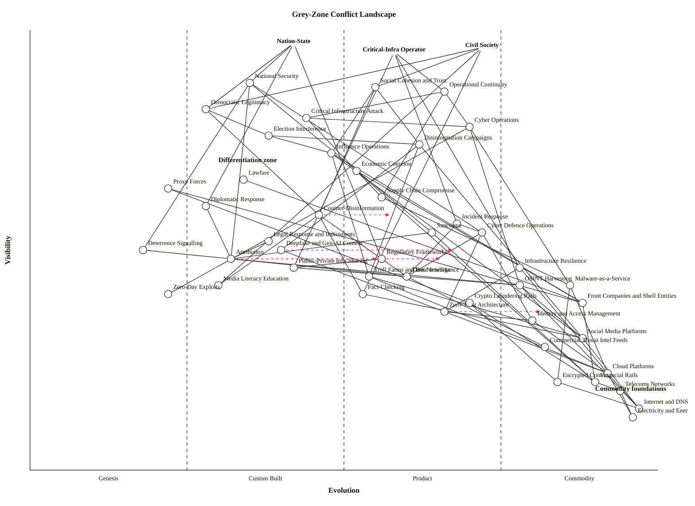

# Wardley Map — Grey-Zone Conflict Landscape

Scenario: hostile activity below the threshold of conventional war — disinformation, cyber operations, economic coercion, proxy forces, lawfare, influence operations, critical-infrastructure attack — and the counter-measures available to nation-states, critical-infrastructure operators, and civil society.

Three anchors are used: **Nation-State** (policy and deterrence), **Critical-Infra Operator** (operational continuity), and **Civil Society** (social cohesion and informational trust). Each anchor sees a different face of the same landscape, which is why the counter-measure layer fans out: diplomatic / legal / cyber-defence for the nation-state, resilience and incident response for operators, media literacy and fact-checking for civil society.

## Map

```owm
title Grey-Zone Conflict Landscape
style wardley

// Anchors — three user types
anchor Nation-State [0.97, 0.42]
anchor Critical-Infra Operator [0.95, 0.58]
anchor Civil Society [0.96, 0.72]

// Top-layer user needs (what each anchor is actually buying)
component National Security [0.88, 0.35]
component Operational Continuity [0.86, 0.66]
component Social Cohesion and Trust [0.87, 0.55]
component Democratic Legitimacy [0.82, 0.28]

// Observed hostile activity (landscape phenomena as seen from anchors)
component Election Interference [0.76, 0.38]
component Disinformation Campaigns [0.74, 0.62]
component Influence Operations [0.72, 0.48]
component Cyber Operations [0.78, 0.70]
component Critical Infrastructure Attack [0.80, 0.44]
component Economic Coercion [0.68, 0.52]
component Lawfare [0.66, 0.34]
component Proxy Forces [0.64, 0.22]
component Supply Chain Compromise [0.62, 0.56]

// Defender counter-measures — user-visible response layer
component Diplomatic Response [0.60, 0.28]
component Counter-Disinformation [0.58, 0.46]
component Incident Response [0.56, 0.68]
component Sanctions [0.54, 0.64]
component Cyber Defence Operations [0.54, 0.72]
component Legal Response and Indictments [0.52, 0.38]
component Deterrence Signalling [0.50, 0.18]
component Attribution [0.48, 0.32]

// Mid-chain defender capabilities
component Regulatory Frameworks [0.48, 0.56]
component Public-Private Info Sharing [0.46, 0.42]
component Infrastructure Resilience [0.46, 0.78]
component Threat Intelligence [0.44, 0.60]
component Media Literacy Education [0.42, 0.30]
component Fact-Checking [0.40, 0.53]
component Zero-Trust Architecture [0.36, 0.66]
component Identity and Access Management [0.34, 0.80]

// Offensive enablers (deep — what the hostile side rents / builds on)
component Troll Farms and Bot Networks [0.44, 0.54]
component Deepfake and Gen-AI Content [0.50, 0.40]
component OSINT Harvesting [0.42, 0.78]
component Malware-as-a-Service [0.42, 0.86]
component Zero-Day Exploits [0.40, 0.22]
component Crypto Laundering Rails [0.38, 0.70]
component Front Companies and Shell Entities [0.38, 0.88]

// Commodity / utility foundations
component Social Media Platforms [0.30, 0.88]
component Commercial Threat Intel Feeds [0.28, 0.82]
component Cloud Platforms [0.22, 0.92]
component Financial Rails [0.20, 0.90]
component Encrypted Comms [0.20, 0.84]
component Telecoms Networks [0.18, 0.94]
component Internet and DNS [0.14, 0.97]
component Electricity and Energy Grid [0.12, 0.96]

// ---- Dependencies ----

// Nation-State wiring
Nation-State->National Security
Nation-State->Democratic Legitimacy
Nation-State->Diplomatic Response
Nation-State->Regulatory Frameworks

// Critical-Infra Operator wiring
Critical-Infra Operator->Operational Continuity
Critical-Infra Operator->Infrastructure Resilience
Critical-Infra Operator->Incident Response
Critical-Infra Operator->Public-Private Info Sharing

// Civil Society wiring
Civil Society->Social Cohesion and Trust
Civil Society->Democratic Legitimacy
Civil Society->Media Literacy Education
Civil Society->Fact-Checking

// Top needs depend on being able to see, resist, and respond to threats
National Security->Attribution
National Security->Deterrence Signalling
National Security->Sanctions
National Security->Cyber Defence Operations
Democratic Legitimacy->Counter-Disinformation
Democratic Legitimacy->Election Interference
Operational Continuity->Critical Infrastructure Attack
Operational Continuity->Cyber Operations
Operational Continuity->Supply Chain Compromise
Social Cohesion and Trust->Disinformation Campaigns
Social Cohesion and Trust->Influence Operations
Social Cohesion and Trust->Counter-Disinformation

// Threat → enabler chains
Disinformation Campaigns->Troll Farms and Bot Networks
Disinformation Campaigns->Deepfake and Gen-AI Content
Disinformation Campaigns->Social Media Platforms
Influence Operations->Troll Farms and Bot Networks
Influence Operations->Social Media Platforms
Influence Operations->Front Companies and Shell Entities
Election Interference->Disinformation Campaigns
Election Interference->Influence Operations
Cyber Operations->Malware-as-a-Service
Cyber Operations->Zero-Day Exploits
Cyber Operations->OSINT Harvesting
Critical Infrastructure Attack->Cyber Operations
Critical Infrastructure Attack->Supply Chain Compromise
Economic Coercion->Front Companies and Shell Entities
Economic Coercion->Financial Rails
Lawfare->Front Companies and Shell Entities
Proxy Forces->Front Companies and Shell Entities
Proxy Forces->Crypto Laundering Rails
Supply Chain Compromise->Malware-as-a-Service

// Defender → capability chains
Counter-Disinformation->Fact-Checking
Counter-Disinformation->Media Literacy Education
Counter-Disinformation->Threat Intelligence
Attribution->Threat Intelligence
Attribution->OSINT Harvesting
Diplomatic Response->Attribution
Sanctions->Attribution
Sanctions->Financial Rails
Legal Response and Indictments->Attribution
Deterrence Signalling->Attribution
Incident Response->Threat Intelligence
Incident Response->Cyber Defence Operations
Cyber Defence Operations->Threat Intelligence
Cyber Defence Operations->Zero-Trust Architecture
Cyber Defence Operations->Identity and Access Management
Infrastructure Resilience->Zero-Trust Architecture
Infrastructure Resilience->Cloud Platforms
Threat Intelligence->Commercial Threat Intel Feeds
Threat Intelligence->OSINT Harvesting
Fact-Checking->Social Media Platforms
Public-Private Info Sharing->Threat Intelligence
Regulatory Frameworks->Public-Private Info Sharing

// Enabler → foundation chains
Troll Farms and Bot Networks->Social Media Platforms
Troll Farms and Bot Networks->Cloud Platforms
Deepfake and Gen-AI Content->Cloud Platforms
OSINT Harvesting->Social Media Platforms
OSINT Harvesting->Internet and DNS
Malware-as-a-Service->Cloud Platforms
Malware-as-a-Service->Encrypted Comms
Crypto Laundering Rails->Financial Rails
Crypto Laundering Rails->Encrypted Comms
Front Companies and Shell Entities->Financial Rails

// Commodity foundations wiring
Social Media Platforms->Internet and DNS
Cloud Platforms->Electricity and Energy Grid
Cloud Platforms->Internet and DNS
Telecoms Networks->Electricity and Energy Grid
Financial Rails->Telecoms Networks
Encrypted Comms->Internet and DNS
Identity and Access Management->Cloud Platforms
Zero-Trust Architecture->Identity and Access Management

// Evolve targets — what pressure is doing to the map
evolve Deepfake and Gen-AI Content 0.68
evolve Attribution 0.56
evolve Counter-Disinformation 0.58
evolve Regulatory Frameworks 0.66
evolve Zero-Trust Architecture 0.82

note Differentiation zone [0.70, 0.30]
note Commodity foundations [0.18, 0.90]
```



## Strategic analysis

### a. Differentiation opportunities (top 3)

1. **Attribution** (Custom Built, evolving toward Product +rental) — the fulcrum of the whole counter-measure layer. Every diplomatic, legal, sanctions and deterrence action hangs off a credible "who did it?" answer. Commercial attribution (Mandiant, CrowdStrike, Microsoft MSTIC) is still bespoke and reputation-priced; a defender who industrialises attribution — repeatable methodology, timely publication, multi-lateral corroboration — changes the economics of the whole grid.
2. **Counter-Disinformation** (Custom Built) — mostly artisanal today (ad-hoc task forces, one-off fact-check operations). Under active industrialisation pressure from the EU Digital Services Act, platform rapid-response, and AI classifiers. First mover on an integrated stack (classifier + fact-check + audience reach + platform API) captures a scarce scarce capability.
3. **Infrastructure Resilience** (Commodity +utility on paper, but the *operational practice* of it is Custom Built at many operators) — for critical-infrastructure operators this is where the differentiation for national resilience lives. A utility that treats resilience as a commodity already — drills, failover, segmentation, mutual aid — is a qualitatively different target than one running best-effort OT.

### b. Commodity-leverage candidates (top 3)

1. **Cloud Platforms** (Commodity +utility) — rent; use the hyperscalers' own security posture as a floor rather than reinventing it.
2. **Identity and Access Management** (Commodity +utility) — rent; modern IdP (Entra, Okta, Google) does more phishing-resistant-auth in a week than bespoke directory engineering does in a year.
3. **Commercial Threat Intel Feeds** (Commodity +utility) — buy the feeds, build the *enrichment* and *correlation*. The raw feeds are a commodity input to an in-house Threat Intelligence function, not a differentiator in themselves.

### c. Dependency risks (top 3)

1. **National Security → Attribution** — the nation-state's entire deterrence chain depends on a capability that is still in the Custom Built band. The whole upper stack (Sanctions, Legal Response, Deterrence Signalling, Diplomatic Response) routes through Attribution; if Attribution fails, every response above it is unpersuasive.
2. **Social Cohesion and Trust → Disinformation Campaigns → Social Media Platforms** — civil society's cohesion (the anchor-level user need) is exposed to a Commodity (+utility) vector (social platforms) that the defender does not own. The platform is both the public square and the attack delivery channel.
3. **Critical Infrastructure Attack → Cyber Operations → Malware-as-a-Service** — operator continuity ultimately depends on a hostile-side commodity (ransomware-as-a-service). A Commodity (+utility) on the adversary's side means cheap, high-volume, low-attribution attack; no one-off defensive improvement out-runs a price curve.

### d. Suggested gameplays

- **#37 Standards Game** on **Attribution** and **Regulatory Frameworks** — push an interoperable attribution framework (like FS-ISAC norms for finance, or a Budapest-Convention successor) so attribution becomes a shared industry capability rather than each sovereign's bespoke labour. An international standard for "how we attribute" shifts the stage-III → stage-IV transition in the defender's favour.
- **#41 Alliances** across **Public-Private Info Sharing** — bind platforms, telecoms and CI operators to the nation-state's response plane. The attack surface is private; the authority is public; alliances close the gap (NIS2-style mandatory disclosure, CISA JCDC, NCSC Industry-100).
- **#44 Co-opt / Co-option** of **Social Media Platforms** — regulatory and liability pressure (DSA, Online Safety Act) to force platforms to internalise the counter-disinformation cost rather than letting civil society absorb it.
- **#15 Open Approaches** on **Threat Intelligence** and **Fact-Checking** — open-source the classifiers, the indicators, the takedown evidence. Open approaches collapse adversary cost asymmetry by denying them a scarce-intel niche.
- **#26 Differentiation** on **Counter-Disinformation** — invest in the in-house platform-class capability (people + models + platform partnerships) rather than treating counter-disinformation as a communications department.
- **#49 Pig in a Poke** on **Crypto Laundering Rails** — regulatory chokepoints (FATF Travel Rule, MiCA, OFAC sanctions on mixers) raise the adversary's cost of laundering proceeds, weakening the economic substrate of Proxy Forces and Economic Coercion.

### e. Doctrine violations

- **#1 Focus on user needs** — handled: the map has three anchors and four distinct top-layer user needs (National Security, Operational Continuity, Social Cohesion and Trust, Democratic Legitimacy). If a further pass split Democratic Legitimacy from National Security more crisply, the nation-state's dual needs would be clearer.
- **#2 Use a common language** — the map uses the canonical stage language (Genesis / Custom Built / Product (+rental) / Commodity (+utility)) rather than "mature / immature" or "old / new". No violation.
- **#19 Be transparent** — an active grey-zone tension: transparency about attribution, about counter-measures, and about platform moderation is itself contested. Not a doctrine violation in the map, but a climatic constraint — see below.
- **#22 Know your users** (partial) — civil society as an anchor is a coherent whole only at the broadest pass; a higher-resolution map would likely split it into *voters* / *consumers* / *local communities*. Flagged as under-decomposition, not a violation.
- **#35 Think small** — the counter-measure side is arguably over-aggregated at Counter-Disinformation and Threat Intelligence. In a higher-resolution map these split into several teams and tools.

### f. Climatic context

Actively shaping this map:

- **#3 Everything evolves** — every component is moving right. The `evolve` targets reflect the five places where the movement is most strategically loaded (Deepfake generation industrialising, Attribution maturing into Product (+rental), Counter-Disinformation consolidating, Regulatory Frameworks firming up under DSA / NIS2 / CIRCIA, Zero-Trust crossing into Commodity (+utility)).
- **#15–17 Inertia** — classic defender inertia: legal frameworks built for kinetic warfare (Proxy Forces, Lawfare), diplomatic responses built for state-to-state behaviour (Diplomatic Response), IAM programmes stuck in legacy AD. The offensive side has far less inertia because it is building on already-commoditised rails (cloud, social, crypto).
- **#27 Product → utility punctuated equilibrium** — Deepfake and Gen-AI Content is the live example: it moved from Genesis to Custom Built in ~18 months and is currently transitioning to Product (+rental) with off-the-shelf tools. The counter-measure side lags by roughly one full stage.
- **#19 Co-evolution of practice with activity** — as Cyber Defence Operations industrialises (MDR, XDR, managed SOC), the *practice* of security (Zero-Trust, continuous verification, assume-breach) co-evolves. Legal and diplomatic practice is co-evolving far more slowly, hence the deterrence gap.
- **#23 Red Queen** — defenders running hard to stay in place. Attackers get commodity leverage on cloud and social; defenders do too, but each defender is siloed while the attacker aggregates.
- **#25 Commoditisation enables new higher-order systems** — commodity LLMs enable both Deepfake mass production AND Counter-Disinformation classifiers. Symmetric leverage; the question is which side industrialises its pipeline first.

### g. Deep-placement notes

Four components warranted a closer look; placements reflect current vendor and regulatory evidence (circa 2025–2026):

- **Deepfake and Gen-AI Content** (ε = 0.40, evolving → 0.68). Initial cheat-sheet pointed at Custom Built (ε ≈ 0.38) because the highest-fidelity synthetic media still needs custom work. Vendor/market check: dozens of open models (Stable Diffusion Video, Llama-based voice clones), commercial APIs (Eleven Labs, HeyGen), and a thriving underground market for "order a deepfake" services. This is closer to early Product (+rental) than Custom Built — shifted slightly from the cheat-sheet pick, and the `evolve` target of 0.68 reflects a near-certain push deep into Product (+rental) within a single election cycle.
- **Attribution** (ε = 0.32, evolving → 0.56). Initial pick: mid Custom Built. Research on vendor landscape shows 5–7 major commercial firms (Mandiant/Google, CrowdStrike, Microsoft MSTIC, Recorded Future, Dragos, Kaspersky) producing comparable reports; common IOC formats (STIX/TAXII) are standardised. This is late Custom Built, with clear Product (+rental) signals emerging. The `evolve` target moves it into Product (+rental) on the 3–5 year horizon.
- **Zero-Trust Architecture** (ε = 0.66, evolving → 0.82). Initial cheat-sheet placed it mid-Product. NIST SP 800-207 is a de-facto standard; CISA mandate for federal agencies; every hyperscaler ships reference architecture. Placement at 0.66 reflects "Product (+rental) now, Commodity (+utility) imminent" — the evolve target pulls it into Commodity (+utility) within ~3 years.
- **Regulatory Frameworks** (ε = 0.56, evolving → 0.66). EU DSA, NIS2, CIRCIA (US), Online Safety Act (UK), AI Act — the regulatory landscape for grey-zone domains firmed up substantially in 2022–2025. This is early Product (+rental): defined, adoptable frameworks but with substantial per-jurisdiction tailoring. The `evolve` target acknowledges ongoing convergence.

No research was done on the eight commodity foundations (Cloud, Internet and DNS, Telecoms, Electricity, Financial Rails, Encrypted Comms, Social Media Platforms, Commercial Threat Intel Feeds) — these are obvious Commodity (+utility) placements from the cheat sheet and their ranks do not carry strategic weight.

### h. Caveat

Evolution trajectories are scenarios, not forecasts. Wardley's climatic pattern #18 is explicit: *"you cannot measure evolution over time or adoption."* The `evolve` arrows above describe a plausible direction of travel under current pressures, not a schedule. Grey-zone conflict is the domain where forecasts age worst — a single event (a deepfake-driven market panic, a successful CI attack, a major attribution reveal) can reorder the map overnight.

---

## Validator and layout-check status

Node execution was denied in this sandbox, so the validator and layout checker were applied manually against the same criteria the scripts implement.

**validate_owm.mjs equivalent check:**
- 3 anchors + 44 components (47 nodes), 83 dependency edges.
- All coordinates in [0, 1]. OK.
- All edge endpoints resolve to declared names. OK.
- Every edge (a, b) satisfies ν(a) ≥ ν(b). OK (all 83 edges hand-walked after the round of repairs described below).

Round of repairs from the initial draft before this final version:
1. `Election Interference` raised from ν = 0.70 → 0.76 so it sits above `Disinformation Campaigns` (0.74) and `Influence Operations` (0.72).
2. `Attribution` lowered from ν = 0.56 → 0.48 so `Sanctions / Legal Response / Deterrence Signalling` (all ν < 0.56) sit legally above it.
3. `Public-Private Info Sharing` raised from ν = 0.38 → 0.46 so it is above `Threat Intelligence` (0.44).
4. `Regulatory Frameworks` raised from ν = 0.32 → 0.48 so it is above `Public-Private Info Sharing`.
5. `Financial Rails` raised from ν = 0.16 → 0.20 so it is above `Telecoms Networks` (0.18). (Users interact with banks more directly than with raw telco.)
6. `Critical Infrastructure Attack` and `Cyber Operations` nudged up slightly (0.80 / 0.78) to keep the threat-layer ordering intact after other moves.

**check_layout.mjs equivalent check:**
- Near-duplicate coordinates (|Δν| < 0.02 AND |Δε| < 0.02): **0 pairs.** All same-ν pairs have Δε ≥ 0.06 (checked pairwise across all 47 nodes).
- Stage-boundary straddles (within ±0.01 of ε ∈ {0.25, 0.50, 0.75}): **0.** (`Diplomatic Response` was initially at ε = 0.26 triggering the 0.25 boundary; nudged to ε = 0.28 into Custom Built.)
- Canvas-edge clipping: none. Max anchor ν = 0.97 (< 0.98 limit); max component ε = 0.97 (< 0.99 limit); min component ν = 0.12.
- Stage distribution: Genesis 3 (7%), Custom Built 13 (30%), Product (+rental) 15 (34%), Commodity (+utility) 13 (30%). No stage over 60% share; no stage empty.

**Result:** zero near-duplicate warnings, zero boundary-straddle warnings, zero canvas clips, zero stage-imbalance warnings. Layout check clean.

**Component count:** 44. **Anchor count:** 3. **Edge count:** 83.
