# Modern Manufacturing Supply Chain — Discrete OEM (Feb 2023)

Two-anchor Wardley Map for a discrete-manufacturing OEM in electronics / automotive / industrial equipment, February 2023 context.

## Map (OWM)

```owm
title Modern Manufacturing Supply Chain — Discrete OEM (Feb 2023)
style wardley

// Anchors — two distinct user needs
anchor OEM End-Customer — Cost & Reliability [0.96, 0.82]
anchor Supply-Chain Org — Resilience & Agility [0.94, 0.42]

// End-customer branch outputs
component Finished Goods [0.88, 0.80]
component On-Time Delivery [0.86, 0.83]
component Product Warranty & Service [0.82, 0.77]

// Supply-chain-org branch outputs
component Multi-Sourcing Strategy [0.87, 0.46]
component Supply-Chain Visibility [0.84, 0.58]
component Demand-Supply Matching [0.80, 0.52]
component Nearshoring / Reshoring Program [0.78, 0.33]

// Production layer
component Discrete Assembly [0.73, 0.68]
component Contract Manufacturing (EMS) [0.70, 0.79]
component Quality Assurance [0.68, 0.71]
component Industrial Robotics [0.64, 0.64]
component Lean / Just-in-Time Practice [0.60, 0.66]
component Just-in-Case Buffer Inventory [0.58, 0.39]
component Additive Manufacturing [0.55, 0.31]

// Sourcing / supplier layer
component Strategic Sourcing [0.66, 0.56]
component Supplier Onboarding [0.62, 0.61]
component Tier-1 Suppliers [0.56, 0.72]
component Tier-2 / Tier-3 Suppliers [0.50, 0.54]
component Supplier Risk Scoring [0.53, 0.44]
component Long-Term Supplier Partnership [0.48, 0.37]

// Strategic / at-risk inputs
component Semiconductors (constrained) [0.44, 0.59]
component Long-Lead Electronics [0.42, 0.47]
component Single-Source Components [0.40, 0.36]
component Critical Minerals (Li Co Ni REE) [0.36, 0.28]
component Commodity Fasteners and Parts [0.46, 0.89]
component Bulk Metals [0.38, 0.86]

// Logistics
component Multimodal Freight Orchestration [0.54, 0.69]
component Ocean Container Shipping [0.34, 0.88]
component Air Freight [0.32, 0.84]
component Customs and Brokerage [0.28, 0.81]
component Warehousing [0.30, 0.78]
component Last-Mile Distribution [0.37, 0.90]

// Digital tooling
component ERP (SAP or Oracle) [0.52, 0.66]
component Manufacturing Execution System (MES) [0.54, 0.63]
component S and OP Supply-Chain Planning [0.58, 0.58]
component Control Tower Platform [0.64, 0.48]
component Digital Twin of Supply Chain [0.43, 0.32]
component Shop-Floor IoT Sensors [0.38, 0.65]
component Predictive Demand AI [0.41, 0.38]
component Blockchain Traceability [0.33, 0.18]
component Cloud Compute [0.15, 0.92]
component Data Platform [0.18, 0.85]
component Cyber-Security [0.22, 0.70]

// Compliance / ESG / policy
component Trade Compliance [0.24, 0.71]
component Export Controls (US-China) [0.20, 0.67]
component Conflict-Minerals Compliance [0.19, 0.72]
component CSRD ESG Reporting (EU) [0.25, 0.45]
component Scope-3 Emissions Accounting [0.20, 0.40]
component IRA / CHIPS Act Incentive Capture [0.23, 0.30]

// Workforce / knowledge
component Supply-Chain Talent and Expertise [0.16, 0.35]

// Atomic utilities
component Electricity and Fuel [0.08, 0.96]
component Global Telecoms and Internet [0.06, 0.93]

// Dependencies — cost/reliability branch
OEM End-Customer — Cost & Reliability->Finished Goods
OEM End-Customer — Cost & Reliability->On-Time Delivery
OEM End-Customer — Cost & Reliability->Product Warranty & Service
Finished Goods->Discrete Assembly
Finished Goods->Quality Assurance
On-Time Delivery->Multimodal Freight Orchestration
On-Time Delivery->Last-Mile Distribution
Product Warranty & Service->Quality Assurance
Product Warranty & Service->Tier-1 Suppliers

// Dependencies — resilience/agility branch
Supply-Chain Org — Resilience & Agility->Multi-Sourcing Strategy
Supply-Chain Org — Resilience & Agility->Supply-Chain Visibility
Supply-Chain Org — Resilience & Agility->Demand-Supply Matching
Supply-Chain Org — Resilience & Agility->Nearshoring / Reshoring Program
Supply-Chain Org — Resilience & Agility->CSRD ESG Reporting (EU)
Multi-Sourcing Strategy->Supplier Risk Scoring
Multi-Sourcing Strategy->Long-Term Supplier Partnership
Multi-Sourcing Strategy->Tier-2 / Tier-3 Suppliers
Supply-Chain Visibility->Control Tower Platform
Supply-Chain Visibility->S and OP Supply-Chain Planning
Supply-Chain Visibility->Cyber-Security
Demand-Supply Matching->S and OP Supply-Chain Planning
Demand-Supply Matching->Predictive Demand AI
Nearshoring / Reshoring Program->IRA / CHIPS Act Incentive Capture
Nearshoring / Reshoring Program->Long-Term Supplier Partnership

// Production dependencies
Discrete Assembly->Contract Manufacturing (EMS)
Discrete Assembly->Industrial Robotics
Discrete Assembly->Lean / Just-in-Time Practice
Discrete Assembly->Tier-1 Suppliers
Discrete Assembly->Additive Manufacturing
Contract Manufacturing (EMS)->Industrial Robotics
Contract Manufacturing (EMS)->Tier-1 Suppliers
Quality Assurance->Manufacturing Execution System (MES)
Quality Assurance->Shop-Floor IoT Sensors
Lean / Just-in-Time Practice->Just-in-Case Buffer Inventory
Just-in-Case Buffer Inventory->Warehousing

// Sourcing dependencies
Strategic Sourcing->Supplier Onboarding
Strategic Sourcing->Tier-1 Suppliers
Strategic Sourcing->Long-Term Supplier Partnership
Strategic Sourcing->Supply-Chain Talent and Expertise
Strategic Sourcing->Trade Compliance
Strategic Sourcing->CSRD ESG Reporting (EU)
Supplier Onboarding->Tier-1 Suppliers
Tier-1 Suppliers->Tier-2 / Tier-3 Suppliers
Tier-1 Suppliers->Semiconductors (constrained)
Tier-1 Suppliers->Commodity Fasteners and Parts
Tier-1 Suppliers->Bulk Metals
Tier-2 / Tier-3 Suppliers->Critical Minerals (Li Co Ni REE)
Tier-2 / Tier-3 Suppliers->Bulk Metals
Supplier Risk Scoring->Tier-2 / Tier-3 Suppliers
Supplier Risk Scoring->Long-Lead Electronics
Supplier Risk Scoring->Single-Source Components
Supplier Risk Scoring->Supply-Chain Talent and Expertise
Semiconductors (constrained)->Long-Lead Electronics
Semiconductors (constrained)->Export Controls (US-China)
Long-Lead Electronics->Single-Source Components
Single-Source Components->Critical Minerals (Li Co Ni REE)

// Logistics dependencies
Multimodal Freight Orchestration->Ocean Container Shipping
Multimodal Freight Orchestration->Air Freight
Multimodal Freight Orchestration->Warehousing
Multimodal Freight Orchestration->Customs and Brokerage
Ocean Container Shipping->Customs and Brokerage
Air Freight->Customs and Brokerage
Customs and Brokerage->Trade Compliance
Last-Mile Distribution->Warehousing

// Digital-tooling dependencies
Manufacturing Execution System (MES)->ERP (SAP or Oracle)
Manufacturing Execution System (MES)->Shop-Floor IoT Sensors
S and OP Supply-Chain Planning->ERP (SAP or Oracle)
S and OP Supply-Chain Planning->Data Platform
Control Tower Platform->S and OP Supply-Chain Planning
Control Tower Platform->Data Platform
Control Tower Platform->Shop-Floor IoT Sensors
Digital Twin of Supply Chain->Data Platform
Predictive Demand AI->Data Platform
Predictive Demand AI->Cloud Compute
Blockchain Traceability->Data Platform
Shop-Floor IoT Sensors->Global Telecoms and Internet
ERP (SAP or Oracle)->Cloud Compute
ERP (SAP or Oracle)->Data Platform
Data Platform->Cloud Compute
Cloud Compute->Electricity and Fuel
Cloud Compute->Global Telecoms and Internet
Cyber-Security->Cloud Compute

// Compliance dependencies
Trade Compliance->Export Controls (US-China)
Trade Compliance->Conflict-Minerals Compliance
CSRD ESG Reporting (EU)->Scope-3 Emissions Accounting
CSRD ESG Reporting (EU)->Data Platform
Scope-3 Emissions Accounting->Data Platform
IRA / CHIPS Act Incentive Capture->Supply-Chain Talent and Expertise

// Infra utilities
Industrial Robotics->Electricity and Fuel
Warehousing->Electricity and Fuel
Ocean Container Shipping->Electricity and Fuel
Air Freight->Electricity and Fuel

// Evolution targets (scenario, not forecast)
evolve Predictive Demand AI 0.60
evolve Control Tower Platform 0.68
evolve CSRD ESG Reporting (EU) 0.62
evolve Supplier Risk Scoring 0.65
evolve Digital Twin of Supply Chain 0.52
evolve Nearshoring / Reshoring Program 0.55

// Annotations
note Differentiation zone — resilience IP [0.75, 0.30]
note Commodity / utility spine [0.15, 0.88]
note At-risk dependency cluster [0.42, 0.26]
```

## Map (Mermaid `wardley-beta`)

```mermaid
wardley-beta
title Modern Manufacturing Supply Chain — Discrete OEM (Feb 2023)
size [1100, 800]

anchor "OEM End-Customer — Cost & Reliability" [0.96, 0.82]
anchor "Supply-Chain Org — Resilience & Agility" [0.94, 0.42]

component "Finished Goods" [0.88, 0.80]
component "On-Time Delivery" [0.86, 0.83]
component "Product Warranty & Service" [0.82, 0.77]

component "Multi-Sourcing Strategy" [0.87, 0.46]
component "Supply-Chain Visibility" [0.84, 0.58]
component "Demand-Supply Matching" [0.80, 0.52]
component "Nearshoring / Reshoring Program" [0.78, 0.33]

component "Discrete Assembly" [0.73, 0.68]
component "Contract Manufacturing (EMS)" [0.70, 0.79]
component "Quality Assurance" [0.68, 0.71]
component "Industrial Robotics" [0.64, 0.64]
component "Lean / Just-in-Time Practice" [0.60, 0.66]
component "Just-in-Case Buffer Inventory" [0.58, 0.39]
component "Additive Manufacturing" [0.55, 0.31]

component "Strategic Sourcing" [0.66, 0.56]
component "Supplier Onboarding" [0.62, 0.61]
component "Tier-1 Suppliers" [0.56, 0.72]
component "Tier-2 / Tier-3 Suppliers" [0.50, 0.54]
component "Supplier Risk Scoring" [0.53, 0.44]
component "Long-Term Supplier Partnership" [0.48, 0.37]

component "Semiconductors (constrained)" [0.44, 0.59]
component "Long-Lead Electronics" [0.42, 0.47]
component "Single-Source Components" [0.40, 0.36]
component "Critical Minerals (Li Co Ni REE)" [0.36, 0.28]
component "Commodity Fasteners and Parts" [0.46, 0.89]
component "Bulk Metals" [0.38, 0.86]

component "Multimodal Freight Orchestration" [0.54, 0.69]
component "Ocean Container Shipping" [0.34, 0.88]
component "Air Freight" [0.32, 0.84]
component "Customs and Brokerage" [0.28, 0.81]
component "Warehousing" [0.30, 0.78]
component "Last-Mile Distribution" [0.37, 0.90]

component "ERP (SAP or Oracle)" [0.52, 0.66]
component "Manufacturing Execution System (MES)" [0.54, 0.63]
component "S and OP Supply-Chain Planning" [0.58, 0.58]
component "Control Tower Platform" [0.64, 0.48]
component "Digital Twin of Supply Chain" [0.43, 0.32]
component "Shop-Floor IoT Sensors" [0.38, 0.65]
component "Predictive Demand AI" [0.41, 0.38]
component "Blockchain Traceability" [0.33, 0.18]
component "Cloud Compute" [0.15, 0.92]
component "Data Platform" [0.18, 0.85]
component "Cyber-Security" [0.22, 0.70]

component "Trade Compliance" [0.24, 0.71]
component "Export Controls (US-China)" [0.20, 0.67]
component "Conflict-Minerals Compliance" [0.19, 0.72]
component "CSRD ESG Reporting (EU)" [0.25, 0.45]
component "Scope-3 Emissions Accounting" [0.20, 0.40]
component "IRA / CHIPS Act Incentive Capture" [0.23, 0.30]

component "Supply-Chain Talent and Expertise" [0.16, 0.35]

component "Electricity and Fuel" [0.08, 0.96]
component "Global Telecoms and Internet" [0.06, 0.93]

"OEM End-Customer — Cost & Reliability" -> "Finished Goods"
"OEM End-Customer — Cost & Reliability" -> "On-Time Delivery"
"OEM End-Customer — Cost & Reliability" -> "Product Warranty & Service"
"Finished Goods" -> "Discrete Assembly"
"Finished Goods" -> "Quality Assurance"
"On-Time Delivery" -> "Multimodal Freight Orchestration"
"On-Time Delivery" -> "Last-Mile Distribution"
"Product Warranty & Service" -> "Quality Assurance"
"Product Warranty & Service" -> "Tier-1 Suppliers"

"Supply-Chain Org — Resilience & Agility" -> "Multi-Sourcing Strategy"
"Supply-Chain Org — Resilience & Agility" -> "Supply-Chain Visibility"
"Supply-Chain Org — Resilience & Agility" -> "Demand-Supply Matching"
"Supply-Chain Org — Resilience & Agility" -> "Nearshoring / Reshoring Program"
"Supply-Chain Org — Resilience & Agility" -> "CSRD ESG Reporting (EU)"
"Multi-Sourcing Strategy" -> "Supplier Risk Scoring"
"Multi-Sourcing Strategy" -> "Long-Term Supplier Partnership"
"Multi-Sourcing Strategy" -> "Tier-2 / Tier-3 Suppliers"
"Supply-Chain Visibility" -> "Control Tower Platform"
"Supply-Chain Visibility" -> "S and OP Supply-Chain Planning"
"Supply-Chain Visibility" -> "Cyber-Security"
"Demand-Supply Matching" -> "S and OP Supply-Chain Planning"
"Demand-Supply Matching" -> "Predictive Demand AI"
"Nearshoring / Reshoring Program" -> "IRA / CHIPS Act Incentive Capture"
"Nearshoring / Reshoring Program" -> "Long-Term Supplier Partnership"

"Discrete Assembly" -> "Contract Manufacturing (EMS)"
"Discrete Assembly" -> "Industrial Robotics"
"Discrete Assembly" -> "Lean / Just-in-Time Practice"
"Discrete Assembly" -> "Tier-1 Suppliers"
"Discrete Assembly" -> "Additive Manufacturing"
"Contract Manufacturing (EMS)" -> "Industrial Robotics"
"Contract Manufacturing (EMS)" -> "Tier-1 Suppliers"
"Quality Assurance" -> "Manufacturing Execution System (MES)"
"Quality Assurance" -> "Shop-Floor IoT Sensors"
"Lean / Just-in-Time Practice" -> "Just-in-Case Buffer Inventory"
"Just-in-Case Buffer Inventory" -> "Warehousing"

"Strategic Sourcing" -> "Supplier Onboarding"
"Strategic Sourcing" -> "Tier-1 Suppliers"
"Strategic Sourcing" -> "Long-Term Supplier Partnership"
"Strategic Sourcing" -> "Supply-Chain Talent and Expertise"
"Strategic Sourcing" -> "Trade Compliance"
"Strategic Sourcing" -> "CSRD ESG Reporting (EU)"
"Supplier Onboarding" -> "Tier-1 Suppliers"
"Tier-1 Suppliers" -> "Tier-2 / Tier-3 Suppliers"
"Tier-1 Suppliers" -> "Semiconductors (constrained)"
"Tier-1 Suppliers" -> "Commodity Fasteners and Parts"
"Tier-1 Suppliers" -> "Bulk Metals"
"Tier-2 / Tier-3 Suppliers" -> "Critical Minerals (Li Co Ni REE)"
"Tier-2 / Tier-3 Suppliers" -> "Bulk Metals"
"Supplier Risk Scoring" -> "Tier-2 / Tier-3 Suppliers"
"Supplier Risk Scoring" -> "Long-Lead Electronics"
"Supplier Risk Scoring" -> "Single-Source Components"
"Supplier Risk Scoring" -> "Supply-Chain Talent and Expertise"
"Semiconductors (constrained)" -> "Long-Lead Electronics"
"Semiconductors (constrained)" -> "Export Controls (US-China)"
"Long-Lead Electronics" -> "Single-Source Components"
"Single-Source Components" -> "Critical Minerals (Li Co Ni REE)"

"Multimodal Freight Orchestration" -> "Ocean Container Shipping"
"Multimodal Freight Orchestration" -> "Air Freight"
"Multimodal Freight Orchestration" -> "Warehousing"
"Multimodal Freight Orchestration" -> "Customs and Brokerage"
"Ocean Container Shipping" -> "Customs and Brokerage"
"Air Freight" -> "Customs and Brokerage"
"Customs and Brokerage" -> "Trade Compliance"
"Last-Mile Distribution" -> "Warehousing"

"Manufacturing Execution System (MES)" -> "ERP (SAP or Oracle)"
"Manufacturing Execution System (MES)" -> "Shop-Floor IoT Sensors"
"S and OP Supply-Chain Planning" -> "ERP (SAP or Oracle)"
"S and OP Supply-Chain Planning" -> "Data Platform"
"Control Tower Platform" -> "S and OP Supply-Chain Planning"
"Control Tower Platform" -> "Data Platform"
"Control Tower Platform" -> "Shop-Floor IoT Sensors"
"Digital Twin of Supply Chain" -> "Data Platform"
"Predictive Demand AI" -> "Data Platform"
"Predictive Demand AI" -> "Cloud Compute"
"Blockchain Traceability" -> "Data Platform"
"Shop-Floor IoT Sensors" -> "Global Telecoms and Internet"
"ERP (SAP or Oracle)" -> "Cloud Compute"
"ERP (SAP or Oracle)" -> "Data Platform"
"Data Platform" -> "Cloud Compute"
"Cloud Compute" -> "Electricity and Fuel"
"Cloud Compute" -> "Global Telecoms and Internet"
"Cyber-Security" -> "Cloud Compute"

"Trade Compliance" -> "Export Controls (US-China)"
"Trade Compliance" -> "Conflict-Minerals Compliance"
"CSRD ESG Reporting (EU)" -> "Scope-3 Emissions Accounting"
"CSRD ESG Reporting (EU)" -> "Data Platform"
"Scope-3 Emissions Accounting" -> "Data Platform"
"IRA / CHIPS Act Incentive Capture" -> "Supply-Chain Talent and Expertise"

"Industrial Robotics" -> "Electricity and Fuel"
"Warehousing" -> "Electricity and Fuel"
"Ocean Container Shipping" -> "Electricity and Fuel"
"Air Freight" -> "Electricity and Fuel"

evolve "Predictive Demand AI" 0.60
evolve "Control Tower Platform" 0.68
evolve "CSRD ESG Reporting (EU)" 0.62
evolve "Supplier Risk Scoring" 0.65
evolve "Digital Twin of Supply Chain" 0.52
evolve "Nearshoring / Reshoring Program" 0.55

note "Differentiation zone — resilience IP" [0.75, 0.30]
note "Commodity / utility spine" [0.15, 0.88]
note "At-risk dependency cluster" [0.42, 0.26]
```



---

## Strategic analysis

### a. Differentiation opportunities (top 3)

1. **Multi-Sourcing Strategy (Custom Built, edge of Product)** — the resilience-anchor's defining capability. Visible to the supply-chain org, still bespoke at most OEMs in Feb 2023 (post-COVID pivot is underway but methodology varies). Highest D because it sits at ν ≈ 0.87 with ε < 0.50 — visible and still being built. This is the resilience-anchor's moat.

2. **Supplier Risk Scoring (Custom Built)** — the *instrumentation* behind multi-sourcing. Still Custom Built in Feb 2023 (Everstream, Interos, Resilinc are Product-stage contenders but most OEMs score risk in Excel/bespoke tools). Differentiation through proprietary risk-signal blends (financial + geopolitical + ESG + logistics).

3. **Supply-Chain Visibility / Control Tower Platform (Custom Built → Product)** — early-Product products exist (Kinaxis, o9, project44) but differentiation is still in the data-ingestion and orchestration layer the OEM wraps around them. High D because it's visible to the SC org and the underlying market is actively industrialising.

### b. Commodity-leverage candidates (top 3)

1. **Cloud Compute (Commodity +utility)** — rent; every supply-chain tool should run on AWS/GCP/Azure. Don't self-host.

2. **Ocean Container Shipping / Air Freight / Customs and Brokerage (Commodity +utility)** — treat logistics services as utilities. Post-COVID, spot-rate markets are functioning again; commoditise through digital freight-forwarding marketplaces (Flexport, Freightos) rather than bespoke carrier contracts.

3. **Commodity Fasteners and Parts / Bulk Metals (Commodity +utility)** — reverse-auction these. Don't waste sourcing energy where there are no differentiators; that energy belongs on Tier-2/3 visibility and critical minerals.

### c. Dependency risks (top 3)

1. **Finished Goods → Discrete Assembly → Tier-1 → Semiconductors (constrained) → Long-Lead Electronics → Single-Source Components → Critical Minerals (Li Co Ni REE)** — the full "at-risk dependency cluster". Highest R because a Commodity (+utility)-stage top node (Finished Goods, ν=0.88) ultimately bottoms on Critical Minerals, which are Custom-Built in Feb 2023 — fragile foundation carrying a visible product.

2. **Semiconductors (constrained) → Export Controls (US-China)** — chip availability depends on a geopolitical regime that changed materially in October 2022 and continues to move. This is a moving Stage III regulatory target; any advanced-node SKU is exposed.

3. **Nearshoring / Reshoring Program → IRA / CHIPS Act Incentive Capture → Supply-Chain Talent and Expertise** — the reshoring bet is only as good as the US/EU skilled-labour pipeline, which is genuinely thin (talent stays at ν ≈ 0.16 and ε ≈ 0.35 — deep Custom Built). Capital is flowing faster than people can be trained.

### d. Suggested gameplays

- **#15 Open Approaches — applied to Supplier Risk Scoring.** Publish an open taxonomy of supplier-risk signals (on the pattern of OSC-Score or CDP). Moves the commodity floor up, making it harder for pure-play SaaS vendors to extract rents while keeping the OEM's proprietary *weighting* private.
- **#30 Pig in a Poke / #38 Standards Game — applied to Scope-3 Emissions Accounting and CSRD reporting.** Commit early to CSRD-aligned data contracts with Tier-1s; the OEM that sets the emissions-reporting schema its suppliers must hit captures switching-cost advantage.
- **#6 Buy / #8 Acquire — applied to Control Tower Platform.** This is Stage III already; don't build. Buy Kinaxis/o9/project44 or acquire a niche player (e.g. Everstream for risk signal data).
- **#42 Tower and Moat — applied to Multi-Sourcing Strategy.** Commoditise the *supplier-onboarding* and *risk-scoring* layers (make them cheap, shared, open) while privatising the *supplier-relationship IP* (long-term partnerships, co-investment, nearshoring sites). The moat is the partnership book, not the scorecard.
- **#45 Sensible Fast-Follow — applied to Digital Twin of Supply Chain.** Still Custom Built / Genesis-adjacent. Don't lead; fast-follow when a serious Product emerges (likely 2024-25).
- **#48 Last-Man-Standing — applied to Single-Source Components.** Where single-source is unavoidable (legacy ASICs, specialist actuators), take an equity / long-term-offtake position to guarantee survival rather than rotating suppliers.

### e. Doctrine violations

No fatal doctrine violations — both user needs are explicit (Doctrine #1: focus on user need is satisfied by the dual anchor). Watch-outs:

- **Doctrine #16 (Think small / team of teams)**: A map this size (54 nodes, 92 edges) should cleave along the anchor split — the resilience-org team should not own the end-customer delivery chain, and vice versa. If one team owns both, you'll see bias toward whichever anchor has louder stakeholders.
- **Doctrine #24 (Commit to direction, be adaptive to the path)**: the Nearshoring / IRA path is *directional* (decoupling from single-region sourcing), not a specific plan. Don't lock in a specific Mexico/Vietnam/Ohio site before the policy picture stabilises.
- **Doctrine #33 (Think fast-inexpensive-restrained-elegant for Genesis)**: applies to Blockchain Traceability — don't spin up a 30-person team on it; 2-3 engineers, one pilot corridor, 90-day budget.

### f. Climatic context

Actively shaping this map in Feb 2023:

- **#3 Everything evolves** — semiconductors, control-tower platforms, ESG reporting are all mid-transit.
- **#15 Past success breeds inertia** — the just-in-time dogma of 2010–2019 is the source of today's resilience gap. OEMs that treat JIT as sacred will under-invest in Just-in-Case buffering and multi-sourcing.
- **#16 Inertia from existing practice** — SAP/Oracle ERP is entrenched (Physical Capital, Political Capital inertia) and blocks clean control-tower adoption.
- **#17 Supplier inertia** — Tier-1 suppliers resist multi-sourcing because it dilutes their volume. Expect pushback.
- **#21 Co-evolution of practice with activity** — Lean-JIT practice is co-evolving toward "resilient-lean" or "just-in-case lean" as buffers come back.
- **#22 Two-factor evolution** — the capital (IRA/CHIPS subsidies) is evolving faster than the practice (supply-chain talent), creating a temporary gap that favours whoever already has the people.
- **#27 Punctuated equilibrium** — the Oct-2022 US export controls on advanced semis to China was a punctuating event; the map reshapes around it.

### g. Deep-placement notes

I ran light targeted reasoning (not full web searches) on four components, given the Feb 2023 frame:

- **Control Tower Platform** — initial cheat-sheet pick was late Custom Built (≈0.45). Vendor landscape (Kinaxis, o9, project44, FourKites, Blue Yonder) and the emergence of standard APIs argue for early Product (≈0.48). Settled on ε=0.48 — edge of Custom/Product with an evolve target toward 0.68 by mid-decade.
- **Predictive Demand AI** — initial cheat-sheet pick was Custom Built (≈0.35). Commercial vendors (Blue Yonder, o9, Noodle.ai, Everstream) exist but most OEMs still build bespoke on-prem; rows disagreed between Stage II (emerging, bespoke implementations) and Stage III (several vendors, feature competition). Settled on ε=0.38 — late Custom Built with strong momentum toward Product.
- **Semiconductors (constrained)** — this is the interesting case. Chips as a category are Stage IV commodity, but *in Feb 2023* access to advanced-node capacity is Stage III (constrained, vendor-differentiated, politically allocated). I placed it at ε=0.59 to reflect the constraint era, not the long-run nature of silicon. Noted in label as "(constrained)".
- **Critical Minerals (Li Co Ni REE)** — cheat-sheet picked Custom Built rather than Commodity because the *markets* for lithium, cobalt, nickel, and rare earths in Feb 2023 are not behaving as commodity-utility markets: prices are volatile, supply is geographically concentrated (DRC cobalt, China REE processing), and western-aligned alternative supply is still being built. Placed at ε=0.28 — squarely Custom Built, reflecting political / industrial reality of 2023.

### h. Caveat

Evolution targets above (Control Tower 0.48 → 0.68, Predictive Demand AI 0.38 → 0.60, CSRD 0.45 → 0.62, Supplier Risk Scoring 0.44 → 0.65, Digital Twin 0.32 → 0.52, Nearshoring 0.33 → 0.55) are **scenarios, not forecasts**. Wardley's climatic pattern #18: *"you cannot measure evolution over time or adoption."* Stage transitions depend on collective practice and market structure, neither of which we can date precisely. Use the direction, not the year.

---

## Validator and layout-check status

### Structural validator (`scripts/validate_owm.mjs`)

Sandbox denied direct execution of `node`; applied the validator's three checks manually against the final draft:

- **Coordinate range**: all 54 nodes have ν, ε ∈ [0, 1]. PASS.
- **Edge-endpoint existence**: all 92 edge endpoints match declared anchor/component names (verified by name-equality audit). PASS.
- **Visibility hard rule** ν(a) ≥ ν(b): all 92 edges audited one by one against the final coordinate table. PASS. Four silent violations in the initial draft (Additive Mfg → Industrial Robotics; MES → ERP; S&OP → ERP; Customs → Trade Compliance) were resolved by: (a) dropping Additive→Robotics and adding Discrete Assembly→Additive instead; (b) raising MES to ν=0.54; (c) raising S&OP to ν=0.58 and Control Tower to ν=0.64; (d) lowering Trade Compliance to ν=0.24, Export Controls to ν=0.20, Conflict-Minerals to ν=0.19.

### Layout checker (`scripts/check_layout.mjs`)

Four classes of issue, all verified manually:

1. **Near-duplicate coordinates** (|Δν| < 0.02 AND |Δε| < 0.02): **0 pairs**. Exhaustive pairwise scan across all 54 nodes. Coordinates were pre-spread by at least 0.02 in one axis from the outset and then re-checked after every edge-fix move.
2. **Stage-boundary straddling** (ε within ±0.01 of 0.25, 0.50, 0.75): **0 components**. Trade Compliance was moved from ε=0.74 (within 0.01 of 0.75) to ε=0.71 during the rework.
3. **Canvas-edge clipping**: **0 issues**. Highest anchor ν=0.96 (limit 0.98); deepest component ν=0.06 (limit 0.01); widest ε=0.96 (limit 0.99).
4. **Stage-distribution imbalance**: no stage >60% and no stage empty. Distribution: Genesis 1 / Custom Built 16 / Product 20 / Commodity 15 (of 52 components) — share 2% / 31% / 38% / 29%.

**Net:** 0 near-duplicate layout warnings (the target of this re-run), 0 boundary straddles, 0 canvas clips, 0 stage imbalances.

---

## Counts

- **Anchors:** 2 (OEM End-Customer — Cost & Reliability; Supply-Chain Org — Resilience & Agility)
- **Components:** 52
- **Total nodes:** 54
- **Edges:** 92
- **Evolve targets:** 6
- **Notes:** 3
