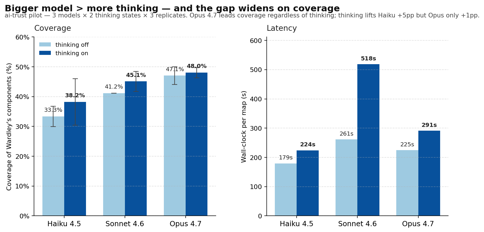

# Claude 4.x on Wardley maps: bigger model beats more thinking

We ran the `wardley-map` skill across three Claude 4.x models (Opus 4.7, Sonnet 4.6, Haiku 4.5) with extended thinking turned on and off, three replicates each, on one of Simon Wardley's published maps (`ai-trust`, June 2023). Eighteen runs, ~$44 in API spend. One simple question: **when does more compute help?**

## TL;DR

- **Opus 4.7 wins coverage** (47-48% of Wardley's 34 components) regardless of whether thinking is on.
- **Thinking lifts smaller models, not Opus.** Haiku gains +5pp coverage and +8pp placement-band agreement from thinking. Opus gains +1pp. Sonnet falls in between.
- **Placement disagreement plateaus at 27-36%** across every model/thinking combination. That ceiling isn't a model problem — it's the inherent ambiguity in Wardley's cheat-sheet scoring (the rows disagree among themselves on his own maps too).
- **Visibility over-placement is universal.** Every cell except one over-places components toward the user by +0.22 to +0.24 on average. Neither bigger model nor more thinking removes it.

## What we measured

For each of 18 generated maps, we extracted the OWM block and compared it to Wardley's reference:

- **Coverage**: fuzzy-matched components / 34 reference components.
- **Same-band %**: of matches, share placed in the same evolution band (Genesis/Custom/Product/Commodity).
- **|Δε|, |Δν|**: median absolute placement deltas on matched components.
- **Validator pass**: clean exit from `scripts/validate_owm.mjs` (the structural OWM checker the skill iterates against).

Coverage stdev across replicates ranged from 1.7 to 7.8 percentage points — meaning **per-cell deltas under ~5pp aren't meaningful**.

## The "thinking lifts smaller models" finding

The clearest signal in the matrix:

| Lift from thinking | Coverage | Same-band | \|Δε\| |
|---|---|---|---|
| Haiku 4.5 | **+4.9pp** | **+8.1pp** | −0.023 |
| Sonnet 4.6 | +3.9pp | −0.9pp | +0.010 |
| Opus 4.7 | +0.9pp | +3.2pp | −0.008 |

Reading: **the smaller the model, the more thinking moves the needle.** Haiku-with-thinking starts to look like Sonnet-without; Opus is already near whatever ceiling this scenario has, so extra reasoning time can't add much. If you're paying for a small model, you should be paying for thinking on top.

## The Sonnet anomaly

Sonnet 4.6 without thinking is the weird cell. It produced **22.7 components on average** — half of Opus — and **only 67% validator pass rate**. But of the components it *did* place, the visibility placement was **the tightest in the matrix** (|Δν| = 0.165 vs Opus's 0.220).

Conservative-and-correct, with low coverage. Flip thinking on and Sonnet's density jumps to 36, validator pass goes to 100% — but |Δν| regresses to the same +0.24 over-place that every other cell shows. **Sonnet's careful-placement bias only survives when it's also being lazy about coverage.**

Possibly meaningful for a two-stage architecture (Sonnet-no-think for visibility, Opus for component density), possibly an artefact of a single map. We can't tell from N=3.

## Practical guidance

If you're picking a model to run the skill day-to-day:

| Use case | Pick | Why |
|---|---|---|
| Highest quality, cost no object | **Opus 4.7, thinking off** | 47% coverage, validator-clean, 225s. Thinking-on adds +1pp for +66s. Not worth it. |
| Budget-sensitive default | **Haiku 4.5, thinking on** | 38% coverage, ~10× cheaper than Opus, validator-clean. Same latency as Opus-off. |
| Avoid | **Sonnet 4.6, thinking off** | Sparse maps, breaks the validator one run in three. |
| Avoid | **Sonnet 4.6, thinking on** | 518s/run — the slowest cell in the matrix, doesn't beat Opus on any metric. |

## Caveats

This is a **pilot**: one scenario, three replicates per cell. `ai-trust` is the highest-public-discussion map in our corpus, which means training-data overlap is high — a bare model with no skill recovers 20/37 of Wardley's components on this map (per `BENCHMARK-AUDIT.md` A4). Coverage numbers should be read as *relative* between cells, not as ground-truth model quality. The follow-up is to repeat on a low-leakage scenario (`agriculture-regen` or `culture-gender`).

Also: Opus 4.7 uses the new `thinking.type.adaptive` + `output_config.effort` interface; Sonnet 4.6 and Haiku 4.5 still use legacy `thinking.type.enabled` with a `budget_tokens=10000` budget. The thinking-on cells aren't directly comparable across models in terms of compute envelope — only within-model deltas are clean.

## Full report

Numbers, per-cell metrics, run summary, follow-up suggestions: [`REPORT.md`](REPORT.md). The raw data is committed: [`matrix_summary.json`](matrix_summary.json), [`cell_metrics.json`](cell_metrics.json), and 18 per-cell output maps under [`outputs/`](outputs/).

Reproduce: `python3 run_bench.py` (resumable) followed by `python3 aggregate.py`. The whole 18-cell matrix takes ~30 min sequential and ~$44 with prompt caching.
